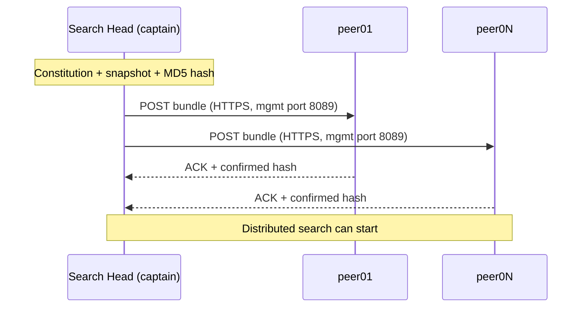

# Splunk — knowledge bundle (classic replication) — Quick reference

## Purpose

Incident-oriented quick reference for the *knowledge bundle* of a Splunk search head
distributing its searches to **search peers** (indexers) under **classic
replication** — the default policy, SH → all peers in parallel. Covers the
fundamentals, the **prerequisite** (bundle constitution + snapshot + configuration
replication in SHC), and the **checkpoints** when a distributed search does not
return what it should.

Out of scope for this sheet: *cascading* (relay), *mounted* (shared FS),
*configuration bundle* SHC (deployer → members) and *cluster bundle* indexer
(manager → peers). For the full theoretical and operational detail → [See also](#see-also).

## Fundamentals

| Item | Value |
|---|---|
| What | Archive (`.bundle`) consolidating `etc/apps/` + `etc/users/` + `etc/system/local/` of the SH, filtered through allow/denylist |
| Who pushes | Each **search head** (or the SHC **captain**) to all of its search peers |
| Where on the peer | `$SPLUNK_HOME/var/run/searchpeers/<sh-guid>-<timestamp>/` |
| When | At the **start** of a distributed search if the bundle hash ≠ last one sent |
| Conf | `distsearch.conf` `[replicationSettings]`, `[replicationDenylist]`, `[replicationAllowlist]` |
| Identity | MD5 hash of the archive — drives the "re-send or not" decision |

Three bundles **not to confuse**:

1. **Knowledge bundle** — SH → search peers. *Subject of this sheet.*
2. **SHC configuration bundle** — deployer → SHC members (baseline apps/configurations).
3. **Indexer cluster configuration bundle** — manager → indexer peers.

Splunk reference: [Knowledge bundle replication overview 9.4](https://docs.splunk.com/Documentation/Splunk/9.4.1/DistSearch/Knowledgebundlereplication).

## Prerequisites — what happens BEFORE the bundle goes out

### 1. Bundle constitution / snapshot

At each cycle (first distributed-search event, conf change, mtime), the SH:

1. Walks `etc/apps/`, `etc/users/`, `etc/system/local/`.
2. **Filters** through `[replicationDenylist]` (formerly `[replicationBlacklist]`) and `[replicationAllowlist]`.
3. Computes MD5 on the retained content → **snapshot**.
4. If hash ≠ last hash sent → archive constitution and push trigger.

### 2. Configuration replication in SHC (`confOp`)

**Crucial in SHC**: the captain can only push a consistent bundle if the conf of **all** members is already aligned. That is the job of `ConfReplicationThread`:

- Any local edit on a member under `etc/{apps,users,system/local}/` → `op` (operation) packaged → push to the captain → captain replicates to the other members.
- Cadence driven by `server.conf [shclustering] conf_replication_period` (default ~5 s).
- Max volume per cycle: `conf_replication_max_pull_count` (default 1000, 0 = unlimited).
- Visible in `splunkd.log`: component `ConfReplicationThread`.

→ **As long as confOp is late or in error, the bundle sent reflects an inconsistent state.** This is cause #1 of "I edited my savedsearch and it does not fire on all peers."

### 3. Classic replication cycle



**Classic = SH talks to each peer.** Cost that explodes above ~15–20 peers → switch
to cascading. The active policy can be checked with:

```bash
splunk btool distsearch list replicationSettings | grep replicationPolicy
# replicationPolicy = classic    (by default)
```

## Core commands

### Identify and inspect — on the SH

```bash
# Active policy + size parameters
splunk btool distsearch list replicationSettings

# Effective bundle blacklist/allowlist (what goes out, what stays)
splunk btool distsearch list replicationDenylist
splunk btool distsearch list replicationAllowlist

# List of search peers seen by this SH + their state
splunk show distributed-peers -auth admin:<password>

# Effective size of the last generated bundle
du -sh $SPLUNK_HOME/var/run/<bundle>      # the most recent `.bundle`
```

### On the peer side — where the bundle lands

```bash
ls -lh $SPLUNK_HOME/var/run/searchpeers/  # one subfolder per known SH
# format: <sh-guid>-<timestamp>
```

### Via REST (prefer for automation)

```bash
# List of peers known to the SH (Splexicon "search peer")
curl -sk -u admin:<password> https://<sh>:8089/services/search/distributed/peers

# Active replication config (cycles, policy, metrics)
curl -sk -u admin:<password> https://<sh>:8089/services/search/distributed/bundle/replication/config
curl -sk -u admin:<password> https://<sh>:8089/services/search/distributed/bundle/replication/cycles

# SHC captain: cluster health (before looking at the bundle side)
curl -sk -u admin:<password> https://<sh>:8089/services/shcluster/captain/info
```

### Useful `index=_internal` searches

```spl
# SH-side errors on bundle replication
index=_internal sourcetype=splunkd component=DistributedBundleReplicationManager
  ( log_level=WARN OR log_level=ERROR )
| stats count by host, log_level, message

# SHC confOp traffic (conf replication between members) — prerequisite to bundle
index=_internal sourcetype=splunkd component=ConfReplicationThread log_level!=INFO
| stats count by host, log_level

# Captain view: bundle pushes
index=_internal sourcetype=splunkd component=BundleReplicator
| stats count by host, log_level
```

## Checkpoints — when things break

Read top to bottom. Each line = observable symptom → 2-3 checks → reflex.

| Symptom | Checks in order | Reflex |
|---|---|---|
| Distributed search returns partial results, warning "*N peers did not return*" | (1) `splunk show distributed-peers` → peer in `Down`/`Quarantined`? (2) `splunkd.log component=DistributedBundleReplicationManager log_level=ERROR` | A KO peer does not receive the bundle; search truncated. Wake up the peer or temporarily remove it from the `serverList`/`servers`. |
| Error "*bundle exceeds max content length*" or "*bundle too large*" | (1) `du -sh` of the last `.bundle` (2) `btool distsearch list replicationSettings \| grep -E 'maxBundleSize\|max_content_length'` | **Lever on the SH side = `maxBundleSize` (MB).** If you raise it on the SH side, raise `max_content_length` (bytes) **symmetrically on the peer side**, otherwise the peer rejects. Before that: broaden `[replicationDenylist]` (large lookups, heavy internal app). |
| `savedsearches.conf` change made on an SH but inactive on the distributed search | (1) Are you in SHC? (2) `component=ConfReplicationThread log_level!=INFO` → error? (3) Sent bundle hash unchanged? | **confOp not replicated** → captain pushes a previous state. Force a `splunk apply shcluster-bundle` (if the change went through the deployer) or wait for the next `conf_replication_period` cycle. |
| Bundle sent OK but peer responds with a different hash or a consistency error | (1) `ls $SPLUNK_HOME/var/run/searchpeers/<sh-guid>-*` on the peer side → old bundles not purged? (2) Peer logs `splunkd.log` path `DistributedPeerManagerHeartbeat` | Corrupted peer cache or partial reception. Stop the peer, clean stale `var/run/searchpeers/<sh-guid>-*` (keep the most recent), restart. |
| Peer fully absent: `show distributed-peers` does not list it | (1) Does `distsearch.conf [distributedSearch] servers` contain the URI? (2) `nc -zv <peer> 8089` (3) TLS cert / divergent `pass4SymmKey`? | Not even an attempt to bundle. Network / TLS / auth first — replication fails silently if the management session does not establish. |
| Search stuck *waiting* for the bundle (no error, just latency) | (1) `component=BundleReplicator` log_level=INFO → cycle in progress? (2) Bundle size vs network throughput (3) How many target peers? | Classic at 30+ peers = network saturation on the SH side. Switch to **cascading** rather than patch classic. |
| Allowlist/denylist seems ignored | (1) `btool distsearch list replicationDenylist --debug` → effective source file (2) Check precedence `system/local` > `apps/<x>/local` > `apps/<x>/default` | A stanza in `etc/system/local/distsearch.conf` overrides everything. And `replicationAllowlist` is exclusive when present: anything not listed is excluded. |

### Top-5 commands to memorize

```bash
splunk show distributed-peers -auth admin:<password>     # who is reachable?
splunk btool distsearch list replicationSettings         # resolved config
du -sh $SPLUNK_HOME/var/run/<bundle>                     # actual size sent
# On the peer:
ls -lh $SPLUNK_HOME/var/run/searchpeers/                 # what arrived
# On the SH:
index=_internal sourcetype=splunkd component=DistributedBundleReplicationManager log_level!=INFO
```

## Common pitfalls

- **Confusing `maxBundleSize` (on the SH side, MB) and `max_content_length` (on the indexer side, bytes).**
  Reflex: raise both symmetrically. See [ch. 02 of the handbook](../../handbooks/splunk-shc-knowledge-bundle/EN/02-knowledge-bundle-constitution.md).
- **Believing that editing in SHC propagates instantly.** The bundle sent reflects the
  *captain* state, which depends on `ConfReplicationThread`. Non-`confOp`-replicated edit = bundle
  that ignores the change. First SHC check: `component=ConfReplicationThread`.
- **Exclusive allowlist.** Presence of `[replicationAllowlist]` = strict whitelist mode;
  anything not listed is removed from the bundle.
- **Large non-blacklisted lookups** — main cause of `maxBundleSize` overshoot.
  Reflex: blacklist `apps/<x>/lookups/*.csv` above a certain size, expose the
  content through an index or a KV store on the SH side rather than as a static file.
- **`/services/admin/distsearch` for control** — Splunk does NOT document the `/admin/*`
  endpoints. Use `/services/search/distributed/*` to stay on public REST.
- **Forcing a push**: there is no `splunk push knowledge-bundle`. The push is
  triggered by the first search event after a hash change. To force:
  run a `| metadata index=_internal` which triggers the distributed search.

## See also

- Full handbook: [`handbooks/splunk-shc-knowledge-bundle/EN/`](../../handbooks/splunk-shc-knowledge-bundle/EN/README.md)
  - [Foundations — the 3 bundles](../../handbooks/splunk-shc-knowledge-bundle/EN/00-foundations.md)
  - [Ch. 02 — knowledge bundle constitution](../../handbooks/splunk-shc-knowledge-bundle/EN/02-knowledge-bundle-constitution.md)
  - [Ch. 03 — classic / cascading / mounted replication](../../handbooks/splunk-shc-knowledge-bundle/EN/03-replication-to-peers.md)
  - [Ch. 05 — full decision tree](../../handbooks/splunk-shc-knowledge-bundle/EN/05-troubleshooting-decision-tree.md)
  - [Ch. 06 — CLI / REST / logs / SPL toolbox](../../handbooks/splunk-shc-knowledge-bundle/EN/06-investigations.md)
- Concepts: [Deployment server](splunk-deployment-server.md) (not to be confused — this one is for forwarders, not SHC)
- Sheet [Splunk administration / CLI](../splunk-admin.md) — `btool`, `_internal`, `splunkd.log`
- Sheet [Secrets & SSH](../secrets-ssh.md) — `op read` to avoid writing `-auth admin:<password>` in clear
