# Git — Cheat-sheet

## Écraser un remote avec un dépôt local neuf

Initialiser localement et forcer le push, remplaçant définitivement le contenu distant.

```bash
cd /chemin/dossier-local
git init
git add .
git commit -m "Initial commit"
git remote add origin <URL_DU_REMOTE>
git branch -M main
git push --force origin main
```

`--force-with-lease` : variante prudente, échoue si le remote a divergé. Inadaptée à un écrasement volontaire.
Si le push est rejeté : branche protégée côté serveur (GitHub/GitLab/Bitbucket) → désactiver la protection, pousser, réactiver.

## Configuration initiale

```bash
git config --global user.name "Nom"
git config --global user.email "mail@exemple.fr"
git config --global init.defaultBranch main
git config --global pull.rebase true        # rebase au lieu de merge sur pull
git config --list
```

## Démarrer un dépôt

```bash
git init                          # nouveau dépôt local
git clone <url>                   # cloner un remote
git clone <url> <dossier>         # cloner dans un dossier nommé
git clone --depth 1 <url>         # clone superficiel (dernier commit)
```

## État et inspection

```bash
git status
git status -s                     # format court
git diff                          # modifications non indexées
git diff --staged                 # modifications indexées
git log --oneline --graph --all   # historique condensé visuel
git log -p <fichier>              # historique avec diffs d'un fichier
git show <commit>                 # détail d'un commit
git blame <fichier>               # qui a modifié quelle ligne
```

## Indexation et commit

```bash
git add <fichier>
git add .                         # tout le répertoire courant
git add -p                        # indexation interactive par morceaux
git commit -m "message"
git commit -am "message"          # add (fichiers suivis) + commit
git commit --amend                # modifier le dernier commit
git commit --amend --no-edit      # ajouter au dernier commit sans changer le message
```

## Branches

```bash
git branch                        # lister
git branch <nom>                  # créer
git switch <nom>                  # changer (moderne)
git switch -c <nom>               # créer et changer
git checkout <nom>                # changer (ancien)
git checkout -b <nom>             # créer et changer (ancien)
git branch -d <nom>               # supprimer (sécurisé)
git branch -D <nom>               # supprimer (forcé)
git branch -m <ancien> <nouveau>  # renommer
```

## Fusion et rebase

```bash
git merge <branche>               # fusionner dans la branche courante
git merge --no-ff <branche>       # fusion avec commit de merge explicite
git rebase <branche>              # rejouer les commits sur <branche>
git rebase -i HEAD~3              # rebase interactif (squash, reword, drop...)
git rebase --abort                # annuler un rebase en cours
git rebase --continue             # reprendre après résolution de conflit
```

## Remotes

```bash
git remote -v                     # lister
git remote add origin <url>
git remote set-url origin <url>   # changer l'URL
git remote remove origin
git fetch                         # récupérer sans fusionner
git pull                          # fetch + merge/rebase
git push                          # pousser
git push -u origin <branche>      # pousser et suivre la branche
git push --force origin <branche> # écraser le remote
git push --tags                   # pousser les tags
```

## Annuler / corriger

```bash
git restore <fichier>             # annuler modifs non indexées (moderne)
git restore --staged <fichier>    # désindexer
git checkout -- <fichier>         # annuler modifs (ancien)
git reset <fichier>               # désindexer (ancien)
git reset --soft HEAD~1           # annuler dernier commit, garder modifs indexées
git reset --mixed HEAD~1          # annuler dernier commit, garder modifs non indexées
git reset --hard HEAD~1           # annuler dernier commit ET les modifs (destructif)
git revert <commit>               # annuler un commit via un nouveau commit (sûr)
git clean -fd                     # supprimer fichiers/dossiers non suivis (destructif)
```

## Stash

```bash
git stash                         # remiser les modifs en cours
git stash -u                      # inclure les fichiers non suivis
git stash list
git stash pop                     # restaurer et retirer de la pile
git stash apply                   # restaurer sans retirer
git stash drop                    # supprimer le dernier stash
```

## Tags

```bash
git tag                           # lister
git tag <nom>                     # tag léger
git tag -a v1.0 -m "version 1.0"  # tag annoté
git push origin <tag>
git tag -d <nom>                  # supprimer localement
git push origin --delete <tag>    # supprimer sur le remote
```

## Récupération

```bash
git reflog                        # historique de tous les déplacements de HEAD
git reset --hard <hash>           # revenir à un état depuis le reflog
git cherry-pick <commit>          # appliquer un commit isolé sur la branche courante
```

`git reflog` permet de retrouver des commits "perdus" après un reset --hard ou un rebase raté, tant que le garbage collector n'est pas passé (~30 jours par défaut).

## Enchaînements classiques (sur lesquels la plupart butent)

### Pousser une nouvelle branche locale vers le remote

```bash
git switch -c ma-feature
# ...commits...
git push -u origin ma-feature     # -u crée le suivi : ensuite `git push` suffit
```

### Récupérer une branche distante créée par un collègue

```bash
git fetch origin
git switch ma-feature             # crée la branche locale qui suit origin/ma-feature
# variante explicite :
git switch -c ma-feature --track origin/ma-feature
```

### Mettre à jour sa branche avec `main` (rebase propre)

```bash
git fetch origin
git rebase origin/main
# en cas de conflit :
#   éditer les fichiers, puis :
git add <fichier-résolu>
git rebase --continue
# si on s'embourbe :
git rebase --abort
```

### Re-pousser après un rebase (sans écraser le travail d'autrui)

```bash
git push --force-with-lease       # refuse de pousser si quelqu'un d'autre a poussé entre-temps
```
À préférer systématiquement à `--force` sur une branche partagée (PR).

### J'ai commité sur `main` par erreur, je veux déplacer ces commits sur une branche

```bash
git branch ma-feature             # crée la branche au HEAD actuel (garde les commits)
git reset --hard origin/main      # remet main à l'état du remote
git switch ma-feature             # le travail est ici
```

### Squash des N derniers commits en un seul

```bash
git rebase -i HEAD~3
# dans l'éditeur : laisser "pick" sur le 1er, mettre "squash" (ou "s") sur les suivants
# sauvegarder, puis éditer le message final
```

### Annuler un commit déjà poussé (sans réécrire l'historique)

```bash
git revert <hash>                 # crée un commit qui inverse les changements
git push
```

### Récupérer un seul fichier depuis une autre branche

```bash
git checkout autre-branche -- chemin/fichier
# ou (moderne) :
git restore --source=autre-branche -- chemin/fichier
```

### Sortir d'un état "detached HEAD" sans perdre le travail

```bash
git switch -c sauvegarde          # transforme l'état détaché en vraie branche
```

### Résoudre un conflit pendant un merge

```bash
git merge ma-branche
# conflits → éditer les fichiers (chercher <<<<<<<)
git add <fichier-résolu>
git commit                        # message de merge pré-rempli
# ou tout annuler :
git merge --abort
```

### Renommer une branche locale ET côté remote

```bash
git branch -m ancien nouveau
git push origin -u nouveau
git push origin --delete ancien
```

### Synchroniser un fork avec l'upstream

```bash
git remote add upstream <url-du-repo-original>     # une fois pour toutes
git fetch upstream
git switch main
git rebase upstream/main          # ou : git merge upstream/main
git push                          # met à jour le fork
```

### Supprimer un fichier sensible déjà commité (et le .gitignore-er)

```bash
echo ".env" >> .gitignore
git rm --cached .env
git commit -m "Retire .env du suivi"
git push
```
Le fichier reste dans l'historique. Pour purge complète : `git filter-repo` (rotation des secrets recommandée à la place).

### "Oups, j'ai fait `reset --hard`, j'ai tout perdu"

```bash
git reflog                        # repérer le hash d'avant le reset
git reset --hard <hash>
```

### Mettre de côté pour faire un `git pull` rapide

```bash
git stash -u
git pull --rebase
git stash pop
# si conflit au pop : résoudre, puis `git stash drop` pour nettoyer
```

### Réécrire le message du dernier commit (déjà poussé)

```bash
git commit --amend -m "Nouveau message"
git push --force-with-lease
```

### Supprimer toutes les branches locales déjà fusionnées

```bash
git branch --merged main | grep -v '^\*\| main$' | xargs -n 1 git branch -d
```

## .gitignore

```bash
# Fichier
*.log
.env
node_modules/

# Exception
!important.log

# Cesser de suivre un fichier déjà commité après l'avoir ajouté au .gitignore
git rm --cached <fichier>
```

## Visualisation : ce que chaque commande provoque

Galerie de schémas montrant l'**effet** de chaque commande sur le graphe de
commits ou sur les trois zones. Pour le *pourquoi* derrière ces gestes →
[fiche concept : modèle mental de Git](../concepts/git-modele-mental.md).

**Conventions de couleur** (identiques dans tous les schémas ci-dessous) :

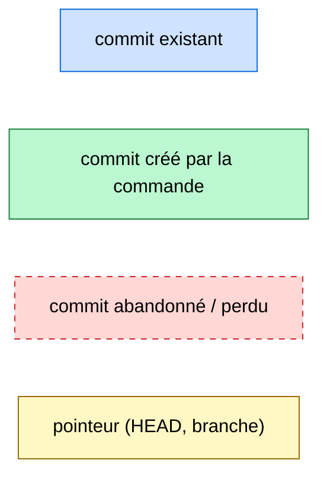

> Dans les graphes, les flèches suivent l'**ordre chronologique** (le plus ancien
> à gauche). En interne Git pointe l'inverse (enfant → parent), mais pour *voir*
> ce qu'une commande fait, le sens du temps est plus parlant.

### `git add` / `git commit` — du working tree au dépôt

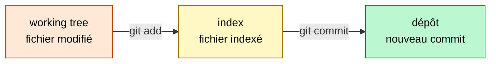

### `git commit` — la branche courante avance

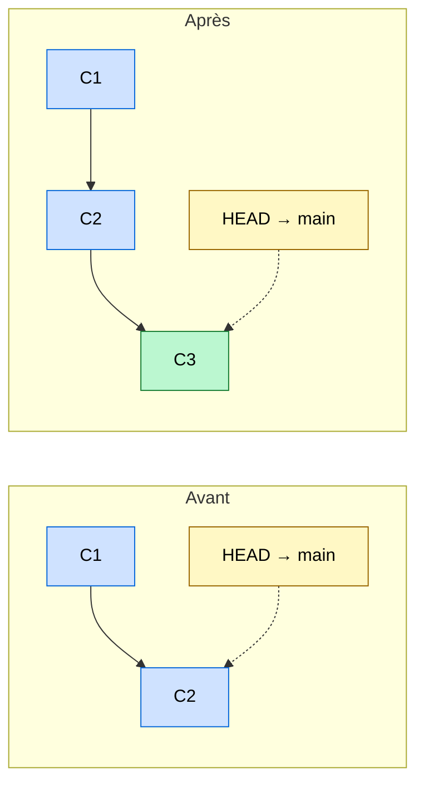

### `git switch -c feature` — créer une branche (rien n'est copié)

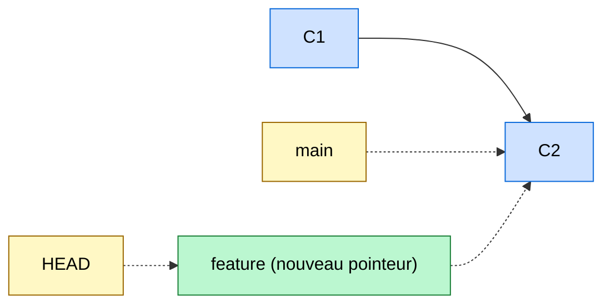

### `git merge` (avec commit de fusion)

Deux branches divergentes réunies par un commit à deux parents.

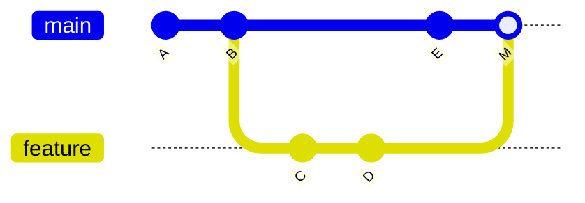

### `git merge --ff` (fast-forward) — pas de commit de fusion

Quand `main` n'a pas divergé, le pointeur **glisse** simplement en avant.

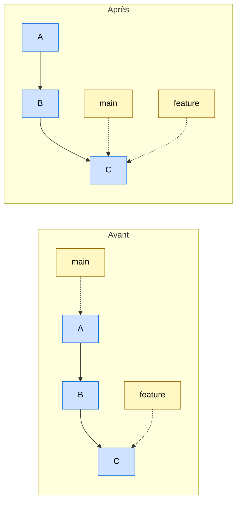

### `git rebase main` — rejouer ses commits ailleurs (nouveaux hash)

Les commits `C`,`D` sont **recréés** au sommet de `main` ; les originaux sont
abandonnés.

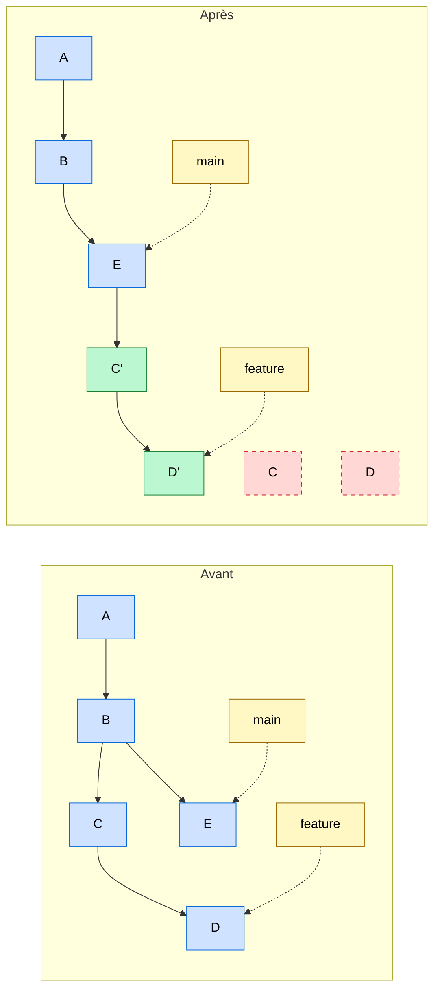

### `git reset` — la branche recule, effet variable sur les zones

`reset --soft/--mixed/--hard HEAD~1` ramène `main` sur `C2`. Le commit `C3` n'est
plus référencé (récupérable via `reflog`). Ce qui **change**, c'est le sort des
modifs de `C3` :

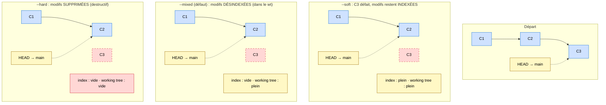

### `git revert C2` — annuler par un nouveau commit (rien n'est perdu)

`C2` reste dans l'historique ; un commit `R` qui inverse ses changements est
ajouté. C'est le geste sûr pour l'historique **déjà poussé**.

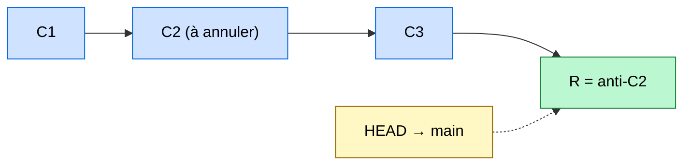

### `git cherry-pick` — transplanter un commit isolé

Le contenu de `C` (sur `feature`) est rejoué sur `main` sous un **nouveau hash**.

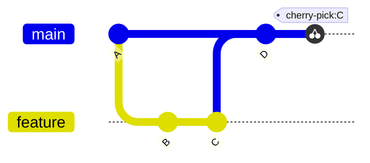

### `git stash` / `git stash pop` — mettre de côté puis restaurer

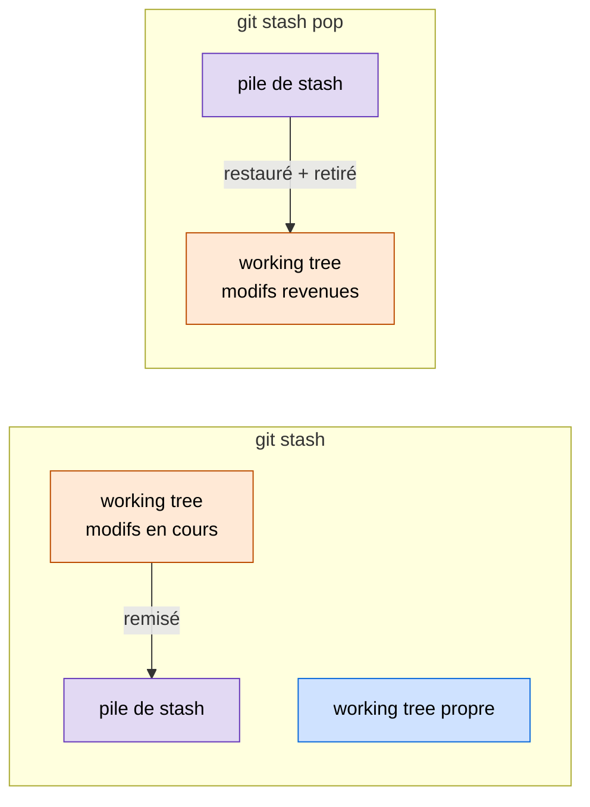

### `git fetch` / `git pull` / `git push` — synchroniser avec le remote

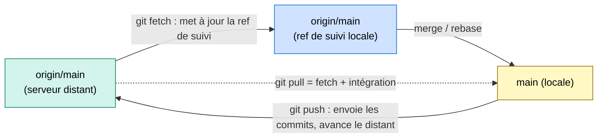

> `fetch` est sûr (ne touche ni `main` locale ni les fichiers). `pull` peut créer
> des conflits. `push` est refusé si le distant a divergé (intégrer d'abord).

## Commandes à effets voisins : laquelle choisir

Plusieurs commandes produisent un résultat *qui se ressemble* mais répondent à des
intentions différentes. Cette section les départage. Le modèle sous-jacent (objets,
pointeurs, zones) est détaillé dans la [fiche concept](../concepts/git-modele-mental.md).

### merge vs rebase — intégrer le travail d'une autre branche

Même but (récupérer les commits de `main` dans ma branche, ou l'inverse), deux
philosophies d'historique.

| | `git merge` | `git rebase` |
|---|---|---|
| Historique | **préservé** : branches parallèles + commit de fusion | **réécrit** : linéaire, comme si on avait codé après coup |
| Hash des commits | inchangés | **recréés** (nouveaux hash) |
| Traçabilité | montre la réalité (quand/comment ça a fusionné) | gomme la divergence (plus lisible, moins fidèle) |
| Sur des commits déjà poussés/partagés | **sûr** | **dangereux** (réécrit l'histoire des autres) |
| Conflits | résolus **une fois**, à la fusion | résolus **commit par commit** (potentiellement plusieurs fois) |

**Quand préférer quoi :**

- **rebase** pour **nettoyer une branche locale et privée** avant de la partager :
  mettre sa feature à jour sur `main` (`git rebase main`), squasher, réordonner.
  Objectif = un historique propre et linéaire à proposer en revue.
- **merge** pour **intégrer du public** ou conserver la trace d'une fusion :
  ramener une feature terminée dans `main`, ou tout cas où réécrire des commits
  déjà poussés casserait le travail d'autrui.

> **Règle d'or : rebase ce qui est local et privé, merge ce qui est public.**
> Et sur une branche partagée, si tu as quand même rebasé : `--force-with-lease`,
> jamais `--force`.

### merge (classique) vs cherry-pick — tout intégrer ou un seul commit

| | `git merge feature` | `git cherry-pick <commit>` |
|---|---|---|
| Quantité intégrée | **toute** la branche (tous ses commits) | **un** commit choisi (ou une plage) |
| Lien d'historique | conservé (la fusion est tracée) | **aucun** : le commit est copié, recréé ailleurs |
| Résultat | les deux historiques convergent | un diff **dupliqué** (original + copie, hash différent) |
| Intention | « cette branche est finie, je l'absorbe » | « je veux juste *ce* correctif-là » |

**Quand préférer quoi :**

- **merge** quand la branche entière doit rejoindre la cible (cas normal d'une
  feature terminée).
- **cherry-pick** pour **extraire un correctif isolé** sans embarquer le reste :
  typiquement **backporter** un fix de `main` vers une branche de release, ou
  récupérer un commit utile d'une branche encore en chantier.

> ⚠️ Comme cherry-pick **duplique** le diff, merger plus tard la branche d'origine
> peut produire un conflit ou un commit « vide » (le même changement arrive deux
> fois). Le merge classique ne crée jamais ce doublon.

### merge --ff vs cherry-pick — pourquoi ce n'est pas la même chose

Les deux donnent un historique linéaire, d'où la confusion. Mais :

- **`merge --ff`** ne crée **aucun** commit : il fait **glisser un pointeur** le
  long d'une ligne qui existe déjà (possible seulement si la cible n'a **pas**
  divergé). Les commits gardent leur hash.
- **`cherry-pick`** **fabrique** un nouveau commit (hash neuf) en rejouant un diff,
  et marche **même entre branches divergentes**.

> En une phrase : **`merge --ff` adopte des commits existants en bougeant un
> pointeur ; `cherry-pick` en fabrique de nouveaux en copiant un diff.**

### reset vs revert — annuler un commit

| | `git reset` | `git revert` |
|---|---|---|
| Mécanisme | **recule** la branche (réécrit l'historique) | **ajoute** un commit qui inverse (préserve l'historique) |
| Le commit annulé | disparaît de la branche (récupérable via reflog) | reste visible dans l'historique |
| Sur du déjà poussé | **dangereux** (force-push nécessaire) | **sûr** (commit normal, `push` simple) |
| Usage | corriger **en local** avant partage | annuler **proprement** quelque chose de **public** |

**Quand préférer quoi :** `reset` tant que c'est local et non partagé ; `revert`
dès que le commit fautif est déjà sur le remote.

### restore vs reset vs checkout — annuler des modifications

Trois commandes se chevauchent historiquement sur « annuler / restaurer ».

| Intention | Commande recommandée (moderne) | Équivalent ancien |
|---|---|---|
| Jeter les modifs **non indexées** d'un fichier | `git restore <f>` | `git checkout -- <f>` |
| **Désindexer** (garder les modifs, vider l'index) | `git restore --staged <f>` | `git reset <f>` |
| Récupérer un fichier **depuis un autre commit/branche** | `git restore --source=<ref> <f>` | `git checkout <ref> -- <f>` |
| Changer de branche | `git switch <b>` | `git checkout <b>` |

> `restore` (fichiers) et `switch` (branches) ont été créés pour **désambiguïser**
> l'ancien `checkout`, qui faisait tout. À privilégier : l'intention est explicite.

### La gestion des conflits : un rituel commun à toutes ces commandes

Bonne nouvelle : **merge, rebase, cherry-pick, revert et `stash pop` gèrent les
conflits exactement de la même façon.** Git met l'opération en pause, écrit les
marqueurs `<<<<<<<` / `=======` / `>>>>>>>` dans les fichiers, et attend :

```bash
# 1. éditer chaque fichier en conflit (supprimer les marqueurs, garder le bon contenu)
# 2. marquer comme résolu :
git add <fichier-résolu>
# 3. continuer l'opération — la commande dépend du contexte :
git commit            # pour un merge (message pré-rempli)
git rebase --continue # pour un rebase
git cherry-pick --continue
git revert --continue
# ou tout annuler et revenir à l'état d'avant :
git merge --abort  /  git rebase --abort  /  git cherry-pick --abort
```

**La seule vraie différence** porte sur le **nombre de fois** où un conflit peut
surgir :

- **merge / cherry-pick (1 commit) / revert** : la résolution se fait **en une
  passe** (un seul point de conflit).
- **rebase** : chaque commit rejoué peut entrer en conflit → on peut résoudre
  **plusieurs fois de suite** (un `--continue` après chaque). C'est le prix de
  l'historique linéaire, et la raison pour laquelle un gros rebase est plus
  pénible qu'un merge unique.

> `git status` rappelle toujours, pendant un conflit, les fichiers à résoudre et la
> commande de continuation exacte. En cas de doute : `--abort` et on recommence.
