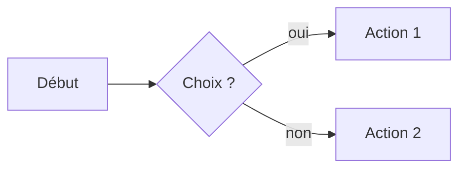
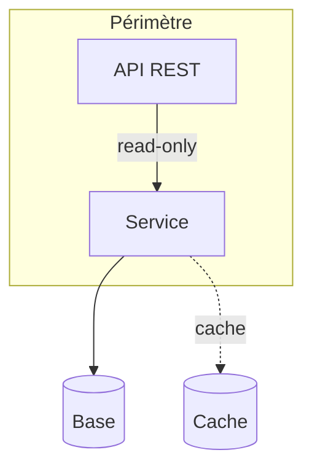
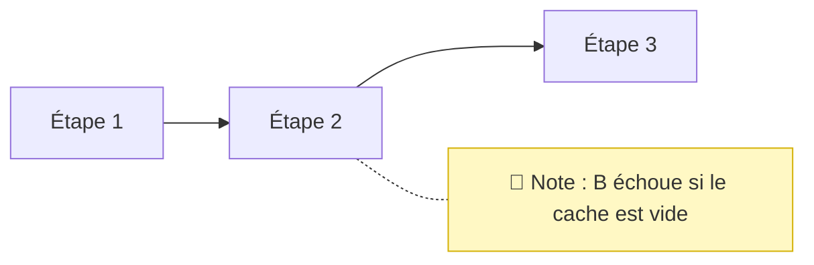
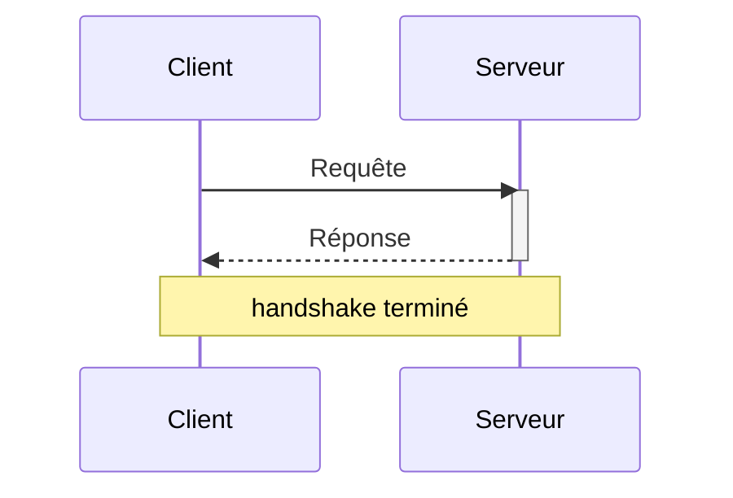
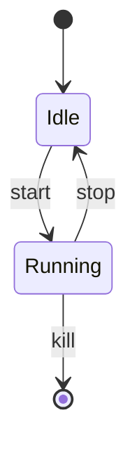
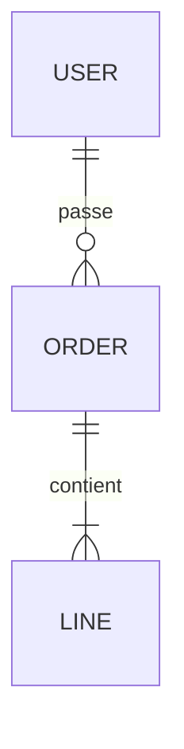
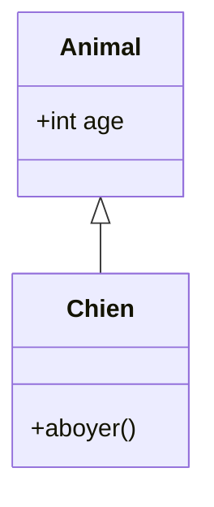
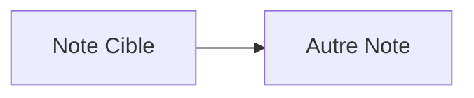
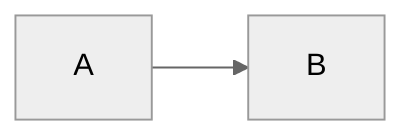
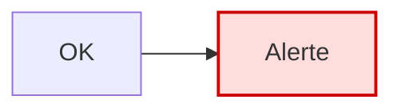

# Mermaid dans Obsidian — Cheat-sheet

## À quoi ça sert

[Mermaid](https://mermaid.js.org/) génère des diagrammes à partir de texte, dans un bloc
de code. Obsidian embarque Mermaid nativement : un bloc ` ```mermaid ` est rendu en image
en mode Aperçu (et en Live Preview). Cette fiche couvre, de façon **générique**, les types
de diagrammes les plus utiles et les **spécificités Obsidian** (liens internes vers des
notes, thème, directives).

> **Lecture de cette fiche.** Chaque exemple est donné **rendu** (le diagramme) suivi de son
> **code source** juste en dessous, pour lire l'un en regardant l'autre. Le bloc de code est
> copiable tel quel : il inclut la clôture ` ```mermaid `.

> **Portabilité.** GitHub et Forgejo rendent aussi Mermaid, mais **pas** les extensions
> propres à Obsidian (liens internes, thème). Un diagramme destiné à un `README` lu sur
> GitHub/Forgejo doit rester en Mermaid « pur ». Voir [Pièges fréquents](#pièges-fréquents).

## Syntaxe de base

Tout diagramme vit dans un bloc de code dont le langage est `mermaid` :

````markdown

````

…qui s'affiche :


- Premier mot = **type de diagramme** (`flowchart`, `sequenceDiagram`, …).
- `%%` en début de ligne = **commentaire** (non rendu).
- Texte avec caractères spéciaux (`()`, `:`, `#`…) → **entre guillemets** : `A["Lit /etc (conf)"]`.
- Retour à la ligne dans un label : `<br>`. Caractère réservé : entité HTML, ex. `#35;` pour `#`.

### Flowchart (organigramme / flux)

Le plus courant pour la doc d'archi (flux de données, composants).



````markdown

````

- Direction : `TD`/`TB` (haut→bas), `LR` (gauche→droite), `RL`, `BT`.
- Formes : `[texte]` rectangle, `(texte)` arrondi, `([texte])` stade, `[(texte)]` cylindre/BDD,
  `{texte}` losange/décision, `((texte))` cercle, `>texte]` drapeau.
- Liens : `-->` plein, `---` sans flèche, `-.->` pointillé, `==>` épais, `-- libellé -->` annoté.
- `subgraph Nom["Titre"] … end` regroupe des nœuds.

#### Annotations (« notes »)

Le flowchart n'a **pas** de bloc `Note` natif (réservé à `sequenceDiagram`). On simule une
annotation avec un nœud relié par un **lien pointillé sans flèche** (`-.-`), stylé en post-it :



````markdown

````

- `-.-` = lien pointillé sans flèche : signale « annotation », pas un flux.
- Le `style` jaune donne l'aspect post-it ; sans lui, c'est un nœud ordinaire.
- Varier la forme pour distinguer la note : `N[/"texte"/]` parallélogramme, `N>"texte"]` drapeau.
- `%%` reste réservé aux commentaires **du code** (non rendus) — ce n'est pas une note visible.

### Sequence (séquence / échanges)



````markdown

````

- `->>` message plein, `-->>` réponse pointillée, `-x` échec.
- `activate`/`deactivate` (ou `S->>+S` / `S-->>-C`) pour les barres d'activation.
- `loop`, `alt`/`else`, `opt`, `par` pour les blocs de contrôle.

### State (machine à états)



````markdown

````

### ER (entités-relations)



````markdown

````

Cardinalités : `||` un, `o{` zéro-à-plusieurs, `|{` un-à-plusieurs.

### Class (classes / héritage)



````markdown

````

### Autres types utiles

- `gantt` — planning (sections, dates, durées).
- `pie` — camembert (`pie title X` puis `"label" : valeur`).
- `mindmap` — carte mentale (indentation = hiérarchie).
- `gitGraph` — branches git.
- `timeline`, `quadrantChart` — selon la version de Mermaid embarquée.

## Spécificités Obsidian

### Lier un nœud à une note (clic → ouvre la note)

Fonctionnalité **propre à Obsidian** : ajouter un nœud à la classe `internal-link`. Le
**texte du nœud** sert de nom de note cible.



````markdown

````

Cliquer sur `A` ouvre la note nommée « Note Cible ». **Ne fonctionne pas** sur GitHub/Forgejo
(le `class … internal-link` y est ignoré).

### Thème

Obsidian applique automatiquement le thème clair/sombre du vault. Pour forcer un thème ou
des couleurs, directive d'init en tête de diagramme :



````markdown

````

Thèmes : `default`, `neutral`, `dark`, `forest`, `base`. Avec `base`, on personnalise via
`themeVariables`.

### Style ponctuel d'un nœud



````markdown

````

## Pièges fréquents

- **Wikilink `[[Note]]` brut dans un label** : non interprété comme lien — affiché tel quel
  et peut casser le parsing. Pour lier une note, utiliser la classe `internal-link` (ci-dessus),
  pas la syntaxe `[[ ]]`.
- **Caractères spéciaux non quotés** : une parenthèse, un `:`, un `#` ou une espace dans un
  label sans guillemets fait planter le rendu (« syntax error »). Réflexe : `A["mon (label)"]`.
- **Diagramme qui marche dans Obsidian, cassé sur GitHub/Forgejo** : les liens internes
  (`internal-link`) et le thème du vault sont des extensions Obsidian. Pour un `README`
  multi-plateforme, s'en tenir au Mermaid standard et tester le rendu sur la cible.
- **Version de Mermaid différente** : Obsidian, GitHub et Forgejo embarquent chacun **leur**
  version de Mermaid. Un type récent (`mindmap`, `timeline`, `quadrantChart`) peut rendre ici
  et pas là. Vérifier sur la plateforme de destination.
- **Indentation / espaces** : `mindmap` et `gantt` sont sensibles à l'indentation ; mélanger
  tabulations et espaces casse la hiérarchie.
- **Bloc non rendu = mauvais langage de fence** : le mot après les backticks doit être
  exactement `mermaid` (pas `Mermaid` ni `mmd`).
- **`graph` vs `flowchart`** : `graph TD` (ancien) et `flowchart TD` (recommandé) coexistent ;
  préférer `flowchart` pour les nouveautés de syntaxe.

## Voir aussi

- [Git](./git.md) — versionner la doc contenant les diagrammes.
- [Documentation officielle Mermaid](https://mermaid.js.org/intro/) — syntaxe complète et live editor.
- [Live editor Mermaid](https://mermaid.live/) — tester un diagramme avant de le coller dans une note.
