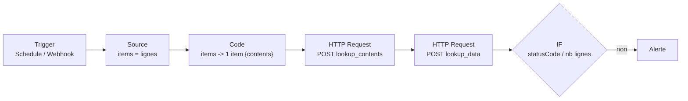

# n8n : ajouter, modifier, supprimer une lookup Splunk via Lookup Editor

## À quoi ça sert

Alimenter une lookup CSV Splunk depuis un workflow n8n (export d'un référentiel, formulaire,
webhook) sans script. Tout passe par le nœud **HTTP Request** vers l'API décrite dans
[Lookup Editor : API REST](./splunk-lookup-editor-api.md), où sont listés les droits
nécessaires.

Validé de bout en bout : n8n 2.x self-hosted, Splunk 9.4.6 en SHC, Lookup Editor 4.0.8,
compte de service à jeton. Chaîne testée : création, création répétée, lecture, fusion,
mise à jour, relecture, suppression, relecture.

## Le workflow minimal



| Action | Nœud | Méthode | URL | Retour mesuré |
|---|---|---|---|---|
| Ajouter | HTTP Request | POST | `https://<sh>:8089/services/data/lookup_edit/lookup_contents` + `isNew=true` | 200, corps `None` ; 409 si elle existe |
| Lire | HTTP Request | POST | `https://<sh>:8089/services/data/lookup_edit/lookup_data` | 200, tableau de tableaux ; 404 si absente |
| Remplacer | HTTP Request | POST | `.../lookup_edit/lookup_contents` sans `isNew` | 200, corps = chemin du fichier |
| Modifier quelques lignes | lire -> **Code** (fusion) -> remplacer | | | |
| Supprimer | HTTP Request | DELETE | `https://<sh>:8089/servicesNS/nobody/<app>/data/lookup-table-files/<f>.csv` | 200 |

## Configuration du nœud HTTP Request

**Credential** : *Generic Credential Type* -> *Header Auth*, nom `Authorization`, valeur
`Bearer <token>`. Le jeton reste dans la credential, jamais en dur dans le nœud.

**Corps** : *Send Body* activé, **Body Content Type = Form Urlencoded**, *Using Fields Below* :

```text
namespace    my_app
owner        nobody
lookup_file  assets.csv
isNew        true                              (création seule, sinon omettre)
contents     {{ JSON.stringify($('Build contents').first().json.contents) }}
```

**Options** :

- *Response* -> *Response Format* = **Text** : la réponse arrive dans le champ `data`.
  Sans ce réglage, le tableau de tableaux renvoyé par `lookup_data` serait découpé en items.
- *Response* -> *Include Response Headers and Status* + *Never Error* : le nœud ne casse pas
  sur 404/409/500 et expose `statusCode`, à tester dans un IF.
- *Ignore SSL Issues* si le port 8089 présente le certificat auto-signé par défaut ; en
  production, faire confiance à l'AC interne (`NODE_EXTRA_CA_CERTS` au niveau de l'instance).
- *Timeout* : à relever pour les grosses lookups.

## Nœud Code : construire `contents`

Mode *Run Once for All Items* : transforme N items en **un seul** item portant le tableau
complet, en-tête en première ligne.

```javascript
const rows = $input.all().map(i => i.json);
const header = Object.keys(rows[0]);
const contents = [header, ...rows.map(r => header.map(h => String(r[h] ?? '')))];
return [{ json: { contents } }];
```

Modification partielle (upsert par clé) : lire la lookup (*Response Format = Text*), puis
fusionner et réécrire tout le tableau.

```javascript
// 'Lire lookup' : réponse texte de lookup_data, dans le champ data
const [header, ...cur] = JSON.parse($('Lire lookup').first().json.data);
const key = 'host';
const idx = header.indexOf(key);
const map = new Map(cur.map(r => [r[idx], r]));
for (const i of $('Source').all()) map.set(i.json[key], header.map(h => String(i.json[h] ?? '')));
return [{ json: { contents: [header, ...map.values()] } }];
```

## Ce qu'il ne faut pas rater

- **Form Urlencoded, pas JSON.** Un corps JSON est refusé (500 « Unable to save the
  lookup »). `contents` est une *chaîne* JSON dans un champ de formulaire.
- **Un seul item avant l'écriture.** HTTP Request s'exécute une fois par item : sans
  agrégation, chaque ligne écrase la précédente et la lookup finit avec une ligne.
- **Remplacement complet.** Chaque écriture remplace tout le fichier. Pour modifier, lire
  puis réécrire ; ne pas lancer deux workflows en parallèle sur la même lookup.
- **Vérifier après écrire.** Une création réussie répond `200` avec le corps `None`, et
  l'API peut aussi répondre `200` sans avoir écrit. Relire avec `lookup_data` et comparer
  le nombre de lignes.
- **`isNew=true` en création** : 409 « Lookup already exists » au lieu d'un écrasement.
- **Résolution DNS depuis le conteneur n8n.** Le nom du search head doit être résolu par le
  DNS du conteneur ; un domaine interne non servi donne `EAI_AGAIN`. *Never Error* ne
  couvre pas les erreurs réseau : le nœud échoue.
- **Suppression = droit write sur l'app entière.** Donner ce droit au compte n8n lui permet
  de supprimer toute lookup de l'app : réserver une app dédiée.
- **Port 8089** joignable depuis n8n ; en SHC, viser un membre, la réplication suit.
- **Retry On Fail** sur les nœuds HTTP pour absorber un redémarrage glissant du SHC.

## Voir aussi

- [Lookup Editor : API REST](./splunk-lookup-editor-api.md) : appels, droits, pièges côté Splunk.
- [n8n](./n8n.md) : expressions, nœuds, debug par executions.
