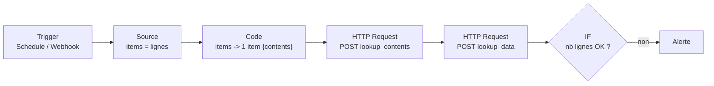

# n8n : ajouter, modifier, supprimer une lookup Splunk via Lookup Editor

## À quoi ça sert

Alimenter une lookup CSV Splunk depuis un workflow n8n (export d'un référentiel, formulaire,
webhook) sans script. Tout passe par le nœud **HTTP Request** vers l'API décrite dans
[Lookup Editor : API REST](./splunk-lookup-editor-api.md), où sont listés les droits
nécessaires.

Portée : le comportement de l'API Splunk est mesuré (9.4.6, Lookup Editor 4.0.8) ; la
configuration n8n ci-dessous découle de ces contraintes et n'a pas été rejouée sur une
instance n8n.

## Le workflow minimal



| Action | Nœud | Méthode | URL |
|---|---|---|---|
| Ajouter / remplacer | HTTP Request | POST | `https://<sh>:8089/services/data/lookup_edit/lookup_contents` |
| Lire | HTTP Request | POST | `https://<sh>:8089/services/data/lookup_edit/lookup_data` |
| Supprimer | HTTP Request | DELETE | `https://<sh>:8089/servicesNS/nobody/<app>/data/lookup-table-files/<f>.csv` |
| Modifier quelques lignes | lire -> **Code** (fusion) -> écrire | | |

## Configuration du nœud HTTP Request

**Credential** : *Generic Credential Type* -> *Header Auth*, nom `Authorization`, valeur
`Bearer <token>`. Le jeton reste dans la credential, jamais en dur dans le nœud.

**Corps** : *Send Body* activé, **Body Content Type = Form Urlencoded**, champs :

```text
namespace    my_app
owner        nobody
lookup_file  assets.csv
isNew        true                              (création seule, sinon omettre)
contents     {{ JSON.stringify($json.contents) }}
```

**Options** utiles :

- *Response* -> *Include Response Headers and Status* : pour tester le code retour.
- *Timeout* : à relever pour les grosses lookups.
- *Ignore SSL Issues* seulement en lab ; en production, faire confiance à l'AC interne
  (`NODE_EXTRA_CA_CERTS` au niveau de l'instance).

## Nœud Code : construire `contents`

Mode *Run Once for All Items* : transforme N items en **un seul** item portant le tableau
complet, en-tête en première ligne.

```javascript
const rows = $input.all().map(i => i.json);
const header = Object.keys(rows[0]);
const contents = [header, ...rows.map(r => header.map(h => String(r[h] ?? '')))];
return [{ json: { contents } }];
```

Pour une modification partielle (upsert par clé), lire d'abord la lookup puis fusionner.
Sur le nœud de lecture, régler *Response Format = Text* : la réponse est un tableau de
tableaux, que n8n découperait sinon en items. Le texte arrive dans le champ `data`.

```javascript
// 'Lire lookup' : réponse texte de lookup_data ; 'Source' : lignes à appliquer
const [header, ...cur] = JSON.parse($('Lire lookup').first().json.data);
const key = 'host';
const idx = header.indexOf(key);
const map = new Map(cur.map(r => [r[idx], r]));
for (const i of $('Source').all()) map.set(i.json[key], header.map(h => String(i.json[h] ?? '')));
return [{ json: { contents: [header, ...map.values()] } }];
```


## Ce qu'il ne faut pas rater

- **Form Urlencoded, pas JSON.** L'API refuse un corps JSON ou multipart (403 ou 500).
  `contents` est une *chaîne* JSON dans un champ de formulaire.
- **Un seul item avant l'écriture.** HTTP Request s'exécute une fois par item : sans
  agrégation, chaque ligne écrase la précédente et la lookup finit avec une ligne.
- **Remplacement complet.** Chaque écriture remplace tout le fichier. Pour modifier, lire
  puis réécrire ; ne pas lancer deux workflows en parallèle sur la même lookup.
- **Vérifier après écrire.** L'API peut répondre `200` sans avoir écrit. Relire avec
  `lookup_data` et comparer le nombre de lignes dans un IF.
- **`isNew=true` en création** : protège contre l'écrasement d'une lookup existante (409).
- **Suppression = droit write sur l'app entière.** Donner ce droit au compte n8n lui permet
  de supprimer toute lookup de l'app : réserver une app dédiée.
- **Port 8089** joignable depuis n8n ; en SHC, viser un membre, la réplication suit.
- **Retry On Fail** sur les nœuds HTTP pour absorber un redémarrage glissant du SHC.

## Voir aussi

- [Lookup Editor : API REST](./splunk-lookup-editor-api.md) : appels, droits, pièges côté Splunk.
- [n8n](./n8n.md) : expressions, nœuds, debug par executions.
