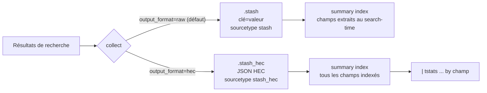

# `collect output_format=hec` : un summary index avec champs indexés

Par défaut, `collect` écrit un fichier `stash` au format `clé=valeur` : les champs
du summary sont extraits **au search-time**, donc invisibles pour `tstats`. Avec
`output_format=hec`, `collect` écrit du JSON au format HTTP Event Collector et
**tous les champs du résultat deviennent des champs indexés**. Le summary devient
interrogeable par `tstats`.



## Forme générique

```spl
index=<index> sourcetype=<sourcetype>
| stats count sum(<mesure>) as <mesure> by <dim1> <dim2>
| fields _time <dim1> <dim2> count <mesure>
| collect index=<summary_index> output_format=hec
```

Lecture ensuite :

```spl
| tstats sum(<mesure>) as <mesure> where index=<summary_index> by <dim1> <dim2>
```

```spl
index=<summary_index> <dim1>::<valeur>
```

Champ par champ :

- `output_format=hec` : fichier écrit dans `$SPLUNK_HOME/var/spool/splunk` avec
  l'extension `.stash_hec` au lieu de `.stash`. Tous ses champs sont indexés à
  l'ingestion.
- `index=<summary_index>` : l'index de destination doit exister. Un champ `index`
  présent dans les résultats est ignoré, tout comme `splunk_server`.
- `fields` avant `collect` : il n'y a pas de sélection des champs à indexer.
  Tout ce qui sort de la recherche est indexé, d'où l'intérêt de filtrer.
- `<dim>::<valeur>` : syntaxe qui cible directement le terme indexé.

## Ce qui change par rapport à `raw`

- `source`, `sourcetype` et `host` présents dans les résultats sont repris **tels
  quels**. Ils ne passent pas par `extracted_host` / `extracted_sourcetype`.
- Options **refusées** avec `hec` : `addtime`, `host`, `marker`, `source`,
  `sourcetype`, `timeformat`, `uselb`.
- Argument absent de la doc 8.0.0, présent dans la doc 8.1.0 : disponible au
  moins depuis la 8.1 (déduction, aucune note de version ne le confirme).

## Pièges fréquents

- **Licence décomptée si le sourcetype n'est pas `stash_hec`.** La doc est
  explicite : `hec` n'est gratuit qu'avec le sourcetype interne `stash_hec`. Un
  champ `sourcetype` qui survit dans les résultats (par exemple un
  `stats ... by sourcetype`) est repris et le volume compte. Réflexe (non testé) :
  `| rename sourcetype as orig_sourcetype` avant `collect`. Contrôle : déplier un
  évènement du summary et lire son sourcetype.
- **Gonflement des tsidx.** Chaque valeur distincte de chaque champ devient un
  terme indexé. Une mesure à forte cardinalité (somme, moyenne, durée,
  identifiant) indexée pour rien alourdit les tsidx sans aucun gain. N'envoyer que
  les dimensions et les mesures dont on a besoin.
- **`champ=valeur` ne profite pas forcément de l'index.** Règle générale des
  champs indexés, non testée spécifiquement avec `stash_hec` : sans entrée
  `fields.conf` (`[<champ>]` / `INDEXED = true`) côté search head, la recherche
  `champ=valeur` reste une extraction au search-time. `champ::valeur` et `tstats`
  n'en ont pas besoin.
- **Options habituelles de `raw` reprises par réflexe** (`marker`, `addtime`,
  `sourcetype=`) : elles sont invalides avec `hec`. Retirer ces options avant de
  basculer une recherche planifiée existante.

## Source

- Splunk, *Search Reference*, commande `collect`, argument `output_format` :
  <https://help.splunk.com/en/splunk-enterprise/search/spl-search-reference/10.4/search-commands/collect>

## Voir aussi

- [`tstats` et `summariesonly` : recherche accélérée](tstats-summariesonly.md)
- [`stats` vs `eventstats` vs `streamstats`](stats-eventstats-streamstats.md)
- [`_time` vs `_indextime` : ne pas les confondre](time-vs-indextime.md)
