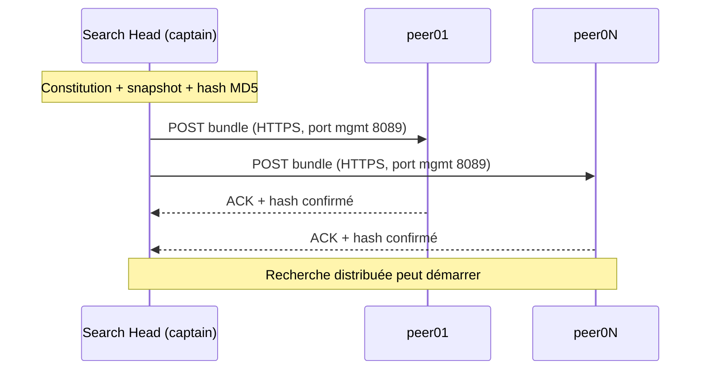

# Splunk — knowledge bundle (réplication classique) — Fiche réflexe

## À quoi ça sert

Aide-mémoire orienté **incident** pour le *knowledge bundle* d'un search head Splunk
distribuant ses recherches vers des **search peers** (indexers) en **réplication
classique** — la policy par défaut, SH → tous les peers en parallèle. Couvre les
fondamentaux, le **pré-requis** (constitution du bundle + snapshot + réplication de
configuration en SHC), et les **points de contrôle** quand une recherche distribuée
ne renvoie pas ce qu'elle devrait.

Hors scope de cette fiche : *cascading* (relais), *mounted* (FS partagé), *configuration
bundle* SHC (deployer → members) et *cluster bundle* indexer (manager → peers). Pour le
détail théorique et opérationnel complet → [Voir aussi](#voir-aussi).

## Fondamentaux

| Item | Valeur |
|---|---|
| Quoi | Archive (`.bundle`) consolidant `etc/apps/` + `etc/users/` + `etc/system/local/` du SH, filtrée par allow/denylist |
| Qui pousse | Chaque **search head** (ou le **captain** SHC) vers tous ses search peers |
| Où chez le peer | `$SPLUNK_HOME/var/run/searchpeers/<sh-guid>-<timestamp>/` |
| Quand | Au **démarrage** d'une recherche distribuée si le hash du bundle ≠ dernier envoyé |
| Conf | `distsearch.conf` `[replicationSettings]`, `[replicationDenylist]`, `[replicationAllowlist]` |
| Identité | Hash MD5 de l'archive — drive la décision « renvoyer ou pas » |

Trois bundles à **ne pas confondre** :

1. **Knowledge bundle** — SH → search peers. *Sujet de cette fiche.*
2. **Configuration bundle SHC** — deployer → members SHC (apps/configurations baseline).
3. **Configuration bundle indexer cluster** — manager → peers indexers.

Référence Splunk : [Knowledge bundle replication overview 9.4](https://docs.splunk.com/Documentation/Splunk/9.4.1/DistSearch/Knowledgebundlereplication).

## Pré-requis — ce qui se passe AVANT que le bundle parte

### 1. Constitution / snapshot du bundle

À chaque cycle (1er événement de recherche distribuée, changement de conf, mtime), le SH :

1. Walke `etc/apps/`, `etc/users/`, `etc/system/local/`.
2. **Filtre** via `[replicationDenylist]` (anciennement `[replicationBlacklist]`) et `[replicationAllowlist]`.
3. Hash MD5 sur le contenu retenu → **snapshot**.
4. Si hash ≠ dernier hash envoyé → constitution de l'archive et déclenchement du push.

### 2. Réplication de configuration en SHC (`confOp`)

**Crucial en SHC** : le captain ne peut pousser un bundle cohérent que si la conf de **tous** les members est déjà alignée. C'est le boulot du `ConfReplicationThread` :

- Toute édition locale d'un member sous `etc/{apps,users,system/local}/` → `op` (opération) packagée → push vers le captain → captain réplique aux autres members.
- Cadence pilotée par `server.conf [shclustering] conf_replication_period` (défaut ~5 s).
- Volume max par cycle : `conf_replication_max_pull_count` (défaut 1000, 0 = illimité).
- Visible côté `splunkd.log` : composant `ConfReplicationThread`.

→ **Tant que confOp est en retard ou en erreur, le bundle envoyé reflète un état incohérent.** C'est la cause #1 des « j'ai édité mon savedsearch et il ne se déclenche pas sur tous les peers ».

### 3. Cycle classique de réplication



**Classique = SH parle à chaque peer.** Coût qui explose au-delà de ~15–20 peers → bascule
cascading. La policy active se vérifie avec :

```bash
splunk btool distsearch list replicationSettings | grep replicationPolicy
# replicationPolicy = classic    (par défaut)
```

## Commandes de base

### Identifier et inspecter — sur le SH

```bash
# Policy active + paramètres de taille
splunk btool distsearch list replicationSettings

# Bundle blacklist/allowlist effectif (qui sort, qui reste)
splunk btool distsearch list replicationDenylist
splunk btool distsearch list replicationAllowlist

# Liste des search peers vus par ce SH + leur état
splunk show distributed-peers -auth admin:<password>

# Taille effective du dernier bundle généré
du -sh $SPLUNK_HOME/var/run/<bundle>      # le `.bundle` le plus récent
```

### Côté peer — où le bundle atterrit

```bash
ls -lh $SPLUNK_HOME/var/run/searchpeers/  # un sous-dossier par SH connu
# format : <sh-guid>-<timestamp>
```

### Via REST (préférer pour les automatismes)

```bash
# Liste des peers connus du SH (Splexicon "search peer")
curl -sk -u admin:<password> https://<sh>:8089/services/search/distributed/peers

# Config réplication active (cycles, policy, métriques)
curl -sk -u admin:<password> https://<sh>:8089/services/search/distributed/bundle/replication/config
curl -sk -u admin:<password> https://<sh>:8089/services/search/distributed/bundle/replication/cycles

# Captain SHC : santé du cluster (avant de chercher côté bundle)
curl -sk -u admin:<password> https://<sh>:8089/services/shcluster/captain/info
```

### Recherches `index=_internal` utiles

```spl
# Erreurs côté SH sur la réplication bundle
index=_internal sourcetype=splunkd component=DistributedBundleReplicationManager
  ( log_level=WARN OR log_level=ERROR )
| stats count by host, log_level, message

# Trafic confOp SHC (réplication de conf entre members) — préalable au bundle
index=_internal sourcetype=splunkd component=ConfReplicationThread log_level!=INFO
| stats count by host, log_level

# Vue captain : push de bundles
index=_internal sourcetype=splunkd component=BundleReplicator
| stats count by host, log_level
```

## Points de contrôle — quand ça défaille

Lire de haut en bas. Chaque ligne = symptôme observable → 2-3 contrôles → réflexe.

| Symptôme | Contrôles dans l'ordre | Réflexe |
|---|---|---|
| Recherche distribuée renvoie résultats partiels, warning « *N peers did not return* » | (1) `splunk show distributed-peers` → peer en `Down`/`Quarantined` ? (2) `splunkd.log component=DistributedBundleReplicationManager log_level=ERROR` | Un peer KO ne reçoit pas le bundle ; recherche tronquée. Réveiller le peer ou le sortir du `serverList`/`servers` temporairement. |
| Erreur « *bundle exceeds max content length* » ou « *bundle too large* » | (1) `du -sh` du dernier `.bundle` (2) `btool distsearch list replicationSettings \| grep -E 'maxBundleSize\|max_content_length'` | **Levier côté SH = `maxBundleSize` (MB).** Si on l'augmente côté SH, augmenter `max_content_length` (bytes) **symétriquement côté peers** sinon le peer refuse. Avant : élargir `[replicationDenylist]` (gros lookups, app interne lourde). |
| Modif `savedsearches.conf` faite sur un SH mais inactive sur la recherche distribuée | (1) Es-tu en SHC ? (2) `component=ConfReplicationThread log_level!=INFO` → erreur ? (3) Hash bundle envoyé inchangé ? | **confOp pas répliqué** → captain pousse un état antérieur. Forcer un `splunk apply shcluster-bundle` (si modif passée par deployer) ou attendre le prochain cycle `conf_replication_period`. |
| Bundle envoyé OK mais peer répond avec hash différent ou erreur de cohérence | (1) `ls $SPLUNK_HOME/var/run/searchpeers/<sh-guid>-*` côté peer → vieux bundles non purgés ? (2) Logs peer `splunkd.log` chemin `DistributedPeerManagerHeartbeat` | Cache peer corrompu ou réception partielle. Stopper le peer, vider `var/run/searchpeers/<sh-guid>-*` obsolètes (garder le plus récent), restart. |
| Peer absent total : `show distributed-peers` ne le liste pas | (1) `distsearch.conf [distributedSearch] servers` contient-il l'URI ? (2) `nc -zv <peer> 8089` (3) Cert TLS / `pass4SymmKey` divergent ? | Pas même de tentative de bundle. Réseau / TLS / auth en premier — la réplication échoue silencieusement si la session de management ne s'établit pas. |
| Recherche bloquée *en attente* du bundle (pas d'erreur, mais latence) | (1) `component=BundleReplicator` log_level=INFO → cycle en cours ? (2) Taille bundle vs débit réseau (3) Combien de peers ciblés ? | Classic à 30+ peers = saturation réseau côté SH. Bascule **cascading** plutôt que de patcher classic. |
| Allowlist/denylist semble ignorée | (1) `btool distsearch list replicationDenylist --debug` → fichier source effectif (2) Vérifier précédence `system/local` > `apps/<x>/local` > `apps/<x>/default` | Une stanza dans `etc/system/local/distsearch.conf` écrase tout. Et `replicationAllowlist` est exclusif quand présent : ce qui n'est pas listé est exclu. |

### Top-5 commandes à mémoriser

```bash
splunk show distributed-peers -auth admin:<password>     # qui est joignable ?
splunk btool distsearch list replicationSettings         # config résolue
du -sh $SPLUNK_HOME/var/run/<bundle>                     # taille réelle envoyée
# Sur le peer :
ls -lh $SPLUNK_HOME/var/run/searchpeers/                 # ce qui est arrivé
# Sur le SH :
index=_internal sourcetype=splunkd component=DistributedBundleReplicationManager log_level!=INFO
```

## Pièges fréquents

- **Confondre `maxBundleSize` (côté SH, MB) et `max_content_length` (côté indexer, bytes).**
  Réflexe : monter les deux symétriquement. Voir [chap. 02 du handbook](../handbooks/splunk-shc-knowledge-bundle/02-bundle-search-constitution.md).
- **Croire qu'éditer en SHC se propage instantanément.** Le bundle envoyé reflète l'état
  *captain*, qui dépend du `ConfReplicationThread`. Édition non-`confOp`-répliquée = bundle
  qui ignore la modif. Premier contrôle SHC : `component=ConfReplicationThread`.
- **Allowlist exclusive.** Présence de `[replicationAllowlist]` = mode liste blanche stricte ;
  tout ce qui n'est pas listé est retiré du bundle.
- **Lookups gros et non blacklistés** — cause principale du dépassement `maxBundleSize`.
  Réflexe : blacklister `apps/<x>/lookups/*.csv` au-delà d'une certaine taille, exposer le
  contenu via un index ou un KV store côté SH plutôt que par fichier statique.
- **`/services/admin/distsearch` pour piloter** — Splunk ne documente PAS les endpoints
  `/admin/*`. Utiliser `/services/search/distributed/*` pour rester sur du REST public.
- **Forcer un push** : il n'existe pas de `splunk push knowledge-bundle`. Le push est
  déclenché par le 1er événement de recherche après changement de hash. Pour forcer :
  lancer une `| metadata index=_internal` qui déclenche la recherche distribuée.

## Voir aussi

- Handbook complet : [`handbooks/splunk-shc-knowledge-bundle/`](../handbooks/splunk-shc-knowledge-bundle/README.md)
  - [Foundations — les 3 bundles](../handbooks/splunk-shc-knowledge-bundle/00-foundations.md)
  - [Chap. 02 — constitution knowledge bundle](../handbooks/splunk-shc-knowledge-bundle/02-bundle-search-constitution.md)
  - [Chap. 03 — réplication classic / cascading / mounted](../handbooks/splunk-shc-knowledge-bundle/03-replication-vers-peers.md)
  - [Chap. 05 — arbre de diagnostic complet](../handbooks/splunk-shc-knowledge-bundle/05-troubleshooting-arbre-de-diag.md)
  - [Chap. 06 — boîte à outils CLI / REST / logs / SPL](../handbooks/splunk-shc-knowledge-bundle/06-investigations.md)
- Concepts : [Deployment server](splunk-deployment-server.md) (à ne pas confondre — celui-ci pour forwarders, pas SHC)
- Fiche [Splunk administration / CLI](./splunk-admin.md) — `btool`, `_internal`, `splunkd.log`
- Fiche [Secrets & SSH](./secrets-ssh.md) — `op read` pour ne pas écrire `-auth admin:<password>` en clair
