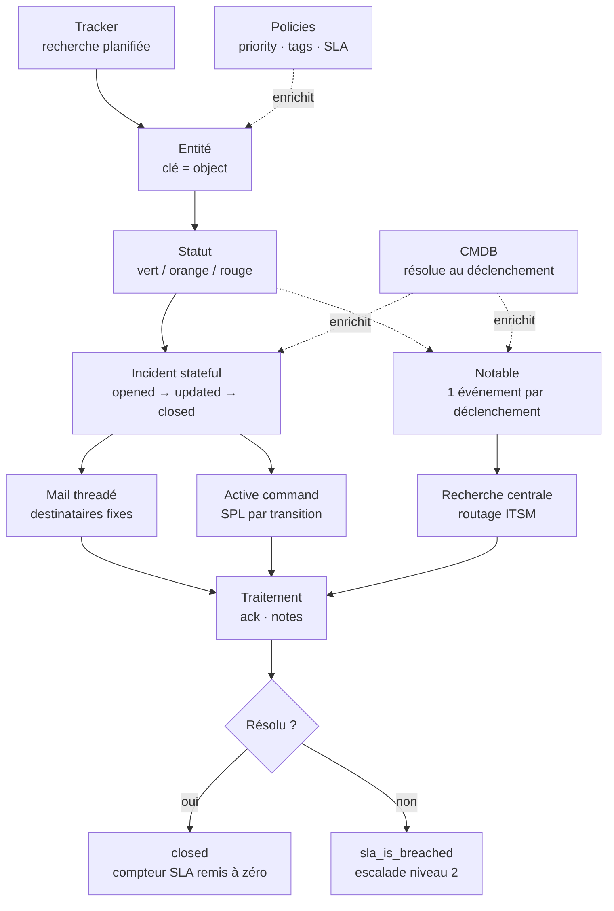
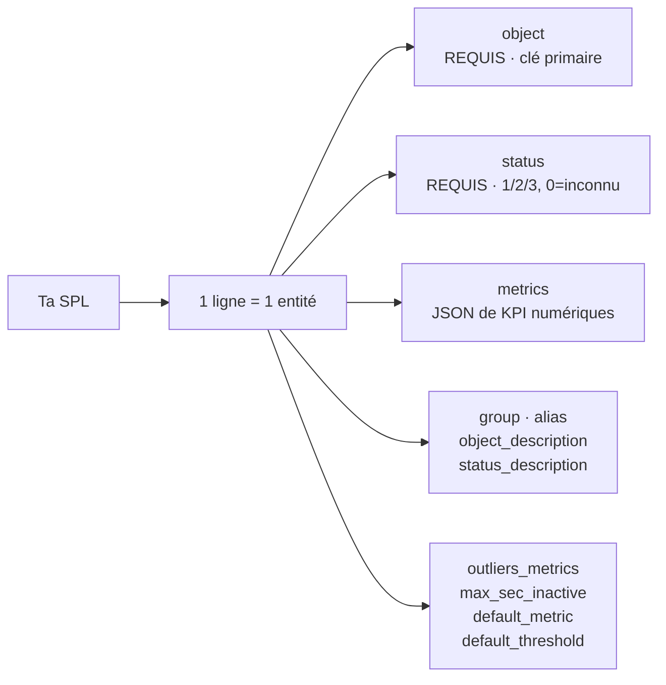
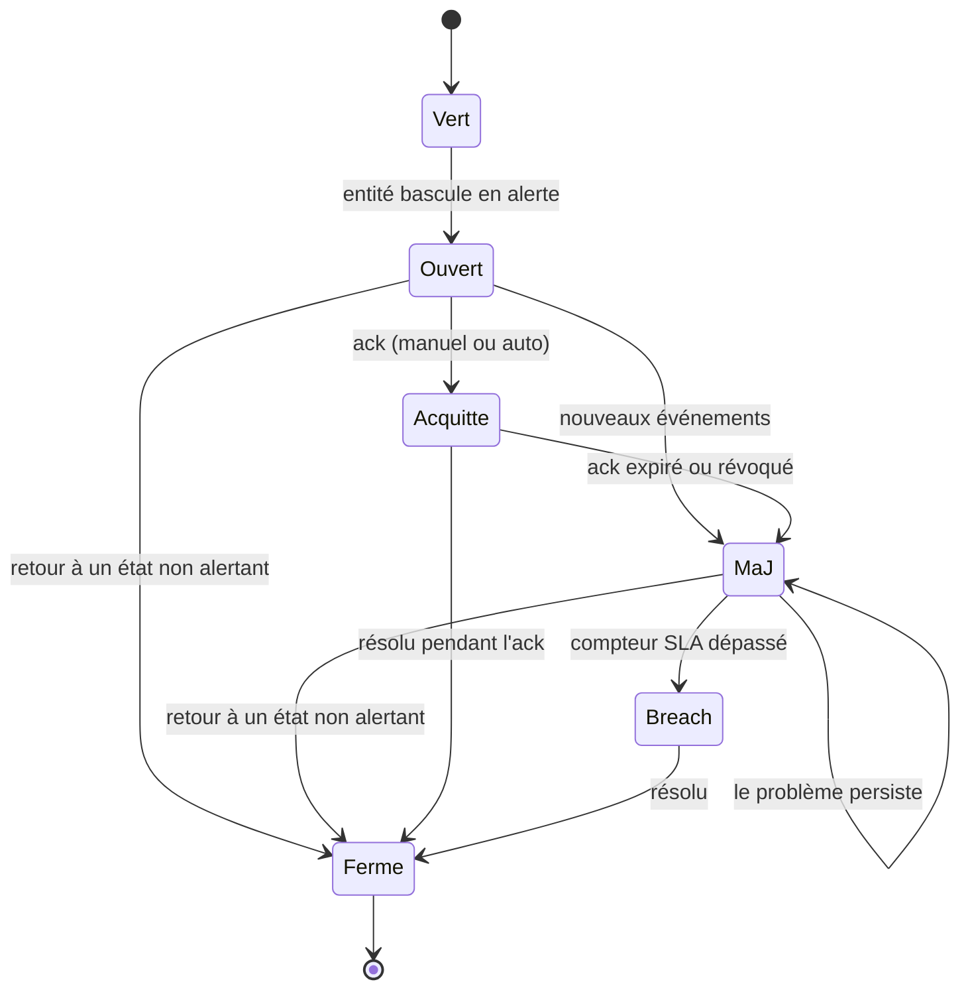
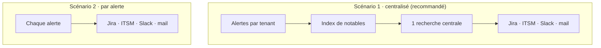
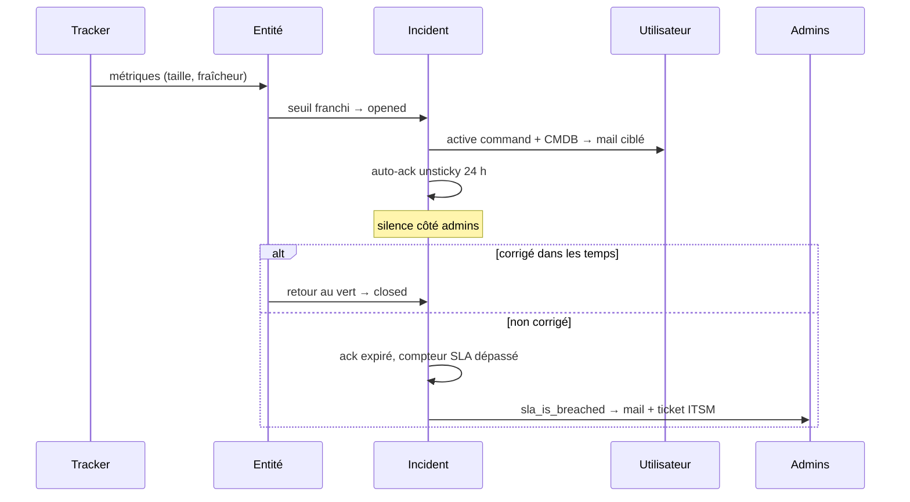

# Splunk TrackMe (v2) — surveillance d'objets et chaîne d'alerte

Aide-mémoire conceptuel : ce que TrackMe surveille, comment une donnée devient une
entité puis un incident, et comment cet incident se notifie et se traite. Fiche orientée
*modèle mental* plus que commandes, TrackMe se pilotant surtout par son interface et son
API REST.

Version de référence : TrackMe 2.4.x. Éditeur : TrackMe Limited (produit commercial).

## À quoi ça sert

TrackMe répond à une question que Splunk ne traite pas nativement : **« mes objets sont-ils
encore en bon état, et depuis quand ? »**. Là où une recherche sauvegardée dit « ça a cassé
maintenant », TrackMe maintient un **état persistant par objet** : vert depuis trois
semaines, rouge depuis six heures, acquitté par un opérateur, en violation de SLA.

On le touche pour surveiller la disponibilité et la fraîcheur de sources de données, mais
son composant Flex en fait un moteur générique : toute recherche SPL peut devenir un
référentiel d'objets suivis.

### Les six composants

| Composant | Code | Objet suivi |
|---|---|---|
| Data Source Monitoring | `splk-dsm` | sources de données (index / sourcetype), et les lookups |
| Data Host Monitoring | `splk-dhm` | hôtes émetteurs |
| Metric Host Monitoring | `splk-mhm` | hôtes de métriques |
| Flex Objects | `splk-flx` | n'importe quoi, défini par une SPL |
| Field Quality Monitoring | `splk-fqm` | qualité des champs, dictionnaire de données |
| WorkLoad | `splk-wlk` | recherches planifiées, skipping, échecs |

Le cloisonnement par composant est structurant : voir [Pièges fréquents](#pièges-fréquents).

Au-dessus, le **Virtual Tenant** est l'unité d'isolation et de droits. Un tenant porte
plusieurs composants simultanément ; il n'est jamais nécessaire d'en créer un second pour
surveiller le même objet sous deux angles.

## La chaîne complète



Sept étages, chacun détaillé ci-dessous.

## 1. Le tracker, c'est la collecte

Une recherche planifiée qui produit des lignes. Trois familles :

- **Hybrid tracker** : assistant guidé, modes `tstats`, `raw` ou `lookups`.
- **Flex tracker** : ta SPL, une ligne devient une entité. Bibliothèque de 60+ modèles
  pré-écrits (infrastructure Splunk, licence, SOAR, Cribl, etc.).
- **Converging tracker** : variante Flex qui agrège l'état de N entités membres en un
  objet unique porteur d'un pourcentage de disponibilité.

**Plusieurs trackers peuvent viser le même objet** (depuis la 2.3.5). Les valeurs sont
alors stockées en JSON indexé par tracker, puis agrégées : *pire statut* pour le statut,
*fusion* pour les métriques, *plus haute valeur* pour `disruption_min_time_sec`, *plus
basse* pour `max_sec_inactive`. C'est le mécanisme qui permet d'ajouter une métrique à une
entité existante sans la dupliquer.

## 2. L'entité, c'est l'objet suivi

Clé primaire : le champ `object`, dans un tenant et un composant donnés. Elle porte l'état
dans le temps, les KPI, les seuils, les modèles ML, les notes et les acks.

Les KPI partent dans un index de métriques, sous deux espaces de noms disjoints :

- `trackme.splk.feeds.*` pour DSM / DHM / MHM (catalogue fixe : volumétrie, latence, lag)
- `trackme.splk.flx.<clé>` pour Flex (pas de catalogue, les noms viennent de ta SPL)

Ils sont donc interrogeables en `mstats` depuis tes propres tableaux de bord.

```spl
| mcatalog values(metric_name) where index=<index_metriques>
```

### Le contrat de recherche Flex

Une ligne de résultat devient une entité. TrackMe lit le sens dans des **noms de champs
conventionnels** ; la liste est fermée, un champ inventé n'est pas conservé.



| Champ | Requis | Rôle |
|---|---|---|
| `object` | oui | identifiant unique de l'entité, ASCII libre |
| `status` | oui | `1` vert, `2` orange, `3` rouge, `0` inconnu |
| `group` | non | regroupement logique ; vaut le nom du tracker par défaut |
| `alias` | non | nom d'affichage |
| `object_description` | non | contexte libre sur l'entité |
| `status_description` | non | explication de l'état courant |
| `metrics` | non | JSON `{"cle": valeur_numerique, ...}` |
| `outliers_metrics` | non | règles de détection ML par métrique |
| `max_sec_inactive` | non | fenêtre d'inactivité avant bascule au rouge, `0` désactive |
| `default_metric` | non | métrique affichée par défaut dans la table |
| `default_threshold` | non | seuil appliqué à la métrique par défaut |

Convention d'échelle recommandée par l'éditeur pour les gros trackers :
`object = group + ":" + host`.

## 3. Le statut, c'est la décision

Quatre sources déterminent la couleur d'une entité :

1. **Seuils par métrique** (opérateur + valeur), éventuellement découpés par jour de
   semaine et heure de la journée pour serrer les limites en heures ouvrées.
2. **Inactivité** (`max_sec_inactive`).
3. **Outliers ML** (bornes hautes / basses apprises, saisonnalité optionnelle).
4. **Dérive de forme** des métriques.

Depuis la 2.3, **tout se configure à l'écran**, sans toucher à la SPL. C'est le point à
retenir : la logique de détection reste éditable après coup.

La détection ML est active par défaut sur `dsm,dhm,flx,wlk,fqm` et se désactive par
composant ou par modèle. Prévoir au moins une semaine, idéalement un mois d'historique
avant de s'appuyer dessus.

## 4. Les policies, c'est la classification

Trois familles, indépendantes du statut, appliquées par regex ou par correspondance dans un
lookup (exacte ou avec jokers), avec simulation avant application :

- **Priority** — niveau de priorité de l'entité.
- **Tags** — étiquettes libres, fusionnées entre toutes les politiques qui matchent.
- **SLA** — classe de tolérance, détaillée plus bas.

Elles servent à **router et filtrer**, jamais à détecter.

## 5. L'incident, c'est le stateful alerting

Le cœur du modèle. Un enregistrement persistant par entité en KV store, clé `incident_id`.



Trois transitions, `opened` / `updated` / `closed`. À chacune, trois sorties cumulables :

- un **événement indexé** dans un index de résumé, sourcetype `trackme:stateful_alerts` ;
- un **mail HTML threadé** (`Message-ID`, `In-Reply-To`), donc une seule conversation par
  incident dans le client mail, avec graphiques 24 h embarqués et rapport IA optionnel ;
- une **active command**, c'est-à-dire une SPL dispatchée par état.

### Active commands

Une SPL par transition, avec substitution de jetons `$result.<champ>$` ou `$<champ>$`,
applicables à tout champ de l'alerte et à ceux ajoutés par TrackMe. Mode streaming ou
generating.

```spl
| eval account="<compte>", ci_identifier=object, priority="1"
| eval short_description="Entité " . alias . " en état " . object_state
| <commande_itsm>
```

C'est le point d'extension pour le ticketing, le paging et toute automatisation maison.

## 6. Notables et intégration tierce

Un **notable** est un événement JSON écrit dans un index dédié à chaque déclenchement. Pas
de cycle de vie, pas de déduplication, l'ack est ignoré. Il porte au minimum le nom de la
règle, la sévérité, l'identité de l'entité, son état, son score, la raison d'anomalie, la
priorité, les tags, le SLA, les horodatages et un lien de drilldown. Surtout, il embarque
**l'enregistrement complet de l'entité** sous `properties.*`, extrait automatiquement en
champs.

Deux architectures possibles, la première étant recommandée par l'éditeur :



Le scénario 1 concentre en un seul endroit la décision de ce qui devient un incident,
normalise les événements et traite l'acquittement de façon homogène. Le scénario 2 est plus
simple à démarrer mais chaque alerte porte sa propre configuration d'intégration.

### Enrichissement CMDB

Mécanisme dédié pour rattacher un **propriétaire, un contact, des métadonnées d'actif** à
une entité. Ce n'est pas du stockage sur l'entité : c'est une **résolution au moment du
déclenchement**.

Un template SPL arbitraire par composant, avec des jetons d'entité remplis à l'exécution :
`$object$`, `$alias$`, `$data_index$`, `$data_sourcetype$`, `$tenant_id$`.

```spl
| inputlookup <cmdb> where (host="$alias$")
```

Il tourne à la demande depuis l'entité, et automatiquement au déclenchement, le résultat
étant embarqué sous le champ `cmdb` de l'événement. Lecture seule, sans effet sur l'état ou
le score, et *best effort* : si la recherche échoue, l'alerte part quand même, sans le
champ.

L'intérêt par rapport à un contact figé dans l'entité : le template étant de la SPL libre,
une **cascade de résolution** s'y écrit (propriétaire déclaré, sinon auteur de la recherche
planifiée qui alimente l'objet, sinon valeur de repli), et elle est réévaluée à chaque
alerte.

## 7. Traitement et escalade

### Acquittement

L'ack **silencie sans masquer** : l'entité garde son état réel, reste surveillée et visible,
seules les relances mail s'arrêtent.

| Type | Comportement |
|---|---|
| `sticky` | n'expire jamais, « connu et accepté » |
| `unsticky` | expire après `ack_period` (24 h par défaut), « laisse-moi investiguer » |

Posable à la main, par API, ou **automatiquement à l'ouverture de l'incident** via l'alert
action dédiée. Un balayage de fond purge les acks non-sticky expirés.

Garde-fou important : si la **raison d'anomalie change**, l'ack est révoqué
automatiquement. Un ack posé sur un problème de volumétrie ne masquera pas silencieusement
un problème de latence apparu ensuite.

### SLA

Second niveau de signal. Chaque entité porte un compteur de secondes **en rouge continu**,
remis à zéro dès qu'elle récupère. Au dépassement du seuil de sa classe, `sla_is_breached`
passe à vrai.

| Classe livrée | Rouge continu toléré |
|---|---|
| `platinum` | 4 heures |
| `gold` | 1 jour |
| `silver` | 2 jours (classe par défaut) |

Attention au sens : une classe plus premium est **plus stricte**, pas plus indulgente.

## Cas d'usage : surveiller des lookups

TrackMe traite nativement les lookups, de deux façons complémentaires.

### Mode DSM dédié

Un mode de l'assistant Hybrid Trackers transforme les lookups CSV et les collections KV
Store en entités DSM. Il s'appuie sur un add-on compagnon à installer sur chaque search head
qui dispatche, et exposant une commande utilisable seule :

```spl
| trackmelookupsmonitor app_namespace="<app>" lookup_type="csv"
```

Champs émis par entité : `object` (`lookups:<app>:<nom>`), `app_namespace`, `lookup_type`,
`lookup_path`, `data_eventcount` (lignes ou documents), `lookup_size_bytes` (CSV
uniquement), `data_last_time_seen`, `mtime_source`.

Alerting natif : **fraîcheur** (`data_max_delay_allowed`, 86400 s par défaut) et **nombre
d'enregistrements** (zéro ligne bascule au rouge, minimum configurable). La latence
d'ingestion est neutralisée, une lookup n'ayant pas d'`_indextime`.

### Modèles Flex du catalogue

- `splk_large_lookup_files` — lookups surdimensionnées qui ralentissent la réplication du
  knowledge bundle, avec détection d'outliers sur la taille totale.
- `splk_kvstore_size`, `splk_kvstore_status` — volumétrie et santé du KV Store.

### Ce qui n'est pas couvert

L'alerting lookup natif détecte une mise à jour **trop rare**. Détecter une mise à jour
**trop fréquente** demande un tracker Flex maison, par exemple en dérivant la variation de
`data_last_time_seen`, ou en comptant les écritures dans les journaux d'audit.

### Chaîne type « notifier l'utilisateur, puis escalader »



## API REST

Tout ce que fait l'interface passe par l'API, versionnée sous `/trackme/v2/*` et
auto-documentée.

```spl
| trackmeapiautodocs target="groups"
| trackmeapiautodocs target="endpoints"
| trackme mode=post url="/services/trackme/v2/<groupe>/<endpoint>" body="{'tenant_id': '<tenant>'}"
```

Trois niveaux de droits, portés par des capabilities Splunk :

| Portée | Capability | Atteint |
|---|---|---|
| user | `trackmeuseroperations` | lecture (list / get / search) |
| power | `trackmepoweroperations` | `*/write` : ack, priorité, gestion d'entités |
| admin | `trackmeadminoperations` | `*/admin` : tenants, policies, trackers, migrations |

Depuis l'extérieur de Splunk, authentification classique splunkd : jeton *bearer*, *basic
auth*, ou échange de session sur `/services/auth/login`.

## Pièges fréquents

- **Le mtime REST d'une lookup n'est pas celui du fichier.** `/services/data/lookup-table-files`
  renvoie le mtime de l'objet de connaissance, qui bouge dès qu'on touche les permissions ou
  les `props`. Le mode lookup lit le vrai `os.stat` du fichier. Ne pas bâtir de détection de
  fraîcheur sur le REST.
- **Les composants sont des silos.** Une métrique Flex ne peut pas se greffer sur une
  entité DSM : espaces de noms de métriques disjoints et `object_category` distinct. En
  revanche deux trackers **Flex** peuvent alimenter la même entité (voir étage 1).
- **Supprimer un tracker ne supprime pas ses entités.** Elles cessent simplement d'être
  maintenues. Changer le périmètre découvert laisse donc des orphelines à purger
  explicitement.
- **Ne jamais supprimer à la main les objets de connaissance d'un tracker.** TrackMe en
  tient le registre ; le cycle de vie passe par l'interface ou l'API.
- **Les notables ignorent l'acquittement et ne dédupliquent pas.** Une entité qui oscille et
  déclenche à chaque cycle inonde l'index. Espacer la planification, ou préférer le stateful
  alerting.
- **Le mail natif du stateful alerting a des destinataires fixes.** Le ciblage dynamique
  passe par une active command ou par la recherche centrale sur les notables, alimentée par
  l'enrichissement CMDB.
- **La détection ML est active par défaut**, y compris sur Flex. La désactiver
  explicitement si l'on veut du seuil pur.
- **`object` est unique dans le tenant**, et `group` vaut le nom du tracker par défaut ; les
  chevauchements de groupes entre trackers sont à éviter.
- **Guillemets JSON.** La commande SPL `trackme` accepte les apostrophes simples dans le
  corps, un appel REST externe exige du JSON valide en guillemets doubles. Cause classique
  de `bad request` en portant un exemple SPL vers `curl`.
- **Le comptage de lignes CSV est un balayage en O(taille).** Acceptable sur des
  planifications à la minute, à surveiller sur des lookups compressées de plusieurs Go.
- **KV Store sans champ temporel** : splunkd ne maintient que la clé et l'utilisateur. Sans
  champ de date exploitable, la fraîcheur est indéterminable, seule la volumétrie reste
  suivie.
- **Flex Objects est une capacité des éditions supérieures**, pas de la licence d'entrée. À
  valider avant de concevoir autour.

## Voir aussi

- [Splunk (administration / CLI)](./splunk-admin.md) — CLI `splunk`, `btool`, index, `_internal`.
- [Splunk — knowledge bundle (réplication classique)](./splunk-knowledge-bundle-classique.md) — la réplication que les grosses lookups dégradent.
- [Splunk RBAC (rôles & héritage)](./splunk-rbac.md) — modèle de capabilities dont dépendent les portées de l'API.
- [Mermaid dans Obsidian](./mermaid-obsidian.md) — syntaxe des diagrammes utilisés ici.
- Documentation officielle : <https://docs.trackme-solutions.com/>
