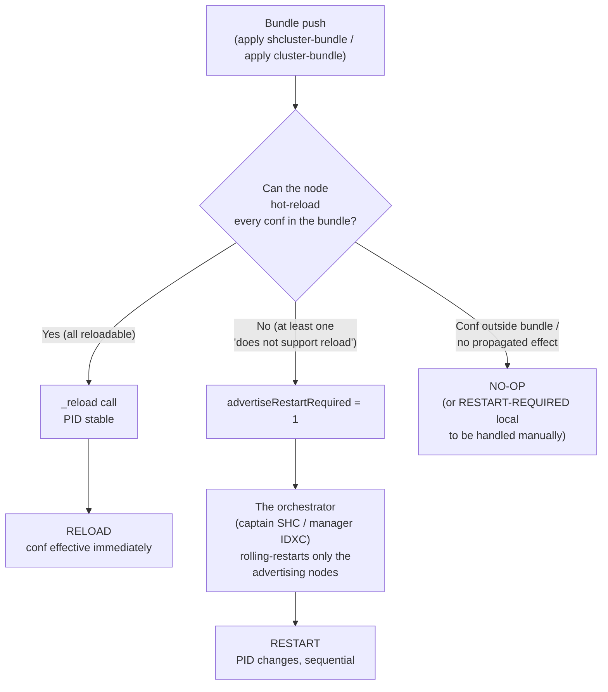

> 🇫🇷 Version française : [rolling-restart-triggers.md](splunk-rolling-restart-triggers.md)

# Rolling restart triggers — SHC & indexer cluster

Which configuration changes (and which administrative actions)
**trigger a rolling restart** of a Splunk Enterprise cluster — as
opposed to a hot *reload* (PID unchanged) or a *no-op* — across the
two clustered topologies:

- **Search Head Cluster (SHC)**: changes are pushed via the **deployer**
  (`apply shcluster-bundle`); the **captain** orchestrates.
- **Indexer cluster (IDXC)**: changes are pushed via the **cluster manager**
  (`apply cluster-bundle`); the **manager** orchestrates.

Knowing *in advance* whether a change will require a restart determines every
maintenance window: a rolling restart has a cost (partial search interruption,
bucket fixup on the indexer side, captain re-election on the SH side).
**The vendor documentation classifies settings as "reloadable" / "restart required"
partially, and is sometimes contradicted by actual behavior.** This document
describes the mechanism, the method to determine it yourself, and a truth table.

> Empirical observations recorded on **Splunk Enterprise 9.4.x**, single-site.
> Behavior may differ on other versions — the **method** below
> remains valid for re-verifying on your own version.

---

## 1. The mechanism

The rule common to both topologies: **it is not the act of pushing a bundle
that triggers a restart, but the *content* of the bundle.** Each conf is
classified as "hot-reloadable" or "does not support reload"; only the latter
forces a restart. The message displayed at `apply` time is always
conditional ("*might* initiate a rolling restart *depending on the
configuration changes*") — the condition is this classification.

### 1.1 SHC side — the captain and `advertiseRestartRequired`

Each **member** that receives the bundle computes an `advertiseRestartRequired`
flag for that bundle: `1` if at least one conf "does not support reload", `0`
otherwise. The **captain** then orchestrates a rolling restart **only** for the
members advertising `1`:

```text
SHCMaster - Starting a rolling restart of the peers. onlyRestartAdvertisingPeers=1
SHCMaster - Skipping rolling restart for peer=... advertiseRestartRequired=0
```

A reloadable conf (savedsearch, search-time props…) is received, **hot-reloaded**
via a `_reload` call, and the captain **skips** the restart. This is the
pivot of the entire SHC truth table.

### 1.2 IDXC side — the manager and the peer conf reloader

Symmetrically, each **peer** passes the received bundle through its
`ClusterSlaveConfigReloader`: it hot-reloads whatever supports it and
**advertises to the cluster manager only the non-reloadable confs**. The manager
then orchestrates the rolling restart **only for the affected peers**
(`onlyRestartAdvertisingPeers`). The "content, not act" logic is identical.

### 1.3 Bundle validation does not predict the restart

`validate cluster-bundle` (IDXC) checks the **consistency** of the bundle (syntax,
`btool check`), not whether it will trigger a restart. A valid bundle can be
reloadable **or** restart-required. Do not conflate "validation OK" with
"hot reload".

### 1.4 Decision flow



---

## 2. Method to determine it yourself

Reusable on any version. Principle: apply **one minimal isolated change**,
trigger it, observe **discriminating signals**, classify.

### 2.1 The signals

| Signal | Capture | Proves |
|---|---|---|
| **`splunkd` PID** before/after, per node | `splunk status` or `cat $SPLUNK_HOME/var/run/splunk/splunkd.pid` | **RESTART** (PID changes) vs **RELOAD/NO-OP** (PID stable) — the hard discriminant |
| **Cluster status** | SHC: `splunk show shcluster-status [--verbose]` · IDXC: `splunk show cluster-status` + `splunk show cluster-bundle-status` | `RestartInProgress` cycle, bundle generation, `restart_required` |
| **Banners** | `GET /services/messages` | presence of a "restart required" message |
| **Decision in `splunkd.log`** | targeted `grep`: `Starting a rolling restart`, `advertiseRestartRequired`, `does not support reload`, `_reload` | the exact mechanism (who triggered, when) |
| **Effective conf** | `splunk btool <conf> list --debug <stanza>` on the target node, before/after | effective RELOAD vs restart-required **pending** (conf not yet active) |
| **`_reload` call** | search for a `GET\|POST .../_reload` in `splunkd.log` | hard proof of hot-reload |

### 2.2 The loop

```bash
# 0. PRE-STATE: healthy cluster; PID snapshot of all nodes; btool of target conf; t0=date -u
# 1. CHANGE: a single file/attribute/object (minimal isolated change)
# 2. TRIGGER: apply bundle / toggle / targeted restart
# 3. OBSERVATION: capture signals over the window [t0, t0+delta]
# 4. VERDICT: classify (see grid below)
# 5. RESET: revert the change, re-apply, wait for healthy cluster BEFORE the next case
```

### 2.3 Automatic restart vs. "restart required" manual — the key distinction

This is the trickiest distinction. Unambiguous rule:

1. The **PID changed on its own** after the apply, with no intervention → **RESTART**
   (the orchestrator did it).
2. **Stable PID + "restart required" banner + conf not effective** (`btool`
   does not yet show the new value), and only a **subsequent manual restart**
   makes the conf effective → **RESTART-REQUIRED (manual)**:
   Splunk *asks* but *does not act*.

For potentially "manual" cases, you must **wait, then check the PID and `btool`
BEFORE any manual restart**, otherwise the two outcomes are indistinguishable.

The 5 possible verdicts: **RESTART** · **RELOAD** · **NO-OP** ·
**RESTART-REQUIRED (manual)** · **BLOCKED** (the `apply`/`validate` returns an
error, bundle not applied).

---

## 3. Truth table — SHC (push via deployer)

Behavior observed on 9.4.x, push `apply shcluster-bundle` from the
deployer. Verdict from the **cluster** perspective (propagation to members).

| Conf / action                                                                     | Verdict                                    | Note                                                                                                                                                                                             |
| --------------------------------------------------------------------------------- | ------------------------------------------ | ------------------------------------------------------------------------------------------------------------------------------------------------------------------------------------------------ |
| `rolling-restart shcluster-members` (command)                                     | RESTART                                    | sequential orchestrated restart, 1 member at a time                                                                                                                                              |
| `server.conf` — `[httpServer]`, `[sslConfig]`, splunkd tier                       | **RESTART**                                | "does not support reload" → `advertiseRestartRequired=1`. Includes TLS cert rotation (`[sslConfig]`)                                                                                             |
| `savedsearches.conf`, `eventtypes.conf`, `macros.conf`, `tags`, `datamodels.conf` | RELOAD                                     | `_reload` on the corresponding endpoint, PID stable                                                                                                                                              |
| `props.conf` / `transforms.conf` **search-time** (`EXTRACT-`, lookup def…)        | RELOAD                                     | search-time artifact, hot-reloaded                                                                                                                                                               |
| `authorize.conf` (roles)                                                           | RELOAD                                     |                                                                                                                                                                                                  |
| `alert_actions.conf`, `outputs.conf`, XML dashboards (`data/ui/views`)             | RELOAD                                     |                                                                                                                                                                                                  |
| lookup CSV (`lookups/`)                                                            | RELOAD                                     | search-time; `-preserve-lookups true` preserves a runtime modification against bundle overwrite                                                                                                  |
| `authentication.conf` — switch to `authType = LDAP`                               | **RELOAD**                                 | ⚠️ counter-intuitive: the LDAP provider initializes hot, **without banner or restart**. The fear "auth = restart" is unfounded for a **valid and complete** LDAP conf. ⚠️ **Nuance**: an **incomplete/invalid** LDAP strategy may itself trigger a restart. (Caveat: SAML not tested.) |
| `limits.conf` — `[search]` (e.g. `max_searches_per_cpu`)                          | RELOAD                                     | the core `[search]` reloads; a few rare stanzas may be restart-required                                                                                                                          |
| `indexes.conf` on a SH (summary index)                                            | RELOAD                                     | the `IndexWriter` initializes the new index hot                                                                                                                                                  |
| `inputs.conf` — `monitor`, `tcp`, `splunktcp`, `script` (4 types)                 | RELOAD                                     | ⚠️ even TCP ports: on a SH the listener is not bound (a SH is not a receiver), the conf is replicated + reloaded                                                                                 |
| `distsearch.conf` — `[distributedSearch] servers` (adding a search peer)          | **RESTART**                                | ⚠️ "does not support reload": touches the distributed search engine → forced rolling restart                                                                                                      |
| `web.conf` — `httpport` (web port)                                                 | **non-effective**                          | ⚠️ web tier: the captain skips the splunkd restart **and** the port does not rebind → change ineffective until a real restart occurs                                                              |
| App **installed** / **enabled-disabled** via bundle                                | RELOAD                                     | if the app content is reloadable; the restart depends on the **content**, not the act of installing                                                                                              |
| App **uninstalled** (removed from deployer bundle)                                 | **RESTART (destructive)**                  | removing from the bundle an app that the deployer had **installed** **deletes** it from members **and** requires a **restart** (confirmed in production). *An isolated bench observation had concluded "NO-OP/no purge", but the test was biased (app disabled just before in a chained sequence) — not representative. Clean re-test (secondary validation): `completing an app deletion requires restart` + rolling restart + effective purge → **RESTART confirmed**.* |
| Local conf of a member (`etc/system/local`, outside deployer)                      | NO-OP cluster + RESTART-REQUIRED **local** | the deployer does not touch `system/local`: no replication, manual restart of the single edited member for effectiveness                                                                         |
| Object created at **runtime** (REST/UI) on a member                                | inter-member replication (≈ RELOAD)        | **distinct** mechanism from deployer push: artifact replication propagates member-to-member, without restart                                                                                     |

**SHC rolling restart modulation**: `rolling-restart shcluster-members`
does **not** accept `-percent` (reserved for IDXC, see §4). The actual SHC levers
are `-searchable true` (drains in-progress searches, 180 s timeout by default)
and `-decommission_search_jobs_wait_secs`.

> **SHC operational read**: the actual restart surface is **narrower** than the
> documentation suggests. The bulk of confs (LDAP auth, inputs, reloadable apps,
> SH index) **RELOAD**. The real restart triggers are:
> `server.conf` (`[httpServer]`, `[sslConfig]`), `distsearch.conf servers`, and
> **uninstalling an app installed by the deployer** (destructive + restart).

---

## 4. Truth table — indexer cluster (push via cluster manager)

> Behavior **empirically observed and audited** on Splunk Enterprise 9.4.x
> (35-case campaign, verdicts re-verified by an independent second observer).
> Re-verify on your own version using the method in §2.

Push `apply cluster-bundle` from the cluster manager. Verdict from the
**cluster** perspective (propagation to peers). Mechanism: each peer hot-reloads
what it can and advertises to the manager only the non-reloadable confs.

| Conf / action | Verdict | Note |
|---|---|---|
| `rolling-restart cluster-peers` (command) | RESTART | baseline, sequential restart of peers |
| `props.conf` / `transforms.conf` **index-time** (`LINE_BREAKER`, `SHOULD_LINEMERGE`, `TIME_FORMAT`, `TZ`, `SEDCMD`, `TRANSFORMS-`, index routing, `WRITE_META`, `DEST_KEY`) | **RELOAD** | ⚠️ **counter-intuitive**: in 9.4.x the index-time parsing chain is reloaded **hot** (`No restart required at reload`). The received idea "index-time = restart" is **false** here |
| `props.conf` / `transforms.conf` **search-time** | RELOAD | |
| `indexes.conf` — **adding** an index | RELOAD | the `IndexWriter` initializes the new index hot |
| `indexes.conf` — "hot" attribute (`maxTotalDataSizeMB`, `frozenTimePeriodInSecs`) | RELOAD | |
| `indexes.conf` — structural attribute (`homePath` on an existing index) | RESTART | |
| `indexes.conf` — **deletion** of an index | **RESTART + buckets not purged** | ⚠️ buckets remain on disk; data purge is a separate operation |
| `server.conf` — `[clustering]`, `[general]` (splunkd tier) | RESTART | per stanza |
| `limits.conf` — `[search]` | **RESTART** | ⚠️ **opposite of SHC** (where the same stanza RELOADs) |
| `authorize.conf` (roles) | RELOAD | |
| `authentication.conf` (LDAP switch) | **RESTART** | ⚠️ **opposite of SHC** (where LDAP RELOADs) |
| `datamodels.conf` (acceleration) | RELOAD | |
| TLS certificate (`server.conf [sslConfig]`) | RESTART | cert rotation |
| `inputs.conf` — receiver `[splunktcp]` (listener) | **RESTART** | ⚠️ **SHC contrast**: a peer **is** a receiver, the listener is actually bound |
| `inputs.conf` — `[splunktcp-ssl]` / `requireClientCert` (both **enabling and disabling**) | **RESTART** | both directions of the SSL receiver toggle |
| `inputs.conf` — **scripted** input (`[script://]`) | RELOAD | |
| `outputs.conf` (downstream forwarding) | **RELOAD** | hot-reloaded (`_reload` endpoint active in 9.4.x). *(First-pass verdict "RESTART" **corrected** by secondary validation: it was a PID sampling artifact, not a real restart.)* |
| App **installed / enabled / disabled** via bundle | RELOAD | if the content is reloadable; depends on content, not the act |
| App **uninstalled** (removed from manager bundle) | **RESTART + PURGE** | the manager is **authoritative** → the app is **purged** from peers **and** its removal forces a **restart** (`Restart required … One or more apps has been deleted`). *(First-pass verdict "RELOAD+PURGE" **corrected** by secondary validation — the app was not guaranteed active on the first test.)* |
| Conf declaring a custom reload endpoint (`app.conf [triggers] reload.<conf>`) | RELOAD | makes a normally restart-required conf reloadable |
| Local conf of a peer (`etc/system/local`, outside bundle) | NO-OP cluster + RESTART-REQUIRED **local** | not replicated; manual restart of the single edited peer |
| Re-push of an identical bundle (no diff) | NO-OP | `No new bundle will be pushed` |
| Invalid bundle (`btool check` fails at apply) | BLOCKED | peer validation fails, bundle not activated |

**Manager actions (outside conf push)**:

| Action | Observed effect |
|---|---|
| `validate cluster-bundle` (dry-run) | **asynchronous** validation; **does not predict** the restart (validates consistency, not triggering — §1.3) |
| `apply --skip-validation` | bypasses validation; the reload/restart decision is **unchanged** |
| Restart of the **manager** alone | peers **re-register**; **no** rolling restart of peers |
| Maintenance mode (`enable maintenance-mode`) before a restart-required apply | **does not change** the triggering: the restart occurs; only bucket **fixup** is suspended |
| Rolling restart with **degraded RF/SF** | the classic rolling restart **does not refuse** (restarts anyway); only **searchable** enforces redundancy |

**IDXC rolling restart modulation**: batch restart is configured via
`server.conf [clustering]` (`percent_peers_to_restart`) or `edit cluster-config
-percent_peers_to_restart <n>` — this is **not** an argument to the CLI command
`rolling-restart cluster-peers` (which rejects it). On the SHC side it does not
exist at all — modulation there goes through `-searchable` /
`-decommission_search_jobs_wait_secs`.

---

## 5. Most useful traps and contrasts

- **"Index-time = restart" is FALSE in 9.4.x.** The received idea holds that any
  index-time parsing setting (`LINE_BREAKER`, `SEDCMD`, `TRANSFORMS-`,
  `WRITE_META`, index routing…) forces a peer restart. **Observed:
  these confs RELOAD hot** on the peer side — the conf reloader takes them without
  restarting (`No restart required at reload`). Never assume restart on this
  criterion: measure.
- **Same confs, OPPOSITE behavior across topologies.** `limits.conf` and
  `authentication.conf` are **hot-reloaded on the SHC side** but **restart on
  the indexer side**. Always reason *per topology*, never "this conf = restart"
  in the absolute.
- **App uninstall = destructive (do not assume it is harmless).** Removing
  from the bundle an app **installed by the deployer (SHC)** or by the **manager
  (indexer cluster)** **deletes it from the nodes** **and** forces a **restart** —
  confirmed on **both** topologies (SHC in production, indexer cluster in secondary
  validation). Never assume that removing an app from the bundle has no effect:
  it is a **destructive + restart** change that propagates.
- **Index deletion = restart BUT buckets not purged.** Removing an index from the
  indexer bundle triggers a restart, but **buckets remain on disk**: data
  purge is a separate operation.
- **`percent_peers_to_restart` is a `server.conf` setting, not a CLI flag.**
  Batch restart on the indexer side is configured in `server.conf
  [clustering]` (or `edit cluster-config`), **not** as an argument to
  `rolling-restart cluster-peers` (which rejects it). On the SHC side it does not
  exist at all — modulation there goes through `-searchable` /
  `-decommission_search_jobs_wait_secs`.
- **Searchable rolling restart: more than 2 peers required.** With 2 or fewer
  peers, not enough redundancy to drain and preserve search during the cycle.
- **`web.conf httpport` on SHC: change not effective.** Web tier: the
  captain skips the splunkd restart and the port does not rebind — a real
  splunkd restart would be needed for it to take effect.
- **`validate cluster-bundle` does not predict the restart** (§1.3): it validates
  consistency, not the triggering.

---

## See also

- [Splunk admin cheat sheet](../../../cheat-sheets/splunk-admin.md) — commands,
  `btool`, common traps.
- [CI/CD patterns for Splunk deployment](cicd-deployment-patterns.md) —
  bundle delivery pipeline.
- [Event lifecycle](splunk-cycle-de-vie-evenement.md) — where index-time and
  search-time parsing play their role.
