# Git : modèle mental, vocabulaire et principes

La plupart des blocages sur Git ne viennent pas des commandes mais d'un **modèle
mental flou** : on apprend des recettes (`git pull`, `git push`) sans savoir ce
qu'elles déplacent. Cette fiche pose les **concepts et le vocabulaire** (HEAD,
arbre, worktree, ref, prune, detached HEAD…) qui rendent les commandes
prévisibles. Une fois ce modèle en tête, les commandes se déduisent.

> Pour le **comment** (syntaxe, enchaînements concrets) → [cheat-sheet Git](../cheat-sheets/git.md).
> Cette fiche-ci, c'est le **quoi** et le **pourquoi**.

## L'idée fondatrice : Git stocke des instantanés, pas des diffs

Beaucoup d'outils de versioning stockent une suite de **différences** (deltas).
Git, lui, stocke à chaque commit un **instantané complet** (*snapshot*) de
l'arborescence. Les fichiers inchangés ne sont pas recopiés : Git réutilise le
même objet (déduplication par contenu). Comprendre ça explique pourquoi un commit
est immuable, pourquoi changer de branche est instantané, et pourquoi
l'historique est un graphe et non une ligne.

Tout repose sur un **magasin d'objets** adressé par contenu : chaque objet est
identifié par le hash (SHA-1, SHA-256 sur les dépôts récents) de son contenu. Même
contenu ⇒ même hash ⇒ stocké une seule fois.

## Les quatre types d'objets

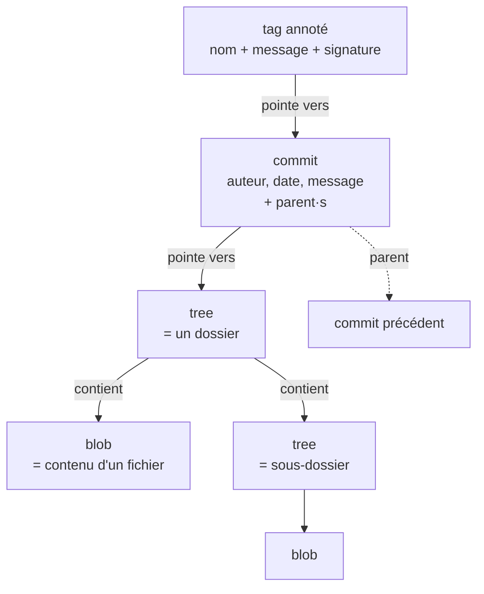

| Objet | Rôle | Analogie système de fichiers |
|---|---|---|
| **blob** | le **contenu** brut d'un fichier (sans le nom) | les octets d'un fichier |
| **tree** | un **répertoire** : liste de noms → (blob \| tree) + permissions | un dossier |
| **commit** | un **instantané** : pointe vers UN tree racine + parent(s) + métadonnées | un snapshot horodaté |
| **tag (annoté)** | un **pointeur nommé et figé** vers un commit (souvent signé) | une étiquette de version |

Points clés :

- Un **commit pointe vers un tree** (l'état complet du projet) **et vers son/ses
  parent(s)**. Le premier commit n'a pas de parent ; un commit de merge en a
  plusieurs. C'est ce chaînage parent→enfant qui forme l'**historique = un DAG**
  (graphe orienté acyclique).
- Le **nom** d'un fichier n'est pas dans le blob mais dans le tree qui le
  référence. Deux fichiers identiques = un seul blob.
- Tout est **immuable** : « modifier » un commit (`amend`, `rebase`) crée en
  réalité de **nouveaux** objets avec de **nouveaux hash**. L'ancien existe encore
  tant qu'une référence ou le reflog le retient (cf. *prune/gc*).

## Les trois zones (l'erreur de débutant n°1)

Un fichier suivi par Git existe dans **trois espaces** en même temps. Confondre
ces zones, c'est ne pas comprendre `add`, `reset` ou `restore`.

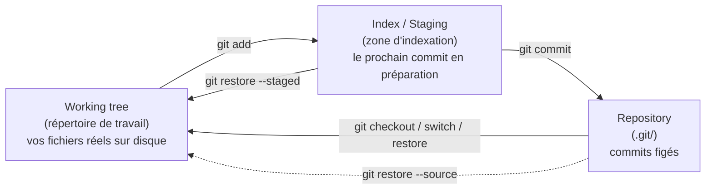

- **Working tree** (*working directory*, abrégé **wt**) : les fichiers que vous
  voyez et éditez. Un *worktree* (voir plus bas) est une instance de cet espace.
- **Index** (alias **staging area**, **cache**) : une zone tampon qui décrit
  **exactement ce qui ira dans le prochain commit**. `git add` y copie l'état
  d'un fichier. On peut indexer une partie d'un fichier (`git add -p`).
- **Repository** : le dossier `.git/` qui contient le magasin d'objets et les
  références. Les commits y sont gravés.

> `git status` se lit comme un diff entre ces zones : « Changes to be committed »
> = index vs dernier commit ; « Changes not staged » = working tree vs index.

### Pourquoi l'index est obligatoire — et utile même sans commit immédiat

Un commit n'est **pas** « l'état de mon disque maintenant » : c'est un tree figé,
construit **à partir de l'index**. L'index est donc la **source de vérité de ce
qui sera gravé** — `git commit` photographie l'index, jamais le working tree
directement. C'est pour ça qu'il est incontournable : *c'est lui qu'on
développe*. (`git commit -a` ne le saute pas — il fait juste le `git add` des
fichiers **déjà suivis** à ta place avant de commiter ; un fichier **nouveau**
échappe à `-a` et exige un `add` explicite.)

Cette séparation working tree / index, loin d'être une formalité, est un **espace
de composition** :

- **Découper un working tree en désordre en commits propres.** 5 fichiers modifiés
  pour 2 sujets ? On indexe les 3 fichiers du sujet A → commit « fix A », puis les
  2 autres → commit « feat B ». Sans index, tout partirait dans un seul commit
  fourre-tout.
- **Indexer une partie d'un fichier** (`git add -p`) : un même fichier peut avoir
  des lignes indexées (dans le prochain commit) **et** des lignes non indexées
  (gardées pour plus tard).
- **Relire avant de graver** : `git diff --staged` montre exactement ce qui
  partira.

Point qui surprend : **l'index mémorise une *version*, pas une simple intention.**

```text
git add fichier.txt    # l'index retient le CONTENU de fichier.txt à cet instant
# ... on ré-édite fichier.txt ...
git commit             # commite la version AU MOMENT DU add, pas la version actuelle du disque
```

`git status` affiche alors le fichier **à la fois** en « staged » (version add-ée)
et en « not staged » (modifs faites après) — preuve que l'index est un **vrai
troisième stockage**, avec sa propre copie du contenu, et pas un drapeau
« fichier prêt ». Analogie : l'index est le **panier de courses** ; le working
tree est le magasin ; le commit est le passage en caisse — seul ce qu'on a mis
dans le panier est acheté.

## HEAD, branches et refs : des pointeurs, rien de plus

C'est le cœur du modèle mental. Une **branche n'est pas un dossier de commits** :
c'est juste un **pointeur mobile** (un fichier texte de 41 octets contenant un
hash) vers UN commit — son sommet. Le reste de l'historique se déduit en
remontant les parents.

- **ref** (référence) : un nom lisible qui pointe vers un commit. Les branches
  (`refs/heads/...`), les branches distantes (`refs/remotes/origin/...`) et les
  tags (`refs/tags/...`) sont tous des refs.
- **HEAD** : un pointeur **vers la branche courante** (« où je suis »).
  Normalement HEAD → une branche → un commit. C'est ce qui détermine ce que
  `commit` fera avancer et ce que `checkout`/`switch` matérialise dans le working
  tree.

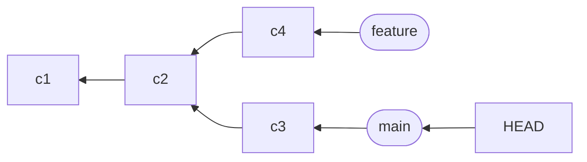

Conséquences directes :

- **Créer une branche est instantané** : on écrit juste un nouveau pointeur sur
  le commit courant. Pas de copie de fichiers.
- **Commiter** = créer un objet commit, puis **avancer la branche pointée par
  HEAD** vers ce nouveau commit.
- **Changer de branche** (`switch`/`checkout`) = déplacer HEAD vers une autre
  branche **et** réécrire le working tree pour refléter son tree.

### HEAD détaché (*detached HEAD*)

Si HEAD pointe **directement vers un commit** (et non vers une branche), on est en
**detached HEAD**. C'est ce qui arrive quand on fait `git checkout <hash>` ou
`git checkout v1.0`. On peut regarder, tester, commiter — mais les nouveaux
commits **ne sont rattachés à aucune branche** : dès qu'on repart ailleurs, ils
deviennent inaccessibles (candidats au *prune*).

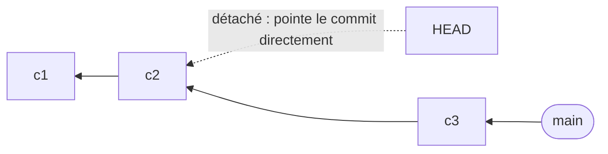

> Pour **sauver** du travail fait en HEAD détaché : `git switch -c <nom>` crée une
> branche à cet endroit et y rattache les commits.

## checkout / switch / restore : un mot pour trois actions

Le verbe **checkout** est historiquement surchargé, d'où la confusion. Git a
depuis scindé ses rôles en commandes dédiées :

| Intention | Ancien (surchargé) | Moderne (dédié) |
|---|---|---|
| Changer de branche / déplacer HEAD | `git checkout <branche>` | `git switch <branche>` |
| Créer + basculer | `git checkout -b <b>` | `git switch -c <b>` |
| Restaurer un fichier (annuler des modifs) | `git checkout -- <f>` | `git restore <f>` |
| Désindexer un fichier | `git reset <f>` | `git restore --staged <f>` |

**checkout**, conceptuellement, c'est « **matérialiser dans le working tree**
l'état d'un commit/d'une branche/d'un fichier ». Quand la cible est une branche,
ça déplace aussi HEAD ; quand c'est un fichier, ça écrase juste ce fichier sur le
disque.

## Local vs distant : remote, fetch, pull, push

Un **remote** est un alias (typiquement `origin`) vers l'URL d'un autre dépôt.
Votre dépôt garde une **copie locale en lecture seule** de l'état des branches
distantes, sous la forme de refs `origin/<branche>`. Ces refs ne bougent **que**
quand vous synchronisez.

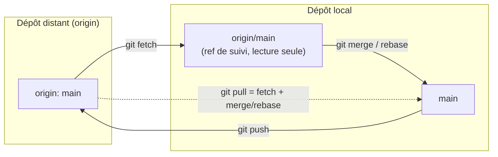

- **`git fetch`** : télécharge les nouveaux objets et **met à jour `origin/main`**.
  Ne touche **ni** votre branche `main`, **ni** vos fichiers. Opération sûre.
- **`git pull`** : `fetch` **puis** intégration (`merge` par défaut, ou `rebase`
  si configuré) de `origin/main` dans votre branche courante. Peut créer des
  conflits.
- **`git push`** : envoie vos commits locaux et **fait avancer la branche
  distante**. Refusé si elle a divergé (il faut d'abord intégrer).

> Une branche locale qui « suit » une branche distante a une **upstream**
> (relation de *tracking*). C'est ce que `git push -u origin <b>` met en place, et
> ce qui permet ensuite `git push` / `git pull` sans arguments.

## merge vs rebase : deux façons d'intégrer

Même but (incorporer le travail d'une branche dans une autre), deux formes
d'historique :

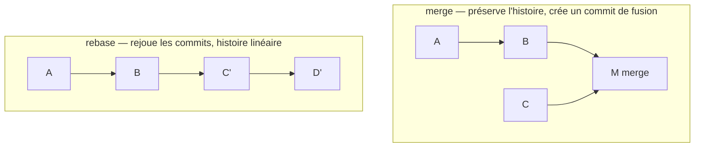

- **merge** : crée un **commit de merge** à deux parents. Ne réécrit rien,
  l'historique reflète la réalité (branches parallèles). Non destructif.
- **rebase** : **réécrit** vos commits pour les rejouer au sommet d'une autre
  branche → historique **linéaire**, plus lisible. Mais ça **crée de nouveaux
  hash** : à ne jamais faire sur des commits déjà partagés/poussés sans
  précaution (`--force-with-lease`).

Règle d'or : **rebase ce qui est local et privé, merge ce qui est public.**

## Les actes de correction : annuler, réécrire, réparer

Presque toute correction se ramène à **deux gestes seulement** :

1. **Déplacer un pointeur** (HEAD, une branche) vers un autre commit — sans rien
   créer. Rapide, mais peut « abandonner » des commits (récupérables via reflog).
2. **Créer un nouveau commit** qui exprime la correction — l'historique grossit
   mais rien n'est réécrit. Sûr, partageable.

La distinction clé qui pilote le choix : **le commit fautif est-il déjà
poussé/partagé ?** Si oui → privilégier le geste **additif** (revert), car
réécrire un historique public casse celui des autres. Si non → réécrire librement.

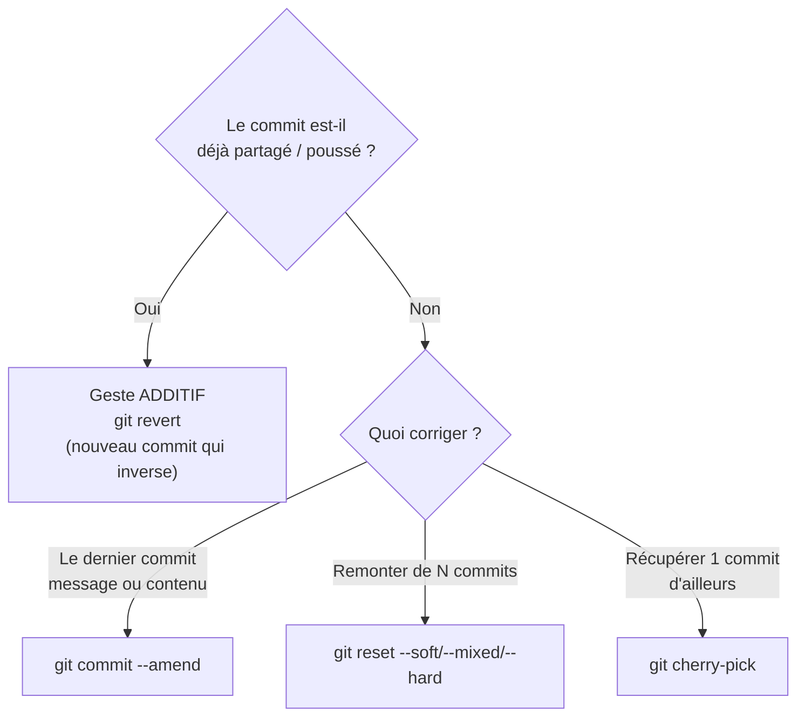

### reset : déplacer la branche, avec 3 niveaux d'effet sur les zones

`git reset <cible>` **déplace la branche courante** (et HEAD avec elle) vers
`<cible>`. La nuance — l'erreur classique — est ce qu'il fait des **trois zones** :

| Mode | Déplace la branche | Index | Working tree | Usage typique |
|---|---|---|---|---|
| `--soft` | ✅ | inchangé (modifs **restent indexées**) | inchangé | regrouper / refaire le dernier commit en gardant tout prêt |
| `--mixed` *(défaut)* | ✅ | réinitialisé (modifs **désindexées**) | inchangé | « décommiter » et ré-choisir ce qu'on indexe |
| `--hard` | ✅ | réinitialisé | **écrasé** (modifs **perdues**) | jeter tout et revenir à un état propre — **destructif** |

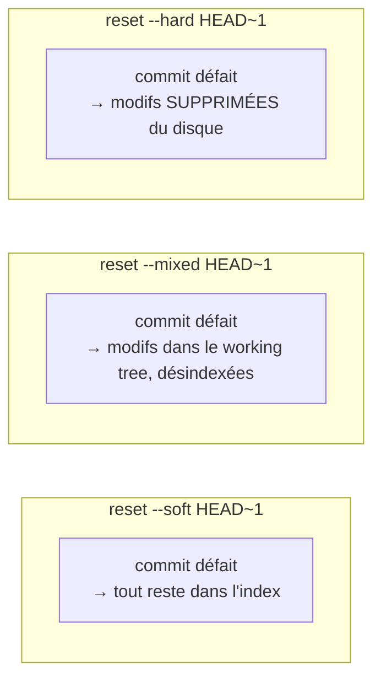

> Mémo : `--soft` garde le plus (index + wt), `--hard` garde le moins (rien).
> `--mixed` est entre les deux. Seul `--hard` touche tes fichiers sur disque.

### Corriger HEAD : detached HEAD et déplacements

« Corriger HEAD » recouvre deux situations concrètes :

- **Sortir d'un detached HEAD** (cf. section HEAD) : on a checkout un hash/tag, on a
  peut-être commité dans le vide. `git switch -c <nom>` **rattache** ces commits à
  une vraie branche ; `git switch <branche>` les **abandonne** (récupérables via
  reflog tant que `gc` n'est pas passé).
- **Repointer une branche** sans bouger les fichiers : `git reset --soft <hash>`
  déplace juste le pointeur. Pour ramener une branche exactement sur le remote :
  `git reset --hard origin/<branche>`.

### revert : annuler sans réécrire (le geste pour l'historique public)

`git revert <commit>` ne supprime rien : il **crée un nouveau commit** dont le
contenu est l'**inverse** du commit visé. L'historique garde la trace « on a fait
X puis on a annulé X ». C'est **la** bonne réponse pour annuler quelque chose
**déjà poussé**, parce que ça ne casse l'historique de personne.

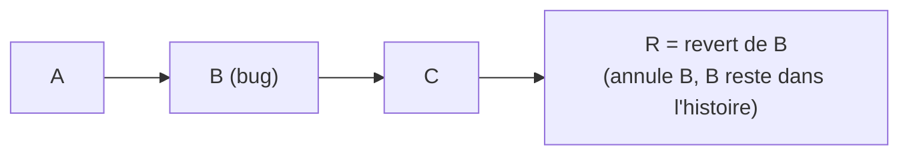

> `reset` recule le pointeur (réécrit l'histoire) ; `revert` avance avec un commit
> d'annulation (préserve l'histoire). Sur une branche partagée : **revert**.

### amend & cherry-pick : retoucher et transplanter

- **`git commit --amend`** : **remplace** le dernier commit (nouveau hash) pour
  corriger son message ou y intégrer des modifs oubliées. À ne pas faire s'il est
  déjà poussé (sinon `--force-with-lease`).
- **`git cherry-pick <commit>`** : **rejoue un commit isolé** (d'une autre branche)
  sur la branche courante — utile pour récupérer un correctif précis sans merger
  toute la branche. Crée un nouveau commit (nouveau hash, même contenu).

### Gestion des conflits : la mécanique commune

Un **conflit** survient quand deux historiques modifient **les mêmes lignes** de
façon incompatible, lors d'un `merge`, `rebase`, `cherry-pick`, `revert` ou
`stash pop`. Git **ne tranche pas** : il met l'opération en **pause**, écrit les
deux versions dans le fichier entre marqueurs, et attend ta décision.

```text
<<<<<<< HEAD
version de la branche courante
=======
version de la branche entrante
>>>>>>> autre-branche
```

La résolution suit **toujours** le même rituel, quelle que soit l'opération :

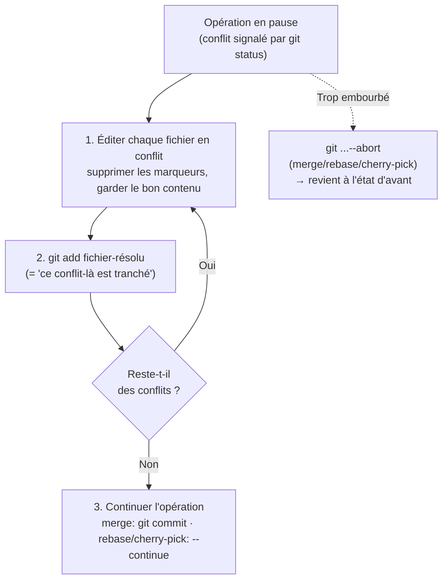

Trois réflexes :

- **`git status`** pendant un conflit liste précisément les fichiers à résoudre et
  rappelle la commande de continuation.
- **`git add`** sur un fichier édité **est** l'acte qui dit « conflit résolu » —
  c'est le même `add` que d'habitude, réutilisé comme accusé de réception.
- **`--abort`** (`git merge --abort`, `git rebase --abort`, etc.) est la porte de
  sortie : il annule proprement l'opération et restaure l'état initial. À utiliser
  sans honte dès qu'on s'embrouille.

### Le filet sous tout ça : reflog

Tous les gestes réécrivant l'historique (`reset --hard`, `rebase`, `amend`)
peuvent sembler « perdre » des commits. Ils restent **récupérables** via
`git reflog` tant que `gc` n'est pas passé — voir [section prune & gc](#prune--gc--le-ménage-des-objets-inaccessibles).
C'est ce qui rend ces opérations **réversibles en pratique**, donc moins
effrayantes qu'elles n'en ont l'air.

> Commandes exactes de tous ces gestes → [cheat-sheet Git](../cheat-sheets/git.md#annuler--corriger).

## Worktree : plusieurs répertoires de travail pour un même dépôt

Par défaut, un dépôt a **un** working tree. `git worktree` permet d'en attacher
**plusieurs** au même `.git` : chaque worktree a son propre répertoire et sa
propre branche/HEAD, mais ils partagent le magasin d'objets.

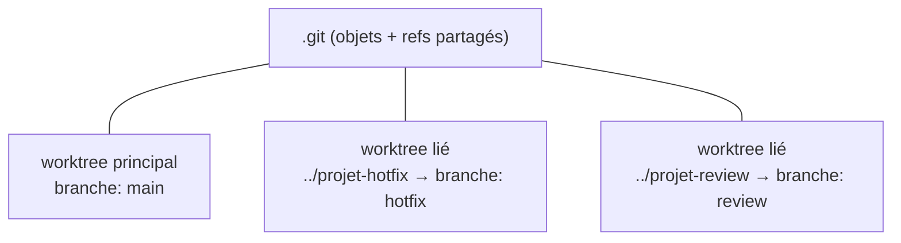

Intérêt : travailler sur un **hotfix urgent** sans `stash` ni changer de branche
dans son dossier courant, comparer deux versions côte à côte, lancer un build long
sur une branche pendant qu'on code sur une autre. Une même branche ne peut être
*checkout* que dans **un seul** worktree à la fois.

## prune & gc : le ménage des objets inaccessibles

Comme tout est immuable, Git **accumule** des objets : commits abandonnés après un
`reset --hard`, un `rebase`, un `amend`, des refs distantes supprimées… Un objet
devient **inaccessible** (*unreachable*) quand **aucune ref ni le reflog** n'y mène.

- **`gc`** (*garbage collect*) : compacte le dépôt et **supprime** les objets
  inaccessibles dont la période de grâce est écoulée (≈ 2 semaines, et ~30 jours
  pour le reflog). Tourne souvent automatiquement.
- **prune** apparaît dans deux contextes distincts — ne pas les confondre :
  - **`git prune`** : supprime les **objets** inaccessibles (sous-routine de `gc`,
    rarement appelée à la main).
  - **`git fetch --prune` / `git remote prune origin`** : supprime les **refs de
    suivi** `origin/<b>` qui ne correspondent plus à aucune branche distante
    (branches supprimées côté serveur). Ne touche pas à vos branches locales.

> **Filet de sécurité : le reflog.** `git reflog` journalise tous les déplacements
> de HEAD (et des branches). Tant que `gc` n'est pas passé, un commit « perdu » par
> un `reset --hard` ou un `rebase` raté reste **récupérable** via son hash trouvé
> dans le reflog. C'est l'antidote n°1 à la panique.

## Anatomie de .git/ (pour démystifier)

```text
.git/
├── HEAD                 # pointeur vers la branche courante (ex: "ref: refs/heads/main")
├── config               # config locale du dépôt (remotes, options)
├── index                # l'index / staging area (binaire)
├── objects/             # le magasin d'objets (blobs, trees, commits, tags)
│   └── pack/            # objets compactés par gc
├── refs/
│   ├── heads/           # une branche locale = un fichier contenant un hash
│   ├── remotes/origin/  # refs de suivi des branches distantes
│   └── tags/            # les tags
└── logs/                # le reflog (historique des déplacements)
```

Tout ça est **du texte et des objets sur disque**. Une branche, c'est
littéralement un fichier de 41 octets. Ça dédramatise : « supprimer une branche »
n'efface pas les commits, ça efface un pointeur.

## Lexique express

| Terme | Définition courte |
|---|---|
| **HEAD** | pointeur vers la branche (ou le commit) courant·e |
| **ref** | nom lisible pointant vers un commit (branche, tag, suivi distant) |
| **blob / tree / commit** | contenu d'un fichier / dossier / instantané + métadonnées |
| **working tree (wt)** | les fichiers réels sur le disque |
| **index / staging** | tampon décrivant le prochain commit |
| **detached HEAD** | HEAD pointe un commit directement, hors de toute branche |
| **upstream / tracking** | branche distante qu'une branche locale suit |
| **fast-forward** | avance d'un pointeur sans commit de merge (histoire non divergente) |
| **DAG** | graphe orienté acyclique formé par les commits et leurs parents |
| **worktree** | répertoire de travail attaché à un dépôt (il peut y en avoir plusieurs) |
| **prune** | suppression d'objets ou de refs de suivi devenus inaccessibles |
| **gc** | compactage + nettoyage automatique du dépôt |
| **reflog** | journal local des déplacements de HEAD/branches (filet de récupération) |
| **stash** | remise de côté temporaire des modifs en cours |
| **cherry-pick** | rejouer un commit isolé sur la branche courante |

## Le cycle de vie d'une modification (synthèse)

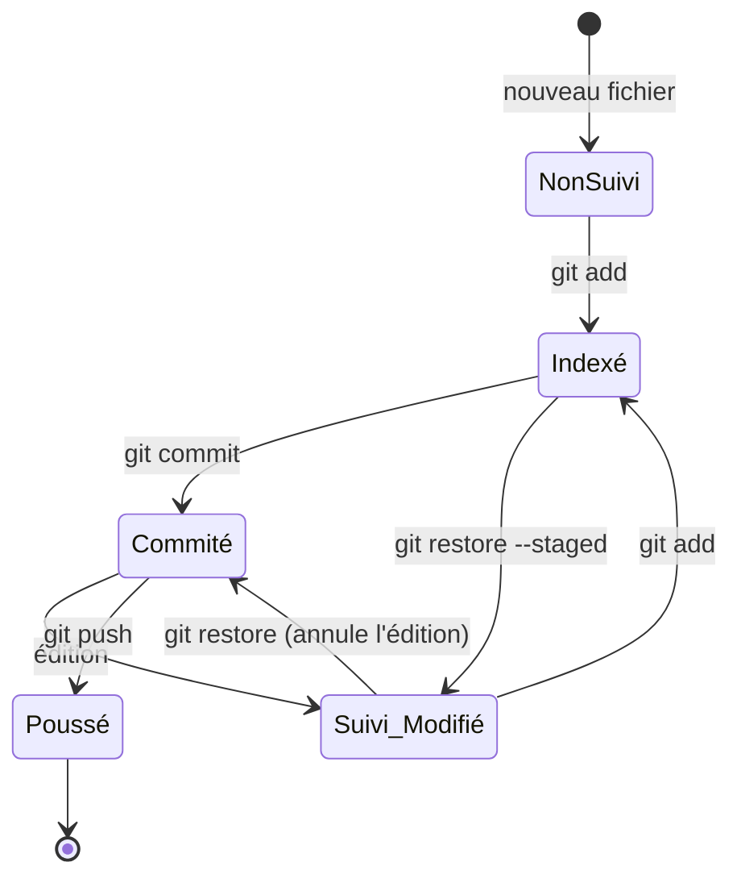

## Voir aussi

- [Cheat-sheet Git](../cheat-sheets/git.md) — les commandes et enchaînements concrets.
- [Cheat-sheet gh (GitHub CLI)](../cheat-sheets/gh-cli.md) — interaction avec GitHub.
- Documentation officielle : [git-scm.com/book](https://git-scm.com/book/fr/v2)
  (le chapitre « Git Internals » détaille le modèle d'objets).
