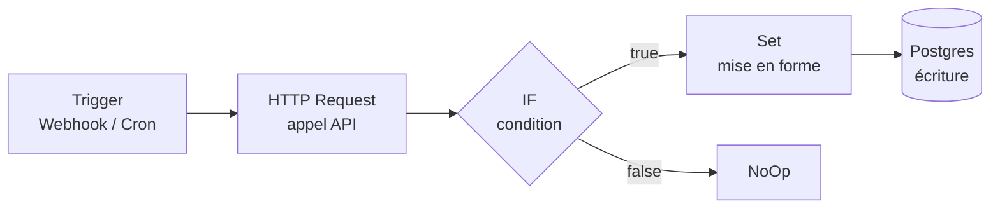
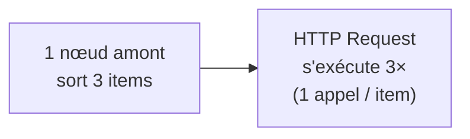
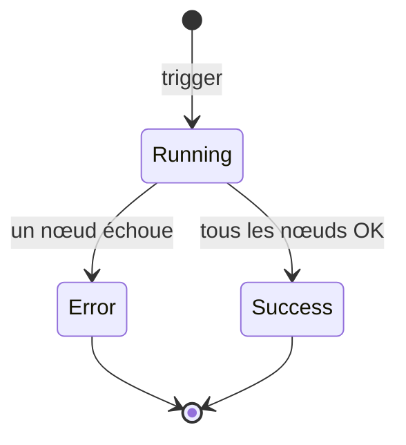

# n8n : modèle mental, vocabulaire et principes

n8n (prononcé « *n-eight-n* », pour *nodemation*) est un outil d'**automatisation
de workflows** : on relie visuellement des services (API, bases, fichiers, LLM…)
pour qu'une action en déclenche d'autres, sans écrire toute la plomberie. La
difficulté pour un débutant n'est pas l'interface mais de comprendre **ce qui
circule entre les nœuds** : n8n ne fait pas passer « une valeur », il fait passer
une **liste d'items**, et chaque nœud s'exécute **une fois par item**. Une fois ce
modèle en tête, 80 % des blocages (« pourquoi mon nœud tourne 5 fois ? », « mon
expression renvoie *undefined* ») deviennent évidents.

> Pour le **comment** (syntaxe des expressions, déploiement Docker, CLI, patterns
> concrets) → [cheat-sheet n8n](../cheat-sheets/n8n.md).
> Cette fiche-ci, c'est le **quoi** et le **pourquoi**.

## L'idée fondatrice : un workflow est un graphe de nœuds

Un **workflow** est un graphe orienté de **nœuds** (*nodes*) reliés par des
**connexions**. Chaque nœud est une brique qui reçoit des données, fait *une*
chose (appeler une API, filtrer, transformer, écrire en base…) et transmet un
résultat au nœud suivant. Il n'y a pas de « code principal » : le flux **est** le
graphe, lu de gauche à droite en suivant les fils.



Deux natures de nœuds à ne pas confondre :

| Type | Rôle | Exemples |
|---|---|---|
| **Trigger** (déclencheur) | **Démarre** le workflow. Toujours en tête, sans entrée. | Webhook, Schedule (cron), interval, réception d'e-mail, message chat |
| **Action / logique** | Traite les données reçues et les transmet. | HTTP Request, Set, IF, Merge, Code, connecteurs (Slack, Notion…) |

Un workflow **sans trigger ne peut pas s'exécuter** en production ; on ne peut que
le lancer à la main pour tester.

## Le cœur : les données circulent comme une liste d'items

C'est **le** concept qui débloque tout. Entre deux nœuds ne circule pas une valeur
unique, mais un **tableau d'items**. Chaque **item** est un objet JSON, structuré
en deux parties :

```json
[
  { "json": { "id": 1, "nom": "Alice" }, "binary": {} },
  { "json": { "id": 2, "nom": "Bob"   }, "binary": {} }
]
```

- `json` : les **données structurées** (ce qu'on manipule 99 % du temps).
- `binary` : les **fichiers** attachés (PDF, image…), stockés à part du JSON.

Conséquence fondamentale — **l'exécution par item** :

> Un nœud d'action s'exécute **une fois pour chaque item** qu'il reçoit en entrée.

Si un nœud « HTTP Request » reçoit 50 items, il fait **50 appels**. Ce n'est pas un
bug : c'est le modèle. Le débutant qui voit son nœud « tourner plusieurs fois »
n'a pas compris qu'il lui a envoyé plusieurs items. Pour changer ce comportement,
on **modifie le nombre d'items** en amont (agréger, filtrer, découper), pas le nœud
lui-même.



### Le fil rouge : chaque item garde sa lignée

n8n conserve **quel item de sortie provient de quel item d'entrée** (l'*item
linking*). C'est ce qui permet, plus loin dans le workflow, de « remonter » vers la
donnée d'un nœud précédent pour **le bon item**. Comprendre ça explique pourquoi
`$json` (l'item courant) et `$('NomDuNœud').item` (l'item lié en amont) ne
renvoient pas la même chose.

## Les expressions : injecter du dynamique dans les champs

Un champ de nœud peut contenir une **valeur fixe** ou une **expression** évaluée à
l'exécution. Une expression est du JavaScript entre `{{ }}` :

```
{{ $json.email }}                 → le champ email de l'item courant
{{ $json.nom.toUpperCase() }}     → transformation à la volée
{{ $now.toISO() }}                → date courante
{{ $('Webhook').item.json.id }}   → une donnée d'un nœud nommé, item lié
```

Variables de contexte clés (le vocabulaire à connaître) :

| Variable | Désigne |
|---|---|
| `$json` | le JSON de **l'item courant** en entrée du nœud |
| `$input` | l'ensemble des items entrants (`.all()`, `.first()`…) |
| `$('Nom')` | la sortie d'un **autre nœud** nommé (pour piocher en amont) |
| `$now` / `$today` | date/heure courante (objet DateTime, pas une string) |
| `$env` | variables d'environnement (si autorisé) |
| `$vars` / `$secrets` | variables et secrets partagés de l'instance |

> Détail de la syntaxe et des recettes d'expressions → [cheat-sheet n8n](../cheat-sheets/n8n.md).

## Credentials : les secrets sont séparés des workflows

Une **credential** est un jeu de secrets (clé API, token OAuth, login DB) **stocké
chiffré** dans n8n, séparément des workflows. Un nœud *référence* une credential par
son nom ; il ne contient jamais le secret en clair. Deux vertus :

- On **partage/exporte un workflow** (JSON) sans fuiter les secrets.
- On change un token **à un seul endroit** pour tous les nœuds qui l'utilisent.

C'est l'équivalent n8n du principe « jamais de secret en dur dans le code ».

## Exécutions : chaque lancement est tracé

Chaque déclenchement d'un workflow produit une **execution** : un enregistrement
horodaté de ce qui s'est passé, nœud par nœud, avec les données réelles qui ont
circulé. C'est **l'outil de debug n°1** : on ouvre une exécution passée (ou échouée)
et on **inspecte la sortie de chaque nœud** pour voir où la donnée a divergé.



Une exécution peut être **success**, **error**, ou **waiting** (workflow en pause,
p. ex. sur un délai ou une attente de webhook). Les échecs peuvent être routés vers
un **Error Workflow** dédié (notification, retry).

## Active vs manuel : deux modes de vie

| Mode | Comment | Ce qui déclenche |
|---|---|---|
| **Manuel** (test) | bouton *Execute Workflow* dans l'éditeur | vous, pour tester |
| **Active** (production) | bascule *Active* activée | le trigger réel (webhook, cron…) |

Piège classique : un **Webhook a deux URL** — une de *test* (n'écoute qu'un coup,
quand l'éditeur est ouvert) et une de *production* (active en permanence, seulement
si le workflow est **Active**). Beaucoup de « mon webhook ne répond pas » viennent
d'un workflow resté inactif ou de l'URL de test utilisée en prod.

## Où ça tourne : cloud vs self-hosted

n8n existe en **offre cloud** (géré) et en **self-hosted** (que l'on héberge
soi-même, cœur sous licence *fair-code* / *Sustainable Use License*). Le
self-hosted tourne typiquement en conteneur, avec un **stockage persistant** pour
la base (workflows, credentials chiffrées, exécutions) et une **clé de chiffrement**
(`N8N_ENCRYPTION_KEY`) qu'il faut **sauvegarder** : la perdre rend les credentials
illisibles.

> Déploiement concret (Docker, variables d'environnement, CLI) →
> [cheat-sheet n8n](../cheat-sheets/n8n.md).

## Le vocabulaire en une table

| Terme | Définition courte |
|---|---|
| **Workflow** | le graphe de nœuds ; l'unité qu'on crée et exécute |
| **Node (nœud)** | une brique qui fait une chose (trigger, action, logique) |
| **Trigger** | nœud de tête qui démarre le workflow |
| **Connexion** | le fil qui relie la sortie d'un nœud à l'entrée d'un autre |
| **Item** | un objet JSON qui circule ; un nœud s'exécute une fois par item |
| **`json` / `binary`** | les deux compartiments d'un item : données / fichiers |
| **Expression** | JavaScript entre `{{ }}` évalué à l'exécution |
| **Credential** | secrets chiffrés, référencés par les nœuds, jamais en clair |
| **Execution** | trace horodatée d'un lancement, nœud par nœud (debug) |
| **Active** | état d'un workflow branché sur son vrai trigger (prod) |
| **Sub-workflow** | workflow appelé par un autre (nœud *Execute Workflow*) — réutilisation |

## Les cinq réflexes de débutant

1. **« Ça tourne plusieurs fois »** → normal : tu envoies plusieurs items. Regarde
   la **sortie du nœud amont**, agrège ou filtre si besoin.
2. **Une expression renvoie `undefined`** → le chemin `$json.x` ne correspond pas à
   la structure réelle. Ouvre l'**exécution** et lis la vraie sortie du nœud
   précédent.
3. **Webhook muet** → workflow **Active** ? bonne URL (**prod** vs test) ? bonne
   méthode HTTP ?
4. **Secret qui traîne** → mets-le dans une **credential**, jamais dans un champ ou
   une expression.
5. **Debug** → toujours par les **executions**, pas en devinant : la donnée réelle
   de chaque nœud y est visible.

## Voir aussi

- [Cheat-sheet n8n](../cheat-sheets/n8n.md) — expressions, nœuds courants, Docker, CLI, webhooks.
- [Cheat-sheet Docker](../cheat-sheets/docker.md) — pour l'hébergement self-hosted.
- [Encodages courants](./encodages-courants.md) — base64/URL, utile pour les payloads webhook.
