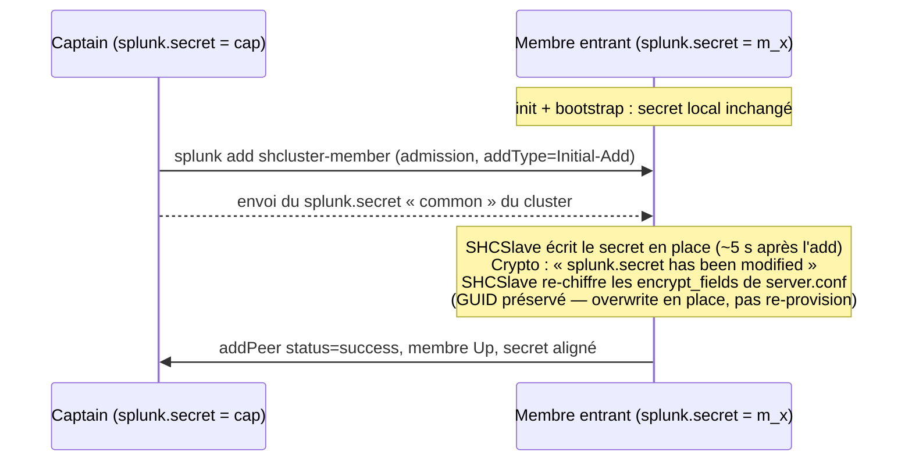

> 🇬🇧 English version: [EN/shc-splunk-secret-propagation.md](r_knowledge_base_pro/concepts/EN/shc-splunk-secret-propagation.md)

# `splunk.secret` dans un Search Head Cluster — propagation à l'ajout de membre

Faut-il **copier manuellement `splunk.secret` sur tous les membres** d'un Search
Head Cluster (SHC) avant de le former ? C'est la croyance courante. Cette fiche
montre, mesures à l'appui, que sur Splunk Enterprise **9.4.6** le fichier
`splunk.secret` d'un membre entrant est **écrasé par celui du captain au moment
où on l'ajoute au cluster** — sans intervention manuelle, et sans que la doc
vendeur le documente.

> Observations empiriques sur **Splunk Enterprise 9.4.6**, SHC 3 membres monté à
> la main, deux runs indépendants. Le comportement peut différer sur d'autres
> versions — la **méthode d'instrumentation** ci-dessous reste valable pour
> re-vérifier sur la sienne.

---

## 1. Deux objets à ne pas confondre

| Objet | Rôle | Doit-il être identique entre membres ? |
|---|---|---|
| **`pass4SymmKey`** (`[shclustering]`, posé par `--secret` à l'`init`) | *Security key* : authentifie les échanges entre membres et avec le deployer | **Oui, doc explicite.** Saisi en clair, il devient chiffré au premier start et n'est plus récupérable depuis `server.conf`. |
| **`splunk.secret`** (`etc/auth/splunk.secret`) | Clé qui **chiffre les secrets** stockés dans les `.conf` (mots de passe, `pass4SymmKey`, credentials d'app) | **La doc est silencieuse.** C'est l'objet de cette fiche. |

La confusion vient de là : la doc impose l'alignement de `pass4SymmKey`, et
beaucoup en déduisent qu'il faut aussi aligner `splunk.secret` à la main. La
mesure montre que le cluster s'en charge — à une étape précise.

## 2. Méthode d'instrumentation (sans fuite)

On ne lit jamais le contenu de `splunk.secret` ; on en capture une **empreinte**
non réversible, sur chaque nœud, à chaque transition du montage :

```bash
sudo sha256sum "$SPLUNK_HOME/etc/auth/splunk.secret" | cut -c1-16
```

Deux empreintes identiques ⇒ fichiers identiques. On corrèle aussi la **mtime**
du fichier (`date -r`) et le **GUID** de l'instance (`etc/instance.cfg`) pour
distinguer un *écrasement en place* d'une ré-identification du nœud.

Étapes instrumentées : **S0** post-install (avant toute conf SHC) → **S1** après
`init shcluster-config` sur chaque membre → **S2** après `bootstrap
shcluster-captain` → **S3** avant/après chaque `add shcluster-member` → **S4**
cluster *healthy*.

## 3. Ce qu'on observe

Matrice d'empreintes (notées symboliquement `cap`, `m2`, `m3` = valeurs
distinctes au départ) :

| Étape | captain | membre 2 | membre 3 |
|---|---|---|---|
| S0 baseline | `cap` | `m2` | `m3` |
| S1 après `init` ×3 | `cap` | `m2` | `m3` |
| S2 après `bootstrap` | `cap` | `m2` | `m3` |
| avant `add` membre 2 | `cap` | `m2` | `m3` |
| **après `add` membre 2** | `cap` | **`cap`** | `m3` |
| **après `add` membre 3** | `cap` | `cap` | **`cap`** |
| S4 healthy | `cap` | `cap` | `cap` |

Faits saillants, reproduits sur deux runs et corroborés par la **mtime** du
fichier (à la seconde près) :

- `init` et `bootstrap` **ne touchent pas** `splunk.secret` : les trois valeurs
  restent distinctes tant qu'aucun membre n'est ajouté.
- L'écrasement se produit **exactement à `splunk add shcluster-member`**,
  **~5 s** après l'admission, de façon identique pour chaque membre ajouté.
- Le membre entrant **adopte l'empreinte du captain**. Son **GUID reste
  inchangé** : c'est bien le fichier `splunk.secret` qui est réécrit en place, pas
  une réinstallation du nœud.
- La valeur qui survit est celle du **captain au moment du join**. Une
  réélection de captain ultérieure ne re-propage pas de secret.

## 4. Mécanisme — composant `SHCSlave` (+ `Crypto`)

`splunkd.log` du membre entrant, pile à la seconde de la bascule (`mtime` du
fichier), révèle la séquence causale — c'est un **ré-encryptage d'onboarding
intentionnel**, pas un effet de bord de réplication générique :

```text
SHCSlave - Checking for re-encryption of all the fields in encrypt_fields in
           server.conf with new common Search Head Clustering Splunk.secret from
           the captain
Crypto   - splunk.secret has been modified since last read. Re-reading secret.
SHCSlave - Succesfully finished re-encrypting with Search Head Cluster common
           splunk.secret
...      - event=addPeer status=success addType=Initial-Add captain=https://<captain>:8089
```

Lecture : à l'admission, le membre reçoit du captain le `splunk.secret`
**commun** au cluster, l'écrit en place (d'où le `Crypto: splunk.secret has been
modified`), puis **re-chiffre les champs `encrypt_fields` de `server.conf`** avec
ce nouveau secret — de sorte que ses propres secrets locaux restent lisibles
après l'échange de clé. Le terme « *common … from the captain* » confirme un
comportement **produit-intentionnel**, orchestré par le rôle `SHCSlave`. Séquence
identique et indépendamment reproduite sur chaque membre ajouté.



## 5. Pourquoi c'est logique (et pourquoi la doc n'en parle pas)

Un membre reçoit du captain le *bundle de configuration répliquée*. Si ce bundle
contient des credentials **chiffrés avec le `splunk.secret` du captain**, le
membre ne peut les déchiffrer qu'en possédant **le même** `splunk.secret`.
Aligner le secret à l'onboarding résout ce problème à la racine. Le
comportement est cohérent avec l'architecture de réplication SHC — mais la doc
Splunk ne décrit que la réplication du bundle et l'exigence sur `pass4SymmKey`,
**pas** la propagation du fichier `splunk.secret`. D'où le décalage entre la
croyance (« copier à la main ») et la réalité mesurée.

## 6. Implications pratiques

- Pour un **onboarding SHC standard** (membre neuf ajouté via `add
  shcluster-member`), il n'est **pas nécessaire** de pré-copier `splunk.secret` :
  le join l'aligne. La croyance inverse est une précaution surdimensionnée pour
  ce cas.
- La précaution **reste pertinente hors de ce chemin** : `splunk.secret` du
  **deployer** doit correspondre pour que les credentials d'app poussés via
  `apply shcluster-bundle` soient déchiffrables par les membres — le deployer
  n'est pas un membre et n'est pas couvert par ce mécanisme d'onboarding.
- **Ne dépends pas de ce comportement sans l'avoir vérifié sur ta version** : il
  n'est pas documenté, donc pas contractuel. Utilise la méthode ci-dessous.

## 7. Re-vérifier sur sa version

1. Monte un SHC jetable (3 membres, installs **fraîches** → secrets distincts au
   départ ; vérifier au S0 que les empreintes ET les GUID diffèrent).
2. Capture l'empreinte `sha256 | cut` sur chaque nœud à chaque étape S0→S4.
3. Après chaque `add shcluster-member`, **poll** l'empreinte du membre toutes les
   2 s pour mesurer la latence d'adoption.
4. Corrèle avec la `mtime` du fichier et le composant de `splunkd.log` au moment
   de la bascule.

## Sources

- [Set a security key for the search head cluster — Splunk Docs 9.4](https://help.splunk.com/en/splunk-enterprise/administer/distributed-search/9.4/configure-search-head-clustering/set-a-security-key-for-the-search-head-cluster) — `pass4SymmKey` identique requis ; devient non récupérable après start.
- [Configuration updates that the cluster replicates — Splunk Docs 9.4.1](https://docs.splunk.com/Documentation/Splunk/9.4.1/DistSearch/HowconfrepoworksinSHC) — le membre télécharge le bundle de conf répliquée du captain au join ; silencieux sur `splunk.secret`.
- [Add a cluster member — Splunk Docs 9.4](https://help.splunk.com/en/splunk-enterprise/administer/distributed-search/9.4/manage-search-head-clustering/add-a-cluster-member).
