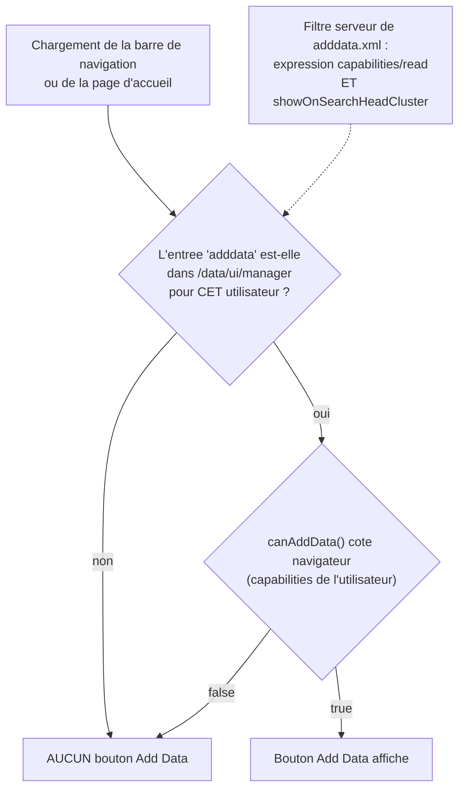

# Le bouton « Add Data » : quelles capabilities, et pourquoi il n'existe pas en SHC

Quelles capabilities faut-il accorder à un rôle pour qu'un utilisateur voie le
bouton **Add Data** dans Splunk Web ? La réponse tient en deux conditions
cumulatives, dont **une seule dépend des capabilities**. L'autre dépend de la
topologie : sur un **membre de Search Head Cluster**, la page n'est pas servie,
et aucun jeu de capabilities ne fait apparaître le bouton.

> Observations relevées sur **Splunk Enterprise 9.4.6** (Linux), sur un banc
> comportant des instances membres de SHC et des instances hors SHC. Les
> expressions citées sont **lues dans le produit installé**, pas dans la
> documentation vendeur. La méthode du §6 permet de re-vérifier sur sa propre
> version.

---

## 1. Deux conditions, pas une

Le rendu du bouton, dans le modèle utilisateur de Splunk Web
(`share/splunk/search_mrsparkle/exposed/build/modules_nav/*/index.js`), s'écrit :

```js
userCanAddData = this.model.user.canAddData()
                 && this.collection.managers.findByEntryName("adddata")
```

Deux facteurs, évalués côté navigateur, mais dont le second est **rempli par le
serveur** : `collection.managers` est la liste servie par
`/servicesNS/nobody/<app>/data/ui/manager`, elle-même filtrée par splunkd.



La conséquence pratique est qu'un diagnostic « il manque une capability » est
faux une fois sur deux : il faut d'abord vérifier que l'entrée existe pour cet
utilisateur, ensuite seulement discuter des droits.

---

## 2. Le filtre serveur

Il est déclaré dans la définition de la page de gestion,
`etc/apps/search/default/data/ui/manager/adddata.xml` (et son jumeau
`adddatamethods.xml`), verbatim :

```xml
<endpoint name="adddata" template="/splunk_gdi:templates/home_template.html"
          type="html" showOnSearchHeadCluster="0">
    <capabilities>
        <read>(edit_upload_and_index AND edit_tcp_stream) OR edit_monitor OR edit_tcp
              OR edit_udp OR edit_scripted OR edit_token_http OR edit_deployment_server
              OR edit_win_wmiconf OR edit_win_regmon OR edit_win_eventlogs
              OR edit_modinput_admon OR edit_modinput_perfmon OR edit_modinput_winhostmon
              OR edit_modinput_winnetmon OR edit_modinput_winprintmon
              OR admin_all_objects</read>
    </capabilities>
</endpoint>
```

Deux choses s'y lisent, et la seconde est la plus importante :

- l'expression `<read>` : **une seule** de ces capabilities suffit, sauf pour le
  couple `edit_upload_and_index AND edit_tcp_stream` qui ne vaut que groupé ;
- `showOnSearchHeadCluster="0"` : l'entrée est **retirée sur un membre de SHC**,
  indépendamment de l'utilisateur et de ses droits.

---

## 3. Le filtre navigateur

`canAddData()` se décompose ainsi dans le bundle servi par Splunk Web (noms de
fonctions et corps repris tels quels) :

```js
canAddData()      => (canUploadData() || canMonitorData() || canForwardData())
                     && !serverInfo.isHunk()
canUploadData()   => (edit_tcp && edit_monitor) || (edit_upload_and_index && edit_tcp_stream)
canMonitorData()  => edit_monitor || edit_tcp || edit_udp || edit_scripted
                     || edit_token_http || edit_win_eventlogs || edit_win_regmon
                     || edit_win_wmiconf || (une capability prefixee edit_modinput_)
canForwardData()  => edit_deployment_server
```

Les trois sous-fonctions portent les noms des trois méthodes proposées par la
page (*Upload*, *Monitor*, *Forward*) : la structure suggère qu'elles gouvernent
aussi l'affichage de ces trois tuiles. Déduction du nommage, non mesurée ici.

**Trois écarts avec le filtre serveur**, et ils ont des conséquences :

| Écart | Serveur | Navigateur | Effet |
|---|---|---|---|
| `admin_all_objects` | accepté | **absent de la formule** | l'entrée est servie, mais le bouton ne s'affiche pas si c'est la **seule** capability du rôle |
| Modular inputs | **cinq** noms énumérés (`admon`, `perfmon`, `winhostmon`, `winnetmon`, `winprintmon`) | **tout** `edit_modinput_*` | une capability de modular input hors liste (par exemple celle de l'input journald sous Linux) satisfait le navigateur mais **pas** le serveur : pas de bouton |
| `edit_upload_and_index` seul | refusé | refusé | il **faut** `edit_tcp_stream` avec, dans les deux cas |

---

## 4. Matrice mesurée (instance hors SHC)

Protocole : un rôle par ligne, **une seule capability** (aucun rôle hérité), un
utilisateur jetable par rôle, puis lecture de
`/servicesNS/nobody/search/data/ui/manager` **avec les identifiants de cet
utilisateur**. La colonne « entrées » est le nombre total d'entrées de gestion
visibles par ce rôle, bon indicateur de la surface d'administration ouverte.

| Capability unique du rôle | Entrées de gestion | `adddata` servie | Bouton attendu |
|---|---|---|---|
| aucune | 59 | non | non |
| `edit_monitor` | 63 | **oui** | **oui** |
| `edit_tcp` | 63 | **oui** | **oui** |
| `edit_udp` | 63 | **oui** | **oui** |
| `edit_scripted` | 63 | **oui** | **oui** |
| `edit_token_http` | 63 | **oui** | **oui** |
| `edit_deployment_server` | 62 | **oui** | **oui** |
| `edit_upload_and_index` | 59 | non | non |
| `edit_tcp_stream` | 59 | non | non |
| `edit_upload_and_index` + `edit_tcp_stream` | 61 | **oui** | **oui** |
| `admin_all_objects` | 67 | **oui** | **non** (§3, écart navigateur) |
| capability d'un modular input hors liste | 59 | non | non |
| `edit_forwarders` | 59 | non | non |
| `list_inputs` | 59 | non | non |

Deux pièges que la matrice tranche :

- **`edit_forwarders` et `list_inputs` ne servent à rien ici.** Ce sont les
  candidats intuitifs (« droit sur les entrées », « droit sur les forwarders »),
  et ni l'un ni l'autre n'apparaît dans l'expression.
- **`admin_all_objects` n'est pas un raccourci.** Il ouvre la page par URL
  directe mais ne fait pas apparaître le bouton : un rôle d'administration
  construit autour de cette seule capability donne un utilisateur qui « ne
  trouve pas Add Data » alors que la page lui est accessible.

### Capabilities réellement disponibles selon la plateforme

Sur une instance **Linux** de ce banc, sur 167 capabilities déclarées, les
termes Windows de l'expression (`edit_win_wmiconf`, `edit_win_regmon`,
`edit_win_eventlogs`, `edit_modinput_admon`, `edit_modinput_perfmon`,
`edit_modinput_winhostmon`, `edit_modinput_winnetmon`,
`edit_modinput_winprintmon`) **n'existent pas** : ils ne sont donc pas
attribuables. La liste utile s'y réduit à `edit_monitor`, `edit_tcp`,
`edit_udp`, `edit_scripted`, `edit_token_http`, `edit_deployment_server`, et au
couple `edit_upload_and_index` + `edit_tcp_stream`.

---

## 5. Sur un membre de SHC : le bouton n'existe pour personne

Mesuré avec un compte disposant de **toutes** les capabilities, sur la même
version et le même banc :

| Instance | Entrées de `/data/ui/manager` | `adddata` / `adddatamethods` |
|---|---|---|
| membre de SHC (captain) | 93 | **absentes** |
| instance hors SHC (rôle manager de cluster) | 124 | présentes |
| instance hors SHC (rôle deployer) | 124 | présentes |

L'écart de 31 entrées est le lot des pages de gestion marquées
`showOnSearchHeadCluster="0"` : configurées par bundle, elles n'ont pas de sens
à l'unité sur un membre.

Et l'URL directe de la page ne rattrape pas l'absence du bouton : sur le membre
de SHC, `GET /<locale>/manager/<app>/adddata` répond **HTTP 200** avec la page
**« Page not available »**, tandis que la même URL sur une instance hors SHC
rend bien l'assistant. Le code de retour ne distingue donc pas les deux cas :
c'est le **contenu** qu'il faut regarder, piège classique du diagnostic par
`curl -o /dev/null -w '%{http_code}'`.

> **Lecture opérationnelle.** Si l'utilisateur final travaille sur un SHC, la
> demande « donner Add Data à tel rôle » n'a pas de solution par les
> capabilities. Les issues sont ailleurs : déclarer les entrées par bundle
> depuis le deployer, passer par un Deployment Server pour les forwarders, ou
> exposer une instance de saisie hors cluster. Le refuser tôt évite une
> campagne de tests de droits qui ne peut pas aboutir.

---

## 6. Méthode reproductible

Rien de ce qui précède ne demande un navigateur : le facteur serveur se lit en
REST, le facteur navigateur se lit dans le bundle JavaScript livré.

```bash
# 1. Le filtre serveur, verbatim (sur n'importe quelle instance)
cat $SPLUNK_HOME/etc/apps/search/default/data/ui/manager/adddata.xml

# 2. La formule navigateur, verbatim
grep -o 'canAddData:function()\{0,3000\}' \
  $SPLUNK_HOME/share/splunk/search_mrsparkle/exposed/build/modules_nav/enterprise/index.js

# 3. L'entree est-elle servie A CET UTILISATEUR ?
curl -sk -u '<user>:<password>' \
  'https://<instance>:8089/servicesNS/nobody/search/data/ui/manager?output_mode=json&count=0' \
  | jq -r '.entry[].name' | grep -c '^adddata$'

# 4. Matrice : un role = une capability, un utilisateur jetable, puis suppression
curl -sk -u '<admin>:<password>' -d name=<role> -d capabilities=<capability> \
  https://<instance>:8089/services/authorization/roles
curl -sk -u '<admin>:<password>' -d name=<user> -d password=<generated> -d roles=<role> \
  https://<instance>:8089/services/authentication/users
# ... mesure a l'etape 3 ...
curl -sk -u '<admin>:<password>' -X DELETE https://<instance>:8089/services/authentication/users/<user>
curl -sk -u '<admin>:<password>' -X DELETE https://<instance>:8089/services/authorization/roles/<role>
```

Points de méthode qui ont compté :

- **Mesurer le filtre serveur par utilisateur, pas en admin.** La liste
  `/data/ui/manager` est filtrée par les droits de l'appelant : c'est ce qui en
  fait un révélateur exact de l'expression `<read>`, à condition de
  s'authentifier avec le compte testé.
- **Un rôle sans rôle hérité.** Un `imported_roles` non vide fait entrer les
  capabilities du rôle parent et rend la ligne de matrice ininterprétable.
- **Ne pas conclure d'un code HTTP.** Voir le « Page not available » en 200 du
  §5.

---

## Voir aussi

- [Comptes de service Splunk créés par fichiers de configuration, sans API](./splunk-comptes-de-service-par-fichiers.md)
- [Déclencheurs de rolling restart : SHC & cluster d'indexers](./splunk-rolling-restart-triggers.md) : `authorize.conf` est rechargé à chaud, la création d'un rôle ne demande donc pas de redémarrage.
- [Deployment Server](./splunk-deployment-server.md) : la voie de saisie des entrées quand l'interface n'est pas disponible.
- [Cycle de vie d'un évènement Splunk](./splunk-cycle-de-vie-evenement.md)
