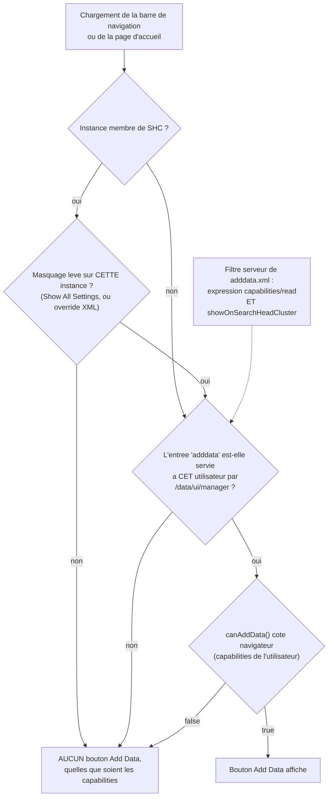

# Le bouton « Add Data » : quelles capabilities, et pourquoi il est masqué en SHC

Quelles capabilities faut-il accorder à un rôle pour qu'un utilisateur voie le
bouton **Add Data** dans Splunk Web ? La réponse tient en **trois** conditions
cumulatives, dont une seule porte sur les capabilities d'entrée de données. Sur
un **membre de Search Head Cluster**, la page de gestion est masquée par défaut :
le bouton n'apparaît pour personne tant que **Settings > Show All Settings** n'a
pas été activé sur cette instance, et cet état n'est ni répliqué aux autres
membres, ni accessible à un rôle ordinaire. Une configuration durable existe,
elle est mesurée au §6.

> Observations relevées sur **Splunk Enterprise 9.4.6** (Linux), sur un banc
> comportant des membres de SHC et des instances hors SHC. Les expressions
> citées sont **lues dans le produit installé**, pas dans la documentation
> vendeur. La méthode du §8 permet de re-vérifier sur sa propre version.

---

## 1. Trois conditions, pas une

Le rendu du bouton, dans le modèle utilisateur de Splunk Web
(`share/splunk/search_mrsparkle/exposed/build/modules_nav/*/index.js`), s'écrit :

```js
userCanAddData = this.model.user.canAddData()
                 && this.collection.managers.findByEntryName("adddata")
```

Deux facteurs, évalués côté navigateur, mais dont le second est **rempli par le
serveur** : `collection.managers` est la liste servie par
`/servicesNS/nobody/<app>/data/ui/manager`, filtrée par splunkd selon
l'utilisateur **et** selon la topologie. D'où la troisième condition, propre au
SHC : l'état de masquage de l'instance.



La conséquence pratique est qu'un diagnostic « il manque une capability » est
souvent faux : il faut d'abord vérifier que l'entrée existe pour cet
utilisateur, sur cette instance, ensuite seulement discuter des droits.

---

## 2. Le filtre serveur

Il est déclaré dans la définition de la page de gestion,
`etc/apps/search/default/data/ui/manager/adddata.xml` (et son jumeau
`adddatamethods.xml`), verbatim :

```xml
<endpoint name="adddata" template="/splunk_gdi:templates/home_template.html"
          type="html" showOnSearchHeadCluster="0">
    <capabilities>
        <read>(edit_upload_and_index AND edit_tcp_stream) OR edit_monitor OR edit_tcp
              OR edit_udp OR edit_scripted OR edit_token_http OR edit_deployment_server
              OR edit_win_wmiconf OR edit_win_regmon OR edit_win_eventlogs
              OR edit_modinput_admon OR edit_modinput_perfmon OR edit_modinput_winhostmon
              OR edit_modinput_winnetmon OR edit_modinput_winprintmon
              OR admin_all_objects</read>
    </capabilities>
</endpoint>
```

Deux choses s'y lisent :

- l'expression `<read>` : **une seule** de ces capabilities suffit, sauf pour le
  couple `edit_upload_and_index AND edit_tcp_stream` qui ne vaut que groupé ;
- `showOnSearchHeadCluster="0"` : l'entrée est **masquée par défaut sur un
  membre de SHC**, pour tout le monde, `admin` compris. Masquée, pas supprimée :
  voir §5 et §6.

---

## 3. Le filtre navigateur

`canAddData()` se décompose ainsi dans le bundle servi par Splunk Web (noms de
fonctions et corps repris tels quels) :

```js
canAddData()      => (canUploadData() || canMonitorData() || canForwardData())
                     && !serverInfo.isHunk()
canUploadData()   => (edit_tcp && edit_monitor) || (edit_upload_and_index && edit_tcp_stream)
canMonitorData()  => edit_monitor || edit_tcp || edit_udp || edit_scripted
                     || edit_token_http || edit_win_eventlogs || edit_win_regmon
                     || edit_win_wmiconf || (une capability prefixee edit_modinput_)
canForwardData()  => edit_deployment_server
```

Les trois sous-fonctions portent les noms des trois méthodes proposées par la
page (*Upload*, *Monitor*, *Forward*) : la structure suggère qu'elles gouvernent
aussi l'affichage de ces trois tuiles. Déduction du nommage, non mesurée ici.

**Trois écarts avec le filtre serveur**, et ils ont des conséquences :

| Écart | Serveur | Navigateur | Effet |
|---|---|---|---|
| `admin_all_objects` | accepté | **absent de la formule** | l'entrée est servie, mais le bouton ne s'affiche pas si c'est la **seule** capability du rôle |
| Modular inputs | **cinq** noms énumérés (`admon`, `perfmon`, `winhostmon`, `winnetmon`, `winprintmon`) | **tout** `edit_modinput_*` | une capability de modular input hors liste (par exemple celle de l'input journald sous Linux) satisfait le navigateur mais **pas** le serveur : pas de bouton |
| `edit_upload_and_index` seul | refusé | refusé | il **faut** `edit_tcp_stream` avec, dans les deux cas |

---

## 4. Matrice mesurée

Protocole : un rôle par ligne, **une seule capability** (aucun rôle hérité), un
utilisateur jetable par rôle, puis lecture de
`/servicesNS/nobody/search/data/ui/manager` **avec les identifiants de cet
utilisateur**. La colonne « entrées » est le nombre total d'entrées de gestion
visibles par ce rôle, bon indicateur de la surface d'administration ouverte.
Résultats identiques sur une instance hors SHC et sur un membre de SHC dont le
masquage a été levé.

| Capability unique du rôle | Entrées de gestion | `adddata` servie | Bouton attendu |
|---|---|---|---|
| aucune | 59 | non | non |
| `edit_monitor` | 63 | **oui** | **oui** |
| `edit_tcp` | 63 | **oui** | **oui** |
| `edit_udp` | 63 | **oui** | **oui** |
| `edit_scripted` | 63 | **oui** | **oui** |
| `edit_token_http` | 63 | **oui** | **oui** |
| `edit_deployment_server` | 62 | **oui** | **oui** |
| `edit_upload_and_index` | 59 | non | non |
| `edit_tcp_stream` | 59 | non | non |
| `edit_upload_and_index` + `edit_tcp_stream` | 61 | **oui** | **oui** |
| `admin_all_objects` | 62 à 67 selon la topologie | **oui** | **non** (§3, écart navigateur) |
| `edit_manager_xml` | 59 | non | non |
| capability d'un modular input hors liste | 59 | non | non |
| `edit_forwarders` | 59 | non | non |
| `list_inputs` | 59 | non | non |

Deux pièges que la matrice tranche :

- **`edit_forwarders` et `list_inputs` ne servent à rien ici.** Ce sont les
  candidats intuitifs (« droit sur les entrées », « droit sur les forwarders »),
  et ni l'un ni l'autre n'apparaît dans l'expression.
- **`admin_all_objects` n'est pas un raccourci.** Il ouvre la page par URL
  directe mais ne fait pas apparaître le bouton : un rôle d'administration
  construit autour de cette seule capability donne un utilisateur qui « ne
  trouve pas Add Data » alors que la page lui est accessible.

### Capabilities réellement disponibles selon la plateforme

Sur une instance **Linux** de ce banc, sur 167 capabilities déclarées, les
termes Windows de l'expression (`edit_win_wmiconf`, `edit_win_regmon`,
`edit_win_eventlogs`, `edit_modinput_admon`, `edit_modinput_perfmon`,
`edit_modinput_winhostmon`, `edit_modinput_winnetmon`,
`edit_modinput_winprintmon`) **n'existent pas** : ils ne sont donc pas
attribuables. La liste utile s'y réduit à `edit_monitor`, `edit_tcp`,
`edit_udp`, `edit_scripted`, `edit_token_http`, `edit_deployment_server`, et au
couple `edit_upload_and_index` + `edit_tcp_stream`.

---

## 5. Sur un membre de SHC : masqué par défaut, révélé par « Show All Settings »

Le `showOnSearchHeadCluster="0"` du §2 **masque** les pages de gestion
concernées, il ne les supprime pas. La bascule interactive est l'entrée **Show
All Settings** du menu Settings, et elle se lit dans le même bundle :

```js
canShowMore() => !!this.links.get("_show")        // lien servi par le REST
showMore()    => POST data/ui/manager/_show
// item de menu : { label: "Show All Settings", action: "show-all",
//                  enabled: user.hasCapability("edit_manager_xml") }
```

Le REST le rend visible : sur un membre de SHC, la collection
`/data/ui/manager` porte un lien **`_show`** que l'instance hors SHC n'a pas.
Un `POST` sur ce lien bascule l'état, et le lien devient `_hide`.

Mesures, compte disposant de toutes les capabilities :

- membre de SHC, état par défaut : **93** entrées, `adddata` et `adddatamethods`
  **absentes**, lien `_show` présent ;
- **le même membre après `POST .../_show` : 125 entrées, `adddata` présente**,
  lien `_hide` ;
- instance hors SHC : **124** entrées, `adddata` présente, aucun lien `_show`.

L'URL directe de la page suit exactement cet état : sur un membre de SHC au
repos, `GET /<locale>/manager/<app>/adddata` répond **HTTP 200** avec la page
**« Page not available »** ; une fois le masquage levé, la même URL rend
l'assistant. Le code de retour ne distingue pas les deux cas, c'est le
**contenu** qu'il faut regarder : piège classique du diagnostic par
`curl -o /dev/null -w '%{http_code}'`.

### Portée de la bascule interactive, mesurée

- **Elle vaut pour tous les utilisateurs de l'instance**, pas seulement pour
  celui qui l'a déclenchée : un rôle n'ayant que `edit_monitor`, qui voyait 59
  entrées sans `adddata`, en voit 63 avec `adddata` dès que la bascule est
  active.
- **Elle ne se réplique pas aux autres membres du SHC** : bascule sur le membre
  A, le membre B reste à 93 entrées avec son lien `_show` intact. Derrière un
  répartiteur de charge, le bouton apparaît donc **par intermittence**, selon le
  membre servi. C'est le symptôme qui fait perdre le plus de temps.
- **Elle n'écrit rien dans `etc/`** : aucun fichier de configuration modifié
  après la bascule, ce qui oriente vers un état en mémoire, perdu au
  redémarrage. Non vérifié en redémarrant.
- **Elle demande `admin_all_objects`.** Le lien `_show` est servi aux rôles
  portant `admin_all_objects` ; il ne l'est pas à un rôle
  `edit_monitor + edit_manager_xml`. Un `POST` par un rôle sans le lien est
  refusé (**403** observé pour un rôle sans `admin_all_objects`). Côté
  interface, l'item de menu n'est **cliquable** que si l'utilisateur a
  `edit_manager_xml` : il faut donc, en pratique, **les deux**.

C'est donc une commodité d'administration ponctuelle, pas un réglage : elle ne
tient ni dans le temps, ni d'un membre à l'autre.

---

## 6. La configuration durable : surcharger `showOnSearchHeadCluster`

L'attribut se surcharge comme n'importe quelle vue, par précédence d'application.
Vérifié sur un membre de SHC :

```bash
# copie de la definition produit, avec le seul attribut change
install -D <(sed 's/showOnSearchHeadCluster="0"/showOnSearchHeadCluster="1"/' \
      $SPLUNK_HOME/etc/apps/search/default/data/ui/manager/adddata.xml) \
      $SPLUNK_HOME/etc/apps/search/local/data/ui/manager/adddata.xml
# idem pour adddatamethods.xml, puis rechargement SANS redemarrage
curl -sk -u '<admin>:<password>' -X POST -d output_mode=json \
  https://<membre-shc>:8089/servicesNS/nobody/search/data/ui/manager/_reload
```

Résultats mesurés sur le membre concerné :

- listing admin : **93 → 95** entrées, `adddata` et `adddatamethods` présentes ;
- **le lien `_show` reste** : seules les deux entrées surchargées sont
  démasquées, les autres pages masquées par la topologie le restent ;
- un rôle n'ayant que `edit_monitor` voit `adddata` : la matrice du §4
  s'applique de nouveau, à l'identique ;
- **aucun redémarrage** : le `_reload` de la collection suffit.

Deux réserves de mise en oeuvre :

- **Ne pas écrire dans `etc/apps/search/local` en production.** C'est le
  répertoire local de l'application livrée par Splunk : non versionné, non
  répliqué, écrasé par une mise à jour. La forme correcte est une **application
  dédiée** ne contenant que `default/data/ui/manager/adddata.xml` et
  `adddatamethods.xml`, **poussée par le deployer** : c'est ce qui garantit le
  même comportement sur **tous** les membres, ce que la bascule interactive ne
  fait pas.
- Le push par bundle de vues `data/ui/*` est rechargeable à chaud sur les
  autres confs de cette famille ; pour ces fichiers précis, le rechargement
  sans redémarrage a été vérifié **localement** (`_reload`), pas via un
  `apply shcluster-bundle`.

Et une question de fond avant de le faire : Splunk masque ces pages sur un
membre de SHC parce qu'une entrée créée là est **locale au membre** et sera
écrasée au prochain push du deployer. Démasquer l'assistant rend donc visible un
chemin qui produit des configurations non répliquées et volatiles. C'est
acceptable pour la seule tuile *Upload* (un téléversement ponctuel indexe des
données, il ne laisse pas de configuration derrière lui), beaucoup moins pour
*Monitor*.

---

## 7. Le rôle minimal, selon le besoin

Hors SHC, ou sur un membre de SHC dont le masquage est levé :

- **téléverser un fichier** (*Upload*) : `edit_upload_and_index` **et**
  `edit_tcp_stream` ; aucune des deux ne suffit seule ;
- **déclarer une entrée locale** (*Monitor*) : une seule de `edit_monitor`,
  `edit_tcp`, `edit_udp`, `edit_scripted`, `edit_token_http` ;
- **distribuer une configuration de forwarder** (*Forward*) :
  `edit_deployment_server` ;
- **lever le masquage à la main sur un membre de SHC** : `admin_all_objects`
  (lien REST) **et** `edit_manager_xml` (item de menu cliquable).

Ces capabilities n'ouvrent que l'assistant. Créer un index au passage suppose
`indexes_edit` ; l'indexation effective suppose que le rôle ait un index de
destination autorisé en écriture.

---

## 8. Méthode reproductible

Rien de ce qui précède ne demande un navigateur : le facteur serveur se lit en
REST, le facteur navigateur se lit dans le bundle JavaScript livré.

```bash
# 1. Le filtre serveur, verbatim (sur n'importe quelle instance)
cat $SPLUNK_HOME/etc/apps/search/default/data/ui/manager/adddata.xml

# 2. La formule navigateur, verbatim
grep -o 'canAddData:function()\{0,3000\}' \
  $SPLUNK_HOME/share/splunk/search_mrsparkle/exposed/build/modules_nav/enterprise/index.js

# 3. L'entree est-elle servie A CET UTILISATEUR ? Le lien _show/_hide dit l'etat SHC.
curl -sk -u '<user>:<password>' \
  'https://<instance>:8089/servicesNS/nobody/search/data/ui/manager?output_mode=json&count=0' \
  | jq '{total: (.entry|length), adddata: ([.entry[].name]|index("adddata") != null), links: (.links|keys)}'

# 4. Basculer le masquage sur un membre de SHC, et revenir a l'etat initial
curl -sk -u '<admin>:<password>' -X POST -d output_mode=json \
  https://<membre-shc>:8089/servicesNS/nobody/search/data/ui/manager/_show
curl -sk -u '<admin>:<password>' -X POST -d output_mode=json \
  https://<membre-shc>:8089/servicesNS/nobody/search/data/ui/manager/_hide

# 5. Matrice : un role = une capability, un utilisateur jetable, puis suppression
curl -sk -u '<admin>:<password>' -d name=<role> -d capabilities=<capability> -d imported_roles= \
  https://<instance>:8089/services/authorization/roles
curl -sk -u '<admin>:<password>' -d name=<user> -d password=<generated> -d roles=<role> \
  https://<instance>:8089/services/authentication/users
# ... mesure a l'etape 3 ...
curl -sk -u '<admin>:<password>' -X DELETE https://<instance>:8089/services/authentication/users/<user>
curl -sk -u '<admin>:<password>' -X DELETE https://<instance>:8089/services/authorization/roles/<role>
```

Points de méthode qui ont compté :

- **Mesurer le filtre serveur par utilisateur, pas en admin.** La liste
  `/data/ui/manager` est filtrée par les droits de l'appelant : c'est ce qui en
  fait un révélateur exact de l'expression `<read>`, à condition de
  s'authentifier avec le compte testé.
- **Regarder les `links` de la collection, pas seulement les entrées.** La
  présence de `_show` ou de `_hide` est le seul signal direct de l'état de
  masquage SHC, et il est propre à l'utilisateur qui interroge.
- **Comparer les membres entre eux.** Un état de masquage non répliqué produit
  un symptôme intermittent qu'aucune observation sur un seul membre n'explique.
- **Un rôle sans rôle hérité.** Un `imported_roles` non vide fait entrer les
  capabilities du rôle parent et rend la ligne de matrice ininterprétable.
- **Ne pas conclure d'un code HTTP.** Voir le « Page not available » en 200 du
  §5.

---

## Voir aussi

- [Comptes de service Splunk créés par fichiers de configuration, sans API](./splunk-comptes-de-service-par-fichiers.md)
- [Déclencheurs de rolling restart : SHC & cluster d'indexers](./splunk-rolling-restart-triggers.md) : `authorize.conf` est rechargé à chaud, la création d'un rôle ne demande donc pas de redémarrage.
- [Deployment Server](./splunk-deployment-server.md) : la voie de saisie des entrées quand l'interface n'est pas disponible.
- [Cycle de vie d'un évènement Splunk](./splunk-cycle-de-vie-evenement.md)
