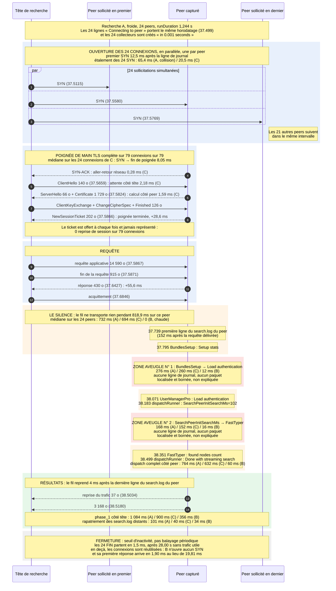
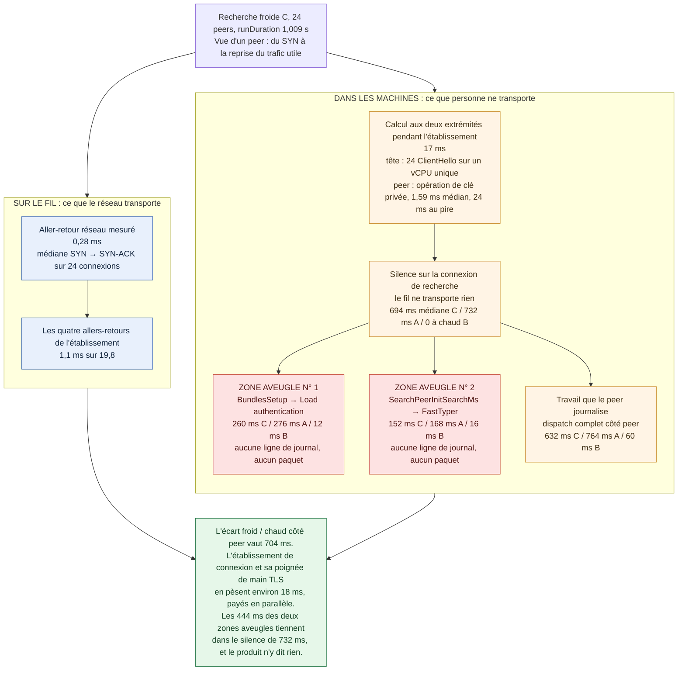

# Chronologie d'une recherche distribuée : ce que le fil transporte, et quand

Une recherche distribuée froide donne l'image d'un coût de réseau : la tête de recherche ouvre une connexion par peer, négocie TLS, envoie la requête, attend. Une capture des en-têtes de paquets, rapprochée des journaux du produit, montre que **le réseau n'en porte presque rien**. Le temps se dépense dans le peer, pendant un silence complet du fil, et en partie dans deux segments que le produit ne journalise pas.

Cette fiche donne la séquence relevée, au paquet près, et ce qu'elle implique pour qui mesure. Elle prolonge [Latence de recherche et nombre de search peers](./splunk-latence-et-nombre-de-search-peers.md), qui mesure le coût du fan-out palier par palier ; le moyen de relever la même chronologie sur un déploiement où l'on n'a pas de shell est dans [Mesurer la chronologie d'une recherche distribuée sans accès système](./splunk-mesurer-chronologie-recherche-sans-acces-systeme.md).

## Le résultat en six points

1. **Les connexions de la tête vers les peers sont rétablies à chaque recherche, sauf si la précédente date de moins de ≈ 28 secondes.** Une recherche froide ouvre une connexion TCP neuve par peer, chacune avec une **poignée de main TLS complète**, certificat serveur compris : zéro reprise de session sur 79 connexions observées, alors que chaque peer émet pourtant un `NewSessionTicket`. Rejouée aussitôt, la même recherche n'ouvre **aucune** connexion.
2. **Cet établissement ne coûte qu'environ 18 ms de temps mural par peer, payés en parallèle.** Le `SYN` et la première donnée utile sont séparés de 19,8 ms en médiane à froid, contre 1,9 ms sur une connexion réutilisée. L'aller-retour réseau mesuré vaut 0,28 ms ; les quatre allers-retours de l'établissement en pèsent 1,1 sur 19,8. **C'est du calcul, pas de la latence.**
3. **L'écart froid/chaud se paie dans le peer, pendant un silence.** Entre la requête et la première donnée de résultat, le fil ne transporte **rien** pendant 732 ms en médiane à froid, et ce silence recouvre exactement le travail que le peer journalise dans son `search.log`.
4. **Deux segments de ce travail ne sont pas journalisés, et ce ne sont pas du réseau.** `BundlesSetup → Load authentication` (276 ms à froid, 12 ms à chaud) et `SearchPeerInitSearchMs → FastTyper` (168 ms à froid, 16 ms à chaud) : aucun paquet ne circule pendant ces intervalles. La capture les **localise** et les **borne** ; elle ne les **explique** pas.
5. **Le facteur qui gouverne ces segments est l'inactivité récente, pas le nombre de peers.** À fan-out constant, ils tombent d'un ordre de grandeur sur une recherche rejouée aussitôt, et remontent après 45 s d'inactivité.
6. **Une campagne de mesure qui enchaîne ses recherches à quelques secondes d'intervalle mesure le régime chaud, et rien d'autre.** Ce n'est pas un biais si le régime chaud est celui de l'usage réel (voir [Quel régime compte](#quel-régime-compte)) ; c'en est un si l'on prétend décrire une recherche isolée.

## Le banc

- Cluster d'indexeurs multisite, **24 peers**, Splunk 9.4.
- Une tête de recherche membre d'un search head cluster, qui lance les recherches par l'API REST.
- Hôte de virtualisation unique : les 24 peers partagent la même machine physique (voir [Ce qui se transpose](#ce-qui-se-transpose-et-ce-qui-ne-se-transpose-pas)).
- Capture `tcpdump` simultanée sur la tête et sur un peer, en-têtes seuls (`-s 256`), horodatage à la microseconde, sur toutes les interfaces.
- Analyse limitée à TCP et aux **en-têtes d'enregistrement TLS** (type, version, longueur, type de message de poignée de main tant qu'il circule en clair). **Aucun déchiffrement.**

La recherche jouée est une recherche légère par peer, à fenêtre de temps fixe :

```spl
search index=<index> <terme-rare> earliest=<t0> latest=<t0+600>
| stats count by splunk_server
```

Travail rigoureusement identique sur les trois exécutions : 24 résultats, 72 événements, 25 fournisseurs de recherche.

### Trois recherches, et pourquoi trois

| | écart avec la précédente | `runDuration` | connexions TCP neuves vers les peers |
| --- | --- | ---: | ---: |
| **A**, froide | première de la série | **1,244 s** | 24 (+ 31 hors recherche, voir plus bas) |
| **B**, chaude | 1,28 s après A | **0,472 s** | **0** |
| **C**, froide | 45 s après B | **1,009 s** | 24 |

C sert à distinguer « froid = première recherche de la session » de « froid = première recherche après une inactivité ». La distinction s'est révélée décisive.

### Un trafic qui n'appartient pas à la recherche

La tête rafraîchit l'état de ses peers **toutes les 60 secondes**, indépendamment de toute recherche. Ce cycle ouvre 1 à 2 connexions TLS supplémentaires par peer et porte, d'après le `splunkd_access.log` des peers :

```text
POST /services/admin/auth-tokens
GET  /services/server/info
GET  /services/admin/bundles/<bundle-id>
GET  /services/server/health/splunkd/local
GET  /services/data/indexes?mode=minimum&count=0&datatype=all
GET  /services/messages?count=1000&search=name!=remote:*
```

La recherche A est tombée sur ce cycle : elle a payé 55 poignées de main au lieu de 24, sur une tête à un seul vCPU. **C est donc la lecture propre du coût à froid**, A montre ce que coûte la collision.

### L'écart d'horloge, mesuré et non supposé

Les deux machines étaient synchronisées par NTP, mais sur des références différentes. L'écart a été mesuré directement en appariant 156 paquets présents dans les deux captures (même quadruplet, mêmes `seq`/`ack`, mêmes drapeaux, même longueur) : **−0,55 ms**, sous l'hypothèse d'un délai unidirectionnel symétrique. L'estimation par NTP donnait 0,15 ms. Les deux bornent l'écart sous la milliseconde ; toutes les grandeurs de la fiche se comptent en dizaines de millisecondes, **l'écart d'horloge ne porte aucune conclusion**.

## Figure 1 : chronologie d'une recherche froide, du SYN à la fermeture

La figure suit la recherche **A** sur le peer capturé, et reporte en regard les valeurs de **C** et de **B** partout où elles ont été relevées. Les instants sont en secondes dans la minute. Trois lignes de vie représentent les 24 sollicitations.



## Figure 2 : où le temps se dépense, réseau contre calcul local

La figure oppose les deux postes sur la recherche **C**, la lecture la plus propre du régime froid.



Aucune valeur des deux figures n'est illustrative : chacune provient d'un relevé détaillé ci-dessous. Les seules sommes qu'elles portent, 444 ms pour les deux zones aveugles et 704 ms pour l'écart côté peer (764 − 60), sont posées dans le texte ; les médianes ne s'additionnent pas et ne sont pas additionnées.

## Le détail

### Ordre et étalement des sollicitations

| | premier → dernier départ | étalement |
| --- | --- | ---: |
| **A**, froide (`SYN`) | 37.5115 → 37.5769 | 65,4 ms |
| **C**, froide (`SYN`) | 24.5697 → 24.5903 | 20,5 ms |
| **B**, chaude (instant de la requête, pas de `SYN`) | 38.797 → 38.822 | 24,5 ms |

Une connexion par peer, exactement 24, aucun peer sollicité deux fois. L'ordre d'émission n'est ni alphabétique ni celui du journal de la tête. **Il n'y a ni file d'attente ni pool de taille fixe** : les 24 collecteurs sont créés dans la même milliseconde.

### Rétablies ou réutilisées ?

**Rétablies, avec poignée de main complète.** Sur les 79 connexions capturées (24 de A, 31 du cycle de rafraîchissement, 24 de C) :

- 79 sur 79 portent un `Certificate` serveur de 1 729 octets ; une reprise de session abrégée n'en transporte pas ;
- chaque serveur émet un `NewSessionTicket` de 202 octets, **jamais représenté** : le `ClientHello` suivant fait 140 octets, comme le premier ;
- chaque recherche froide ouvre des ports source neufs.

**Réutilisées, mais dans une fenêtre d'environ 28 secondes.** B n'a ouvert aucune connexion : ses 24 requêtes sont parties sur celles de A et ont reçu leur réponse en 1,90 ms en médiane. La fermeture est nette :

| groupe | inactivité avant fermeture |
| --- | ---: |
| 24 connexions de recherche (les 24 `FIN` en 1,5 ms) | **28,00 s** |
| 31 connexions de rafraîchissement | **27,95 s** |

Deux groupes d'âges différents, fermés à des instants différents, après la même durée d'inactivité : c'est un **seuil d'inactivité**, pas un balayage périodique.

**Aucun réglage de la spécification livrée ne gouverne ce seuil.** Recherche faite dans les `*.conf.spec` du produit :

- `server.conf`, `keepAliveIdleTimeout` : côté **serveur**, avec un plancher de 7 200 s ; ce n'est pas ce qui ferme à 28 s ;
- `distsearch.conf`, `[distributedSearch]` : `connectionTimeout`, `sendTimeout`, `receiveTimeout` sont des plafonds d'attente, pas des durées de vie ; `serverTimeout` est déclaré ignoré ;
- `limits.conf`, `max_persistent_connections` : concerne les processus persistants des handlers REST, pas la connexion sortante d'une recherche.

Le seuil a été observé sur deux groupes de connexions d'une seule capture : **c'est une observation, pas une constante établie.** À mesurer sur chaque déploiement.

### Ce que coûte l'établissement

Médianes sur les 24 connexions de recherche, temps rapportés au `SYN` :

| étape | **C**, froide | A, froide avec collision |
| --- | ---: | ---: |
| `SYN` → `SYN-ACK` : **aller-retour réseau** | **0,28 ms** | 0,23 ms |
| `SYN-ACK` → `ClientHello` : attente côté tête | 2,18 ms | 2,97 ms |
| `ClientHello` → `ServerHello` : calcul côté peer | 1,59 ms (24 ms au pire) | 1,42 ms |
| **`SYN` → fin de poignée de main TLS** | **8,05 ms** | 11,28 ms |
| fin de poignée → premier octet de requête | 2,03 ms | 3,17 ms |
| requête → première réponse | 10,10 ms | 10,80 ms |
| **`SYN` → première donnée applicative du peer** | **19,81 ms** | 24,78 ms |

Sur une connexion réutilisée, requête → première réponse : **1,90 ms**.

C'est la forme exacte d'un **coût fixe par peer** : indépendant du volume de données, répété à l'identique, sérialisé sur le processeur de la tête quand le nombre de peers croît. **Mais son amplitude, 18 ms payés en parallèle, ne rend compte ni des 1,244 s de A ni des 1,009 s de C.**

### Rapprochement avec les journaux du job

Le `search.log` que le peer produit pour sa part de la recherche commence **152 ms** après la requête délivrée, et le fil reprend **4 ms** après sa dernière ligne. La ventilation, nommée par le produit, recherche A :

| segment | durée | |
| --- | ---: | --- |
| requête délivrée → première ligne du `search.log` | 152 ms | le produit n'y émet rien |
| `Search process mode: preforked (reused process)` → `BundlesSetup` | 56 ms | |
| `BundlesSetup` → `UserManagerPro - Load authentication` | **276 ms** | **aveugle** |
| → `dispatchRunner - search context` | 20 ms | |
| → `DispatchCommandProcessor - Search requires the following indexes` | 76 ms | |
| → `dispatchRunner - SearchPeerInitSearchMs` | 16 ms | |
| → `FastTyper - found nodes count` | **168 ms** | **aveugle** |
| → `UnifiedSearch - Initialization of search data structures` | 44 ms | |
| → `SearchPipelineExecutor - StreamSearch pipeline=0 is started` | 68 ms | |
| → `dispatchRunner - Done with streaming search` | 36 ms | |
| **dispatch complet côté peer** | **764 ms** | |

Les trois segments « trous », sur les trois recherches :

| segment | A froide | B chaude | C froide |
| --- | ---: | ---: | ---: |
| requête délivrée → première ligne du `search.log` | 152 ms | 2,4 ms | 181 ms |
| `BundlesSetup` → `Load authentication` (**aveugle n° 1**) | 276 ms | 12 ms | 260 ms |
| `SearchPeerInitSearchMs` → `FastTyper` (**aveugle n° 2**) | 168 ms | 16 ms | 152 ms |
| dispatch complet côté peer | 764 ms | 60 ms | 632 ms |

Deux observations annexes :

- `Search process mode: preforked (reused process)` sur les trois recherches : **aucun processus de recherche n'est créé** côté peer. Le coût du froid n'est pas un démarrage de processus.
- Le peer journalise lui-même le canal applicatif dans son `splunkd_access.log` : `POST /services/streams/search?sh_sid=<sid>`, puis les `GET` du `search.log` et de la télémétrie du job distant. **Les trois transitent sur la même connexion TCP** : le rapatriement des journaux distants n'ouvre aucune connexion supplémentaire.

### Ce que la capture apporte sur les zones aveugles

**Le réseau n'en explique rien, et c'est un résultat, pas un échec.**

1. **Elle les localise sans ambiguïté** dans un silence total du fil. Avec les seuls journaux, un segment non journalisé pouvait cacher un aller-retour réseau ; il n'en cache aucun.
2. **Elle les borne par le haut** : 444 ms à froid tiennent dans un silence mesuré de 732 ms, le reste du silence est du travail journalisé.
3. **Elle montre qu'ils suivent le froid, pas la concurrence** : à 24 peers dans les trois cas, ils passent de 276/168 ms à 12/16 ms, puis reviennent à 260/152 ms après 45 s d'inactivité.
4. **Elle réfute une hypothèse tentante.** Le cycle de rafraîchissement frappe justement `/services/admin/auth-tokens` ; on pouvait lui attribuer les 276 ms de `Load authentication` sur A. C ne subit aucun rafraîchissement et paie 260 ms.

### Décomposition de l'écart froid / chaud

| poste, sur le peer capturé | contribution |
| --- | ---: |
| établissement de connexion + poignée de main TLS, temps mural | ≈ 18 ms |
| requête délivrée → première ligne du `search.log` | ≈ 150 ms |
| aveugle n° 1 | ≈ 264 ms |
| aveugle n° 2 | ≈ 152 ms |
| reste du dispatch journalisé | ≈ 140 ms |
| **écart total côté peer (764 − 60)** | **704 ms** |

L'hypothèse « une poignée de main TLS par peer et par recherche est le coût fixe qui fait croître la latence avec le fan-out » est **vérifiée dans son fait et réfutée dans son amplitude** : la poignée de main existe, elle est payée par peer et par recherche, elle est un coût fixe. Elle vaut 18 ms quand l'écart à expliquer en vaut 700. **Le levier est dans ce que le peer refait à froid et ne refait pas à chaud.**

## Quel régime compte

À travail identique, une recherche froide coûte **2,1 à 2,6 fois** une recherche chaude sur ce banc. Deux conséquences.

**Toute mesure de latence doit déclarer son régime.** Une campagne qui espace ses recherches de quelques secondes est entièrement en régime chaud ; comparer ses chiffres à une recherche ad hoc isolée compare deux régimes. L'âge de la dernière recherche est une variable de protocole, au même titre que le nombre de peers.

**En production, le régime chaud est en général le régime réaliste.** Les recherches d'analystes se succèdent de près et les recherches planifiées tournent en permanence : l'intervalle entre deux recherches distribuées dépasse rarement le seuil de fermeture. Une campagne en régime chaud décrit donc bien ce que subissent les utilisateurs. Les exceptions sont à identifier plutôt qu'à supposer absentes : un tableau de bord qui rafraîchit toutes les 30 secondes est au bord du seuil, une tête de recherche peu sollicitée ou dédiée à un usage ponctuel paie le froid à chaque fois. Le moyen de vérifier le régime d'un déploiement à partir de ses propres journaux est dans [la fiche de mesure](./splunk-mesurer-chronologie-recherche-sans-acces-systeme.md#régime-froid-ou-chaud-et-seuil-de-bascule).

La figure 1 montre le régime froid parce que c'est là que la structure est lisible ; la colonne **B**, présente partout, donne ce que le régime chaud paie réellement, segment par segment.

## Ce qui se transpose, et ce qui ne se transpose pas

- **Les 24 peers partagent une seule machine physique.** La part du coût qui tient à ce que chaque peer ralentit les autres y est maximale. Ce qui se transpose à une production sur matériel dédié est la **forme** de la chronologie : l'ordre des étapes, la localisation des deux zones aveugles, le fait que le réseau n'en porte presque rien. **Pas l'amplitude des durées.**
- **Trois recherches, une par régime.** Aucun intervalle de confiance, aucun verdict statistique. Les écarts relevés, d'un facteur 2 à 20 selon le segment, dépassent largement la dispersion habituelle de ce type de mesure, mais ce n'est pas établi ici.
- **Un seul palier de fan-out.** La pente du coût à froid en fonction du nombre de peers n'est pas mesurée.
- **Le seuil de 28 s** est une observation sur un déploiement, non documentée par le produit.

## Ce qui reste ouvert

| question | état |
| --- | --- |
| *Pourquoi* `BundlesSetup → Load authentication` vaut 276 ms à froid et 12 ms à chaud | non expliqué : aucune ligne de journal, aucun paquet. Le mécanisme est interne au peer |
| *Pourquoi* `SearchPeerInitSearchMs → FastTyper` vaut 168 ms à froid et 16 ms à chaud | non expliqué, même constat |
| *Pourquoi* le `search.log` du peer ne commence que 150 à 180 ms après la requête | non expliqué : le fil ne porte qu'une réponse de 430 octets dans l'intervalle |
| Le seuil d'inactivité est-il réglable | aucun réglage trouvé dans la spécification livrée |

Élucider les deux zones aveugles demanderait d'élever la verbosité du `search.log` sur un peer, ce qui ne se fait pas par l'API REST (voir [la fiche de mesure](./splunk-mesurer-chronologie-recherche-sans-acces-systeme.md#ce-que-le-niveau-2-ne-peut-pas-faire)).

## Pièges de méthode rencontrés

**Le chemin de retour peut être asymétrique.** La tête joignait les peers sur une adresse qui n'était pas celle de leur interface de gestion, et les peers répondaient par une autre interface. Une capture limitée à une interface du peer ne voit qu'une direction : c'est ce qui a coûté une première capture. **Capturer sur toutes les interfaces (`-i any`).**

**Une recherche peut percuter un trafic de fond.** Le rafraîchissement périodique de l'état des peers ouvre ses propres connexions TLS à intervalle fixe. Une mesure qui tombe dessus paie des poignées de main qui ne sont pas les siennes. Repérer la période du cycle dans le `splunkd_access.log` d'un peer avant de planifier les recherches.

**Réutilisée ou abrégée se lit sans déchiffrer.** La distinction entre poignée de main complète et reprise de session tient à la présence d'un message `Certificate` du serveur, lisible dans l'en-tête d'enregistrement TLS de 5 octets. Aucune clé, aucun contenu.

**Vérifier que la capture ne contient rien de sensible, plutôt que l'affirmer.** Avec `-s 256` sur un canal TLS, les fichiers ont été passés au crible (`authorization`, `password`, `pass4symmkey`, `cookie`, `session`, `POST /`, `GET /`, `HTTP/1.`) : zéro occurrence. La seule chaîne imprimable longue était tirée du sujet du certificat livré par défaut.

## À lire ensuite

- [Mesurer la chronologie d'une recherche distribuée sans accès système](./splunk-mesurer-chronologie-recherche-sans-acces-systeme.md) : la même chronologie, relevée par les journaux du produit et par REST.
- [Latence de recherche et nombre de search peers](./splunk-latence-et-nombre-de-search-peers.md) : le coût du fan-out, palier par palier.
- [Distribution : bundle readiness et fan-out](../handbooks/splunk-search-performance-handbook/03-distribution.md) : les leviers documentés sur la phase de distribution.
- [Modèle temporel et instruments de mesure](../handbooks/splunk-search-performance-handbook/00-modele-temporel-et-mesure.md) : quoi lire au Job Inspector et dans quels journaux.

## Sources

Les chiffres proviennent d'une capture et de relevés de journaux propres, sur le banc décrit plus haut ; ils ne sont pas issus de la documentation Splunk. Pour les mécanismes et réglages invoqués :

- [Distributed Search Manual](https://docs.splunk.com/Documentation/Splunk/9.4/DistSearch/) : recherche distribuée, `distsearch.conf`.
- [Admin Manual, server.conf](https://docs.splunk.com/Documentation/Splunk/9.4/Admin/Serverconf) : `keepAliveIdleTimeout`.
- [RFC 8446, TLS 1.3](https://www.rfc-editor.org/rfc/rfc8446) et [RFC 5077, session tickets](https://www.rfc-editor.org/rfc/rfc5077) : poignée de main complète et reprise de session.
