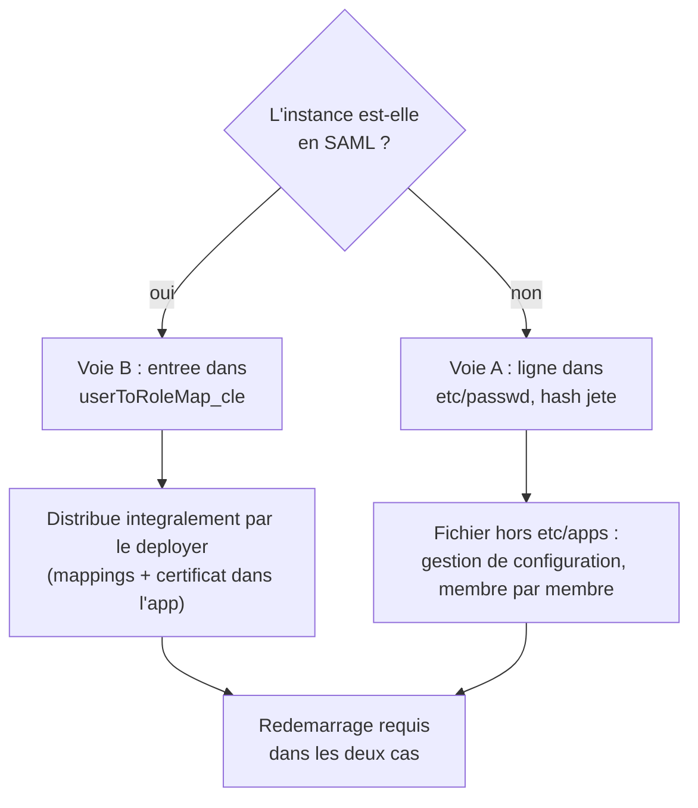

# Comptes de service Splunk créés par fichiers de configuration, sans API

Comment créer un **compte de service Splunk destiné à posséder et exécuter des
rapports planifiés**, sans jamais passer par l'API REST ni la CLI, et si possible
en le faisant distribuer par le **deployer** d'un Search Head Cluster ? Le compte
n'a pas besoin d'être authentifiable : il ne sert que de contexte d'exécution.

> Mesures empiriques sur **Splunk Enterprise 9.4.6**, instance standalone, six runs
> instrumentés. Le comportement peut différer sur d'autres versions — la **méthode
> d'instrumentation** de la section 6 reste valable pour re-vérifier sur la sienne.

---

## 1. Le point de départ que tout le monde rate

Un compte de service « non authentifiable » reste un compte qui doit **exister
pour le moteur d'authentification**. La raison est écrite dans la spec de
`limits.conf` :

> `orphan_searches` — *Scheduled saved searches with invalid owners are considered
> "orphaned". They **cannot be run** because Splunk cannot determine the roles to
> use for the search context.*

Et `savedsearches.conf` confirme le contexte d'exécution : `dispatchAs = [user|owner]`,
**valeur par défaut `owner`**. Le scheduler résout donc les rôles à partir du
propriétaire, avant même de lancer la recherche.

Conséquence : « compte sans mot de passe » est atteignable, « compte inexistant »
ne l'est pas. Toute la question devient *comment faire exister une identité par
fichier*.

## 2. Ce qui ne marche pas, et pourquoi

| Piste | Verdict | Raison |
|---|---|---|
| `user-seed.conf` | **Écarté** | La spec le dit deux fois : **un seul** utilisateur configurable, et le fichier est **ignoré dès que `etc/passwd` existe**. Utile au bootstrap d'une instance neuve, inutilisable ensuite. |
| `authentication.conf`, authentification native | **Écarté** | Aucune stanza ne définit un compte natif. Sous `authType = Splunk`, le seul magasin est `etc/passwd`. |
| `[userToRoleMap_*]` avec un `authType` inactif | **Écarté** | Mesuré : 0 exécution, et *aucune trace nulle part*. Ces tables appartiennent au flux d'authentification de leur `authType` ; sans lui, c'est du texte mort. |

## 3. Voie A — entrée directe dans `etc/passwd`

Le magasin des comptes natifs est `$SPLUNK_HOME/etc/passwd`, en `0600`. Format
mesuré : **dix champs** séparés par `:`, le premier étant vide.

```
:<user>:<hash>:<reserve>:<realname>:<role1;role2>:<email>:::<jours-epoch>
```

| Champ | Contenu |
|---|---|
| 2 | nom du compte |
| 3 | hash du mot de passe (SHA512-crypt par défaut, cf. `passwordHashAlgorithm`) |
| 5 | nom affiché |
| 6 | rôles, séparés par `;` |
| 7 | e-mail |
| 10 | date du dernier changement de mot de passe, **en jours depuis l'epoch** — alimente `expirePasswordDays` |

Les champs 4, 8 et 9 restent vides.

Pour rendre le compte non authentifiable, deux options.

**Hash impossible** (`!`) — mesuré fonctionnel : le compte est chargé, les rapports
s'exécutent, et l'authentification échoue sur toutes les variantes testées (mot de
passe quelconque, vide, littéral `!`). Réserve : le démarrage logue
`AuthenticationManagerSplunk - Found obsolete password format. Will attempt to
migrate later`. La ligne n'a pas été réécrite pendant les mesures, mais on dépend
d'une tolérance de parsing.

**Hash valide d'un mot de passe jeté** — le hash se fabrique hors ligne, sans
authentification et sans contacter l'instance :

```bash
splunk hash-passwd "$(head -c 32 /dev/urandom | od -An -tx1 | tr -d ' \n')"
```

```bash
openssl passwd -6
```

Le mot de passe n'est conservé nulle part : le compte est inauthentifiable en
pratique, et rien ne repose sur la façon dont une version future traitera un champ
mal formé. **C'est l'option à préférer en production.**

**Limite structurelle** : `etc/passwd` est hors de `etc/apps/`, donc **hors de ce
que le deployer distribue**. En SHC, ce fichier se pose par gestion de
configuration, membre par membre.

## 4. Voie B — mapping d'identité externe, quand SAML est actif

Sous `authType = SAML`, les utilisateurs ne vivent pas dans `etc/passwd`. Une
entrée dans `[userToRoleMap_<clé>]` suffit alors à faire exister un propriétaire :

```ini
[authentication]
authType = SAML
authSettings = SAML

[userToRoleMap_SAML]
svc_reports = svc_report_runner::Compte de service rapports::
```

Mesuré : le rapport possédé par `svc_reports` s'exécute, `status=success`, alors
que le compte n'est déclaré **que** là.

Le résultat contre-intuitif, et le plus utile en pratique : **la configuration
SAML n'a pas besoin d'être fonctionnelle.** Un IdP inexistant (URL de SSO en
`.invalid`), un certificat auto-signé jetable, aucune connexion possible — il
suffit que le **domaine d'authentification s'initialise** au démarrage. Le
scheduler n'a jamais besoin d'authentifier qui que ce soit : il lui faut seulement
résoudre des rôles.

**Tout tient dans une app** — mappings, paramètres SAML, et même le certificat de
l'IdP référencé par un chemin sous l'app. Cette voie est donc **intégralement
distribuable par le deployer**, contrairement à la voie A.

### Le cas ProxySSO, à écarter

Même famille de mapping (`[userToRoleMap_proxySSO]`), mais deux prérequis le
disqualifient pour cet usage :

1. `trustedIP` doit être défini dans `web.conf`, et **les `[settings]` de
   `web.conf` ne sont pas lus depuis une app** — seulement depuis `etc/system/`.
   Le deployer ne peut donc pas livrer la configuration complète.
2. `ProxySSO authType allowed only with SSOMode=strict` — et `strict` ferme
   l'accès web à tout ce qui ne provient pas de l'adresse du proxy.

## 5. Comparaison des deux voies



| | Voie A — `etc/passwd` | Voie B — `userToRoleMap` |
|---|---|---|
| Condition | aucune | `authType` externe actif (SAML) |
| Distribuable par le deployer | non | **oui, intégralement** |
| Authentification | impossible par construction | déléguée à un IdP qui ignore le compte |

Dans les deux cas, le **rôle** (`authorize.conf`), les **rapports**
(`savedsearches.conf`) et l'**attribution du propriétaire** (`metadata/default.meta`,
clé `owner = <compte>`) vivent dans une app ordinaire, donc partent par le deployer
sans réserve. À noter dans les journaux du scheduler : l'identifiant de l'objet
reste `nobody;<app>;<rapport>` — contexte d'app — tandis que le champ `user` porte
le compte de service. Les deux coexistent sans contradiction.

## 6. Méthode d'instrumentation

Aucune de ces mesures ne nécessite de s'authentifier : tout se lit dans les
journaux, ce qui permet de mesurer même quand l'authentification est cassée.

```bash
grep -c 'user="svc_reports"' "$SPLUNK_HOME/var/log/splunk/scheduler.log"
```

```bash
grep 'nom_du_rapport' "$SPLUNK_HOME/var/log/splunk/scheduler.log" | tail -3
```

```bash
grep -i 'ERROR AuthenticationManager' "$SPLUNK_HOME/var/log/splunk/splunkd.log"
```

Le protocole qui rend les résultats interprétables : **trois rapports identiques**
ne différant que par leur propriétaire — un témoin positif (compte natif), le cas
testé, et un témoin négatif (mapping dont l'`authType` est inactif) — un cron à la
minute, et une fenêtre d'observation de trois cycles après redémarrage. Le témoin
négatif est ce qui distingue « le mécanisme marche » de « quelque chose marche ».

## 7. Pièges mesurés

**Rien n'est pris en compte à chaud.** Ni l'ajout dans `etc/passwd`, ni les
mappings. Le redémarrage de `splunkd` est nécessaire.

**La défaillance est silencieuse.** Un rapport dont le propriétaire n'est pas
résolu ne produit *aucune* trace : ni exécution, ni message d'orphelin dans
`splunkd.log`. L'objet n'existe pour personne. Le seul contrôle fiable est de
vérifier positivement les exécutions dans `scheduler.log`.

**Une capability manque souvent au rôle restreint.** Splunk le signale lui-même :
`insufficient_search_capabilities … missing: edit_search_schedule_window. The
search will run with the default values`. Non bloquant, mais bruyant.

**Une app peut changer l'`authType` de l'instance.** Vérifié par `btool` : un
`authType` posé dans `<app>/default/authentication.conf` l'emporte sur le défaut
système. C'est ce qui rend la voie B distribuable — et c'est aussi un risque à
connaître : une app poussée par le deployer peut basculer le mode d'authentification
de tous les membres.

## 8. Réserves — ce qui n'a pas été mesuré

- **IdP répondant aux *Attribute Query Requests*.** La spec conditionne l'usage de
  `[userToRoleMap_*]` à un IdP qui ne sait pas faire d'AQR, ou à une extension
  d'authentification limitée aux jetons. L'IdP fictif des mesures ne sait rien
  faire du tout. Sur une plateforme dont l'IdP répond aux AQR, la résolution
  pourrait emprunter un autre chemin.
- **Fusion avec une stanza existante.** Si la configuration SAML de production porte
  déjà son `[userToRoleMap_*]` dans `etc/system/local/`, ajouter des entrées depuis
  une app repose sur la fusion des clés d'une même stanza — non mesuré.
- **Comportement en Search Head Cluster** : réplication ou non de `etc/passwd` entre
  membres, tenue au redémarrage glissant. Les mesures portent sur une instance
  standalone.

## Voir aussi

- [Deployment server : rôle et distinction avec le deployer](./splunk-deployment-server.md)
- [`splunk.secret` dans un SHC : propagation à l'ajout de membre](./shc-splunk-secret-propagation.md)
