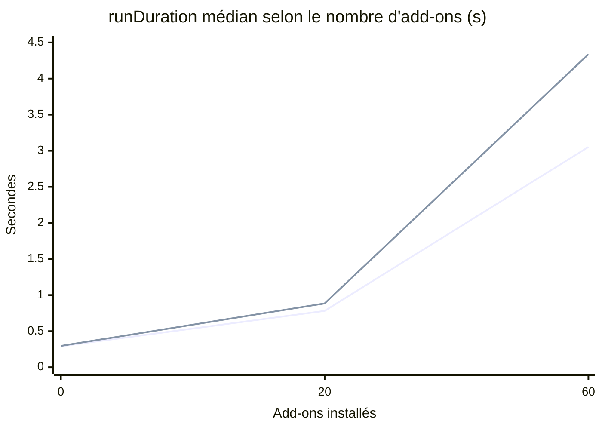
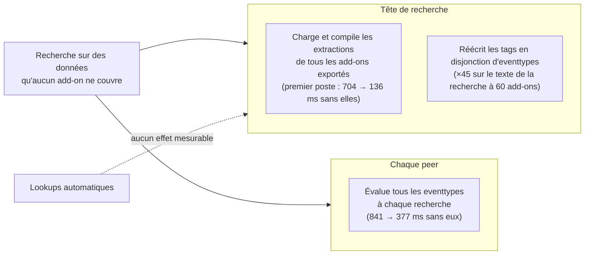

# Le coût de présence des add-ons : ce que chaque recherche paie pour les objets de connaissance installés

Installer un add-on de parsing ou de conformité CIM ajoute des extractions, des eventtypes et des tags. On pense souvent que ce coût ne concerne que les recherches sur les sourcetypes de l'add-on. **C'est faux** : chaque recherche, sur n'importe quelles données, paie le chargement et l'évaluation de tous les objets de connaissance exportés. Sur un banc de mesure, 60 add-ons font passer une recherche qui ne touche **aucun** de leurs sourcetypes de 0,29 s à 3,05 s.

Cette fiche donne la mesure, ce qui coûte et ce qui ne coûte pas, puis les requêtes pour **quantifier le phénomène sur une plateforme de production** et **désigner les add-ons ou les recherches les plus exposés**. Elle complète [Mesurer la chronologie d'une recherche distribuée sans accès système](./splunk-mesurer-chronologie-recherche-sans-acces-systeme.md), dont elle reprend les instruments.

## Le résultat en six points

1. **Le coût croît plus vite que le nombre d'add-ons.** +24 ms par add-on à 20 add-ons, +46 ms par add-on à 60. Tripler la dose multiplie le surcoût par 5,6.
2. **C'est un coût de présence, pas d'application.** Les compteurs d'application aux événements (`command.search.kv`, `.lookups`, `.fieldalias`, `.tags`) restent au millième de seconde. Le temps part avant que le moindre événement soit lu.
3. **La tête de recherche paie d'abord.** L'analyse de la recherche (du démarrage du processus à `search.optimize`) passe de 32 ms à 704 ms ; la tête a dépensé 1,1 s avant de solliciter le premier peer.
4. **Les extractions sont le premier poste**, côté tête : `EXTRACT`, `REPORT`, `FIELDALIAS`, `EVAL`.
5. **Les eventtypes sont le premier poste côté peer**, et décuplent le coût des recherches par tag : chaque recherche évalue tous les eventtypes, et une recherche `tag=...` est réécrite en disjonction de tous les eventtypes qui portent ce tag.
6. **Les lookups automatiques ne coûtent rien de mesurable**, malgré le libellé `Performing lookup expansions` qui domine le journal de la tête.

## Le banc

- Cluster d'indexeurs multisite, 24 peers, search head cluster de 3 membres, Splunk 9.4.
- Add-ons **synthétiques**, construits sur la structure d'un TA : chacun porte 15 sourcetypes, 180 directives d'extraction (par sourcetype : 4 `EXTRACT`, 2 `REPORT`, 3 `FIELDALIAS`, 3 `EVAL`), un lookup automatique par sourcetype, 30 transforms, 20 eventtypes chacun tagué d'un tag CIM (`authentication`, `network`, `web`, `malware`, `change`, `endpoint`). Objets exportés au niveau système, comme un TA.
- Déploiement par le deployer, puis redémarrage progressif explicite du SHC à **chaque** dose, zéro compris, pour que le geste soit identique.
- Deux recherches entrelacées, 40 mesures chacune, régime chaud : une recherche rare sur un sourcetype qu'**aucun** add-on ne couvre, et la même avec `(tag=authentication OR <terme>)` pour forcer l'expansion des eventtypes. Les deux rendent le même nombre d'événements à toutes les doses.

## La courbe

Médianes de `runDuration`, intervalle de confiance à 95 % de la médiane :

| add-ons | directives d'extraction | eventtypes | recherche rare | recherche par tag | analyse côté tête | dispatch côté peer |
| ---: | ---: | ---: | --- | --- | ---: | ---: |
| 0 | 42 | 3 | **0,291 s** [0,278 ; 0,345] | 0,296 s | 32 ms | 66 ms |
| 20 | 3 642 | 403 | **0,781 s** [0,733 ; 0,825] | 0,884 s | 92 ms | 280 ms |
| 60 | 10 842 | 1 203 | **3,052 s** [2,972 ; 3,292] | 4,337 s | 704 ms | 841 ms |
| 0 (retour) | 42 | 3 | **0,294 s** [0,279 ; 0,346] | 0,286 s | 32 ms | 61 ms |

Le retour à zéro rend la valeur de départ : l'effet est réversible et la série n'a pas dérivé.



*Première courbe : recherche rare, sans tag. Seconde : la même, avec un tag CIM.*

## Ce qui coûte : démontage à 60 add-ons

Chaque variante retire une famille d'objets des 60 add-ons, le reste inchangé :

| variante | recherche rare | recherche par tag | analyse côté tête | dispatch côté peer |
| --- | ---: | ---: | ---: | ---: |
| complète | 3,05 s | 4,34 s | 704 ms | 841 ms |
| sans lookups automatiques | 3,07 s | 4,23 s | 962 ms | 824 ms |
| sans eventtypes ni tags | 2,35 s | 2,26 s | 584 ms | 377 ms |
| sans extractions | 1,68 s | 1,91 s | 136 ms | 679 ms |



Les postes ne s'additionnent pas. Sans extractions, la recherche par tag tombe aussi, alors que les eventtypes sont toujours là : un eventtype défini par un terme de champ (`action=...`) oblige la tête à le réécrire à travers toutes les définitions qui peuvent produire ce champ, et le coût de l'expansion croît avec le nombre d'extractions. **C'est une déduction cohérente avec les chiffres, non démontrée par les journaux.**

## Quantifier sur une plateforme de production

Toutes les requêtes ci-dessous sont en lecture seule, sans mutation, et ont été **exécutées sur le banc**, à vide et à 60 add-ons. Les valeurs citées sont celles du banc. Chacune se lance depuis une tête de recherche ; `splunk_server=local` borne les `| rest` à l'instance où l'on se trouve, ce qui suffit en SHC puisque les membres partagent la même configuration.

### 1. Le poids de chaque add-on

```spl
| rest /servicesNS/-/-/configs/conf-props splunk_server=local count=0
| fields - eai:attributes eai:userName
| rename eai:acl.app AS app, eai:acl.sharing AS partage
| eval nd=0
| foreach EXTRACT-* REPORT-* FIELDALIAS-* EVAL-* LOOKUP-* [ eval nd=nd+if(isnotnull('<<FIELD>>'),1,0) ]
| stats count AS stanzas_props sum(nd) AS directives BY app partage
| append [| rest /servicesNS/-/-/saved/eventtypes splunk_server=local count=0
          | rename eai:acl.app AS app, eai:acl.sharing AS partage
          | stats count AS eventtypes BY app partage ]
| stats sum(stanzas_props) AS stanzas_props sum(directives) AS directives sum(eventtypes) AS eventtypes BY app partage
| fillnull value=0
| eval poids = directives + eventtypes
| sort - poids
```

Une ligne par app et par niveau de partage. **Seuls les objets partagés en `global` pèsent sur toutes les recherches** ; ceux d'une app partagés en `app` ne pèsent que sur les recherches lancées dans cette app. Le haut du classement désigne les add-ons à examiner en premier.

Totaux de la plateforme, à situer sur la courbe du banc :

```spl
| rest /servicesNS/-/-/configs/conf-props splunk_server=local count=0 | fields - eai:*
| eval nd=0
| foreach EXTRACT-* REPORT-* FIELDALIAS-* EVAL-* [ eval nd=nd+if(isnotnull('<<FIELD>>'),1,0) ]
| stats count AS stanzas_props sum(nd) AS directives_extraction
```

```spl
| rest /servicesNS/-/-/saved/eventtypes splunk_server=local count=0 | stats count AS eventtypes
```

Repères du banc : 3 642 directives et 403 eventtypes pour +0,49 s ; 10 842 et 1 203 pour +2,76 s. Les secondes ne se transposent pas (voir [Réserves](#réserves)) ; l'ordre de grandeur des objets, si.

### 2. Les tags les plus chers à rechercher

```spl
| rest /servicesNS/-/-/configs/conf-tags splunk_server=local count=0
| fields - eai:* author id published updated
| rename title AS objet
| untable objet tag etat
| where etat="enabled"
| stats dc(objet) AS objets_tagues values(eval(mvindex(split(objet,"="),0))) AS types BY tag
| sort - objets_tagues
```

Chaque objet tagué est un terme de plus dans la réécriture d'une recherche par ce tag. Sur le banc à 60 add-ons, `authentication` couvre 240 eventtypes et la recherche passe de 121 à 10 004 caractères une fois normalisée. Les tags en tête de ce classement sont ceux des datamodels CIM les plus coûteux à interroger sans accélération.

### 3. Le coût par recherche, sur les jobs encore vivants

La liste des jobs (`| rest /services/search/jobs`) ne porte pas les compteurs du job inspector, et tronque la recherche normalisée : il faut interroger les jobs un par un.

```spl
| rest /services/search/jobs splunk_server=local count=0
| search isDone=1 dispatchState=DONE
| head 50
| fields sid
| map maxsearches=50 search="| rest /services/search/jobs/$sid$ splunk_server=local
    | fields sid label eai:acl.app runDuration normalizedSearch eventSearch
             performance.dispatch.evaluate.search.duration_secs"
| eval evaluation_s = tonumber('performance.dispatch.evaluate.search.duration_secs'),
       expansion    = round(len(normalizedSearch) / max(len(eventSearch),1), 1),
       part_evaluation = round(evaluation_s / runDuration, 2)
| table sid label eai:acl.app runDuration evaluation_s part_evaluation expansion
| sort - evaluation_s
```

| grandeur | banc, 0 add-on | banc, 60 add-ons |
| --- | ---: | ---: |
| `dispatch.evaluate.search`, médiane | **0,014 s** | **0,627 s** |
| `dispatch.evaluate.search`, maximum | 0,018 s | 1,104 s |
| expansion de la recherche, maximum | ×2,6 | **×108,7** |

`dispatch.evaluate.search` est un compteur **de la tête**, une seule invocation par job : contrairement à `startup.handoff` et `startup.configuration`, il ne se cumule pas sur les peers et se lit comme une durée. Une recherche dont l'évaluation dépasse quelques dizaines de millisecondes, ou dont l'expansion dépasse ×10, paie le coût de présence. `label` donne le nom de la recherche planifiée, `eai:acl.app` l'app d'où elle est lancée.

Limite : ne voit que les jobs encore conservés (`ttl`, dix minutes par défaut pour une recherche ad hoc). Jouer la requête juste après la période étudiée, ou la planifier et en conserver les résultats.

### 4. La mémoire des processus de recherche, dans la durée

`_introspection` échantillonne chaque processus de recherche, avec ses propriétés : `sid`, app, utilisateur, provenance, rôle `head` ou `peer`.

```spl
index=_introspection component=PerProcess data.process_type=search data.search_props.role=head earliest=-24h
| rename data.search_props.* AS s_*
| stats dc(s_sid) AS recherches median(data.mem_used) AS mem_med_mo perc95(data.mem_used) AS mem_p95_mo
        BY s_app s_provenance
| sort - mem_med_mo
```

Sur le banc, pour les mêmes recherches, **83 Mo** par processus côté tête à vide, **228 Mo** à 60 add-ons : le processus charge la configuration de tous les add-ons exportés. Côté peer, la même mesure ne sépare pas les deux situations sur des recherches longues (72 contre 78 Mo), le travail sur les données domine.

Deux usages :

- **en coupe** : les apps et provenances dont les processus sont les plus lourds ;
- **en série** (`timechart span=1d median(data.mem_used)`) : une marche vers le haut à une date donnée signale un ajout d'objets de connaissance, à confronter à la requête suivante.

Limite : l'échantillonnage manque les recherches de moins de quelques secondes. Ce sont pourtant celles dont la part de coût de présence est la plus forte ; la requête 3 les couvre.

### 5. Avant et après un changement de configuration

`_configtracker` enregistre chaque modification des fichiers `.conf`, avec le chemin et l'action (`add`, `update`, `delete`). Croisé avec la durée des recherches planifiées, il date l'effet d'une installation d'add-on :

```spl
index=_audit action=search info=completed savedsearch_name=* savedsearch_name!="" earliest=-30d
| bin _time span=1d
| stats median(total_run_time) AS run_med count AS recherches BY _time
| append [ search index=_configtracker earliest=-30d
    (data.path="*props.conf" OR data.path="*transforms.conf" OR data.path="*eventtypes.conf" OR data.path="*tags.conf")
  | rex field=data.path "apps/(?<app>[^/]+)/"
  | bin _time span=1d
  | stats dc(app) AS apps_changees values(app) AS apps values(data.action) AS actions BY _time ]
| stats values(*) AS * BY _time
| fillnull value=0 apps_changees
| sort _time
```

Pour un signal propre, restreindre la partie `_audit` à **une recherche planifiée stable** (`savedsearch_name="<nom>"`), dont le texte et le volume ne changent pas : c'est un témoin, et une marche de sa durée le jour d'un `add` sur un add-on désigne cet add-on.

Sur le banc, la requête s'exécute et date correctement l'ajout puis le retrait des add-ons ; **le banc n'a pas assez de recherches planifiées régulières pour y démontrer la marche de durée**. La forme est éprouvée, le signal ne l'est pas.

## Les faux amis

- **`search_startup_time` dans `_audit`** : il mesure le lancement du processus, pas l'analyse de la recherche. 15 ms en médiane à 60 add-ons, pour une analyse côté tête de 700 ms. Ne pas s'en servir pour ce diagnostic.
- **`startup.configuration` et `startup.handoff` du job inspector** : cumulés sur la tête et tous les peers, ils croissent avec le fan-out autant qu'avec les add-ons. Voir [Latence de recherche et nombre de search peers](./splunk-latence-et-nombre-de-search-peers.md#le-coût-est-à-la-mise-en-route-pas-dans-les-peers).
- **`normalizedSearch` dans la liste des jobs** : tronqué (127 caractères sur le banc pour une recherche qui en fait 10 004). Passer par le job lui-même (requête 3).
- **« Performing lookup expansions » dans le `search.log` de la tête** : c'est la ligne qui précède les plus longs silences, et pourtant retirer les lookups automatiques ne change rien. Le libellé nomme l'étape, pas ce qui la ralentit.

## Réserves

- **Le banc amplifie les secondes.** Têtes à 2 vCPU et 1,6 Go, peers à 1 vCPU et 512 Mo, déjà en swap avant la première dose. La forme de la courbe, le classement des postes et les indicateurs se transposent ; les durées absolues, non. La croissance plus que proportionnelle peut tenir en partie à la pression mémoire.
- **Trois doses**, dont une seule au-delà de 20 add-ons. Une dose de 150 aurait mesuré le banc plus que les add-ons.
- **La forme d'add-on est une hypothèse.** Un TA réel peut porter beaucoup plus ou beaucoup moins d'extractions ou d'eventtypes ; d'où la transposition par le comptage d'objets (requête 1), pas par le nombre d'add-ons.
- **Seul le coût de présence est mesuré.** Le coût d'application des extractions aux événements d'un sourcetype effectivement couvert n'est pas dans ce relevé.
- **Les datamodels CIM accélérés ne sont pas simulés** : ils relèvent de l'accélération, pas de l'analyse d'une recherche ad hoc.

## Leviers, sans mesure d'effet en production

Déduits des mesures, à valider sur chaque plateforme :

- **Ne pas exporter en `global`** ce qui ne sert qu'à une app : un objet partagé au niveau de l'app ne pèse que sur les recherches lancées dans cette app.
- **Désactiver les add-ons installés et inutilisés**, en commençant par le haut du classement de la requête 1.
- **Préférer les recherches accélérées** (`tstats` sur datamodel) aux recherches par tag sur données brutes quand le tag couvre des centaines d'eventtypes.

## À lire ensuite

- [Mesurer la chronologie d'une recherche distribuée sans accès système](./splunk-mesurer-chronologie-recherche-sans-acces-systeme.md) : les instruments de niveau 1 réutilisés ici.
- [Latence de recherche et nombre de search peers](./splunk-latence-et-nombre-de-search-peers.md) : l'autre coût fixe d'une recherche distribuée, le fan-out.
- [Modèle temporel et instruments de mesure](../handbooks/splunk-search-performance-handbook/00-modele-temporel-et-mesure.md) : Job Inspector et journaux.

## Sources

Les chiffres proviennent d'une campagne de mesure propre, sur le banc décrit plus haut. Pour les mécanismes et les sources de données :

- [Knowledge Manager Manual](https://docs.splunk.com/Documentation/Splunk/9.4/Knowledge/) : extractions, eventtypes, tags, partage des objets.
- [Search Manual, Job Inspector](https://docs.splunk.com/Documentation/Splunk/9.4/Search/ViewsearchjobpropertieswiththeSearchJobInspector) : compteurs `dispatch.*` et `command.*`.
- [Troubleshooting Manual, What Splunk logs about itself](https://docs.splunk.com/Documentation/Splunk/9.4/Troubleshooting/WhatSplunklogsaboutitself) : `_audit`, `_introspection`, `_configtracker`.
