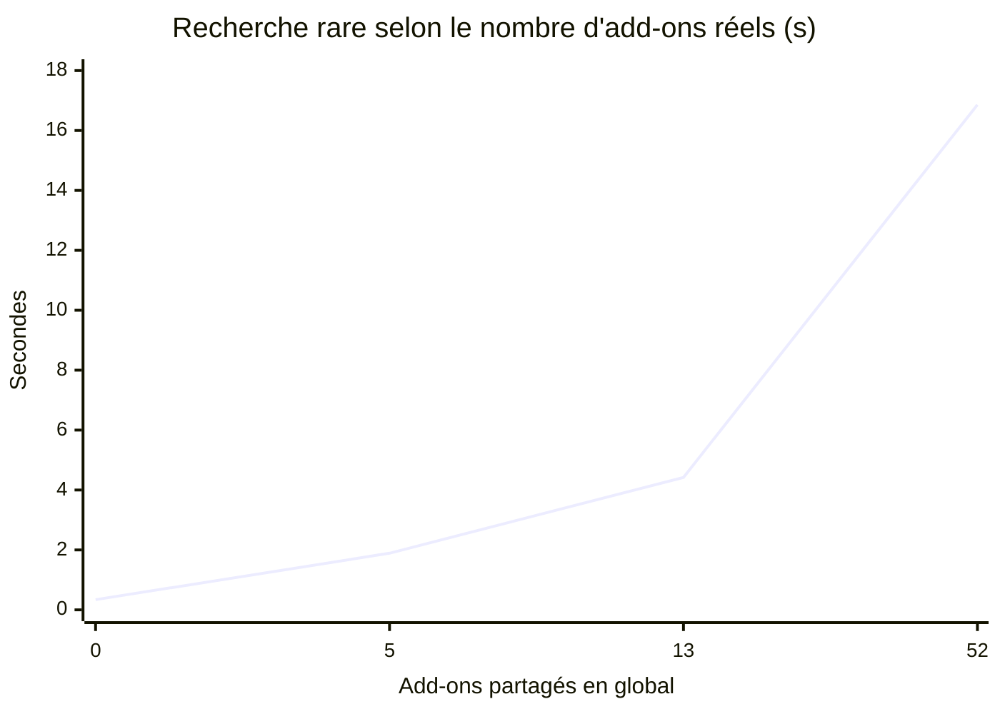
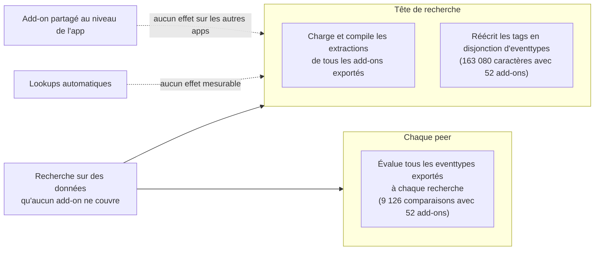

# Le coût de présence des add-ons : ce que chaque recherche paie pour les objets de connaissance installés

Installer un add-on de parsing ou de conformité CIM ajoute des extractions, des eventtypes et des tags. On pense souvent que ce coût ne concerne que les recherches sur les sourcetypes de l'add-on. **C'est faux** : chaque recherche, sur n'importe quelles données, paie le chargement et l'évaluation de tous les objets de connaissance exportés. Sur un banc de mesure, 52 add-ons réels de Splunkbase font passer une recherche qui ne touche **aucun** de leurs sourcetypes de 0,34 s à 16,9 s.

Cette fiche donne la mesure (add-ons synthétiques puis réels), ce qui coûte et ce qui ne coûte pas, les leviers mesurés, puis les requêtes pour **quantifier le phénomène sur une plateforme de production** et **désigner les add-ons ou les recherches les plus exposés**. Elle complète [Mesurer la chronologie d'une recherche distribuée sans accès système](./splunk-mesurer-chronologie-recherche-sans-acces-systeme.md), dont elle reprend les instruments.

## Le résultat en huit points

1. **C'est un coût de présence, pas d'application.** Les compteurs d'application aux événements (`command.search.kv`, `.lookups`, `.fieldalias`, `.tags`) restent au millième de seconde. Le temps part avant que le moindre événement soit lu.
2. **Avec de vrais add-ons, le coût croît linéairement avec le nombre d'add-ons partagés en `global`** : environ 0,31 s par add-on sur le banc, à 5, 13 et 52 add-ons.
3. **Un add-on ne s'évalue pas seul.** Mesurés un par un, les add-ons réels coûtent de 0 à 0,39 s ; ensemble, ils coûtent environ **deux fois la somme** de leurs coûts individuels.
4. **Les eventtypes et les tags désignent les add-ons coûteux, mieux que les directives d'extraction.** Toute recherche évalue tous les eventtypes exportés, et une recherche `tag=...` est réécrite en disjonction de tous les eventtypes qui portent ce tag.
5. **Un add-on partagé au niveau de son app ne coûte rien aux autres recherches**, quel que soit son volume.
6. **La tête de recherche paie aussi** : l'analyse de la recherche passe de 32 ms à 1,3 s avec 52 add-ons réels, avant qu'aucun peer ne soit sollicité.
7. **Les lookups automatiques ne coûtent rien de mesurable**, malgré le libellé `Performing lookup expansions` qui domine le journal de la tête.
8. **Deux leviers par recherche sont efficaces** : mettre le tag en second filtre (durée divisée par 3 à 5,5), et, pour une recherche qui n'utilise ni eventtype ni tag, déclarer requis un eventtype inexistant pour couper le typage (−36 à −51 %). Les modes Fast et Verbose n'y changent rien.

## Le banc

- Cluster d'indexeurs multisite, 24 peers, search head cluster de 3 membres, Splunk 9.4.
- Déploiement par le deployer, puis redémarrage progressif explicite du SHC à **chaque** palier, zéro compris, pour que le geste soit identique.
- Deux recherches entrelacées, en régime chaud : une recherche rare sur un sourcetype qu'**aucun** add-on ne couvre, et la même avec `(tag=authentication OR <terme>)` pour forcer l'expansion des eventtypes. Les deux rendent le même nombre d'événements à tous les paliers.
- Réserve qui vaut pour toute la fiche : têtes à 2 vCPU et 1,6 Go, peers à 1 vCPU et 512 Mo, déjà en swap avant la première dose. Voir [Réserves](#réserves).

## Première série : add-ons synthétiques

Chaque add-on synthétique porte 15 sourcetypes, 180 directives d'extraction (par sourcetype : 4 `EXTRACT`, 2 `REPORT`, 3 `FIELDALIAS`, 3 `EVAL`), un lookup automatique par sourcetype, 30 transforms, 20 eventtypes chacun tagué d'un tag CIM. Objets exportés au niveau système, comme un TA. 40 mesures par point.

| add-ons | directives d'extraction | eventtypes | recherche rare | recherche par tag | analyse côté tête | dispatch côté peer |
| ---: | ---: | ---: | --- | --- | ---: | ---: |
| 0 | 42 | 3 | **0,291 s** [0,278 ; 0,345] | 0,296 s | 32 ms | 66 ms |
| 20 | 3 642 | 403 | **0,781 s** [0,733 ; 0,825] | 0,884 s | 92 ms | 280 ms |
| 60 | 10 842 | 1 203 | **3,052 s** [2,972 ; 3,292] | 4,337 s | 704 ms | 841 ms |
| 0 (retour) | 42 | 3 | **0,294 s** [0,279 ; 0,346] | 0,286 s | 32 ms | 61 ms |

Démontage à 60 add-ons, une famille d'objets retirée à la fois :

| variante | recherche rare | recherche par tag | analyse côté tête | dispatch côté peer |
| --- | ---: | ---: | ---: | ---: |
| complète | 3,05 s | 4,34 s | 704 ms | 841 ms |
| sans lookups automatiques | 3,07 s | 4,23 s | 962 ms | 824 ms |
| sans eventtypes ni tags | 2,35 s | 2,26 s | 584 ms | 377 ms |
| sans extractions | 1,68 s | 1,91 s | 136 ms | 679 ms |

Les postes ne s'additionnent pas. Sans extractions, la recherche par tag tombe aussi, alors que les eventtypes sont toujours là : un eventtype défini par un terme de champ (`action=...`) oblige la tête à le réécrire à travers toutes les définitions qui peuvent produire ce champ. **Déduction cohérente avec les chiffres, non démontrée par les journaux.**

## Seconde série : 52 add-ons réels de Splunkbase

48 paquets parmi les plus téléchargés de Splunkbase (OS, cloud, réseau et sécurité, virtualisation, web, bases de données, poste de travail, CIM), soit 52 apps. **Seule la partie connaissance est déployée** (`default`, `metadata`, `lookups`, sans `bin/`, `lib/` ni fichiers déclarant du code ou des entrées) : la réplication du bundle ne pèse pas sur chaque recherche, et le coût mesuré est celui de la présence des objets. Ensemble : 10 576 directives d'extraction, 1 386 eventtypes, 1 077 tags.

### La courbe cumulée

| add-ons | recherche rare | recherche par tag | analyse côté tête | recherche par tag, une fois normalisée |
| ---: | ---: | ---: | ---: | ---: |
| 0 | **0,34 s** | 0,32 s | 32 ms | 222 caractères |
| 5 | **1,89 s** | 1,79 s | 128 ms | 17 792 |
| 13 | **4,42 s** | 5,53 s | 430 ms | 57 227 |
| 52 | **16,86 s** | 27,45 s | 1 334 ms | 163 080 |


```mermaid
xychart-beta
    title "Recherche rare selon le nombre d'add-ons réels (s)"
    x-axis "Add-ons partagés en global" ["0", "5", "13", "52"]
    y-axis "Secondes" 0 --> 18
    line [0.34, 1.89, 4.42, 16.86]
```

Surcoût par add-on : 0,31 s à 5, 0,31 s à 13, 0,32 s à 52. **À nombre d'objets comparable, les add-ons réels coûtent environ 5,5 fois plus que les synthétiques** (10 576 directives et 1 386 eventtypes, contre 10 842 et 1 203 pour 3,05 s) : expressions régulières plus lourdes, plus de transforms, et pression mémoire des peers.

### Chaque add-on seul

Surcoût par rapport au banc vide (recherche rare 0,342 s, recherche par tag 0,310 s), 20 mesures par add-on :

| add-on | directives | eventtypes | tags | recherche rare | recherche par tag | tag normalisé |
| --- | ---: | ---: | ---: | ---: | ---: | ---: |
| Unix and Linux | 302 | 148 | 144 | +386 ms | **+705 ms** | 31 292 car. |
| Microsoft Windows | 1 045 | 158 | 136 | +255 ms | +374 ms | 3 984 |
| Cisco Enterprise Networking | 674 | 141 | 70 | +261 ms | +335 ms | 7 489 |
| CrowdStrike FDR | 327 | 64 | 64 | +235 ms | +285 ms | 376 |
| F5 BIG-IP | 408 | 50 | 31 | +174 ms | +237 ms | 824 |
| Amazon Web Services | 544 | 99 | 57 | +155 ms | +188 ms | 408 |
| Symantec Endpoint Protection | 633 | 27 | 23 | +54 ms | +164 ms | 3 552 |
| Palo Alto Networks | 643 | 40 | 30 | +53 ms | +160 ms | 3 299 |
| Microsoft Cloud Services | 312 | 32 | 25 | +69 ms | +138 ms | 1 670 |
| Oracle Database | 341 | 39 | 27 | +109 ms | +68 ms | 400 |
| Google Workspace | 516 | 35 | 33 | +65 ms | +107 ms | 654 |
| Common Information Model | 27 | 7 | 20 | +32 ms | +41 ms | 285 |
| Zeek (**partagé au niveau de l'app**) | 866 | 25 | 13 | −15 ms | +20 ms | 222 |

Lecture :

- **Les eventtypes et les tags désignent les add-ons coûteux** : Unix and Linux (302 directives, 148 eventtypes) est le plus cher ; Symantec EP (633 directives, 27 eventtypes) coûte peu sur une recherche sans tag.
- **Pour une recherche par tag, le facteur décisif est l'expansion** : Unix and Linux seul développe `tag=authentication` en 31 292 caractères.
- **Le partage fait tout** : Zeek, partagé au niveau de son app, ne coûte rien aux autres recherches malgré ses 866 directives.
- **Non-additivité** : les 5 plus lourds coûtent +0,80 s additionnés, +1,55 s ensemble.


```mermaid
flowchart LR
    R["Recherche sur des données<br/>qu'aucun add-on ne couvre"] --> T
    R --> P
    subgraph T["Tête de recherche"]
        T1["Charge et compile les extractions<br/>de tous les add-ons exportés"]
        T2["Réécrit les tags en disjonction d'eventtypes<br/>(163 080 caractères avec 52 add-ons)"]
    end
    subgraph P["Chaque peer"]
        P1["Évalue tous les eventtypes exportés<br/>à chaque recherche<br/>(9 126 comparaisons avec 52 add-ons)"]
    end
    L["Lookups automatiques"] -. "aucun effet mesurable" .-> T
    Z["Add-on partagé au niveau de l'app"] -. "aucun effet sur les autres apps" .-> T
```

## Les leviers, mesurés

Avec les 52 add-ons réels installés, variantes entrelacées, 12 à 15 mesures chacune. Le bruit est fort (peers en swap) : seuls les écarts d'un facteur 1,5 et plus sont lisibles.

### Ce que dit la documentation

- Le Search Manual reconnaît le coût : *« Event typing and tagging can take a significant amount of search processing time [...] The more event types and tags that are defined in the system, the greater the annotation costs. »*
- L'optimisation `required_field_values` (active par défaut) ne charge que les eventtypes et tags nécessaires, **pour les recherches transformantes**. Les directives `REQUIRED_EVENTTYPES` et `REQUIRED_TAGS` restreignent l'annotation d'une recherche donnée. `| noop search_optimization.<type>=f` désactive une optimisation pour une seule recherche.
- **Aucune option documentée n'empêche la traduction d'un `tag=` en conditions dans la recherche de base.**

### Tag en second filtre

| variante | durée | recherche normalisée | typage (comparaisons) |
| --- | ---: | ---: | ---: |
| `index=<i> (tag=authentication OR <terme>)` | **35,4 s** | 163 080 car. | 9 126 |
| `index=<i> <terme> \| search tag=authentication OR <terme>` | **11,6 s** | 265 | 999 |
| idem `\| noop search_optimization.predicate_push=f` | **6,4 s** | 265 | 999 |

Placé dans un `| search` après la recherche de base, le tag n'est pas développé dans la recherche de base, et seuls les eventtypes qui le portent sont chargés. Couper `predicate_push` empêche l'optimiseur d'en remonter une partie vers la recherche de base. **Contrepartie** : la recherche de base ne filtre plus par le tag et rapatrie tout ce que ses autres termes sélectionnent. Le gain suppose une recherche de base déjà sélective (index, sourcetype, terme).

### Couper le typage d'une recherche qui n'en a pas besoin

Toute recherche évalue tous les eventtypes exportés (9 126 comparaisons ici), même transformante et sans référence à un eventtype : `required_field_values` ne restreint le jeu que si la recherche en réclame un. **Réclamer un eventtype inexistant produit un jeu vide** :

| variante (recherche rare transformante) | durée | typage |
| --- | ---: | ---: |
| telle quelle | **16,1 s** | 9 126 |
| `… \| search NOT eventtype=zz_aucun \| stats …` | **7,9 s** (−51 %) | 0 |
| `… DIRECTIVES(REQUIRED_EVENTTYPES(eventtypes="zz_aucun"), REQUIRED_TAGS(tags="zz_aucun")) \| stats …` | **10,3 s** (−36 %) | 0 |
| directive vide (`eventtypes=""`) | sans effet | 9 126 |
| `… \| search NOT tag=zz_aucun` | sans effet | 9 126 |
| `… \| fields - eventtype tag` | sans effet | 9 126 |

**Contournement non documenté**, à réserver aux recherches (planifiées, tableaux de bord) qui n'exploitent ni `eventtype` ni `tag` : ces champs disparaissent de leurs résultats.

### Sans effet

Mode Fast, mode Verbose, et toutes optimisations coupées (`| noop search_optimization=false`) : aucun gain sur ce coût.

### Leviers structurels

| levier | effet mesuré sur le banc | contrepartie |
| --- | --- | --- |
| Partager les eventtypes et tags d'un add-on au niveau de son app plutôt qu'en `global` | coût nul pour les autres apps | les recherches et datamodels CIM hors de l'app ne voient plus ces objets |
| Retirer des têtes de recherche les add-ons inutiles | ≈ 0,3 s par add-on `global` sur le banc | inventaire préalable (requête 1 ci-dessous) |
| Désactiver les eventtypes inutilisés d'un add-on (`disabled = 1`) | non mesuré, même mécanisme que le retrait | à refaire à chaque mise à jour de l'add-on |
| `tstats` sur datamodels accélérés au lieu des recherches par tag | non mesuré | accélération à maintenir |

## Précision de la recherche et écriture des eventtypes

Deux questions : le coût des eventtypes dépend-il des sourcetypes que la recherche demande ? Et vaut-il la peine de réécrire les eventtypes d'un add-on ?

### Le typage ne dépend pas de la recherche, l'expansion d'un tag si

Avec les 52 add-ons réels, une recherche rare précisée par `index` seul, `index` + `sourcetype`, `index` + `sourcetype` + `source`, ou `index=*` fait **toujours 9 126 comparaisons de typage**, pour la même évaluation côté tête (0,20 à 0,24 s). **Tous les eventtypes exportés sont chargés et compilés à chaque recherche, quels que soient les sourcetypes demandés.**

L'expansion d'un tag, elle, est élaguée : l'optimiseur retire les eventtypes dont une ancre (`sourcetype`, `source`) contredit une ancre de la recherche.

| `tag=authentication`, précision de la recherche | recherche normalisée | évaluation côté tête |
| --- | ---: | ---: |
| `index` seul | **163 080 car.** | 1,07 s |
| `index` + `source` | 94 024 | 1,11 s |
| `index` + `sourcetype` | **9 354** | 0,28 s |
| `index` + `sourcetype` + `source` | **1 724** | 0,26 s |

Le délai avant la sollicitation des peers passe de 3,75 à 1,85 s avec le sourcetype. Chaque ancre ajoutée élague les eventtypes qu'elle contredit, et seulement ceux-là : un `sourcetype` ne contredit pas un eventtype ancré sur une `source`, ni l'inverse. Ce qui survit à un `sourcetype` dans ce corpus, ce sont surtout les eventtypes d'Unix and Linux ancrés sur `source=/var/log/*`, `/var/adm/*`, `/etc/*`.

### L'écriture des eventtypes décide de ce qui est élagable

Essai contrôlé sur 60 add-ons synthétiques, eventtypes écrits de trois façons :

| écriture | exemple | tag, `index` seul | tag, `index` + `sourcetype` des données | évaluation côté tête |
| --- | --- | ---: | ---: | --- |
| ancrée | `sourcetype="st:2" action=a2` | 10 004 car. | **250** (élagage total) | référence |
| champs seuls | `action=a2 code2=*` | 5 924 | **5 952** (aucun élagage) | comparable |
| composée, un niveau | `eventtype=et_0 action=a5` sur des eventtypes de base ancrés | 9 224 | **250** (élagage total) | **+40 à +70 %** |

Les eventtypes des 52 add-ons réels sont majoritairement bien écrits : sur 1 386, 983 ancrés sur un sourcetype exact, 71 sur un sourcetype à joker, 68 sur une `source`, 227 composés, une vingtaine non ancrés.

### Ce qu'on peut en tirer

- **Le gain le moins coûteux : préciser `index`, `sourcetype` et `source` dans toute recherche par tag.** Expansion divisée par 17 à 95 sur le banc, sans rien toucher aux add-ons.
- **Retoucher un eventtype** (en `local/eventtypes.conf` de son app, qui l'emporte sur `default` et survit aux mises à jour) n'a d'intérêt que pour ceux qui survivent à cette précision : ajouter une ancre `sourcetype` aux eventtypes ancrés sur une `source` ou non ancrés, aplatir les eventtypes composés. Chaque retouche est à revoir à chaque version de l'add-on.
- **Aucune réécriture ne réduit le coût de typage**, qui dépend du nombre d'eventtypes exportés : seuls la désactivation, le partage au niveau de l'app et l'eventtype inexistant requis agissent dessus.

Pour repérer en production les eventtypes qu'aucune précision de recherche n'élague :

```spl
| rest /servicesNS/-/-/saved/eventtypes splunk_server=local count=0
| rename eai:acl.app AS app, eai:acl.sharing AS partage
| eval ancre=case(match(search,"(?i)(^|[\s(])sourcetype\s*(=|IN)"),"sourcetype",
                  match(search,"(?i)(^|[\s(])source\s*="),"source",
                  match(search,"(?i)eventtype\s*="),"composé",
                  true(),"non ancré")
| stats count BY app partage ancre
| sort app ancre
```


## Quantifier sur une plateforme de production

Toutes les requêtes ci-dessous sont en lecture seule, sans mutation, et ont été **exécutées sur le banc**. Chacune se lance depuis une tête de recherche ; `splunk_server=local` borne les `| rest` à l'instance où l'on se trouve, ce qui suffit en SHC puisque les membres partagent la même configuration.

### 1. Le poids de chaque add-on

```spl
| rest /servicesNS/-/-/configs/conf-props splunk_server=local count=0
| fields - eai:attributes eai:userName
| rename eai:acl.app AS app, eai:acl.sharing AS partage
| eval nd=0
| foreach EXTRACT-* REPORT-* FIELDALIAS-* EVAL-* LOOKUP-* [ eval nd=nd+if(isnotnull('<<FIELD>>'),1,0) ]
| stats count AS stanzas_props sum(nd) AS directives BY app partage
| append [| rest /servicesNS/-/-/saved/eventtypes splunk_server=local count=0
          | rename eai:acl.app AS app, eai:acl.sharing AS partage
          | stats count AS eventtypes BY app partage ]
| append [| rest /servicesNS/-/-/configs/conf-tags splunk_server=local count=0
          | rename eai:acl.app AS app, eai:acl.sharing AS partage
          | stats count AS tags BY app partage ]
| stats sum(stanzas_props) AS stanzas_props sum(directives) AS directives
        sum(eventtypes) AS eventtypes sum(tags) AS tags BY app partage
| fillnull value=0
| sort - eventtypes
```

Une ligne par app et par niveau de partage. **Seuls les objets partagés en `global` pèsent sur toutes les recherches.** Trier par eventtypes plutôt que par directives : c'est le meilleur prédicteur du coût mesuré sur les add-ons réels.

Totaux de la plateforme, à situer sur les courbes du banc :

```spl
| rest /servicesNS/-/-/configs/conf-props splunk_server=local count=0 | fields - eai:*
| eval nd=0
| foreach EXTRACT-* REPORT-* FIELDALIAS-* EVAL-* [ eval nd=nd+if(isnotnull('<<FIELD>>'),1,0) ]
| stats count AS stanzas_props sum(nd) AS directives_extraction
```

```spl
| rest /servicesNS/-/-/saved/eventtypes splunk_server=local count=0 | stats count AS eventtypes
```

Repères du banc : 52 add-ons réels = 10 576 directives et 1 386 eventtypes. Les secondes ne se transposent pas ; l'ordre de grandeur des objets, si.

### 2. Les tags les plus chers à rechercher

```spl
| rest /servicesNS/-/-/configs/conf-tags splunk_server=local count=0
| fields - eai:* author id published updated
| rename title AS objet
| untable objet tag etat
| where etat="enabled"
| stats dc(objet) AS objets_tagues values(eval(mvindex(split(objet,"="),0))) AS types BY tag
| sort - objets_tagues
```

Chaque objet tagué est un terme de plus dans la réécriture d'une recherche par ce tag. Avec les 52 add-ons réels, `network` couvre 149 objets, `change` 147, `authentication` 82, et `tag=authentication` se développe en 163 080 caractères. Les tags en tête de ce classement sont les premiers candidats au second filtre ou à `tstats`.

### 3. Le coût par recherche, sur les jobs encore vivants

La liste des jobs (`| rest /services/search/jobs`) ne porte pas les compteurs du job inspector, et tronque la recherche normalisée : il faut interroger les jobs un par un.

```spl
| rest /services/search/jobs splunk_server=local count=0
| search isDone=1 dispatchState=DONE
| head 50
| fields sid
| map maxsearches=50 search="| rest /services/search/jobs/$sid$ splunk_server=local
    | fields sid label eai:acl.app runDuration normalizedSearch eventSearch
             performance.dispatch.evaluate.search.duration_secs"
| eval evaluation_s = tonumber('performance.dispatch.evaluate.search.duration_secs'),
       expansion    = round(len(normalizedSearch) / max(len(eventSearch),1), 1),
       part_evaluation = round(evaluation_s / runDuration, 2)
| table sid label eai:acl.app runDuration evaluation_s part_evaluation expansion
| sort - evaluation_s
```

| grandeur | banc, 0 add-on | banc, 60 add-ons synthétiques | banc, 52 add-ons réels |
| --- | ---: | ---: | ---: |
| `dispatch.evaluate.search`, médiane | **0,014 s** | 0,627 s | 0,2 s (recherche rare), 1,1 s (recherche par tag) |
| expansion de la recherche, maximum | ×2,6 | ×108,7 | ×1 300 environ (recherche par tag) |

`dispatch.evaluate.search` est un compteur **de la tête**, une seule invocation par job : il ne se cumule pas sur les peers et se lit comme une durée. Une recherche dont l'expansion dépasse ×10 est une recherche par tag ou eventtype qui paie l'expansion : candidate au second filtre. `label` donne le nom de la recherche planifiée, `eai:acl.app` l'app d'où elle est lancée.

Limite : ne voit que les jobs encore conservés (`ttl`, dix minutes par défaut pour une recherche ad hoc).

### 4. La mémoire des processus de recherche, dans la durée

```spl
index=_introspection component=PerProcess data.process_type=search data.search_props.role=head earliest=-24h
| rename data.search_props.* AS s_*
| stats dc(s_sid) AS recherches median(data.mem_used) AS mem_med_mo perc95(data.mem_used) AS mem_p95_mo
        BY s_app s_provenance
| sort - mem_med_mo
```

Sur le banc, **83 Mo** par processus côté tête à vide, **228 Mo** à 60 add-ons synthétiques : le processus charge la configuration de tous les add-ons exportés. Côté peer, la même mesure ne sépare pas les situations sur des recherches longues. En série (`timechart span=1d median(data.mem_used)`), une marche vers le haut signale un ajout d'objets de connaissance, à confronter à la requête suivante. Limite : l'échantillonnage manque les recherches de moins de quelques secondes.

### 5. Avant et après un changement de configuration

```spl
index=_audit action=search info=completed savedsearch_name=* savedsearch_name!="" earliest=-30d
| bin _time span=1d
| stats median(total_run_time) AS run_med count AS recherches BY _time
| append [ search index=_configtracker earliest=-30d
    (data.path="*props.conf" OR data.path="*transforms.conf" OR data.path="*eventtypes.conf" OR data.path="*tags.conf")
  | rex field=data.path "apps/(?<app>[^/]+)/"
  | bin _time span=1d
  | stats dc(app) AS apps_changees values(app) AS apps values(data.action) AS actions BY _time ]
| stats values(*) AS * BY _time
| fillnull value=0 apps_changees
| sort _time
```

Pour un signal propre, restreindre la partie `_audit` à **une recherche planifiée stable** (`savedsearch_name="<nom>"`) : une marche de sa durée le jour d'un `add` sur un add-on désigne cet add-on. Sur le banc, la requête date correctement l'ajout puis le retrait des add-ons ; **le banc n'a pas assez de recherches planifiées régulières pour y démontrer la marche de durée**.

## Les faux amis

- **`search_startup_time` dans `_audit`** : il mesure le lancement du processus, pas l'analyse de la recherche. 15 ms en médiane à 60 add-ons, pour une analyse côté tête de 700 ms.
- **`startup.configuration` et `startup.handoff` du job inspector** : cumulés sur la tête et tous les peers, ils croissent avec le fan-out autant qu'avec les add-ons. Voir [Latence de recherche et nombre de search peers](./splunk-latence-et-nombre-de-search-peers.md#le-coût-est-à-la-mise-en-route-pas-dans-les-peers).
- **`normalizedSearch` dans la liste des jobs** : tronqué (127 caractères sur le banc pour une recherche qui en fait 10 004). Passer par le job lui-même (requête 3).
- **« Performing lookup expansions » dans le `search.log` de la tête** : c'est la ligne qui précède les plus longs silences, et pourtant retirer les lookups automatiques ne change rien.
- **Le coût d'un add-on mesuré seul** : il sous-estime d'un facteur 2 environ sa contribution au milieu des autres.
- **Une directive `REQUIRED_EVENTTYPES` vide** : acceptée, mais sans effet sur le typage.

## Réserves

- **Le banc amplifie les secondes.** Têtes à 2 vCPU et 1,6 Go, peers à 1 vCPU et 512 Mo, déjà en swap avant la première dose. La forme des courbes, le classement des postes et des add-ons, et les indicateurs se transposent ; les durées absolues, non.
- **Add-ons réels déployés sans leur code** : les recherches personnalisées et lookups scriptés ne sont pas mesurés.
- **20 mesures par add-on seul** : suffisant pour classer des écarts de 50 ms et plus, pas pour départager des add-ons plus proches.
- **Seul le coût de présence est mesuré.** Le coût d'application des extractions aux événements d'un sourcetype effectivement couvert n'est pas dans ce relevé.
- **Les datamodels CIM accélérés ne sont pas simulés.**

## À lire ensuite

- [Mesurer la chronologie d'une recherche distribuée sans accès système](./splunk-mesurer-chronologie-recherche-sans-acces-systeme.md) : les instruments de niveau 1 réutilisés ici.
- [Latence de recherche et nombre de search peers](./splunk-latence-et-nombre-de-search-peers.md) : l'autre coût fixe d'une recherche distribuée, le fan-out.
- [Modèle temporel et instruments de mesure](../handbooks/splunk-search-performance-handbook/00-modele-temporel-et-mesure.md) : Job Inspector et journaux.

## Sources

Les chiffres proviennent d'une campagne de mesure propre, sur le banc décrit plus haut. Pour les mécanismes et les sources de données :

- [Search Manual 9.4, Built-in optimization](https://help.splunk.com/en/splunk-enterprise/search/search-manual/9.4/optimizing-searches/built-in-optimization) : `required_field_values`, coût de l'annotation.
- [Search Manual 9.0, Control search execution using directives](https://help.splunk.com/en/splunk-enterprise/search/search-manual/9.0/optimizing-searches/control-search-execution-using-directives) : `REQUIRED_EVENTTYPES`, `REQUIRED_TAGS`.
- [SPL Reference 9.4, noop](https://help.splunk.com/en/splunk-enterprise/spl-search-reference/9.4/internal-commands/noop) : désactivation d'une optimisation par recherche.
- [Knowledge Manager Manual](https://docs.splunk.com/Documentation/Splunk/9.4/Knowledge/) : extractions, eventtypes, tags, partage des objets.
- [Search Manual, Job Inspector](https://docs.splunk.com/Documentation/Splunk/9.4/Search/ViewsearchjobpropertieswiththeSearchJobInspector) : compteurs `dispatch.*` et `command.*`.
- [Troubleshooting Manual, What Splunk logs about itself](https://docs.splunk.com/Documentation/Splunk/9.4/Troubleshooting/WhatSplunklogsaboutitself) : `_audit`, `_introspection`, `_configtracker`.
