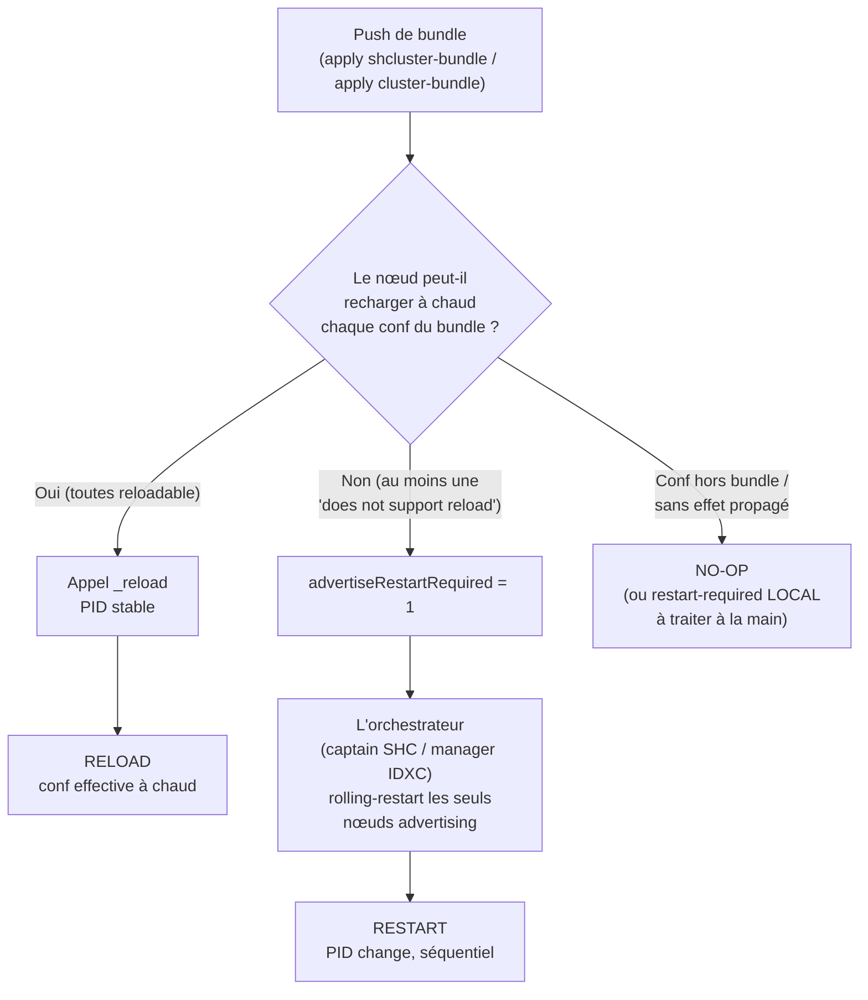

> 🇬🇧 English version: [EN/rolling-restart-triggers.md](r_knowledge_base_pro/concepts/EN/rolling-restart-triggers.md)

# Déclencheurs de rolling restart — SHC & cluster d'indexers

Quelles modifications de configuration (et quelles actions d'administration)
**déclenchent un rolling restart** d'un cluster Splunk Enterprise — par
opposition à un *reload* à chaud (PID inchangé) ou à un *no-op* — sur les deux
topologies clusterisées :

- **Search Head Cluster (SHC)** : on pousse via le **deployer**
  (`apply shcluster-bundle`) ; le **captain** orchestre.
- **Cluster d'indexers (IDXC)** : on pousse via le **cluster manager**
  (`apply cluster-bundle`) ; le **manager** orchestre.

Savoir *à l'avance* si un changement imposera un restart conditionne toute
fenêtre de maintenance : un rolling restart a un coût (interruption partielle de
recherche, fixup de buckets côté indexers, réélection de captain côté SH).
**La doc vendeur classe les réglages « reloadable » / « restart required » de
façon partielle et parfois contredite par le comportement réel.** Cette fiche
décrit le mécanisme, la méthode pour le déterminer soi-même, et une table de
vérité.

> Observations empiriques relevées sur **Splunk Enterprise 9.4.x**, monosite.
> Le comportement peut différer sur d'autres versions — la **méthode** ci-dessous
> reste valable pour re-vérifier sur sa propre version.

---

## 1. Le mécanisme

La règle commune aux deux topologies : **ce n'est pas l'acte de pousser un
bundle qui déclenche un restart, mais le *contenu* du bundle.** Chaque conf est
classée « rechargeable à chaud » ou « ne supporte pas le reload » ; seules les
secondes forcent un restart. Le message affiché à l'`apply` est toujours
conditionnel (« *might* initiate a rolling restart *depending on the
configuration changes* ») — la condition est ce classement.

### 1.1 Côté SHC — le captain et `advertiseRestartRequired`

Chaque **membre** qui reçoit le bundle calcule un flag `advertiseRestartRequired`
pour ce bundle : `1` si au moins une conf « ne supporte pas le reload », `0`
sinon. Le **captain** orchestre alors un rolling restart **uniquement** pour les
membres qui advertisent `1` :

```text
SHCMaster - Starting a rolling restart of the peers. onlyRestartAdvertisingPeers=1
SHCMaster - Skipping rolling restart for peer=... advertiseRestartRequired=0
```

Une conf reloadable (savedsearch, props search-time…) est reçue, **rechargée à
chaud** via un appel `_reload`, et le captain **skippe** le restart. C'est le
pivot de toute la table de vérité SHC.

### 1.2 Côté IDXC — le manager et le reloader de conf des peers

Symétriquement, chaque **peer** passe le bundle reçu dans son
`ClusterSlaveConfigReloader` : il recharge à chaud ce qui le supporte et
**n'advertit au cluster manager que les confs non-rechargeables**. Le manager
n'orchestre alors le rolling restart **que des peers concernés**
(`onlyRestartAdvertisingPeers`). La logique « contenu, pas acte » est identique.

### 1.3 La validation de bundle ne prédit pas le restart

`validate cluster-bundle` (IDXC) vérifie la **cohérence** du bundle (syntaxe,
`btool check`), pas s'il déclenchera un restart. Un bundle valide peut être
reloadable **ou** restart-required. Ne pas confondre « validation OK » et
« reload à chaud ».

### 1.4 Flux de décision



---

## 2. Méthode pour le déterminer soi-même

Réutilisable sur n'importe quelle version. Principe : appliquer **un changement
minimal isolé**, déclencher, observer des **signaux discriminants**, classer.

### 2.1 Les signaux

| Signal | Capture | Prouve |
|---|---|---|
| **PID `splunkd`** avant/après, par nœud | `splunk status` ou `cat $SPLUNK_HOME/var/run/splunk/splunkd.pid` | **RESTART** (PID change) vs **RELOAD/NO-OP** (PID stable) — le discriminant dur |
| **Statut cluster** | SHC : `splunk show shcluster-status [--verbose]` · IDXC : `splunk show cluster-status` + `splunk show cluster-bundle-status` | cycle `RestartInProgress`, génération de bundle, `restart_required` |
| **Bannières** | `GET /services/messages` | présence d'un message « restart required » |
| **Décision dans `splunkd.log`** | `grep` ciblé : `Starting a rolling restart`, `advertiseRestartRequired`, `does not support reload`, `_reload` | le mécanisme exact (qui a déclenché, quand) |
| **Conf effective** | `splunk btool <conf> list --debug <stanza>` sur le nœud cible, avant/après | RELOAD effectif vs restart-required **en attente** (conf pas encore active) |
| **Appel `_reload`** | recherche d'un `GET\|POST .../_reload` dans `splunkd.log` | preuve dure du rechargement à chaud |

### 2.2 La boucle

```bash
# 0. PRÉ-ÉTAT : cluster sain ; snapshot des PID de tous les nœuds ; btool de la conf visée ; t0=date -u
# 1. CHANGEMENT : un seul fichier/attribut/objet (changement minimal isolé)
# 2. DÉCLENCHEUR : apply bundle / toggle / restart ciblé
# 3. OBSERVATION : capturer les signaux sur la fenêtre [t0, t0+delta]
# 4. VERDICT : classer (voir grille ci-dessous)
# 5. REMISE À PLAT : retirer le changement, re-apply, attendre cluster sain AVANT le cas suivant
```

### 2.3 Restart automatique vs « restart required » manuel — l'arbitrage clé

C'est la distinction la plus piégeuse. Règle non ambiguë :

1. Le **PID a changé tout seul** après l'apply, sans intervention → **RESTART**
   (l'orchestrateur l'a fait).
2. **PID stable + bannière « restart required » + conf non effective** (`btool`
   ne montre pas encore la valeur), et c'est seulement un **restart manuel
   ultérieur** qui rend la conf effective → **RESTART-REQUIRED (manuel)** :
   Splunk *demande* mais *ne fait pas*.

Pour les cas potentiellement « manuels », il faut **attendre puis vérifier le
PID et `btool` AVANT tout restart manuel**, sinon les deux issues sont
indiscernables.

Les 5 verdicts possibles : **RESTART** · **RELOAD** · **NO-OP** ·
**RESTART-REQUIRED (manuel)** · **BLOCKED** (l'`apply`/`validate` renvoie une
erreur, bundle non appliqué).

---

## 3. Table de vérité — SHC (push via deployer)

Comportement observé sur 9.4.x, push `apply shcluster-bundle` depuis le
deployer. Verdict du point de vue **cluster** (propagation aux membres).

| Conf / action                                                                     | Verdict                                    | Note                                                                                                                                                                                             |
| --------------------------------------------------------------------------------- | ------------------------------------------ | ------------------------------------------------------------------------------------------------------------------------------------------------------------------------------------------------ |
| `rolling-restart shcluster-members` (commande)                                    | RESTART                                    | restart séquentiel orchestré, 1 membre à la fois                                                                                                                                                 |
| `server.conf` — `[httpServer]`, `[sslConfig]`, tier splunkd                       | **RESTART**                                | « does not support reload » → `advertiseRestartRequired=1`. Inclut rotation de cert TLS (`[sslConfig]`)                                                                                          |
| `savedsearches.conf`, `eventtypes.conf`, `macros.conf`, `tags`, `datamodels.conf` | RELOAD                                     | `_reload` sur l'endpoint correspondant, PID stable                                                                                                                                               |
| `props.conf` / `transforms.conf` **search-time** (`EXTRACT-`, lookup def…)        | RELOAD                                     | artefact search-time, rechargé à chaud                                                                                                                                                           |
| `authorize.conf` (rôles)                                                          | RELOAD                                     |                                                                                                                                                                                                  |
| `alert_actions.conf`, `outputs.conf`, dashboards XML (`data/ui/views`)            | RELOAD                                     |                                                                                                                                                                                                  |
| lookup CSV (`lookups/`)                                                           | RELOAD                                     | search-time ; `-preserve-lookups true` préserve une modif runtime contre l'écrasement par bundle                                                                                                 |
| `authentication.conf` — bascule `authType = LDAP`                                 | **RELOAD**                                 | ⚠️ contre-intuitif : le provider LDAP s'initialise à chaud, **sans bannière ni restart**. La crainte « auth = restart » est infondée pour une conf LDAP **valide et complète**. ⚠️ **Nuance** : une stratégie LDAP **incomplète/invalide** peut, elle, déclencher un restart. (Réserve : SAML non testé.)    |
| `limits.conf` — `[search]` (ex. `max_searches_per_cpu`)                           | RELOAD                                     | le cœur `[search]` recharge ; quelques stanzas rares peuvent être restart-required                                                                                                               |
| `indexes.conf` sur un SH (index de summary)                                       | RELOAD                                     | l'`IndexWriter` initialise le nouvel index à chaud                                                                                                                                               |
| `inputs.conf` — `monitor`, `tcp`, `splunktcp`, `script` (4 types)                 | RELOAD                                     | ⚠️ même les ports TCP : sur un SH le listener n'est pas bindé (un SH n'est pas récepteur), la conf est répliquée + rechargée                                                                     |
| `distsearch.conf` — `[distributedSearch] servers` (ajout de search peer)          | **RESTART**                                | ⚠️ « does not support reload » : touche le moteur de recherche distribuée → rolling restart forcé                                                                                                |
| `web.conf` — `httpport` (port web)                                                | **non-effectif**                           | ⚠️ web-tier : le captain skippe le restart splunkd **et** le port ne rebinde pas → changement inefficace tant qu'aucun restart réel n'a lieu                                                     |
| App **installée** / **activée-désactivée** via bundle                             | RELOAD                                     | si le contenu de l'app est reloadable ; le restart dépend du **contenu**, pas de l'acte d'installer                                                                                              |
| App **désinstallée** (retirée du bundle deployer)                                 | **RESTART (destructif)**                   | retirer du bundle une app que le deployer avait **installée** la **supprime** des membres **et** exige un **restart** (confirmé en production). *Une observation de banc isolée avait conclu « NO-OP/pas de purge », mais le test était biaisé (app désactivée juste avant dans une séquence enchaînée) — non représentatif. Re-test propre (validation secondaire) : `completing an app deletion requires restart` + rolling restart + purge effective → **RESTART confirmé**.* |
| Conf locale d'un membre (`etc/system/local`, hors deployer)                       | NO-OP cluster + RESTART-REQUIRED **local** | le deployer ne touche pas `system/local` : pas de réplication, restart manuel du seul membre édité pour effectivité                                                                              |
| Objet créé en **runtime** (REST/UI) sur un membre                                 | réplication inter-membres (≈ RELOAD)       | mécanisme **distinct** du push deployer : la réplication d'artefacts propage membre-à-membre, sans restart                                                                                       |

**Modulation du rolling restart SHC** : `rolling-restart shcluster-members`
n'accepte **pas** `-percent` (réservé à l'IDXC, voir §4). Les leviers SHC réels
sont `-searchable true` (draine les recherches en cours, timeout 180 s par
défaut) et `-decommission_search_jobs_wait_secs`.

> **Lecture opérationnelle SHC** : la surface restart réelle est **plus étroite**
> que ne le laisse penser la doc. L'essentiel des confs (auth LDAP, inputs, apps
> reloadables, index SH) **RELOAD**. Les vrais déclencheurs de restart :
> `server.conf` (`[httpServer]`, `[sslConfig]`), `distsearch.conf servers`, et la
> **désinstallation d'une app installée par le deployer** (destructive + restart).

---

## 4. Table de vérité — cluster d'indexers (push via cluster manager)

> Comportement **observé et audité empiriquement** sur Splunk Enterprise 9.4.x
> (campagne de 35 cas, verdicts re-vérifiés par un second observateur
> indépendant). Re-vérifier sur sa propre version par la méthode du §2.

Push `apply cluster-bundle` depuis le cluster manager. Verdict du point de vue
**cluster** (propagation aux peers). Mécanisme : chaque peer recharge à chaud ce
qu'il peut et n'advertit au manager que les confs non-rechargeables.

| Conf / action | Verdict | Note |
|---|---|---|
| `rolling-restart cluster-peers` (commande) | RESTART | baseline, restart séquentiel des peers |
| `props.conf` / `transforms.conf` **index-time** (`LINE_BREAKER`, `SHOULD_LINEMERGE`, `TIME_FORMAT`, `TZ`, `SEDCMD`, `TRANSFORMS-`, routing d'index, `WRITE_META`, `DEST_KEY`) | **RELOAD** | ⚠️ **contre-intuitif** : en 9.4.x la chaîne de parsing index-time est rechargée **à chaud** (`No restart required at reload`). L'idée reçue « index-time = restart » est **fausse** ici |
| `props.conf` / `transforms.conf` **search-time** | RELOAD | |
| `indexes.conf` — **ajout** d'un index | RELOAD | l'`IndexWriter` initialise le nouvel index à chaud |
| `indexes.conf` — attribut « à chaud » (`maxTotalDataSizeMB`, `frozenTimePeriodInSecs`) | RELOAD | |
| `indexes.conf` — attribut structurant (`homePath` sur un index existant) | RESTART | |
| `indexes.conf` — **suppression** d'un index | **RESTART + buckets non purgés** | ⚠️ les buckets restent sur disque ; la purge des données est une opération distincte |
| `server.conf` — `[clustering]`, `[general]` (splunkd-tier) | RESTART | par stanza |
| `limits.conf` — `[search]` | **RESTART** | ⚠️ **opposé du SHC** (où la même stanza RELOAD) |
| `authorize.conf` (rôles) | RELOAD | |
| `authentication.conf` (bascule LDAP) | **RESTART** | ⚠️ **opposé du SHC** (où LDAP RELOAD) |
| `datamodels.conf` (accélération) | RELOAD | |
| Certificat TLS (`server.conf [sslConfig]`) | RESTART | rotation de cert |
| `inputs.conf` — récepteur `[splunktcp]` (listener) | **RESTART** | ⚠️ **contraste SHC** : un peer **est** récepteur, le listener est réellement bindé |
| `inputs.conf` — `[splunktcp-ssl]` / `requireClientCert` (activation **et** désactivation) | **RESTART** | les deux sens du toggle SSL récepteur |
| `inputs.conf` — entrée **scriptée** (`[script://]`) | RELOAD | |
| `outputs.conf` (forward aval) | **RELOAD** | rechargé à chaud (endpoint `_reload` actif en 9.4.x). *(Verdict de 1er passage « RESTART » **corrigé** par validation secondaire : c'était un artefact d'échantillonnage de PID, pas un vrai restart.)* |
| App **installée / activée / désactivée** via bundle | RELOAD | si le contenu est reloadable ; dépend du contenu, pas de l'acte |
| App **désinstallée** (retirée du bundle manager) | **RESTART + PURGE** | le manager est **autoritatif** → l'app est **purgée** des peers **et** son retrait force un **restart** (`Restart required … One or more apps has been deleted`). *(Verdict de 1er passage « RELOAD+PURGE » **corrigé** par validation secondaire — l'app n'était pas garantie active au 1er test.)* |
| Conf déclarant un reload endpoint custom (`app.conf [triggers] reload.<conf>`) | RELOAD | rend une conf normalement restart-required rechargeable |
| Conf locale d'un peer (`etc/system/local`, hors bundle) | NO-OP cluster + RESTART-REQUIRED **local** | non répliqué ; restart manuel du seul peer édité |
| Re-push d'un bundle identique (sans diff) | NO-OP | `No new bundle will be pushed` |
| Bundle invalide (`btool check` KO à l'apply) | BLOCKED | la validation peer échoue, bundle non activé |

**Actions du manager (hors push de conf)** :

| Action | Effet observé |
|---|---|
| `validate cluster-bundle` (dry-run) | validation **asynchrone** ; **ne prédit pas** le restart (valide la cohérence, pas le déclenchement — §1.3) |
| `apply --skip-validation` | contourne la validation ; la décision reload/restart est **inchangée** |
| Restart du **manager** seul | les peers **se ré-enregistrent** ; **pas** de rolling restart des peers |
| Mode maintenance (`enable maintenance-mode`) avant un apply restart-required | **ne change pas** le déclenchement : le restart a lieu ; seul le **fixup** de buckets est suspendu |
| Rolling restart avec **RF/SF dégradé** | le rolling restart *classic* **ne refuse pas** (restart quand même) ; seul le **searchable** enforce la redondance |

**Modulation du rolling restart IDXC** : le redémarrage **par lots** se règle via
`server.conf [clustering]` (`percent_peers_to_restart`) ou `edit cluster-config
-percent_peers_to_restart `<n>` — ce **n'est pas** un argument de la commande CLI
`rolling-restart cluster-peers` (qui le rejette). Le **searchable rolling
restart** (`-searchable true`), qui préserve la continuité de recherche,
**nécessite plus de 2 peers** (sous 3 peers, Splunk le refuse : pas assez de
redondance pour drainer).

---

## 5. Pièges et contrastes les plus utiles

- **« Index-time = restart » est FAUX en 9.4.x.** L'idée reçue veut que tout
  réglage de parsing index-time (`LINE_BREAKER`, `SEDCMD`, `TRANSFORMS-`,
  `WRITE_META`, routing d'index…) force un restart des indexers. **Observé :
  ces confs RELOAD à chaud** côté peer — le reloader de conf les prend sans
  redémarrer (`No restart required at reload`). Ne jamais présumer du restart sur
  ce critère : mesurer.
- **Mêmes confs, comportement OPPOSÉ selon la topologie.** `limits.conf` et
  `authentication.conf` sont **rechargés à chaud côté SHC** mais **restart côté
  indexer**. Toujours raisonner *par topologie*, jamais « cette conf = restart »
  dans l'absolu.
- **Désinstallation d'app = destructive (ne pas la croire inoffensive).** Retirer
  du bundle une app **installée par le deployer (SHC)** ou par le **manager
  (cluster d'indexers)** la **supprime des nœuds** **et** force un **restart** —
  confirmé sur les **deux** topologies (SHC en production, indexer cluster en
  validation secondaire). Ne jamais présumer qu'enlever une app du bundle est sans
  effet : c'est un changement **destructif + restart** propagé.
- **Suppression d'index = restart MAIS buckets non purgés.** Retirer un index du
  bundle indexer déclenche un restart, mais les **buckets restent sur disque** :
  la purge des données est une opération distincte.
- **`percent_peers_to_restart` est un réglage `server.conf`, pas un flag CLI.**
  Le redémarrage par lots côté indexer se configure dans `server.conf
  [clustering]` (ou `edit cluster-config`), **pas** en argument de
  `rolling-restart cluster-peers` (qui le rejette). Côté SHC il n'existe pas du
  tout — la modulation y passe par `-searchable` /
  `-decommission_search_jobs_wait_secs`.
- **Searchable rolling restart : il faut > 2 peers.** Avec 2 peers ou moins, pas
  assez de redondance pour drainer et préserver la recherche pendant le cycle.
- **`web.conf httpport` côté SHC : changement non effectif.** Web-tier : le
  captain skippe le restart splunkd et le port ne rebinde pas — il faudrait un
  restart splunkd réel pour qu'il prenne effet.
- **`validate cluster-bundle` ne prédit pas le restart** (§1.3) : il valide la
  cohérence, pas le déclenchement.

---

## Voir aussi

- [Cheat-sheet admin Splunk](../../cheat-sheets/splunk-admin.md) — commandes,
  `btool`, pièges courants.
- [Patrons de CI/CD pour déploiement Splunk](cicd-deployment-patterns.md) —
  pipeline de livraison de bundles.
- [Cycle de vie d'un évènement](splunk-cycle-de-vie-evenement.md) — où jouent
  parsing index-time et search-time.
