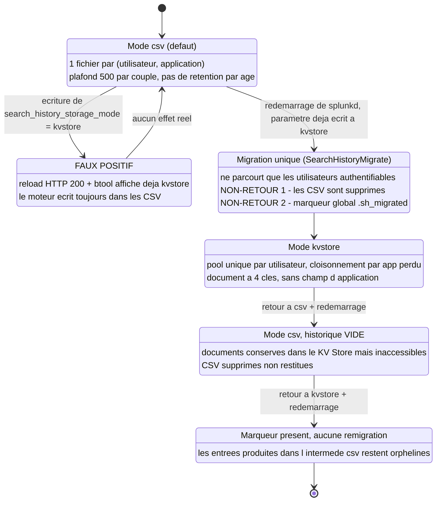

# Historique de recherche Splunk : deux magasins, une bascule à sens unique

L'historique de recherche visible dans l'application Search n'est **ni le job, ni
son artefact de dispatch**. C'est un artefact persistant, écrit à la soumission,
qui survit à la suppression du job et à la purge du répertoire de dispatch. Il
dispose depuis Splunk Enterprise 9.1.0 de **deux magasins possibles** — fichiers
CSV **par couple (utilisateur, application)** (défaut) ou **collection KV Store
partagée, par utilisateur** — sélectionnés par un unique paramètre de
`limits.conf`.

Ce paramètre a trois propriétés que la documentation éditeur n'expose pas, ou
pas entièrement, et qui changent la nature de l'opération :

1. Il **ne se recharge pas à chaud**, alors que les deux indicateurs habituels
   (`_reload` en HTTP 200, `btool`) affirment le contraire.
2. Sa prise d'effet **détruit les fichiers CSV** — non documenté — et pose un
   **marqueur global sur disque**, mécanisme non documenté lui aussi, qui
   matérialise l'unicité de migration que la documentation, elle, annonce bien.
3. Elle **aplatit le cloisonnement par application** : l'historique cesse d'être
   segmenté par (utilisateur, app) pour devenir un pool unique par utilisateur.

Le geste est trivial — une ligne de conf, un redémarrage. L'opération ne l'est
pas : elle est **irréversible sans sauvegarde préalable**.

> **Portée des mesures.** Splunk Enterprise **9.4.6**, **search head autonome**,
> mode `csv` au départ, campagne instrumentée avec bascule aller-retour.
> Documentation éditeur relue en 9.4.6 et en 10.4.0.
> **N'a pas pu être mesuré** : tout ce qui relève d'un **cluster de search
> heads** — réplication de l'historique entre membres, ordre des opérations lors
> d'un déploiement, membre qui exécute la migration —, ainsi que le comportement
> **si le KV Store est indisponible**. Le mode `kvstore` étant précisément conçu
> pour le SHC, c'est un angle mort assumé de cette fiche : la **méthode** du §7
> reste applicable pour le combler sur son propre socle.

---

## 1. Où vit l'historique en mode `csv`

Chemin, mesuré :

```text
$SPLUNK_HOME/etc/users/<utilisateur>/<application>/history/<serverName>.csv
```

Trois propriétés de granularité en découlent :

- **Un fichier par couple (utilisateur, application)**, pas par utilisateur. Un
  même compte qui utilise l'application Search et une seconde application a deux
  historiques disjoints.
- **Le nom du fichier est le `serverName`** du search head, pas un identifiant de
  session ni une date. Un renommage d'instance orpheline l'historique existant —
  *déduit du nommage, non mesuré*.
- Le répertoire `history/` contient aussi un `.dummy_history` préexistant, sans
  rapport avec le contenu.

**Colonnes du CSV : l'en-tête n'est pas invariant** (mesuré). Plusieurs jeux
d'en-têtes coexistent sur un même socle, selon l'ancienneté du fichier. Jeu le
plus complet observé, dans son ordre réel :

```text
sid, splunk_server, _time, is_realtime, provenance, search, adhoc_search_level,
api_et, api_index_et, api_index_lt, api_lt, event_count, exec_time, result_count,
savedsearch_name, scan_count, search_et, search_lt, status, total_run_time
```

plus le champ multivalué `__mv_*` correspondant à chacune. Des fichiers plus
anciens du même socle ne portent **ni `api_index_et`, ni `api_index_lt`, ni
`savedsearch_name`**, et les plus anciens **pas même `provenance`** ; l'ordre des
colonnes varie lui aussi d'un jeu à l'autre. Conséquence directe : **ne jamais
indexer un champ par sa position** ni supposer sa présence — parser l'en-tête.
Quand elle est présente, la colonne `provenance` vaut `UI:Search` pour une
recherche lancée depuis l'interface.

**L'entrée est écrite à la soumission du job, pas à sa complétion** (mesuré). Une
recherche annulée, en échec ou jamais consultée laisse donc une trace complète —
c'est une propriété de confidentialité, pas un détail d'implémentation.

**Éviction FIFO au plafond** (mesuré) : à `max_history_length` atteint, l'ajout
d'une entrée évince la plus ancienne. Signature observée : le fichier *rétrécit*
à l'ajout d'un enregistrement (177 699 → 177 552 octets), l'entrée sortante étant
plus longue que l'entrante.

> **Piège de comptage.** Une recherche SPL multi-lignes produit un enregistrement
> CSV qui s'étale sur plusieurs lignes physiques : `wc -l` **sur-compte**
> systématiquement. Le seul comptage juste passe par un parseur CSV (ou, à
> défaut, par l'équilibrage des guillemets). Ce piège se paie deux fois : il
> fausse la mesure du plafond, et il masque la perte d'enregistrements à la
> migration (§5.2, point 8).

---

## 2. Ce que ce n'est pas : ni le job, ni l'artefact de dispatch

Confusion courante : « l'historique, c'est la liste des jobs ». Faux, et la
manipulation qui le prouve est courte :

```bash
# 1. Lancer une recherche, récupérer son sid, puis supprimer le job
# `-u <compte>` sans mot de passe déclenche une invite interactive de curl :
# pour un enchaînement scripté, utiliser la forme `-K -` du §7, étape 7.
curl -sk -u user01 -X DELETE \
  "https://localhost:8089/servicesNS/user01/search/search/jobs/<sid>"

# 2. Le job n'existe plus
curl -sk -u user01 -o /dev/null -w '%{http_code}\n' \
  "https://localhost:8089/servicesNS/user01/search/search/jobs/<sid>"   # -> 404

# 3. Recompter les artefacts de dispatch restants
ls "$SPLUNK_HOME/var/run/splunk/dispatch" | wc -l
```

`| history` continue de servir l'entrée. Le pas 3 ne purge rien : il **compte**,
et c'est le contraste qui fait la démonstration — la purge, ici, est celle que le
produit opère seul à l'expiration du TTL des jobs. Mesure de contraste sur le
socle de test : **5 à 8 artefacts** présents dans `var/run/splunk/dispatch`
contre **499 entrées** servies par `| history` pour le même couple
(utilisateur, app).

**Conséquence déduite** : purger le dispatch, réduire le TTL des jobs ou
supprimer les jobs **ne réduit pas** ce qui est exposé par l'historique. Ce sont
deux rétentions indépendantes, gouvernées par des paramètres différents.

---

## 3. Les quatre paramètres

Tous dans la stanza `[search]` de `limits.conf`.

| Paramètre | Défaut | Portée | Statut |
|---|---|---|---|
| `enable_history` | `true` | Active l'historisation. Le mode de stockage n'a de sens que si ce drapeau est vrai. | documenté |
| `max_history_length` | `500` | **En `csv` : par couple (utilisateur, application).** **En `kvstore` : par utilisateur seul**, avec un maximum absolu de 1000. | documenté |
| `max_history_storage_retention_time` | `90d` | **Applicable uniquement en mode `kvstore`.** En `csv`, aucune rétention temporelle : seul le plafond de nombre s'applique. Valeur `0` = seul `max_history_length` compte. | documenté |
| `search_history_storage_mode` | `csv` | `csv` ou `kvstore`. | documenté |

Deux lectures opérationnelles à ne pas manquer :

- **La rétention temporelle n'existe pas en mode `csv`.** Un `90d` affiché dans la
  spec laisse croire à une purge par âge ; sur une instance en `csv`, une
  recherche vieille de trois ans reste dans le fichier tant que le plafond de 500
  n'a pas fait son travail. Le seul mécanisme d'expiration est l'éviction FIFO.
- **Le plafond change de granularité à la bascule.** 500 par (utilisateur, app)
  devient 500 par utilisateur. Attention au sens de l'effet : **immédiatement
  après migration le volume est au contraire supérieur**, la migration
  n'écrêtant pas au plafond (831 documents migrés pour un plafond nominal de
  500 — §5.2, point 7). La diminution n'est qu'un **régime permanent**, atteint
  plus tard, une fois l'éviction FIFO redevenue active sur le pool unique.

**Où écrire le paramètre n'est documenté nulle part.** Mesuré : une écriture dans
`$SPLUNK_HOME/etc/system/local/limits.conf` est prise en compte — après
redémarrage, cf. §5.

---

## 4. Le mode `kvstore` : ce que la doc dit, ce qu'elle tait, ce qu'elle n'a jamais mis à jour

**Ce qu'elle dit.** Le paramètre apparaît en 9.1.0 (absent en 9.0.6) ; les notes
de version 9.1 le présentent sous l'angle de la préservation de l'historique
entre search heads. L'[entrée `limits.conf` du manuel
d'administration](https://help.splunk.com/en/splunk-enterprise/administer/admin-manual/9.4/configuration-file-reference/9.4.0-configuration-file-reference/limits.conf)
est la **seule page normative** : il n'existe aucune page de procédure dédiée.
Elle énonce deux choses, reformulées ici :

- **l'irréversibilité** — lors du premier passage à `kvstore`, le search head
  migre les enregistrements des CSV existants vers le KV Store ; cette migration
  ne peut avoir lieu **qu'une seule fois**, et un retour en `csv` suivi d'un
  nouveau passage en `kvstore` ne la rejoue pas ;
- **la finalité en cluster** — le mode `kvstore` permet au cluster de répliquer
  l'historique de recherche entre tous ses membres via le service KV Store.

Le texte est **identique en 9.4.6 et en 10.4.0** : aucune clarification en trois
versions majeures.

**Ce qu'elle ne dit pas**, vérifié par relecture des deux versions :

- où écrire le paramètre ;
- si un redémarrage est requis ;
- ce que deviennent les fichiers CSV après migration ;
- le comportement sur un search head **autonome** ;
- le comportement si le **KV Store est indisponible** ;
- quel membre exécute la migration dans un cluster.

**Une page jamais mise à jour.** La [page du manuel de recherche distribuée
décrivant ce que le cluster
réplique](https://help.splunk.com/en/splunk-enterprise/administer/distributed-search/9.4/update-search-head-cluster-members/configuration-updates-that-the-cluster-replicates)
affirme toujours que l'historique de recherche n'est **pas** répliqué et que
`conf_replication_include.history = true` est sans effet — sans une seule
mention du mode `kvstore` introduit trois versions plus tôt.

Les deux pages **ne se contredisent pas nécessairement** : la réplication de
*configuration* du SHC, à laquelle se rapporte `conf_replication_include.*`, et
la réplication *par le KV Store* sont deux mécanismes distincts, et les deux
énoncés peuvent coexister. Ce qui est établi, c'est que la page de recherche
distribuée n'a **jamais été mise à jour** : elle décrit l'historique comme non
réplicable sans dire qu'un mode existe désormais pour le répliquer autrement. Le
comportement en SHC en devient **illisible depuis la documentation** — non parce
qu'elle se contredit, mais parce que le lien entre les deux pages n'y figure
nulle part.

**Rapporté, non vérifié.** Un article de support éditeur, à accès client, avance
qu'en cluster poser le seul `search_history_storage_mode = kvstore` ne suffirait
pas. Il n'a **pas pu être consulté** dans le cadre de ces mesures, et rien dans
la documentation publique ne le confirme ni ne l'infirme. À traiter comme une
piste à valider soi-même avant tout déploiement SHC, pas comme un fait — et à ne
pas reprendre à son compte.

Côté interface et SPL, la documentation utilisateur est cohérente mais
**disjointe**. La Search Summary view (colonnes Search / Actions / Last Run,
filtre par mot-clé et par temps, 20 entrées par page — 10/20/50 —, raccourcis
clavier limités aux 100 dernières recherches) et la commande génératrice
`| history [events=<bool>]` sont documentées avec la même limitation de portée —
*l'historique n'est disponible que pour l'application en cours d'utilisation* —
**sans jamais mentionner `limits.conf`, le KV Store, ni le mode de stockage**. Le
lien entre l'interface et son magasin n'est documenté d'aucun côté. Écart mesuré
supplémentaire : la [page de la commande
`history`](https://help.splunk.com/en/splunk-enterprise/spl-search-reference/9.4/search-commands/history)
**omet** plusieurs champs réellement présents dans les fichiers récents
(`provenance`, `adhoc_search_level`, `savedsearch_name`, `api_index_et`,
`api_index_lt`).

---

## 5. Ce que la bascule fait réellement

### 5.1 Le chemin de bout en bout



### 5.2 Les faits mesurés

> **Lire les chiffres qui suivent.** Six volumétries différentes apparaissent
> aux points 6 à 11. Elles n'ont ni le même périmètre ni le même instant de
> mesure — sans ce cadrage elles paraissent incohérentes, alors qu'elles ne le
> sont pas :
>
> | Chiffre | Périmètre | Instant |
> |---|---|---|
> | 499 et 205 | un utilisateur, vu depuis deux de ses applications | avant bascule |
> | 822 | `sid` **uniques** du **même utilisateur**, toutes applications confondues | avant bascule |
> | 831 | **documents migrés** pour ce même utilisateur : les 822 `sid` uniques plus 9 doublons inter-applications | juste après migration |
> | 824 / 825 | comptage d'historique du même utilisateur, vu depuis chacune des deux applications | après migration, quelques recherches plus tard |
> | 915 | enregistrements de **l'ensemble des CSV de l'instance**, tous utilisateurs confondus | à l'entrée de la migration |
> | 912 | documents de la collection `SearchHistory`, **tous utilisateurs confondus** | juste avant la bascule inverse |
>
> Autrement dit : **822 / 831 / 824 relèvent d'un seul utilisateur** ; **912 et
> 915 portent sur l'instance entière**, le premier côté KV Store et le second
> côté CSV. Les écarts d'une ou deux unités entre relevés
> successifs s'expliquent par les recherches de comptage elles-mêmes, qui
> s'inscrivent dans l'historique au moment où elles sont soumises (§1).

**1. Le rechargement à chaud ne suffit pas ; le redémarrage est obligatoire.**
C'est le piège majeur, et il est doublement trompeur :
`etc/system/default/app.conf` déclare pourtant
`reload.limits = access_endpoints /server/status/limits/general`, un `POST` sur
`services/configs/conf-limits/_reload` renvoie **HTTP 200**, et `btool` affiche
**immédiatement** la nouvelle valeur — pendant que le moteur continue d'écrire
dans les CSV. Les deux indicateurs habituels sont des **faux positifs**. Seule
une **recherche marquée**, lancée puis tracée jusqu'à son magasin de destination,
dit la vérité. La migration ne se déclenche qu'après redémarrage, tracée par
`SearchHistoryMigrate - Starting the search history migration procedure`.

**2. La collection KV Store n'est pas créée par la bascule.** La collection
`SearchHistory` de l'application `system` est déclarée dans le `collections.conf`
par défaut du produit et **existe déjà, vide**, sur une instance en mode `csv`.
Le nombre total de collections est inchangé avant/après. La bascule ne fait que
la **remplir** — sa présence ne prouve donc rien.

**3. Les CSV sont supprimés, et un marqueur global est posé.** Pas vidés, pas
conservés : supprimés. En regard, un fichier vide en `0600` est créé à
`$SPLUNK_HOME/var/run/splunk/.sh_migrated`. Il est **unique et global** : il n'y
a **pas** de marqueur par utilisateur ni par répertoire `history/`. Les
répertoires `history/` eux-mêmes subsistent. Ce marqueur survit aux redémarrages
suivants — c'est lui, et non un drapeau en base, qui grille définitivement
l'unique migration de l'instance.

**4. Un utilisateur qui n'existe plus à l'authentification n'est pas migré.** Son
CSV reste **intact et orphelin** : ni migré, ni détruit. Angle mort typique après
le départ d'un utilisateur — l'historique reste sur disque, hors de tout
inventaire fondé sur la collection.

**5. Le schéma du document KV Store est pauvre.** Chaque document ne porte que
**quatre clés** : `history`, `timestamp`, `_user`, `_key`. La valeur de `history`
est un **BLOB texte** contenant la ligne d'en-tête CSV suivie de la ligne de
données — guillemets et champs `__mv_*` compris. **Aucun champ d'application.**
L'appartenance applicative n'est récupérable qu'*incidemment*, via la portion
encodée en base64 de certains `_key`, et **pas du tout** pour les `sid` ad hoc
numériques.

**6. Conséquence directe : aplatissement par utilisateur.** Avant bascule,
`| history | stats count` renvoie **499** depuis l'application Search et **205**
depuis une seconde application du **même utilisateur**. Après bascule : **824**
et **825** — le même pool unique, vu depuis ces deux applications. Le
cloisonnement par application **disparaît**, et c'est **structurel** (absence de
champ d'application dans le document), pas un réglage. Les deux valeurs de départ
ne totalisent pas l'historique de ce compte : il l'avait réparti sur davantage
d'applications que ces deux-là.

**7. La migration n'écrête pas au plafond.** **831 documents migrés pour ce seul
utilisateur** — ses 822 `sid` uniques plus 9 doublons inter-applications — alors
que son plafond nominal est 500, soit **1,66×**. *Déduit* : avec un historique
plus fourni, la migration dépasserait le **maximum absolu documenté de 1000** —
non mesuré, mais mécaniquement impliqué par l'absence d'écrêtage.

**8. Perte partielle non documentée.** **3 enregistrements sur les 822 `sid`
uniques de cet utilisateur** perdus. La
corrélation est mesurée : trois documents portent des `_key` manifestement
tronqués **à un saut de ligne du SPL** (de la forme `<serverName>_| fieldsummary`),
tous horodatés à l'instant exact de la migration. *Déduit* : mauvais découpage
des recherches **multi-lignes** par le migrateur. Aucune erreur dans les
journaux — la perte est **silencieuse**.

**9. Le retour en `csv` n'est pas un retour en arrière.** Après bascule inverse et
redémarrage, `| history` ne renvoie plus qu'**une seule entrée** — la recherche
de comptage elle-même — alors que la collection contenait **912 documents** juste
avant, tous utilisateurs confondus. Les deux chiffres ne mesurent pas la même
chose, et c'est précisément le point : le magasin est plein, la vue est vide. Les
documents restent dans
le KV Store mais deviennent **inaccessibles**, et les CSV supprimés ne sont **pas
restitués** : le produit repart d'un fichier vierge. Seule une **sauvegarde
préalable des CSV** permet de revenir.

**10. La migration ne se rejoue pas.** Conforme à la doc, et le garde-fou est le
marqueur sur disque. Conséquence mesurée : les entrées produites pendant un
intermède en mode `csv` restent **orphelines** dans le CSV, que le produit laisse
intact sans jamais le relire. Un aller-retour ne revient pas au point de départ :
il **scinde l'historique en deux moitiés** qui ne seront plus jamais réunies.

**11. Coût.** **Environ 25 s d'indisponibilité par redémarrage**, mesurés jusqu'au
retour effectif de l'API REST ; la migration elle-même prend **2 ms pour les 915
enregistrements de l'ensemble des CSV de l'instance**, tous utilisateurs
confondus. Le coût, c'est le redémarrage — pas la migration.

**12. Le contrôle post-migration se trompe par défaut, de deux façons
différentes.** Deux commandes viennent naturellement à l'esprit pour vérifier que
la collection s'est remplie ; aucune des deux ne répond à la question, et pour
des raisons **sans rapport entre elles** :

- `| inputlookup SearchHistory` **échoue** — ce n'est pas une table vide, c'est
  une erreur : *the lookup table 'SearchHistory' requires a .csv or KV store
  lookup definition*. Vérifié : **aucune définition de lookup n'est livrée** pour
  cette collection (aucune stanza `[SearchHistory]` en dehors de
  `collections.conf`, aucun `collection = SearchHistory` dans un
  `transforms.conf`). L'échec est **identique dans les deux modes** et ne dit
  donc rien de la migration.
- `GET /servicesNS/<utilisateur>/system/storage/collections/data/SearchHistory`
  renvoie, lui, une **liste vide** alors que la collection contient plusieurs
  centaines de documents. L'endpoint de données est **scopé par le propriétaire
  du namespace d'appel** : interrogé en `servicesNS/nobody/system`, il ne renvoie
  rien ; interrogé en `servicesNS/<utilisateur>/system`, il renvoie les documents
  de *cet* utilisateur.

Seuls `GET /services/server/introspection/kvstore/collectionstats` et `| history`
disent vrai. On conclut très facilement, et à tort, à un **échec de migration**.

**13. ACL de la collection.** Le `default.meta` du produit déclare
`[collections/SearchHistory]` avec `access = read : [ * ], write : [ * ]`.
**Vérifié** : un administrateur lit l'historique d'un autre utilisateur en
substituant simplement le propriétaire dans le namespace REST. **Non vérifié**,
et donc à ne pas affirmer : qu'un compte authentifié quelconque, sans privilège,
puisse en faire autant.

**14. Les métriques ne sont pas un indicateur de bascule.** `metrics.log` expose
`group=search_health_metrics, name=search_history_metrics` avec
`history_records_added` et `history_records_updated`, toutes les 60 s. Ce sont
des compteurs **cumulatifs depuis le démarrage**, émis **dans les deux modes**.

---

## 6. Table de synthèse

| Affirmation | Statut | Conséquence opérationnelle |
|---|---|---|
| L'historique vit dans `etc/users/<user>/<app>/history/<serverName>.csv`, un fichier par couple | **mesuré** | Sauvegarde ciblée possible, et nécessaire avant toute bascule |
| L'entrée est écrite à la soumission du job, pas à sa complétion | **mesuré** | Une recherche annulée ou en échec laisse une trace complète |
| L'historique survit au `DELETE` du job et à la purge du dispatch | **mesuré** | Purger le dispatch ne réduit **pas** l'exposition de l'historique |
| Rétention des jobs et rétention de l'historique sont indépendantes | **déduit** | Deux réglages distincts à traiter, pas un |
| `enable_history` conditionne la prise en compte du mode de stockage | documenté | Vérifier ce drapeau avant de diagnostiquer un historique vide |
| `max_history_length` = 500, par (utilisateur, app) en `csv`, **par utilisateur** en `kvstore`, maximum absolu 1000 | documenté | Le plafond **change de granularité**. Le volume ne diminue qu'**en régime permanent**, une fois l'éviction FIFO active sur le pool unique — juste après migration il est au contraire supérieur |
| Éviction FIFO au plafond | **mesuré** | La plus ancienne entrée disparaît sans trace ni journal |
| `max_history_storage_retention_time` ne s'applique qu'en `kvstore` | documenté | En `csv`, **aucune** purge par âge — le `90d` affiché est trompeur |
| Le rechargement à chaud ne bascule pas le mode ; seul le redémarrage le fait | **mesuré** | Fenêtre de maintenance obligatoire, ~25 s par redémarrage |
| `_reload` en HTTP 200 et `btool` sont des faux positifs | **mesuré** | Ne jamais valider la bascule sur ces deux indicateurs |
| La collection `SearchHistory` préexiste, vide, en mode `csv` | **mesuré** | Sa présence ne prouve rien ; seul son **remplissage** compte |
| Les CSV sont supprimés à la migration | **mesuré** | Sauvegarder avant, ou accepter une perte définitive |
| Marqueur **global unique** `var/run/splunk/.sh_migrated` | **mesuré** | Une seule migration possible sur toute la vie de l'instance |
| Un utilisateur absent de l'authentification n'est pas migré ; son CSV reste orphelin | **mesuré** | Angle mort après départ : données sur disque, hors inventaire |
| Le document KV Store n'a que 4 clés, sans champ d'application | **mesuré** | Aucun requêtage ni audit par application |
| Le cloisonnement par application disparaît (un utilisateur : 499 + 205 → 824 / 825) | **mesuré** | L'historique d'un utilisateur devient global à toutes ses apps |
| La migration n'écrête pas au plafond (831 documents pour **un** utilisateur, plafond de 500) | **mesuré** | Le volume post-migration excède le réglage nominal |
| Un historique plus fourni ferait dépasser le maximum absolu de 1000 | **déduit** | À vérifier avant de migrer un compte très actif |
| 3 `sid` perdus sur les 822 d'un utilisateur, `_key` tronqués à un saut de ligne | corrélation **mesurée**, mécanisme **déduit** | Perte **silencieuse** : aucun journal ne la signale |
| Le retour en `csv` repart d'un historique vierge : 1 entrée servie, alors que la collection en contenait 912 | **mesuré** | Bascule **irréversible** sans sauvegarde des CSV |
| La migration ne se rejoue jamais | documenté **et** mesuré (le marqueur en est le garde-fou) | Un aller-retour scinde l'historique en deux moitiés définitivement disjointes |
| Coût ≈ 25 s d'indisponibilité par redémarrage ; migration en 2 ms pour les 915 enregistrements de l'instance | **mesuré** | Dimensionner la fenêtre sur le redémarrage, pas sur la migration |
| `inputlookup SearchHistory` **échoue** : aucune définition de lookup n'est livrée pour cette collection | **mesuré** | Ce n'est pas un contrôle de migration — l'échec est le même dans les deux modes |
| `storage/collections/data/...` renvoie une liste vide sur une collection pleine, l'endpoint étant scopé par le propriétaire du namespace d'appel | **mesuré** | Contrôler par `collectionstats` et `history`, jamais autrement |
| ACL `read : [ * ], write : [ * ]` ; un administrateur lit l'historique d'un autre via le namespace | **mesuré** | Surface de confidentialité à évaluer avant bascule |
| « N'importe quel compte authentifié peut lire l'historique de n'importe qui » | **non vérifié** | Ne pas s'en servir comme argument, dans un sens ni dans l'autre |
| `history_records_added` / `history_records_updated` émis dans les **deux** modes | **mesuré** | Ce ne sont pas des indicateurs de bascule |
| La doc de recherche distribuée affirme toujours que l'historique n'est pas répliqué et que `conf_replication_include.history` est sans effet, **sans mentionner le mode `kvstore`** | documenté (**page jamais mise à jour** ; pas une contradiction logique — deux mécanismes distincts, cf. §4) | Ne pas s'appuyer sur cette seule page pour un SHC ; mesurer |
| L'en-tête des CSV d'historique **n'est pas invariant** : jeux de colonnes et ordre varient selon l'ancienneté du fichier | **mesuré** | Parser l'en-tête ; ne jamais indexer un champ par sa position ni présumer sa présence |
| La page de `history` omet `provenance`, `adhoc_search_level`, `savedsearch_name`, `api_index_et`, `api_index_lt` | **mesuré** | Ne pas se fier à la liste de champs documentée |
| En cluster, poser le seul `search_history_storage_mode = kvstore` serait insuffisant (§4, « rapporté, non vérifié ») | **non vérifié** — article de support éditeur, accès client requis, non consultable | À valider soi-même avant tout déploiement SHC ; ne pas reprendre l'affirmation à son compte |
| Comportement si le KV Store est indisponible | **non mesuré, non documenté** | Risque non caractérisé ; à sonder en lab avant production |
| Membre qui exécute la migration dans un SHC | **non mesuré, non documenté** | Ordre des opérations de déploiement à établir par mesure |

---

## 7. Méthode pour le vérifier soi-même

Reproductible sur n'importe quelle version. Principe : **une recherche marquée
est le seul juge**, et le comptage ne se fait qu'avec les deux sources qui disent
vrai.

**1. Pré-état.** Relever le mode effectif et le plafond, avec la réserve d'usage
sur ce que `btool` affiche (§8) :

```bash
splunk btool limits list search --debug | grep -E 'enable_history|max_history|search_history'
```

**2. Inventaire et comptage juste** — jamais `wc -l` :

```bash
find "$SPLUNK_HOME/etc/users" -path '*/history/*.csv' -printf '%s\t%p\n' | sort -rn

python3 -c "import csv,sys; print(sum(1 for _ in csv.reader(open(sys.argv[1], newline=''))) - 1)" \
  "$SPLUNK_HOME/etc/users/user01/search/history/searchhead-01.csv"
```

**3. Sauvegarder les CSV** — seul filet, à faire avant toute écriture de conf :

```bash
find "$SPLUNK_HOME/etc/users" -path '*/history/*.csv' -print0 \
  | tar --null -T - -czf /var/tmp/search-history-pre-bascule.tgz
```

**4. Mesurer le cloisonnement de départ.** Exécuter dans l'application Search,
puis dans une seconde application (`app01`), et noter les deux valeurs :

```spl
| history | stats count
```

**5. Poser la recherche marquée.** C'est l'unique preuve d'effectivité — un
motif unique, retrouvable ensuite dans l'un ou l'autre magasin :

```bash
# `exec_mode=oneshot` s'inscrit bien dans l'historique — vérifié ; pour la forme
# scriptable des identifiants, voir l'étape 7.
curl -sk -u user01 -X POST \
  "https://localhost:8089/servicesNS/user01/search/search/jobs" \
  -d 'search=search index=_internal marqueur_bascule_01' \
  -d 'exec_mode=oneshot' -o /dev/null
```

**6. Écrire le paramètre** dans `$SPLUNK_HOME/etc/system/local/limits.conf` :

```ini
[search]
search_history_storage_mode = kvstore
```

**7. Tenter le rechargement à chaud, et constater qu'il ment.** L'endpoint
`_reload` exige une **capacité d'administration** : l'appeler avec le compte
utilisateur non privilégié des étapes précédentes renvoie très probablement 403,
et fait conclure à tort à un rechargement refusé plutôt qu'inopérant.

```bash
# Identifiants hors ligne de commande : ni en clair dans l'historique, ni visibles dans « ps ».
# Le compte doit porter une capacité d'administration — pas celui dont on trace l'historique.
printf 'user = "admin:%s"\n' "$ADMIN_PASSWORD" | curl -sk -K - -X POST \
  "https://localhost:8089/services/configs/conf-limits/_reload" \
  -o /dev/null -w 'reload=%{http_code}\n'                                    # -> 200, sans effet

splunk btool limits list search --debug | grep search_history_storage_mode   # -> kvstore, sans effet
```

Deux réflexes ici : `-u <compte>` **sans** mot de passe déclenche une invite
interactive de `curl` qui casse tout enchaînement scripté, et `-u <compte>:<mdp>`
expose le secret dans la table des processus. La forme `-K -` évite les deux.

Relancer l'étape 5 avec un second marqueur, puis vérifier **où il atterrit** :

```bash
grep -c 'marqueur_bascule_02' \
  "$SPLUNK_HOME/etc/users/user01/search/history/searchhead-01.csv"   # > 0 -> toujours en mode csv
```

**8. Redémarrer, et chronométrer sur l'API REST** — pas sur le gestionnaire de
services :

```bash
t0=$(date +%s)
systemctl restart Splunkd
until curl -sk -o /dev/null "https://localhost:8089/services/server/info"; do sleep 1; done
echo "indisponibilité réelle : $(( $(date +%s) - t0 )) s"
```

**9. Constater la migration** — quatre signatures, toutes nécessaires :

```bash
grep 'SearchHistoryMigrate' "$SPLUNK_HOME/var/log/splunk/splunkd.log"
ls -l  "$SPLUNK_HOME/var/run/splunk/.sh_migrated"
find   "$SPLUNK_HOME/etc/users" -path '*/history/*.csv'   # vide, sauf orphelins

# Introspection : capacité d'administration requise, ici encore.
# output_mode=json, sinon la réponse est un XML mono-bloc que « grep » renvoie en entier.
# Motif ancré : « SavedSearchHistory » existe aussi dans le namespace system et
# matcherait un motif nu « SearchHistory » — faux positif classique.
printf 'user = "admin:%s"\n' "$ADMIN_PASSWORD" | curl -sk -K - \
  "https://localhost:8089/services/server/introspection/kvstore/collectionstats?output_mode=json" \
  | grep -o 'system\.SearchHistory[^,]*'
```

Les CSV encore présents à cette étape sont ceux d'utilisateurs qui n'existent plus
à l'authentification (§5.2, point 4).

**10. Mesurer la perte.** Comparer l'ensemble des `sid` extraits de la sauvegarde
de l'étape 3 à celui servi après migration ; l'écart est le nombre
d'enregistrements perdus, et les `sid` manquants pointent vers des recherches
multi-lignes.

**11. Mesurer l'aplatissement.** Rejouer l'étape 4 dans les deux mêmes
applications : deux valeurs identiques, et supérieures à chacune des valeurs
initiales, signent la perte du cloisonnement.

**12. Retour arrière, si l'on veut le documenter.** Remettre `csv`, redémarrer,
constater l'historique vierge. Le marqueur reste : à partir de là, l'instance ne
remigrera plus jamais. La restauration de la sauvegarde de l'étape 3 est le seul
chemin de retour.

---

## 8. Pièges de mesure

C'est ici que se perd le temps. Huit faux positifs, tous rencontrés :

- **`wc -l` sur un CSV d'historique sur-compte.** Les recherches multi-lignes
  s'étalent sur plusieurs lignes physiques. Utiliser un parseur CSV.
- **`_reload` en HTTP 200 ne prouve rien.** Le handler existe, répond, et le
  sous-système d'historique n'en tient pas compte. Un code 200 atteste que
  l'endpoint a été appelé, pas qu'un comportement a changé.
- **`btool` affiche la nouvelle valeur avant qu'elle soit effective.** C'est une
  **vue normalisée de la précédence de configuration**, pas un état du moteur —
  même famille de piège que celle décrite dans
  [`btool` est une vue normalisée, pas un écho des fichiers source](./splunk-btool-vue-normalisee.md).
  Ici la conséquence est directe : `btool` dit `kvstore` pendant que le moteur
  écrit dans les CSV.
- **`systemctl` rend la main ~15 s avant que l'API REST réponde.** Chronométrer
  sur le retour du gestionnaire de services sous-estime donc l'indisponibilité
  d'environ 15 s — l'essentiel de la fenêtre réelle. Boucler sur
  `/services/server/info`.
- **L'endpoint de données de la collection est scopé par le propriétaire du
  namespace d'appel.** `storage/collections/data/SearchHistory` renvoie une liste
  vide sur une collection qui contient des centaines de documents. Seuls
  `collectionstats` et `| history` disent vrai. C'est le piège qui fait conclure
  à tort à un **échec de migration**.
- **`| inputlookup SearchHistory` n'est pas un contrôle** — et son échec n'est
  pas le piège précédent. Aucune définition de lookup n'est livrée pour cette
  collection : la commande ne renvoie pas une table vide, elle **échoue**, et de
  la même façon dans les deux modes de stockage. Deux causes distinctes qu'il ne
  faut pas confondre en une seule explication.
- **`grep SearchHistory` sur `collectionstats` produit un faux positif.** La
  collection `SavedSearchHistory` existe elle aussi dans le namespace `system` et
  matche un motif nu. Ancrer sur le nom complet (`system.SearchHistory`), et
  demander `output_mode=json` : la réponse par défaut est un XML mono-bloc dont
  `grep` renvoie l'intégralité.
- **Les métriques `history_records_*` sont émises dans les deux modes.** Les voir
  apparaître ne signe pas la bascule : ce sont des compteurs cumulatifs depuis le
  démarrage.

Règle transposable : **quand un changement de configuration touche un
sous-système qui a son propre cycle d'initialisation, aucun indicateur de
configuration ne fait preuve.** Il faut un signal produit par le sous-système
lui-même — ici, une recherche marquée dont on trace le magasin de destination.

---

## Voir aussi

- [`btool` est une vue normalisée, pas un écho des fichiers source](./splunk-btool-vue-normalisee.md)
  — pourquoi `btool` affirme `kvstore` alors que rien n'a changé.
- [Déclencheurs de rolling restart — SHC & cluster d'indexers](./splunk-rolling-restart-triggers.md)
  — le verdict *reload* / *restart* y est établi **au niveau du fichier de
  configuration** (`limits.conf [search]` y est classé RELOAD côté SHC). La
  présente fiche montre que **le grain réel est la clé, pas le fichier** : la même
  stanza recharge à chaud pour l'essentiel de ses attributs et **exige un
  redémarrage** pour `search_history_storage_mode`. Une table de vérité par
  fichier est donc une approximation utile mais insuffisante : sur un attribut qui
  pilote un sous-système à initialisation propre, il faut re-mesurer attribut par
  attribut.
- [Comptes de service Splunk créés par fichiers de configuration, sans API](./splunk-comptes-de-service-par-fichiers.md)
  — même terrain `etc/users/` : cycle de vie des identités, et ce qui reste sur
  disque quand un compte disparaît.
