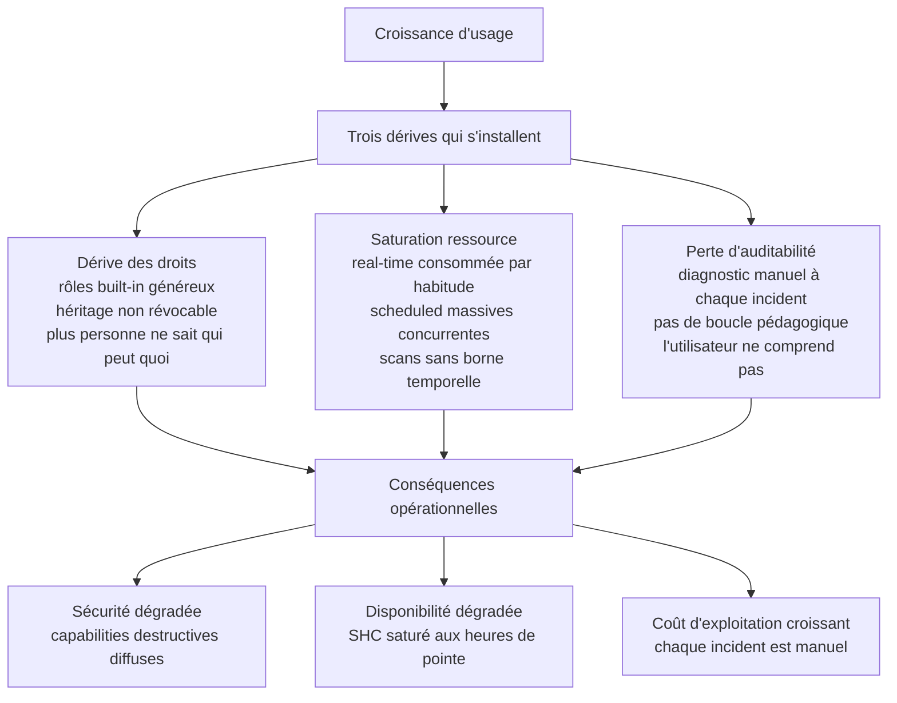
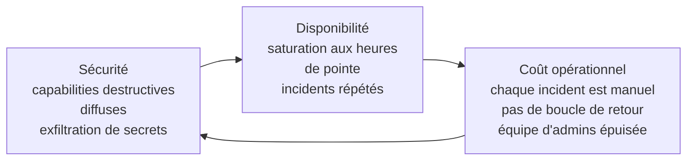

# Chapitre 1 — Pourquoi un projet de gouvernance des usages

> Une plateforme Splunk Enterprise de plusieurs centaines d'utilisateurs
> sur un Search Head Cluster (SHC) dédié à une grande direction n'est pas
> un produit qu'on installe et qu'on laisse vivre. C'est un écosystème
> vivant : chaque jour des utilisateurs lancent des recherches, des
> équipes ajoutent des saved searches, des opérateurs créent des comptes,
> le périmètre des données indexées s'étend. Sans gouvernance explicite
> des usages, trois dérives apparaissent — toujours les mêmes, dans le
> même ordre, sur toutes les plateformes Splunk d'une certaine taille.

## 1. Les trois dérives

### 1.1 Dérive des droits

Splunk livre des rôles built-in généreux par défaut. Le rôle `power`
autorise les recherches real-time et la création de scheduled, le rôle
`user` reçoit nativement des capabilities qui permettent de planifier une
recherche en arrière-plan, et certains rôles administratifs cumulent des
capabilities destructives qui n'ont rien à faire entre les mains d'un
opérateur quotidien.

À cela s'ajoute le mécanisme d'héritage `importRoles` : un rôle peut en
importer un autre, et toutes les capabilities du parent sont alors
héritées **sans possibilité de révocation chirurgicale au niveau de
l'enfant**. Au bout de quelques années, plus personne ne sait
précisément qui peut faire quoi, ni pourquoi tel compte hérite de telle
capability.

Les symptômes typiques :

- des rôles dont la liste de capabilities effectives a doublé en deux
  ans sans qu'aucun commit ne le justifie ;
- des `srchFilter=*` qui annulent silencieusement les filtres restrictifs
  d'autres rôles ;
- des comptes inactifs depuis dix-huit mois qui portent toujours `admin` ;
- des ACL d'app `sharing=global` avec `perms.read=*` qui exposent des
  données métier ;
- aucune traçabilité de qui a ajouté quoi à qui à quelle date.

### 1.2 Saturation des ressources

Une recherche real-time tient un slot processeur en permanence. Une
recherche sans borne temporelle scanne plusieurs années d'historique et
pèse sur les indexers mutualisés avec d'autres SHC. Une vague de
scheduled mal espacées peut saturer la minute pile. Une accélération de
data model mal dimensionnée évince les recherches ad hoc des analystes.

Le SHC commence à devenir lent à certaines heures, puis à manquer de
mémoire, puis à devoir être redémarré en urgence. Le levier classique —
augmenter le quota par rôle — ne fonctionne pas parce que les quotas se
composent au runtime en prenant le **maximum** entre les rôles d'un
utilisateur, ce qui rend la couche fragile par construction. Un
utilisateur qui cumule un rôle « consultatif » à quota bas et un rôle
« owner » à quota élevé reçoit le quota élevé.

### 1.3 Perte d'auditabilité

Quand quelque chose casse, quand un utilisateur se plaint qu'il n'a pas
accès à un index ou qu'une recherche ne donne aucun résultat,
l'administrateur SHC doit reconstituer la chaîne droit ↔ rôle ↔ groupe
↔ identité. Si la plateforme n'a pas de modèle d'habilitation cohérent,
ce travail est manuel à chaque incident et n'aboutit pas à une décision
durable.

La pédagogie ne s'installe pas non plus : l'utilisateur ne comprend pas
pourquoi sa recherche pèse sur la plateforme, et continue donc à la
lancer telle quelle.

## 2. Pourquoi les défauts Splunk ne suffisent pas

Les paramètres natifs d'une installation Splunk fraîche sont conçus pour
**fonctionner immédiatement**, pas pour résister à l'usure d'une
plateforme à mille utilisateurs. Quatre limites du défaut méritent d'être
explicitées.

**Premièrement, le rôle `power` est dangereux par construction.** En
9.4.6, sur une installation propre, `power` importe nativement `user` et
porte directement `rtsearch`, `schedule_search`, `schedule_rtsearch`,
`accelerate_search`, `embed_report` et `rest_properties_set`. Six
capabilities à fort impact stabilité et sécurité, attribuées par défaut à
un rôle qui se présente comme « utilisateur avec un peu plus de droits ».
Attribuer `power` à un utilisateur final, c'est lui donner les clés du
camion sans qu'il le sache.

**Deuxièmement, les quotas par défaut sont silencieux et bas.** La stanza
`[default]` de `authorize.conf` 9.4 porte `srchJobsQuota=3`,
`srchDiskQuota=100` (MB), `srchTimeWin=-1` (illimité). Un utilisateur
sans quota explicitement déclaré dans son rôle final retombe sur ce
défaut. Trois jobs concurrents, c'est trop bas pour un analyste sérieux
et trop haut pour le contrôle de plateforme — et personne ne le sait.

**Troisièmement, le modèle est implicitement opaque.** Sans gouvernance,
chaque équipe métier porte un rôle « rôle = équipe métier, avec tout
dedans ». On rajoute une capability, un index, une ACL pour un cas
d'usage ; on ne retire plus rien (parce que l'héritage l'empêche). Au
bout de deux ans, plus personne ne sait pourquoi le rôle métier porte
`rtsearch`.

**Quatrièmement, la documentation Splunk décrit des comportements qui
divergent du binaire 9.4.6 réel.** Plusieurs comportements documentés ne
se reproduisent pas en pratique : l'héritage des quotas via `importRoles`
n'a pas d'effet d'enforcement alors qu'il apparaît dans la sortie REST ;
la valeur d'action WLM `display_message` est documentée mais rejetée par
splunkd ; une ACL d'app avec `write` sans `read` rend l'objet invisible
alors que la doc indique « read OU write ». Le chapitre 4 documente
chacun de ces écarts. Une gouvernance sérieuse les anticipe.

## 3. La pile d'enjeux

Quand une plateforme Splunk dérive sur les trois axes ci-dessus, les
**conséquences opérationnelles** se manifestent à trois niveaux qui
s'aggravent l'un l'autre.

Au niveau **sécurité**, les capabilities destructives diffuses
permettent à des comptes opérateurs d'exfiltrer des secrets via
`list_storage_passwords`, de supprimer des événements indexés via
`delete_by_keyword`, ou de pivoter via `edit_user` / `edit_roles` /
`change_authentication`.

Au niveau **disponibilité**, les recherches real-time non bornées et les
scans sans borne temporelle saturent le SHC et les indexers mutualisés.
Chaque incident dégrade la confiance des utilisateurs et alimente le
contournement (« je relance, peut-être que ça passera »), ce qui aggrave
la saturation.

Au niveau **coût opérationnel**, le diagnostic est manuel à chaque
incident. Sans modèle d'habilitation lisible, l'administrateur SHC ne
peut pas répondre rapidement à « pourquoi cet utilisateur n'a-t-il pas
accès à cet index ? ». Sans boucle de retour à l'utilisateur, le même
comportement à risque se reproduit. L'équipe d'admins s'épuise sur des
sujets répétitifs.

## 4. Pourquoi traiter les trois dérives ensemble

Une réaction naturelle consiste à traiter chaque dérive séparément :
durcir les droits aujourd'hui, mettre en place Workload Management
demain, faire de la sensibilisation après. C'est rarement efficace. Les
trois dérives sont **couplées** :

- Sans modèle de rôles stable, on ne peut pas écrire de règles WLM qui
  ciblent un rôle (« plafonner les real-time pour les rôles métier non
  autorisés »).
- Sans recherches d'audit, on ne sait pas quels comportements alimenter
  dans la boucle pédagogique.
- Sans modèle d'habilitation et sans Workload Management, la
  sensibilisation se résume à demander gentiment aux utilisateurs de
  faire mieux — sans levier opérationnel pour confirmer le message.

C'est pourquoi le projet propose un **traitement coordonné en quatre
axes** (chapitre 3) — pas une suite de chantiers indépendants.

## 5. Quand savoir qu'il est temps d'agir

Quelques signaux qui indiquent qu'un projet de gouvernance s'impose :

- une recherche `| rest /services/authorization/roles` montre plus de
  vingt rôles, dont une dizaine sans documentation de leur raison d'être ;
- des `srchIndexesAllowed=*` sont visibles sur plusieurs rôles métier ;
- la mémoire d'un Search Head dépasse régulièrement 80 % aux heures de
  pointe sans qu'un incident d'ingestion ne soit en cours ;
- les administrateurs reçoivent plus de cinq tickets par semaine sur
  des problèmes d'accès, de quotas ou de performance dont la résolution
  prend plus de trente minutes à chaque fois ;
- la migration vers un nouvel IdP (SAML) est planifiée et personne ne
  sait comment les rôles Splunk vont être attribués ;
- un audit interne demande de prouver « qui a quels droits et pourquoi »
  sans qu'une réponse documentée existe.

Si trois de ces signaux sont présents, le projet de gouvernance n'est
plus optionnel. Le chapitre 2 décrit la méthode pour le mener à bien.

## Sources

- [Splunk Securing 9.4 — Roles and capabilities](https://help.splunk.com/en/splunk-enterprise/administer/secure-splunk-enterprise/9.4/define-roles-on-the-splunk-platform/about-defining-roles-with-capabilities)
- [Splunk Admin 9.4 — About workload management](https://help.splunk.com/en/splunk-enterprise/administer/manage-workloads/9.4/workload-management-overview/about-workload-management)
- [Splunk Lantern — limit features that can impact platform performance](https://lantern.splunk.com/)
