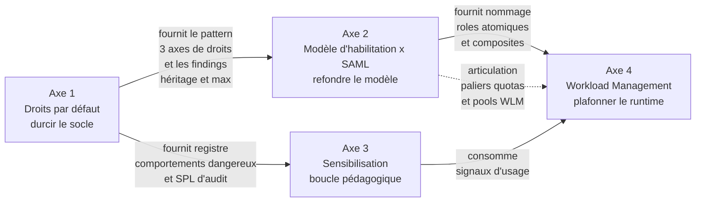

# Chapitre 3 — Les quatre axes structurants

> Le projet de gouvernance s'articule autour de quatre axes coordonnés
> qui se renforcent mutuellement. Ce chapitre présente chacun, montre
> leur articulation et justifie l'ordre dans lequel les déployer.

## 1. Vue d'ensemble

Les quatre axes répondent chacun à une question opérationnelle
distincte. Ils ne sont pas des silos — ils se composent.

| Axe | Question répondue | Mécanique principale |
| --- | --- | --- |
| **1. Droits par défaut** | Qu'est-ce qui est dangereux dans la configuration native, comment l'auditer, comment le durcir ? | Revue des rôles built-in, retrait de capabilities, redéclaration des quotas |
| **2. Modèle d'habilitation** | Comment structurer les rôles pour qu'ils soient lisibles, composables, attribuables automatiquement via SAML ? | Hybride atomiques / composites, paliers de quotas, mapping SAML |
| **3. Sensibilisation** | Comment expliquer à l'utilisateur ce qu'il fait mal sans bloquer son travail ? | Recherches d'audit, notifications pédagogiques, KPI |
| **4. Workload Management** | Comment plafonner la ressource consommée par chaque recherche et arbitrer la priorité face à la pression ? | Pools, admission rules, workload rules, cgroups |

## 2. Axe 1 — Droits par défaut

L'axe 1 **durcit le socle**. Il identifie les capabilities à risque
(réelles ou par habitude) sur les rôles intégrés, redéclare proprement
les quotas par rôle, restructure les rôles `user` et `power` pour
qu'ils ne diffusent plus de capabilités au-delà de leur usage métier,
et pose une base d'auditabilité.

### Ce qu'on découvre dans cet axe

- Les rôles `user` et `power` portent des capabilities sensibles par
  défaut : `rtsearch`, `schedule_search`, `accelerate_search`,
  `accelerate_datamodel`, `embed_report` et plusieurs autres.
- L'héritage `importRoles` est **purement additif** : une capability
  héritée ne peut pas être révoquée dans le rôle enfant.
- Les quotas `srchJobsQuota` et apparentés **ne sont pas hérités** au
  sens enforcement — l'effectif est la valeur locale du rôle final, ou
  le défaut système (3 jobs) si rien n'est déclaré.
- Au runtime, un utilisateur multi-rôles reçoit le **`max()`** des
  quotas, jamais le min.
- L'API REST permet de **casser silencieusement** la plateforme : POST
  partiel sur un rôle est un SET destructif, DELETE d'un rôle built-in
  est autorisé sans confirmation et casse `admin` par cascade.

### Ce qu'on livre dans cet axe

- Un **registre des comportements dangereux** classifiés par criticité
  (typiquement 20 à 25 comportements).
- Une **batterie de recherches SPL d'audit** prêtes à l'emploi (une
  douzaine de SPL au minimum) pour cartographier l'existant.
- Un **plan d'action** ordonné en phases : audit, quick wins, refonte
  des rôles, quotas explicites, monitoring.
- Des **garde-fous opérationnels** pour la modification de rôle via
  REST (pattern GET → merge → POST complet, snapshot préalable,
  migration en deux temps).

Le détail est dans le **chapitre 5** (guide RBAC).

## 3. Axe 2 — Modèle d'habilitation x SAML

L'axe 2 **refonde le modèle**. Il définit une matrice de rôles
atomiques à responsabilité unique qu'on combine en rôles composites
métier via le mécanisme natif Splunk d'`importRoles`. Il définit aussi
comment le provisioning SAML s'articule avec ces rôles.

### Le pattern à trois axes orthogonaux

Le modèle de référence répartit la responsabilité sur trois axes
orthogonaux :

- `data_<perim>` : accès aux index (1 rôle = 1 périmètre de données).
- `feature_<cap>` : capabilities Splunk (1 rôle = 1 capacité
  fonctionnelle, par exemple `feature_scheduler` pour `schedule_search`).
- `app_<prod>` : accès aux knowledge objects d'une production
  applicative via les ACL.

Un rôle composite métier (`metier_<profil>_<perim>`, `owner_app_<prod>`,
`admin_iam`, `admin_ops`) **n'a aucune capability propre** : il
`importRoles` les atomiques nécessaires, **redéclare ses quotas
localement** au palier souhaité (`base`/`plus`/`max`), et c'est tout.

### Le provisioning SAML hybride

L'attribution des rôles passe par deux mécanismes combinables :

- **Auto-mapping** (`enableAutoMappedRoles=true`) : un groupe IdP dont
  le nom est exactement égal à un rôle Splunk déclenche l'attribution.
  Pratique pour les rôles métier de gros volume.
- **Mapping explicite** (`roleMap_<authSettings>`) : table de
  correspondance maintenue à la main. Obligatoire pour les rôles
  administratifs sensibles, qu'on exclut de l'auto-mapping via
  `excludedAutoMappedRoles`.

Un **rôle plancher** (`role_floor`) est attribué à tous les utilisateurs
authentifiés via un groupe IdP « all-users » mappé explicitement.

### Le cycle de vie des comptes

Le projet recommande une politique à deux temps alignée sur les
références IAM (NIST SP 800-63B, Microsoft Entra, Okta) :

- **Désactivation** d'un compte après 90 jours d'inactivité (retrait de
  tous les rôles sauf un `role_disabled` minimal).
- **Hard delete** après 90 jours supplémentaires de quarantaine, avec
  traitement des knowledge objects orphelins (privés supprimés,
  partagés réassignés à un compte de service ou à un admin délégué).

Le détail est dans le **chapitre 5** (guide RBAC).

## 4. Axe 3 — Sensibilisation et surveillance pédagogique

L'axe 3 **introduit la boucle pédagogique**. Il transforme les
comportements à risque détectés par les recherches d'audit en deux
flux : un flux SOC pour les comportements critiques (suppression
destructive, exfiltration), et un flux pédagogique pour les
comportements à risque (filtre annulé, real-time non justifiée, scan
sans borne temporelle).

L'utilisateur reçoit l'observation, l'explication courte du risque et
l'alternative recommandée, **sans que sa recherche soit bloquée**.

### Trois canaux qui se combinent

- **Splunk Web Messages** (notification native dans l'UI) — pilier
  faible friction.
- **Email digest** (récapitulatif hebdomadaire des comportements
  observés sur la semaine pour un utilisateur).
- **Ticket SOC** (pour les comportements critiques uniquement —
  suppression d'événements, exfiltration de secrets).

### Anti-fatigue d'alerte

Un dispositif de **déduplication** sur fenêtre glissante (typiquement
sept jours) sur le couple `(behavior, role)` ou `(behavior, user)`
évite que l'utilisateur ne reçoive le même message trois fois par jour.
La déduplication est par **rôle** (le comportement collectif), pas par
événement brut.

### Cinq KPI mesurables

- **K1** — taux de récidive (un utilisateur qui répète le même
  comportement à plus de 30 jours).
- **K2** — temps de correction (le délai moyen entre la notification et
  l'arrêt observable du comportement chez l'utilisateur).
- **K3** — nombre d'occurrences par comportement et par semaine
  (tendance plateforme).
- **K4** — couverture (le pourcentage de comportements 🟠 effectivement
  routés vers un canal pédagogique).
- **K5** — taux d'ouverture (proxy mesuré par canal natif Splunk Web
  Messages quand disponible).

### Le pilote

Le déploiement de la sensibilisation se fait sur une **production
applicative pilote** choisie selon cinq critères :

- une concentration mesurable de comportements à risque à la baseline ;
- une équipe applicative volontaire avec un owner d'app engagé ;
- un effectif intermédiaire de cinquante à cent cinquante utilisateurs ;
- une criticité métier moyenne (éviter en pilote une production
  sensible où un faux nudge pédagogique serait mal perçu) ;
- un outillage observable (saved searches et alertes maintenues).

Le détail de l'axe 3 est traité **transversalement** dans les
chapitres 5 (recherches d'audit) et 6 (recherches WLM), avec le
référentiel des comportements consolidé dans le **chapitre 8**.

## 5. Axe 4 — Workload Management

L'axe 4 **plafonne au runtime** ce que les couches précédentes ne
savent pas plafonner.

Les quotas par rôle plafonnent le **nombre de recherches** qu'un
utilisateur peut lancer. WLM plafonne les **ressources processeur et
mémoire** qu'une recherche en cours peut consommer, et arbitre la
**priorité** face à la pression instantanée.

### La pile à trois couches

| Couche | Question répondue | Mécanisme |
| --- | --- | --- |
| **0 — Capabilities** | Qui a le droit de faire quoi ? | `authorize.conf`, ACL d'apps/objets |
| **1 — Quotas par rôle** | Combien de jobs concurrents un user peut-il lancer ? | `srchJobsQuota`, `rtSrchJobsQuota`, `srchDiskQuota`, redéclarés localement |
| **2 — Workload Management** | Combien de ressources CPU/mémoire un job en cours peut-il consommer ? | `workload_pools.conf`, `workload_rules.conf` |

La couche 2 ne remplace pas la couche 1 — elle la complète. La
fragilité par construction de la couche 1 (effet `max()` multi-rôles)
est précisément ce que la couche 2 vient compenser : WLM ne raisonne
pas sur le nombre de jobs déclarés à la création d'un rôle, mais sur
la **ressource réellement consommée** par une recherche en cours.

### Cinq pools dans la catégorie `search`

Le pattern recommandé pour un SHC sert mille utilisateurs :

| Pool | `cpu_weight` | `mem_weight` | Vocation |
| --- | --- | --- | --- |
| `admin` | 15 | 15 | Réservé aux rôles admin pour qu'un incident n'empêche pas le diagnostic |
| `scheduled` | 30 | 30 | Recherches planifiées (saved searches, alertes) |
| `ad_hoc` | 35 | 35 | Recherches interactives des utilisateurs (`default_category_pool=1`) |
| `bulk` | 10 | 10 | Recherches longues, exports, dashboards de production |
| `accel` | 10 | 10 | Accélérations (data model accélérées, summary indexing) |

À cela s'ajoutent **deux pools default obligatoires** (`ingest_default`
et `misc_default`) dans les catégories `ingest` et `misc` — sans eux,
splunkd refuse d'activer WLM (finding empirique E1, chapitre 4).

### Huit règles WLM priorisées

Les règles WLM combinent placement implicite (par rôle, par
`search_type`, etc.) et actions de monitoring (`abort`, `move`,
`alert`). L'ordre d'évaluation est strict et défini par
`[workload_rules_order]` en first-match wins.

Le détail des huit règles type, des chiffrages de pool et des findings
9.4.6 est dans le **chapitre 6** (WLM search heads) et le **chapitre 7**
(WLM indexers).

## 6. L'ordre de déploiement

L'ordre dans lequel déployer les axes n'est pas arbitraire. Trois
règles le contraignent.

### Règle 1 — Axe 1 avant axe 2

La matrice de rôles atomiques de l'axe 2 s'appuie sur des décisions de
durcissement prises à l'axe 1 (retrait de `rtsearch` de `power`,
redéclaration des quotas, etc.). Sans ces décisions, on construit le
nouveau modèle sur un socle instable.

### Règle 2 — Axe 2 avant axe 4

Les règles WLM ciblent des **rôles** : « plafonner les real-time pour
les rôles qui ne sont pas dans `rt_authorized_*` », « protéger le pool
admin pour `role=admin_iam` ». Sans nommage stable de rôles, ces
règles sont fragiles ; les déployer avant la refonte RBAC, c'est se
condamner à les réécrire deux fois.

Une raison secondaire : les quotas par rôle sont la couche 1 dont WLM
est la couche 2. Appliquer WLM avant que les quotas soient redéclarés
rendrait l'interprétation des incidents ambiguë (saturation du quota
ou pool sous-dimensionné ?).

### Règle 3 — Axe 3 en parallèle des axes 1 et 2

L'axe 3 peut se déployer en parallèle des axes 1 et 2 — il **consomme**
leurs livrables (les recherches d'audit de l'axe 1, le modèle de rôles
de l'axe 2) mais ne les bloque pas.

Le pilote de sensibilisation peut démarrer dès que l'axe 1 a livré la
batterie de recherches d'audit et que l'axe 2 a livré son cadrage.

### Pour les indexers : monitor-only d'abord

Sur le volet indexers (chapitre 7), le projet tranche aussi :
**commencer par les indexers en monitor-only avant le search head**.
La régulation par les search heads seuls ne suffit pas — la pression
d'ingestion sur les indexers est portée par d'autres SHC mutualisés,
et un pool indexer mal calibré peut absorber la marge du SHC qu'on
gouverne.

## 7. Articulation entre axes — les jonctions explicites

Ce qui distingue cette approche d'une simple liste de bonnes pratiques,
c'est qu'à chaque jonction entre deux axes, l'articulation est
explicitée :

- À **quel endroit** l'axe 2 redéclare les quotas que l'axe 1 dit
  non-hérités (chaque composite porte ses quotas locaux, jamais les
  atomiques).
- **Comment** les paliers de quotas chiffrés de l'axe 2 se composent
  avec les parts de processeur des pools de l'axe 4 (un utilisateur
  `consultatif` à `quota_base=5` qui tombe dans le pool `ad_hoc=35%`
  consomme jusqu'à cinq jobs concurrents, chacun plafonné à sa part
  du pool).
- À **quel moment** du flot un utilisateur déclenche une alerte SOC ou
  un nudge pédagogique (selon la criticité du comportement détecté par
  les SPL d'audit).

Ces articulations évitent qu'une décision d'un axe ne soit invalidée
par une autre au déploiement.

## 8. Ce que cet axe ne couvre pas

Le projet de gouvernance des usages ne se substitue pas à :

- la **conception** d'un SHC (Splunk Validated Architectures, sizing
  CPU/RAM/storage, distribution sites/peers) ;
- la **gestion des données** (rétention, summary indexing, data
  models — sauf en tant que consommateurs de droits) ;
- la **sécurité du système hôte** (durcissement OS, chiffrement,
  rotation des certificats) ;
- l'**ingestion** (forwarders, parsing, normalisation CIM).

Ces sujets sont traités par leurs propres projets et leurs propres
documentations.

## Sources

- [Splunk Securing 9.4 — Roles and capabilities](https://help.splunk.com/en/splunk-enterprise/administer/secure-splunk-enterprise/9.4/define-roles-on-the-splunk-platform/about-defining-roles-with-capabilities)
- [Splunk Admin 9.4 — Workload management overview](https://help.splunk.com/en/splunk-enterprise/administer/manage-workloads/9.4/workload-management-overview)
- [Splunk Admin 9.4 — SAML SSO](https://help.splunk.com/en/splunk-enterprise/administer/manage-users-and-security/9.4/use-saml-as-an-authentication-scheme-for-single-sign-on)
- [Splunk Lantern — practitioner-oriented best practices](https://lantern.splunk.com/)
