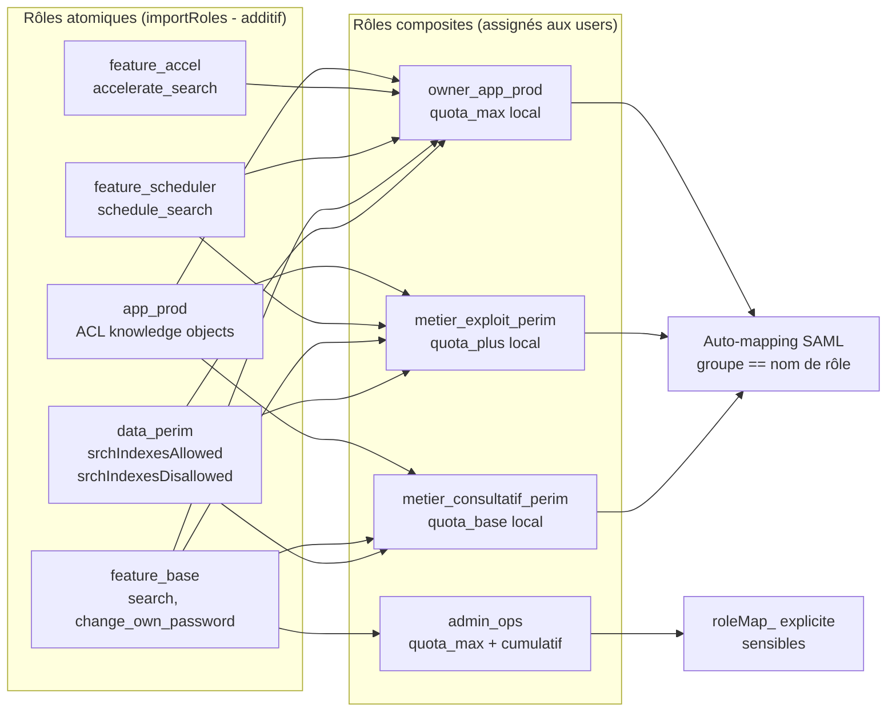
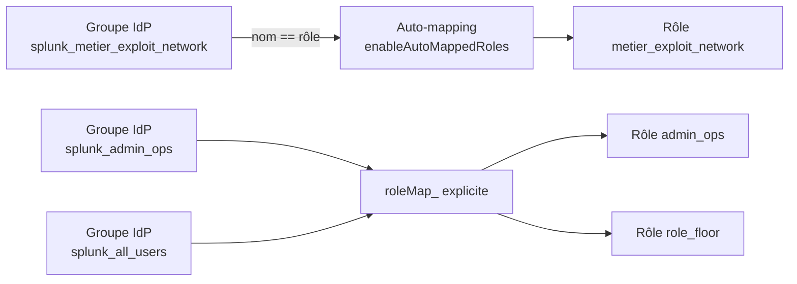

# Chapitre 5 — Guide RBAC : audit, conception, déploiement

> Ce chapitre est le guide opérationnel complet du volet habilitation.
> Il couvre l'audit pré-refonte d'un SHC existant, la conception du
> modèle hybride atomiques/composites, l'articulation avec SAML, le
> déploiement progressif avec ses gates, et la surveillance permanente
> en croisière.

## 1. Cadrage rapide — modèle mental

### Le rôle Splunk

Un rôle Splunk (`[role_<name>]` dans `authorize.conf`) porte cinq
familles d'attributs :

- **Capabilities** : la liste des permissions atomiques (`search`,
  `schedule_search`, `rtsearch`, `edit_user`, `admin_all_objects`,
  etc.). Une centaine de capabilities existent en 9.4 ; **une quinzaine
  sont sensibles** et concentrent l'enjeu de gouvernance.
- **Accès aux index** : `srchIndexesAllowed` (liste blanche),
  `srchIndexesDisallowed` (liste noire, précédence absolue),
  `srchIndexesDefault` (les index par défaut sans `index=` explicite).
- **Filtre de recherche** : `srchFilter`, fragment SPL appliqué
  automatiquement à toutes les recherches du rôle.
- **Quotas** : `srchJobsQuota`, `rtSrchJobsQuota`, `srchDiskQuota`,
  `srchTimeWin`, plus les variantes cumulatives.
- **Héritage** : `importRoles` désigne une liste de rôles parents.

L'ACL d'app et de knowledge objects vit dans les **metadata** des
apps (`metadata/default.meta`, `metadata/local.meta`), pas dans
`authorize.conf`. C'est la deuxième couche de droit.

### Les quatre comportements 9.4.6 structurants

Quatre comportements changent la façon de lire et de concevoir le RBAC
— ils sont détaillés au chapitre 4 et rappelés ici.

1. **`importRoles` est purement additif** (F-RBAC-01) — une capability
   héritée ne se révoque pas.
2. **Les quotas ne sont pas hérités** (F-RBAC-02) — au runtime, l'effectif
   multi-rôles est le **`max()`**.
3. **`srchIndexesAllowed=*` ne couvre pas les internes** (F-RBAC-03) ;
   `srchIndexesDisallowed` prévaut et s'hérite (F-RBAC-04).
4. **ACL d'app `write` sans `read` invisible** (F-RBAC-07).

### Pourquoi un modèle hybride

Un modèle où chaque équipe métier porte un rôle composite **opaque**
dérive vite : on rajoute une capability, un index, une ACL pour un cas
d'usage ; on ne retire plus rien (F-RBAC-01). Au bout de deux ans, plus
personne ne sait pourquoi le rôle métier porte `rtsearch`.

Le modèle hybride répartit la responsabilité sur **trois axes
orthogonaux** :

- `data_<perim>` : accès aux index (1 rôle = 1 périmètre).
- `feature_<cap>` : capabilities Splunk (1 rôle = 1 capacité).
- `app_<prod>` : accès à une app via son ACL.

Un rôle composite (`metier_<profil>_<perim>`, `owner_app_<prod>`,
`admin_iam`/`admin_ops`) **n'a aucune capability propre** : il
`importRoles` les atomiques nécessaires, **redéclare ses quotas
localement** au palier souhaité, et c'est tout.

## 2. Audit pré-refonte

### Choisir la fenêtre

- **Inventaire des rôles, users, ACL** : instantané (REST en lecture
  seule, cinq minutes).
- **Usages utilisateurs** (`_audit action=search`) : minimum 7 jours
  ouvrés, idéal 30 jours.
- **Comptes inactifs** : fenêtre 90 jours (référence IAM).
- Exclure les périodes anormales (incident, gel de prod, migration
  récente).

### Collecter en cinq passes

| Passe | Question répondue | Recherches |
| --- | --- | --- |
| 1. Cartographie structurelle | Quels rôles, quelles chaînes d'héritage, quels rôles built-in modifiés ? | R.1.01, R.1.07, R.1.08 |
| 2. Capabilities sensibles | Quelles capabilities à risque attribuées à qui ? | R.1.02 |
| 3. Users et usages | Qui possède quoi, qui utilise quoi ? | R.1.03, R.1.04, R.1.09 |
| 4. Index et ACL | Quels index autorisés, quelles ACL permissives ? | R.1.05, R.1.06 |
| 5. Scoring et priorisation | Quels rôles refonder en priorité ? | R.1.10 |

### R.1.01 — Inventaire des rôles avec `importRoles` et capabilities

**Objectif.** Produire la table source de tout audit RBAC : un rôle =
une ligne, avec son nombre de capabilities locales, héritées et son
nombre de parents.

```spl
| rest /services/authorization/roles splunk_server=local
| eval nb_caps_locales = mvcount(capabilities)
| eval nb_caps_heritees = mvcount(imported_capabilities)
| eval nb_parents = mvcount(imported_roles)
| table title imported_roles nb_caps_locales nb_caps_heritees nb_parents
| sort title
```

**Interprétation.** Un composite métier doit avoir `nb_caps_locales`
vide (les composites n'ont aucune capability propre). Un rôle avec
`nb_parents=0` et beaucoup de `nb_caps_locales` est un atomique ou un
legacy. Un composite avec `nb_caps_locales>0` est une dérive à corriger.

### R.1.02 — Top capabilities à risque par rôle

```spl
| rest /services/authorization/roles splunk_server=local
| eval all_caps = mvappend(capabilities, imported_capabilities)
| mvexpand all_caps
| search all_caps IN (
    "rtsearch","schedule_search","schedule_rtsearch",
    "accelerate_search","accelerate_datamodel","embed_report",
    "delete_by_keyword","list_storage_passwords","edit_storage_passwords",
    "edit_user","edit_roles","change_authentication","admin_all_objects",
    "rest_properties_set","install_apps","restart_splunkd")
| stats values(all_caps) as caps_a_risque count by title
| sort -count title
```

**Interprétation.** Tout rôle hors `admin` portant plus de trois
capabilities à risque est candidat à dégroupement en atomiques
`feature_*`. Le constat « `power` porte six capabilities à risque par
défaut » est le point d'entrée du quick win de durcissement.

### R.1.03 — Inventaire des users avec rôles directs

```spl
| rest /services/authentication/users splunk_server=local
| eval nb_roles = mvcount(roles)
| table title realname roles nb_roles type
| sort -nb_roles title
```

**Interprétation.** Un utilisateur avec plus de deux rôles directs est
probablement à reconcevoir comme un seul composite. Les comptes
`type=Splunk` (locaux) sont à examiner pour migration ou
légitimité (compte de service).

### R.1.04 — Usage réel : recherches par utilisateur, 30 jours

```spl
search index=_audit action=search info=granted earliest=-30d
| stats count as nb_searches
        dc(eval(coalesce(search_id, sid))) as nb_jobs
        values(roles_list) as roles_observed
        by user
| sort -nb_searches
```

**Interprétation.** Croise droits théoriques (R.1.03) et usage réel.
Un utilisateur avec un rôle riche et `nb_searches=0` sur 30 jours est
candidat à dégradation. Un utilisateur avec un usage intense
(`nb_searches > 1000/jour`) est candidat à un palier de quotas
supérieur.

### R.1.05 — Index réellement consultés vs autorisés par rôle

```spl
search index=_audit action=search info=granted earliest=-7d
| rex max_match=10 "search_index_list=\"(?<idx>[^\"]+)\""
| stats values(idx) as idx_observed by user
| join type=left user [
    | rest /services/authentication/users splunk_server=local
    | rename title as user
    | fields user roles]
| table user roles idx_observed
```

**Interprétation.** Si `idx_observed` est borné à un sous-ensemble
des index autorisés par les rôles de l'utilisateur, le périmètre
`data_*` peut être resserré. Si les utilisateurs d'un même rôle ont
des `idx_observed` qui se ressemblent, le pattern naturel d'un
atomique `data_<perim>` se dessine.

### R.1.06 — ACL d'apps et de knowledge objects permissives

```spl
| rest /servicesNS/-/-/saved/searches splunk_server=local
| rename "eai:acl.owner" as owner "eai:acl.sharing" as sharing
        "eai:acl.perms.read" as perms_read
        "eai:acl.perms.write" as perms_write
        "eai:acl.app" as app
| where sharing="global" OR mvfind(perms_read, "*")>=0
| table app title owner sharing perms_read perms_write
| sort app title
```

**Interprétation.** Toute ligne avec `sharing=global` et `perms_read=*`
est une fuite de visibilité. Toute saved search dont l'`owner` est un
utilisateur disabled ou supprimé est orpheline à traiter (réassigner à
un compte de service ou supprimer si privée).

### R.1.07 — Built-in modifiés

```spl
| rest /services/authorization/roles splunk_server=local
| where title IN ("admin","power","user","can_delete")
| eval is_modified = if(
    title="admin" AND mvcount(capabilities)!=<DEFAULT_ADMIN_CAPS>,"oui",
    title="power" AND mvcount(capabilities)!=<DEFAULT_POWER_CAPS>,"oui",
    title="user"  AND mvcount(capabilities)!=<DEFAULT_USER_CAPS>,"oui",
    true(), "non")
| table title capabilities imported_roles srchIndexesAllowed srchFilter is_modified
```

**Interprétation.** Sur Splunk 9.4.6 propre, `admin.imported_roles =
['power','user']` et `power.imported_roles = ['user']`. Toute
divergence indique un override local à investiguer.

### R.1.08 — Quotas effectifs par rôle (déclaration locale)

```spl
| rest /services/authorization/roles splunk_server=local
| table title srchJobsQuota rtSrchJobsQuota srchDiskQuota srchTimeWin
        cumulativeSrchJobsQuota cumulativeRTSrchJobsQuota
        imported_srchJobsQuota imported_rtSrchJobsQuota
| sort title
```

**Interprétation rappelée du chapitre 4 (F-RBAC-02).** Les colonnes
`imported_*` sont **purement informationnelles**. La valeur réellement
appliquée à un utilisateur est la valeur **locale** de son rôle
directement assigné, ou le défaut système (3 jobs) si aucune valeur
locale. Au runtime multi-rôles, l'effectif est `max()`.

### R.1.09 — Comptes locaux survivant à une bascule SAML

```spl
| rest /services/authentication/users splunk_server=local
| where type="Splunk"
| join type=left title [
    search index=_audit action=login info=succeeded earliest=-90d
    | stats latest(_time) as last_t by user
    | rename user as title]
| eval inactive_days = round((now() - last_t) / 86400, 0)
| where inactive_days > 90 OR isnull(last_t)
| table title realname roles inactive_days
| sort -inactive_days
```

**Interprétation.** Comptes locaux candidats à purge (cycle de vie
SAML — §5 ci-dessous) ou à isoler comme comptes techniques.

### R.1.10 — Score de risque par rôle

```spl
| rest /services/authorization/roles splunk_server=local
| eval all_caps = mvappend(capabilities, imported_capabilities)
| eval nb_caps_risque = mvcount(mvfilter(match(all_caps,
    "rtsearch|schedule_search|schedule_rtsearch|accelerate_|embed_report|delete_by_keyword|list_storage_passwords|edit_user|edit_roles|change_authentication|admin_all_objects|install_apps|restart_splunkd")))
| eval is_srchFilter_star = if(srchFilter="*", 1, 0)
| eval score = 3*nb_caps_risque + 2*is_srchFilter_star
| where score > 0
| table title nb_caps_risque is_srchFilter_star score
| sort -score
```

**Interprétation.** Score > 30 : refonte prioritaire. 10 < Score ≤ 30 :
deuxième vague, en parallèle des composites cibles. Score ≤ 10 : laisser
en place tant que le composite cible n'est pas en route.

## 3. Pattern de conception cible

### Schéma du modèle hybride



### Les trois axes orthogonaux

| Axe | Préfixe | Porte | Ne porte pas |
| --- | --- | --- | --- |
| **Données** | `data_<perim>` | `srchIndexesAllowed`, `srchIndexesDisallowed`, `srchFilter` | pas de capabilities, pas de quotas, pas d'ACL d'app |
| **Capacités** | `feature_<cap>` | une ou peu de capability(ies) Splunk | pas d'index, pas de quotas, pas d'ACL d'app |
| **Applications** | `app_<prod>` | accès à une app via ACL des knowledge objects (metadata) | pas dans `authorize.conf`, pas d'index, pas de capabilities |

### Les paliers de quotas chiffrés

| Paramètre | `quota_base` | `quota_plus` | `quota_max` |
| --- | --- | --- | --- |
| `srchJobsQuota` | 5 | 15 | 30 |
| `srchDiskQuota` (MB) | 500 | 2 000 | 5 000 |
| `srchTimeWin` (s) | 86 400 (1 j) | 604 800 (7 j) | 2 592 000 (30 j) |
| `rtSrchJobsQuota` | 0 (pas de RT) | 2 | 6 |
| `cumulativeSrchJobsQuota` | 0 (off) | 0 (off) | 0 ou 200 (admin) |

> Ces paliers sont l'état de l'art pour un SHC de l'ordre de mille
> utilisateurs. **À adapter au contexte** — calibrer sur la baseline
> d'usage réelle mesurée sur deux à quatre semaines (concurrence ad
> hoc, durée moyenne d'une recherche).

### Distribution attendue

Quatre profils types couvrent la grande majorité des usages.

| Profil | Composition typique | Palier | Volume attendu |
| --- | --- | --- | --- |
| **Consultatif** (lecture seule) | `data_<perim>` + `feature_base` + `app_<prod>` (read) | `quota_base` | ~70 % |
| **Power utilisateur** (planifie) | `data_<perim>` + `feature_base` + `feature_scheduler` + `app_<prod>` | `quota_plus` | ~20 % |
| **Owner applicatif** (écrit) | `data_<perim>` + `feature_base` + `feature_scheduler` + `app_<prod>` (read+rw) | `quota_max` | ~5 % |
| **Admin délégué** | `feature_base` + `feature_iam`/`feature_ops` | `quota_max` + cumulatif | ~1 % |

### Exemple de configuration

```ini
# Atomiques (jamais assignés directement aux users)

[role_data_network]
srchIndexesAllowed = idx_network;idx_network_*
srchIndexesDisallowed = _audit

[role_feature_base]
capabilities = search;change_own_password;rest_apps_view

[role_feature_scheduler]
capabilities = schedule_search

[role_app_network]
# ACL configurée dans metadata des apps, pas ici
# Ce rôle existe pour être référencé par perms.read / perms.write

[role_quota_plus]
# Atomique de palier - ne sera PAS appliqué via importRoles
# (les quotas ne sont pas hérités, F-RBAC-02)
# Existe pour documenter le palier ; la valeur est redéclarée
# dans chaque composite qui prétend au palier.
srchJobsQuota = 15

# Composite (assigné aux users via SAML)

[role_metier_exploit_network]
importRoles = data_network;feature_base;feature_scheduler;app_network

# Quotas REDÉCLARÉS LOCALEMENT (non hérités)
srchJobsQuota = 15
srchDiskQuota = 2000
srchTimeWin = 604800
rtSrchJobsQuota = 2
```

## 4. Articulation SAML

### Mécanique hybride

```ini
[saml]
authSettings = my_saml_provider
enableAutoMappedRoles = true
excludedAutoMappedRoles = admin;admin_iam;admin_ops
defaultRolesIfMissing = role_no_access

[my_saml_provider]
# Mapping explicite pour les rôles sensibles et le plancher
roleMap_my_saml_provider = admin_iam:splunk_admin_iam;admin_ops:splunk_admin_ops;role_floor:splunk_all_users
```

### Schéma d'attribution



### Garde-fous (rappel chapitre 4)

- **`excludedAutoMappedRoles=admin;admin_iam;admin_ops`** : exclure les
  rôles puissants de l'auto-mapping (F-SAML-02).
- **`defaultRolesIfMissing=role_no_access`** : si aucun rôle n'est
  mappé, basculer sur un rôle minimal. **Jamais `admin`** (F-SAML-01).
- **Wildcard sur les groupes : impossible** (F-SAML-03). Le rôle
  plancher passe par un groupe IdP « all-users » mappé explicitement.

### Cycle de vie des comptes

Politique à deux temps alignée sur les références IAM (NIST SP 800-63B,
Microsoft Entra ID, Okta).

| Étape | Déclencheur | Action | Délai |
| --- | --- | --- | --- |
| **Désactivation** | Compte SAML sans connexion réussie depuis 90 j | POST `/services/authentication/users/<u>` — retrait de tous les rôles sauf `role_disabled` (capabilities vides, aucun index). Compte conservé, ACL d'objets intacte, login impossible. | 90 j d'inactivité |
| **Hard delete** | Compte désactivé depuis 90 j supplémentaires sans réactivation | Traitement des knowledge objects orphelins (privés supprimés, partagés app réassignés à `svc_<prod>`, partagés global réassignés à `admin_ops` + alerte SOC), puis `DELETE /services/authentication/users/<u>` | 180 j total |

## 5. Déploiement progressif — sept phases

### Phase 0 — Audit (1 à 5 jours)

Exécuter R.1.01 à R.1.10. Produire :

- rapport d'audit (matrice rôles × capabilities à risque × score) ;
- liste des comptes locaux candidats à purge ou à isoler comme techniques ;
- inventaire des productions applicatives × profils types.

Critère de gate : le rapport est revu et validé par l'équipe
sponsor.

### Phase 1 — Atomiques posés à côté du legacy (1 à 2 semaines)

Déployer les atomiques `data_*`, `feature_*`, `app_*` sans toucher
aux rôles legacy ni aux utilisateurs. Les nouveaux atomiques cohabitent
avec l'ancien modèle.

Critère de gate : `| rest /services/authorization/roles` montre tous
les atomiques cibles. Les utilisateurs en production sont inchangés.

### Phase 2 — Composites assemblés (1 semaine)

Construire les composites cibles (`metier_consultatif_<perim>`,
`metier_exploit_<perim>`, `owner_app_<prod>`, `admin_iam`,
`admin_ops`) par `importRoles` des atomiques + redéclaration locale
des quotas au palier souhaité.

Pas encore de migration d'utilisateurs. Les composites existent vides.

Critère de gate : tous les composites sont déployés avec les bons
atomiques importés et les bons quotas locaux. Une SPL de vérification
(R.2 — section suivante) confirme la cohérence.

### Phase 3 — Pilote (2 à 4 semaines)

Choisir une **production applicative pilote** selon cinq critères :

- concentration mesurable de comportements à risque (matière à apprendre) ;
- équipe applicative volontaire avec un owner d'app engagé ;
- effectif intermédiaire de cinquante à cent cinquante utilisateurs ;
- criticité métier moyenne (éviter une production sensible en pilote) ;
- outillage observable (saved searches et alertes maintenues).

Migrer les utilisateurs du pilote vers les composites cibles **en
double assignation** (composite cible + ancien rôle). Observer la
distribution effective des capabilities et les KPI de comportement.

Critère de gate : au bout de la fenêtre, aucun incident d'accès non
résolu en moins de 30 minutes, KPI K1 et K2 (chapitre 8) mesurables.

### Phase 4 — Vagues de migration (4 à 12 semaines)

Migrer les productions applicatives par vagues de cinq à dix,
chaque vague respectant les critères : équipe applicative briefée,
support actif, fenêtre de migration annoncée.

À chaque vague, retirer les anciens rôles legacy des utilisateurs
migrés (ne pas laisser la double assignation s'accumuler).

Critère de gate : à la fin, 100 % des utilisateurs portent un
composite cible et plus aucun rôle legacy hors `admin` historique.

### Phase 5 — Bascule SAML (1 à 2 semaines)

Activer l'auto-mapping SAML sur la nomenclature `splunk_<composite>` →
`<composite>`. Déployer le mapping explicite pour les rôles sensibles
(`admin_iam`, `admin_ops`, `role_floor`). Désactiver l'attribution
manuelle.

Critère de gate : les nouveaux utilisateurs reçoivent leurs rôles via
SAML uniquement. R.3.09 (ratio SAML vs local, voir §6) > 95 %.

### Phase 6 — Désactivation du legacy (2 à 4 semaines)

Vider les rôles legacy de leurs capabilities (les rendre des coquilles
vides). Surveiller pendant la fenêtre que personne ne les utilise
encore (R.1.04 sur les rôles legacy). Si la fenêtre est calme,
supprimer les rôles legacy en mode **deux temps** :

1. Réassigner tous les utilisateurs restants (cas résiduels).
2. Supprimer l'ancien rôle.

Critère de gate : `| rest /services/authorization/roles | search
title=role_legacy_*` ne renvoie rien.

### Phase 7 — Industrialisation (continue)

Déployer la surveillance permanente (recherches R.3, §6) en saved
searches programmées + alertes. Activer le cycle de vie SAML
(automatisation des désactivations à 90 j et des hard deletes à
180 j).

## 6. Surveillance permanente

### R.3.01 — Création / modification de rôle hors processus

```spl
search index=_audit (action=edit_role OR action=create_role) earliest=-7d
| table _time user action role old_capabilities new_capabilities
| sort -_time
```

Programmer en saved search (1×/h) avec une whitelist :
`where NOT user IN ("svc_deployer", "splunk-system-user")`. Toute ligne
hors processus = alerte.

### R.3.02 — Attribution directe de rôle (court-circuit SAML)

```spl
search index=_audit action=edit_user earliest=-7d
| rex "username=(?<u_target>[^\s,]+)"
| rex "roles_to_add=\"(?<roles_added>[^\"]*)\""
| where isnotnull(roles_added) AND roles_added!=""
| eval is_sensitive = if(match(roles_added, "(admin|can_delete|admin_iam|admin_ops|owner_)"), 1, 0)
| table _time user u_target roles_added is_sensitive
| sort -_time
```

### R.3.03 — Attribution de `admin*` hors processus

```spl
search index=_audit (action=edit_user OR action=edit_role) earliest=-30d
  (new_roles=*admin* OR role=admin* OR role=can_delete)
| table _time user action role username new_roles
| sort -_time
```

### R.3.04 — `defaultRolesIfMissing` permissif

```spl
| rest /services/authentication/providers/services splunk_server=local
| where authType="SAML"
| eval verdict = case(
    defaultRolesIfMissing="role_no_access", "OK",
    defaultRolesIfMissing IN ("admin","power","user","metier_*"), "DANGER",
    isnull(defaultRolesIfMissing) OR defaultRolesIfMissing="", "VIDE",
    true(), "REVOIR")
| where verdict!="OK"
```

### R.3.05 — Comptes inactifs > 90 j

```spl
| rest /services/authentication/users splunk_server=local
| join type=left title [
    search index=_audit action=login info=succeeded earliest=-90d
    | stats latest(_time) as last_t by user
    | rename user as title]
| eval inactive_days = round((now() - coalesce(last_t, strptime(created,"%Y-%m-%dT%H:%M:%S"))) / 86400, 0)
| where inactive_days > 90 AND (type="saml" OR type="LDAP")
| table title type roles realname inactive_days
| sort -inactive_days
```

Programmer en saved search hebdomadaire envoyée à l'équipe IAM.

### R.3.06 — Inventaire mensuel des accès par profil

```spl
| rest /services/authentication/users splunk_server=local
| eval profil = case(
    mvfind(roles, "admin_iam")>=0 OR mvfind(roles, "admin_ops")>=0, "admin_delegue",
    mvcount(mvfilter(match(roles, "^owner_")))>0, "owner_app",
    mvcount(mvfilter(match(roles, "^metier_")))>0, "metier",
    mvfind(roles, "role_floor")>=0, "plancher",
    true(), "hors_modele")
| stats count values(title) as users by profil
| sort profil
```

**Cible** : `admin_delegue < 1 %`, `owner_app ≈ 5 %`,
`metier ≈ 94 %`, `plancher = 100 %`. `hors_modele > 1 %` après
stabilisation = dérive.

### R.3.07 — Knowledge objects dont l'owner n'existe plus

```spl
| rest /servicesNS/-/-/saved/searches splunk_server=local
| rename "eai:acl.owner" as acl_owner
| join type=left acl_owner [
    | rest /services/authentication/users splunk_server=local
    | rename title as acl_owner
    | fields acl_owner
    | eval user_exists=1]
| where isnull(user_exists) AND acl_owner!="nobody" AND acl_owner!="system"
| stats count by acl_owner
| sort -count
```

### R.3.08 — Capabilities à risque attribuées mais non exercées

```spl
| rest /services/authorization/roles splunk_server=local
| eval all_caps = mvappend(capabilities, imported_capabilities)
| eval has_rtsearch = if(mvfind(all_caps, "rtsearch")>=0, 1, 0)
| eval has_schedule_rt = if(mvfind(all_caps, "schedule_rtsearch")>=0, 1, 0)
| where has_rtsearch=1 OR has_schedule_rt=1
| join type=left title [
    search index=_audit action=search search_mode=realtime earliest=-30d
    | stats count by user
    | rename user as title
    | eval used_rt=1]
| eval candidat_retrait = if(isnull(used_rt), "OUI", "NON")
| table title has_rtsearch has_schedule_rt candidat_retrait
```

**Interprétation.** Tout rôle à `candidat_retrait=OUI` qui porte
`rtsearch` ou `schedule_rtsearch` est candidat à dégroupement —
déplacer la capability dans `feature_rt` / `feature_scheduler_rt`
et ne l'importer que dans les composites dont les utilisateurs en
ont besoin.

### R.3.09 — Ratio SAML vs local

```spl
| rest /services/authentication/users splunk_server=local
| eval is_saml = if(type="saml", 1, 0)
| eval is_local = if(type="Splunk" OR type="", 1, 0)
| stats count count(eval(is_saml=1)) as via_saml count(eval(is_local=1)) as via_local
| eval ratio_saml = round(via_saml/count*100, 1)
```

**Cible** : ratio > 95 %. Une chute sous 90 % = dérive (utilisateurs
créés en local manuellement).

### R.3.10 — Distribution des paliers de quotas

```spl
| rest /services/authorization/roles splunk_server=local
| where match(title, "^metier_") OR match(title, "^owner_") OR match(title, "^quota_")
| eval palier = case(
    match(title, "_max$") OR mvfind(imported_roles, "quota_max")>=0, "max",
    match(title, "_plus$") OR mvfind(imported_roles, "quota_plus")>=0, "plus",
    match(title, "_base$") OR mvfind(imported_roles, "quota_base")>=0, "base",
    true(), "?")
| stats count values(title) as roles by palier srchJobsQuota
| sort palier srchJobsQuota
```

**Interprétation.** Toute ligne où la valeur `srchJobsQuota` ne
correspond pas au palier attendu = composite mal câblé.

## 7. Garde-fous opérationnels

### Pattern de modification de rôle via REST

Pattern obligatoire **GET → merge → POST complet** (rappel F-RBAC-08).

```bash
# 1) Lire l'état courant
curl -sk -u <admin>:<pw> \
  "https://<sh>:8089/services/authorization/roles/<role>?output_mode=json" > current.json

# 2) Construire la NOUVELLE liste COMPLÈTE de capabilities côté client
# (avec jq, script Python ou équivalent)
# JAMAIS un POST avec seulement les capabilities à ajouter

# 3) POST avec la liste complète des capabilities + properties
curl -sk -u <admin>:<pw> -X POST \
  "https://<sh>:8089/services/authorization/roles/<role>" \
  -d "capabilities=cap1" -d "capabilities=cap2" -d "capabilities=cap3" \
  -d "srchIndexesAllowed=idx1" -d "srchJobsQuota=3"
```

### Snapshot avant toute modification structurelle

```bash
# Snapshot complet (à scripter dans la procédure de change)
for role in $(curl -sk -u <admin>:<pw> "https://<sh>:8089/services/authorization/roles?output_mode=json" \
  | jq -r '.entry[].name'); do
  curl -sk -u <admin>:<pw> "https://<sh>:8089/services/authorization/roles/${role}?output_mode=json" \
    > "snapshot/${role}.json"
done
```

### Migration de rôle en deux temps

1. **Créer** le nouveau rôle.
2. **Réassigner** les utilisateurs via `POST
   /services/authentication/users/<user>` avec la nouvelle liste `roles`.
3. **Seulement ensuite, supprimer** l'ancien rôle.

(rappel F-RBAC-08 : DELETE d'un rôle utilisé supprime les utilisateurs
en cascade silencieuse).

## 8. Pièges à éviter — récapitulatif

| # | Piège | Conséquence | Référence |
| --- | --- | --- | --- |
| P1 | Croire qu'`importRoles` permet de retirer une capability | `<cap>=disabled` est un no-op silencieux | F-RBAC-01 |
| P2 | Croire que les quotas se cumulent ou s'héritent | `imported_*` ignorés, `max()` multi-rôles | F-RBAC-02 |
| P3 | Croire que `srchIndexesAllowed=*` couvre les internes | `*` n'inclut pas `_*`, utiliser `*;_*` ou nommer | F-RBAC-03 |
| P4 | Utiliser `srchFilter=*` | combinaison OR annule les filtres restrictifs | F-RBAC-06 |
| P5 | ACL d'app `write` sans `read` | objet invisible 404 | F-RBAC-07 |
| P6 | Auto-mapper `admin_*` | escalade par homonymie de groupe | F-SAML-02 |
| P7 | `admin` dans `defaultRolesIfMissing` | escalade SAML temporaire | F-SAML-01 |
| P8 | Multiplier les atomiques (un par index, un par cap) | matrice ingérable | conception |
| P9 | Calibrer les paliers trop bas | saturations users, contournements | calibration |
| P10 | Oublier le cycle de vie SAML | comptes morts qui s'accumulent | cycle de vie |

## Sources

- [Splunk Securing 9.4 — Roles and capabilities](https://help.splunk.com/en/splunk-enterprise/administer/secure-splunk-enterprise/9.4/define-roles-on-the-splunk-platform/about-defining-roles-with-capabilities)
- [Splunk Admin 9.4 — authorize.conf spec](https://help.splunk.com/en/data-management/splunk-enterprise-admin-manual/9.4/configuration-file-reference/9.4.5-configuration-file-reference/authorize.conf)
- [Splunk Admin 9.4 — authentication.conf spec](https://help.splunk.com/en/data-management/splunk-enterprise-admin-manual/9.4/configuration-file-reference/9.4.5-configuration-file-reference/authentication.conf)
- [Splunk Admin 9.4 — SAML SSO](https://help.splunk.com/en/splunk-enterprise/administer/manage-users-and-security/9.4/use-saml-as-an-authentication-scheme-for-single-sign-on)
- [NIST SP 800-63B — Digital Identity Guidelines](https://pages.nist.gov/800-63-3/sp800-63b.html)
