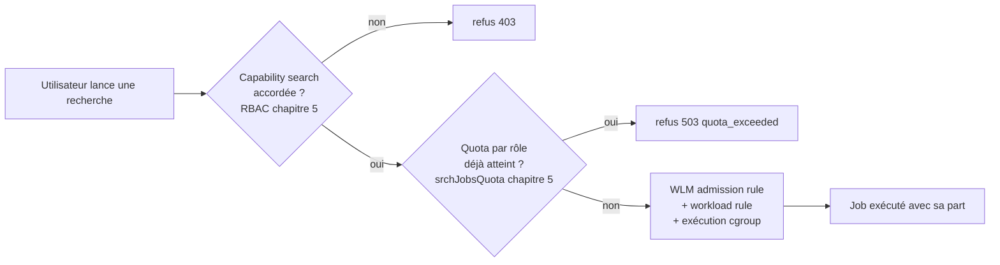
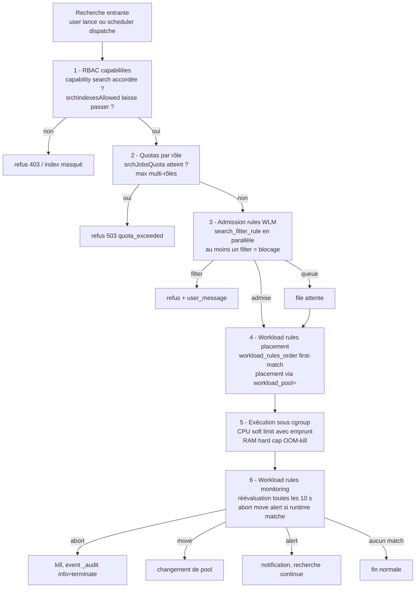

# Chapitre 6 — Guide Workload Management : search heads

> Ce chapitre est le guide opérationnel complet de Workload Management
> côté Search Head. Il couvre les concepts WLM, l'audit de l'existant,
> la conception des pools, l'implémentation progressive avec ses gates,
> et la surveillance permanente.
>
> Le volet **indexers / mode distribué** est traité au chapitre 7. Une
> recommandation tranche le pilotage : **commencer par les indexers en
> monitor-only avant le search head** (justifié au chapitre 7 §1).

## 1. Modèle mental — pourquoi WLM existe

Un Search Head Splunk exécute des **recherches** : des processus
splunkd qui scannent des index, agrègent des événements, restituent
un résultat. Chaque recherche consomme du CPU, de la mémoire, du
disque (dispatch dir), de la bande passante I/O.

Sur un SHC qui sert mille utilisateurs, ces ressources sont
**partagées**. Sans arbitre, la première recherche qui démarre prend
ce qu'elle veut ; la suivante prend ce qui reste ; au bout d'un
moment plus rien n'est garanti.

WLM réserve des **parts** de ces ressources pour des **familles de
recherches** et les **arbitre** quand la demande dépasse l'offre.

### Trois choses

1. Une **géographie** : les recherches sont rangées dans des **pools**
   qui ont chacun une part de CPU et de mémoire.
2. Des **règles de placement** : chaque recherche entrante est routée
   vers un pool selon ce qu'elle est (RT vs historique, ad-hoc vs
   scheduled, lancée par tel rôle, sur tel index).
3. Une **exécution sous cgroup** : Linux applique réellement les parts
   via les **cgroups** (control groups).

### Articulation avec le RBAC



WLM ne remplace **pas** les capabilities (qui décident *qui a le droit
de faire quoi*) ni les quotas par rôle (qui décident *combien de jobs
un user peut lancer*). Il s'ajoute par-dessus : **combien de ressources
un job en cours peut consommer**, et **avec quelle priorité face à la
pression instantanée**.

## 2. Les cinq briques

### 2.1 Le pool

Un **pool** (`[workload_pool:<name>]`) est une enveloppe partagée par
un ensemble de recherches. Trois paramètres principaux.

- **`category`** : à quelle catégorie WLM le pool appartient
  (`search`, `ingest`, `misc`).
- **`cpu_weight`** : la part de CPU **relative** que le pool peut
  prétendre dans sa catégorie. **Soft limit** — si le pool n'utilise
  pas sa part, les autres pools peuvent l'emprunter (« CPU is
  compressible »).
- **`mem_weight`** : la part de mémoire **absolue** (hard cap). Un job
  qui dépasse est **OOM-killed** par cgroup. La mémoire n'est pas
  compressible.

Le paramètre **`default_category_pool=1`** désigne le pool par défaut
de sa catégorie. **Chaque catégorie WLM exige au moins un pool
`default_category_pool=1`** sinon splunkd refuse d'activer WLM
(F-WLM-01).

### 2.2 La catégorie

Une **catégorie** (`[workload_category:<name>]`) regroupe des pools par
usage technique. Les trois catégories sont fixes en Splunk 9.4 :
`search`, `ingest`, `misc`. Chaque catégorie a son propre `cpu_weight`
et `mem_weight` — c'est la première étape de partage.

Le `cpu_allocated_percent` effectif d'un pool s'obtient par :

```
cpu_weight_pool × cpu_weight_categorie / 100
```

Exemple : `ad_hoc` à 35 % d'une catégorie `search` à 80 % = 28 % du
CPU total du SH.

Pour un SH, ce qui compte fonctionnellement c'est la catégorie
`search`. Les deux autres catégories doivent **exister** (avec un
`default_category_pool=1`) pour que WLM accepte de s'activer, mais
leurs pools (`ingest_default`, `misc_default`) ne reçoivent pas de
règles métier.

### 2.3 L'admission rule

Une **admission rule** (`[search_filter_rule:<name>]`) s'évalue
**avant** que la recherche démarre.

- **`action = filter`** : bloque la recherche. Un message
  `user_message` est renvoyé au client (≤ 140 chars, alphanum + ponctuation
  basique, **pas de parenthèses** — F-WLM-06).
- **`action = queue`** : met en file d'attente. Typiquement combiné
  avec un prédicat `adhoc_search_percentage`.

Toutes les admission rules sont **évaluées en parallèle** — il suffit
qu'une seule matche `filter` pour bloquer.

### 2.4 La workload rule

Une **workload rule** (`[workload_rule:<name>]`) s'évalue à
l'admission pour le placement, puis toutes les dix secondes pour le
monitoring.

- **Placement** : présence de la clé `workload_pool = <pool>`
  **sans** clef `action=` (F-WLM-02).
- **`action = abort`** : tue la recherche en cours (exige `runtime>`
  dans le prédicat — F-WLM-03).
- **`action = move`** : déplace un job d'un pool à un autre (`move`
  + `workload_pool = <pool_alt>` ; exige `runtime>`).
- **`action = alert`** : alerte sans contraindre — la recherche
  continue, un événement est écrit dans `_audit`, un message
  structuré apparaît dans le job inspector. C'est l'équivalent natif
  d'un **mode monitor-only par règle**. La doc Splunk mentionne aussi
  `action = display_message` — **cette valeur n'existe pas en 9.4.6**
  (F-WLM-04). Il faut utiliser `alert`.

L'ordre d'évaluation est strict, défini par `[workload_rules_order]` —
**first-match wins**. Cet ordre n'accepte **que** les
`[workload_rule:*]` ; y inscrire une `[search_filter_rule:*]` provoque
un HTTP 404 (F-WLM-05).

### 2.5 Le cgroup

Sous Linux, un **cgroup** (control group) est un mécanisme noyau qui
regroupe des processus et leur applique des limites de CPU, mémoire,
I/O. Splunk en 9.4.6 utilise cgroups v2, sous
`/sys/fs/cgroup/system.slice/Splunkd.service/`.

Au démarrage de splunkd avec WLM activé, splunkd **attache** ses
processus aux cgroups configurés. Quand une nouvelle recherche
démarre, splunkd attache le processus search au cgroup correspondant
au pool décidé par les workload rules. À partir de ce moment, c'est
le **noyau Linux** qui applique la limite.

**Note opérationnelle.** Au premier déploiement de WLM, un
`systemctl restart Splunkd` est nécessaire pour que splunkd attache
ses processus aux cgroups. Sur les déploiements suivants (modif des
`.conf`), un reload via `/services/workloads/config/_reload` suffit.
Le restart **doit** être en root direct, pas via `runuser -u splunk`
qui échoue silencieusement sur les services systemd-managed (F-WLM-08).

## 3. Chaîne d'évaluation complète



Trois remarques :

- Une recherche refusée à l'étape 2 (quota) **n'apparaît jamais** dans
  les traces WLM — c'est une cause fréquente de confusion en lecture
  de `_audit`.
- L'étape 4 est **implicite** (pas d'`action=` pour le placement —
  F-WLM-02). Le seul fait d'avoir une clef `workload_pool = X` dans
  une `[workload_rule:*]` qui match suffit à router.
- L'étape 6 ne s'évalue **que sur les règles qui ont un prédicat
  `runtime>`** (F-WLM-03). Les autres règles ne sont évaluées qu'à
  l'étape 4 (placement).

## 4. Pattern recommandé — sept pools

| Pool | Catégorie | `cpu_weight` | `mem_weight` | `default_category_pool` | Vocation |
| --- | --- | --- | --- | --- | --- |
| `admin` | search | 15 | 15 | 0 | Réservé aux rôles admin |
| `scheduled` | search | 30 | 30 | 0 | Recherches planifiées |
| `ad_hoc` | search | 35 | 35 | **1** | Recherches interactives (défaut) |
| `bulk` | search | 10 | 10 | 0 | Recherches longues, exports |
| `accel` | search | 10 | 10 | 0 | Accélérations, summary indexing |
| `ingest_default` | ingest | 1 | 1 | **1** | Existe pour activer WLM |
| `misc_default` | misc | 1 | 1 | **1** | Existe pour activer WLM |

Catégorie `search` à 80 % du CPU/RAM total, `ingest` à 15 %,
`misc` à 5 %.

> Les pourcentages sont l'état de l'art pour un SHC d'un millier
> d'utilisateurs. **À adapter au contexte** sur la baseline d'usage
> réelle.

### Exemple `workload_pools.conf`

```ini
[general]
enabled = 1

[workload_category:search]
cpu_weight = 80
mem_weight = 80

[workload_category:ingest]
cpu_weight = 15
mem_weight = 15

[workload_category:misc]
cpu_weight = 5
mem_weight = 5

[workload_pool:admin]
category = search
cpu_weight = 15
mem_weight = 15

[workload_pool:scheduled]
category = search
cpu_weight = 30
mem_weight = 30

[workload_pool:ad_hoc]
category = search
cpu_weight = 35
mem_weight = 35
default_category_pool = 1

[workload_pool:bulk]
category = search
cpu_weight = 10
mem_weight = 10

[workload_pool:accel]
category = search
cpu_weight = 10
mem_weight = 10

[workload_pool:ingest_default]
category = ingest
cpu_weight = 1
mem_weight = 1
default_category_pool = 1

[workload_pool:misc_default]
category = misc
cpu_weight = 1
mem_weight = 1
default_category_pool = 1
```

## 5. Pattern recommandé — huit règles WLM

Les huit règles forment un set cohérent. Toutes les règles d'**action
monitoring** (`abort`, `move`, `alert`) portent un prédicat `runtime>`.
Toutes les règles de **placement** ne portent que des prédicats de
contexte (rôle, `search_type`, etc.).

### R-W01 — Abort des real-time non autorisées

```ini
[workload_rule:abort_unauthorized_rt]
predicate = search_mode=realtime AND NOT role=rt_authorized_*
action = abort
runtime = 1s
schedule = always
```

Bloque toute recherche real-time lancée par un rôle qui n'est pas
explicitement dans un atomique `rt_authorized_*`. Le finding
F-RBAC-01 rappelle que `rtsearch` héritée ne se révoque pas — c'est
WLM qui rattrape.

### R-W02 — Move des `alltime` vers `bulk`

```ini
[workload_rule:move_alltime_to_bulk]
predicate = numeric_search_time_range=true AND search_time_range>1825d
action = move
workload_pool = bulk
runtime = 1m
```

Déplace les recherches sans borne temporelle (ou couvrant plus de
cinq ans) vers le pool `bulk` après une minute d'exécution. Ne les
tue pas — leur laisse de l'oxygène mais hors du pool ad-hoc.

### R-W03 — Placement des scheduled

```ini
[workload_rule:place_scheduled]
predicate = search_type=scheduled
workload_pool = scheduled
schedule = always
```

Placement implicite par présence de `workload_pool=` (F-WLM-02). Pas
d'`action=`.

### R-W04 — Placement des accélérations

```ini
[workload_rule:place_acceleration]
predicate = search_type IN (datamodel_acceleration, report_acceleration, summary_index)
workload_pool = accel
```

### R-W05 — Placement des admin

```ini
[workload_rule:place_admin]
predicate = role=admin_*
workload_pool = admin
```

Protège le pool admin pour qu'un incident de saturation n'empêche
pas le diagnostic. Le rôle admin reste capable de lancer des
recherches.

### R-W06 — Alert sur les recherches longues

```ini
[workload_rule:alert_long_searches]
predicate = runtime>10m AND NOT search_type=scheduled
action = alert
schedule = always
```

Mode monitor-only par règle (F-WLM-04). La recherche continue, un
événement `_audit` est écrit, le job inspector affiche le message.
Alimente la boucle pédagogique.

### R-W07 — Move des recherches admin lancées en ad-hoc vers le pool admin

```ini
[workload_rule:move_admin_adhoc]
predicate = role=admin_* AND runtime>30s
action = move
workload_pool = admin
runtime = 30s
```

Rattrape les cas où un admin lance une recherche depuis la barre de
recherche sans déclencher R-W05 (rare en pratique mais sécurise).

### R-W08 — Admission rule : file d'attente sur saturation ad-hoc

```ini
[search_filter_rule:queue_on_adhoc_saturation]
predicate = adhoc_search_percentage>85 AND NOT role=admin_*
action = queue
user_message = Plateforme saturee, votre recherche est en file dattente. Reessayez si urgent.
```

**Note F-WLM-06** : `user_message` ≤ 140 chars, pas de parenthèses.

### Ordre d'évaluation

```ini
[workload_rules_order]
rules = abort_unauthorized_rt, move_alltime_to_bulk, place_admin, move_admin_adhoc, place_scheduled, place_acceleration, alert_long_searches
```

L'ordre **n'accepte que les `[workload_rule:*]`** (F-WLM-05). Les
admission rules (`[search_filter_rule:*]`) sont évaluées en
parallèle, hors de cet ordre.

Logique d'ordre :

1. Tuer les comportements interdits (`abort_unauthorized_rt`).
2. Déplacer les comportements non interdits mais coûteux
   (`move_alltime_to_bulk`).
3. Protéger les admin (`place_admin`, `move_admin_adhoc`).
4. Placer les types techniques (`place_scheduled`,
   `place_acceleration`).
5. Alerter sur les anomalies de durée (`alert_long_searches`).

## 6. Implémentation progressive — six phases

### Phase 0 — Baseline (2 à 4 semaines)

Mesurer pendant deux à quatre semaines sans WLM activé : la
concurrence ad-hoc, la concurrence scheduled, la durée moyenne d'une
recherche, le pic de mémoire d'un Search Head, la distribution des
`search_type`.

Calibrer les pourcentages de pool (table §4) sur ces mesures.

Critère de gate : la baseline est connue, les pourcentages sont
ajustés pour le contexte.

### Phase 1 — Activation des pools sans règles (1 semaine)

Déployer `workload_pools.conf` (7 pools), activer WLM via
`workload-management-status enabled=1`. Aucune règle pour le moment —
toutes les recherches tombent dans `ad_hoc` (default category pool).

Restart Splunkd via `systemctl restart Splunkd` (F-WLM-08).

Critère de gate : `| rest /services/workloads/status` retourne
`enabled=1`. Les recherches tournent. Aucun impact utilisateur
observable.

### Phase 2 — Monitor-only (`alert`) — 2 à 4 semaines

Déployer toutes les workload rules **en `action = alert`** (jamais
`abort` ni `move` en cette phase). Toutes les règles ont leur
prédicat de placement remplacé par un prédicat monitor-only.

Exemple : la règle R-W01 devient

```ini
[workload_rule:monitor_unauthorized_rt]
predicate = search_mode=realtime AND NOT role=rt_authorized_* AND runtime>1s
action = alert
```

Cela permet d'observer **ce que la règle ferait** sans rien casser. Les
événements `_audit` enregistrent les `alert` — on en mesure le volume
par règle, on identifie les utilisateurs et les rôles qui seraient
impactés.

Critère de gate : pour chaque règle, on connaît le nombre de matchs
par jour, on a contacté les utilisateurs qui auraient été impactés
pour comprendre leur intention.

### Phase 3 — Bascule en enforce, règle par règle (4 à 8 semaines)

Basculer les règles **une par une** en enforce, dans cet ordre :

1. Placement implicite (`place_scheduled`, `place_acceleration`,
   `place_admin`) — bénin, aucun risque utilisateur.
2. Move (`move_alltime_to_bulk`, `move_admin_adhoc`) — perturbe les
   recherches longues mais ne les tue pas.
3. Abort (`abort_unauthorized_rt`) — perturbe les utilisateurs
   directement, attendre la dernière phase.
4. Admission queue (`queue_on_adhoc_saturation`) — déploiement final.

Entre chaque bascule, **deux semaines d'observation** des KPI (§7).

Critère de gate par règle : aucun incident d'accès non résolu en
moins d'une heure, KPI inchangés ou améliorés.

### Phase 4 — Cycles correctifs (continu)

Pour chaque règle activée, mesurer en continu les KPI. Une règle
qui devient trop bruyante (matchs > seuil prévu) est rebasculée en
`alert` pour analyse.

### Phase 5 — Industrialisation multi-SHC (4 à 6 semaines)

Une fois la conception stable sur le SHC pilote, propager aux autres
SHC en respectant la cohérence inter-SHC (les noms de rôles ciblés
par les règles doivent être identiques d'un SHC à l'autre).

Critère de gate : tous les SHC du périmètre ont la même set de règles,
les pourcentages de pool sont ajustés à la charge propre de chaque
SHC.

## 7. Surveillance permanente

### B.3.01 — Distribution des recherches par pool, dernière heure

```spl
search index=_audit action=search earliest=-1h
| eval pool = coalesce(workload_pool, "unmatched")
| stats count by pool
| sort -count
```

**Cible** : `ad_hoc` > 50 %, `scheduled` 20-40 %, `admin` < 5 %,
`bulk` < 10 %, `accel` < 10 %, `unmatched` proche de 0.

### B.3.02 — Pression sur le pool ad-hoc

```spl
search index=_internal sourcetype=splunkd component=WorkloadPool
| where pool_name="ad_hoc"
| stats avg(cpu_pct) as cpu_avg max(cpu_pct) as cpu_max
        avg(mem_pct) as mem_avg max(mem_pct) as mem_max by host
| where cpu_max>80 OR mem_max>85
```

**Interprétation.** Pression soutenue > 80 % CPU ou > 85 % mémoire
sur le pool ad-hoc = candidat à augmentation du `cpu_weight` ou à
serrage des admission rules.

### B.3.03 — Aborts WLM par règle, dernière semaine

```spl
search index=_audit action=workload_abort earliest=-7d
| stats count values(user) as users dc(user) as nb_users by rule_name
| sort -count
```

**Interprétation.** Une règle qui abort plus de N fois par jour est
soit mal calibrée, soit révèle un comportement à corriger côté
utilisateur (formation, communication).

### B.3.04 — Files d'attente sur saturation

```spl
search index=_audit action=workload_queue earliest=-7d
| timechart span=1h count
```

**Interprétation.** Pics de queue concentrés sur certaines plages
horaires = signal de planification à mieux étaler les scheduled.

### B.3.05 — Latence d'admission

```spl
search index=_internal sourcetype=splunkd component=SearchAdmission
| eval admit_ms = wait_ms
| stats p50(admit_ms) as p50 p90(admit_ms) as p90 p99(admit_ms) as p99 by host
```

**Cible** : `p50 < 100 ms`, `p99 < 1000 ms`. Dégradation = WLM ou
quotas surchargés.

### B.3.06 — Recherches alertées par durée

```spl
search index=_audit action=workload_alert earliest=-7d
| stats count values(rule_name) as rules dc(user) as nb_users by behavior
| sort -count
```

Alimente la boucle pédagogique.

### B.3.07 — Top utilisateurs par pression sur le pool

```spl
search index=_audit action=search earliest=-24h workload_pool=*
| eval cost = total_run_time
| stats sum(cost) as total_cost count by user workload_pool
| sort -total_cost
| head 20
```

**Interprétation.** Top 20 des utilisateurs en termes de coût agrégé.
Cibles évidentes pour la sensibilisation pédagogique (chapitre 3 §4).

### B.3.08 — Distribution des `search_type` par pool

```spl
search index=_audit action=search earliest=-24h
| eval pool = coalesce(workload_pool, "unmatched")
| eval stype = if(isnull(search_type), "adhoc_default", search_type)
| stats count by pool stype
| sort -count
```

Vérifie que les règles de placement font ce qu'on attend (scheduled
dans `scheduled`, accel dans `accel`).

### B.3.09 — Move events

```spl
search index=_audit action=workload_move earliest=-7d
| stats count by source_pool target_pool rule_name
| sort -count
```

**Interprétation.** Une recherche `ad_hoc → bulk` est attendue
(R-W02). Toute autre transition mérite analyse.

### B.3.10 — Recherches sans `workload_pool` (unmatched)

```spl
search index=_audit action=search earliest=-24h
| eval matched = if(isnull(workload_pool) OR workload_pool="", "no", "yes")
| stats count by matched
```

**Cible** : `no` < 5 %. Toute recherche `no` est partie dans le
default `ad_hoc`, ce qui n'est pas forcément faux — mais une
proportion croissante de `no` indique une couverture incomplète des
règles de placement.

## 8. Audit pré-WLM

Avant de concevoir les pools, dix recherches de cartographie. Elles
servent à calibrer les pourcentages de pool sur la réalité de
l'usage.

### B.1.01 — Concurrence ad-hoc historique

```spl
search index=_audit action=search search_type=adhoc earliest=-30d
| bucket _time span=10m
| stats dc(eval(coalesce(search_id, sid))) as nb_jobs by _time
| stats avg(nb_jobs) as avg_concurrent max(nb_jobs) as max_concurrent
```

Mesure la concurrence ad-hoc moyenne et pic sur 30 jours. Calibre la
part du pool `ad_hoc`.

### B.1.02 — Concurrence scheduled

```spl
search index=_audit action=search search_type=scheduled earliest=-30d
| bucket _time span=1m
| stats dc(eval(coalesce(search_id, sid))) as nb_jobs by _time
| stats avg(nb_jobs) as avg_per_min max(nb_jobs) as max_per_min
```

Calibre la part du pool `scheduled`. Pics > 50 / minute = problème
de répartition à corriger côté planification.

### B.1.03 — Durée moyenne et p99

```spl
search index=_audit action=search earliest=-7d
| stats avg(total_run_time) as avg_dur p99(total_run_time) as p99_dur
        by search_type
```

Une recherche ad-hoc qui dure > 60 s en p99 est candidate à
optimisation.

### B.1.04 — Top utilisateurs en volume de recherches

```spl
search index=_audit action=search earliest=-7d
| stats count by user
| sort -count
| head 20
```

### B.1.05 — Recherches real-time réelles

```spl
search index=_audit action=search search_mode=realtime earliest=-7d
| stats count values(user) as users dc(user) as nb_users by index
| sort -count
```

Mesure l'usage réel des RT — alimente la décision sur `feature_rt` et
sur la règle R-W01.

### B.1.06 — Recherches sans borne temporelle

```spl
search index=_audit action=search earliest=-7d
| where time_range="alltime" OR isnull(time_range)
| stats count values(user) as users by index
```

Cible directe de R-W02.

### B.1.07 — Recherches par index (top 20 indexes)

```spl
search index=_audit action=search earliest=-7d
| rex max_match=5 "search_index_list=\"(?<idx>[^\"]+)\""
| mvexpand idx
| stats count by idx
| sort -count
| head 20
```

### B.1.08 — Distribution des durées par tranche

```spl
search index=_audit action=search earliest=-7d
| eval bucket = case(
    total_run_time < 1, "<1s",
    total_run_time < 10, "1-10s",
    total_run_time < 60, "10-60s",
    total_run_time < 600, "1-10min",
    true(), ">10min")
| stats count by bucket
```

Calibre le seuil de R-W06 (`alert_long_searches`).

### B.1.09 — Saved searches en quotas non déclarés

```spl
| rest /servicesNS/-/-/saved/searches splunk_server=local
| rename "eai:acl.app" as app "eai:acl.owner" as owner
| where disabled=0 AND is_scheduled=1
| stats count by app cron_schedule
| sort -count
```

Identifie les saved searches dont la planification (cron) doit être
revue avant activation WLM stricte.

### B.1.10 — Accélérations actives

```spl
| rest /servicesNS/-/-/data/models splunk_server=local
| where acceleration=true
| table title acceleration.cron_schedule eai:acl.app
```

Calibre la part du pool `accel`.

## 9. Pièges 9.4.6 — récapitulatif

| # | Piège | Conséquence | Référence |
| --- | --- | --- | --- |
| W1 | Oublier `default_category_pool=1` sur `ingest` et `misc` | activation WLM échoue silencieusement | F-WLM-01 |
| W2 | Utiliser `action=workload_pool` pour le placement | règle rejetée par splunkd | F-WLM-02 |
| W3 | Oublier `runtime>` sur action `abort/move/alert` | règle rejetée à l'activation | F-WLM-03 |
| W4 | Utiliser `action=display_message` | n'existe pas, utiliser `action=alert` | F-WLM-04 |
| W5 | Mettre une `search_filter_rule` dans `[workload_rules_order]` | HTTP 404 | F-WLM-05 |
| W6 | `user_message` avec parenthèses ou > 140 chars | règle rejetée | F-WLM-06 |
| W7 | Reload côté indexer sans cluster-bundle | pas de propagation | F-WLM-07 (voir ch. 7) |
| W8 | Restart Splunkd via `runuser -u splunk` | échec silencieux | F-WLM-08 |
| W9 | Concevoir les pools sans baseline | pourcentages déconnectés de l'usage | calibration |
| W10 | Basculer en enforce sans phase monitor-only | incidents utilisateurs non anticipés | méthode |

## Sources

- [Splunk Workload Management 9.4 — Overview](https://help.splunk.com/en/splunk-enterprise/administer/manage-workloads/9.4/workload-management-overview)
- [Configure workload pools 9.4](https://help.splunk.com/en/splunk-enterprise/administer/manage-workloads/9.4/configure-workload-management/configure-workload-pools)
- [Configure workload rules 9.4](https://help.splunk.com/en/splunk-enterprise/administer/manage-workloads/9.4/configure-workload-management/configure-workload-rules)
- [Configure admission rules 9.4](https://help.splunk.com/en/splunk-enterprise/administer/manage-workloads/9.4/configure-workload-management/configure-admission-rules-to-prefilter-searches)
- [Splunk Blog — Best Practices for Using Splunk Workload Management](https://www.splunk.com/en_us/blog/platform/best-practices-for-using-splunk-workload-management.html)
