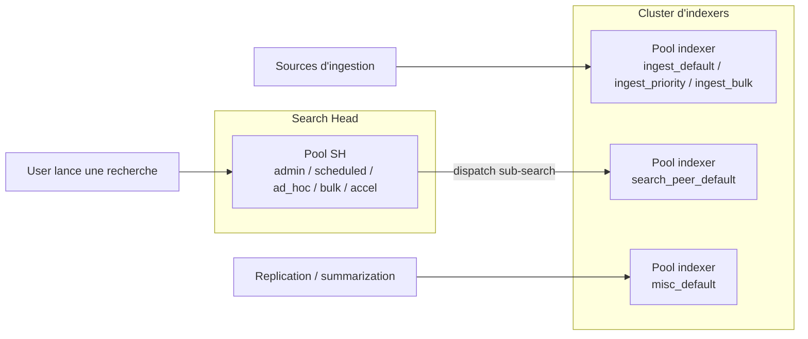

# Chapitre 7 — Guide Workload Management : indexers et mode distribué

> Ce chapitre traite WLM **côté indexers**, en complément du chapitre 6
> qui traite WLM côté Search Head. Il couvre les concepts spécifiques
> au mode distribué, la conception des pools indexer, la procédure de
> propagation via le cluster master, l'ordre d'implémentation tranché
> (indexers d'abord, en monitor-only) et neuf recherches de surveillance.
>
> Le chapitre est auto-suffisant — il rappelle les notions WLM qui lui
> sont nécessaires et renvoie au chapitre 6 pour ce qui est commun.

## 1. Pourquoi un volet indexers

### 1.1 La régulation côté SH ne suffit pas

Le chapitre 6 pose les cinq pools `search` + deux pools default
côté Search Head — ils couvrent tout ce qui se passe sur le SH.
Mais une recherche distribuée a **deux représentations** :

- côté SH, un **search dispatcher** principal — c'est lui que WLM
  côté SH régule ;
- côté chaque indexer participant, un **search peer process** —
  c'est lui qui scanne les buckets, lit les events bruts, applique
  les filtres. **Ce processus consomme du CPU et de la mémoire qui
  ne sont pas ceux du SH.**

Conséquence : un job placé dans le pool SH `ad_hoc` (par exemple
35 % du CPU SH) **n'est pas borné** côté indexer — son search peer
process tombe dans le pool default indexer (`search_peer_default`) et
consomme librement. Limiter le dispatcher SH ne limite **pas** la
consommation de ressources côté indexer pour la recherche en
question.

À cela s'ajoute, côté indexer, la pression **d'ingestion** : les
pipelines d'ingestion (parsing, indexing, forwarding intermédiaire)
consomment une grande part du CPU et des I/O des peers, et ne sont
régulés par **aucun** pool SH.

### 1.2 Ce que le volet indexers apporte

Activer WLM côté indexers ajoute deux dimensions.

1. **Régulation de l'ingestion** — catégorie `ingest` : prioriser un
   sourcetype sensible (par exemple `sec_*` en `ingest_priority`) ou
   ralentir des sources volumineuses peu critiques (`ingest_bulk`).
2. **Régulation des recherches distribuées côté peer** — catégorie
   `search_peer` : borner les processus search peer pour qu'ils
   n'écrasent pas les indexers en cas de recherche pathologique.

### 1.3 Articulation côté SH / côté indexer



Les pools côté SH et les pools côté indexer sont **dimensionnés
indépendamment**. Il n'y a **pas** de correspondance 1:1 nom de pool
SH ↔ nom de pool indexer — ce sont deux périmètres différents qui
régulent deux types de ressources différents.

## 2. Concepts spécifiques

### 2.1 Différences structurelles

Les fichiers de configuration sont **identiques** des deux côtés :
`workload_pools.conf`, `workload_rules.conf`, `workload_policy.conf`.

Mais **l'emplacement** diffère.

| Périmètre | Emplacement de l'app | Outil de propagation |
| --- | --- | --- |
| **Search Head Cluster** | `etc/shcluster/apps/<app>/local/` sur le **deployer** | `splunk apply shcluster-bundle` |
| **Cluster d'indexers** | `etc/manager-apps/<app>/local/` sur le **cluster master** | `splunk apply cluster-bundle` |

Côté peer, le bundle propagé arrive en `etc/slave-apps/<app>/local/`.
**Toute édition manuelle sur un peer est écrasée au prochain
`apply cluster-bundle`.**

### 2.2 Les trois catégories côté indexer

Splunk 9.4 définit trois catégories sur tout nœud (et chaque
catégorie doit porter au moins un pool avec
`default_category_pool=1` — F-WLM-01).

| Catégorie | Activité régulée | Pertinence côté SH | Pertinence côté indexer | Pools typiques |
| --- | --- | --- | --- | --- |
| **`search`** | Recherches utilisateurs | pilier métier SH | minimal (un pool default suffit) | côté SH : 5 pools métier |
| **`ingest`** | Pipelines d'ingestion | minimal | **pilier métier indexer** | côté indexer : `ingest_default`, `ingest_priority`, `ingest_bulk` |
| **`search_peer`** | Recherches distribuées côté indexer | sans objet | optionnelle | côté indexer : `search_peer_default` |
| **`misc`** | Activités internes (replication, summarization) | un default | un default | `misc_default` |

Sur un **indexer**, `ingest` et `misc` portent la sémantique métier ;
`search` doit quand même avoir un pool default mais ne reçoit pas de
règle utilisateur (les recherches en provenance des SH sont vues
comme `search_peer` côté indexer, pas comme `search`).

### 2.3 Pools indexer ≠ pools SH

Un pool SH contraint les **jobs** côté Search Head (leur dispatcher).
Un pool indexer contraint **l'ingestion** ou les **search peers**
côté indexer. Ce sont des objets différents. Ne pas chercher une
correspondance 1:1 de nommage.

### 2.4 Chaîne complète RBAC → quotas → WLM SH → WLM indexer

```
RBAC (capabilities)
  v
Quotas par rôle (srchJobsQuota, srchDiskQuota, rtSrchJobsQuota)
  v
Admission rules SH (search_filter_rule)
  v
Workload rules SH placement (workload_rule, first-match wins)
  v
Exécution dispatcher SH sous cgroup du pool SH
  v (dispatch sub-searches aux N indexers)
Workload rules indexer placement (sur le search peer process)
  v
Exécution search peer process sous cgroup du pool search_peer (indexer)
```

En parallèle, côté indexer uniquement, les pipelines d'ingestion
sont régulés par les workload rules indexer de catégorie `ingest`,
indépendamment de toute recherche.

### 2.5 Prédicats côté indexer

La documentation Splunk 9.4 ne fournit pas de tableau distinct des
prédicats côté indexer. Observations empiriques :

| Prédicat | Disponible côté indexer ? | Notes |
| --- | --- | --- |
| `role` | oui | Le rôle du user qui a initié la recherche (propagé via auth context) |
| `user` | oui | Idem |
| `app` | oui | App qui porte la saved search |
| `index` | oui | Pertinent pour cibler une ingestion d'un sourcetype donné |
| `search_type`, `search_mode` | partiellement | La régulation indexer arrive après celle du SH |
| `runtime>` | oui | Évalué sur les processus ingest / search peer |
| `sourcetype`, `source`, `host` | partiellement | Communauté indique que `ingest` peut s'en servir après parsing — à valider sur cluster réel |

**Repli sûr** : en cas de doute, prédicat sur `index=` (documenté
des deux côtés).

### 2.6 Actions côté indexer

Identiques en surface (`abort`, `move`, `alert`, `filter`, `queue`,
placement implicite via `workload_pool=`), avec des spécificités.

- Côté `ingest`, **`abort` est rare** (couper une ingestion = perte
  de données). On privilégie `move` vers un pool à `mem_weight`
  inférieur.
- Côté `search_peer`, le runtime Splunk peut déjà arrêter des search
  peer processes via les mécanismes natifs (timeout, annulation côté
  SH). Ajouter une règle `abort` à `runtime>X` est utile pour les
  recherches distribuées qui tournent en boucle.
- Côté `misc` (replication bucket, summarization), les actions de
  placement sont les plus pertinentes (mettre la replication dans
  un pool à `mem_weight` faible pour ne pas saturer la mémoire).

## 3. Conception des pools indexer

### 3.1 Audit pré-déploiement

Avant de poser une conf WLM côté indexers, cartographier :

1. **Liste des peers** : `| rest /services/cluster/master/peers`
   depuis le SH ou le cluster master. Tous en `Up`,
   `bundle_status=Up to date`.
2. **Pression d'ingestion actuelle** : voir R.I.01 ci-dessous, par
   `host` (peer).
3. **Volumétrie par sourcetype** : voir R.I.02.
4. **Sourcetypes sensibles** : la liste des sourcetypes à traitement
   prioritaire (typiquement `sec_*`, `wineventlog_security`,
   `audit_critical`) — candidats à `ingest_priority`.

### 3.2 Pattern recommandé — cinq pools sur trois catégories

| Pool | Catégorie | `cpu_weight` / `mem_weight` | `default_category_pool` | Cible |
| --- | --- | --- | --- | --- |
| `ingest_default` | `ingest` | 70 / 70 | **1** | Toutes ingestions sans règle ciblée |
| `ingest_priority` | `ingest` | 20 / 20 | 0 | Sourcetypes sensibles |
| `ingest_bulk` | `ingest` | 10 / 10 | 0 | Sources volumineuses peu critiques |
| `search_peer_default` | `search_peer` | 100 / 100 | **1** | Tous les search peer processes |
| `misc_default` | `misc` | 100 / 100 | **1** | Replication, summarization, alerting |

> **Pas de pool custom dans `search_peer`** : la régulation est
> largement réservée au runtime Splunk et les pools custom y sont
> rarement documentés. À ajouter seulement si l'analyse fine montre
> qu'une catégorie de recherches sature les peers.

### 3.3 Règles d'ingestion typiques

```ini
[workload_pool:ingest_default]
category = ingest
cpu_weight = 70
mem_weight = 70
default_category_pool = 1

[workload_pool:ingest_priority]
category = ingest
cpu_weight = 20
mem_weight = 20

[workload_pool:ingest_bulk]
category = ingest
cpu_weight = 10
mem_weight = 10

[workload_pool:search_peer_default]
category = search_peer
cpu_weight = 100
mem_weight = 100
default_category_pool = 1

[workload_pool:misc_default]
category = misc
cpu_weight = 100
mem_weight = 100
default_category_pool = 1

[workload_rule:R-IDX-01_priority_ingest_security]
predicate = index=sec_*
workload_pool = ingest_priority
schedule = always

[workload_rule:R-IDX-02_bulk_ingest_archive]
predicate = sourcetype=archive_* OR source=*.gz
workload_pool = ingest_bulk
schedule = always

[workload_rules_order]
rules = R-IDX-01_priority_ingest_security, R-IDX-02_bulk_ingest_archive
```

### 3.4 Critères de dimensionnement

- **`ingest_default` doit absorber le gros du trafic** — laisser une
  marge généreuse (70 % du `cpu_weight` de la catégorie).
- **`ingest_priority` à 20 à 30 %** — suffisant pour les sourcetypes
  sensibles, qui sont normalement < 10 % du volume total.
- **`ingest_bulk` à 10 %** — délibérément contraint pour ne pas faire
  écraser le SLA d'ingestion en cas d'arrivée massive de bulk.

## 4. Propagation via le cluster master

### 4.1 Prérequis

1. **Cluster master accessible et en bonne santé** : `splunk show
   cluster-status` montre tous les peers en `Up`, `bundle_status=Up to
   date`. Aucun rolling restart en cours.
2. **Cgroups disponibles** sur chaque indexer. WLM côté indexer
   s'appuie sur cgroups v1 ou v2. Vérification : `mount | grep cgroup`.
3. **Capacité libre sur les peers** : un rolling restart prend
   2 à 5 minutes par peer. Sur un cluster de douze peers, prévoir une
   fenêtre de 30 à 60 minutes avec dégradation de service.
4. **Budget de réplication** : `splunk show cluster-bundle-status`
   confirme que les peers ont la capacité de redémarrer sans
   déclencher un fixup.

### 4.2 Préparer l'app

L'app WLM cluster vit en `etc/manager-apps/wlm_indexer/local/` sur
le cluster master (et non `default/` qui est réservé à
Splunk-installed apps).

```
etc/manager-apps/wlm_indexer/local/
  workload_pools.conf
  workload_rules.conf
  app.conf            # metadata d'app standard
metadata/
  default.meta        # permissions d'app
```

### 4.3 Appliquer le bundle

```bash
# 1) Vérifier le bundle status avant
splunk show cluster-bundle-status -auth <admin>:<pw>

# 2) Valider le bundle (sans appliquer)
splunk validate cluster-bundle -auth <admin>:<pw>

# 3) Appliquer
splunk apply cluster-bundle -auth <admin>:<pw>

# 4) Vérifier la propagation
splunk show cluster-bundle-status -auth <admin>:<pw>
```

L'apply déclenche un **rolling restart** des peers — un par un, dans
l'ordre cluster master. Le cluster master orchestre.

Pour les bundles **purement WLM**, un rolling restart est observé
sur la plupart des versions ; certaines mises à jour mineures ont
permis un hot-reload. À vérifier sur la version réelle déployée.

### 4.4 Vérifier l'activation par peer

Sur chaque peer (ou via une SPL agrégée — R.I.04 ci-dessous) :

```bash
splunk show workload-management-status -auth <admin>:<pw>
# Attendu : enabled=1
```

### 4.5 Rollback

Si une règle indexer est mal calibrée et impacte l'ingestion :

1. **Modifier la règle dans l'app sur le cluster master** (par
   exemple bascule `move` en `alert` pour passer en monitor-only).
2. **Reapply** : `splunk apply cluster-bundle`.
3. **Vérifier la propagation** : `splunk show cluster-bundle-status`.

En urgence absolue, désactiver WLM côté indexer en posant
`[general] enabled = 0` dans `workload_pools.conf` puis reapply.

## 5. Ordre d'implémentation — indexers d'abord en monitor-only

Une recommandation tranchée du projet : **commencer par les indexers
en monitor-only avant le search head**.

### 5.1 Pourquoi

La régulation par les search heads seuls ne suffit pas (§1.1). La
pression d'ingestion sur les indexers est portée par d'autres SHC
mutualisés, et un pool indexer mal calibré peut absorber la marge du
SHC qu'on gouverne.

En ordonnant **indexers en monitor-only d'abord**, on observe sans
risque la distribution réelle :

- de l'ingestion entre `ingest_default` / `ingest_priority` /
  `ingest_bulk` ;
- des search peer processes (combien tournent en parallèle, pour
  combien de temps en moyenne, quelles recherches les déclenchent) ;
- des activités misc (replication, summarization).

Cette observation calibre les pourcentages avant tout enforce.

### 5.2 Cinq phases additionnelles côté indexer

À entrelacer avec les six phases SH (chapitre 6 §6).

| Phase indexer | Activité | Durée |
| --- | --- | --- |
| **0.I — Audit cluster** | Inventaire peers, baseline ingestion, baseline search peer | 2 sem |
| **1.I — Pools sans règles** | Déploiement des 5 pools, activation WLM côté indexer, aucune règle | 1 sem |
| **2.I — Monitor-only `alert`** | Toutes les règles indexer en `action=alert` | 2 à 4 sem |
| **3.I — Bascule placement** | Règles de placement (`workload_pool=`) en enforce, une par une | 2 à 4 sem |
| **4.I — Bascule actions** | Règles `move` / `alert` selon la matière observée | 2 à 4 sem |

L'enchaînement avec les phases SH est : 0.I, 1.I, 2.I en parallèle de
la baseline SH (phase 0 SH). Phase 3.I et 4.I en parallèle des phases
2 et 3 SH.

## 6. Pièges 9.4.6 spécifiques aux indexers

### F-IDX-01 — Les peers redémarrent sur cluster-bundle

Pour les modifications de bundle WLM, un rolling restart des peers
est observé. Sur certaines versions mineures, un hot-reload a été
possible — à vérifier sur la version réelle.

**Conséquence.** Planifier hors heures critiques. Sur un cluster de
N peers, la fenêtre est `N × ~3 min` plus le temps de fixup. Tenir
compte de la marge de réplication.

### F-IDX-02 — Édition manuelle sur peer écrasée

Toute édition manuelle dans `etc/slave-apps/<app>/local/` côté peer
est **écrasée** au prochain `splunk apply cluster-bundle`. Toute
modification doit passer par le cluster master.

### F-IDX-03 — `cluster-config -a` peut refuser l'auth ; REST direct

Certaines versions de la CLI `cluster-config -a` refusent l'auth
interactive. Le contournement consiste à passer par l'API REST
directement :

```bash
curl -sk -u <admin>:<pw> \
  "https://<cm>:8089/services/cluster/master/config" \
  -d "max_peer_build_load=2"
```

### F-IDX-04 — Pression d'ingestion mesurée sur `_internal`

La pression d'ingestion (CPU, files, latence de parsing) est
observable dans
`index=_internal sourcetype=splunkd component=Metrics group=pipeline`,
**pas** dans `_audit`. Les SPL d'audit ingestion (R.I.01, R.I.02)
ciblent `_internal`.

## 7. Surveillance permanente — neuf recherches R.I

### R.I.01 — Activation de WLM par peer

```spl
| rest /services/cluster/master/peers
| join type=left label [
    | rest /services/workload-management-status splunk_server=*
    | rename splunk_server as label
    | fields label enabled]
| eval status = case(enabled=1, "OK", enabled=0, "OFF", true(), "?")
| table label status site
| sort label
```

**Interprétation.** Tout peer à `status != OK` après propagation
indique un échec d'activation. Vérifier les cgroups, les logs
`splunkd.log` du peer concerné.

### R.I.02 — Bundle status

```spl
| rest /services/cluster/master/peers
| stats count by bundle_status
```

**Cible** : 100 % `Up to date`. Toute valeur autre que `Up to date`
après un `apply cluster-bundle` = à investiguer.

### R.I.03 — Pression d'ingestion par peer et par pool

```spl
search index=_internal sourcetype=splunkd component=WorkloadPool earliest=-1h
| where category="ingest"
| stats avg(cpu_pct) as cpu_avg max(cpu_pct) as cpu_max
        avg(mem_pct) as mem_avg max(mem_pct) as mem_max
        by host pool_name
| sort -cpu_max
```

**Interprétation.** Pression soutenue > 80 % CPU sur `ingest_default`
= ingestion qui pèse. À corréler avec R.I.04.

### R.I.04 — Volumétrie d'ingestion par sourcetype et par pool indexer

```spl
search index=_internal sourcetype=splunkd component=Metrics group=pipeline earliest=-24h
| where name="indexer"
| stats sum(eps) as events_per_sec by host sourcetype
| sort -events_per_sec
| head 30
```

Identifie les sourcetypes massifs candidats à `ingest_bulk` ou
`ingest_priority`.

### R.I.05 — Search peers actifs et durée

```spl
search index=_internal sourcetype=splunkd component=SearchPeer earliest=-1h
| stats count avg(runtime) as dur_avg max(runtime) as dur_max by host
| sort -dur_max
```

Identifie les peers sous pression de recherche distribuée.

### R.I.06 — Aborts côté indexer

```spl
search index=_audit action=workload_abort earliest=-7d
| where source=*indexer* OR sourcetype=splunkd_indexer
| stats count by rule_name user
| sort -count
```

### R.I.07 — Distribution des activités misc

```spl
search index=_internal sourcetype=splunkd component=WorkloadPool earliest=-1h
| where category="misc"
| stats avg(cpu_pct) as cpu_avg avg(mem_pct) as mem_avg by host pool_name
```

### R.I.08 — Pression de réplication bucket

```spl
search index=_internal sourcetype=splunkd component=CMRepJob earliest=-1h
| stats count avg(job_duration) as dur_avg max(job_duration) as dur_max
        by host
```

**Interprétation.** Pics de durée de réplication bucket = signal de
saturation des peers ou de bande passante réseau entre peers.

### R.I.09 — Divergence de configuration entre SH et indexer

```spl
| rest /services/configs/conf-workload_pools splunk_server=local
| eval node = "search_head"
| append [
    | rest /services/configs/conf-workload_pools splunk_server=<peer>
    | eval node = "indexer"]
| stats values(title) as pools by node
```

**Interprétation.** Les pools côté SH et côté indexer ne sont pas
identiques par construction. Cette SPL aide à vérifier qu'on a bien
les deux périmètres en place et à détecter des dérives (un pool qui
n'existe que sur certains peers, par exemple).

## 8. Pièges spécifiques au cluster — récapitulatif

| # | Piège | Conséquence | Référence |
| --- | --- | --- | --- |
| I1 | Éditer la conf sur un peer directement | écrasement au prochain apply | F-IDX-02 |
| I2 | Apply cluster-bundle pendant un fixup en cours | comportement indéfini | prérequis 4.1 |
| I3 | Pas de cgroups sur les peers | WLM ne s'active pas même si conf OK | prérequis 4.1 |
| I4 | Oublier la fenêtre de rolling restart | dégradation de service surprise | F-IDX-01 |
| I5 | Conf identique SH et indexer | mauvaise compréhension du modèle | §2.3 |
| I6 | `cluster-config -a` refuse l'auth | passer par REST direct | F-IDX-03 |
| I7 | Chercher la pression d'ingestion dans `_audit` | les métriques sont dans `_internal` | F-IDX-04 |

## Sources

- [Splunk Distributed Deployment 9.4 — Indexer Clusters](https://help.splunk.com/en/splunk-enterprise/administer/manage-indexers-and-indexer-clusters/9.4)
- [Splunk Workload Management 9.4 — Configure on indexers](https://help.splunk.com/en/splunk-enterprise/administer/manage-workloads/9.4)
- [Splunk Admin 9.4 — Apply cluster bundle](https://help.splunk.com/en/splunk-enterprise/administer/manage-indexers-and-indexer-clusters/9.4/manage-the-manager-node/update-common-peer-configurations-and-apps)
- [Splunk Docs — server.conf clustering](https://help.splunk.com/en/data-management/splunk-enterprise-admin-manual/9.4/configuration-file-reference/9.4.5-configuration-file-reference/server.conf)
