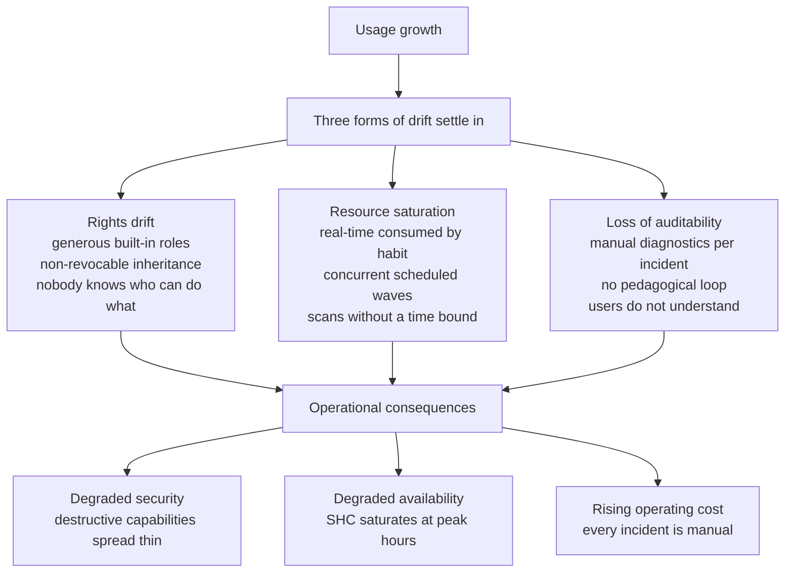
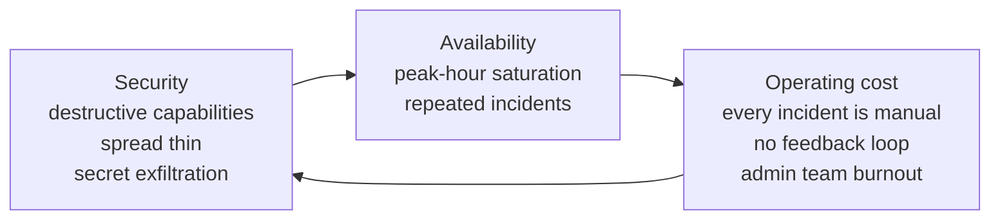

# Chapter 1 — Why a usage-governance project

> A Splunk Enterprise platform with hundreds of users on a Search Head
> Cluster (SHC) dedicated to a large business unit is not a product
> you install and walk away from. It is a living ecosystem: every day
> users launch searches, teams add saved searches, operators create
> accounts, the perimeter of indexed data grows. Without explicit
> usage governance, three forms of drift always appear — the same
> three, in the same order, on every Splunk platform of a certain
> size.

## 1. The three forms of drift

### 1.1 Rights drift

Splunk ships with generous built-in roles by default. The `power`
role allows real-time searches and scheduled creation; the `user`
role natively carries capabilities that let users schedule
background searches; certain administrative roles aggregate
destructive capabilities that have no business in a daily operator's
hands.

On top of that sits the `importRoles` inheritance mechanism: a role
can import another, and every capability of the parent is then
inherited **with no surgical revocation possible at the child
level**. After a few years, nobody knows precisely who can do what
or why a given account inherits a given capability.

Typical symptoms:

- roles whose effective capability list has doubled in two years
  without any commit to justify it;
- `srchFilter=*` declarations that silently nullify the restrictive
  filters of other roles;
- accounts inactive for eighteen months that still carry `admin`;
- app ACLs at `sharing=global` with `perms.read=*` exposing business
  data;
- no audit trail of who added what to whom on what date.

### 1.2 Resource saturation

A real-time search holds a CPU slot continuously. A search with no
time bound scans several years of history and weighs on indexers
shared with other SHCs. A wave of poorly staggered scheduled
searches can saturate the top of the minute. A poorly sized data
model acceleration crowds out analyst ad-hoc work.

The SHC starts to feel slow at certain hours, then runs out of
memory, then has to be emergency-restarted. The classic lever —
raising per-role quotas — does not work, because at runtime quotas
combine by taking the **maximum** across an account's roles, which
makes the layer fragile by construction. A user who carries a
low-quota "consultative" role and a high-quota "owner" role gets the
high quota.

### 1.3 Loss of auditability

When something breaks — when a user complains they can't access an
index, or that a search returns nothing — the SHC administrator has
to reconstruct the entitlement → role → group → identity chain. If
the platform has no coherent authorization model, that work is
manual at every incident and never produces a durable decision.

Pedagogy does not take hold either: the user does not understand
why their search weighs on the platform, and keeps launching it the
same way.

## 2. Why Splunk defaults are not enough

The native settings of a fresh Splunk install are designed to **work
out of the box**, not to withstand the wear of a thousand-user
platform. Four limitations of the default deserve to be spelled out.

**First, the `power` role is dangerous by construction.** On 9.4.6,
on a clean install, `power` natively imports `user` and directly
carries `rtsearch`, `schedule_search`, `schedule_rtsearch`,
`accelerate_search`, `embed_report` and `rest_properties_set`. Six
high-impact capabilities for stability and security, granted by
default to a role that presents itself as "user with a few more
rights." Giving `power` to an end user hands them the keys to the
truck without their knowing.

**Second, the default quotas are silent and low.** The `[default]`
stanza of `authorize.conf` 9.4 carries `srchJobsQuota=3`,
`srchDiskQuota=100` (MB), `srchTimeWin=-1` (unlimited). A user
without an explicitly declared quota in their final role falls back
to those defaults. Three concurrent jobs is too low for a serious
analyst and too high for platform control — and nobody knows it.

**Third, the model is implicitly opaque.** Without governance, each
business team carries a "role = business team, with everything in
it" role. People add a capability, an index, an ACL for one use
case; nothing is ever removed (because inheritance prevents it).
Two years later, nobody knows why the business role still carries
`rtsearch`.

**Fourth, the Splunk documentation describes behaviors that diverge
from the real 9.4.6 binary.** Several documented behaviors do not
reproduce in practice: quota inheritance via `importRoles` has no
enforcement effect even though it appears in the REST output; the
WLM `display_message` action value is documented but rejected by
splunkd; an app ACL with `write` but no `read` makes the object
invisible even though the docs say "read OR write." Chapter 4
documents each gap. Serious governance anticipates them.

## 3. The stack of stakes

When a Splunk platform drifts on the three axes above, the
**operational consequences** appear at three levels that compound
on each other.

At the **security** level, destructive capabilities spread across
many roles let operator accounts exfiltrate secrets via
`list_storage_passwords`, delete indexed events via
`delete_by_keyword`, or pivot via `edit_user` / `edit_roles` /
`change_authentication`.

At the **availability** level, unbounded real-time searches and
scans with no time window saturate the SHC and the shared indexers.
Each incident degrades user trust and feeds workaround behavior ("let
me retry, maybe it'll go through this time"), which compounds the
saturation.

At the **operating cost** level, diagnosis is manual at every
incident. Without a readable authorization model, the SHC
administrator cannot quickly answer "why doesn't this user have
access to this index?" Without a feedback loop to the user, the same
risky behavior repeats. The admin team burns out on recurring
issues.

## 4. Why the three drifts must be treated together

A natural reaction is to treat each form of drift in isolation:
harden rights today, set up Workload Management tomorrow, do
awareness later. That rarely works. The three forms of drift are
**coupled**:

- Without a stable role model, you cannot write WLM rules that
  target a role ("cap real-time for unauthorized business roles").
- Without audit searches, you don't know which behaviors to feed
  into the pedagogical loop.
- Without an authorization model and without Workload Management,
  awareness boils down to politely asking users to do better — with
  no operational lever to back the message.

That is why the project recommends a **coordinated treatment along
four axes** (chapter 3) — not a string of independent workstreams.

## 5. How to know it's time to act

A few signals suggest a governance project is now required:

- a `| rest /services/authorization/roles` call shows more than
  twenty roles, ten of which have no documented reason to exist;
- `srchIndexesAllowed=*` shows up on several business roles;
- a Search Head's memory regularly exceeds 80 % at peak hours
  outside any ingestion incident;
- administrators receive more than five tickets a week on access,
  quota, or performance issues that each take more than thirty
  minutes to resolve;
- a migration to a new IdP (SAML) is planned and nobody knows how
  Splunk roles will be assigned;
- an internal audit asks you to prove "who has what rights and
  why" without a documented answer existing.

If three of these signals are present, the governance project is no
longer optional. Chapter 2 describes the method for carrying it
through.

## Sources

- [Splunk Securing 9.4 — Roles and capabilities](https://help.splunk.com/en/splunk-enterprise/administer/secure-splunk-enterprise/9.4/define-roles-on-the-splunk-platform/about-defining-roles-with-capabilities)
- [Splunk Admin 9.4 — About workload management](https://help.splunk.com/en/splunk-enterprise/administer/manage-workloads/9.4/workload-management-overview/about-workload-management)
- [Splunk Lantern — limit features that can impact platform performance](https://lantern.splunk.com/)
