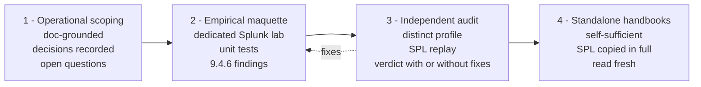

# Chapter 2 — Project method

> The method used to run a Splunk governance project matters as much
> as its deliverables. This chapter pins down the four-stage cycle
> that structures the project — scoping, maquette, independent
> audit, handbooks — and explains the discipline that goes with it:
> separation of roles, mandatory monitor-only, traceable findings.

## 1. Overview of the cycle

For each axis (RBAC, awareness, WLM…), the same cycle applies.



The cycle is **iterative**: a mixed audit verdict sends work back to
the maquette for fixes, then a re-audit. That is what makes it
possible to ship handbooks publishable with high confidence.

## 2. First stage — operational scoping

Scoping is a **doc-grounded document** that prepares the maquette.
It pins down:

- the **objective** of the axis (the expected operational outcome);
- the **perimeter** (who, what, how far);
- the **decisions recorded** (design choices made by reading the
  official documentation, Splunk blogs, community feedback);
- the **numeric calibrations** (quota tiers, CPU pool shares,
  monitor-only durations);
- the **diagrams** (role model, evaluation chain, articulation
  between axes);
- the **open questions** that will need arbitration (either by
  empirical measurement in the maquette or by human decision).

A good scoping document **decides** what can be decided from
documentation, and **explicitly designates** what must be tested in
the maquette. It does not mix the two.

A bad scoping document is a pile of best practices with no
decisions. You recognize it when it says "it probably would be best"
or "as recommended" without ever putting a number on the table.
Putting a number — even a provisional one — forces the conversation.
That is the primary function of scoping.

### Standard scoping outline

```
1. Objective
2. Perimeter
3. Founding observation (the why)
4. Operational synthesis of concepts (doc recap)
5. Decisions recorded (with sources)
6. Open questions to arbitrate
7. Diagrams (Mermaid)
8. Planned approach (remaining cycle)
```

Scoping is short: 30 to 60 pages depending on the axis, no more.
Beyond that, it doesn't get read.

## 3. Second stage — the empirical maquette

The maquette is a **dedicated Splunk lab** where every decision from
the scoping document is deployed and a battery of unit tests is
executed. This is where documentation meets a real binary.

### Dedicated lab

A single-instance Splunk Enterprise 9.4.6 lab is enough for the vast
majority of tests. For the indexer-side work (chapter 7), add a
cluster manager and at least one indexer peer.

The lab is **isolated** (no connection to production indexers), on a
**trial license** (60 days is more than enough for a cycle), and
**reproducible**: indexes, roles, users and configuration are
deployed from a versioned repo by script, never by hand.

### Unit tests

Every scoping decision becomes a test. A test record contains:

- the **documented hypothesis** (what the Splunk behavior is
  expected to be per the docs);
- the **procedure** (the REST call, the SPL, the UI action to
  execute);
- the **expected result**;
- the **observed result** (with timestamp and job id);
- the **verdict** (conforming, divergent, undetermined).

Divergent tests — where the 9.4.6 binary does something other than
the documentation says — become **empirical findings** that
chapter 4 documents.

### Why no direct enforce — monitor-only is mandatory

A strong discipline of the cycle: never deploy a rule in **enforce**
(blocking, killing, deleting) without first running a
**monitor-only** phase that measures what the rule would do if
applied.

For RBAC, monitor-only translates to deploying the new roles
**alongside** legacy roles, migrating no users, and observing the
distribution of effective capabilities.

For Workload Management, monitor-only translates to using
`action = alert` instead of `action = abort` or `action = move` —
the search runs, an event is written to `_audit`, but no placement
or termination action is applied.

The recommended monitor-only duration is **two to four working
weeks** depending on the axis — long enough to capture a weekly
cycle and a monthly cycle (financial close, end-of-month
reporting).

## 4. Third stage — the independent audit

The independent audit replays all or part of the maquette with a
**distinct profile** from the one that produced it. This is the key
to the cycle's robustness.

### Separation of roles

A strong discipline: **the auditor is not the author**. If the
maquette was produced by an "architect" profile, the audit is run by
a "sysadmin" or "developer" profile that replays the SPL and the
configuration without preconceptions about their correctness.

For a project run by a team, that translates to two distinct pairs.
For a project run with LLM agents, it translates to two distinct
sessions with distinct briefs.

### Replaying SPL on the live lab

The audit **replays every SPL on the live lab** (not a paper
review). If an SPL produces a syntax error, if a field doesn't
exist, if a command is rejected, that goes into the audit report.

An SPL that "runs" isn't enough — the auditor also checks that
**the output matches the intent** of the search. An SPL that
returns nothing when it should return something is just as suspect
as an SPL in error.

### Verdict

The audit returns a verdict in three colors:

- **Green** — every decision confirmed, every replayed SPL usable.
  Move to handbook.
- **Yellow — minor anomalies** — a few SPL to fix, one or two
  editorial recommendations. Short fix cycle (one or two days),
  re-audit, move to green.
- **Orange — major anomalies** — a structural decision is
  invalidated, a significant share of the SPL does not run. Back to
  scoping to reopen the decision.

The audit report is **public** within the project — it documents
the anomalies found, their severity, the fixes applied. That is
what lets a later reader trust the handbook produced.

## 5. Fourth stage — assembling the handbooks

Handbooks are the **usage deliverables** of the project. They
synthesize the scoping, the empirical material from the maquette
and the post-audit corrections into **self-sufficient** documents
designed for a specific reading target.

### Self-sufficiency

A handbook reads **without any other document**. It reproduces in
full the SPL and patterns its reader needs. It explains its
concepts without sending the reader elsewhere (except to go deeper
on a topic).

This **redundancy is intentional**. The editorial cost is offset by
the gain at deployment time: the operations team follows one
handbook without navigating five documents.

Audits verify the fidelity of the reproduction block by block — any
divergence between an SPL in the handbook and the original SPL in
the maquette goes on the record.

### Three angles per axis

For a given axis, three handbooks typically cover three distinct
entry angles:

- an **audit guide** for the sysadmin who inherits a platform with
  no model and has to decide what to do with it;
- a **progressive transformation handbook** for the team that has
  to bring a platform to production, with phases and gates;
- a **conceptual handbook** for the new reader who doesn't know the
  building blocks.

This guide consolidates the three angles per axis into a single
document (chapters 5 through 7) — for a new reader, the separation
of the three angles becomes a question of which section of a
chapter, not which file.

## 6. Why this discipline

The benefit of the cycle is threefold.

**First, it prevents a recommendation from being deployed on the
strength of documentation alone, without being tested.** The 9.4.6
findings (chapter 4) show that Splunk's documentation can diverge
from the binary — deploying without a maquette means discovering
the gap in production.

**Second, it produces traceable deliverables** where each
recommendation points to its evidence. For a reader new to the
project, that's what makes the decisions defensible: one can always
trace back to the maquette that tested the decision and to the
audit report that validated it.

**Third, it prepares contextualized deployment.** The operations
team for the real SHC does not have to invent the change
management. They follow a handbook step by step with its phase
gates and its documented rollback triggers. Operational risk is
contained.

## 7. Author/auditor separation — why it is non-negotiable

A recurring question: "why not have the same profile that wrote the
maquette audit it?" A few points.

**An author has invested in their own choices.** They spent time
building their decisions; they carry a cognitive bias to confirm
them. They see what they meant to write, not what they actually
wrote. This is well documented in the code-review and
editorial-review literature.

**An independent auditor has a different mandate.** Their mandate
is to **find gaps**. They are rewarded for detected anomalies, not
for reading fluency. That is exactly the profile a publishable
deliverable needs.

**An independent auditor replays what they read.** They do not
carry the memory of scoping choices; they do not skim an SPL they
"remember" working last week. They paste it into the lab and watch
what comes out. That is the only way to catch an SPL that has
drifted by mistake.

## 8. What the method produces

At the end of the cycle, for each axis:

- an **operational scoping** document published with its recorded
  decisions and its diagrams;
- a **maquette** running on the lab, reproducible by script, with
  its unit tests and their results;
- an **independent audit report** with its verdict and its fixes;
- between one and four **self-sufficient handbooks** for the
  identified reading profiles.

That is a significant editorial volume. On a four-axis project, the
corpus runs to roughly two hundred pages, plus the maquette and the
scripts.

The return on that editorial investment shows up at deployment: the
operations team does not have to invent the change. They follow the
handbook, validate each gate, apply the documented rollback
criterion if needed.

## 9. Adapting to your context

This method was not invented for Splunk. The cycle of operational
scoping → dedicated-lab maquette → independent audit → standalone
handbooks applies to any large analytics platform, to an
observability project, to an identity-compliance project, to the
hardening of a Kubernetes cluster.

For a smaller project (say, an SHC of a hundred users), the volume
scales down: a twenty-page scoping document, a half-day maquette,
an hour-long cross-review audit, a single handbook per axis. The
discipline stays the same; the volume adjusts.

## Sources

- [Splunk Validated Architectures](https://docs.splunk.com/Documentation/Splunk/latest/Architecture/WhatisaSplunkValidatedArchitecture)
- [Splunk Lantern — establishing a Splunk practice](https://lantern.splunk.com/)
- Code review and editorial review literature — see for instance
  Karl Wiegers, "Peer Reviews in Software," for the empirical
  justification of author/auditor separation.
