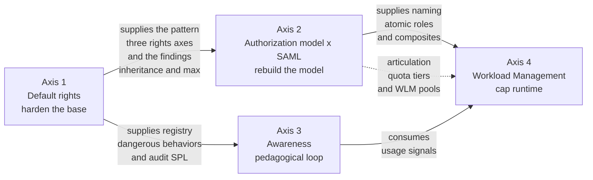

# Chapter 3 — The four structuring axes

> The governance project hinges on four coordinated axes that
> reinforce each other. This chapter introduces each one, shows how
> they articulate, and justifies the order in which to roll them out.

## 1. Overview

Each axis answers a distinct operational question. They are not
silos — they compose.

| Axis | Question answered | Main mechanism |
| --- | --- | --- |
| **1. Default rights** | What is dangerous in the native configuration, how to audit it, how to harden it? | Built-in role review, capability removal, quota redeclaration |
| **2. Authorization model** | How to structure roles so they are readable, composable, and automatically assignable via SAML? | Hybrid atomic / composite, quota tiers, SAML mapping |
| **3. Awareness** | How to explain to the user what they're doing wrong without blocking their work? | Audit searches, pedagogical notifications, KPIs |
| **4. Workload Management** | How to cap the resources a search consumes and arbitrate priority under pressure? | Pools, admission rules, workload rules, cgroups |

## 2. Axis 1 — Default rights

Axis 1 **hardens the base**. It identifies the capabilities at risk
(real or by habit) on built-in roles, cleanly redeclares quotas per
role, restructures the `user` and `power` roles so they no longer
spread capabilities beyond their business use, and lays an
auditability foundation.

### What you discover on this axis

- The `user` and `power` roles carry sensitive capabilities by
  default: `rtsearch`, `schedule_search`, `accelerate_search`,
  `accelerate_datamodel`, `embed_report` and several others.
- `importRoles` inheritance is **purely additive**: an inherited
  capability cannot be revoked in the child role.
- `srchJobsQuota` and friends **are not inherited** in the
  enforcement sense — the effective quota is the local value of the
  final role, or the system default (3 jobs) if nothing is
  declared.
- At runtime, a multi-role user gets the **`max()`** across quotas,
  never the min.
- The REST API can **silently break** the platform: a partial POST
  on a role is a destructive SET, DELETE on a built-in role is
  allowed without confirmation and cascade-breaks `admin`.

### What you ship on this axis

- A **registry of dangerous behaviors** classified by criticality
  (typically 20 to 25 behaviors).
- A **battery of ready-to-use audit SPL** (at least a dozen) to
  map the existing state.
- An **action plan** ordered in phases: audit, quick wins, role
  rebuild, explicit quotas, monitoring.
- **Operational guardrails** for role modification via REST
  (GET → merge → full POST pattern, snapshot first, two-step
  migration).

The detail lives in **chapter 5** (RBAC guide).

## 3. Axis 2 — Authorization model x SAML

Axis 2 **rebuilds the model**. It defines a matrix of
single-responsibility atomic roles that combine into business
composites via Splunk's native `importRoles` mechanism. It also
defines how SAML provisioning articulates with these roles.

### The three-orthogonal-axes pattern

The reference model splits responsibility along three orthogonal
axes:

- `data_<scope>`: index access (1 role = 1 data scope).
- `feature_<cap>`: Splunk capabilities (1 role = 1 functional
  capacity, e.g. `feature_scheduler` for `schedule_search`).
- `app_<prod>`: access to the knowledge objects of an application
  production via ACLs.

A business composite role (`business_<profile>_<scope>`,
`owner_app_<prod>`, `admin_iam`, `admin_ops`) **carries no
capability of its own**: it `importRoles` the necessary atomics,
**redeclares its quotas locally** at the desired tier (`base` /
`plus` / `max`), and nothing else.

### Hybrid SAML provisioning

Role assignment uses two mechanisms that combine:

- **Auto-mapping** (`enableAutoMappedRoles=true`): an IdP group
  whose name is exactly equal to a Splunk role triggers the
  assignment. Convenient for high-volume business roles.
- **Explicit mapping** (`roleMap_<authSettings>`): a
  hand-maintained correspondence table. Mandatory for sensitive
  administrative roles, which are excluded from auto-mapping via
  `excludedAutoMappedRoles`.

A **floor role** (`role_floor`) is granted to every authenticated
user via an explicitly mapped "all-users" IdP group.

### Account lifecycle

The project recommends a two-stage policy aligned with IAM
references (NIST SP 800-63B, Microsoft Entra, Okta):

- **Deactivation** after 90 days of inactivity (remove all roles
  except a minimal `role_disabled`).
- **Hard delete** after an additional 90 days of quarantine, with
  treatment of orphan knowledge objects (private ones deleted,
  shared ones reassigned to a service account or to a delegated
  admin).

The detail lives in **chapter 5** (RBAC guide).

## 4. Axis 3 — Awareness and pedagogical monitoring

Axis 3 **introduces the pedagogical loop**. It transforms the
risky behaviors detected by audit searches into two streams: a SOC
stream for critical behaviors (destructive deletion,
exfiltration), and a pedagogical stream for risky behaviors
(nullified filter, unjustified real-time, scan without a time
bound).

The user receives the observation, a short explanation of the
risk, and the recommended alternative — **without their search
being blocked**.

### Three channels that combine

- **Splunk Web Messages** (native in-UI notification) — the
  low-friction pillar.
- **Email digest** (a weekly recap of behaviors observed during
  the week for a given user).
- **SOC ticket** (only for critical behaviors — event deletion,
  secret exfiltration).

### Alert fatigue mitigation

A **deduplication** mechanism on a sliding window (typically seven
days) keyed on `(behavior, role)` or `(behavior, user)` prevents
the user from getting the same message three times a day.
Deduplication is by **role** (the collective behavior), not by raw
event.

### Five measurable KPIs

- **K1** — repeat rate (a user who repeats the same behavior more
  than 30 days later).
- **K2** — time to correction (the average delay between
  notification and an observable stop in the user's behavior).
- **K3** — occurrence count per behavior per week (platform
  trend).
- **K4** — coverage (the percentage of high-severity behaviors
  actually routed to a pedagogical channel).
- **K5** — open rate (a proxy measured via the Splunk Web Messages
  native channel when available).

### The pilot

The awareness rollout starts on a **pilot application production**
chosen along five criteria:

- a measurable concentration of risky behaviors in the baseline;
- a willing application team with an engaged app owner;
- an intermediate headcount of fifty to one hundred fifty users;
- moderate business criticality (avoid in pilot a sensitive
  production where a misfired pedagogical nudge would be poorly
  received);
- observable tooling (maintained saved searches and alerts).

The detail of axis 3 is treated **transversally** across chapters 5
(audit searches) and 6 (WLM searches), with the behavior registry
consolidated in **chapter 8**.

## 5. Axis 4 — Workload Management

Axis 4 **caps at runtime** what the previous layers cannot cap.

Per-role quotas cap the **number of searches** a user can launch.
WLM caps the **CPU and memory resources** an in-flight search can
consume, and arbitrates **priority** under instantaneous pressure.

### The three-layer stack

| Layer | Question answered | Mechanism |
| --- | --- | --- |
| **0 — Capabilities** | Who is allowed to do what? | `authorize.conf`, app/object ACLs |
| **1 — Per-role quotas** | How many concurrent jobs can a user launch? | `srchJobsQuota`, `rtSrchJobsQuota`, `srchDiskQuota`, redeclared locally |
| **2 — Workload Management** | How much CPU/memory can an in-flight job consume? | `workload_pools.conf`, `workload_rules.conf` |

Layer 2 does not replace layer 1 — it complements it. The
by-construction fragility of layer 1 (the multi-role `max()`
effect) is precisely what layer 2 compensates for: WLM does not
reason on the number of jobs declared at role creation, but on the
**resources actually consumed** by a search in flight.

### Five pools in the `search` category

The pattern recommended for an SHC serving a thousand users:

| Pool | `cpu_weight` | `mem_weight` | Purpose |
| --- | --- | --- | --- |
| `admin` | 15 | 15 | Reserved for admin roles so a saturation incident does not block diagnostics |
| `scheduled` | 30 | 30 | Scheduled searches (saved searches, alerts) |
| `ad_hoc` | 35 | 35 | Interactive user searches (`default_category_pool=1`) |
| `bulk` | 10 | 10 | Long searches, exports, production dashboards |
| `accel` | 10 | 10 | Accelerations (accelerated data models, summary indexing) |

On top of those go **two mandatory default pools** (`ingest_default`
and `misc_default`) in the `ingest` and `misc` categories — without
them, splunkd refuses to activate WLM (empirical finding F-WLM-01,
chapter 4).

### Eight prioritized WLM rules

WLM rules combine implicit placement (by role, by `search_type`,
etc.) and monitoring actions (`abort`, `move`, `alert`). The
evaluation order is strict and defined by `[workload_rules_order]`
in first-match-wins.

The detail of the eight reference rules, the pool percentages and
the 9.4.6 findings sits in **chapter 6** (WLM search heads) and
**chapter 7** (WLM indexers).

## 6. Rollout order

The order in which to roll out the axes is not arbitrary. Three
rules constrain it.

### Rule 1 — Axis 1 before axis 2

The atomic-role matrix of axis 2 builds on hardening decisions
made in axis 1 (removing `rtsearch` from `power`, redeclaring
quotas, etc.). Without those decisions, the new model is built on
an unstable base.

### Rule 2 — Axis 2 before axis 4

WLM rules target **roles**: "cap real-time for roles not in
`rt_authorized_*`," "protect the admin pool for `role=admin_iam`."
Without stable role naming, those rules are fragile; rolling them
out before the RBAC rebuild guarantees rewriting them twice.

A secondary reason: per-role quotas are the layer 1 that WLM
layer 2 builds on. Applying WLM before quotas are redeclared makes
incident interpretation ambiguous (quota saturation or
under-sized pool?).

### Rule 3 — Axis 3 in parallel with axes 1 and 2

Axis 3 can roll out in parallel with axes 1 and 2 — it
**consumes** their deliverables (audit searches from axis 1, the
role model from axis 2) but does not block them.

The awareness pilot can start as soon as axis 1 ships the audit
search battery and axis 2 ships its scoping document.

### For indexers: monitor-only first

On the indexer side (chapter 7), the project also makes a call:
**start with indexers in monitor-only before the search head**.
Regulating through search heads alone is insufficient — the
ingestion pressure on indexers is borne by other shared SHCs, and a
miscalibrated indexer pool can swallow the headroom of the SHC
being governed.

## 7. Articulation between axes — explicit junctions

What sets this approach apart from a plain list of best practices
is that at every junction between two axes the articulation is
made explicit:

- **Where** axis 2 redeclares the quotas that axis 1 calls
  non-inherited (every composite carries its local quotas, never
  the atomics).
- **How** the numeric quota tiers of axis 2 compose with the CPU
  shares of the axis-4 pools (a `consultative` user at
  `quota_base=5` who lands in the `ad_hoc=35%` pool consumes up to
  five concurrent jobs, each capped at its share of the pool).
- **When** in the flow a user triggers a SOC alert or a
  pedagogical nudge (based on the criticality of the behavior
  detected by the audit SPL).

These articulations prevent one axis's decision from being
invalidated by another at deployment time.

## 8. What this project does not cover

The usage governance project does not substitute for:

- the **design** of an SHC (Splunk Validated Architectures,
  CPU/RAM/storage sizing, site/peer distribution);
- **data management** (retention, summary indexing, data models —
  except as consumers of rights);
- **host system security** (OS hardening, encryption, certificate
  rotation);
- **ingestion** (forwarders, parsing, CIM normalization).

These topics belong to their own projects and their own
documentation.

## Sources

- [Splunk Securing 9.4 — Roles and capabilities](https://help.splunk.com/en/splunk-enterprise/administer/secure-splunk-enterprise/9.4/define-roles-on-the-splunk-platform/about-defining-roles-with-capabilities)
- [Splunk Admin 9.4 — Workload management overview](https://help.splunk.com/en/splunk-enterprise/administer/manage-workloads/9.4/workload-management-overview)
- [Splunk Admin 9.4 — SAML SSO](https://help.splunk.com/en/splunk-enterprise/administer/manage-users-and-security/9.4/use-saml-as-an-authentication-scheme-for-single-sign-on)
- [Splunk Lantern — practitioner-oriented best practices](https://lantern.splunk.com/)
