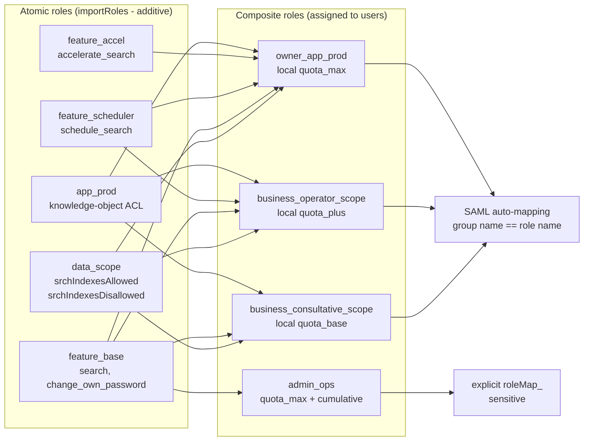
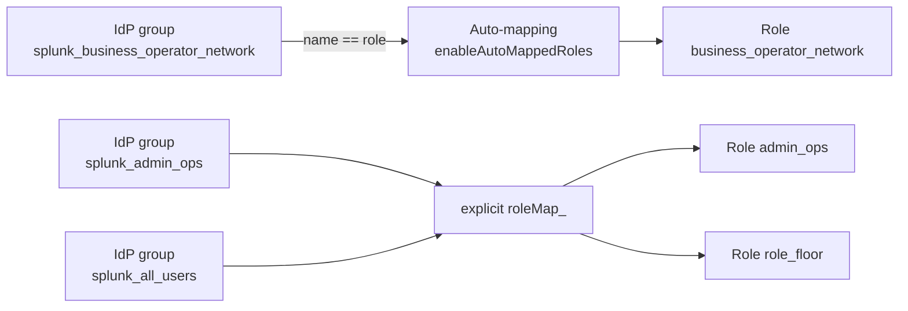

# Chapter 5 — RBAC guide: audit, design, deployment

> This chapter is the full operational guide for the authorization
> work. It covers pre-rebuild audit of an existing SHC, the design
> of the hybrid atomic/composite model, the SAML articulation, the
> progressive deployment with its gates, and steady-state ongoing
> monitoring.

## 1. Quick framing — the mental model

### The Splunk role

A Splunk role (`[role_<name>]` in `authorize.conf`) carries five
families of attributes:

- **Capabilities**: the list of atomic permissions (`search`,
  `schedule_search`, `rtsearch`, `edit_user`, `admin_all_objects`,
  etc.). About a hundred capabilities exist in 9.4; **roughly
  fifteen are sensitive** and concentrate the governance stake.
- **Index access**: `srchIndexesAllowed` (allow list),
  `srchIndexesDisallowed` (deny list, absolute precedence),
  `srchIndexesDefault` (the default indexes when no `index=` is
  given).
- **Search filter**: `srchFilter`, an SPL fragment automatically
  appended to every search of the role.
- **Quotas**: `srchJobsQuota`, `rtSrchJobsQuota`, `srchDiskQuota`,
  `srchTimeWin`, plus the cumulative variants.
- **Inheritance**: `importRoles` lists parent roles.

App and knowledge-object ACLs live in the **metadata** of apps
(`metadata/default.meta`, `metadata/local.meta`), not in
`authorize.conf`. That is the second rights layer.

### The four structuring 9.4.6 behaviors

Four behaviors change how RBAC reads and how it is designed —
they are detailed in chapter 4 and recapped here.

1. **`importRoles` is purely additive** (F-RBAC-01) — an inherited
   capability cannot be revoked.
2. **Quotas are not inherited** (F-RBAC-02) — at runtime, the
   multi-role effective value is the **`max()`**.
3. **`srchIndexesAllowed=*` does not cover the internals**
   (F-RBAC-03); `srchIndexesDisallowed` takes precedence and
   inherits (F-RBAC-04).
4. **App ACL `write` without `read` is invisible** (F-RBAC-07).

### Why a hybrid model

A model where each business team carries an **opaque** composite
role drifts quickly: people add a capability, an index, an ACL for
one use case; nothing gets removed (F-RBAC-01). Two years later,
nobody knows why the business role still carries `rtsearch`.

The hybrid model spreads responsibility across **three orthogonal
axes**:

- `data_<scope>`: index access (1 role = 1 scope).
- `feature_<cap>`: Splunk capabilities (1 role = 1 capacity).
- `app_<prod>`: app access via its ACL.

A composite role (`business_<profile>_<scope>`, `owner_app_<prod>`,
`admin_iam` / `admin_ops`) **carries no capability of its own**:
it `importRoles` the necessary atomics, **redeclares its quotas
locally** at the desired tier, and nothing else.

## 2. Pre-rebuild audit

### Choose the window

- **Inventory of roles, users, ACLs**: snapshot (read-only REST,
  five minutes).
- **User usage** (`_audit action=search`): minimum 7 working days,
  ideally 30 days.
- **Inactive accounts**: 90-day window (IAM reference).
- Exclude abnormal periods (incident, prod freeze, recent
  migration).

### Collect in five passes

| Pass | Question answered | Searches |
| --- | --- | --- |
| 1. Structural cartography | What roles, what inheritance chains, what built-in roles modified? | R.1.01, R.1.07, R.1.08 |
| 2. Sensitive capabilities | What at-risk capabilities granted to whom? | R.1.02 |
| 3. Users and usage | Who holds what, who uses what? | R.1.03, R.1.04, R.1.09 |
| 4. Indexes and ACLs | What indexes allowed, what permissive ACLs? | R.1.05, R.1.06 |
| 5. Scoring and prioritization | Which roles to rebuild first? | R.1.10 |

### R.1.01 — Role inventory with `importRoles` and capabilities

**Goal.** Produce the source table for any RBAC audit: one role per
line, with its number of local capabilities, inherited capabilities,
and number of parents.

```spl
| rest /services/authorization/roles splunk_server=local
| eval nb_caps_locales = mvcount(capabilities)
| eval nb_caps_heritees = mvcount(imported_capabilities)
| eval nb_parents = mvcount(imported_roles)
| table title imported_roles nb_caps_locales nb_caps_heritees nb_parents
| sort title
```

**Interpretation.** A business composite should have
`nb_caps_locales` empty (composites carry no capability of their
own). A role with `nb_parents=0` and many `nb_caps_locales` is an
atomic or a legacy. A composite with `nb_caps_locales>0` is a
drift to fix.

### R.1.02 — Top at-risk capabilities by role

```spl
| rest /services/authorization/roles splunk_server=local
| eval all_caps = mvappend(capabilities, imported_capabilities)
| mvexpand all_caps
| search all_caps IN (
    "rtsearch","schedule_search","schedule_rtsearch",
    "accelerate_search","accelerate_datamodel","embed_report",
    "delete_by_keyword","list_storage_passwords","edit_storage_passwords",
    "edit_user","edit_roles","change_authentication","admin_all_objects",
    "rest_properties_set","install_apps","restart_splunkd")
| stats values(all_caps) as caps_a_risque count by title
| sort -count title
```

**Interpretation.** Any non-`admin` role carrying more than three
at-risk capabilities is a candidate for splitting into
`feature_*` atomics. The observation "`power` carries six at-risk
capabilities by default" is the entry point for the hardening quick
win.

### R.1.03 — User inventory with direct roles

```spl
| rest /services/authentication/users splunk_server=local
| eval nb_roles = mvcount(roles)
| table title realname roles nb_roles type
| sort -nb_roles title
```

**Interpretation.** A user with more than two direct roles is
probably to be redesigned as a single composite. `type=Splunk`
(local) accounts deserve a review for migration or legitimacy
(service account).

### R.1.04 — Real usage: searches per user, 30 days

```spl
search index=_audit action=search info=granted earliest=-30d
| stats count as nb_searches
        dc(eval(coalesce(search_id, sid))) as nb_jobs
        values(roles_list) as roles_observed
        by user
| sort -nb_searches
```

**Interpretation.** Cross-references theoretical rights (R.1.03)
and real usage. A user with a rich role and `nb_searches=0` over
30 days is a candidate for downgrade. A user with intense usage
(`nb_searches > 1000/day`) is a candidate for an upper quota tier.

### R.1.05 — Indexes actually used vs. allowed per role

```spl
search index=_audit action=search info=granted earliest=-7d
| rex max_match=10 "search_index_list=\"(?<idx>[^\"]+)\""
| stats values(idx) as idx_observed by user
| join type=left user [
    | rest /services/authentication/users splunk_server=local
    | rename title as user
    | fields user roles]
| table user roles idx_observed
```

**Interpretation.** If `idx_observed` is bounded to a subset of
the indexes allowed by the user's roles, the `data_*` scope can be
tightened. If users of the same role have similar `idx_observed`,
the natural pattern of a `data_<scope>` atomic emerges.

### R.1.06 — Permissive app and knowledge-object ACLs

```spl
| rest /servicesNS/-/-/saved/searches splunk_server=local
| rename "eai:acl.owner" as owner "eai:acl.sharing" as sharing
        "eai:acl.perms.read" as perms_read
        "eai:acl.perms.write" as perms_write
        "eai:acl.app" as app
| where sharing="global" OR mvfind(perms_read, "*")>=0
| table app title owner sharing perms_read perms_write
| sort app title
```

**Interpretation.** Any row with `sharing=global` and
`perms_read=*` is a visibility leak. Any saved search whose
`owner` is a disabled or deleted user is an orphan to handle
(reassign to a service account or delete if private).

### R.1.07 — Modified built-ins

```spl
| rest /services/authorization/roles splunk_server=local
| where title IN ("admin","power","user","can_delete")
| eval is_modified = if(
    title="admin" AND mvcount(capabilities)!=<DEFAULT_ADMIN_CAPS>,"oui",
    title="power" AND mvcount(capabilities)!=<DEFAULT_POWER_CAPS>,"oui",
    title="user"  AND mvcount(capabilities)!=<DEFAULT_USER_CAPS>,"oui",
    true(), "non")
| table title capabilities imported_roles srchIndexesAllowed srchFilter is_modified
```

**Interpretation.** On a clean Splunk 9.4.6, `admin.imported_roles
= ['power','user']` and `power.imported_roles = ['user']`. Any
divergence points to a local override worth investigating.

### R.1.08 — Effective quotas per role (local declaration)

```spl
| rest /services/authorization/roles splunk_server=local
| table title srchJobsQuota rtSrchJobsQuota srchDiskQuota srchTimeWin
        cumulativeSrchJobsQuota cumulativeRTSrchJobsQuota
        imported_srchJobsQuota imported_rtSrchJobsQuota
| sort title
```

**Interpretation (recap of chapter 4, F-RBAC-02).** The
`imported_*` columns are **purely informational**. The value
actually applied to a user is the **local** value of their directly
assigned role, or the system default (3 jobs) if no local value is
declared. At runtime in a multi-role situation, the effective value
is `max()`.

### R.1.09 — Local accounts surviving a SAML cutover

```spl
| rest /services/authentication/users splunk_server=local
| where type="Splunk"
| join type=left title [
    search index=_audit action=login info=succeeded earliest=-90d
    | stats latest(_time) as last_t by user
    | rename user as title]
| eval inactive_days = round((now() - last_t) / 86400, 0)
| where inactive_days > 90 OR isnull(last_t)
| table title realname roles inactive_days
| sort -inactive_days
```

**Interpretation.** Local accounts candidates for purge (SAML
lifecycle — §5 below) or to isolate as technical accounts.

### R.1.10 — Risk score per role

```spl
| rest /services/authorization/roles splunk_server=local
| eval all_caps = mvappend(capabilities, imported_capabilities)
| eval nb_caps_risque = mvcount(mvfilter(match(all_caps,
    "rtsearch|schedule_search|schedule_rtsearch|accelerate_|embed_report|delete_by_keyword|list_storage_passwords|edit_user|edit_roles|change_authentication|admin_all_objects|install_apps|restart_splunkd")))
| eval is_srchFilter_star = if(srchFilter="*", 1, 0)
| eval score = 3*nb_caps_risque + 2*is_srchFilter_star
| where score > 0
| table title nb_caps_risque is_srchFilter_star score
| sort -score
```

**Interpretation.** Score > 30: priority rebuild. 10 < Score ≤ 30:
second wave, in parallel with the target composites. Score ≤ 10:
leave in place until the target composite is in motion.

## 3. Target design pattern

### Hybrid-model diagram



### The three orthogonal axes

| Axis | Prefix | Carries | Does not carry |
| --- | --- | --- | --- |
| **Data** | `data_<scope>` | `srchIndexesAllowed`, `srchIndexesDisallowed`, `srchFilter` | no capabilities, no quotas, no app ACLs |
| **Capacities** | `feature_<cap>` | one or few Splunk capability(ies) | no indexes, no quotas, no app ACLs |
| **Applications** | `app_<prod>` | app access via knowledge-object ACLs (metadata) | not in `authorize.conf`, no indexes, no capabilities |

### Numeric quota tiers

| Parameter | `quota_base` | `quota_plus` | `quota_max` |
| --- | --- | --- | --- |
| `srchJobsQuota` | 5 | 15 | 30 |
| `srchDiskQuota` (MB) | 500 | 2 000 | 5 000 |
| `srchTimeWin` (s) | 86 400 (1 d) | 604 800 (7 d) | 2 592 000 (30 d) |
| `rtSrchJobsQuota` | 0 (no RT) | 2 | 6 |
| `cumulativeSrchJobsQuota` | 0 (off) | 0 (off) | 0 or 200 (admin) |

> These tiers are the state of the art for an SHC on the order of
> a thousand users. **Adapt to context** — calibrate on the real
> usage baseline measured over two to four weeks (ad-hoc
> concurrency, average search duration).

### Expected distribution

Four typical profiles cover the vast majority of usage.

| Profile | Typical composition | Tier | Expected volume |
| --- | --- | --- | --- |
| **Consultative** (read-only) | `data_<scope>` + `feature_base` + `app_<prod>` (read) | `quota_base` | ~70 % |
| **Power user** (schedules) | `data_<scope>` + `feature_base` + `feature_scheduler` + `app_<prod>` | `quota_plus` | ~20 % |
| **Application owner** (writes) | `data_<scope>` + `feature_base` + `feature_scheduler` + `app_<prod>` (read+rw) | `quota_max` | ~5 % |
| **Delegated admin** | `feature_base` + `feature_iam` / `feature_ops` | `quota_max` + cumulative | ~1 % |

### Configuration example

```ini
# Atomics (never assigned directly to users)

[role_data_network]
srchIndexesAllowed = idx_network;idx_network_*
srchIndexesDisallowed = _audit

[role_feature_base]
capabilities = search;change_own_password;rest_apps_view

[role_feature_scheduler]
capabilities = schedule_search

[role_app_network]
# ACL configured in app metadata, not here.
# This role exists to be referenced by perms.read / perms.write.

[role_quota_plus]
# Tier atomic — NOT applied via importRoles
# (quotas are not inherited, F-RBAC-02).
# Exists to document the tier; the value is redeclared
# in every composite that claims the tier.
srchJobsQuota = 15

# Composite (assigned to users via SAML)

[role_business_operator_network]
importRoles = data_network;feature_base;feature_scheduler;app_network

# Quotas REDECLARED LOCALLY (not inherited)
srchJobsQuota = 15
srchDiskQuota = 2000
srchTimeWin = 604800
rtSrchJobsQuota = 2
```

## 4. SAML articulation

### Hybrid mechanism

```ini
[saml]
authSettings = my_saml_provider
enableAutoMappedRoles = true
excludedAutoMappedRoles = admin;admin_iam;admin_ops
defaultRolesIfMissing = role_no_access

[my_saml_provider]
# Explicit mapping for sensitive roles and the floor
roleMap_my_saml_provider = admin_iam:splunk_admin_iam;admin_ops:splunk_admin_ops;role_floor:splunk_all_users
```

### Assignment diagram



### Guardrails (chapter 4 recap)

- **`excludedAutoMappedRoles=admin;admin_iam;admin_ops`**: exclude
  powerful roles from auto-mapping (F-SAML-02).
- **`defaultRolesIfMissing=role_no_access`**: if no role is
  mapped, fall back to a minimal role. **Never `admin`**
  (F-SAML-01).
- **No wildcard on groups** (F-SAML-03). The floor role goes
  through an "all-users" IdP group, mapped explicitly.

### Account lifecycle

A two-stage policy aligned with the IAM references (NIST
SP 800-63B, Microsoft Entra ID, Okta).

| Stage | Trigger | Action | Window |
| --- | --- | --- | --- |
| **Deactivation** | SAML account with no successful login in 90 d | POST `/services/authentication/users/<u>` — strip all roles except `role_disabled` (empty capabilities, no index). Account kept, object ACLs intact, login impossible. | 90 d of inactivity |
| **Hard delete** | Deactivated account inactive for an additional 90 d | Handle orphan knowledge objects (private deleted, app-shared reassigned to `svc_<prod>`, globally shared reassigned to `admin_ops` + SOC alert), then `DELETE /services/authentication/users/<u>` | 180 d total |

## 5. Progressive rollout — seven phases

### Phase 0 — Audit (1 to 5 days)

Run R.1.01 through R.1.10. Produce:

- audit report (matrix of roles × at-risk capabilities × score);
- list of local accounts candidates for purge or for isolation as
  technical;
- inventory of application productions × typical profiles.

Gate criterion: the report is reviewed and validated by the
sponsoring team.

### Phase 1 — Atomics placed alongside legacy (1 to 2 weeks)

Deploy the `data_*`, `feature_*`, `app_*` atomics without touching
legacy roles or users. The new atomics coexist with the old model.

Gate criterion: `| rest /services/authorization/roles` shows every
target atomic. Production users are unchanged.

### Phase 2 — Composites assembled (1 week)

Build the target composites (`business_consultative_<scope>`,
`business_operator_<scope>`, `owner_app_<prod>`, `admin_iam`,
`admin_ops`) by `importRoles` of the atomics + local quota
redeclaration at the desired tier.

No user migration yet. Composites exist empty.

Gate criterion: every composite is deployed with the correct
imported atomics and the correct local quotas. A verification SPL
(R.2 — next section) confirms coherence.

### Phase 3 — Pilot (2 to 4 weeks)

Choose a **pilot application production** along five criteria:

- a measurable concentration of risky behaviors (material to learn
  from);
- a willing application team with an engaged app owner;
- an intermediate headcount of fifty to one hundred fifty users;
- moderate business criticality (avoid a sensitive production in
  pilot);
- observable tooling (maintained saved searches and alerts).

Migrate pilot users to the target composites in **dual assignment**
(target composite + old role). Observe the effective capability
distribution and the behavior KPIs.

Gate criterion: by the end of the window, no unresolved access
incident over 30 minutes, KPIs K1 and K2 (chapter 8) measurable.

### Phase 4 — Migration waves (4 to 12 weeks)

Migrate application productions in waves of five to ten, each
wave respecting the criteria: application team briefed, active
support, migration window announced.

At each wave, strip the old legacy roles from migrated users (do
not let dual assignment accumulate).

Gate criterion: at the end, 100 % of users carry a target
composite and no legacy role remains beyond the historical
`admin`.

### Phase 5 — SAML cutover (1 to 2 weeks)

Enable SAML auto-mapping on the `splunk_<composite>` →
`<composite>` naming. Deploy the explicit mapping for sensitive
roles (`admin_iam`, `admin_ops`, `role_floor`). Disable manual
assignment.

Gate criterion: new users receive their roles via SAML only.
R.3.09 (SAML vs. local ratio, see §6) > 95 %.

### Phase 6 — Legacy decommissioning (2 to 4 weeks)

Empty the legacy roles of their capabilities (make them empty
shells). Monitor during the window that no one still uses them
(R.1.04 on legacy roles). If the window is calm, delete the
legacy roles in **two-step** mode:

1. Reassign any remaining users (residual cases).
2. Delete the old role.

Gate criterion: `| rest /services/authorization/roles | search
title=role_legacy_*` returns nothing.

### Phase 7 — Industrialization (continuous)

Deploy ongoing monitoring (R.3 searches, §6) as scheduled saved
searches + alerts. Activate the SAML lifecycle (automated
deactivations at 90 d and hard deletes at 180 d).

## 6. Ongoing monitoring

### R.3.01 — Role creation / modification off-process

```spl
search index=_audit (action=edit_role OR action=create_role) earliest=-7d
| table _time user action role old_capabilities new_capabilities
| sort -_time
```

Schedule as a saved search (hourly) with a whitelist:
`where NOT user IN ("svc_deployer", "splunk-system-user")`. Any
off-process row = alert.

### R.3.02 — Direct role assignment (SAML bypass)

```spl
search index=_audit action=edit_user earliest=-7d
| rex "username=(?<u_target>[^\s,]+)"
| rex "roles_to_add=\"(?<roles_added>[^\"]*)\""
| where isnotnull(roles_added) AND roles_added!=""
| eval is_sensitive = if(match(roles_added, "(admin|can_delete|admin_iam|admin_ops|owner_)"), 1, 0)
| table _time user u_target roles_added is_sensitive
| sort -_time
```

### R.3.03 — `admin*` assignment off-process

```spl
search index=_audit (action=edit_user OR action=edit_role) earliest=-30d
  (new_roles=*admin* OR role=admin* OR role=can_delete)
| table _time user action role username new_roles
| sort -_time
```

### R.3.04 — Permissive `defaultRolesIfMissing`

```spl
| rest /services/authentication/providers/services splunk_server=local
| where authType="SAML"
| eval verdict = case(
    defaultRolesIfMissing="role_no_access", "OK",
    defaultRolesIfMissing IN ("admin","power","user","metier_*"), "DANGER",
    isnull(defaultRolesIfMissing) OR defaultRolesIfMissing="", "VIDE",
    true(), "REVOIR")
| where verdict!="OK"
```

### R.3.05 — Accounts inactive > 90 d

```spl
| rest /services/authentication/users splunk_server=local
| join type=left title [
    search index=_audit action=login info=succeeded earliest=-90d
    | stats latest(_time) as last_t by user
    | rename user as title]
| eval inactive_days = round((now() - coalesce(last_t, strptime(created,"%Y-%m-%dT%H:%M:%S"))) / 86400, 0)
| where inactive_days > 90 AND (type="saml" OR type="LDAP")
| table title type roles realname inactive_days
| sort -inactive_days
```

Schedule as a weekly saved search sent to the IAM team.

### R.3.06 — Monthly inventory of access per profile

```spl
| rest /services/authentication/users splunk_server=local
| eval profil = case(
    mvfind(roles, "admin_iam")>=0 OR mvfind(roles, "admin_ops")>=0, "admin_delegue",
    mvcount(mvfilter(match(roles, "^owner_")))>0, "owner_app",
    mvcount(mvfilter(match(roles, "^metier_")))>0, "metier",
    mvfind(roles, "role_floor")>=0, "plancher",
    true(), "hors_modele")
| stats count values(title) as users by profil
| sort profil
```

**Target**: `admin_delegue < 1 %`, `owner_app ≈ 5 %`,
`metier ≈ 94 %`, `plancher = 100 %`. `hors_modele > 1 %` after
stabilization = drift.

### R.3.07 — Knowledge objects whose owner no longer exists

```spl
| rest /servicesNS/-/-/saved/searches splunk_server=local
| rename "eai:acl.owner" as acl_owner
| join type=left acl_owner [
    | rest /services/authentication/users splunk_server=local
    | rename title as acl_owner
    | fields acl_owner
    | eval user_exists=1]
| where isnull(user_exists) AND acl_owner!="nobody" AND acl_owner!="system"
| stats count by acl_owner
| sort -count
```

### R.3.08 — At-risk capabilities granted but never exercised

```spl
| rest /services/authorization/roles splunk_server=local
| eval all_caps = mvappend(capabilities, imported_capabilities)
| eval has_rtsearch = if(mvfind(all_caps, "rtsearch")>=0, 1, 0)
| eval has_schedule_rt = if(mvfind(all_caps, "schedule_rtsearch")>=0, 1, 0)
| where has_rtsearch=1 OR has_schedule_rt=1
| join type=left title [
    search index=_audit action=search search_mode=realtime earliest=-30d
    | stats count by user
    | rename user as title
    | eval used_rt=1]
| eval candidat_retrait = if(isnull(used_rt), "OUI", "NON")
| table title has_rtsearch has_schedule_rt candidat_retrait
```

**Interpretation.** Any role at `candidat_retrait=OUI` that
carries `rtsearch` or `schedule_rtsearch` is a candidate for
splitting — move the capability into `feature_rt` /
`feature_scheduler_rt` and import it only into composites whose
users need it.

### R.3.09 — SAML vs. local ratio

```spl
| rest /services/authentication/users splunk_server=local
| eval is_saml = if(type="saml", 1, 0)
| eval is_local = if(type="Splunk" OR type="", 1, 0)
| stats count count(eval(is_saml=1)) as via_saml count(eval(is_local=1)) as via_local
| eval ratio_saml = round(via_saml/count*100, 1)
```

**Target**: ratio > 95 %. A drop below 90 % = drift (users
created locally by hand).

### R.3.10 — Quota tier distribution

```spl
| rest /services/authorization/roles splunk_server=local
| where match(title, "^metier_") OR match(title, "^owner_") OR match(title, "^quota_")
| eval palier = case(
    match(title, "_max$") OR mvfind(imported_roles, "quota_max")>=0, "max",
    match(title, "_plus$") OR mvfind(imported_roles, "quota_plus")>=0, "plus",
    match(title, "_base$") OR mvfind(imported_roles, "quota_base")>=0, "base",
    true(), "?")
| stats count values(title) as roles by palier srchJobsQuota
| sort palier srchJobsQuota
```

**Interpretation.** Any row where the `srchJobsQuota` value does
not match the expected tier = a miswired composite.

## 7. Operational guardrails

### Role modification pattern via REST

Mandatory pattern: **GET → merge → full POST** (recap F-RBAC-08).

```bash
# 1) Read current state
curl -sk -u <admin>:<pw> \
  "https://<sh>:8089/services/authorization/roles/<role>?output_mode=json" > current.json

# 2) Build the NEW COMPLETE capability list on the client side
# (with jq, a Python script, or equivalent).
# NEVER POST with only the capabilities to add.

# 3) POST with the full list of capabilities + properties
curl -sk -u <admin>:<pw> -X POST \
  "https://<sh>:8089/services/authorization/roles/<role>" \
  -d "capabilities=cap1" -d "capabilities=cap2" -d "capabilities=cap3" \
  -d "srchIndexesAllowed=idx1" -d "srchJobsQuota=3"
```

### Snapshot before any structural change

```bash
# Full snapshot (script this in the change procedure)
for role in $(curl -sk -u <admin>:<pw> "https://<sh>:8089/services/authorization/roles?output_mode=json" \
  | jq -r '.entry[].name'); do
  curl -sk -u <admin>:<pw> "https://<sh>:8089/services/authorization/roles/${role}?output_mode=json" \
    > "snapshot/${role}.json"
done
```

### Two-step role migration

1. **Create** the new role.
2. **Reassign** users via `POST
   /services/authentication/users/<user>` with the new `roles`
   list.
3. **Only then delete** the old role.

(Recap F-RBAC-08: DELETE of a role in use silently cascade-deletes
its users.)

## 8. Traps to avoid — recap

| # | Trap | Consequence | Reference |
| --- | --- | --- | --- |
| P1 | Believing `importRoles` allows removing a capability | `<cap>=disabled` is a silent no-op | F-RBAC-01 |
| P2 | Believing quotas stack or inherit | `imported_*` ignored, multi-role `max()` | F-RBAC-02 |
| P3 | Believing `srchIndexesAllowed=*` covers internals | `*` does not include `_*`, use `*;_*` or enumerate | F-RBAC-03 |
| P4 | Using `srchFilter=*` | OR combination nullifies restrictive filters | F-RBAC-06 |
| P5 | App ACL `write` without `read` | invisible 404 object | F-RBAC-07 |
| P6 | Auto-mapping `admin_*` | escalation via group homonymy | F-SAML-02 |
| P7 | `admin` in `defaultRolesIfMissing` | temporary SAML escalation | F-SAML-01 |
| P8 | Multiplying atomics (one per index, one per cap) | unmanageable matrix | design |
| P9 | Setting tiers too low | user saturation, workarounds | calibration |
| P10 | Forgetting the SAML lifecycle | dead accounts pile up | lifecycle |

## Sources

- [Splunk Securing 9.4 — Roles and capabilities](https://help.splunk.com/en/splunk-enterprise/administer/secure-splunk-enterprise/9.4/define-roles-on-the-splunk-platform/about-defining-roles-with-capabilities)
- [Splunk Admin 9.4 — authorize.conf spec](https://help.splunk.com/en/data-management/splunk-enterprise-admin-manual/9.4/configuration-file-reference/9.4.5-configuration-file-reference/authorize.conf)
- [Splunk Admin 9.4 — authentication.conf spec](https://help.splunk.com/en/data-management/splunk-enterprise-admin-manual/9.4/configuration-file-reference/9.4.5-configuration-file-reference/authentication.conf)
- [Splunk Admin 9.4 — SAML SSO](https://help.splunk.com/en/splunk-enterprise/administer/manage-users-and-security/9.4/use-saml-as-an-authentication-scheme-for-single-sign-on)
- [NIST SP 800-63B — Digital Identity Guidelines](https://pages.nist.gov/800-63-3/sp800-63b.html)
