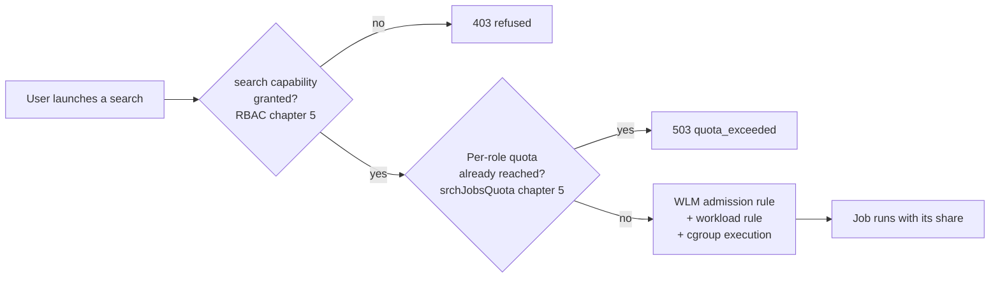
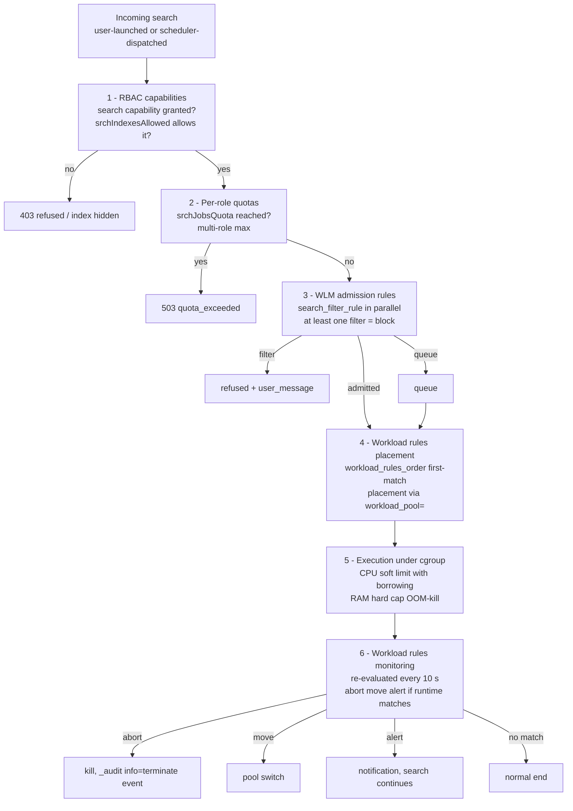

# Chapter 6 — Workload Management guide: search heads

> This chapter is the full operational guide for Workload Management
> on the Search Head side. It covers WLM concepts, the audit of the
> existing state, pool design, progressive implementation with its
> gates, and ongoing monitoring.
>
> The **indexers / distributed-mode** part lives in chapter 7. One
> recommendation drives the sequencing: **start with the indexers in
> monitor-only before the search head** (justified in chapter 7 §1).

## 1. Mental model — why WLM exists

A Splunk Search Head runs **searches**: splunkd processes that
scan indexes, aggregate events, and return a result. Each search
consumes CPU, memory, disk (dispatch dir), and I/O bandwidth.

On an SHC serving a thousand users, these resources are **shared**.
Without an arbiter, the first search that starts takes what it
wants; the next one takes what's left; after a while nothing is
guaranteed anymore.

WLM reserves **shares** of those resources for **families of
searches** and **arbitrates** them when demand exceeds supply.

### Three things

1. A **geography**: searches are placed in **pools** that each get a
   share of CPU and memory.
2. **Placement rules**: each incoming search is routed to a pool
   based on what it is (RT vs. historical, ad-hoc vs. scheduled,
   launched by a given role, on a given index).
3. **Execution under a cgroup**: Linux actually enforces the shares
   via **cgroups** (control groups).

### Articulation with RBAC



WLM does **not** replace capabilities (which decide *who is
allowed to do what*) or per-role quotas (which decide *how many
jobs a user may launch*). It sits on top: **how many resources an
in-flight job may consume**, and **with what priority under
instantaneous pressure**.

## 2. The five building blocks

### 2.1 The pool

A **pool** (`[workload_pool:<name>]`) is an envelope shared by a
set of searches. Three main parameters.

- **`category`**: which WLM category the pool belongs to
  (`search`, `ingest`, `misc`).
- **`cpu_weight`**: the **relative** CPU share the pool can claim
  inside its category. **Soft limit** — if the pool doesn't use
  its share, other pools may borrow it ("CPU is compressible").
- **`mem_weight`**: the **absolute** memory share (hard cap). A
  job that overshoots is **OOM-killed** by cgroup. Memory is not
  compressible.

The **`default_category_pool=1`** parameter designates the default
pool of its category. **Every WLM category requires at least one
pool with `default_category_pool=1`**, otherwise splunkd refuses
to activate WLM (F-WLM-01).

### 2.2 The category

A **category** (`[workload_category:<name>]`) groups pools by
technical use. The three categories are fixed in Splunk 9.4:
`search`, `ingest`, `misc`. Each category has its own `cpu_weight`
and `mem_weight` — that is the first sharing step.

The effective `cpu_allocated_percent` of a pool is:

```
pool_cpu_weight × category_cpu_weight / 100
```

Example: `ad_hoc` at 35 % of a `search` category at 80 % = 28 %
of the SH's total CPU.

For a SH, what matters functionally is the `search` category. The
two other categories must **exist** (with a
`default_category_pool=1`) for WLM to accept activation, but their
pools (`ingest_default`, `misc_default`) do not receive business
rules.

### 2.3 The admission rule

An **admission rule** (`[search_filter_rule:<name>]`) is evaluated
**before** the search starts.

- **`action = filter`**: blocks the search. A `user_message` is
  returned to the client (≤ 140 chars, alphanumerics + basic
  punctuation, **no parentheses** — F-WLM-06).
- **`action = queue`**: queues the search. Typically combined with
  an `adhoc_search_percentage` predicate.

All admission rules are **evaluated in parallel** — one match on
`filter` is enough to block.

### 2.4 The workload rule

A **workload rule** (`[workload_rule:<name>]`) is evaluated at
admission for placement, then every ten seconds for monitoring.

- **Placement**: presence of the `workload_pool = <pool>` key
  **without** an `action=` key (F-WLM-02).
- **`action = abort`**: kills the in-flight search (requires
  `runtime>` in the predicate — F-WLM-03).
- **`action = move`**: moves a job from one pool to another
  (`move` + `workload_pool = <alt_pool>`; requires `runtime>`).
- **`action = alert`**: alerts without constraining — the search
  continues, an event is written to `_audit`, a structured
  message appears in the job inspector. It is the native
  equivalent of a **per-rule monitor-only mode**. The Splunk
  docs also mention `action = display_message` — **that value
  does not exist on 9.4.6** (F-WLM-04). Use `alert` instead.

Evaluation order is strict, defined by `[workload_rules_order]` —
**first-match wins**. That order accepts **only**
`[workload_rule:*]`; trying to list a `[search_filter_rule:*]`
in it produces an HTTP 404 (F-WLM-05).

### 2.5 The cgroup

On Linux, a **cgroup** (control group) is a kernel mechanism that
groups processes and applies CPU, memory, and I/O limits to them.
Splunk on 9.4.6 uses cgroups v2, under
`/sys/fs/cgroup/system.slice/Splunkd.service/`.

When splunkd starts with WLM enabled, it **attaches** its
processes to the configured cgroups. When a new search starts,
splunkd attaches the search process to the cgroup matching the
pool decided by the workload rules. From that point on, the
**Linux kernel** enforces the limit.

**Operational note.** On the first WLM rollout, a
`systemctl restart Splunkd` is required so splunkd attaches its
processes to cgroups. On subsequent rollouts (`.conf` changes), a
reload via `/services/workloads/config/_reload` is enough. The
restart **must** run as root directly, not via `runuser -u splunk`,
which silently fails on systemd-managed services (F-WLM-08).

## 3. Full evaluation chain



Three notes:

- A search refused at step 2 (quota) **never appears** in WLM
  traces — a frequent source of confusion when reading `_audit`.
- Step 4 is **implicit** (no `action=` for placement — F-WLM-02).
  Just having a `workload_pool = X` key in a matching
  `[workload_rule:*]` is enough to route.
- Step 6 only evaluates on **rules that carry a `runtime>`
  predicate** (F-WLM-03). Other rules are only evaluated at
  step 4 (placement).

## 4. Recommended pattern — seven pools

| Pool | Category | `cpu_weight` | `mem_weight` | `default_category_pool` | Purpose |
| --- | --- | --- | --- | --- | --- |
| `admin` | search | 15 | 15 | 0 | Reserved for admin roles |
| `scheduled` | search | 30 | 30 | 0 | Scheduled searches |
| `ad_hoc` | search | 35 | 35 | **1** | Interactive searches (default) |
| `bulk` | search | 10 | 10 | 0 | Long searches, exports |
| `accel` | search | 10 | 10 | 0 | Accelerations, summary indexing |
| `ingest_default` | ingest | 1 | 1 | **1** | Exists to activate WLM |
| `misc_default` | misc | 1 | 1 | **1** | Exists to activate WLM |

`search` category at 80 % of total CPU/RAM, `ingest` at 15 %,
`misc` at 5 %.

> The percentages are the state of the art for an SHC of about a
> thousand users. **Adapt to context** based on real usage
> baseline.

### `workload_pools.conf` example

```ini
[general]
enabled = 1

[workload_category:search]
cpu_weight = 80
mem_weight = 80

[workload_category:ingest]
cpu_weight = 15
mem_weight = 15

[workload_category:misc]
cpu_weight = 5
mem_weight = 5

[workload_pool:admin]
category = search
cpu_weight = 15
mem_weight = 15

[workload_pool:scheduled]
category = search
cpu_weight = 30
mem_weight = 30

[workload_pool:ad_hoc]
category = search
cpu_weight = 35
mem_weight = 35
default_category_pool = 1

[workload_pool:bulk]
category = search
cpu_weight = 10
mem_weight = 10

[workload_pool:accel]
category = search
cpu_weight = 10
mem_weight = 10

[workload_pool:ingest_default]
category = ingest
cpu_weight = 1
mem_weight = 1
default_category_pool = 1

[workload_pool:misc_default]
category = misc
cpu_weight = 1
mem_weight = 1
default_category_pool = 1
```

## 5. Recommended pattern — eight WLM rules

The eight rules form a coherent set. All **monitoring action**
rules (`abort`, `move`, `alert`) carry a `runtime>` predicate.
Pure **placement** rules only carry context predicates (role,
`search_type`, etc.).

### R-W01 — Abort unauthorized real-time

```ini
[workload_rule:abort_unauthorized_rt]
predicate = search_mode=realtime AND NOT role=rt_authorized_*
action = abort
runtime = 1s
schedule = always
```

Blocks any real-time search launched by a role that is not
explicitly in an `rt_authorized_*` atomic. Finding F-RBAC-01
reminds us that an inherited `rtsearch` cannot be revoked — WLM is
the safety net.

### R-W02 — Move `alltime` searches to `bulk`

```ini
[workload_rule:move_alltime_to_bulk]
predicate = numeric_search_time_range=true AND search_time_range>1825d
action = move
workload_pool = bulk
runtime = 1m
```

Move searches with no time bound (or covering more than five
years) to the `bulk` pool after one minute of execution. Doesn't
kill them — gives them oxygen but outside the ad-hoc pool.

### R-W03 — Place scheduled

```ini
[workload_rule:place_scheduled]
predicate = search_type=scheduled
workload_pool = scheduled
schedule = always
```

Implicit placement via `workload_pool=` (F-WLM-02). No `action=`.

### R-W04 — Place accelerations

```ini
[workload_rule:place_acceleration]
predicate = search_type IN (datamodel_acceleration, report_acceleration, summary_index)
workload_pool = accel
```

### R-W05 — Place admins

```ini
[workload_rule:place_admin]
predicate = role=admin_*
workload_pool = admin
```

Protects the admin pool so a saturation incident does not block
diagnostics. The admin role stays able to launch searches.

### R-W06 — Alert on long searches

```ini
[workload_rule:alert_long_searches]
predicate = runtime>10m AND NOT search_type=scheduled
action = alert
schedule = always
```

Per-rule monitor-only mode (F-WLM-04). The search continues, an
`_audit` event is written, the job inspector shows the message.
Feeds the pedagogical loop.

### R-W07 — Move admin ad-hoc searches into the admin pool

```ini
[workload_rule:move_admin_adhoc]
predicate = role=admin_* AND runtime>30s
action = move
workload_pool = admin
runtime = 30s
```

Catches the cases where an admin launches a search from the
search bar without triggering R-W05 (rare in practice but a
safety net).

### R-W08 — Admission rule: queue on ad-hoc saturation

```ini
[search_filter_rule:queue_on_adhoc_saturation]
predicate = adhoc_search_percentage>85 AND NOT role=admin_*
action = queue
user_message = Platform saturated, your search is queued. Retry if urgent.
```

**Note F-WLM-06**: `user_message` ≤ 140 chars, no parentheses.

### Evaluation order

```ini
[workload_rules_order]
rules = abort_unauthorized_rt, move_alltime_to_bulk, place_admin, move_admin_adhoc, place_scheduled, place_acceleration, alert_long_searches
```

The order **accepts only `[workload_rule:*]`** (F-WLM-05).
Admission rules (`[search_filter_rule:*]`) are evaluated in
parallel, outside this order.

Logic of the order:

1. Kill forbidden behaviors (`abort_unauthorized_rt`).
2. Move expensive but allowed behaviors
   (`move_alltime_to_bulk`).
3. Protect admins (`place_admin`, `move_admin_adhoc`).
4. Place technical search types (`place_scheduled`,
   `place_acceleration`).
5. Alert on duration anomalies (`alert_long_searches`).

## 6. Progressive implementation — six phases

### Phase 0 — Baseline (2 to 4 weeks)

Measure for two to four weeks with WLM disabled: ad-hoc
concurrency, scheduled concurrency, average search duration,
Search Head memory peak, distribution of `search_type`.

Calibrate the pool percentages (table in §4) on these
measurements.

Gate criterion: the baseline is known, percentages are adjusted
for the context.

### Phase 1 — Pools enabled without rules (1 week)

Deploy `workload_pools.conf` (7 pools), enable WLM via
`workload-management-status enabled=1`. No rule yet — every
search lands in `ad_hoc` (default category pool).

Restart splunkd via `systemctl restart Splunkd` (F-WLM-08).

Gate criterion: `| rest /services/workloads/status` returns
`enabled=1`. Searches still run. No observable user impact.

### Phase 2 — Monitor-only (`alert`) — 2 to 4 weeks

Deploy every workload rule **with `action = alert`** (never
`abort` or `move` in this phase). Every rule's placement
predicate is replaced by a monitor-only predicate.

Example: rule R-W01 becomes

```ini
[workload_rule:monitor_unauthorized_rt]
predicate = search_mode=realtime AND NOT role=rt_authorized_* AND runtime>1s
action = alert
```

That lets you observe **what the rule would do** without breaking
anything. `_audit` records the `alert` events — measure the
volume per rule, identify the users and roles that would be
impacted.

Gate criterion: for each rule, the daily match count is known,
the users who would be impacted have been contacted to understand
their intent.

### Phase 3 — Switch to enforce, rule by rule (4 to 8 weeks)

Switch rules **one by one** to enforce, in this order:

1. Implicit placement (`place_scheduled`, `place_acceleration`,
   `place_admin`) — benign, no user-side risk.
2. Move (`move_alltime_to_bulk`, `move_admin_adhoc`) — disrupts
   long searches but does not kill them.
3. Abort (`abort_unauthorized_rt`) — disrupts users directly,
   leave for the last phase.
4. Admission queue (`queue_on_adhoc_saturation`) — final
   rollout.

Between each switch, **two weeks of KPI observation** (§7).

Per-rule gate criterion: no unresolved access incident over one
hour, KPIs unchanged or improved.

### Phase 4 — Corrective cycles (continuous)

For each enabled rule, measure KPIs continuously. A rule that
becomes too noisy (matches > planned threshold) is switched back
to `alert` for analysis.

### Phase 5 — Multi-SHC industrialization (4 to 6 weeks)

Once the design is stable on the pilot SHC, propagate to the
other SHCs while keeping inter-SHC consistency (the role names
targeted by the rules must be identical across SHCs).

Gate criterion: every SHC in the perimeter has the same rule
set, with pool percentages tuned to each SHC's load.

## 7. Ongoing monitoring

### B.3.01 — Search distribution by pool, last hour

```spl
search index=_audit action=search earliest=-1h
| eval pool = coalesce(workload_pool, "unmatched")
| stats count by pool
| sort -count
```

**Target**: `ad_hoc` > 50 %, `scheduled` 20-40 %, `admin` < 5 %,
`bulk` < 10 %, `accel` < 10 %, `unmatched` close to 0.

### B.3.02 — Pressure on the ad-hoc pool

```spl
search index=_internal sourcetype=splunkd component=WorkloadPool
| where pool_name="ad_hoc"
| stats avg(cpu_pct) as cpu_avg max(cpu_pct) as cpu_max
        avg(mem_pct) as mem_avg max(mem_pct) as mem_max by host
| where cpu_max>80 OR mem_max>85
```

**Interpretation.** Sustained pressure > 80 % CPU or > 85 % memory
on the ad-hoc pool = candidate to increase `cpu_weight` or to
tighten admission rules.

### B.3.03 — WLM aborts by rule, last week

```spl
search index=_audit action=workload_abort earliest=-7d
| stats count values(user) as users dc(user) as nb_users by rule_name
| sort -count
```

**Interpretation.** A rule aborting more than N times a day is
either miscalibrated or surfaces a user-side behavior to correct
(training, communication).

### B.3.04 — Queues on saturation

```spl
search index=_audit action=workload_queue earliest=-7d
| timechart span=1h count
```

**Interpretation.** Queue peaks concentrated in certain hour
ranges = signal that scheduling needs to be staggered better.

### B.3.05 — Admission latency

```spl
search index=_internal sourcetype=splunkd component=SearchAdmission
| eval admit_ms = wait_ms
| stats p50(admit_ms) as p50 p90(admit_ms) as p90 p99(admit_ms) as p99 by host
```

**Target**: `p50 < 100 ms`, `p99 < 1000 ms`. Degradation = WLM or
quotas overloaded.

### B.3.06 — Searches alerted by duration

```spl
search index=_audit action=workload_alert earliest=-7d
| stats count values(rule_name) as rules dc(user) as nb_users by behavior
| sort -count
```

Feeds the pedagogical loop.

### B.3.07 — Top users by pool pressure

```spl
search index=_audit action=search earliest=-24h workload_pool=*
| eval cost = total_run_time
| stats sum(cost) as total_cost count by user workload_pool
| sort -total_cost
| head 20
```

**Interpretation.** Top 20 users by aggregated cost. Obvious
targets for pedagogical awareness (chapter 3 §4).

### B.3.08 — `search_type` distribution by pool

```spl
search index=_audit action=search earliest=-24h
| eval pool = coalesce(workload_pool, "unmatched")
| eval stype = if(isnull(search_type), "adhoc_default", search_type)
| stats count by pool stype
| sort -count
```

Checks that placement rules do what is expected (scheduled into
`scheduled`, accel into `accel`).

### B.3.09 — Move events

```spl
search index=_audit action=workload_move earliest=-7d
| stats count by source_pool target_pool rule_name
| sort -count
```

**Interpretation.** An `ad_hoc → bulk` move is expected (R-W02).
Any other transition deserves analysis.

### B.3.10 — Searches without `workload_pool` (unmatched)

```spl
search index=_audit action=search earliest=-24h
| eval matched = if(isnull(workload_pool) OR workload_pool="", "no", "yes")
| stats count by matched
```

**Target**: `no` < 5 %. Any `no` search landed in default
`ad_hoc`, which is not necessarily wrong — but a rising share of
`no` indicates incomplete placement-rule coverage.

## 8. Pre-WLM audit

Before designing the pools, ten cartography searches. They are
used to calibrate the pool percentages against the reality of
usage.

### B.1.01 — Historical ad-hoc concurrency

```spl
search index=_audit action=search search_type=adhoc earliest=-30d
| bucket _time span=10m
| stats dc(eval(coalesce(search_id, sid))) as nb_jobs by _time
| stats avg(nb_jobs) as avg_concurrent max(nb_jobs) as max_concurrent
```

Measures average and peak ad-hoc concurrency over 30 days.
Calibrates the `ad_hoc` pool share.

### B.1.02 — Scheduled concurrency

```spl
search index=_audit action=search search_type=scheduled earliest=-30d
| bucket _time span=1m
| stats dc(eval(coalesce(search_id, sid))) as nb_jobs by _time
| stats avg(nb_jobs) as avg_per_min max(nb_jobs) as max_per_min
```

Calibrates the `scheduled` pool share. Peaks > 50 / minute =
scheduling-distribution problem to fix.

### B.1.03 — Average and p99 duration

```spl
search index=_audit action=search earliest=-7d
| stats avg(total_run_time) as avg_dur p99(total_run_time) as p99_dur
        by search_type
```

An ad-hoc search lasting > 60 s in p99 is a candidate for
optimization.

### B.1.04 — Top users by search volume

```spl
search index=_audit action=search earliest=-7d
| stats count by user
| sort -count
| head 20
```

### B.1.05 — Actual real-time searches

```spl
search index=_audit action=search search_mode=realtime earliest=-7d
| stats count values(user) as users dc(user) as nb_users by index
| sort -count
```

Measures real RT usage — feeds the decision on `feature_rt` and
on rule R-W01.

### B.1.06 — Searches without a time bound

```spl
search index=_audit action=search earliest=-7d
| where time_range="alltime" OR isnull(time_range)
| stats count values(user) as users by index
```

Direct target of R-W02.

### B.1.07 — Searches by index (top 20)

```spl
search index=_audit action=search earliest=-7d
| rex max_match=5 "search_index_list=\"(?<idx>[^\"]+)\""
| mvexpand idx
| stats count by idx
| sort -count
| head 20
```

### B.1.08 — Duration distribution by bucket

```spl
search index=_audit action=search earliest=-7d
| eval bucket = case(
    total_run_time < 1, "<1s",
    total_run_time < 10, "1-10s",
    total_run_time < 60, "10-60s",
    total_run_time < 600, "1-10min",
    true(), ">10min")
| stats count by bucket
```

Calibrates the R-W06 (`alert_long_searches`) threshold.

### B.1.09 — Saved searches with undeclared quotas

```spl
| rest /servicesNS/-/-/saved/searches splunk_server=local
| rename "eai:acl.app" as app "eai:acl.owner" as owner
| where disabled=0 AND is_scheduled=1
| stats count by app cron_schedule
| sort -count
```

Identifies the saved searches whose schedule (cron) must be
reviewed before strict WLM activation.

### B.1.10 — Active accelerations

```spl
| rest /servicesNS/-/-/data/models splunk_server=local
| where acceleration=true
| table title acceleration.cron_schedule eai:acl.app
```

Calibrates the `accel` pool share.

## 9. 9.4.6 traps — recap

| # | Trap | Consequence | Reference |
| --- | --- | --- | --- |
| W1 | Forgetting `default_category_pool=1` on `ingest` and `misc` | WLM activation silently fails | F-WLM-01 |
| W2 | Using `action=workload_pool` for placement | rule rejected by splunkd | F-WLM-02 |
| W3 | Forgetting `runtime>` on `abort/move/alert` actions | rule rejected at activation | F-WLM-03 |
| W4 | Using `action=display_message` | does not exist, use `action=alert` | F-WLM-04 |
| W5 | Listing a `search_filter_rule` in `[workload_rules_order]` | HTTP 404 | F-WLM-05 |
| W6 | `user_message` with parentheses or > 140 chars | rule rejected | F-WLM-06 |
| W7 | Reloading on the indexer side without cluster-bundle | no propagation | F-WLM-07 (see ch. 7) |
| W8 | Restarting splunkd via `runuser -u splunk` | silent failure | F-WLM-08 |
| W9 | Designing pools without baseline | percentages disconnected from usage | calibration |
| W10 | Switching to enforce without monitor-only phase | unanticipated user incidents | method |

## Sources

- [Splunk Workload Management 9.4 — Overview](https://help.splunk.com/en/splunk-enterprise/administer/manage-workloads/9.4/workload-management-overview)
- [Configure workload pools 9.4](https://help.splunk.com/en/splunk-enterprise/administer/manage-workloads/9.4/configure-workload-management/configure-workload-pools)
- [Configure workload rules 9.4](https://help.splunk.com/en/splunk-enterprise/administer/manage-workloads/9.4/configure-workload-management/configure-workload-rules)
- [Configure admission rules 9.4](https://help.splunk.com/en/splunk-enterprise/administer/manage-workloads/9.4/configure-workload-management/configure-admission-rules-to-prefilter-searches)
- [Splunk Blog — Best Practices for Using Splunk Workload Management](https://www.splunk.com/en_us/blog/platform/best-practices-for-using-splunk-workload-management.html)
