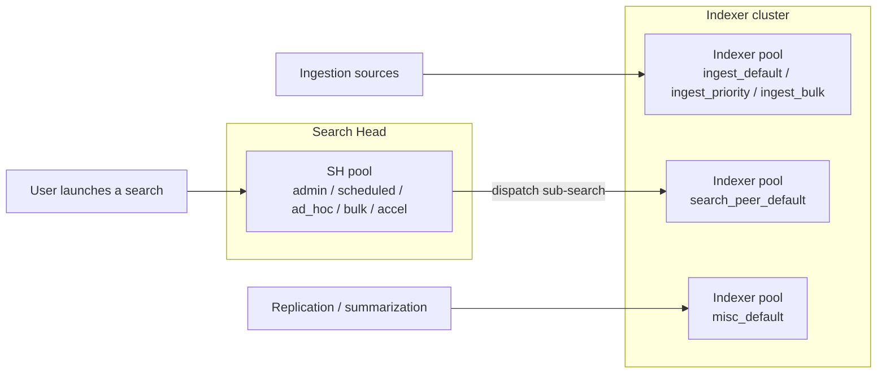

# Chapter 7 — Workload Management guide: indexers and distributed mode

> This chapter covers WLM **on the indexer side**, complementing
> chapter 6 which covers the Search Head side. It addresses the
> concepts specific to distributed mode, the design of indexer
> pools, the propagation procedure via the cluster manager, the
> tranched implementation order (indexers first, in monitor-only),
> and nine ongoing-monitoring searches.
>
> A note on terminology: Splunk renamed the `cluster master`
> component to `cluster manager` starting with 9.0; the function
> is unchanged. This English chapter uses `cluster manager`
> throughout. Some CLI commands keep the historical wording
> (e.g. `splunk apply cluster-bundle`) because that is how the
> binary still names them.
>
> The chapter is self-sufficient — it recaps the WLM notions it
> needs and points back to chapter 6 for what is common.

## 1. Why an indexer-side workstream

### 1.1 SH-side regulation is not enough

Chapter 6 lays down the five `search` pools + two default pools on
the Search Head — they cover everything that happens on the SH.
But a distributed search has **two representations**:

- on the SH, a main **search dispatcher** — that is what SH-side
  WLM regulates;
- on each participating indexer, a **search peer process** — that
  is what scans the buckets, reads the raw events, applies the
  filters. **This process consumes CPU and memory that are not
  the SH's.**

Consequence: a job placed in the SH `ad_hoc` pool (say 35 % of the
SH CPU) **is not bounded** on the indexer side — its search peer
process falls into the default indexer pool
(`search_peer_default`) and consumes freely. Limiting the SH
dispatcher does **not** limit the indexer-side resource
consumption for that search.

On top of that, on the indexer side, sits **ingestion** pressure:
the ingestion pipelines (parsing, indexing, intermediate
forwarding) consume a large share of CPU and I/O on the peers
and are regulated by **no** SH pool.

### 1.2 What the indexer workstream adds

Activating WLM on the indexer side adds two dimensions.

1. **Ingestion regulation** — `ingest` category: prioritize a
   sensitive sourcetype (for example `sec_*` in `ingest_priority`)
   or slow down high-volume low-criticality sources
   (`ingest_bulk`).
2. **Distributed-search peer regulation** — `search_peer`
   category: bound the search peer processes so they don't
   overwhelm the indexers in case of a pathological search.

### 1.3 SH-side / indexer-side articulation



SH-side pools and indexer-side pools are **sized independently**.
There is **no** 1:1 correspondence between an SH pool name and an
indexer pool name — these are two different perimeters regulating
two different kinds of resources.

## 2. Specifics

### 2.1 Structural differences

The configuration files are **identical** on both sides:
`workload_pools.conf`, `workload_rules.conf`,
`workload_policy.conf`.

But the **location** differs.

| Perimeter | App location | Propagation tool |
| --- | --- | --- |
| **Search Head Cluster** | `etc/shcluster/apps/<app>/local/` on the **deployer** | `splunk apply shcluster-bundle` |
| **Indexer cluster** | `etc/manager-apps/<app>/local/` on the **cluster manager** | `splunk apply cluster-bundle` |

On the peer side, the propagated bundle lands in
`etc/slave-apps/<app>/local/`. **Any manual edit on a peer is
overwritten at the next `apply cluster-bundle`.**

### 2.2 The three categories on the indexer side

Splunk 9.4 defines three categories on every node (and each
category must carry at least one pool with
`default_category_pool=1` — F-WLM-01).

| Category | Activity regulated | Relevance on SH | Relevance on indexer | Typical pools |
| --- | --- | --- | --- | --- |
| **`search`** | User searches | business pillar SH | minimal (one default suffices) | SH side: 5 business pools |
| **`ingest`** | Ingestion pipelines | minimal | **business pillar on indexer** | indexer side: `ingest_default`, `ingest_priority`, `ingest_bulk` |
| **`search_peer`** | Distributed searches on indexer side | n/a | optional | indexer side: `search_peer_default` |
| **`misc`** | Internal activities (replication, summarization) | one default | one default | `misc_default` |

On an **indexer**, `ingest` and `misc` carry the business
semantics; `search` must still carry a default pool but receives
no user rule (searches coming from SHes are seen as `search_peer`
on the indexer side, not as `search`).

### 2.3 Indexer pools ≠ SH pools

An SH pool constrains the **jobs** on the Search Head (their
dispatcher). An indexer pool constrains **ingestion** or
**search peers** on the indexer. These are different objects.
Don't look for a 1:1 naming correspondence.

### 2.4 Full chain RBAC → quotas → WLM SH → WLM indexer

```
RBAC (capabilities)
  v
Per-role quotas (srchJobsQuota, srchDiskQuota, rtSrchJobsQuota)
  v
SH admission rules (search_filter_rule)
  v
SH workload rules placement (workload_rule, first-match wins)
  v
SH dispatcher execution under the SH pool cgroup
  v (dispatches sub-searches to N indexers)
Indexer workload rules placement (on the search peer process)
  v
Search peer process execution under the search_peer (indexer) pool cgroup
```

In parallel, on the indexer side only, ingestion pipelines are
regulated by indexer workload rules of the `ingest` category,
independently of any search.

### 2.5 Indexer-side predicates

Splunk 9.4 documentation does not provide a distinct table of
indexer-side predicates. Empirical observations:

| Predicate | Available on indexer? | Notes |
| --- | --- | --- |
| `role` | yes | The role of the user who initiated the search (propagated via auth context) |
| `user` | yes | Same |
| `app` | yes | App that owns the saved search |
| `index` | yes | Relevant for targeting ingestion of a given sourcetype |
| `search_type`, `search_mode` | partial | Indexer-side regulation arrives after SH-side |
| `runtime>` | yes | Evaluated on ingest / search peer processes |
| `sourcetype`, `source`, `host` | partial | Community reports that `ingest` can use these after parsing — to validate on a real cluster |

**Safe fallback**: when in doubt, predicate on `index=`
(documented on both sides).

### 2.6 Indexer-side actions

Identical on the surface (`abort`, `move`, `alert`, `filter`,
`queue`, implicit placement via `workload_pool=`), with
specifics.

- On `ingest`, **`abort` is rare** (cutting ingestion = data
  loss). Prefer `move` to a lower-`mem_weight` pool.
- On `search_peer`, the Splunk runtime can already terminate
  search peer processes via native mechanisms (timeout,
  cancellation from the SH). Adding an `abort` rule on
  `runtime>X` is useful for distributed searches running in
  loops.
- On `misc` (bucket replication, summarization), placement
  actions are most relevant (put replication into a low
  `mem_weight` pool so it doesn't saturate memory).

## 3. Indexer pool design

### 3.1 Pre-deployment audit

Before laying down WLM config on the indexer side, map out:

1. **Peer list**: `| rest /services/cluster/master/peers` from the
   SH or from the cluster manager. All `Up`,
   `bundle_status=Up to date`.
2. **Current ingestion pressure**: see R.I.01 below, by `host`
   (peer).
3. **Volume per sourcetype**: see R.I.02.
4. **Sensitive sourcetypes**: the list of sourcetypes requiring
   priority handling (typically `sec_*`, `wineventlog_security`,
   `audit_critical`) — candidates for `ingest_priority`.

### 3.2 Recommended pattern — five pools across three categories

| Pool | Category | `cpu_weight` / `mem_weight` | `default_category_pool` | Target |
| --- | --- | --- | --- | --- |
| `ingest_default` | `ingest` | 70 / 70 | **1** | All ingestion not targeted by a specific rule |
| `ingest_priority` | `ingest` | 20 / 20 | 0 | Sensitive sourcetypes |
| `ingest_bulk` | `ingest` | 10 / 10 | 0 | High-volume low-criticality sources |
| `search_peer_default` | `search_peer` | 100 / 100 | **1** | All search peer processes |
| `misc_default` | `misc` | 100 / 100 | **1** | Replication, summarization, alerting |

> **No custom pool in `search_peer`**: regulation is largely
> reserved for the Splunk runtime and custom pools are rarely
> documented there. Add one only when fine analysis shows a
> category of searches saturates the peers.

### 3.3 Typical ingestion rules

```ini
[workload_pool:ingest_default]
category = ingest
cpu_weight = 70
mem_weight = 70
default_category_pool = 1

[workload_pool:ingest_priority]
category = ingest
cpu_weight = 20
mem_weight = 20

[workload_pool:ingest_bulk]
category = ingest
cpu_weight = 10
mem_weight = 10

[workload_pool:search_peer_default]
category = search_peer
cpu_weight = 100
mem_weight = 100
default_category_pool = 1

[workload_pool:misc_default]
category = misc
cpu_weight = 100
mem_weight = 100
default_category_pool = 1

[workload_rule:R-IDX-01_priority_ingest_security]
predicate = index=sec_*
workload_pool = ingest_priority
schedule = always

[workload_rule:R-IDX-02_bulk_ingest_archive]
predicate = sourcetype=archive_* OR source=*.gz
workload_pool = ingest_bulk
schedule = always

[workload_rules_order]
rules = R-IDX-01_priority_ingest_security, R-IDX-02_bulk_ingest_archive
```

### 3.4 Sizing criteria

- **`ingest_default` must absorb the bulk of traffic** — leave a
  generous margin (70 % of the category's `cpu_weight`).
- **`ingest_priority` at 20 to 30 %** — enough for sensitive
  sourcetypes, which are normally < 10 % of total volume.
- **`ingest_bulk` at 10 %** — deliberately constrained so it
  cannot crush the ingestion SLA when a bulk dump arrives.

## 4. Propagation via the cluster manager

### 4.1 Prerequisites

1. **Cluster manager accessible and healthy**: `splunk show
   cluster-status` shows every peer in `Up`,
   `bundle_status=Up to date`. No rolling restart in progress.
2. **Cgroups available** on every indexer. Indexer-side WLM
   relies on cgroups v1 or v2. Check: `mount | grep cgroup`.
3. **Spare capacity on the peers**: a rolling restart takes
   2 to 5 minutes per peer. On a twelve-peer cluster, plan a
   30- to 60-minute window with degraded service.
4. **Replication budget**: `splunk show cluster-bundle-status`
   confirms the peers have the capacity to restart without
   triggering a fixup.

### 4.2 Prepare the app

The cluster WLM app lives at
`etc/manager-apps/wlm_indexer/local/` on the cluster manager (and
not in `default/`, which is reserved for Splunk-installed apps).

```
etc/manager-apps/wlm_indexer/local/
  workload_pools.conf
  workload_rules.conf
  app.conf            # standard app metadata
metadata/
  default.meta        # app permissions
```

### 4.3 Apply the bundle

```bash
# 1) Check bundle status first
splunk show cluster-bundle-status -auth <admin>:<pw>

# 2) Validate the bundle (without applying)
splunk validate cluster-bundle -auth <admin>:<pw>

# 3) Apply
splunk apply cluster-bundle -auth <admin>:<pw>

# 4) Check propagation
splunk show cluster-bundle-status -auth <admin>:<pw>
```

`apply` triggers a **rolling restart** of the peers — one at a
time, in the cluster manager order. The cluster manager
orchestrates.

For **purely WLM** bundles, a rolling restart is observed on most
versions; some minor updates have allowed a hot-reload. Verify on
the version actually deployed.

### 4.4 Verify activation per peer

On each peer (or via an aggregate SPL — R.I.04 below):

```bash
splunk show workload-management-status -auth <admin>:<pw>
# Expected: enabled=1
```

### 4.5 Rollback

If an indexer rule is miscalibrated and impacts ingestion:

1. **Modify the rule in the app on the cluster manager** (e.g.
   switch `move` to `alert` to go back to monitor-only).
2. **Reapply**: `splunk apply cluster-bundle`.
3. **Verify propagation**: `splunk show cluster-bundle-status`.

In an absolute emergency, disable indexer-side WLM by setting
`[general] enabled = 0` in `workload_pools.conf`, then reapply.

## 5. Implementation order — indexers first, in monitor-only

A clear project recommendation: **start with the indexers in
monitor-only before the search head**.

### 5.1 Why

Search-head-only regulation is not enough (§1.1). The ingestion
pressure on indexers is borne by other shared SHCs, and a
miscalibrated indexer pool can swallow the headroom of the
governed SHC.

By ordering **indexers in monitor-only first**, you observe
without risk the real distribution of:

- ingestion between `ingest_default` / `ingest_priority` /
  `ingest_bulk`;
- search peer processes (how many run in parallel, for how long
  on average, which searches trigger them);
- misc activities (replication, summarization).

That observation calibrates percentages before any enforce.

### 5.2 Five additional indexer-side phases

To interleave with the six SH phases (chapter 6 §6).

| Indexer phase | Activity | Duration |
| --- | --- | --- |
| **0.I — Cluster audit** | Peer inventory, ingestion baseline, search peer baseline | 2 weeks |
| **1.I — Pools without rules** | Deploy the 5 pools, enable WLM on the indexer side, no rule | 1 week |
| **2.I — Monitor-only `alert`** | All indexer rules in `action=alert` | 2 to 4 weeks |
| **3.I — Placement switch** | Placement rules (`workload_pool=`) to enforce, one at a time | 2 to 4 weeks |
| **4.I — Action switch** | `move` / `alert` rules based on observed material | 2 to 4 weeks |

The interleaving with the SH phases: 0.I, 1.I, 2.I in parallel
with SH baseline (SH phase 0). Phase 3.I and 4.I in parallel
with SH phases 2 and 3.

## 6. 9.4.6 traps specific to indexers

### F-IDX-01 — Peers restart on cluster-bundle

For WLM bundle modifications, a rolling restart of the peers is
observed. On some minor releases a hot-reload has been possible —
to verify on the actually deployed version.

**Consequence.** Plan outside critical hours. On a cluster of N
peers, the window is `N × ~3 min` plus fixup time. Allow for
replication margin.

### F-IDX-02 — Manual edits on a peer get overwritten

Any manual edit in `etc/slave-apps/<app>/local/` on the peer side
is **overwritten** at the next `splunk apply cluster-bundle`.
Every modification must go through the cluster manager.

### F-IDX-03 — `cluster-config -a` may refuse auth; use REST directly

Some versions of the `cluster-config -a` CLI refuse interactive
auth. The workaround is to go through the REST API directly:

```bash
curl -sk -u <admin>:<pw> \
  "https://<cm>:8089/services/cluster/master/config" \
  -d "max_peer_build_load=2"
```

### F-IDX-04 — Ingestion pressure measured on `_internal`

Ingestion pressure (CPU, queues, parsing latency) is observable in
`index=_internal sourcetype=splunkd component=Metrics group=pipeline`,
**not** in `_audit`. Ingestion-audit SPLs (R.I.01, R.I.02) target
`_internal`.

## 7. Ongoing monitoring — nine R.I searches

### R.I.01 — WLM activation per peer

```spl
| rest /services/cluster/master/peers
| join type=left label [
    | rest /services/workload-management-status splunk_server=*
    | rename splunk_server as label
    | fields label enabled]
| eval status = case(enabled=1, "OK", enabled=0, "OFF", true(), "?")
| table label status site
| sort label
```

**Interpretation.** Any peer at `status != OK` after propagation
indicates an activation failure. Check the cgroups and the
`splunkd.log` of the affected peer.

### R.I.02 — Bundle status

```spl
| rest /services/cluster/master/peers
| stats count by bundle_status
```

**Target**: 100 % `Up to date`. Any value other than `Up to date`
after an `apply cluster-bundle` = to investigate.

### R.I.03 — Ingestion pressure by peer and pool

```spl
search index=_internal sourcetype=splunkd component=WorkloadPool earliest=-1h
| where category="ingest"
| stats avg(cpu_pct) as cpu_avg max(cpu_pct) as cpu_max
        avg(mem_pct) as mem_avg max(mem_pct) as mem_max
        by host pool_name
| sort -cpu_max
```

**Interpretation.** Sustained pressure > 80 % CPU on
`ingest_default` = ingestion is heavy. Correlate with R.I.04.

### R.I.04 — Ingestion volume by sourcetype and by indexer pool

```spl
search index=_internal sourcetype=splunkd component=Metrics group=pipeline earliest=-24h
| where name="indexer"
| stats sum(eps) as events_per_sec by host sourcetype
| sort -events_per_sec
| head 30
```

Identifies massive sourcetypes that are candidates for
`ingest_bulk` or `ingest_priority`.

### R.I.05 — Active search peers and duration

```spl
search index=_internal sourcetype=splunkd component=SearchPeer earliest=-1h
| stats count avg(runtime) as dur_avg max(runtime) as dur_max by host
| sort -dur_max
```

Identifies peers under distributed-search pressure.

### R.I.06 — Indexer-side aborts

```spl
search index=_audit action=workload_abort earliest=-7d
| where source=*indexer* OR sourcetype=splunkd_indexer
| stats count by rule_name user
| sort -count
```

### R.I.07 — Misc activity distribution

```spl
search index=_internal sourcetype=splunkd component=WorkloadPool earliest=-1h
| where category="misc"
| stats avg(cpu_pct) as cpu_avg avg(mem_pct) as mem_avg by host pool_name
```

### R.I.08 — Bucket replication pressure

```spl
search index=_internal sourcetype=splunkd component=CMRepJob earliest=-1h
| stats count avg(job_duration) as dur_avg max(job_duration) as dur_max
        by host
```

**Interpretation.** Replication duration peaks = signal of peer
saturation or inter-peer network bandwidth issues.

### R.I.09 — Configuration divergence between SH and indexer

```spl
| rest /services/configs/conf-workload_pools splunk_server=local
| eval node = "search_head"
| append [
    | rest /services/configs/conf-workload_pools splunk_server=<peer>
    | eval node = "indexer"]
| stats values(title) as pools by node
```

**Interpretation.** SH-side and indexer-side pools are not
identical by construction. This SPL helps verify that both
perimeters are in place and helps detect drift (a pool that
only exists on some peers, for example).

## 8. Cluster-specific traps — recap

| # | Trap | Consequence | Reference |
| --- | --- | --- | --- |
| I1 | Editing config directly on a peer | overwritten at next apply | F-IDX-02 |
| I2 | Apply cluster-bundle during a fixup in progress | undefined behavior | prerequisite 4.1 |
| I3 | No cgroups on the peers | WLM does not activate even with valid config | prerequisite 4.1 |
| I4 | Forgetting the rolling-restart window | service degradation surprise | F-IDX-01 |
| I5 | Identical config on SH and indexer | misunderstanding of the model | §2.3 |
| I6 | `cluster-config -a` refuses auth | go through REST directly | F-IDX-03 |
| I7 | Looking for ingestion pressure in `_audit` | metrics are in `_internal` | F-IDX-04 |

## Sources

- [Splunk Distributed Deployment 9.4 — Indexer Clusters](https://help.splunk.com/en/splunk-enterprise/administer/manage-indexers-and-indexer-clusters/9.4)
- [Splunk Workload Management 9.4 — Configure on indexers](https://help.splunk.com/en/splunk-enterprise/administer/manage-workloads/9.4)
- [Splunk Admin 9.4 — Apply cluster bundle](https://help.splunk.com/en/splunk-enterprise/administer/manage-indexers-and-indexer-clusters/9.4/manage-the-manager-node/update-common-peer-configurations-and-apps)
- [Splunk Docs — server.conf clustering](https://help.splunk.com/en/data-management/splunk-enterprise-admin-manual/9.4/configuration-file-reference/9.4.5-configuration-file-reference/server.conf)
