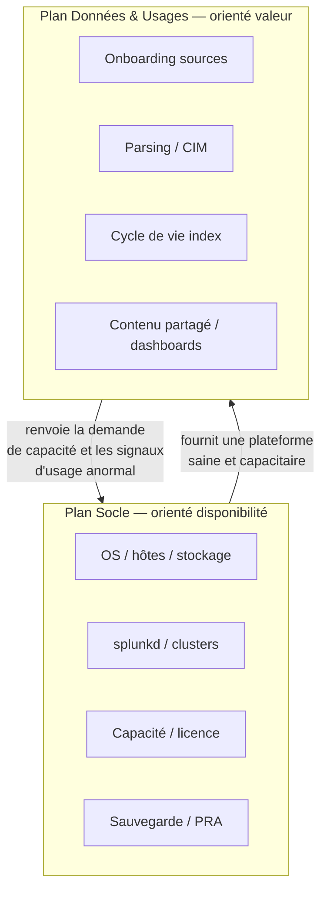
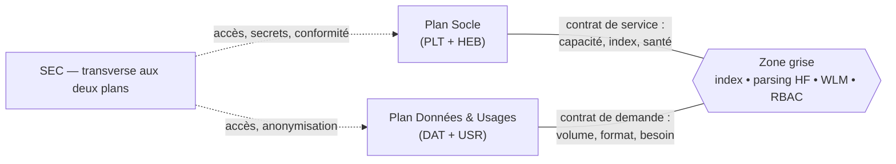

# Chapitre 0 — Le modèle à deux plans d'exploitation

> Exploiter Splunk, ce n'est pas une seule activité mais deux, de natures
> différentes, avec des rythmes, des compétences et des risques différents :
> **faire tourner le socle** et **faire vivre la donnée et les usages**. Ce
> chapitre pose ce modèle mental, explique pourquoi les confondre est la
> cause racine de la plupart des dérives d'exploitation, et fixe le
> vocabulaire réutilisé dans tout le handbook.

## 1. Le symptôme de départ

La plupart des plateformes Splunk mutualisées démarrent avec **une seule
équipe qui fait tout** : elle installe les indexers, patche l'OS, onboarde
les sources, écrit les `props.conf`, crée les rôles, construit les tableaux
de bord et répond aux tickets utilisateurs. Tant que la plateforme est
petite, ça marche.

À l'échelle, ce modèle produit des symptômes récurrents :

- Un **rolling restart** déclenché pour pousser une correction de parsing
  d'une seule source impacte *tous* les utilisateurs de la recherche.
- Personne ne sait dire si la lenteur du matin vient du **socle** (indexers
  saturés) ou des **usages** (une recherche real-time mal bornée).
- Une montée de version majeure est repoussée trimestre après trimestre
  parce que « l'équipe est prise par les demandes d'onboarding ».
- Un même incident est traité deux fois : une fois comme problème
  d'infrastructure, une fois comme problème de contenu, sans que les deux
  se parlent.

La cause n'est pas l'incompétence. C'est l'**absence de frontière** entre
deux plans d'exploitation qui obéissent à des logiques opposées.

## 2. Les deux plans

On sépare l'exploitation en deux **plans**. La métaphore est celle d'un
réseau : un *plan de contrôle* qui maintient l'infrastructure, un *plan de
données* qui achemine et transforme la charge utile.

### Plan Socle (infrastructure)

Le **plan Socle** répond à la question : *« Splunk est-il debout,
dimensionné, sûr et sauvegardé ? »*

Il est **orienté disponibilité et capacité**. Sa métrique de succès est la
santé de la plateforme : indexers en `Up`, réplication à jour, licence sous
le quota, latence d'indexation nominale, sauvegardes vérifiées. Son horizon
est **lent et planifié** : montées de version, extensions de capacité,
renouvellement de certificats, fenêtres de maintenance.

Caractéristiques :

- Changements **rares mais à fort rayon d'impact** (un upgrade touche tout
  le monde).
- Compétences **système et distribué** : clustering, réplication, OS,
  stockage, réseau, TLS.
- Rythme **projet / maintenance planifiée**, régi par le change management.
- Un incident ici est un incident **plateforme** (P1/P2 potentiel).

### Plan Données & Usages (exploitation de la donnée)

Le **plan Données & Usages** répond à la question : *« La bonne donnée
arrive-t-elle, propre, exploitable, et les gens en tirent-ils de la
valeur ? »*

Il est **orienté valeur et expérience**. Sa métrique de succès est
fonctionnelle : la source est onboardée et parsée correctement, le champ
`user` est extrait, le modèle CIM est respecté, le tableau de bord répond,
l'alerte se déclenche au bon moment. Son horizon est **rapide et itératif** :
des dizaines de petites demandes par semaine.

Caractéristiques :

- Changements **fréquents mais à faible rayon d'impact** (un
  `props.conf` mal réglé dégrade *une* source, pas la plateforme — sauf
  exceptions traitées au ch. 3).
- Compétences **données et métier** : parsing, regex, normalisation, SPL,
  connaissance des sources et des besoins utilisateurs.
- Rythme **flux continu de demandes**, régi par une file priorisée.
- Un incident ici est un incident **de service** ou de **qualité de donnée**
  (souvent P3), rarement un incident plateforme.

### Le tableau qui oppose les deux plans

| Dimension | Plan **Socle** | Plan **Données & Usages** |
| --- | --- | --- |
| Question | Splunk tient-il ? | La donnée sert-elle ? |
| Métrique | Disponibilité, capacité | Qualité de donnée, valeur d'usage |
| Rayon d'impact d'un changement | Large (toute la plateforme) | Étroit (une source, un contenu) |
| Fréquence des changements | Basse | Haute |
| Réversibilité | Souvent coûteuse | Souvent facile |
| Horizon | Planifié, projet | Itératif, flux |
| Compétence dominante | Système, distribué, réseau | Donnée, parsing, métier |
| Régime de changement | CAB / fenêtre de maintenance | File priorisée, changement standard |
| Nature d'un incident | Plateforme (P1/P2) | Service / qualité (P3) |

## 3. Pourquoi séparer — les quatre arguments

### Argument 1 — Les rythmes sont incompatibles

Le Socle veut **peu de changements, tracés, planifiés**. Les Usages veulent
**beaucoup de changements, vite**. Mélangés dans une seule file, les deux se
pénalisent : soit on ralentit les usages au rythme du change management du
socle (frustration métier), soit on accélère le socle au rythme des usages
(incidents plateforme). Séparer, c'est laisser chaque plan à sa cadence.

### Argument 2 — Les risques ne sont pas de même nature

Une erreur sur le Socle est **rare et grave** ; une erreur sur les Usages est
**fréquente et localisée**. On ne gouverne pas un risque rare-et-grave comme
un risque fréquent-et-localisé : le premier demande une revue lourde et une
répétition (fenêtre, rollback testé), le second demande un garde-fou léger et
un rollback rapide. Confondus, on sur-contraint les usages et on sous-contrôle
le socle — exactement l'inverse de ce qu'il faut. (Détail : chapitre 3.)

### Argument 3 — Les compétences sont différentes

Diagnostiquer une réplication de bucket bloquée et écrire une extraction de
champ CIM-compliant ne mobilisent pas le même cerveau. Demander à une même
personne d'exceller aux deux, en permanence, sous la pression du flux, c'est
garantir qu'elle sera moyenne aux deux et qu'elle brûlera. La séparation
permet de **spécialiser** et de **recruter** sur des profils cohérents.

### Argument 4 — L'imputabilité devient possible

Sans frontière, tout incident est « la faute de Splunk ». Avec deux plans, on
peut dire : *« la donnée est en retard parce que les indexers sont saturés
(Socle) »* ou *« parce que la source émet un format cassé (Usages) »*.
L'imputabilité — le **A** unique du RACI — n'existe que si le périmètre de
chaque plan est nommé. C'est tout l'objet des chapitres 1 et 2.

## 4. La frontière n'est pas un mur — c'est un contrat

Séparer ne veut pas dire ériger deux silos qui s'ignorent. Les deux plans
sont **couplés par des interfaces explicites** :

- Le Socle **fournit** aux Usages une plateforme saine, une capacité
  déclarée (volume de licence disponible, espace disque par index), des
  index provisionnés.
- Les Usages **renvoient** au Socle une **demande de capacité** (une
  nouvelle source de tel volume/jour) et des **signaux** (une recherche qui
  dérape et menace la plateforme).

Là où les deux se touchent, il y a des **zones grises** — le parsing lourd
sur heavy forwarder, la création d'index, le Workload Management — qui ne
sont ni purement Socle ni purement Usages. Ces zones sont le **principal
gisement d'incidents** ; le chapitre 1 les inventorie et le chapitre 2 tranche
leur RACI. La règle : **une zone grise non tranchée est une zone grise qui
explose en incident.**

## 5. Où se placent les six rôles

Le modèle à deux plans se peuple des **six rôles** du RACI (cf. README) :

- **Plan Socle** : porté par **PLT** (admin Splunk infra) au premier chef,
  adossé à **HEB** (OS, stockage, réseau, sauvegarde — le socle *sous*
  Splunk).
- **Plan Données & Usages** : porté par **DAT** (onboarding, parsing,
  contenu) et **USR** (exploitation au sens usage : recherches et contenus de
  leur périmètre).
- **SEC** est **transverse** : les accès, les secrets, l'anonymisation et la
  conformité traversent les deux plans et ne se rangent dans aucun.
- **PO** est **au-dessus** : il arbitre entre les deux plans quand leurs
  intérêts s'opposent (ex. « repousser l'upgrade Socle pour livrer une source
  urgente Usages » est un arbitrage PO, pas une décision technique).

Le tableau complet activité par activité est le chapitre 2. Avant de
l'attaquer, il faut l'**inventaire des activités** : c'est le chapitre 1.

## 6. Ce que ce modèle ne prétend pas

- Il ne dit pas qu'il faut **deux équipes distinctes** dans toutes les
  structures. Dans une petite plateforme, une même équipe porte les deux
  plans — mais elle doit **savoir dans quel plan elle opère** à chaque
  instant, parce que le régime de changement et le risque en dépendent.
- Il ne dit pas que le Socle est « plus noble » que les Usages, ni
  l'inverse. Les deux sont l'exploitation. La valeur métier vit dans les
  Usages ; elle n'existe que si le Socle tient.
- Il ne remplace pas une **gouvernance des habilitations** (qui a le droit
  de faire quoi *dans* Splunk) : c'est un sujet distinct traité par le
  [handbook Gouvernance des usages Splunk](../gouvernance-utilisateurs-splunk/README.md).
  Le présent handbook traite de **qui exploite quoi**, pas de **qui a quelle
  capability**.

## Sources

- [Splunk Lantern — SSF, Establishing an operating framework](https://lantern.splunk.com/Splunk_Success_Framework/Fundamentals/Establishing_an_operating_framework) — modèles opératoires centralisé/fédéré/hybride (cf. [ch. 5, §4](05-confrontation-sources.md))
- RETEX **GE Digital Telemetry** (`.conf`) — passage de la gestion d'infrastructure à la création de contenu à valeur, via le [Splunk .conf platform track](https://www.splunk.com/en_us/blog/conf-splunklive/splunk-conf25-platform-track-ai-sessions.html)
- [Splunk Validated Architectures (SVA)](https://www.splunk.com/en_us/pdfs/tech-brief/splunk-validated-architectures.pdf) — séparation des rôles d'infrastructure
- [Splunk Docs — Distributed Deployment Manual 9.x](https://help.splunk.com/en/splunk-enterprise/administer/distributed-deployment) — composants et leurs responsabilités
- [ITIL 4 — Service Value Chain](https://www.axelos.com/certifications/itil-service-management) — distinction *engage/deliver* vs *design/build*
- Confrontation détaillée de ce modèle aux cadres Splunk : [chapitre 5](05-confrontation-sources.md)
- Référence interne : [`methodologies/itil-modele-documentation.md`](../../methodologies/itil-modele-documentation.md)
