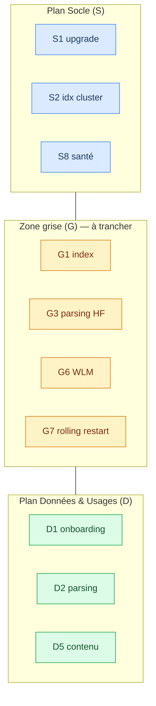
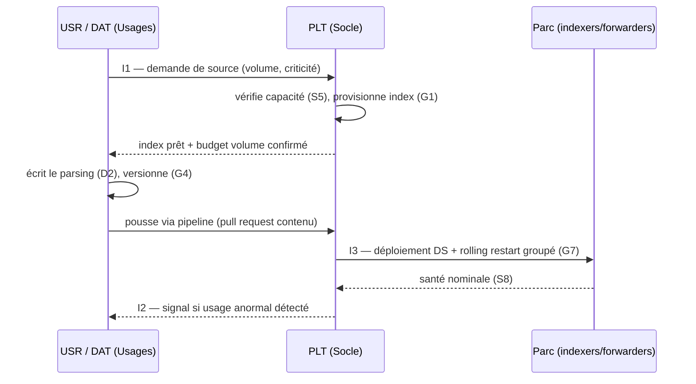

# Chapitre 1 — Catalogue des activités d'exploitation

> Avant de dire *qui* fait quoi (chapitre 2), il faut nommer le *quoi*. Ce
> chapitre inventorie les activités récurrentes d'un RUN Splunk, les range
> dans l'un des deux plans — ou dans la **zone grise** de frontière — et
> décrit les **interfaces** par lesquelles les deux plans se coordonnent.
> C'est le référentiel d'activités sur lequel s'appuient le RACI (ch. 2) et
> le registre de risques (ch. 3).

## 1. Comment lire ce catalogue

Chaque activité porte un **identifiant** (`S1`, `D2`, `G3`…) réutilisé tel
quel dans les chapitres 2 et 3. Le préfixe indique le plan de rattachement :

- **`S…`** — plan **Socle** (infrastructure).
- **`D…`** — plan **Données & Usages**.
- **`G…`** — **zone grise** : l'activité touche les deux plans, son
  rattachement doit être **tranché explicitement** par l'organisation.
- **`T…`** — activité **transverse** (sécurité, changement) qui n'appartient
  à aucun plan mais les traverse.

Le rattachement d'une activité à un plan **n'est pas** son RACI : il dit
« de quelle logique cette activité relève » (disponibilité vs valeur), pas
« quelle équipe la réalise ». Le RACI vient au chapitre 2.

## 2. Plan Socle — activités `S`

Ces activités partagent une signature : **rare, planifié, à large rayon
d'impact, réversibilité coûteuse.** Régime de changement lourd (fenêtre,
rollback testé, CAB si l'organisation en a un).

| ID | Activité | Contenu | Rayon d'impact |
| --- | --- | --- | --- |
| **S1** | Installation / montée de version splunkd | Upgrade majeur/mineur, patch de sécurité Splunk, compatibilité TA/apps | Plateforme |
| **S2** | Gestion du **cluster indexer** | Cluster manager, facteurs replication/search, `site_replication_factor`, ajout/retrait de peer, data rebalance | Plateforme |
| **S3** | Gestion du **search head cluster** | Captain, `raft`, réplication du bundle SHC, ajout/retrait de membre | Plateforme |
| **S4** | Gestion de la **licence** | Suivi du volume journalier, pool de licence, alertes de dépassement, renouvellement | Plateforme |
| **S5** | **Capacité et sizing** | Suivi CPU/RAM/IOPS/stockage, projection de croissance, plan d'extension | Plateforme |
| **S6** | **Sauvegarde et PRA** | Sauvegarde des `$SPLUNK_HOME/etc`, KV store, buckets froids ; test de restauration ; plan de reprise | Plateforme |
| **S7** | **TLS / certificats d'infrastructure** | Certificats splunkd (S2S, REST, Web), rotation, chaîne d'autorité | Plateforme |
| **S8** | **Monitoring de santé plateforme** | Monitoring Console, health report, alertes socle (queues, réplication, skipped searches côté ressource) | Plateforme |
| **S9** | **Configuration système Splunk** | `server.conf`, `limits.conf` (bornes globales), `web.conf`, ports, ulimits/THP OS-adjacent | Plateforme |
| **S10** | **Deployment server (infra)** | Tenue du DS lui-même, `serverclass` structurantes, déploiement des TA techniques | Plateforme / parc forwarders |

> **S10 est déjà à la lisière** : le deployment server est un composant socle,
> mais ce qu'on y déploie (TA de parsing) relève souvent des Usages. On le
> classe Socle pour l'**outil**, en renvoyant le **contenu** déployé à la
> zone grise `G4`. Voir §4.

## 3. Plan Données & Usages — activités `D`

Signature inverse : **fréquent, itératif, à rayon d'impact étroit,
réversibilité facile.** Régime de changement léger (changement standard,
file priorisée), sauf effets de bord traités au ch. 3.

| ID | Activité | Contenu | Rayon d'impact |
| --- | --- | --- | --- |
| **D1** | **Onboarding de source** | Qualifier une nouvelle source, définir index/sourcetype cible, volume/jour, criticité | Une source |
| **D2** | **Parsing / extraction** | `props.conf`/`transforms.conf` : line-breaking, timestamp, extractions de champs, `SEDCMD` | Une source / un sourcetype |
| **D3** | **Normalisation CIM** | Alignement sur les data models CIM (champs, tags, eventtypes) | Un domaine de données |
| **D4** | **Qualité de la donnée** | Détection des sources en retard, muettes, dupliquées, mal datées ; suivi de complétude | Une à plusieurs sources |
| **D5** | **Contenu partagé** | Knowledge objects partagés : recherches sauvegardées, macros, lookups, tags, event types | Un périmètre / une app |
| **D6** | **Tableaux de bord de service** | Dashboards partagés d'une équipe/production applicative | Un périmètre |
| **D7** | **Alertes & recherches planifiées** | Correlation searches, alertes, digests — côté définition métier | Un périmètre |
| **D8** | **Accélérations orientées usage** | Data models accélérés, summary indexing, report acceleration *demandés par un besoin* | Un périmètre (mais coût socle : cf. G5) |
| **D9** | **Support utilisateur N1/N2** | Répondre aux questions d'usage, aider à écrire une SPL, débloquer un tableau de bord | Un utilisateur / une équipe |
| **D10** | **Cycle de vie du contenu** | Revue, dépréciation, nettoyage des KO orphelins, réattribution à un départ d'utilisateur | Un périmètre |

## 4. Zone grise — activités `G`

Ce sont les activités qui **touchent les deux plans**. Chacune est un
gisement d'incident tant qu'un **A unique** ne lui est pas assigné (ch. 2).
Pour chacune, on nomme la **tension** et la **règle de tranchage
recommandée** (RETEX).

| ID | Activité | Tension entre plans | Tranchage recommandé (RETEX) |
| --- | --- | --- | --- |
| **G1** | **Création / suppression d'index** | Un index est un objet **socle** (stockage, rétention, réplication) *et* **donnée** (il matérialise un périmètre métier) | **A = PLT** pour l'acte technique (provisionnement, rétention, taille) ; **C = DAT** qui exprime le besoin (volume, périmètre). Jamais un utilisateur qui crée un index en self-service. |
| **G2** | **Politique de rétention** (`frozenTimePeriodInSecs`, tailles) | Contrainte **capacité** (socle) vs besoin **métier/conformité** (usages/SEC) | **A = PLT** sur la faisabilité capacitaire ; **C = DAT + SEC** sur l'exigence métier/légale. Décision tracée. |
| **G3** | **Parsing sur heavy forwarder** | Le HF est un composant **socle**, mais le parsing qu'il porte est **donnée** ; un `props.conf` lourd sur HF consomme du CPU socle | **A = DAT** pour le *contenu* du parsing ; **C = PLT** parce que le HF est un actif socle dont la charge doit rester maîtrisée. |
| **G4** | **Déploiement de TA / apps de parsing via DS** | L'outil (DS) est socle (`S10`) ; l'artefact (TA) est donnée | **R = DAT** produit et valide le TA ; **A = PLT** contrôle la mise en `serverclass` (l'acte qui touche le parc). Pipeline versionné obligatoire. |
| **G5** | **Accélérations coûteuses** (data models, summary) | Demandées par l'usage (`D8`) mais consomment ressource socle et espace | **A = PLT** sur l'autorisation capacitaire (budget de summary/accel) ; **R/C = DAT** sur la conception. Voir *Search Performance Handbook*. |
| **G6** | **Workload Management (WLM)** | Arbitre la ressource **socle** en fonction de **rôles** (usages) | **A = PLT** (c'est un plafonnement de ressource) ; **C = DAT/PO** sur la politique de priorité entre usages. |
| **G7** | **Rolling restart / bundle push** | Acte **socle** (redémarre les peers) déclenché souvent par un besoin **donnée** (pousser un parsing) | **A = PLT** : c'est PLT qui décide *quand* et *comment* redémarrer, même si le besoin vient de DAT. Groupement des changements. |
| **G8** | **Gestion des forwarders** (UF sur les hôtes sources) | L'agent est **socle Splunk**, mais il vit sur des hôtes appartenant à **HEB** ou aux métiers | **A = PLT** pour la config forwarder ; **C = HEB** propriétaire de l'hôte. Le déploiement suit `G4`. |

## 5. Activités transverses — `T`

Ni Socle ni Usages : elles **traversent** les deux plans et sont portées par
des fonctions transverses (SEC, gouvernance du changement).

| ID | Activité | Portée |
| --- | --- | --- |
| **T1** | **RBAC — rôles & capabilities** | Qui a le droit de quoi dans Splunk (voir handbook Gouvernance) |
| **T2** | **Authentification** (SAML/LDAP, MFA) | Traverse : impacte l'accès socle *et* usages |
| **T3** | **Secrets** (`splunk.secret`, comptes de service, tokens HEC) | Socle par la mécanique, sécurité par l'enjeu |
| **T4** | **Audit & conformité** | Traçabilité des actions, `_audit`, revue d'accès |
| **T5** | **Anonymisation / DLP à l'ingestion** | Masquage à l'index-time de données sensibles (`SEDCMD`, filtrage) |
| **T6** | **Gestion du changement** | Le régime (fenêtre, CAB, standard) qui s'applique à toute activité S/D/G |
| **T7** | **Gestion des incidents & astreinte** | Qualification, escalade, post-mortem — partagée selon la nature de l'incident |

## 6. Les interfaces entre plans

La frontière tient par des **interfaces** — des points de contact
contractualisés. Trois sont structurantes ; le chapitre 4 en détaille le
fonctionnement (rituels, formats). Ici, on les nomme.

### Interface 1 — La demande de capacité (Usages → Socle)

Quand `D1` (onboarding) qualifie une nouvelle source, elle **déclare un
volume/jour** et une **criticité** au Socle. Le Socle vérifie la capacité
(`S5`), provisionne l'index (`G1`) et confirme. Sans cette interface, une
source volumineuse arrive « par surprise » et sature la licence (`S4`) ou le
stockage.

**Contrat minimal d'une demande de source** : nom logique, sourcetype cible,
volume/jour estimé, criticité, rétention souhaitée, sensibilité (déclenche
`T5` si données à masquer).

### Interface 2 — Le signal d'usage anormal (Socle → Usages)

Le monitoring socle (`S8`) détecte une recherche qui dérape (real-time non
bornée, scan `index=*` all-time) et **remonte le signal** au plan Usages, qui
agit sur le contenu (`D7`) ou sur l'utilisateur (`D9`). Le WLM (`G6`) est
l'automatisation de cette interface : il **plafonne** au lieu d'alerter.

### Interface 3 — Le pipeline de contenu (Usages → Socle → parc)

Le contenu de parsing (`D2`, `G3`) produit par les Usages doit atteindre les
composants socle (indexers, HF, forwarders) **via un pipeline versionné**
(`G4`) : dépôt Git → validation → déploiement par le DS (`S10`). Le déploiement
manuel direct dans `$SPLUNK_HOME/etc` sur un peer est l'anti-pattern qui
casse la frontière (cf. ch. 4).

## 7. Le principe directeur du catalogue

Une phrase résume la logique de rattachement, utile pour classer une activité
non listée :

> **Une activité relève du Socle si une erreur y est rare et affecte tout le
> monde ; elle relève des Usages si une erreur y est fréquente et affecte un
> périmètre. Si une erreur y est rare *mais* déclenchée par un besoin
> fréquent — c'est une zone grise, et il faut lui donner un A unique.**

Ce principe est ce qui permet, au chapitre 2, de trancher chaque ligne du
RACI sans arbitraire.

## Sources

- [Splunk Docs — Getting Data In 9.x](https://help.splunk.com/en/splunk-enterprise/administer/get-data-in) (onboarding, parsing, index-time vs search-time)
- [Splunk Docs — Managing indexers and clusters 9.x](https://help.splunk.com/en/splunk-enterprise/administer/manage-indexers-and-indexer-clusters) (index, rétention, rebalance)
- [Splunk Docs — Updating Splunk Enterprise instances (Deployment Server) 9.x](https://help.splunk.com/en/splunk-enterprise/administer/update-splunk-enterprise-instances)
- Références internes : [`concepts/splunk-parsing-phase-uf-vs-hf.md`](../../concepts/splunk-parsing-phase-uf-vs-hf.md),
  [`concepts/splunk-deployment-server.md`](../../concepts/splunk-deployment-server.md),
  [`concepts/splunk-rolling-restart-triggers.md`](../../concepts/splunk-rolling-restart-triggers.md)
