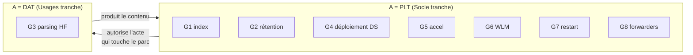
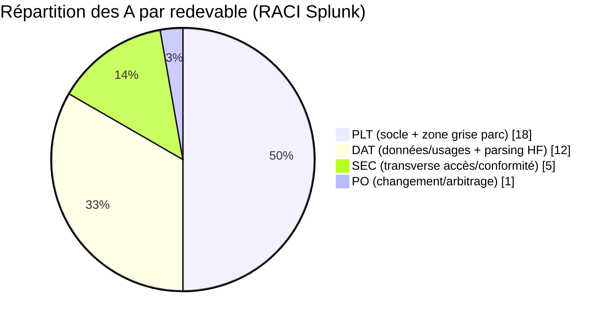

# Chapitre 2 — RACI d'exploitation

> Le cœur du handbook. Pour chaque activité du catalogue (chapitre 1), ce
> chapitre attribue les rôles **R**esponsible / **A**ccountable /
> **C**onsulted / **I**nformed aux six fonctions d'exploitation. La règle
> structurante : **un seul A par ligne**. Le RACI se lit domaine par domaine ;
> une section de synthèse récapitule « qui est redevable de quoi », et une
> section d'usage explique comment trancher un cas non listé.

## 1. Rappel des six rôles et de la notation

| Code | Rôle | | Lettre | Sens |
| --- | --- | --- | --- | --- |
| **PLT** | Exploitation Plateforme (infra Splunk) | | **R** | Réalise |
| **DAT** | Exploitation Données & usages | | **A** | Redevable / approuve (**un seul**) |
| **SEC** | Sécurité, IAM & conformité | | **C** | Consulté (avant) |
| **HEB** | Hébergement / socle technique | | **I** | Informé (après) |
| **PO** | Product Owner / responsable de service | | | |
| **USR** | Utilisateurs / analystes | | | |

> Convention de lecture : une cellule peut cumuler des lettres (`R,A`) quand
> le réalisateur est aussi le redevable. Un tiret (`–`) signifie « pas
> impliqué ». Chaque ligne a **exactement un A**.

## 2. Domaine A — Socle & disponibilité (activités `S`)

Régime : **changement lourd** (fenêtre de maintenance, rollback testé, CAB si
applicable). Le redevable est presque toujours **PLT** — c'est la définition
du plan Socle.

| ID | Activité | PLT | DAT | SEC | HEB | PO | USR |
| --- | --- | :-: | :-: | :-: | :-: | :-: | :-: |
| **S1** | Montée de version splunkd / patch | **R,A** | C | C | C | I | I |
| **S2** | Cluster indexer (CM, RF/SF, peers) | **R,A** | I | – | C | I | – |
| **S3** | Search head cluster (captain, membres) | **R,A** | I | – | C | I | – |
| **S4** | Licence — enforcement opérationnel | **R,A** | C | – | – | C | – |
| **S5** | Capacité & sizing | **R,A** | C | – | C | C | – |
| **S6** | Sauvegarde & PRA | **R,A** | – | C | R | I | – |
| **S7** | TLS / certificats d'infrastructure | **R,A** | – | C | C | – | – |
| **S8** | Monitoring de santé plateforme | **R,A** | C | – | I | I | – |
| **S9** | Config système (`server.conf`, `limits.conf`…) | **R,A** | C | – | C | – | – |
| **S10** | Deployment server (l'outil) | **R,A** | C | – | – | – | – |

Points de RETEX :

- **S4 (licence)** : PLT est redevable de **tenir la plateforme sous le
  quota** au quotidien (couper une source qui explose, réserver le pool). Le
  **renouvellement commercial et le budget** de licence sont une décision
  **PO** (arbitrage financier) — c'est une activité de gouvernance de service,
  pas d'exploitation, d'où le `C` de PO ici et un A distinct côté budget hors
  RACI d'exploitation.
- **S6 (PRA)** : la sauvegarde a **deux étages**. L'étage Splunk (`etc`, KV
  store, buckets) est **R,A = PLT** ; l'étage stockage sous-jacent (snapshots,
  réplication de baie) est **R = HEB**. Le **test de restauration** est
  l'activité qu'on oublie : elle est portée par PLT et doit être **planifiée**,
  pas supposée.
- **S9** : `limits.conf` a des bornes qui **plafonnent les recherches des
  usages** (ex. `maxresultrows`, `srchmaxtime`). PLT reste redevable, mais
  **DAT est consulté** parce qu'un serrage mal calibré casse des usages
  légitimes.

## 3. Domaine B — Données & usages (activités `D`)

Régime : **changement standard** (file priorisée, rollback rapide). Redevable
presque toujours **DAT**. `USR` réalise le contenu de *son* périmètre ; `DAT`
gouverne l'espace **partagé**.

| ID | Activité | PLT | DAT | SEC | HEB | PO | USR |
| --- | --- | :-: | :-: | :-: | :-: | :-: | :-: |
| **D1** | Onboarding de source | C | **R,A** | C | I | I | C |
| **D2** | Parsing / extraction (`props`/`transforms`) | C | **R,A** | – | – | – | – |
| **D3** | Normalisation CIM | – | **R,A** | – | – | – | C |
| **D4** | Qualité de la donnée | C | **R,A** | – | – | I | I |
| **D5** | Contenu partagé (KO partagés) | – | **A** | – | – | – | R |
| **D6** | Tableaux de bord de service | – | **A** | – | – | I | R |
| **D7** | Alertes & recherches planifiées | C | **A** | C | – | – | R |
| **D8** | Conception d'accélérations orientées usage | C | **R,A** | – | – | – | C |
| **D9** | Support utilisateur N1/N2 | – | **R,A** | – | – | – | C |
| **D10** | Cycle de vie du contenu (revue, orphelins) | – | **R,A** | C | – | I | I |

Points de RETEX :

- **D5–D7 (`A = DAT`, `R = USR`)** : un power user **crée** son alerte ou son
  dashboard partagé (`R`), mais **DAT est redevable de l'espace partagé** —
  nommage, non-duplication, coût de planification, dépréciation. C'est la
  distinction « je produis du contenu » (USR) vs « je gouverne le rayon où ce
  contenu vit » (DAT). Le contenu **strictement privé** d'un utilisateur sort
  du RACI d'exploitation : il appartient à l'utilisateur.
- **D7** : `PLT` est **consulté** parce qu'une recherche planifiée consomme du
  scheduler et de la ressource (interface I2, WLM `G6`). `SEC` est consulté
  pour les alertes à finalité sécurité (elles peuvent devenir des artefacts de
  conformité).
- **D1** : la ligne exhibe **les trois consultations qui rendent l'onboarding
  sain** — `PLT` (capacité, index), `SEC` (sensibilité → déclenche `T5`),
  `USR` (le besoin réel). Un onboarding sans ces trois C est un onboarding qui
  crée une dette (source non parsée, sur-volume, données sensibles en clair).

## 4. Domaine C — Zone grise (activités `G`) — la section décisive

C'est ici que la séparation se joue. Chaque ligne **tranche** un A que
beaucoup d'organisations laissent flou. La colonne « pourquoi cet A » est la
justification opposable.

| ID | Activité | PLT | DAT | SEC | HEB | PO | USR | Pourquoi cet A |
| --- | --- | :-: | :-: | :-: | :-: | :-: | :-: | --- |
| **G1** | Création / suppression d'index | **R,A** | C | C | – | I | – | L'index est un objet **capacitaire** (stockage, réplication, rétention) : l'acte est socle. |
| **G2** | Politique de rétention | **A** | C | C | R | I | – | La **faisabilité capacité** prime ; PLT tranche, mais l'exigence métier/légale (DAT/SEC) est contraignante. |
| **G3** | Parsing sur heavy forwarder | C | **R,A** | – | – | – | – | Le **contenu** du parsing est donnée ; PLT est consulté car le HF est un actif socle à charge maîtrisée. |
| **G4** | Déploiement TA/app via DS | **A** | R | – | – | – | – | L'acte qui **touche le parc** (mise en `serverclass`) est socle : A=PLT ; DAT produit et valide le TA (R). |
| **G5** | Autorisation d'accélération coûteuse | **R,A** | C | – | – | C | – | Une accélération consomme **ressource et espace socle** : l'autorisation est capacitaire. DAT conçoit (`D8`). |
| **G6** | Workload Management | **R,A** | C | – | – | C | I | WLM **plafonne la ressource** : c'est un acte socle. La politique de priorité entre usages est co-construite (C). |
| **G7** | Rolling restart / bundle push | **R,A** | C | – | – | – | I | **Quand et comment redémarrer** le parc est socle, même si le besoin vient de DAT. |
| **G8** | Gestion des forwarders (UF) | **R,A** | – | – | C | – | – | La config forwarder est socle Splunk ; HEB est consulté comme propriétaire de l'hôte. |

Points de RETEX sur la zone grise :

- **Le motif dominant** : dès qu'une activité **touche le parc** (indexers,
  forwarders, ressource partagée), l'A bascule côté **PLT**, même quand le
  *besoin* vient des usages. Une seule activité grise reste côté **DAT** : le
  *contenu* du parsing (`G3`), parce qu'une erreur de parsing dégrade une
  source, pas la plateforme — tant qu'elle ne passe pas par un déploiement
  (`G4`) ou un restart (`G7`), qui, eux, sont socle.
- **G4 est le point de couture** : c'est là que le contenu produit par DAT
  franchit la frontière vers le parc socle. Le tranchage **R=DAT / A=PLT** est
  ce qui rend le pipeline versionné (ch. 4) obligatoire : DAT ne pousse jamais
  directement, PLT ne réécrit jamais le contenu. Chacun sur son étape.
- **G2 (rétention)** est le tranchage le plus contesté : DAT et SEC veulent
  « garder plus », PLT dit « la capacité dit non ». En posant **A=PLT sur la
  faisabilité**, on évite qu'une exigence de rétention non financée sature les
  disques — l'exigence non tenable remonte alors en arbitrage **PO** (ligne
  `T6`), pas en incident de saturation.

## 5. Domaine D — Transverse (activités `T`)

Ces activités ne relèvent d'aucun plan. Le redevable est **SEC** pour ce qui
touche l'accès et la conformité, **PO** pour le processus de changement, et
**partagé selon la nature** pour l'incident.

| ID | Activité | PLT | DAT | SEC | HEB | PO | USR |
| --- | --- | :-: | :-: | :-: | :-: | :-: | :-: |
| **T1** | RBAC — rôles & capabilities | R | C | **A** | – | C | – |
| **T2** | Authentification (SAML/LDAP, MFA) | R | – | **A** | C | – | I |
| **T3** | Secrets (`splunk.secret`, tokens, comptes svc) | R | – | **A** | C | – | – |
| **T4** | Audit & conformité | C | C | **R,A** | – | I | – |
| **T5** | Anonymisation / DLP à l'ingestion | C | R | **A** | – | – | – |
| **T6** | Gestion du changement (le régime) | C | C | C | – | **R,A** | – |
| **T7a** | Incident **plateforme** (P1/P2) | **R,A** | C | C | C | I | I |
| **T7b** | Incident **service / donnée** (P3) | C | **R,A** | – | – | I | C |

Points de RETEX :

- **T1–T3 (`A = SEC`, `R = PLT`)** : c'est la distinction **politique vs
  exécution**. SEC **définit** le modèle d'accès, la politique
  d'authentification, la gestion des secrets ; PLT **exécute** dans
  `authorize.conf`, `authentication.conf`, la rotation de `splunk.secret`. Le
  détail du modèle d'habilitation est le sujet du
  [handbook Gouvernance des usages Splunk](../gouvernance-utilisateurs-splunk/README.md).
- **T5 (anonymisation)** : `SEC` dit **quoi masquer** (A) ; `DAT`
  **implémente** le `SEDCMD`/filtrage à l'index-time (R) ; `PLT` est consulté
  car le masquage index-time se joue sur un composant socle (indexer/HF). Un
  masquage raté = donnée sensible publiée dans l'index = incident de
  conformité, d'où l'A côté SEC.
- **T7 (incident) est volontairement scindé** en deux lignes parce qu'un même
  A ne peut pas couvrir « indexer down » et « une alerte métier ne se déclenche
  pas ». La **qualification** de l'incident (à quel T7 il appartient) est la
  première décision d'astreinte — mal faite, elle envoie le mauvais expert.
  Voir le triage au chapitre 4 et la
  [méthodologie de triage](../../methodologies/triage-alerte.md).

## 6. Synthèse — qui est redevable de quoi

Le RACI se résume par sa **colonne A**. C'est la carte d'imputabilité de la
plateforme.

| Redevable (A) | En est redevable de… |
| --- | --- |
| **PLT** | S1–S10 (tout le socle), G1, G2, G4, G5, G6, G7, G8, T7a |
| **DAT** | D1–D10 (toutes les données/usages), G3, T7b |
| **SEC** | T1, T2, T3, T4, T5 (accès, secrets, audit, conformité, anonymisation) |
| **PO** | T6 (le régime de changement), arbitrage inter-plans, budget/licence (hors RACI RUN) |
| **HEB** | Aucune ligne en A dans le RACI **Splunk** — HEB est *sous* Splunk : il est A du socle technique (OS, stockage, réseau, sauvegarde bas niveau) dans **son propre** RACI, et **R/C** ici |
| **USR** | Aucune ligne en A — l'utilisateur **réalise** du contenu (R en D5–D7) mais n'est redevable que de son contenu **privé**, hors périmètre d'exploitation |

> Lecture : la masse des A est côté **PLT** parce que la zone grise, une fois
> tranchée, penche vers le socle (motif « touche le parc → PLT »). Ce n'est
> pas un déséquilibre de charge de travail — DAT **réalise** énormément (colonne
> R) — mais un déséquilibre d'**imputabilité**, ce qui est sain : le socle
> concentre le risque grave, donc l'imputabilité.

## 7. Comment se servir de ce RACI

### Pour trancher un cas non listé

1. **Nommer l'activité** et la classer via le principe du ch. 1 (§7) : erreur
   rare-et-large → Socle ; fréquente-et-étroite → Usages ; rare-mais-déclenchée
   -fréquemment → zone grise.
2. **Appliquer le motif de la zone grise** : l'acte **touche-t-il le parc ou
   une ressource partagée** ? Si oui → **A=PLT**. Sinon, est-ce du **contenu /
   de la donnée** ? → **A=DAT**. Touche-t-il l'**accès/la conformité** ? →
   **A=SEC**.
3. **Vérifier l'unicité de l'A** et nommer les **C** (ceux dont l'ignorance
   crée un incident) et les **I**.

### Les trois anti-patterns du RACI

- **Deux A** sur une ligne : personne n'est redevable. Toujours en trancher un.
- **Un A sans C** sur une zone grise : le redevable décide sans le sachant de
  l'autre plan → décision techniquement juste, opérationnellement fausse.
- **Un R qui devient A de fait** : l'exécutant (souvent PLT sur du contenu, ou
  USR sur du partagé) finit par décider faute de redevable présent. C'est la
  frontière qui s'efface — le symptôme du ch. 0.

## Sources

- [Splunk Lantern — SSF, Assigning responsibility for a Splunk deployment](https://lantern.splunk.com/Splunk_Success_Framework/Program_Management/Assigning_responsibility_for_a_Splunk_deployment) (RACI recommandé par Splunk — cf. [ch. 5, C-1](05-confrontation-sources.md))
- [Splunk Lantern — SSF, Setting roles and responsibilities](https://lantern.splunk.com/Splunk_Success_Framework/People_Management/Setting_roles_and_responsibilities) (rôles = ensembles de responsabilités ; Knowledge Manager ≈ DAT)
- [Splunk Docs — CoE Handbook, Staffing model](https://docs.splunk.com/Documentation/CoE/current/Handbook/StaffingModel) (matrice de responsabilités)
- Référence interne : [`methodologies/itil-gouvernance-changement.md`](../../methodologies/itil-gouvernance-changement.md) (RACI, RFC, régimes de changement)
- Référence interne : [`methodologies/triage-alerte.md`](../../methodologies/triage-alerte.md) (qualification d'incident, T7)
- [Splunk Docs — Securing Splunk Enterprise 9.x](https://help.splunk.com/en/splunk-enterprise/administer/secure-splunk-enterprise) (RBAC, auth, secrets — T1–T3)
- [Handbook Gouvernance des usages Splunk](../gouvernance-utilisateurs-splunk/README.md) (détail du modèle d'habilitation)
