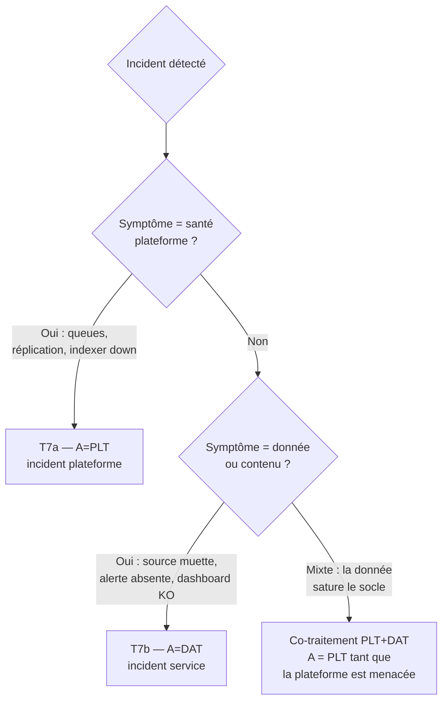

# Chapitre 3 — Risques et contraintes opérationnelles

> Le RACI dit *qui* fait quoi. Ce chapitre dit *ce qui peut mal tourner* et
> *ce qui contraint* l'exploitation, activité par activité et — surtout — à la
> **frontière** entre les deux plans. Il fournit un **registre de risques**
> réutilisable (accroché aux identifiants du chapitre 1), une lecture des
> **contraintes structurelles** qui ne se « corrigent » pas mais se
> **gèrent**, et les mitigations de RETEX associées.

## 1. Comment lire le registre

Chaque risque porte un identifiant `R<n>`, pointe vers la ou les activités
concernées (`S/D/G/T` du ch. 1), nomme son **redevable** (le A du ch. 2), et
distingue :

- **Cause** — le mécanisme déclencheur.
- **Impact** — la conséquence si le risque se réalise.
- **Cotation** — gravité × probabilité, sur une échelle simple
  🟢 faible / 🟡 moyen / 🟠 élevé / 🔴 critique. La cotation est un **repère
  d'archétype**, à recalibrer sur son contexte.
- **Mitigation** — l'action de réduction (RETEX).
- **Contrainte résiduelle** — ce qui reste vrai *même après* mitigation et
  qu'il faut assumer.

> La cotation n'est pas une vérité : c'est un support d'arbitrage. Le rôle du
> registre est de **rendre le risque discutable**, pas de le chiffrer
> faussement.

## 2. Risques de la **frontière** (les plus coûteux)

Ce sont les risques nés de la séparation elle-même — ou de son absence. Ils
n'appartiennent proprement à aucun plan, ce qui les rend orphelins si on n'y
prend garde.

| ID | Risque | Activités | A | Cause | Impact | Cotation |
| --- | --- | --- | :-: | --- | --- | :-: |
| **R1** | **Zone grise non tranchée** | G1–G8 | PLT/DAT | Aucun A assigné à une activité de frontière | Décision reportée → incident (index manquant, parsing non déployé) | 🔴 |
| **R2** | **Effacement de la frontière** | G3, G4, D5 | PLT/DAT | PLT écrit du contenu / USR pousse en prod directement | Perte d'imputabilité, contournement du pipeline, config non versionnée | 🟠 |
| **R3** | **Demande de capacité par surprise** | D1→S4/S5 | DAT | Onboarding sans interface I1 (volume non déclaré) | Dépassement licence, saturation disque, indexers en pression | 🟠 |
| **R4** | **Blocage réciproque** | G5, G7, T6 | PO | Le Socle refuse un changement dont l'Usage a un besoin urgent | Frustration, contournement, shadow IT Splunk | 🟡 |
| **R5** | **Incident mal qualifié** | T7a/T7b | PLT/DAT | Mauvais aiguillage (donnée traitée comme socle ou l'inverse) | Mauvais expert mobilisé, temps de résolution ×2 | 🟠 |

Mitigations et contraintes résiduelles :

- **R1** — *Mitigation* : la matrice du ch. 2 **doit être signée** par les
  redevables ; toute activité grise nouvelle passe par le §7 du ch. 2 avant
  première exécution. *Contrainte résiduelle* : la liste des zones grises
  n'est jamais close — chaque nouvelle fonctionnalité Splunk (nouveau type
  d'accélération, nouveau connecteur) en crée une ; il faut **une revue
  périodique** du RACI, pas un one-shot.
- **R2** — *Mitigation* : **pipeline versionné obligatoire** (`G4`, ch. 4) et
  **retrait des droits d'écriture directe** en prod pour tout le monde sauf
  l'acte de déploiement contrôlé. *Contrainte résiduelle* : le pipeline
  **ralentit** le hotfix légitime ; prévoir une voie express tracée, pas une
  porte dérobée.
- **R3** — *Mitigation* : **interface I1 contractualisée** (le contrat de
  demande de source, ch. 1 §6). *Contrainte résiduelle* : les estimations de
  volume sont **toujours fausses** au départ ; le Socle doit garder une marge
  capacitaire et un mécanisme de coupe rapide (`G6`/route WLM).
- **R4** — *Mitigation* : l'arbitrage inter-plans **remonte au PO** (`T6`), il
  ne se règle pas entre techniciens. *Contrainte résiduelle* : le PO doit
  **exister et être disponible** ; sans PO, R4 dégénère en R2 (contournement).
- **R5** — *Mitigation* : **arbre de qualification** d'incident en tête
  d'astreinte (ch. 4). *Contrainte résiduelle* : certains incidents sont
  **mixtes** (une source cassée *qui* sature une queue socle) ; prévoir un
  protocole de **co-traitement** PLT+DAT, pas un ping-pong.

## 3. Risques du plan **Socle** (`S`)

Rares mais graves — c'est la signature du plan. Redevable : **PLT** (adossé
HEB).

| ID | Risque | Activités | A | Impact | Cotation |
| --- | --- | --- | :-: | --- | :-: |
| **R6** | Upgrade régressif (TA/app incompatible) | S1 | PLT | Parsing cassé, dashboards HS post-upgrade | 🟠 |
| **R7** | Perte de quorum cluster (SF/RF non tenus) | S2, S3 | PLT | Données non recherchables, indisponibilité | 🔴 |
| **R8** | Dépassement de licence répété | S4 | PLT | Blocage de recherche (violation), risque contractuel | 🟠 |
| **R9** | Sauvegarde non restaurable | S6 | PLT | PRA fictif — découverte au pire moment | 🔴 |
| **R10** | Expiration de certificat | S7 | PLT | Rupture S2S/Web, forwarders déconnectés | 🟠 |
| **R11** | Saturation capacitaire silencieuse | S5, S8 | PLT | Latence d'indexation, files pleines, perte d'événements | 🟠 |

Mitigations clés :

- **R6** : **environnement de pré-production** iso-version et **matrice de
  compatibilité** TA/apps validée avant `S1` ; `C=DAT` du RACI n'est pas
  décoratif — DAT valide le parsing en pré-prod. *Contrainte* : maintenir un
  iso-prod a un coût ; sans lui, tout upgrade est un pari.
- **R7** : surveillance du **fixup**, respect des fenêtres, **jamais** deux
  actions socle concurrentes (upgrade + maintenance stockage HEB). *Contrainte*
  : le RF/SF impose un **plancher de peers** — on ne descend pas en dessous
  même « juste pour une maintenance ».
- **R9** : **test de restauration planifié** (pas supposé) et documenté ;
  c'est l'activité la plus négligée du plan Socle. *Contrainte* : une
  restauration KV store / SHC a des pré-requis d'ordre (captain, réplication)
  qu'il faut avoir répétés.
- **R10** : **inventaire des certificats avec dates**, alerte à J-30. Un
  certificat expiré est un incident **évitable à 100 %** — donc impardonnable
  en RETEX.

## 4. Risques du plan **Données & usages** (`D`)

Fréquents mais localisés — sauf effet de bord. Redevable : **DAT**.

| ID | Risque | Activités | A | Impact | Cotation |
| --- | --- | --- | :-: | --- | :-: |
| **R12** | Parsing incorrect (timestamp, line-break) | D2 | DAT | Événements mal datés/fusionnés, recherches faussées | 🟡 |
| **R13** | Non-conformité CIM | D3 | DAT | Data models vides, ES/corrélations aveugles | 🟡 |
| **R14** | Source muette / en retard non détectée | D4 | DAT | Angle mort : on croit couvert, on ne l'est pas | 🟠 |
| **R15** | Prolifération de contenu partagé | D5, D6, D10 | DAT | Doublons, dashboards morts, coût de scheduler | 🟡 |
| **R16** | Alerte mal calibrée (bruit ou silence) | D7 | DAT | Fatigue d'alerte ou détection manquée | 🟠 |

Mitigations clés :

- **R12/R13** : **revue de parsing** avant mise en prod, jeu de test
  d'événements, contrôle CIM automatisé. *Contrainte* : le search-time
  extraction est réparable a posteriori (bon), mais le **timestamp est
  index-time** — une erreur de date **n'est pas rattrapable** sans réindexation,
  d'où le 🟡 qui vire au 🟠 si non détecté tôt.
- **R14** : **monitoring de complétude** (source-tracking : dernière réception
  par source). C'est le pendant *données* du monitoring santé `S8`. *Contrainte*
  : distinguer « source légitimement silencieuse » (batch nocturne) d'une
  « source en panne » demande de connaître le métier — c'est pour ça que c'est
  DAT, pas PLT.
- **R15** : **cycle de vie du contenu** (`D10`) actif — revue, dépréciation,
  nettoyage des orphelins au départ d'un utilisateur. *Contrainte* : personne
  n'aime supprimer le dashboard de quelqu'un ; il faut une **politique**
  (inactivité N jours → archivage) pour dépersonnaliser la décision.

## 5. Risques de la zone grise (`G`) — effets de bord vers le socle

Ce sont des activités *données* dont l'erreur **remonte** au socle. C'est
pourquoi leur A a basculé côté PLT au ch. 2.

| ID | Risque | Activités | A | Mécanisme d'escalade vers le socle | Cotation |
| --- | --- | --- | :-: | --- | :-: |
| **R17** | Parsing HF trop lourd | G3 | DAT | Regex coûteuse × volume → CPU HF saturé → files pleines | 🟠 |
| **R18** | Accélération non maîtrisée | G5, D8 | PLT | Data models accélérés en excès → disque + CPU indexers | 🟠 |
| **R19** | Rolling restart trop fréquent | G7 | PLT | Chaque push de parsing → restart → indisponibilité cumulée | 🟠 |
| **R20** | Index mal dimensionné | G1, G2 | PLT | `maxTotalDataSizeMB`/rétention mal réglés → froid qui gèle trop tôt ou disque plein | 🟡 |
| **R21** | WLM mal calibré | G6 | PLT | Pool sous-dimensionné → recherches légitimes tuées, ou sur-dimensionné → pas de protection | 🟡 |

Mitigations clés :

- **R17** : **budget de coût de parsing** (préférer les extractions
  search-time quand possible, cf.
  [`concepts/splunk-parsing-phase-uf-vs-hf.md`](../../concepts/splunk-parsing-phase-uf-vs-hf.md)),
  revue PLT (le `C` de `G3`) sur les regex à fort volume. *Contrainte* :
  déplacer le parsing en search-time déporte le coût… vers les recherches
  (plan Usages). Il n'y a pas de coût gratuit — seulement un choix de *où* le
  payer.
- **R18/R19** : **grouper les changements** de parsing pour minimiser les
  restarts (`G7`), **plafonner le budget d'accélération** (`G5`). *Contrainte*
  : grouper les changements **allonge le délai** de mise en prod d'un parsing
  urgent — tension directe avec le rythme rapide des Usages (ch. 0, argument
  1). C'est un arbitrage assumé, pas un défaut.
- **R21** : **WLM en monitor-only d'abord**, calibrage sur données réelles
  avant enforce (RETEX du handbook Gouvernance). *Contrainte* : un WLM qui
  protège vraiment le socle **tuera** parfois une recherche métier légitime ;
  la politique de priorité (le `C=DAT/PO` de `G6`) doit être **assumée en
  amont**, pas découverte le jour où une recherche importante est coupée.

## 6. Risques transverses (`T`)

| ID | Risque | Activités | A | Impact | Cotation |
| --- | --- | --- | :-: | --- | :-: |
| **R22** | Fuite de données à l'ingestion | T5 | SEC | Donnée sensible indexée en clair (repo d'index = public interne) | 🔴 |
| **R23** | Dérive des accès (RBAC) | T1 | SEC | Sur-habilitation, capability héritée non révocable | 🟠 |
| **R24** | Compromission de secret | T3 | SEC | `splunk.secret`/token exposé → accès plateforme | 🔴 |
| **R25** | Changement non tracé | T6 | PO | Impossible de corréler incident ↔ changement | 🟠 |

Mitigations clés :

- **R22** : masquage **index-time** validé (`T5`, `A=SEC`, `R=DAT`), jeu de
  test de non-régression. *Contrainte* : le masquage index-time est
  **irréversible** — si on a laissé passer du sensible, l'événement est déjà
  indexé ; comme pour le repo public (cf. règle d'anonymisation du projet),
  **réécrire ne suffit pas**, il faut purger le bucket et tourner le secret le
  cas échéant.
- **R23/R24** : renvoi au [handbook Gouvernance des usages Splunk](../gouvernance-utilisateurs-splunk/README.md)
  (findings sur l'héritage non révocable, propagation de `splunk.secret` en
  SHC : cf. [`concepts/shc-splunk-secret-propagation.md`](../../concepts/shc-splunk-secret-propagation.md)).
- **R25** : **journal de changement** relié aux incidents (fenêtre, RFC).
  *Contrainte* : le niveau de traçabilité doit être **proportionné** — imposer
  une RFC lourde sur un changement standard de contenu (`D2`) tue le rythme des
  Usages (R4). Le régime de changement se **dégrade proprement** selon le plan
  (ch. 4, cf. [`methodologies/itil-gouvernance-changement.md`](../../methodologies/itil-gouvernance-changement.md)).

## 7. Les contraintes structurelles (ce qui ne se corrige pas)

Certaines contraintes ne sont pas des risques à mitiger mais des **propriétés
du système** à assumer dans toute décision d'exploitation. Les ignorer, c'est
promettre l'impossible.

| Contrainte | Énoncé | Conséquence opérationnelle |
| --- | --- | --- |
| **C1 — L'index-time est définitif** | Timestamp, line-breaking, masquage se figent à l'indexation | Toute erreur `D2`/`T5` détectée tard coûte une réindexation ou une purge, pas un patch |
| **C2 — Le socle a un rayon d'impact large** | Un restart/upgrade touche tous les usages | On **groupe** les changements socle ; le rythme socle est structurellement lent |
| **C3 — La capacité est finie et partagée** | CPU/RAM/disque/licence sont un pot commun | Tout usage nouveau **retire** de la marge d'un autre ; l'arbitrage est un jeu à somme nulle à capacité constante |
| **C4 — Le coût du parsing ne disparaît pas** | Index-time vs search-time = choix de *où* payer | Déplacer le coût est un arbitrage entre plan Socle et plan Usages, pas une économie |
| **C5 — L'imputabilité exige la séparation** | Sans frontière nommée, tout incident est « la faute de Splunk » | Le RACI n'est pas de la bureaucratie : c'est la précondition du diagnostic |
| **C6 — Les rythmes sont antagonistes** | Socle veut peu/lent, Usages veulent beaucoup/vite | Aucune organisation ne satisfait les deux rythmes dans une file unique — d'où la séparation |

> Ces contraintes sont le **socle argumentaire** du handbook. Quand une
> demande semble déraisonnable (« gardez tout, un an, sans acheter de
> disque » = C3+G2, « poussez ce parsing sans redémarrer » = C2+G7, « corrigez
> la date d'hier » = C1), c'est une contrainte structurelle qui parle, et la
> réponse est un **arbitrage explicité**, pas un « non » technique sec.

## Sources

- Référence interne : [`concepts/splunk-parsing-phase-uf-vs-hf.md`](../../concepts/splunk-parsing-phase-uf-vs-hf.md) (coût du parsing, index-time vs search-time)
- Référence interne : [`concepts/splunk-rolling-restart-triggers.md`](../../concepts/splunk-rolling-restart-triggers.md) (ce qui déclenche un restart — R19)
- Référence interne : [`concepts/splunk-buckets-multisite-lifecycle.md`](../../concepts/splunk-buckets-multisite-lifecycle.md) (rétention, gel — R20)
- Référence interne : [`concepts/shc-splunk-secret-propagation.md`](../../concepts/shc-splunk-secret-propagation.md) (secrets en SHC — R24)
- [Splunk Docs — Capacity Planning Manual 9.x](https://help.splunk.com/en/splunk-enterprise/administer/capacity-planning) (C3, R11)
- [Splunk Docs — Managing indexers and clusters 9.x](https://help.splunk.com/en/splunk-enterprise/administer/manage-indexers-and-indexer-clusters) (R7, R20)
