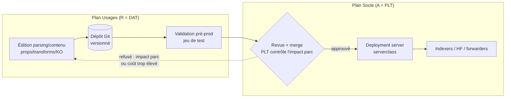

# Chapitre 4 — Interfaces, contrats et rituels

> Une frontière ne tient pas parce qu'on l'a dessinée : elle tient parce
> qu'on la **fait vivre**. Ce chapitre décrit les mécanismes concrets qui
> rendent la séparation praticable au quotidien — les **contrats** d'interface,
> le **pipeline de contenu**, les **régimes de changement** différenciés,
> le **partage de l'astreinte**, les **rituels** de coordination — et clôt sur
> un catalogue d'**anti-patterns** de RETEX.

## 1. Les trois contrats d'interface

Le chapitre 1 a nommé trois interfaces (I1 demande de capacité, I2 signal
d'usage anormal, I3 pipeline de contenu). Ici on leur donne un **contrat** :
le minimum d'information qui rend l'échange fiable.

### Contrat I1 — Demande de source (Usages → Socle)

Émis par **DAT** (`D1`), consommé par **PLT** (`S5`, `G1`). Sans ces champs,
la demande est incomplète et doit être renvoyée, pas devinée.

| Champ | Pourquoi il est requis | Risque si absent |
| --- | --- | --- |
| Nom logique de la source | Identifier et tracer | — |
| Sourcetype cible | Rattacher parsing et CIM | Parsing par défaut, données brutes |
| Index cible / périmètre | Provisionnement (`G1`) | Index poubelle `main` |
| Volume/jour estimé | Capacité + licence (`S4`, `S5`) | R3 — surprise de volume |
| Criticité | Priorité, rétention, astreinte | Mauvaise priorisation |
| Rétention souhaitée | `G2` | R20 — dimensionnement faux |
| Sensibilité des données | Déclenche `T5` (masquage) | R22 — fuite à l'ingestion |

### Contrat I2 — Signal d'usage anormal (Socle → Usages)

Émis par le monitoring **PLT** (`S8`), consommé par **DAT** (`D7`, `D9`).
Contenu minimal : quelle recherche/utilisateur, quel comportement (real-time
non bornée, scan `index=*` all-time, cardinalité explosive), quel effet
mesuré sur le socle, quelle alternative recommandée. Le **WLM** (`G6`) est la
version *automatisée* de I2 : au lieu de signaler, il **plafonne** — voir le
[Search Performance Handbook](../splunk-search-performance-handbook/README.md).

### Contrat I3 — Pipeline de contenu (Usages → parc, via Socle)

C'est l'interface la plus importante, parce que c'est là que le contenu
**franchit la frontière**. Elle mérite sa propre section.

## 2. Le pipeline de contenu (I3) — le cœur opérationnel

Le tranchage `G4` (**R=DAT / A=PLT**) n'est tenable que si le contenu voyage
par un **pipeline versionné**, jamais par une écriture directe sur un peer.
C'est la mitigation de **R2** (effacement de la frontière) et **R25**
(changement non tracé).

Les **cinq invariants** du pipeline (RETEX) :

1. **Tout artefact de config est dans Git** — `props.conf`, `transforms.conf`,
   apps, TA, dashboards de service. Ce qui n'est pas versionné n'existe pas.
2. **DAT ne pousse jamais directement** sur un composant du parc. DAT produit
   et valide ; le déploiement est l'acte socle (`A=PLT`).
3. **PLT ne réécrit jamais le contenu** — PLT contrôle l'**impact** (coût de
   parsing, restart nécessaire), pas la sémantique métier. Si le contenu est
   faux, il **revient** à DAT (flèche de refus), il n'est pas corrigé en douce.
4. **La validation pré-prod est un jeu de test d'événements réels
   anonymisés**, pas un « ça compile ». C'est la mitigation de R6/R12/R13.
5. **Le déploiement groupe les changements** pour minimiser les restarts
   (`G7`, R19) — d'où une **cadence de release** (voir §4), pas un flux continu
   de pushes.

> L'anti-pattern absolu : un administrateur qui édite un `props.conf` à la main
> sur `idx01` « juste pour tester », en pleine nuit d'incident. Ça marche, ça
> n'est pas versionné, personne ne le sait, et six mois plus tard un push DS
> l'écrase et « la source recasse sans raison ». La frontière a été franchie
> dans le mauvais sens (PLT a fait du contenu, hors pipeline).

## 3. Régimes de changement différenciés

Le régime de changement (`T6`, `A=PO`) **n'est pas uniforme** : il se
**dégrade proprement** selon le plan, exactement comme le préconise la
gouvernance ITIL. Appliquer le régime lourd du Socle aux Usages tue leur
rythme (R4) ; appliquer le régime léger des Usages au Socle crée des incidents
plateforme.

| Plan / activité | Type de changement | Régime | Fenêtre | Rollback |
| --- | --- | --- | --- | --- |
| Socle `S1`–`S3`, `S7` | **Majeur** | RFC + CAB + fenêtre planifiée | Maintenance | Testé, obligatoire |
| Socle `S5`, `S6`, `S9` | **Normal** | RFC allégée, revue PLT | Planifiée | Documenté |
| Zone grise `G1`, `G6`, `G7` | **Normal encadré** | Revue PLT + info DAT | Groupée | Documenté |
| Zone grise `G3`, `G4` (contenu) | **Standard** | Pipeline + validation pré-prod | Cadence release | Git revert |
| Usages `D2`, `D5`–`D7` | **Standard** | File priorisée, auto-approuvé après test | Continu | Git revert |
| Urgence (toute) | **Urgent** | Voie express **tracée** a posteriori | Immédiate | Prévu |

Le **détail du dispositif** (RFC, CAB, fenêtres de gel, revue post-implémentation,
dégradation propre du modèle) est dans
[`methodologies/itil-gouvernance-changement.md`](../../methodologies/itil-gouvernance-changement.md).
La règle de RETEX : **le poids du régime doit être proportionné au rayon
d'impact** (contrainte C2), pas au « niveau de stress » de l'organisation.

## 4. La cadence de release

Concilier « Socle veut peu de restarts » (`G7`, R19) et « Usages veulent
livrer vite » (R4) passe par une **cadence de release groupée** du contenu de
parsing :

- Une **fenêtre de release régulière** (ex. bi-hebdomadaire) où PLT déploie le
  lot de contenu validé par DAT et déclenche **un** rolling restart pour tout
  le lot, au lieu d'un par changement.
- Une **voie express** pour l'urgence (source critique cassée), tracée, qui
  déclenche un restart hors cadence — l'exception, pas la règle.
- Les changements **search-time only** (extractions, KO qui ne nécessitent pas
  de restart des indexers) peuvent suivre un flux **plus rapide** : distinguer
  ce qui exige un restart de ce qui n'en exige pas est un savoir opérationnel
  clé (cf. [`concepts/splunk-rolling-restart-triggers.md`](../../concepts/splunk-rolling-restart-triggers.md)).

```mermaid
gantt
    title Cadence de release — grouper pour minimiser les restarts
    dateFormat  X
    axisFormat  %s
    section DAT (Usages)
    Contenu validé en continu    :active, d1, 0, 10
    section PLT (Socle)
    Lot de release (1 restart)   :milestone, m1, 5, 0
    Lot de release (1 restart)   :milestone, m2, 10, 0
    section Urgence
    Voie express (hors cadence)  :crit, u1, 3, 1
```

## 5. Le partage de l'astreinte

L'astreinte matérialise `T7a`/`T7b`. Deux modèles, selon la maturité :

- **Astreinte à deux niveaux** (recommandé à l'échelle) : un **N1 plateforme**
  (PLT) qui qualifie et traite les incidents socle, un **N2 données/contenu**
  (DAT) escaladé pour les incidents de service. La **qualification** (arbre du
  ch. 3 §2) est la première décision et détermine qui est réveillé.
- **Astreinte mutualisée** (petite structure) : une même personne d'astreinte,
  mais **outillée pour qualifier** — elle doit savoir dire « c'est socle » ou
  « c'est donnée » pour appliquer le bon runbook, même si elle porte les deux.

Invariant : **un incident mixte** (une source qui sature une queue socle,
R5/R17) se traite en **co-traitement** avec un A qui reste **PLT tant que la
plateforme est menacée**, puis repasse **DAT** pour la remédiation de fond
(corriger le parsing). L'A **se déplace dans le temps** — c'est explicite, pas
ambigu. Le triage s'appuie sur
[`methodologies/triage-alerte.md`](../../methodologies/triage-alerte.md).

## 6. Les rituels de coordination

La frontière a besoin de **points de contact réguliers**, sinon les deux plans
divergent. Le minimum viable :

| Rituel | Fréquence | Qui | Objet |
| --- | --- | --- | --- |
| **Revue de capacité** | Mensuelle | PLT + PO + DAT | Projection volume/licence/disque, arbitrage des nouvelles sources (I1) |
| **Revue de release** | Par cadence | PLT + DAT | Lot de contenu à déployer, restarts à grouper (I3, G7) |
| **Revue RACI** | Trimestrielle | PLT + DAT + SEC + PO | Nouvelles zones grises (R1), ajustement des A |
| **Post-mortem** | Par incident majeur | Selon T7 | Cause racine, frontière franchie ?, mitigation |
| **Revue de contenu** | Semestrielle | DAT + USR | Dépréciation (`D10`, R15), dashboards morts |

> Ces rituels **sont** l'exploitation à deux plans. Sans eux, on retombe sur le
> symptôme du ch. 0 : deux équipes qui s'accusent mutuellement au premier
> incident.

## 7. Anti-patterns de RETEX

Le condensé des pièges observés, chacun relié à son risque et à sa règle.

| Anti-pattern | Ce qu'on voit | Risque | Règle violée |
| --- | --- | --- | --- |
| **« On fait tout »** | Une équipe unique porte Socle + Usages sans distinguer les plans | R5, R4 | Ch. 0 — les rythmes sont antagonistes |
| **Édition directe en prod** | `props.conf` modifié à la main sur un peer | R2, R25 | I3 — invariant 2 |
| **PLT corrige le contenu** | L'admin « répare » un parsing métier lui-même | R2 | I3 — invariant 3 |
| **Onboarding sauvage** | Nouvelle source branchée sans contrat I1 | R3 | Interface I1 |
| **Index `main` fourre-tout** | Toutes les sources dans un seul index | R20, R23 | G1 — provisionnement par périmètre |
| **Restart par changement** | Un rolling restart à chaque push de parsing | R19 | Cadence de release (§4) |
| **PRA supposé** | Sauvegarde jamais testée en restauration | R9 | S6 — test planifié |
| **A multiple** | Deux équipes « responsables » d'une zone grise | R1 | Ch. 2 — un seul A |
| **WLM en enforce direct** | Plafonnement activé sans phase monitor-only | R21 | Ch. 3 §5 — calibrer d'abord |
| **Zone grise ignorée** | On découvre une frontière au moment de l'incident | R1 | Revue RACI trimestrielle |

## 8. Le point d'équilibre

Séparer les deux plans **coûte** : des rituels, un pipeline, une cadence, une
astreinte à deux niveaux. Ce coût est réel et il faut l'assumer. Ce qu'il
achète : un diagnostic possible (C5), des rythmes tenables (C6), un risque
grave concentré et gouverné (le socle), un risque fréquent absorbé sans bruit
(les usages). La séparation n'est pas une élégance organisationnelle — c'est
la condition pour que la plateforme **tienne** *et* **serve** à la fois, ce
qu'aucune équipe indifférenciée ne réussit durablement à l'échelle.

## Sources

- Référence interne : [`methodologies/itil-gouvernance-changement.md`](../../methodologies/itil-gouvernance-changement.md) (régimes de changement, RFC, CAB, dégradation propre)
- Référence interne : [`methodologies/triage-alerte.md`](../../methodologies/triage-alerte.md) (qualification d'incident — T7)
- Référence interne : [`concepts/splunk-rolling-restart-triggers.md`](../../concepts/splunk-rolling-restart-triggers.md) (ce qui exige un restart — §4)
- Référence interne : [`concepts/cicd-deployment-patterns.md`](../../concepts/cicd-deployment-patterns.md) (pipeline versionné — I3)
- [Splunk Docs — Deployment server 9.x](https://help.splunk.com/en/splunk-enterprise/administer/update-splunk-enterprise-instances) (I3, serverclass)
- [Splunk Search Performance Handbook](../splunk-search-performance-handbook/README.md) (I2, WLM)
