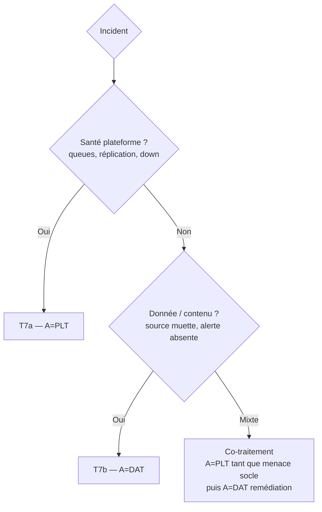

# Chapitre 99 — Cheatsheet : qui fait quoi

> Rappel condensé, à rouvrir en action : la frontière en une image, la colonne
> A du RACI, les zones grises tranchées, les red flags, et l'arbre de
> qualification d'incident. Pour la justification, revenir aux chapitres 0 à 4.

## La frontière en une phrase

> **Socle = « Splunk tient-il ? » (rare, large, lent, A=PLT). Usages = « la
> donnée sert-elle ? » (fréquent, étroit, rapide, A=DAT). Zone grise = ce qui
> touche le parc → A=PLT ; ce qui n'est que du contenu → A=DAT.**

## Les six rôles

| Code | Rôle | A de quoi |
| --- | --- | --- |
| **PLT** | Plateforme (infra Splunk) | Socle `S*` + zone grise « parc » + incident plateforme |
| **DAT** | Données & usages | Données/contenu `D*` + parsing HF + incident service |
| **SEC** | Sécurité, IAM, conformité | Accès, secrets, audit, anonymisation `T1–T5` |
| **HEB** | Hébergement (OS, stockage, réseau, sauvegarde) | Socle *sous* Splunk (RACI propre) |
| **PO** | Product Owner / service | Régime de changement, arbitrage inter-plans, budget |
| **USR** | Utilisateurs / analystes | Leur contenu privé (réalise le contenu partagé, ne l'A pas) |

## Colonne A — carte d'imputabilité

| A | Lignes |
| --- | --- |
| **PLT** | S1–S10, G1, G2, G4, G5, G6, G7, G8, T7a |
| **DAT** | D1–D10, G3, T7b |
| **SEC** | T1, T2, T3, T4, T5 |
| **PO** | T6 (+ arbitrage, budget) |

## Les 8 zones grises — tranchées

| # | Activité | A | Règle mémo |
| --- | --- | :-: | --- |
| G1 | Création/suppression d'index | **PLT** | Objet capacitaire → socle ; DAT consulté (besoin) |
| G2 | Rétention | **PLT** | Faisabilité capacité prime ; DAT/SEC contraignent |
| G3 | Parsing sur HF | **DAT** | Contenu = donnée ; PLT consulté (charge HF) |
| G4 | Déploiement TA via DS | **PLT** | L'acte touche le parc ; DAT produit (R) |
| G5 | Accélération coûteuse | **PLT** | Autorisation capacitaire ; DAT conçoit |
| G6 | Workload Management | **PLT** | Plafonne la ressource ; politique co-construite |
| G7 | Rolling restart | **PLT** | *Quand/comment* redémarrer = socle |
| G8 | Forwarders (UF) | **PLT** | Config Splunk ; HEB consulté (hôte) |

> **Motif unique** : « touche le parc → PLT ; contenu pur → DAT ; accès/conformité → SEC ».

## Les 3 interfaces

| # | Sens | Contrat minimal |
| --- | --- | --- |
| **I1** | Usages → Socle | Demande de source : sourcetype, index, **volume/jour**, criticité, rétention, **sensibilité** |
| **I2** | Socle → Usages | Signal d'usage anormal (ou WLM qui plafonne) : quelle recherche, quel effet, quelle alternative |
| **I3** | Usages → parc | Pipeline versionné : Git → validation pré-prod → merge (PLT) → DS → restart groupé |

## Les 6 contraintes structurelles (à ne jamais promettre d'ignorer)

| # | Contrainte | Traduction |
| --- | --- | --- |
| C1 | Index-time définitif | Corriger la date d'hier = réindexer, pas patcher |
| C2 | Rayon d'impact socle large | On **groupe** les restarts ; le socle est lent par nature |
| C3 | Capacité finie et partagée | Tout usage nouveau retire de la marge d'un autre |
| C4 | Coût du parsing ne disparaît pas | Index-time vs search-time = *où* payer, pas *si* |
| C5 | Imputabilité exige la séparation | Sans frontière, tout est « la faute de Splunk » |
| C6 | Rythmes antagonistes | Une file unique ne satisfait ni le socle ni les usages |

## Arbre de qualification d'incident

## Red flags — arrêter et corriger

- ❌ Un `props.conf` édité **à la main** sur un peer → hors pipeline (R2).
- ❌ Une nouvelle source **sans volume déclaré** → surprise capacité (R3).
- ❌ **Deux équipes** « responsables » d'une même zone grise → aucun A (R1).
- ❌ Un **rolling restart par changement** de parsing → indispo cumulée (R19).
- ❌ Une **sauvegarde jamais restaurée** en test → PRA fictif (R9).
- ❌ Un **WLM activé en enforce** sans phase monitor-only → recherches tuées (R21).
- ❌ Un **certificat sans date de suivi** → coupure évitable (R10).
- ❌ **PLT qui corrige le contenu** métier lui-même → frontière franchie (R2).
- ❌ Tout dans l'index **`main`** → dimensionnement et accès ingérables (R20/R23).
- ❌ Une exigence de rétention **non financée** acceptée en silence → saturation (G2/R20).

## Les 5 rituels qui font tenir la frontière

| Rituel | Fréquence | Objet |
| --- | --- | --- |
| Revue de capacité | Mensuelle | Volume/licence/disque, nouvelles sources (I1) |
| Revue de release | Par cadence | Grouper contenu + restarts (I3, G7) |
| Revue RACI | Trimestrielle | Nouvelles zones grises (R1) |
| Post-mortem | Par incident majeur | Frontière franchie ? Cause racine |
| Revue de contenu | Semestrielle | Dépréciation, dashboards morts (D10) |

## Où aller pour le détail

| Besoin | Chapitre |
| --- | --- |
| *Pourquoi* séparer | [0 — Modèle à deux plans](00-modele-exploitation.md) |
| Classer une activité | [1 — Catalogue](01-catalogue-activites.md) |
| Trancher un « qui fait quoi » | [2 — RACI](02-raci-exploitation.md) |
| Instruire un arbitrage / un risque | [3 — Risques & contraintes](03-risques-et-contraintes.md) |
| Faire vivre la frontière | [4 — Interfaces & rituels](04-interfaces-et-rituels.md) |
| Confronter le modèle aux cadres Splunk / RETEX | [5 — Confrontation aux sources](05-confrontation-sources.md) |

## Sources

- Ce handbook, chapitres 0 à 4 (les identifiants `S/D/G/T`, `R1–R25`, `C1–C6` y sont définis).
- [Handbook Gouvernance des usages Splunk](../gouvernance-utilisateurs-splunk/README.md) — modèle d'habilitation (T1–T3).
- [Splunk Search Performance Handbook](../splunk-search-performance-handbook/README.md) — WLM et signal d'usage (G6, I2).
