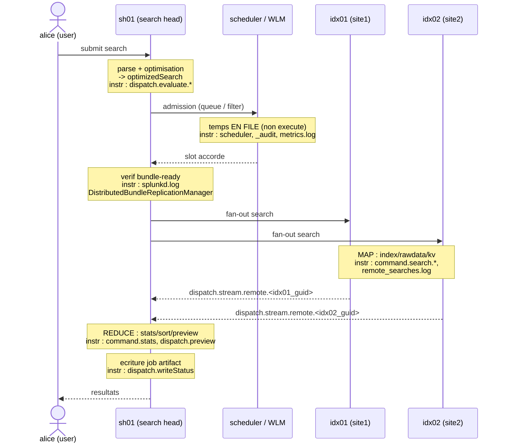

# Chapitre 00 — Modèle temporel et instruments de mesure

> **Enjeu temporel** — Ce chapitre ne réduit aucun temps ; il vous apprend à
> *le lire*. Une recherche distribuée dépense son temps dans une séquence de
> phases (parse et optimisation sur le search head, admission, vérification de
> bundle, fan-out, **map** sur les peers, **reduce** sur le search head,
> écriture du job artifact) ; chacune expose sa durée dans un instrument précis
> — un poste des *Execution costs* du Job Inspector, une propriété du job, une
> ligne de log. Tant que vous n'avez pas décomposé le wallclock total
> (`elapsedTime`) en ces postes, toute optimisation est un pari. Après ce
> chapitre, vous savez ouvrir un Job Inspector, nommer la phase qui domine, et
> désigner le chapitre 01-07 qui porte le levier. C'est le chapitre pivot : les
> suivants réutilisent son vocabulaire de marqueurs sans le redéfinir.

## Rappel mécanique

Une recherche ad hoc ou scheduled sur une plateforme distribuée 9.x traverse,
dans l'ordre où le temps s'y dépense : (1) **parse + optimisation** de la SPL
sur le search head (`sh01`), qui produit la chaîne `optimizedSearch` et découpe
le pipeline en portion distribuable (streaming, poussée aux peers) et portion
centralisée (transforming, gardée au SH) ; (2) **admission** par le scheduler et
le Workload Management (temps *en file*, non exécuté) ; (3) **vérification de
bundle-ready** puis **fan-out** REST parallèle vers les search peers ; (4)
**map** sur chaque peer (`idx01`, `idx02`, `idx03`) : sélection de buckets,
lookup tsidx, décompression rawdata, extraction search-time ; (5) **reduce** sur
le SH : commandes non-distribuables, preview ; (6) **écriture du job artifact**
dans le dispatch dir et restitution.

La séquence distribuée elle-même (vérification bundle → fan-out → map → reduce)
est décrite pas à pas, sous l'angle diagnostic bundle, dans
[`../splunk-shc-knowledge-bundle/04-sequence-recherche-distribuee.md`](../splunk-shc-knowledge-bundle/04-sequence-recherche-distribuee.md) ;
ici on la relit comme une **décomposition temporelle** et on rattache chaque
étape à son instrument. Le fait temporel utile : chaque phase tourne sur un
composant distinct (SH vs scheduler vs peers) et se lit dans un instrument
distinct ; confondre les composants, c'est chercher le temps au mauvais endroit
(voir [About distributed search](https://docs.splunk.com/Documentation/Splunk/9.4/DistSearch/Aboutdistributedsearch)).

## Décomposition du temps de cette phase

Le pipeline temporel, chaque étape annotée de son instrument dominant :



Le point d'entrée unique est le Job Inspector (**Job → Inspect Job** dans l'UI,
voir [Use the Job Inspector](https://docs.splunk.com/Documentation/Splunk/9.4/Search/ViewsearchjobpropertieswiththeJobInspector)).
Il expose deux zones et une propriété-somme.

**Job Inspector — *Execution costs*** (durée cumulée + nombre d'invocations par
commande interne). Les postes *côté peers* (phase map) :

| Marqueur | Ce qu'il chronomètre | Ce qu'il révèle |
| --- | --- | --- |
| `command.search.index` | lookup dans les tsidx (résolution *lispy* → postings) | sélectivité des termes indexés ; buckets ouverts |
| `command.search.rawdata` | lecture + décompression du `journal.gz` | matérialisation des events bruts (souvent le poste dominant) |
| `command.search.kv` | extraction search-time des champs | coût des `EXTRACT-*`/`KV_MODE` sur le peer |
| `command.search.calcfields` | calculated fields (`EVAL-*`) | KO automatiques attachés au sourcetype |
| `command.search.fieldalias` | field aliases | idem |
| `command.search.lookups` | lookups automatiques (`LOOKUP-*`) | idem |
| `command.search.typer` | eventtyping | coût du mode `verbose`/`smart` |
| `command.search.tags` | résolution des tags | expansion d'un `tag=` couvrant N sourcetypes |
| `command.search.filter` | application des filtres post-extraction | filtrage tardif |
| `command.prestats` | pré-agrégation distribuable (`prestats`) | part du `stats` poussée aux peers |

Les postes *côté search head* (phase reduce) : `command.stats`, `command.sort`,
`command.transaction`, `command.dedup` — commandes non-distribuables consommant
les flux des peers.

**Job Inspector — `dispatch.*`** (temps d'orchestration, tel qu'affiché dans le
Job Inspector 9.4) :

| Marqueur | Ce qu'il chronomètre |
| --- | --- |
| `dispatch.evaluate.*` | parse + optimisation de la chaîne (phase SH-side avant fan-out) |
| `dispatch.createdSearchResultInfrastructure` | initialisation des structures de résultat |
| `dispatch.stream.remote.<peer_guid>` | **temps par peer** — l'écart entre peers révèle le skew inter-peer / inter-site |
| `dispatch.stream.local` | streaming local (données présentes sur le SH) |
| `dispatch.fetch` | récupération des résultats partiels |
| `dispatch.preview` | génération des previews périodiques |
| `dispatch.results_combiner` | fusion des flux des peers |
| `dispatch.writeStatus` | écriture de l'état / du job artifact |

**Job Inspector — *Search job properties*** (voir
[About jobs and job management](https://docs.splunk.com/Documentation/Splunk/9.4/Search/Aboutjobsandjobmanagement)) :

| Propriété | Signification |
| --- | --- |
| `scanCount` | events lus sur disque ([Splexicon:Scancount](https://docs.splunk.com/Splexicon:Scancount)) |
| `eventCount` | events retenus après filtre |
| `resultCount` | lignes finales produites |
| `elapsedTime` | wallclock total du job |
| `optimizedSearch` / `normalizedSearch` | chaîne après expansion (macros/tags/eventtypes) puis optimisation |
| `remoteSearches` | nombre de recherches distribuées émises vers les peers |

**Règle de lecture cardinale** : `scanCount` >> `eventCount` signale un
**filtrage tardif** — vous ouvrez des events (et souvent des buckets) pour les
jeter ensuite ; la correction est de remonter le prédicat (ch01, ch04). Un
`dispatch.stream.remote.<peer_guid>` beaucoup plus haut pour les peers d'un site
que pour ceux d'un autre révèle un **déséquilibre de distribution ou d'affinity**
(ch04).

**Logs complémentaires** — chacun sa portée :

- **`search.log`** (dans `$SPLUNK_HOME/var/run/splunk/dispatch/<sid>/`, un
  fichier par recherche) : l'expansion (`UnifiedSearch - Expanded search`), le
  scoping de buckets (`IndexScopedSearch`) et l'évaluation *lispy*
  (`LispyEvaluator` — l'expression qui pilote tsidx et bloom filters), puis les
  phases de dispatch.
- **`metrics.log`** (voir [About metrics.log](https://docs.splunk.com/Documentation/Splunk/9.4/Troubleshooting/Aboutmetricslog)) :
  `group=searchscheduler` (skip/defer des scheduled), `group=search_concurrency`
  (slots occupés), `group=pipeline` (côté ingest), `group=per_index_thruput`.
- **`remote_searches.log`** (sur *chaque peer*) : la chaîne de recherche
  distribuée reçue et son timing local — c'est l'instrument qui distingue un
  peer lent d'un skew de distribution.
- **`_audit`** : `action=search` avec `total_run_time`, `scan_count`,
  `event_count`, `workload_pool` — la vue historique et par pool.
  **`_introspection`** : usage ressources par recherche (`search_telemetry`,
  `resource_usage`).
- **`splunkd.log`** : composant `DistributedBundleReplicationManager` — durée et
  échec des cycles de réplication de bundle (exploité au ch03).

Sur `_time` vs `_indextime` et le partage index-time / search-time (quel champ
est déjà matérialisé, donc gratuit au map, vs recalculé à chaque recherche),
voir [`../../concepts/splunk-cycle-de-vie-evenement.md`](../../concepts/splunk-cycle-de-vie-evenement.md).

## Leviers d'action

Ce chapitre porte les leviers **transverses** et **de méthode** ; les leviers
par phase vivent dans les chapitres dédiés.

- **Levier — borner le time range.** Fixer un intervalle explicite (time picker
  ou `earliest`/`latest`), jamais *All time* par réflexe.
  - **Effet temporel attendu** — le time range conditionne le nombre de buckets
    éligibles au map (bornes temporelles de bucket) ; moins de buckets → moins
    d'events lus → `command.search.index` et `command.search.rawdata` plus
    courts. C'est le levier de plus fort effet, transverse à toutes les phases
    (voir [How to optimize searches](https://docs.splunk.com/Documentation/Splunk/9.4/Search/Optimizesearches)).
  - **Comment le mesurer** — `scanCount` (Search job properties) avant/après ;
    buckets scannés dans `search.log` (ligne `IndexScopedSearch`).
  - **Frontière** — *autoportant*.

- **Levier — choisir le mode de recherche** (`fast` / `smart` / `verbose`).
  Réserver `verbose` au débogage ; `fast` quand les champs auto et l'eventtyping
  ne sont pas nécessaires.
  - **Effet temporel attendu** — `verbose` force le calcul de tous les champs,
    l'eventtyping et le tagging ; en 9.x, cela alourdit `command.search.typer`,
    `command.search.kv` et `command.search.tags`. `fast` les évite (voir
    [Change the search mode](https://docs.splunk.com/Documentation/Splunk/9.4/Search/Changethesearchmode)).
  - **Comment le mesurer** — *Execution costs* comparés `fast` vs `verbose` :
    `command.search.typer` et `command.search.kv` chutent en `fast`.
  - **Frontière** — *autoportant* ; détail power-user en
    [`../splunk-user-handbook/00-foundations.md`](../splunk-user-handbook/00-foundations.md).

- **Levier — lire le Job Inspector avant d'optimiser** (méthode). Ouvrir
  **Job → Inspect Job**, identifier le poste des *Execution costs* de plus
  grande durée cumulée et le `dispatch.*` dominant *avant* toute réécriture.
  - **Effet temporel attendu** — dirige l'effort vers la phase qui concentre le
    temps ; optimiser une phase minoritaire ne réduit pas `elapsedTime`.
  - **Comment le mesurer** — le plus gros poste *Execution costs* + le
    `dispatch.*` dominant, rapportés à `elapsedTime`, désignent le chapitre :
    `dispatch.evaluate`/`optimizedSearch` énorme → ch01 ; temps en file → ch02 ;
    `DistributedBundleReplicationManager` → ch03 ; `command.search.rawdata`/
    `index`/`kv` → ch04 ; `command.sort`/`stats`/`dispatch.preview` → ch05.
  - **Frontière** — *autoportant* (méthode).

- **Levier — croiser Job Inspector et `remote_searches.log`** quand le temps est
  côté map. Comparer `dispatch.stream.remote.<peer_guid>` entre peers, puis lire
  `remote_searches.log` sur les peers suspects.
  - **Effet temporel attendu** — sépare deux causes distinctes : un **peer lent**
    (un seul `dispatch.stream.remote` haut) d'un **skew de distribution/affinity**
    (tout un site haut) ; chaque cause a son levier au ch04.
  - **Comment le mesurer** — skew des `dispatch.stream.remote` par peer et par
    site (`site1`/`site2`) ; timing local de la chaîne dans `remote_searches.log`.
  - **Frontière** — *autoportant* pour le diagnostic ; correction au ch04
    (*renvoi D3*).

## Anti-patterns coûteux

- **Conclure sur le wallclock total (`elapsedTime`) sans décomposer.** On
  optimise alors à l'aveugle, souvent une phase minoritaire → aucun gain. Le
  marqueur qui le révèle : l'absence de lecture des *Execution costs*.
  Correction : décomposer via le Job Inspector avant d'agir.
- **Incriminer « le réseau » ou « le bundle » sans avoir mesuré la
  répartition.** Le temps est le plus souvent en map ou en reduce, pas en
  transport. Marqueur : comparer `dispatch.stream.remote.<peer_guid>` (map) à
  `splunkd.log DistributedBundleReplicationManager` (bundle). Correction :
  mesurer la répartition vérification/fan-out/map/reduce (écho au piège de
  [`../splunk-shc-knowledge-bundle/04-sequence-recherche-distribuee.md`](../splunk-shc-knowledge-bundle/04-sequence-recherche-distribuee.md)).
- **Laisser le time picker sur *All time* par réflexe.** Tous les buckets
  deviennent éligibles au map. Marqueur : `scanCount` très élevé au regard de
  `eventCount`. Correction : borner le time range.
- **Travailler en `verbose` partout.** L'eventtyping et l'extraction de tous les
  champs sont payés inutilement. Marqueur : `command.search.typer` et
  `command.search.kv` élevés. Correction : basculer en `fast`.
- **Confondre `scanCount` et `eventCount`.** Croire un filtre efficace alors que
  `scanCount` >> `eventCount` trahit un filtrage tardif. Marqueur : l'écart
  entre les deux propriétés. Correction : remonter le prédicat dans la base
  search (ch01) ou améliorer la sélectivité des termes indexés (ch04).

## Exemples travaillés

### Un temps dominé par la lecture rawdata

Recherche sur `index=main sourcetype=access_combined` sur 7 jours, lente.

```spl
index=main sourcetype=access_combined earliest=-7d@d latest=now
| stats count by status
```

Ce qu'on lit au Job Inspector : dans les *Execution costs*,
`command.search.rawdata` domine (chaque event est décompressé depuis
`journal.gz`), `command.search.index` est modeste, et `scanCount` est très
supérieur à `eventCount`. Le temps est en **phase map** : ouvrir le chapitre 04
(sélectivité des termes, `tstats`, projection précoce).

### Une chaîne expansée démesurée

Recherche démarrant par un `tag=` couvrant de nombreux sourcetypes.

```spl
tag=authentication earliest=-24h@h latest=now
| stats count by user
```

Ce qu'on lit au Job Inspector : `optimizedSearch`/`normalizedSearch` sont
gigantesques (le tag s'est réécrit en un OR de dizaines de clauses), et
`dispatch.evaluate.*` est élevé alors que `dispatch.stream.remote` reste modeste.
Le temps est **SH-side avant fan-out** : ouvrir le chapitre 01 (maîtrise de
l'expansion, ciblage `index`/`sourcetype` en plus du tag).

### Un skew inter-site

Ce qu'on lit au Job Inspector : `dispatch.stream.remote.<idx02_guid>` (site2)
est plusieurs fois supérieur à `dispatch.stream.remote.<idx01_guid>` (site1). En
lisant `remote_searches.log` sur les peers :

```text
2026-07-26 10:15:02.451 remote_search sid=00000000-0000-0000-0000-000000000001 host=idx02 elapsed_ms=8420
```

Un seul site répond lentement de façon systématique : suspecter un défaut de
**search affinity multisite** (le SH lit cross-site faute de copie searchable
locale). Ouvrir le chapitre 04 (`site_search_factor`, searchable copies).

## Renvois conditionnels (D3)

- **Séquence distribuée vérification → fan-out → map → reduce** —
  [`../splunk-shc-knowledge-bundle/04-sequence-recherche-distribuee.md`](../splunk-shc-knowledge-bundle/04-sequence-recherche-distribuee.md).
  La séquence y est décrite pas à pas sous l'angle diagnostic bundle ; ici on la
  relit comme une décomposition *temporelle* et on rattache chaque étape à son
  instrument.
- **Index-time vs search-time, `_time` vs `_indextime`** —
  [`../../concepts/splunk-cycle-de-vie-evenement.md`](../../concepts/splunk-cycle-de-vie-evenement.md).
  Le cycle de vie de l'event y est traité pleinement ; le fait retenu ici : un
  champ matérialisé à l'index-time est gratuit au map, un champ search-time est
  recalculé à chaque recherche (`command.search.kv`/`calcfields`).
- **Modes `fast`/`smart`/`verbose` côté power-user** —
  [`../splunk-user-handbook/00-foundations.md`](../splunk-user-handbook/00-foundations.md).
  Le comportement des modes y est enseigné pour l'usage courant ; le fait retenu
  ici : `verbose` paie `command.search.typer`/`kv`/`tags`, `fast` ne les paie
  pas.

## Sources

- [Splunk Search Manual 9.4 — Use the Job Inspector](https://docs.splunk.com/Documentation/Splunk/9.4/Search/ViewsearchjobpropertieswiththeJobInspector)
- [Splunk Search Manual 9.4 — About jobs and job management](https://docs.splunk.com/Documentation/Splunk/9.4/Search/Aboutjobsandjobmanagement)
- [Splunk Search Manual 9.4 — Change the search mode](https://docs.splunk.com/Documentation/Splunk/9.4/Search/Changethesearchmode)
- [Splunk Search Manual 9.4 — How to optimize searches](https://docs.splunk.com/Documentation/Splunk/9.4/Search/Optimizesearches)
- [Splunk Distributed Search Manual 9.4 — About distributed search](https://docs.splunk.com/Documentation/Splunk/9.4/DistSearch/Aboutdistributedsearch)
- [Splunk Troubleshooting Manual 9.4 — About metrics.log](https://docs.splunk.com/Documentation/Splunk/9.4/Troubleshooting/Aboutmetricslog)
- [Splunk Troubleshooting Manual 9.4 — What Splunk software logs about itself](https://docs.splunk.com/Documentation/Splunk/9.4/Troubleshooting/WhatSplunklogsaboutitself)
- [Splexicon — dispatch directory](https://docs.splunk.com/Splexicon:Dispatchdirectory)
- [Splexicon — scan count](https://docs.splunk.com/Splexicon:Scancount)
- [Splexicon — map](https://docs.splunk.com/Splexicon:Map)
- [Splexicon — reduce](https://docs.splunk.com/Splexicon:Reduce)
