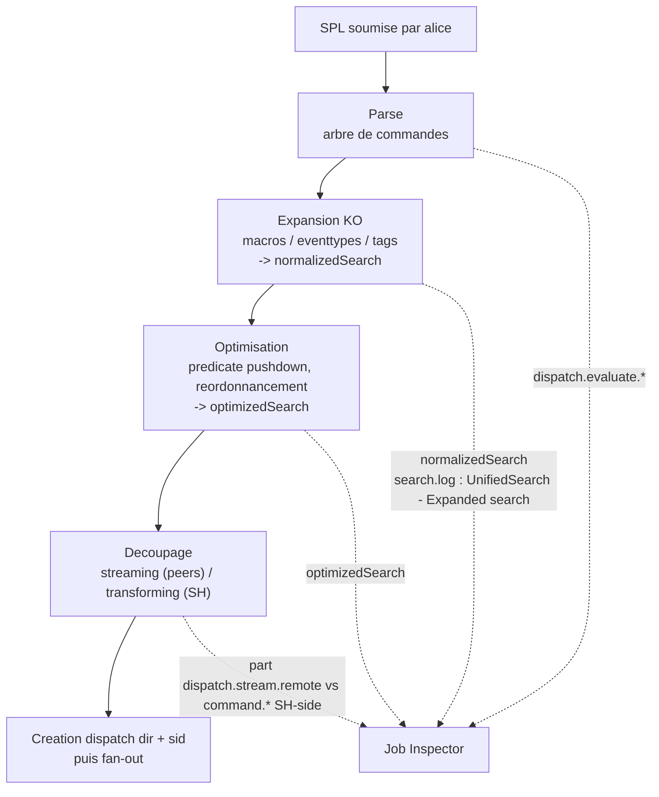

# Chapitre 01 — Soumission et parsing SPL (temps SH-side avant dispatch)

> **Enjeu temporel** — Avant même qu'un seul peer ne lise un bucket, le search
> head (`sh01`) a déjà consommé du temps : il parse la SPL, expanse les macros,
> tags et eventtypes, résout les knowledge objects, optimise la chaîne et découpe
> le pipeline en portion distribuable et portion centralisée. Cette phase reste
> souvent modeste, mais elle explose quand un `tag=` ou un `eventtype=` couvre des
> dizaines de sourcetypes : la chaîne expansée gonfle et `dispatch.evaluate.*`
> devient le poste dominant alors que `dispatch.stream.remote` reste faible. Le
> symptôme se lit d'un coup d'œil : un `optimizedSearch`/`normalizedSearch`
> démesuré. Après ce chapitre, vous saurez lire `optimizedSearch`, y repérer une
> expansion coûteuse ou un prédicat resté en aval, distinguer ce coût SH-side d'un
> coût de map, et corriger seul ce qui relève de la SPL.

## Rappel mécanique

Cette phase tourne **sur le search head**, avant tout fan-out. Elle enchaîne
quatre gestes. (1) **Parse** : la chaîne SPL est validée et transformée en arbre
de commandes. (2) **Expansion** des knowledge objects : une macro se substitue à
sa définition ; un `eventtype=` et un `tag=` se réécrivent en clauses booléennes
— un tag couvrant N sourcetypes produit un `OR` de N clauses, ce qui gonfle
mécaniquement la base search. Le résultat est la chaîne `normalizedSearch`. (3)
**Optimisation** par l'optimiseur intégré (voir
[Built-in optimization](https://docs.splunk.com/Documentation/Splunk/9.4/Search/Builtinoptimization))
: predicate pushdown (remontée des filtres vers les peers), réordonnancement,
élimination de travail redondant ; le résultat est `optimizedSearch`. On inspecte
son effet en désactivant l'optimiseur avec `| noop search_optimization=false`
(voir [noop](https://docs.splunk.com/Documentation/Splunk/9.4/SearchReference/Noop)).
(4) **Découpage** streaming / transforming : la portion streaming (distribuable)
est poussée aux peers, la portion transforming (`stats`, `sort`, `dedup`…) reste
centralisée sur le SH (voir
[Types of commands](https://docs.splunk.com/Documentation/Splunk/9.4/SearchReference/Typesofcommands)).
Le SH crée alors le dispatch dir (`$SPLUNK_HOME/var/run/splunk/dispatch/<sid>/`)
et attribue le `sid`.

Les `.conf` en jeu sont surtout celles qui **définissent les knowledge objects**
expansés à chaque recherche : `macros.conf`, `eventtypes.conf`, `tags.conf`,
`props.conf` (`LOOKUP-*`, `EVAL-*`, field aliases). Le log de référence est
`search.log` dans le dispatch dir, dont la ligne `UnifiedSearch - Expanded search`
donne la chaîne après expansion. Le vocabulaire de marqueurs est posé au
[chapitre 00](00-modele-temporel-et-mesure.md) et réutilisé tel quel ici.

## Décomposition du temps de cette phase

Le temps SH-side avant dispatch se répartit sur les quatre gestes ci-dessus.
Chacun a son marqueur : l'ensemble parse + optimisation se lit dans
`dispatch.evaluate.*` (Job Inspector) ; l'expansion se lit dans la taille de
`normalizedSearch`/`optimizedSearch` (*Search job properties*) et dans la ligne
`UnifiedSearch - Expanded search` de `search.log` ; le coût de résolution des KO
automatiques apparaîtra en aval, sur les peers, dans `command.search.tags`,
`command.search.lookups`, `command.search.calcfields` et
`command.search.fieldalias`.



La lecture clé de cette phase est **`optimizedSearch`** : la chaîne y montre
quels prédicats ont été remontés en tête de la base search (bon signe) et quelle
taille l'expansion a produite. Un `optimizedSearch` court et bien scopé annonce
peu de volume distribué ; un `optimizedSearch` gigantesque, issu d'un tag ou d'un
eventtype large, annonce une base search coûteuse à distribuer.

## Leviers d'action

- **Levier — pousser les prédicats dans la base search.** Placer `index`,
  `sourcetype`, `host`, `source` et tout champ indexé en tête, avant le premier
  `eval`/`rex`/`where`.
  - **Effet temporel attendu** — en 9.x, l'optimiseur intégré remonte les filtres
    éligibles vers les peers (predicate pushdown), ce qui réduit le volume
    matérialisé et distribué en aval (voir
    [Built-in optimization](https://docs.splunk.com/Documentation/Splunk/9.4/Search/Builtinoptimization)).
    Un prédicat laissé après une commande non-streaming n'est pas remonté : le
    scan large est déjà payé.
  - **Comment le mesurer** — lire `optimizedSearch` : les prédicats figurent-ils
    bien dans la base search ? Comparer `scanCount` et `eventCount` — un
    `scanCount` >> `eventCount` trahit un filtrage tardif.
  - **Frontière** — *autoportant* ; la discipline d'ordre des commandes est
    enseignée en [`../splunk-user-handbook/01-spl-search-anatomy.md`](../splunk-user-handbook/01-spl-search-anatomy.md).

- **Levier — maîtriser l'expansion des tags et eventtypes.** Ajouter un ciblage
  `index`/`sourcetype` en plus du `tag=`/`eventtype=`, plutôt que de s'en remettre
  au seul tag.
  - **Effet temporel attendu** — un `tag=` ou un `eventtype=` qui matche des
    dizaines de sourcetypes se réécrit en un `OR` géant ; la chaîne
    `normalizedSearch` gonfle, `dispatch.evaluate.*` monte et la base search
    devient coûteuse à distribuer (voir
    [About event types](https://docs.splunk.com/Documentation/Splunk/9.4/Knowledge/Abouteventtypes)
    et [About tags and aliases](https://docs.splunk.com/Documentation/Splunk/9.4/Knowledge/Abouttagsandaliases)).
  - **Comment le mesurer** — taille de `normalizedSearch`/`optimizedSearch`,
    `command.search.tags` dans les *Execution costs*, ligne
    `UnifiedSearch - Expanded search` de `search.log`.
  - **Frontière** — *autoportant*.

- **Levier — ne pas casser la streaming-ness prématurément.** Placer la première
  commande transforming (`stats`, `dedup`, `sort`) le plus tard possible dans le
  pipeline.
  - **Effet temporel attendu** — tant que la chaîne reste streaming, elle est
    poussée aux peers et exécutée en parallèle ; dès la première transforming,
    tout ce qui suit est centralisé sur le SH. Repousser la coupure maximise le
    travail distribué (voir
    [Types of commands](https://docs.splunk.com/Documentation/Splunk/9.4/SearchReference/Typesofcommands)).
  - **Comment le mesurer** — proportion de `dispatch.stream.remote` face aux
    postes SH-side (`command.stats`, `command.sort`) dans les *Execution costs*.
  - **Frontière** — *autoportant* ; l'équilibrage prestats/reduce est développé au
    [chapitre 05](05-reduce-et-restitution.md).

- **Levier — basculer vers `tstats` quand seuls des champs indexés sont requis.**
  La décision se prend au parse : si la requête ne porte que sur des champs
  indexés (default fields, indexed fields, champs d'un data model accéléré),
  réécrire en `| tstats`.
  - **Effet temporel attendu** — `tstats` lit les tsidx sans matérialiser la
    rawdata ; le poste `command.search.rawdata` tombe quasiment à zéro (voir
    [tstats](https://docs.splunk.com/Documentation/Splunk/9.4/SearchReference/Tstats)).
  - **Comment le mesurer** — *Execution costs* d'une variante `tstats` vs `stats` :
    disparition de `command.search.rawdata`.
  - **Frontière** — *renvoi D3* : la mécanique complète (`tstats`, indexed fields,
    accélération) est traitée au [chapitre 06](06-acceleration-comme-levier.md) ;
    le levier retenu ici est la **décision au parse** de ne pas toucher la rawdata.

- **Levier — réduire le coût de résolution des knowledge objects automatiques.**
  Auditer les `LOOKUP-*` (lookups automatiques), `EVAL-*` (calculated fields) et
  field aliases attachés au sourcetype interrogé, et retirer ceux qui ne servent
  pas la recherche.
  - **Effet temporel attendu** — ces KO s'exécutent **à chaque recherche** sur le
    sourcetype ; sur un sourcetype chaud, ils alourdissent `command.search.lookups`,
    `command.search.calcfields` et `command.search.fieldalias` (voir
    [About calculated fields](https://docs.splunk.com/Documentation/Splunk/9.4/Knowledge/Aboutcalculatedfields)).
    Un champ dont on n'a pas besoin, mais calculé automatiquement, est un coût pur.
  - **Comment le mesurer** — `command.search.lookups`, `command.search.calcfields`,
    `command.search.fieldalias` dans les *Execution costs*.
  - **Frontière** — *admin-only* : ces KO vivent dans `props.conf`/`transforms.conf`
    d'une app, souvent sur une couche que le power-user ne maîtrise pas. Quoi
    demander : « auditer les `LOOKUP-*`/`EVAL-*` automatiques sur le sourcetype
    `<X>` et désactiver ceux non requis par les recherches courantes ».

- **Levier — choisir le mode `fast`.** Lorsque les champs auto-extraits et
  l'eventtyping ne sont pas nécessaires, sélectionner le mode `fast` plutôt que
  `smart` ou `verbose`.
  - **Effet temporel attendu** — en 9.x, `verbose` force le calcul de tous les
    champs, le tagging et l'eventtyping ; `fast` les évite, épargnant
    `command.search.typer`, `command.search.kv` et `command.search.tags`.
  - **Comment le mesurer** — *Execution costs* comparés `fast` vs `verbose` :
    `command.search.typer` et `command.search.kv` chutent en `fast`.
  - **Frontière** — *autoportant* ; le comportement des trois modes est rappelé au
    [chapitre 00](00-modele-temporel-et-mesure.md).

## Anti-patterns coûteux

- **`index=*` ou terme libre en tête de recherche.** Aucune sélectivité : la base
  search ne scope ni index ni sourcetype, tous les buckets deviennent éligibles.
  Marqueur : `optimizedSearch` sans prédicat d'index, `scanCount` très supérieur à
  `eventCount`. Correction : scoper `index`/`sourcetype` explicitement.
- **Filtrer par `| where`/`| search` après une transforming command.** Le scan
  non filtré a déjà été payé sur les peers ; le filtre tardif n'élimine plus rien
  en amont. Marqueur : le prédicat n'apparaît pas dans la base search de
  `optimizedSearch`. Correction : remonter le filtre avant la première transforming.
- **`tag=`/`eventtype=` seul sur un tag couvrant de nombreux sourcetypes.**
  L'expansion produit un `OR` massif, coûteux à parser et à distribuer. Marqueur :
  `normalizedSearch`/`optimizedSearch` gigantesques, `command.search.tags` élevé.
  Correction : ajouter un ciblage `index`/`sourcetype`.
- **`rex` dans la base search au lieu d'un prédicat indexé.** Une extraction
  regex ne bénéficie pas des tsidx : elle force la matérialisation avant de
  filtrer. Marqueur : filtrage porté par `command.search.kv`/`filter` plutôt que
  par `command.search.index`. Correction : filtrer d'abord sur un champ indexé,
  n'appliquer `rex` que sur le résidu.
- **Macro récursive ou coûteuse expansée à chaque exécution.** Une macro qui
  déploie une longue sous-recherche ou un `OR` volumineux paie son expansion à
  chaque appel. Marqueur : `dispatch.evaluate.*` élevé, `normalizedSearch` gonflé
  par la substitution. Correction : simplifier la macro ou substituer un prédicat
  direct.
- **Lookups automatiques non maîtrisés sur un sourcetype chaud.** Chaque
  recherche paie la résolution, même quand le champ n'est pas utilisé. Marqueur :
  `command.search.lookups` significatif. Correction : audit admin des `LOOKUP-*`.

## Exemples travaillés

### Un tag qui gonfle la chaîne expansée

Une recherche démarre par un `tag=` couvrant de nombreux sourcetypes, sans autre
scope.

```spl
tag=authentication earliest=-24h@h latest=now
| stats count by user
```

Ce qu'on lit au Job Inspector : `normalizedSearch` et `optimizedSearch` sont
démesurés (le tag s'est réécrit en un `OR` de dizaines de clauses),
`dispatch.evaluate.*` est élevé alors que `dispatch.stream.remote` reste modeste,
et `command.search.tags` pèse dans les *Execution costs*. La correction ajoute un
ciblage d'index/sourcetype pour réduire l'expansion :

```spl
index=security sourcetype=linux_secure tag=authentication earliest=-24h@h latest=now
| stats count by user
```

Après réécriture, `optimizedSearch` est plus court, `dispatch.evaluate.*` baisse
et la base search distribuée est plus étroite.

### Un prédicat resté en aval de la transforming

```spl
index=main sourcetype=access_combined earliest=-24h@h latest=now
| stats count by status, host
| search host=web01
```

Ce qu'on lit au Job Inspector : `scanCount` est très supérieur à `eventCount`, et
`optimizedSearch` montre que `host=web01` n'a **pas** été remonté dans la base
search — il s'applique après le `stats`, une fois tout le scan payé. En remontant
le filtre avant la transforming :

```spl
index=main sourcetype=access_combined host=web01 earliest=-24h@h latest=now
| stats count by status
```

`optimizedSearch` porte désormais `host=web01` dans la base search (predicate
pushdown), `scanCount` se rapproche d'`eventCount`, et le volume distribué chute.

### Une projection possible en `tstats`

Une recherche qui n'agrège que sur des champs indexés paie la rawdata pour rien.

```spl
index=network sourcetype=cisco:asa earliest=-24h@h latest=now
| stats count by sourcetype
```

Ce qu'on lit au Job Inspector : `command.search.rawdata` domine alors que seule
une agrégation sur un champ indexé est demandée. La variante `tstats` évite la
matérialisation :

```spl
| tstats count where index=network sourcetype=cisco:asa earliest=-24h@h latest=now by sourcetype
```

Dans les *Execution costs* de la variante, `command.search.rawdata` disparaît
quasiment. La mécanique et les limites de `tstats` sont traitées au chapitre 06.

## Renvois conditionnels (D3)

- **Anatomie d'une bonne recherche (scoping → filtering → transforming →
  presenting)** — [`../splunk-user-handbook/01-spl-search-anatomy.md`](../splunk-user-handbook/01-spl-search-anatomy.md).
  La discipline d'ordre des commandes y est enseignée pour l'usage courant ; le
  levier retenu ici est : **tout prédicat remonté dans la base search réduit le
  volume distribué, vérifiable dans `optimizedSearch`**.
- **`tstats`, indexed fields et accélération** —
  [`06-acceleration-comme-levier.md`](06-acceleration-comme-levier.md). La
  mécanique des trois stratégies d'accélération y est développée sous l'angle
  coût/bénéfice ; le levier retenu ici est : **décider au parse de basculer en
  `tstats` quand seuls des champs indexés sont requis évite la matérialisation
  rawdata (`command.search.rawdata` ~0)**.
- **Index-time vs search-time, `_time` vs `_indextime`** —
  [`../../concepts/splunk-cycle-de-vie-evenement.md`](../../concepts/splunk-cycle-de-vie-evenement.md).
  Le cycle de vie de l'event y est traité pleinement ; le fait retenu ici : **un
  champ matérialisé à l'index-time n'est pas recalculé à la recherche, alors qu'un
  champ search-time paie `command.search.kv`/`calcfields` à chaque exécution** —
  ce qui oriente l'audit des KO automatiques.

## Sources

- [Splunk Search Manual 9.4 — Built-in optimization](https://docs.splunk.com/Documentation/Splunk/9.4/Search/Builtinoptimization)
- [Splunk Search Manual 9.4 — How to optimize searches](https://docs.splunk.com/Documentation/Splunk/9.4/Search/Optimizesearches)
- [Splunk Search Manual 9.4 — Quick tips for optimization](https://docs.splunk.com/Documentation/Splunk/9.4/Search/Quicktipsforoptimization)
- [Splunk Search Reference 9.4 — Types of commands](https://docs.splunk.com/Documentation/Splunk/9.4/SearchReference/Typesofcommands)
- [Splunk Search Reference 9.4 — noop](https://docs.splunk.com/Documentation/Splunk/9.4/SearchReference/Noop)
- [Splunk Search Reference 9.4 — tstats](https://docs.splunk.com/Documentation/Splunk/9.4/SearchReference/Tstats)
- [Splunk Search Reference 9.4 — search](https://docs.splunk.com/Documentation/Splunk/9.4/SearchReference/Search)
- [Splunk Search Reference 9.4 — where](https://docs.splunk.com/Documentation/Splunk/9.4/SearchReference/Where)
- [Splunk Knowledge Manager Manual 9.4 — About event types](https://docs.splunk.com/Documentation/Splunk/9.4/Knowledge/Abouteventtypes)
- [Splunk Knowledge Manager Manual 9.4 — About tags and aliases](https://docs.splunk.com/Documentation/Splunk/9.4/Knowledge/Abouttagsandaliases)
- [Splunk Knowledge Manager Manual 9.4 — About calculated fields](https://docs.splunk.com/Documentation/Splunk/9.4/Knowledge/Aboutcalculatedfields)
- [Splunk Knowledge Manager Manual 9.4 — Define search macros](https://docs.splunk.com/Documentation/Splunk/9.4/Knowledge/Definesearchmacros)
