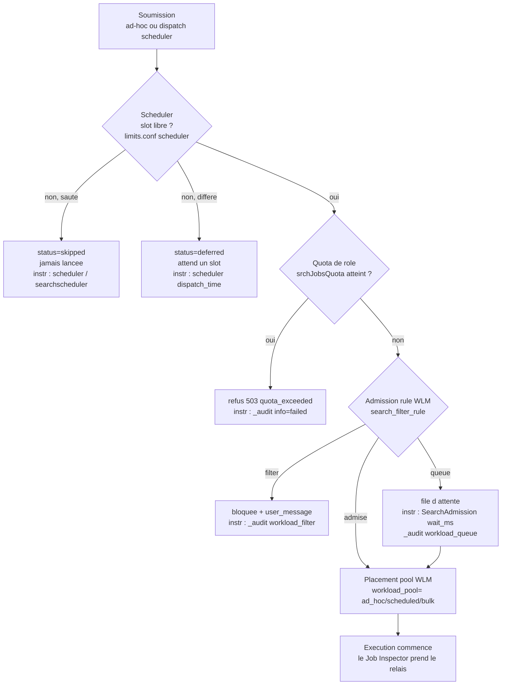

# Chapitre 02 — Admission et ordonnancement (temps d'attente avant exécution)

> **Enjeu temporel** — Entre le moment où une recherche est soumise et
> celui où elle commence *réellement* à s'exécuter, du temps peut s'écouler
> sans qu'aucune ligne de `journal.gz` ne soit lue : le scheduler diffère ou
> saute une saved search faute de slot, une admission rule Workload Management
> (WLM) la met en file, un quota de rôle la refuse net. Ce temps-là ne se lit
> **pas** dans le Job Inspector — il est invisible pour une recherche *skipped*,
> qui n'a pas de job. Il vit dans le `scheduler`, `metrics.log
> group=searchscheduler`, le composant `SearchAdmission` et `_audit`. Après ce
> chapitre, vous savez trancher une saved search *skipped* d'une saved search
> *lente*, et quel réglage — étalement des crons, concurrence, pool WLM, quota —
> attaquer, en distinguant ce que vous faites seul de ce qui est admin-only.

## Rappel mécanique

L'admission tourne sur le **search head** (`sh01`), en amont de tout fan-out.
Deux régulateurs se succèdent, gouvernés par des `.conf` distinctes.

Le **search scheduler** décide *quand* une saved search s'exécute. Il dispose
d'un nombre borné de slots de recherches concurrentes (`limits.conf
[scheduler]` : `max_searches_perc`, `base_max_searches`, `max_hist_searches`).
Quand la demande dépasse les slots, il *diffère* (`deferred`), *saute*
(`skipped`) ou laisse *continuer* (`continued`) une occurrence — un skip
signifie que la recherche **n'a jamais tourné**, pas qu'elle a été lente.

Le **Workload Management** décide *si* et *avec quelle part* une recherche
admise s'exécute : les **admission rules** (`search_filter_rule` : `filter`
bloque, `queue` met en file) s'évaluent avant le démarrage, puis une
**workload rule** place la recherche dans un pool (`ad_hoc`, `scheduled`,
`bulk`, `accel`, `admin`). En amont encore, le RBAC applique les **quotas de
rôle** (`srchJobsQuota`, `srchDiskQuota`) : un dépassement est un **refus 503
`quota_exceeded`**, pas un temps d'attente. La conception des pools et des
règles WLM est pleinement traitée dans le handbook de gouvernance (voir
*Renvois conditionnels*) ; ici on ne retient que leur **effet temporel** sur
une recherche donnée.

## Décomposition du temps de cette phase

Le temps « avant exécution » se répartit sur une chaîne où chaque maillon a son
instrument, et où deux issues ne sont pas des temps mais des refus.



Le point d'attention cardinal : **le Job Inspector ne mesure pas le temps en
file.** `elapsedTime` d'un job commence quand l'exécution démarre, après
l'admission ; une recherche *skipped* n'a même pas de job à inspecter. Les
instruments de cette phase sont donc ailleurs.

- **`index=_internal sourcetype=scheduler`** : une ligne par occurrence de saved
  search, avec `status` (`success` / `skipped` / `deferred` / `continued`),
  `scheduled_time` (heure cron prévue), `dispatch_time` (heure de lancement
  réel), `run_time`, `window_time`. L'écart `dispatch_time − scheduled_time`
  **est** le temps d'attente d'ordonnancement.
- **`metrics.log group=searchscheduler`** : agrégats par cycle — nombre de
  recherches `dispatched`, `skipped`, `deferred`, et la saturation des slots
  (voir [About metrics.log](https://docs.splunk.com/Documentation/Splunk/9.4/Troubleshooting/Aboutmetricslog)).
- **Composant `SearchAdmission`** (`index=_internal sourcetype=splunkd
  component=SearchAdmission`) : `wait_ms`, la latence d'admission WLM (p50/p99).
  *Marqueur observé dans `_internal` en 9.x, sans page de documentation Splunk
  dédiée : confirmez sa présence sur votre instance avant d'en faire une
  référence normative (posture de citation du handbook).*
- **`_audit action=search`** : `workload_pool` (pool effectif), et les actions
  `workload_queue` / `workload_filter` ; un `quota_exceeded` y apparaît comme un
  échec, jamais comme une durée.

## Leviers d'action

- **Levier — étaler les crons des scheduled searches.** Décoller les
  planifications de l'alignement réflexe (`*/5 * * * *`) et laisser le scheduler
  respirer via `schedule_window` (fenêtre de tolérance) et `allow_skew` dans
  `savedsearches.conf` (couche `etc/shcluster/apps/<app>/local/` poussée par le
  deployer, ou `etc/apps/<app>/local/`).
  ```ini
  [rpt_failed_logins]
  cron_schedule = 7,17,27,37,47,57 * * * *
  schedule_window = 5
  allow_skew = 10m
  ```
  - **Effet temporel attendu** — les occurrences se répartissent au lieu de se
    percuter à la même minute ; la file du scheduler se vide, les `skipped` et
    `deferred` refluent. En 9.x, `schedule_window` autorise le scheduler à
    retarder une recherche non urgente pour lisser la concurrence (voir
    [Configure the priority of scheduled reports](https://docs.splunk.com/Documentation/Splunk/9.4/Report/Configurethepriorityofscheduledreports)).
  - **Comment le mesurer** — `index=_internal sourcetype=scheduler
    status=skipped OR status=deferred` avant/après ; l'écart `dispatch_time −
    scheduled_time` par saved search ; `metrics.log group=searchscheduler`.
  - **Frontière** — *autoportant* pour vos propres saved searches.

- **Levier — régler la concurrence de recherche.** Augmenter le nombre de slots
  de recherches concurrentes via `limits.conf [scheduler]` :
  `max_searches_perc` (part des slots totaux réservée au scheduler),
  `base_max_searches`, et `auto_summary_perc` (part dédiée aux accélérations).
  Couche `system/local/` ou app SHC — hors de votre portée d'utilisateur.
  ```ini
  [scheduler]
  max_searches_perc = 50
  base_max_searches = 6
  ```
  - **Effet temporel attendu** — plus de slots simultanés → moins de recherches
    différées, temps d'attente d'ordonnancement plus court. Contrepartie : au-delà
    de la capacité CPU réelle, on ne réduit pas l'attente, on crée du thrash qui
    rallonge *toutes* les recherches (voir [limits.conf](https://docs.splunk.com/Documentation/Splunk/9.4/Admin/Limitsconf)).
  - **Comment le mesurer** — ratio `skipped/total` dans `metrics.log
    group=searchscheduler` ; `metrics.log group=search_concurrency` (slots
    occupés vs plafond).
  - **Frontière** — *admin-only* (couche `system/local` ou app SHC). Demander :
    « relever `max_searches_perc`/`base_max_searches` sur le SHC, justification :
    N `skipped`/jour ».

- **Levier — placer la recherche dans le bon pool WLM.** Router une recherche
  interactive vers `ad_hoc`, une planifiée vers `scheduled`, une longue vers
  `bulk`, pour qu'elle reçoive une part CPU garantie et ne subisse pas la
  pression des autres familles à l'admission.
  - **Effet temporel attendu** — une recherche légitime sous pression est admise
    et servie plus vite quand son pool lui garantit une part, au lieu de partager
    un unique pool saturé. C'est la latence d'*admission* qui baisse, pas la durée
    d'exécution.
  - **Comment le mesurer** — `SearchAdmission wait_ms` (p50/p99) par pool ;
    `_audit action=search workload_pool=*` pour vérifier le placement effectif.
  - **Frontière** — *renvoi D3* : la conception des pools est traitée dans
    [`../gouvernance-utilisateurs-splunk/06-guide-wlm-sh.md`](../gouvernance-utilisateurs-splunk/06-guide-wlm-sh.md).
    Levier retenu ici : router la recherche vers le pool qui garantit sa part CPU
    réduit sa latence d'admission, visible dans `SearchAdmission wait_ms`.

- **Levier — préfiltrer par admission rule.** Poser une `search_filter_rule
  action=queue` qui met en file (au lieu de refuser) les recherches ad-hoc quand
  la plateforme sature, pour **borner le wait des recherches admises** en
  repoussant les abusives.
  ```ini
  [search_filter_rule:queue_on_adhoc_saturation]
  predicate = adhoc_search_percentage>85 AND NOT role=admin_*
  action = queue
  ```
  - **Effet temporel attendu** — sous saturation, les recherches prioritaires
    conservent une latence d'admission bornée ; les recherches en excès attendent
    dans la file plutôt que de disputer les ressources et d'allonger tout le monde.
  - **Comment le mesurer** — `_audit action=workload_queue` (volume et plages
    horaires de mise en file) ; `SearchAdmission wait_ms` sur les recherches
    admises pendant les pics.
  - **Frontière** — *renvoi D3* : les admission rules sont conçues dans
    [`../gouvernance-utilisateurs-splunk/06-guide-wlm-sh.md`](../gouvernance-utilisateurs-splunk/06-guide-wlm-sh.md).
    Levier retenu ici : une règle `queue` sur saturation ad-hoc borne le wait des
    recherches légitimes, mesurable dans `_audit action=workload_queue`.

- **Levier — prioriser les saved searches critiques.** Relever la priorité
  d'ordonnancement d'un rapport critique via `schedule_priority` dans
  `savedsearches.conf`, pour qu'il passe devant dans la file du scheduler quand
  les slots manquent.
  ```ini
  [acc_daily_summary]
  schedule_priority = higher
  ```
  - **Effet temporel attendu** — à contention égale, l'occurrence prioritaire est
    dispatchée avant les autres et se fait moins souvent `deferred`/`skipped` ;
    l'écart `dispatch_time − scheduled_time` se resserre pour elle, au prix des
    recherches de priorité normale (voir [Configure the priority of scheduled reports](https://docs.splunk.com/Documentation/Splunk/9.4/Report/Configurethepriorityofscheduledreports)).
  - **Comment le mesurer** — `index=_internal sourcetype=scheduler` :
    `dispatch_time` vs `scheduled_time` et taux de `skipped` pour la saved search
    ciblée, avant/après.
  - **Frontière** — *autoportant* pour `higher` sur vos propres saved searches ;
    la priorité `highest` requiert une capability dédiée → *admin-only* pour ce
    palier.

- **Levier — ajuster les quotas de rôle.** Relever `srchJobsQuota` (nombre de
  jobs concurrents par rôle) dans la configuration des rôles quand des recherches
  légitimes sont **refusées** en 503 sous charge, plutôt qu'exécutées.
  - **Effet temporel attendu** — supprime les refus 503 `quota_exceeded` qui
    forcent l'utilisateur à relancer : la recherche s'exécute au lieu d'être
    rejetée. Ce n'est pas une réduction de latence mais la suppression d'un échec
    (voir [About users and roles](https://docs.splunk.com/Documentation/Splunk/9.4/Admin/Aboutusersandroles)).
  - **Comment le mesurer** — occurrences `quota_exceeded` dans `_audit
    action=search` (par `user`/`role`), avant/après.
  - **Frontière** — *admin-only* (config des rôles, capabilities). Demander :
    « relever `srchJobsQuota` pour le rôle `analyst`, justification : N refus 503/jour ».

## Anti-patterns coûteux

- **Aligner tous les scheduled sur la même minute** (`*/5`, `0 * * * *`). Le
  scheduler reçoit un pic d'occurrences simultanées, sature ses slots et saute
  les surnuméraires. Marqueur : pics de `status=skipped` synchrones dans
  `sourcetype=scheduler`, saturation dans `metrics.log group=searchscheduler`.
  Correction : étaler les crons + `schedule_window`.
- **Laisser proliférer des recherches real-time non maîtrisées.** Les recherches
  real-time contournent une partie des limites du scheduler et occupent des slots
  en continu, affamant les recherches historiques. Marqueur : `search_mode=realtime`
  fréquent dans `_audit`, slots `search_concurrency` durablement pleins.
  Correction : encadrer le real-time (capability, admission rule WLM).
- **Régler un quota de rôle trop bas.** Sous charge, les recherches légitimes du
  rôle sont refusées en 503 au lieu de tourner. Marqueur : `quota_exceeded` dans
  `_audit`. Correction : relever `srchJobsQuota` (admin) ou répartir la charge.
- **Pousser la concurrence trop haut « pour aller plus vite ».** Au-delà de la
  capacité CPU du SH, ajouter des slots ne réduit pas l'attente — le thrash CPU
  rallonge *chaque* recherche. Marqueur : `search_concurrency` élevé *et* durées
  d'exécution qui montent globalement. Correction : caler les slots sur la
  baseline de capacité, pas au-dessus.
- **Confondre une recherche *skipped* et une recherche *lente*.** Chercher un
  temps d'exécution long au Job Inspector pour une saved search qui n'a en fait
  jamais tourné mène à optimiser la mauvaise chose. Marqueur : `status=skipped`
  dans `sourcetype=scheduler` alors qu'aucun job n'existe. Correction : lire
  d'abord le `scheduler`, pas le Job Inspector.

## Exemples travaillés

### Une saved search « qui n'a pas produit »

Le rapport `rpt_failed_logins` planifié toutes les cinq minutes ne remplit plus
son dashboard. Réflexe fréquent : ouvrir le Job Inspector — mais il n'y a pas de
job à inspecter.

```spl
index=_internal sourcetype=scheduler savedsearch_name="rpt_failed_logins"
    earliest=-24h
| stats count by status
```

Ce qu'on lit dans le `scheduler` : une majorité de `status=skipped` et
`status=deferred`, et pour les occurrences `success` un `dispatch_time` très
postérieur au `scheduled_time`. La recherche n'est pas *lente*, elle est
*sautée* : le scheduler manque de slots à `*/5`. Correction autoportante :
étaler le cron et poser `schedule_window` ; si les `skipped` persistent, demander
un relèvement de `max_searches_perc` (admin-only).

### Un temps d'attente d'admission sous saturation

Aux heures de pointe, des recherches ad-hoc du rôle `analyst` « traînent » avant
de démarrer.

```spl
index=_internal sourcetype=splunkd component=SearchAdmission earliest=-4h
| stats p50(wait_ms) as p50 p99(wait_ms) as p99 by host
```

Ce qu'on lit dans `SearchAdmission` / `_audit` : un `p99(wait_ms)` de plusieurs
secondes pendant les pics, corrélé à des événements `action=workload_queue` dans
`_audit`. Le temps n'est pas dans l'exécution (Job Inspector plat) mais dans la
**file d'admission**. Levier : router ces recherches vers un pool `ad_hoc`
correctement dimensionné et poser une admission rule `queue` sur saturation —
conception traitée côté gouvernance.

### Un refus de quota pris pour une lenteur

Un utilisateur du rôle `analyst` signale une recherche qui « ne répond pas ».

```spl
index=_audit action=search user=alice earliest=-2h
| search info=failed OR reason="*quota*"
| table _time user info reason
```

Ce qu'on lit dans `_audit` : des lignes `quota_exceeded` — la recherche a été
**refusée** (503), pas exécutée lentement. `srchJobsQuota` du rôle est atteint
sous charge. Il n'y a aucun `elapsedTime` à optimiser : la correction est de
relever le quota du rôle (admin-only) ou de réduire le nombre de jobs concurrents
lancés par l'utilisateur.

## Renvois conditionnels (D3)

- **Conception des pools et des règles WLM (search head)** —
  [`../gouvernance-utilisateurs-splunk/06-guide-wlm-sh.md`](../gouvernance-utilisateurs-splunk/06-guide-wlm-sh.md).
  La conception des pools, des catégories, des admission rules et des workload
  rules (placement, `queue`, `filter`), avec ses phases d'implémentation et ses
  pièges 9.4, y est pleinement traitée. Levier retenu ici : router une recherche
  vers le pool qui garantit sa part CPU, et poser une admission rule `queue` sur
  saturation, réduit sa latence d'admission — visible dans `SearchAdmission
  wait_ms` et `_audit action=workload_queue`.
- **WLM côté indexers et mode distribué** —
  [`../gouvernance-utilisateurs-splunk/07-guide-wlm-indexers.md`](../gouvernance-utilisateurs-splunk/07-guide-wlm-indexers.md).
  Le search peer process consomme des ressources indexer non bornées par le pool
  SH ; la régulation côté peers y est conçue en propre. Fait retenu ici : borner
  l'admission côté SH ne borne pas la consommation côté indexer d'une même
  recherche.

## Sources

- [Splunk Reporting Manual 9.4 — Configure the priority of scheduled reports](https://docs.splunk.com/Documentation/Splunk/9.4/Report/Configurethepriorityofscheduledreports)
- [Splunk Reporting Manual 9.4 — Schedule reports](https://docs.splunk.com/Documentation/Splunk/9.4/Report/Schedulereports)
- [Splunk Admin Manual 9.4 — limits.conf](https://docs.splunk.com/Documentation/Splunk/9.4/Admin/Limitsconf)
- [Splunk Admin Manual 9.4 — savedsearches.conf](https://docs.splunk.com/Documentation/Splunk/9.4/Admin/Savedsearchesconf)
- [Splunk Admin Manual 9.4 — About users and roles](https://docs.splunk.com/Documentation/Splunk/9.4/Admin/Aboutusersandroles)
- [Splunk Troubleshooting Manual 9.4 — About metrics.log](https://docs.splunk.com/Documentation/Splunk/9.4/Troubleshooting/Aboutmetricslog)
- [Splunk Workload Management 9.4 — Overview](https://help.splunk.com/en/splunk-enterprise/administer/manage-workloads/9.4/workload-management-overview)
- [Splunk Workload Management 9.4 — Configure admission rules to prefilter searches](https://help.splunk.com/en/splunk-enterprise/administer/manage-workloads/9.4/configure-workload-management/configure-admission-rules-to-prefilter-searches)
