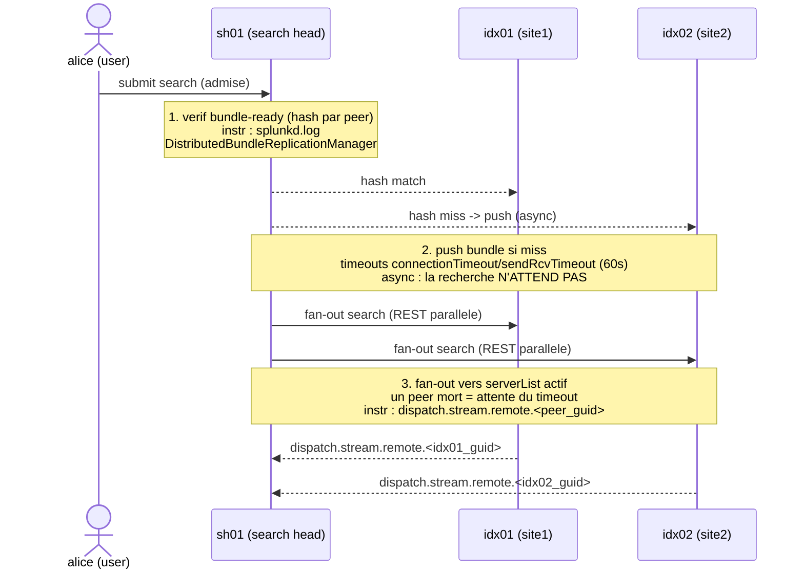

# Chapitre 03 — Distribution : bundle readiness, fan-out, contexte

> **Enjeu temporel** — Entre l'admission d'une recherche (chapitre 02) et le
> début du map sur les peers (chapitre 04) s'insère une phase courte mais
> traîtresse : le search head vérifie que chaque peer détient le bon knowledge
> bundle, puis pousse la recherche en parallèle vers tous les peers actifs. En
> LAN sain cette phase pèse quelques centaines de millisecondes ; elle explose
> quand un bundle est obèse, quand un timeout de réplication court sur un peer
> malade, ou quand un peer mort reste déclaré et fait attendre le timeout de
> fan-out à chaque recherche. Le symptôme se lit dans `splunkd.log`
> (`DistributedBundleReplicationManager`) et dans les `dispatch.stream.remote.<peer_guid>`
> absents ou à zéro du Job Inspector. Après ce chapitre, vous saurez distinguer un
> temps pré-map dû au bundle d'un temps dû au fan-out, et actionner le levier
> temporel qui convient — sans re-lire la mécanique de fond du bundle, traitée
> ailleurs.

## Rappel mécanique

À la soumission, le search head (`sh01`) ne pousse pas immédiatement la SPL aux
peers. Il compare d'abord, peer par peer, le hash du bundle courant côté SH à
celui détenu par le peer. Trois issues : **match** (le peer est prêt, on
continue) ; **miss avec push** (le SH propage le bundle — classic, cascading ou
stockage partagé mounted — dans la limite des timeouts `connectionTimeout` /
`sendRcvTimeout`, défaut 60 s chacun) ; **miss/timeout** sans propagation
aboutie. Point capital pour le temps : en 9.x la réplication est **asynchrone**
— *« A search will not be prevented from running just because knowledge
replication has not finished »* (voir
[Classic knowledge bundle replication](https://docs.splunk.com/Documentation/Splunk/9.4/DistSearch/Classicknowledgebundlereplication)).
Une recherche n'attend donc pas la fin d'un push : le peer sert avec son
**bundle précédent**. Une fois la vérification faite pour tous les peers, le SH
émet un **fan-out** REST parallèle vers chaque peer actif du `serverList`
(résolu via le cluster manager `cm01` quand `[clustering]` est configuré).

La constitution du bundle (contenu, hash, décision full/delta) et les trois
modes de réplication sont **pleinement traités** dans le knowledge bundle
handbook (renvois en fin de chapitre) ; ce chapitre n'en retient que les
**leviers temporels**. La `.conf` gouvernante est `distsearch.conf`
(`[replicationSettings]`, `[replicationBlacklist]`, `[distributedSearch]`),
posée en couche `$SPLUNK_HOME/etc/system/local/` ou, en SHC, dans
`etc/shcluster/apps/<app>/local/` distribuée par le deployer `dep01`.

## Décomposition du temps de cette phase

Le temps de la phase distribution se répartit en trois sous-étapes, chacune
avec son instrument :



- **Vérification bundle-ready** — échange de métadonnées (le hash, pas le
  contenu) : rapide en LAN sain. Son coût monte quand un cycle de réplication
  est déclenché en amont et journalisé `WARN` dans `splunkd.log`, composant
  `DistributedBundleReplicationManager` (durée et échec du cycle).
- **Push du bundle** (si miss) — proportionnel à la **taille** du bundle et à la
  qualité du lien. Asynchrone : n'allonge pas directement `elapsedTime` de la
  recherche courante, mais un cycle qui traîne à chaque modification de KO
  sature le lien et rejaillit sur toutes les recherches. Taille visible dans
  `$SPLUNK_HOME/var/run/searchpeers/<sh_guid>-<epoch>-<hash>.bundle`.
- **Fan-out** — appel REST parallèle, petit par nature. Le piège temporel n'est
  pas sa taille mais l'**attente d'un peer injoignable** : un peer déclaré mais
  mort fait patienter le timeout à chaque recherche. Le Job Inspector le trahit
  par un `dispatch.stream.remote.<peer_guid>` **absent ou nul** pour ce peer,
  tandis que `| rest /services/search/distributed/peers` le montre en état
  dégradé.

La règle de lecture cardinale de cette phase : si le temps est **avant** le
premier `dispatch.stream.remote`, cherchez côté bundle/fan-out (`splunkd.log`,
état des peers) ; s'il est **dans** les `dispatch.stream.remote`, le temps est en
map — vous êtes au chapitre 04, pas ici.

## Leviers d'action

- **Levier — limiter la taille du knowledge bundle** (`distsearch.conf`,
  `[replicationSettings] maxBundleSize`, en MB, couche `etc/system/local/` ou app
  SHC).
  - **Effet temporel attendu** — en 9.x, un bundle plus petit se sérialise, se
    hash et se pousse plus vite ; le cycle de réplication raccourcit et le lien
    reste libre pour les autres cycles. Splunk recommande de **réduire** plutôt
    que de relever la limite (voir
    [Limit the knowledge bundle size](https://docs.splunk.com/Documentation/Splunk/9.4/DistSearch/Limittheknowledgebundlesize)).
  - **Comment le mesurer** — taille du fichier sous
    `var/run/searchpeers/` avant/après ; durée du cycle dans `splunkd.log`
    composant `DistributedBundleReplicationManager`.
  - **Frontière** — *autoportant* pour le réglage `maxBundleSize` ; *renvoi D3*
    pour la mécanique full/delta.

- **Levier — sortir les gros lookups du bundle** (`[replicationBlacklist]` dans
  `distsearch.conf` ; ou migration de la lookup vers KV Store / lookup locale sur
  les peers).
  - **Effet temporel attendu** — un lookup CSV volumineux embarqué est répliqué
    à chaque peer, à chaque cycle ; l'exclure attaque la cause la plus fréquente
    d'un bundle obèse et raccourcit d'autant la vérification pré-fan-out (voir
    [Limit the knowledge bundle size](https://docs.splunk.com/Documentation/Splunk/9.4/DistSearch/Limittheknowledgebundlesize)).
  - **Comment le mesurer** — inventaire des lookups répliqués vs taille du
    bundle ; durée de cycle dans `splunkd.log`.
  - **Frontière** — *admin-only* (packaging d'app, KV Store) → demander
    « externalisation du lookup `assets.csv` hors du knowledge bundle (blacklist
    ou KV Store) ».

- **Levier — choisir le mode de réplication adapté à la topologie** : `classic`
  par défaut ; `cascading` au-delà d'environ 15-20 peers (le SH ne pousse plus
  vers tous) ; `mounted` sur stockage partagé pour un parc plus large.
  - **Effet temporel attendu** — en 9.x, cascading fait passer le coût de push de
    O(SH × peers) à O(SH + peers), soulageant le lien à l'échelle ; mounted
    supprime le push réseau au prix d'une dépendance NFS (voir
    [Cascading knowledge bundle replication](https://docs.splunk.com/Documentation/Splunk/9.4/DistSearch/Cascadingknowledgebundlereplication)).
  - **Comment le mesurer** — durée de propagation par cycle dans `splunkd.log`
    (`DistributedBundleReplicationManager`) avant/après bascule.
  - **Frontière** — *renvoi D3* : le choix et le paramétrage des trois modes sont
    pleinement traités dans le knowledge bundle handbook ; le levier retenu ici
    est *choisir le mode pour le temps de propagation*, pas concevoir la
    topologie.

- **Levier — régler sciemment les timeouts** (`connectionTimeout`,
  `sendRcvTimeout` dans `[replicationSettings]`, défaut 60 s).
  - **Effet temporel attendu** — arbitrage temps vs cohérence : un timeout trop
    long fait attendre le cycle sur un peer malade ; trop court fait servir plus
    souvent un bundle périmé (résultats silencieusement incohérents). La
    réplication restant asynchrone, ces timeouts bornent le **cycle**, pas la
    recherche elle-même (voir
    [distsearch.conf](https://docs.splunk.com/Documentation/Splunk/9.4/Admin/Distsearchconf)).
  - **Comment le mesurer** — occurrences
    `WARN DistributedBundleReplicationManager … took too long` dans `splunkd.log`
    et le peer nommé.
  - **Frontière** — *autoportant* (réglage `.conf`) ; diagnostiquer la cause
    réseau/peer **avant** de masquer par un timeout plus long.

- **Levier — tenir le `serverList` / l'inventaire des peers propre** : retirer un
  peer hors-service de la liste (ou laisser le CM `cm01` la résoudre
  dynamiquement via `[clustering]` plutôt qu'un `servers=` en dur).
  - **Effet temporel attendu** — un peer mort laissé déclaré fait attendre le
    timeout de fan-out à **chaque** recherche : c'est un surcoût fixe, silencieux
    et récurrent, indépendant du volume de données (voir
    [Configure distributed search](https://docs.splunk.com/Documentation/Splunk/9.4/DistSearch/Configuredistributedsearch)).
  - **Comment le mesurer** — `| rest /services/search/distributed/peers` (statut
    `Up`/`Down`/`Quarantined`) ; `dispatch.stream.remote.<peer_guid>` absent ou
    nul pour le peer fautif dans le Job Inspector.
  - **Frontière** — *autoportant* pour la lecture de l'état et le nettoyage d'un
    `servers=` en dur ; *admin-only* si le peer doit être décommissionné côté
    cluster (CM).

## Anti-patterns coûteux

- **Embarquer un gros lookup CSV dans le bundle.** Il est répliqué vers chaque
  peer à chaque cycle, gonflant vérification et push. Marqueur : taille élevée
  sous `var/run/searchpeers/`, cycles longs dans `splunkd.log`. Correction :
  `[replicationBlacklist]` ou KV Store.
- **Laisser un peer hors-service dans le `serverList`.** Chaque fan-out attend son
  timeout. Marqueur : `dispatch.stream.remote.<peer_guid>` manquant/nul,
  `status=Down` dans `| rest /services/search/distributed/peers`. Correction :
  nettoyer la liste ou déléguer la résolution au CM.
- **Réémettre la recherche en boucle pendant un push en cours.** La réplication
  étant asynchrone, réémettre n'accélère rien et multiplie les cycles concurrents
  sur le lien. Marqueur : rafale de lignes `DistributedBundleReplicationManager`.
  Correction : laisser le cycle finir ; le peer sert déjà avec son bundle
  précédent.
- **Relever `maxBundleSize` au lieu de réduire le bundle.** Le bundle plus gros
  s'engorge sur le lien, la propagation s'allonge. Marqueur : cycle qui
  s'allonge après la montée. Correction : réduire d'abord (blacklist,
  externalisation) ; ne relever qu'en dernier recours, symétriquement côté peer.
- **Conclure « bundle » alors que le temps est en map.** Incriminer la
  distribution sans avoir regardé les `dispatch.stream.remote`. Marqueur :
  `splunkd.log` bundle propre mais `dispatch.stream.remote.<peer_guid>` élevés.
  Correction : mesurer la répartition vérification/fan-out **vs** map (distinction
  traitée pas à pas dans le knowledge bundle handbook).

## Exemples travaillés

### Un temps pré-map dû à un bundle obèse

Une plateforme voit toutes ses recherches distribuées démarrer avec un délai
avant le premier résultat. SPL de diagnostic du cycle de réplication :

```spl
index=_internal sourcetype=splunkd component=DistributedBundleReplicationManager
    earliest=-1h@m latest=now
| stats latest(_time) as last_seen count by host, log_level
| sort - last_seen
```

Ce qu'on lit au Job Inspector et dans les logs : `elapsedTime` inclut un délai
**avant** tout `dispatch.stream.remote` ; `splunkd.log` montre des cycles
`DistributedBundleReplicationManager` longs, et le fichier sous
`var/run/searchpeers/<sh_guid>-<epoch>-<hash>.bundle` est volumineux. Le temps est
**côté bundle**, pas map : appliquer le levier taille (blacklist du gros lookup,
ou `maxBundleSize` revu à la baisse après réduction).

### Un peer mort qui taxe chaque fan-out

Sur un multisite `site1`/`site2`, une recherche démarre systématiquement avec
une latence fixe indépendante du time range. On interroge l'état des peers :

```spl
| rest /services/search/distributed/peers
| table title, peerType, status, disabled
```

Ce qu'on lit : un peer (par ex. `idx03`) apparaît en `status=Down` ;
au Job Inspector, `dispatch.stream.remote.<idx03_guid>` est **absent** alors que
`dispatch.stream.remote.<idx01_guid>` et `<idx02_guid>` sont normaux. Le temps
n'est ni en bundle ni en map : c'est l'**attente du timeout de fan-out** vers un
peer mort. Levier : retirer `idx03` du `serverList` (ou laisser `cm01` résoudre
la liste), pas toucher aux timeouts de réplication qui ne sont pas en cause ici.

### Distinguer bundle et fan-out en une lecture

```text
2026-07-26 10:15:02.451 +0000 WARN  DistributedBundleReplicationManager - bundle replication to 1 peer(s) took too long
```

Ce qu'on lit : une ligne `WARN` avec un peer nommé désigne un **cycle de push
échoué** (levier taille/timeouts/mode) ; à l'inverse, un `splunkd.log` propre
mais un `dispatch.stream.remote.<peer_guid>` absent désigne un **peer injoignable
au fan-out** (levier hygiène du `serverList`). Deux instruments, deux leviers, une
seule phase.

## Renvois conditionnels (D3)

- **Séquence complète vérification → fan-out → map → reduce** —
  [`../splunk-shc-knowledge-bundle/04-sequence-recherche-distribuee.md`](../splunk-shc-knowledge-bundle/04-sequence-recherche-distribuee.md).
  La séquence y est décrite pas à pas sous l'angle « où bloque le bundle » ; le
  levier retenu ici est : mesurer la répartition vérification/fan-out **avant**
  d'incriminer le bundle, et lire `dispatch.stream.remote` pour trancher
  bundle vs map.
- **Constitution du bundle : contenu, hash, full/delta, `replicationBlacklist`** —
  [`../splunk-shc-knowledge-bundle/02-bundle-search-constitution.md`](../splunk-shc-knowledge-bundle/02-bundle-search-constitution.md).
  La constitution et le filtrage y sont pleinement traités ; le levier retenu ici
  est : réduire la taille du bundle (blacklist, externalisation des lookups)
  raccourcit la vérification pré-fan-out, mesurable dans `splunkd.log`
  `DistributedBundleReplicationManager`.
- **Modes de réplication classic / cascading / mounted** —
  [`../splunk-shc-knowledge-bundle/03-replication-vers-peers.md`](../splunk-shc-knowledge-bundle/03-replication-vers-peers.md).
  Le choix, le paramétrage et les compromis des trois modes y sont pleinement
  traités ; le levier retenu ici est : choisir le mode *pour le temps de
  propagation* (cascading au-delà de ~15-20 peers, mounted à plus grande
  échelle), mesuré par la durée de cycle dans `splunkd.log`.

## Sources

- [Splunk Distributed Search Manual 9.4 — About distributed search](https://docs.splunk.com/Documentation/Splunk/9.4/DistSearch/Aboutdistributedsearch)
- [Splunk Distributed Search Manual 9.4 — Knowledge bundle replication](https://docs.splunk.com/Documentation/Splunk/9.4/DistSearch/Knowledgebundlereplication)
- [Splunk Distributed Search Manual 9.4 — Limit the knowledge bundle size](https://docs.splunk.com/Documentation/Splunk/9.4/DistSearch/Limittheknowledgebundlesize)
- [Splunk Distributed Search Manual 9.4 — Classic knowledge bundle replication](https://docs.splunk.com/Documentation/Splunk/9.4/DistSearch/Classicknowledgebundlereplication)
- [Splunk Distributed Search Manual 9.4 — Cascading knowledge bundle replication](https://docs.splunk.com/Documentation/Splunk/9.4/DistSearch/Cascadingknowledgebundlereplication)
- [Splunk Distributed Search Manual 9.4 — Mounted knowledge bundle replication](https://docs.splunk.com/Documentation/Splunk/9.4/DistSearch/Mountedknowledgebundlereplication)
- [Splunk Distributed Search Manual 9.4 — Troubleshoot knowledge bundle replication](https://docs.splunk.com/Documentation/Splunk/9.4/DistSearch/Troubleshootknowledgebundlereplication)
- [Splunk Distributed Search Manual 9.4 — Configure distributed search](https://docs.splunk.com/Documentation/Splunk/9.4/DistSearch/Configuredistributedsearch)
- [Splunk Admin Manual 9.4 — distsearch.conf](https://docs.splunk.com/Documentation/Splunk/9.4/Admin/Distsearchconf)
- [Splunk Search Manual 9.4 — Use the Job Inspector](https://docs.splunk.com/Documentation/Splunk/9.4/Search/ViewsearchjobpropertieswiththeJobInspector)
- [Splunk Splexicon — Knowledge bundle](https://docs.splunk.com/Splexicon:Knowledgebundle)
