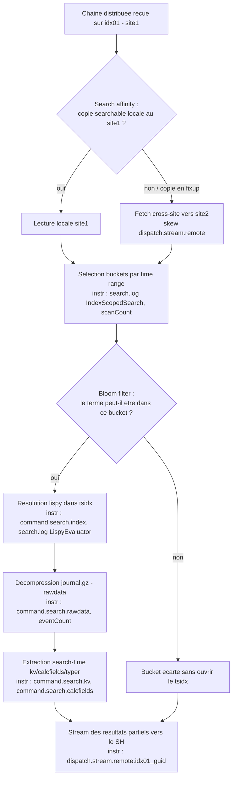

# Chapitre 04 — Map sur les indexeurs (cœur du temps)

> **Enjeu temporel** — La phase **map** est, sur une plateforme distribuée, celle
> qui concentre le plus souvent la majorité du wallclock : c'est là que chaque
> search peer ouvre des buckets, résout le *lispy* dans les tsidx, décompresse le
> `journal.gz` et applique l'extraction search-time avant de streamer ses
> résultats partiels. Le symptôme se lit d'un coup d'œil au Job Inspector : un
> `command.search.rawdata` ou un `command.search.index` dominant dans les
> *Execution costs*, un `scanCount` très supérieur au `eventCount`, ou un
> `dispatch.stream.remote.<peer_guid>` déséquilibré entre sites. Après ce
> chapitre, vous savez dire si ce temps vient d'un time range trop large, de
> termes non sélectifs, d'une extraction search-time lourde ou d'un défaut de
> **search affinity** multisite — et actionner le levier correspondant, en
> distinguant ce que vous réglez seul de ce qui relève de l'admin du cluster.

## Rappel mécanique

La phase map tourne sur chaque **search peer** (indexeur — `idx01`, `idx02`,
`idx03`), en parallèle. À réception de la chaîne distribuée, le peer déroule
quatre sous-étapes : (1) **sélection des buckets** dont les bornes temporelles
recoupent le time range ; (2) **écartement par bloom filters** — un filtre de
Bloom par bucket permet d'exclure un bucket qui ne contient sûrement pas un terme
recherché *sans ouvrir son tsidx* (voir
[Splexicon — bloom filter](https://docs.splunk.com/Splexicon:Bloomfilter)) ;
(3) **résolution tsidx** — l'expression *lispy* mappe les keywords vers les
postings dans les fichiers `.tsidx` du bucket (voir
[Splexicon — tsidx file](https://docs.splunk.com/Splexicon:Tsidxfile)) ;
(4) **matérialisation rawdata** — pour les events retenus, lecture et
décompression du `journal.gz`, puis extraction search-time des champs. Les
résultats partiels remontent ensuite vers le search head.

En multisite, chaque bucket existe en plusieurs copies réparties par site selon
`site_replication_factor`/`site_search_factor` ; une copie *searchable* porte les
tsidx. La **search affinity** fait qu'un SH interroge de préférence les copies de
son propre site (voir
[Splexicon — search affinity](https://docs.splunk.com/Splexicon:Searchaffinity)),
évitant un fetch inter-site. La gouverne : `indexes.conf` (structure des buckets)
et `server.conf [clustering]` du cluster manager `cm01` (facteurs de site). Les
instruments : *Execution costs* (`command.search.*`), *Search job properties*
(`scanCount`/`eventCount`), `search.log` (`LispyEvaluator`, `IndexScopedSearch`)
et `remote_searches.log` sur chaque peer.

## Décomposition du temps de cette phase

Le temps se dépense *à l'intérieur* du map dans l'ordre des sous-étapes, chacune
exposée par un marqueur précis. Le schéma suit une recherche arrivant sur un peer,
avec la décision de search affinity multisite en amont de l'ouverture des buckets.



Trois lectures cardinales. D'abord, `scanCount` >> `eventCount` signale que vous
**ouvrez des events (et souvent des buckets) pour les jeter ensuite** : buckets
trop nombreux (time range large) ou termes non sélectifs. Ensuite, la répartition
entre `command.search.index` (coût tsidx) et `command.search.rawdata` (coût
décompression) dit *quelle* sous-étape domine : un `index` élevé pointe une
résolution *lispy* coûteuse ou beaucoup de buckets ouverts ; un `rawdata` élevé
pointe une matérialisation massive du `journal.gz`. Enfin, un
`dispatch.stream.remote.<peer_guid>` systématiquement plus haut pour les peers
d'un site que d'un autre trahit un **skew inter-site** — souvent un défaut
d'affinity qui force le fetch cross-site (voir
[Use the Job Inspector](https://docs.splunk.com/Documentation/Splunk/9.4/Search/ViewsearchjobpropertieswiththeJobInspector)).

## Leviers d'action

- **Levier — resserrer le time range.** Fixer un intervalle explicite (time
  picker ou `earliest`/`latest`), jamais *All time* par réflexe.
  - **Effet temporel attendu** — le time range conditionne le nombre de buckets
    éligibles au map : les bornes temporelles de chaque bucket décident de son
    éligibilité, et moins de buckets ouverts se traduit par moins d'events lus,
    donc des `command.search.index` et `command.search.rawdata` plus courts.
    C'est le levier de plus fort effet sur cette phase (voir
    [How to optimize searches](https://docs.splunk.com/Documentation/Splunk/9.4/Search/Optimizesearches)).
  - **Comment le mesurer** — `scanCount` (Search job properties) avant/après ;
    nombre de buckets scannés dans la ligne `IndexScopedSearch` de `search.log`.
  - **Frontière** — *autoportant*.

- **Levier — maximiser la sélectivité des termes indexés.** Placer les termes
  rares en tête, éviter les wildcards de tête (`*foo`) et les négations
  (`NOT`/`!=`) comme filtre primaire, s'appuyer sur les *major breakers* du
  segment.
  - **Effet temporel attendu** — un terme sélectif permet aux **bloom filters**
    d'écarter davantage de buckets sans ouvrir leur tsidx, et au *lispy* de
    résoudre moins de postings ; à l'inverse, un wildcard de tête ou une négation
    n'éliminent aucun bucket et neutralisent tsidx et bloom, forçant un scan large
    (voir [Splexicon — bloom filter](https://docs.splunk.com/Splexicon:Bloomfilter)
    et [How to optimize searches](https://docs.splunk.com/Documentation/Splunk/9.4/Search/Optimizesearches)).
  - **Comment le mesurer** — `command.search.index` dans les *Execution costs* ;
    l'écart `scanCount` vs `eventCount` (un `scanCount` >> `eventCount` révèle des
    buckets ouverts pour rien) ; l'expression évaluée dans la ligne
    `LispyEvaluator` de `search.log`.
  - **Frontière** — *autoportant*.

- **Levier — basculer sur `tstats` quand seuls des champs indexés sont requis.**
  Réécrire une recherche qui n'a besoin que de `index`, `sourcetype`, `host`,
  `_time` ou d'extractions indexées en `| tstats … where …`.
  - **Effet temporel attendu** — `tstats` travaille sur les seuls tsidx et
    **évite la décompression rawdata** ; en 9.x, cela supprime l'essentiel du coût
    `command.search.rawdata` pour les agrégations éligibles (voir
    [tstats](https://docs.splunk.com/Documentation/Splunk/9.4/SearchReference/Tstats)).
  - **Comment le mesurer** — chute de `command.search.rawdata` entre la variante
    `stats` et la variante `tstats` dans les *Execution costs* ; `eventCount`
    devenu sans objet quand le comptage se fait sur les postings.
  - **Frontière** — *renvoi D3* — la mécanique d'accélération et les conditions
    de couverture sont traitées en
    [`06-acceleration-comme-levier.md`](06-acceleration-comme-levier.md) ; le
    levier retenu ici : tout ce qui se résout dans les tsidx n'ouvre pas le
    `journal.gz`.

- **Levier — réduire la matérialisation rawdata.** Filtrer et projeter tôt :
  remonter les prédicats dans la base search et poser un `fields` restrictif avant
  toute commande qui a besoin des events entiers.
  - **Effet temporel attendu** — moins d'events franchissent la décompression et
    l'extraction, et moins de champs sont portés : le coût `command.search.rawdata`
    décroît avec le nombre d'events réellement matérialisés (voir
    [How search works](https://docs.splunk.com/Documentation/Splunk/9.4/Capacity/Howsearchworks)).
  - **Comment le mesurer** — `command.search.rawdata` et `eventCount` avant/après ;
    un `eventCount` qui baisse à `resultCount` constant confirme que vous
    matérialisez moins pour le même résultat.
  - **Frontière** — *autoportant*.

- **Levier — garantir la search affinity multisite.** Maintenir
  `site_search_factor` ≥ 1 pour chaque site dans `server.conf [clustering]` du
  cluster manager `cm01`, afin qu'un SH dispose toujours d'une copie searchable
  locale à son site.
  - **Effet temporel attendu** — avec une copie searchable locale, le SH lit sur
    les peers de son propre site au lieu de traverser l'inter-site ; l'affinity
    supprime le fetch cross-site et son skew de latence (voir
    [Multisite search affinity](https://docs.splunk.com/Documentation/Splunk/9.4/Indexer/Multisitesearchaffinity)
    et [Splexicon — search factor](https://docs.splunk.com/Splexicon:Searchfactor)).
  - **Comment le mesurer** — skew de `dispatch.stream.remote.<peer_guid>` par
    site (les peers d'un site systématiquement plus lents) ; `remote_searches.log`
    sur les peers pour voir *quel* site répond ; disparition du skew après
    correction du facteur de site.
  - **Frontière** — *admin-only* (cluster manager) — demander : « porter
    `site_search_factor` à une valeur garantissant une copie searchable par site
    et lancer le fixup ».

- **Levier — alléger l'extraction search-time coûteuse.** Identifier les
  `KV_MODE`, `EXTRACT-*`, `TRANSFORMS-*` search-time lourds sur un sourcetype
  chaud et promouvoir les champs réellement chauds en extraction index-time
  (`props.conf`/`fields.conf`).
  - **Effet temporel attendu** — un champ search-time est recalculé sur le peer à
    *chaque* recherche ; promu index-time, il est déjà matérialisé (donc gratuit
    au map) et devient éligible à `tstats`, ce qui réduit `command.search.kv` et
    `command.search.calcfields` (voir
    [How search works](https://docs.splunk.com/Documentation/Splunk/9.4/Capacity/Howsearchworks)).
  - **Comment le mesurer** — `command.search.kv`, `command.search.calcfields`,
    `command.search.fieldalias` dans les *Execution costs* avant/après promotion.
  - **Frontière** — *admin-only* (parsing / index-time, sur la couche
    d'indexation) — demander : « promouvoir le champ X du sourcetype Y en
    extraction index-time ». Quels paramètres s'exécutent à quelle phase :
    [`../../concepts/splunk-parsing-phase-uf-vs-hf.md`](../../concepts/splunk-parsing-phase-uf-vs-hf.md).

- **Levier — éviter les recherches lourdes pendant un rebalance ou un fixup
  non-searchable.** Planifier les rebalances hors des fenêtres de recherche
  critique et exiger `splunk rebalance cluster-data -searchable true`.
  - **Effet temporel attendu** — sans `-searchable true`, des buckets peuvent
    devenir transitoirement non-searchable ; le map bascule alors sur une copie
    distante ou attend le fixup, ce qui gonfle le temps par peer. Rebalancer en
    mode searchable déplace les copies une par une avec promotion préalable d'une
    primaire, préservant la searchabilité (voir
    [Rebalance the indexer cluster](https://docs.splunk.com/Documentation/Splunk/9.4/Indexer/Rebalancethecluster)).
  - **Comment le mesurer** — état des buckets et des peers via
    `| rest /services/cluster/manager/buckets` et `.../peers` ; corrélation
    temporelle entre le ralentissement du map et un fixup/rebalance en cours.
  - **Frontière** — *renvoi D3* + *admin-only* (cluster manager) — le cycle de
    fixup est décrit dans
    [`../../concepts/splunk-buckets-multisite-lifecycle.md`](../../concepts/splunk-buckets-multisite-lifecycle.md)
    et les modes de rebalance dans
    [`../../concepts/splunk-rebalance-multisite.md`](../../concepts/splunk-rebalance-multisite.md) ;
    le levier retenu ici : rebalancer en `-searchable true` évite qu'un bucket
    devienne transitoirement non-searchable et fasse basculer le map en cross-site.

- **Levier — exploiter le batch mode et la parallélisation par bucket.** S'assurer
  que les peers sont dimensionnés pour paralléliser le traitement des buckets
  (data parallelization) et que le mode d'exécution adapté est retenu pour les
  recherches longues non progressives.
  - **Effet temporel attendu** — un peer correctement dimensionné traite
    davantage de buckets en parallèle par recherche, ce qui raccourcit le map à
    volume égal ; le dimensionnement indexeur (CPU, I/O) conditionne ce
    parallélisme (voir
    [Reference hardware](https://docs.splunk.com/Documentation/Splunk/9.4/Capacity/Referencehardware)
    et [How search works](https://docs.splunk.com/Documentation/Splunk/9.4/Capacity/Howsearchworks)).
  - **Comment le mesurer** — concurrence de recherche par peer via
    `metrics.log group=search_concurrency` ; comparaison du temps par peer dans
    `dispatch.stream.remote.<peer_guid>` à charge comparable.
  - **Frontière** — *admin-only* (sizing indexeur / Capacity Planning) —
    demander : « revoir le dimensionnement des peers pour le parallélisme de
    recherche sur l'index Z ».

## Anti-patterns coûteux

- **Laisser le time picker sur *All time* par réflexe.** Tous les buckets de
  l'index deviennent éligibles au map, quel que soit l'âge des données. Marqueur :
  `scanCount` très élevé au regard de `eventCount`. Correction : borner le time
  range.
- **Filtrer par wildcard de tête (`*error`) ou par négation (`NOT`/`!=`) comme
  filtre primaire.** Ces formes n'éliminent aucun bucket : tsidx et bloom filters
  sont inopérants, le peer ouvre tout et jette après coup. Marqueur :
  `command.search.index` élevé, `scanCount` >> `eventCount`. Correction : un
  terme positif sélectif en tête, la négation en filtre secondaire.
- **Charger l'extraction search-time dans la base search sur un sourcetype
  chaud.** Chaque event matérialisé paie l'extraction, à chaque recherche.
  Marqueur : `command.search.kv`/`command.search.calcfields` dominants. Correction :
  alléger les KO automatiques et promouvoir les champs chauds en index-time.
- **Tolérer un `site_search_factor` insuffisant.** Faute de copie searchable
  locale, le SH lit cross-site à chaque recherche ; les peers d'un autre site sont
  sur-sollicités. Marqueur : skew de `dispatch.stream.remote.<peer_guid>` par
  site. Correction : rétablir le facteur de site (admin CM).
- **Lancer des recherches lourdes pendant un rebalance non-searchable.** Des
  buckets non-searchable transitoires font attendre ou dévier le map. Marqueur :
  ralentissement corrélé à un fixup/rebalance dans l'état du cluster. Correction :
  rebalancer en `-searchable true`, hors fenêtre critique.
- **Confondre `scanCount` et `eventCount` pour juger un filtre.** Croire le filtre
  efficace alors que `scanCount` >> `eventCount` trahit un filtrage tardif au map.
  Marqueur : l'écart entre les deux propriétés. Correction : remonter le prédicat
  et améliorer la sélectivité indexée.

## Exemples travaillés

### Un temps dominé par la décompression rawdata

Recherche sur un sourcetype web volumineux, sur 7 jours, lente.

```spl
index=main sourcetype=access_combined earliest=-7d@d latest=now
| stats count by status
```

Ce qu'on lit au Job Inspector : dans les *Execution costs*,
`command.search.rawdata` domine (chaque event est décompressé depuis le
`journal.gz`), `command.search.index` reste modeste, et `scanCount` est très
supérieur à `eventCount`. Le comptage ne porte que sur `status` : aucun champ
non indexé n'impose d'ouvrir les events. Version corrigée si `status` est un champ
indexé ou couvert par un data model accéléré :

```spl
| tstats count where index=main sourcetype=access_combined by status
    earliest=-7d@d latest=now
```

Après bascule, `command.search.rawdata` s'effondre : la réponse se lit dans les
tsidx sans matérialiser le rawdata (renvoi ch06 pour la couverture requise).

### Un terme non sélectif qui neutralise les bloom filters

Recherche cherchant une sous-chaîne d'erreur par wildcard de tête.

```spl
index=os sourcetype=linux_secure "*failed*" earliest=-24h@h latest=now
| stats count by host
```

Ce qu'on lit au Job Inspector : `command.search.index` est élevé et `scanCount`
proche du volume total de l'index sur la fenêtre — le wildcard de tête empêche les
bloom filters d'écarter le moindre bucket et le *lispy* de cibler des postings
(ligne `LispyEvaluator` de `search.log` sans terme discriminant). Version
corrigée avec un terme positif ancré :

```spl
index=os sourcetype=linux_secure "Failed password" earliest=-24h@h latest=now
| stats count by host
```

Le terme sélectif laisse les bloom filters écarter les buckets sans occurrence :
`scanCount` chute vers l'ordre de grandeur de `eventCount`.

### Un skew inter-site révélant un défaut d'affinity

Recherche multisite dont le temps par peer est déséquilibré.

Ce qu'on lit au Job Inspector : `dispatch.stream.remote.<idx02_guid>` (site2) est
plusieurs fois supérieur à `dispatch.stream.remote.<idx01_guid>` (site1), alors
que les deux sites portent un volume comparable. En lisant `remote_searches.log`
sur les peers :

```text
2026-07-26 10:15:02.451 remote_search sid=00000000-0000-0000-0000-000000000001 host=idx02 elapsed_ms=8420
```

Un site répond lentement de façon systématique, non ponctuelle : ce n'est pas un
peer isolé mais tout un site. La cause probable est un **défaut de search
affinity** — faute de copie searchable locale au site du SH, le map se rabat sur
les peers de l'autre site (fetch cross-site). Le levier est admin-only : rétablir
`site_search_factor` ≥ 1 par site sur `cm01` et laisser le fixup reconstituer les
copies searchables locales. À distinguer d'un peer *unique* lent (un seul
`dispatch.stream.remote` haut), qui pointerait un problème matériel ou un fixup
localisé, pas l'affinity.

## Renvois conditionnels (D3)

- **Cycle de vie et fixup des buckets multisite** —
  [`../../concepts/splunk-buckets-multisite-lifecycle.md`](../../concepts/splunk-buckets-multisite-lifecycle.md).
  Le cycle de gel/fixup y est décrit pleinement ; le fait retenu ici : un bucket
  dont la copie searchable est en fixup peut faire basculer le map sur une copie
  distante ou le faire attendre.
- **Rebalance multisite (`-searchable true`, data vs primary rebalance)** —
  [`../../concepts/splunk-rebalance-multisite.md`](../../concepts/splunk-rebalance-multisite.md).
  Les deux opérations y sont distinguées pleinement ; le levier retenu ici :
  rebalancer en `-searchable true` évite qu'un bucket devienne transitoirement
  non-searchable et fasse dévier le map en cross-site.
- **Index-time vs search-time — quel champ est promouvable** —
  [`../../concepts/splunk-parsing-phase-uf-vs-hf.md`](../../concepts/splunk-parsing-phase-uf-vs-hf.md).
  La répartition des paramètres `props.conf` entre phases y est traitée ; le fait
  retenu ici : un champ matérialisé à l'index-time est gratuit au map et éligible
  à `tstats`, un champ search-time est recalculé à chaque recherche.
- **Cas ITSI + Federated Search** —
  [`../../concepts/splunk-itsi-federated-search.md`](../../concepts/splunk-itsi-federated-search.md).
  Le modèle federated y est décrit pleinement ; le fait retenu ici : en mode
  transparent, la restriction s'applique côté provider et le map temporel se
  déroule sur les indexeurs du provider distant, pas sur le SH initiateur.
- **Accélération (`tstats`, data model acceleration)** —
  [`06-acceleration-comme-levier.md`](06-acceleration-comme-levier.md). Le
  coût/bénéfice temporel de l'accélération y est traité ; le levier retenu ici :
  ce qui se résout dans les tsidx n'ouvre pas le `journal.gz` et supprime
  l'essentiel du `command.search.rawdata`.

## Sources

- [Splunk Search Manual 9.4 — How to optimize searches](https://docs.splunk.com/Documentation/Splunk/9.4/Search/Optimizesearches)
- [Splunk Search Manual 9.4 — Use the Job Inspector](https://docs.splunk.com/Documentation/Splunk/9.4/Search/ViewsearchjobpropertieswiththeJobInspector)
- [Splunk Managing Indexers and Clusters of Indexers 9.4 — Multisite search affinity](https://docs.splunk.com/Documentation/Splunk/9.4/Indexer/Multisitesearchaffinity)
- [Splunk Managing Indexers and Clusters of Indexers 9.4 — How the indexer stores indexes (buckets)](https://docs.splunk.com/Documentation/Splunk/9.4/Indexer/Howtheindexerstoresindexes)
- [Splunk Managing Indexers and Clusters of Indexers 9.4 — Rebalance the indexer cluster](https://docs.splunk.com/Documentation/Splunk/9.4/Indexer/Rebalancethecluster)
- [Splunk Capacity Planning Manual 9.4 — How search works](https://docs.splunk.com/Documentation/Splunk/9.4/Capacity/Howsearchworks)
- [Splunk Capacity Planning Manual 9.4 — Reference hardware](https://docs.splunk.com/Documentation/Splunk/9.4/Capacity/Referencehardware)
- [Splunk Search Reference 9.4 — tstats](https://docs.splunk.com/Documentation/Splunk/9.4/SearchReference/Tstats)
- [Splexicon — bucket](https://docs.splunk.com/Splexicon:Bucket)
- [Splexicon — tsidx file](https://docs.splunk.com/Splexicon:Tsidxfile)
- [Splexicon — bloom filter](https://docs.splunk.com/Splexicon:Bloomfilter)
- [Splexicon — search affinity](https://docs.splunk.com/Splexicon:Searchaffinity)
- [Splexicon — search factor](https://docs.splunk.com/Splexicon:Searchfactor)
