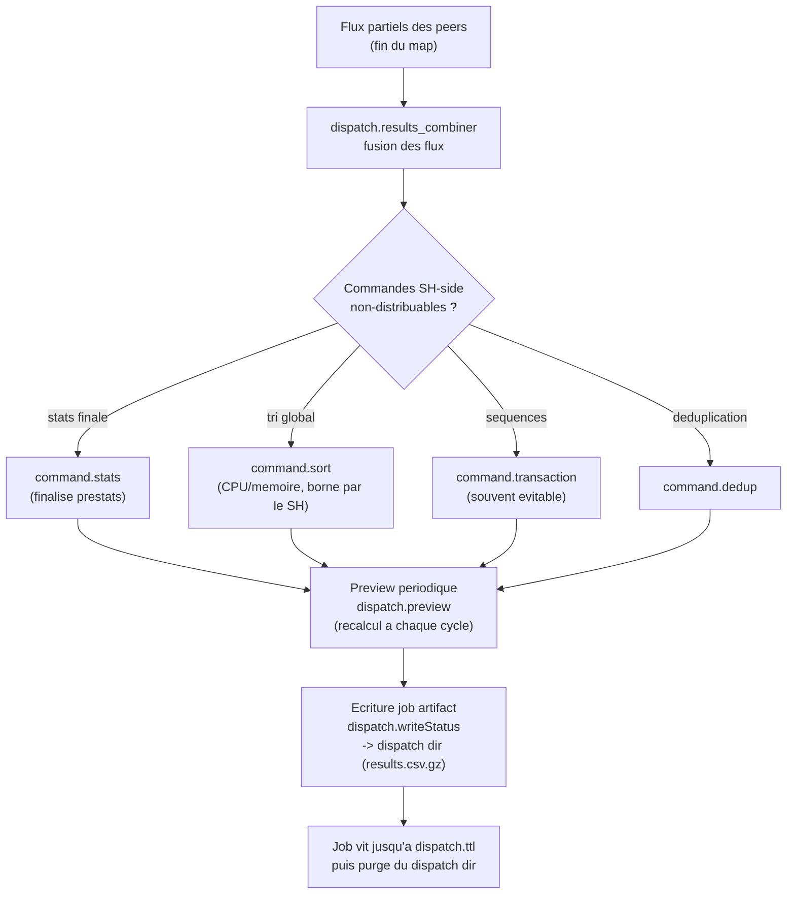

# Chapitre 05 — Reduce sur le search head et restitution du job

> **Enjeu temporel** — Quand le map est terminé sur les peers mais que le
> compteur de résultats stagne, le temps est passé côté search head, dans la
> phase *reduce* : les commandes non-distribuables (`stats` finale, `sort`,
> `transaction`, `dedup`) consomment les flux des peers, la preview périodique
> recalcule, et le job artifact s'écrit dans le dispatch dir. Cette phase est
> bornée par le CPU et la mémoire d'un seul nœud — le SH — là où le map était
> parallélisé sur N indexeurs. Un `command.sort` ou un `command.transaction`
> dominant dans les *Execution costs*, ou un `dispatch.preview` répété, la
> trahissent. Après ce chapitre, vous savez lire ces postes, décider ce qui
> peut redescendre en phase distribuée (`prestats`), et borner ce qui reste.

## Rappel mécanique

Le reduce tourne **sur le search head** (`sh01`, ou le captain `captain01` pour
une scheduled search clusterisée). Le SH consomme au fil de l'eau les flux
retournés par les peers et applique les commandes **non-streaming** : `stats`
finale, `sort` global, `dedup`, `head`, `transaction`. Une commande streaming
(`eval`, `where`, `rex`, `fields`) s'exécute en parallèle sur les peers ; une
commande transforming casse cette parallélisation et rapatrie le travail au SH.

`stats` est un cas mixte : il se décompose en une pré-agrégation **`prestats`**
poussée aux peers et une finalisation au SH — la part distribuée apparaît en
`command.prestats` (côté peers), la finalisation en `command.stats` (côté SH).
`sort`, `dedup` et `transaction` sont, eux, entièrement centralisés.

Pendant l'exécution, le SH génère une **preview** à intervalle régulier (elle
recalcule le résultat partiel courant) et écrit progressivement dans le
**dispatch dir** (`$SPLUNK_HOME/var/run/splunk/dispatch/<sid>/`, `results.csv.gz`
et fichiers d'events). Le job persiste jusqu'à l'expiration de son `ttl`
(`dispatch.ttl`), puis le dispatch dir est purgé. La pagination sert ensuite des
tranches du résultat matérialisé. La séquence bout en bout (vérification →
fan-out → map → reduce) est décrite au chapitre 00 ; ce chapitre isole la
dernière étape et ses leviers (voir
[Search Manual — About jobs and job management](https://docs.splunk.com/Documentation/Splunk/9.4/Search/Aboutjobsandjobmanagement)).

## Décomposition du temps de cette phase

Le reduce se lit dans deux zones du Job Inspector : les *Execution costs*
SH-side (`command.stats`, `command.sort`, `command.transaction`, `command.dedup`)
et les postes `dispatch.*` d'orchestration (`dispatch.results_combiner`,
`dispatch.preview`, `dispatch.writeStatus`). La propriété `resultCount` (lignes
finales produites) et la taille du dispatch dir complètent le tableau.



La règle de lecture : plus le pipeline pousse de travail en `command.prestats`
(côté peers), moins il reste à `command.stats`/`command.sort` (côté SH). Un
`command.sort` ou `command.transaction` dominant, avec un `resultCount` élevé,
signale un reduce lourd. Un `dispatch.preview` répété et coûteux signale une
preview trop fréquente pour le volume traité.

`dispatch.results_combiner` isole le coût de **fusion** des flux partiels : il
monte quand beaucoup de peers renvoient beaucoup de lignes à recoller, même sans
commande centralisée coûteuse en aval. `dispatch.writeStatus` chronomètre
l'écriture de l'état et du job artifact ; il traîne quand `resultCount` est
massif ou quand le dispatch dir est déjà sous pression (voir le levier TTL).
Enfin, la **pagination** de l'UI ne relance pas le reduce : elle sert des
tranches du `results.csv.gz` déjà matérialisé — la lenteur perçue au défilement
d'un job volumineux vient de la taille du résultat, pas d'un recalcul. Ces trois
faits séparent un reduce *calculatoire* (commandes SH-side) d'un reduce
*volumétrique* (trop de lignes à combiner, écrire et paginer).

## Leviers d'action

- **Levier — pousser le travail dans la phase distribuée (`prestats`).** Réécrire
  une commande SH-only en forme décomposable : `stats count by <clé>` se
  pré-agrège en `prestats` sur les peers, seule la fusion revient au SH ;
  préférer `stats` distribuable à un `transaction` ou un `eventstats` centralisé.
  - **Effet temporel attendu** — en 9.x, la part pré-agrégée sur les peers
    n'est plus payée sur le SH ; le reduce se réduit à combiner des agrégats
    partiels au lieu de traiter chaque event (voir
    [Search Manual — About jobs and job management](https://docs.splunk.com/Documentation/Splunk/9.4/Search/Aboutjobsandjobmanagement)).
  - **Comment le mesurer** — la bascule dans les *Execution costs* : `command.prestats`
    (peers) monte, `command.stats` (SH) descend ; suivre aussi la part
    `dispatch.stream.remote` vs le poids SH-side.
  - **Frontière** — *autoportant*.

- **Levier — éviter les commandes centralisées coûteuses (`sort`/`transaction`/`dedup`).**
  Bannir `sort` global sans borne, remplacer un `transaction` évitable par
  `stats earliest()/latest() by <clé>`, éviter un `dedup` massif quand un
  `stats by` suffit.
  - **Effet temporel attendu** — ces trois commandes sont entièrement SH-side et
    bornées par le CPU/mémoire d'un seul nœud ; les éliminer ou les distribuer
    supprime un poste `command.sort`/`command.transaction`/`command.dedup` du
    reduce (voir [Search Reference — transaction](https://docs.splunk.com/Documentation/Splunk/9.4/SearchReference/Transaction)).
  - **Comment le mesurer** — `command.sort`, `command.transaction`, `command.dedup`
    dans les *Execution costs* avant/après réécriture.
  - **Frontière** — *autoportant* ; la discipline de réécriture `transaction` →
    `stats` est *renvoi D3* vers le power-user handbook.

- **Levier — borner les résultats tôt (`head`, `maxResultRows`).** Placer un
  `| head N` dès que seul un échantillon est utile, et connaître le plafond
  `maxResultRows` (`limits.conf [searchresults]`) qui borne ce qu'un job
  matérialise.
  - **Effet temporel attendu** — moins de lignes à trier, à combiner et à
    écrire ; un `sort` suivi d'un `head N` autorise l'optimiseur à ne conserver
    que le top-N au lieu de trier tout le jeu (voir
    [Search Reference — head](https://docs.splunk.com/Documentation/Splunk/9.4/SearchReference/Head)).
  - **Comment le mesurer** — `resultCount`, `dispatch.writeStatus` et la taille
    du dispatch dir baissent conjointement.
  - **Frontière** — *autoportant* pour `head` ; *admin-only* pour relever/abaisser
    `maxResultRows` dans `limits.conf`.

- **Levier — espacer ou désactiver la preview.** Pour une recherche lourde,
  couper la preview (`preview=false` sur un panneau de dashboard) ou espacer son
  intervalle (`preview` / `max_preview_period` dans `limits.conf [search]`,
  ou `dispatch.*` dans `savedsearches.conf`).
  - **Effet temporel attendu** — chaque cycle de preview **recalcule** le
    résultat partiel courant ; sur une recherche transforming lourde, ces
    recalculs se cumulent au temps utile (voir
    [Admin Manual — limits.conf](https://docs.splunk.com/Documentation/Splunk/9.4/Admin/Limitsconf)).
  - **Comment le mesurer** — `dispatch.preview` dans les *Execution costs* :
    nombre d'invocations et durée cumulée.
  - **Frontière** — *autoportant* pour `preview=false` sur un dashboard ;
    *admin-only* pour les défauts `limits.conf`.

- **Levier — régler le TTL du job artifact (`dispatch.ttl`).** Fixer un `ttl`
  raisonnable (`dispatch.ttl` dans `savedsearches.conf`, ou par défaut dans
  `limits.conf [search]`) pour que les jobs terminés libèrent le dispatch dir.
  - **Effet temporel attendu** — ce n'est pas le temps d'*une* recherche mais la
    pression disque et la contention du dispatch dir qui rejaillissent sur
    **toutes** les recherches : un dispatch dir saturé ralentit l'écriture et le
    ménage (voir
    [Search Manual — Dispatch directory and search artifacts](https://docs.splunk.com/Documentation/Splunk/9.4/Search/Dispatchdirectoryandsearchartifacts)).
  - **Comment le mesurer** — nombre et volume des jobs sous
    `$SPLUNK_HOME/var/run/splunk/dispatch/` ; corrélation avec la latence
    d'écriture (`dispatch.writeStatus`).
  - **Frontière** — *admin-only* pour le défaut `limits.conf` ; *autoportant*
    pour `dispatch.ttl` sur une saved search que le lecteur possède.

- **Levier — préférer le batch mode à la preview temps réel.** Quand la
  complétude prime sur la progressivité (rapport, export, alerte), exécuter en
  batch : pas de preview, le résultat n'est rendu qu'à la fin.
  - **Effet temporel attendu** — en supprimant les recalculs de preview, le SH
    ne paie plus que la finalisation unique ; utile pour une scheduled search
    dont personne ne regarde la progression (voir
    [Admin Manual — savedsearches.conf](https://docs.splunk.com/Documentation/Splunk/9.4/Admin/Savedsearchesconf)).
  - **Comment le mesurer** — `dispatch.preview` proche de zéro en batch ;
    `elapsedTime` vs somme des postes reduce.
  - **Frontière** — *autoportant*.

## Anti-patterns coûteux

- **`sort` sans `head`.** Un tri global sur des millions de lignes est payé
  entièrement au SH. Marqueur : `command.sort` élevé, `resultCount` massif.
  Correction : borner avec `| head N`, ou laisser l'agrégation `stats` réduire
  le volume avant de trier.
- **`transaction` là où `stats` suffit.** `transaction <clé>` pour regrouper des
  events en sessions est presque toujours réécrivable en
  `stats earliest()/latest() by <clé>` — souvent 10× plus rapide et distribuable.
  Marqueur : `command.transaction` dominant. Correction : réécrire en `stats`
  (renvoi D3 power-user).
- **`stats values(*)` / `list(*)` non borné.** La liste dédupliquée par ligne
  explose la mémoire du SH sur un champ à forte cardinalité. Marqueur : reduce
  qui gonfle en mémoire, artifact volumineux. Correction : restreindre aux champs
  utiles (`values(user)`) ou borner en amont (`head`, `dedup`).
- **Preview 30 s sur une recherche lourde.** Chaque cycle recalcule ; sur une
  transforming coûteuse, la preview double parfois le travail. Marqueur :
  `dispatch.preview` avec beaucoup d'invocations. Correction : espacer ou couper
  la preview, ou basculer en batch.
- **TTL énorme sur des jobs fréquents.** Un `dispatch.ttl` démesuré multiplié par
  un volume de scheduled searches sature le dispatch dir. Marqueur : dispatch dir
  volumineux, `dispatch.writeStatus` qui traîne. Correction : ajuster le `ttl`
  à la durée d'usage réelle du résultat.

## Exemples travaillés

### Un `sort` global qui domine le reduce

Recherche censée remonter les 20 IP les plus actives, mais lente une fois le map
fini.

```spl
index=main sourcetype=access_combined earliest=-24h@h latest=now
| stats count by clientip
| sort - count
```

Ce qu'on lit au Job Inspector : `command.stats` est raisonnable (la
pré-agrégation `command.prestats` a bien tourné côté peers), mais `command.sort`
domine les *Execution costs* et `resultCount` est très élevé — le SH trie
l'intégralité des IP distinctes pour n'en afficher que le haut. Correction :
borner le tri.

```spl
index=main sourcetype=access_combined earliest=-24h@h latest=now
| stats count by clientip
| sort - count
| head 20
```

Après : `command.sort` chute (l'optimiseur ne conserve que le top-20),
`resultCount` tombe à 20, `dispatch.writeStatus` et la taille du dispatch dir
suivent.

### Un `transaction` évitable

Recherche regroupant les events d'un utilisateur en sessions.

```spl
index=security sourcetype=linux_secure earliest=-24h@h latest=now
| transaction user maxpause=30m
| stats count
```

Ce qu'on lit au Job Inspector : `command.transaction` concentre le temps du
reduce (le SH parcourt le flux event par event pour bâtir les groupes), avec un
risque de troncature `maxevents` silencieuse. Réécriture en `stats` distribuable :

```spl
index=security sourcetype=linux_secure earliest=-24h@h latest=now
| stats earliest(_time) as debut latest(_time) as fin count by user
```

Après : `command.transaction` disparaît, remplacé par une agrégation
`command.stats` largement pré-calculée en `command.prestats` sur les peers.

### Une preview qui recalcule

Panneau de dashboard branché sur une recherche transforming lourde, avec preview
active par défaut. Ce qu'on lit au Job Inspector : `dispatch.preview` cumule un
grand nombre d'invocations et une durée non négligeable, alors que le résultat
final ne change plus. Correction : `preview=false` sur le panneau (ou batch mode
pour une scheduled), et `dispatch.preview` retombe vers zéro.

## Renvois conditionnels (D3)

- **Séquence distribuée et phase reduce (cas captain)** —
  [`../splunk-shc-knowledge-bundle/04-sequence-recherche-distribuee.md`](../splunk-shc-knowledge-bundle/04-sequence-recherche-distribuee.md).
  Le reduce y est décrit comme l'étape 4 de la séquence, notamment le cas où il
  s'exécute sur le captain d'un SHC. Le levier retenu ici : ce qui est
  décomposable en `prestats` sur les peers ne pèse plus sur le SH, visible dans
  la bascule `command.stats` → `command.prestats` / `dispatch.stream.remote`.
- **`stats mindset` et réécriture `transaction` → `stats`** —
  [`../splunk-user-handbook/02-spl-transforming-and-stats.md`](../splunk-user-handbook/02-spl-transforming-and-stats.md).
  La discipline SPL (quand `stats` bat `transaction`/`eventstats`, comment borner
  `streamstats`, pourquoi `values(*)` est un risque mémoire) y est pleinement
  enseignée. Le levier retenu ici : toute commande centralisée réécrite en forme
  distribuable ou bornée allège un poste `command.*` SH-side du reduce.

## Sources

- [Splunk Search Manual 9.4 — About jobs and job management](https://docs.splunk.com/Documentation/Splunk/9.4/Search/Aboutjobsandjobmanagement)
- [Splunk Search Manual 9.4 — Use the Job Inspector](https://docs.splunk.com/Documentation/Splunk/9.4/Search/ViewsearchjobpropertieswiththeJobInspector)
- [Splunk Search Manual 9.4 — Dispatch directory and search artifacts](https://docs.splunk.com/Documentation/Splunk/9.4/Search/Dispatchdirectoryandsearchartifacts)
- [Splunk Admin Manual 9.4 — limits.conf](https://docs.splunk.com/Documentation/Splunk/9.4/Admin/Limitsconf)
- [Splunk Admin Manual 9.4 — savedsearches.conf](https://docs.splunk.com/Documentation/Splunk/9.4/Admin/Savedsearchesconf)
- [Splunk Search Reference 9.4 — stats](https://docs.splunk.com/Documentation/Splunk/9.4/SearchReference/Stats)
- [Splunk Search Reference 9.4 — sort](https://docs.splunk.com/Documentation/Splunk/9.4/SearchReference/Sort)
- [Splunk Search Reference 9.4 — transaction](https://docs.splunk.com/Documentation/Splunk/9.4/SearchReference/Transaction)
- [Splunk Search Reference 9.4 — dedup](https://docs.splunk.com/Documentation/Splunk/9.4/SearchReference/Dedup)
- [Splunk Search Reference 9.4 — head](https://docs.splunk.com/Documentation/Splunk/9.4/SearchReference/Head)
