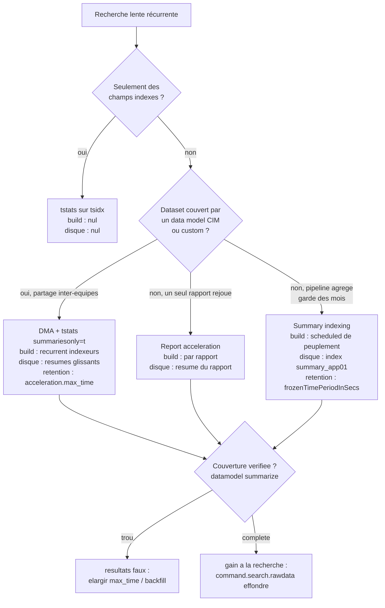

# Chapitre 06 — L'accélération comme levier (coût/bénéfice temporel et dimensionnement)

> **Enjeu temporel** — L'accélération ne rend pas une recherche « plus rapide »
> par magie : elle **déplace le temps**. Un `tstats summariesonly=t` qui répond en
> une fraction de seconde a déjà payé son temps ailleurs — dans un build de résumé
> récurrent sur les indexeurs, du disque immobilisé, une rétention à gouverner. Ce
> chapitre traite l'accélération sous l'angle **dimensionnement et coût/bénéfice
> temporel** : quel gain à la recherche (`command.search.rawdata` qui s'effondre),
> à quel coût de construction (le build visible dans `index=_internal`), sur quelle
> couverture (`| datamodel <dm> summarize`), et où passe la frontière admin-only de
> l'activation. La **mécanique SPL** des quatre stratégies — comment on écrit un
> `tstats`, ce que fait `summariesonly=t` — est pleinement traitée côté power-user
> et n'est ici que rappelée pour ancrer le raisonnement de coût.

## Rappel mécanique

La mécanique SPL de `tstats`, de la data model acceleration (DMA), de la report
acceleration et du summary indexing est **pleinement enseignée** dans
[`../splunk-user-handbook/04-spl-acceleration-tstats-datamodels.md`](../splunk-user-handbook/04-spl-acceleration-tstats-datamodels.md) ;
on n'en reprend ici que le **fait temporel** utile au dimensionnement.

Quatre stratégies, un même échange : du **temps de recherche** contre du **disque
+ de la charge de build + de la rétention à gérer**.

- **`tstats` sur indexed fields** — lit les `tsidx` directement, sans matérialiser
  les events. Aucun coût de build : le tsidx existe déjà. Gratuit à construire,
  limité aux champs indexés (voir [Search Reference — tstats](https://docs.splunk.com/Documentation/Splunk/9.4/SearchReference/Tstats)).
- **Data model acceleration (DMA)** — matérialise des résumés tsidx-compatibles par
  bucket, sur une fenêtre glissante ; `tstats summariesonly=t … FROM datamodel=<dm>`
  ne lit que ces résumés. Coût de build **récurrent** sur les indexeurs (voir
  [Knowledge Manager Manual — Accelerate data models](https://docs.splunk.com/Documentation/Splunk/9.4/Knowledge/Acceleratedatamodels)).
- **Report acceleration** — matérialise le résumé d'**un** rapport (une saved search)
  sur son planning (voir [Reporting Manual — Manage report acceleration](https://docs.splunk.com/Documentation/Splunk/9.4/Report/Manageacceleratesearch)).
- **Summary indexing** — une scheduled search écrit ses résultats agrégés dans un
  index dédié (`summary_app01`) que les recherches aval lisent au lieu du raw (voir
  [Knowledge Manager Manual — About summary indexing](https://docs.splunk.com/Documentation/Splunk/9.4/Knowledge/Aboutsummaryindexing)).

Le build tourne côté **indexeurs** (résumés DMA/report) ou via le **scheduler**
(summary indexing) ; la définition des data models et leur activation vivent sur le
**search head**. Fichiers : `datamodels.conf` (activation/rétention DMA),
`savedsearches.conf` (report acceleration, summary indexing).

## Décomposition du temps de cette phase

L'accélération répartit le temps sur **deux axes** : le temps de recherche (payé à
chaque exécution) et le temps de build (payé une fois au backfill, puis en
maintenance récurrente). Choisir une stratégie, c'est arbitrer entre eux selon la
**fréquence de rejeu** et la **couverture** exigée.



Le point de lecture du **gain** est le Job Inspector : dans les *Execution costs*,
`command.search.rawdata` (lecture + décompression du `journal.gz`) tombe à ~0 quand
la recherche lit un résumé au lieu du raw, et `command.search.index` remplace le
gros du temps map. Le point de lecture du **coût** est double : la **couverture**
via `| datamodel <dm> summarize` (taille du résumé, plage accélérée, état), et la
**durée de build** via `index=_internal` sur le composant de summarization.

## Leviers d'action

Six leviers. Chacun suit le format à quatre points.

### 1. Router les recherches couvertes vers `tstats summariesonly=t` sur un DM accéléré

- **Levier** — quand un dataset récurrent est couvert par un data model accéléré
  (CIM `Authentication`, `Network_Traffic`, ou custom `dm_web`), lire le résumé avec
  `| tstats summariesonly=t … FROM datamodel=<dm>` plutôt que de rejouer un `stats`
  sur le raw. C'est le chemin le plus rapide quand la couverture existe.
- **Effet temporel attendu** — la matérialisation rawdata disparaît : le résumé
  tsidx est lu directement. En 9.x, le gain à la recherche est d'ordres de grandeur
  face à un `stats` qui décompresse chaque event (voir [Accelerate data models](https://docs.splunk.com/Documentation/Splunk/9.4/Knowledge/Acceleratedatamodels)).
- **Comment le mesurer** — *Execution costs* comparés `stats` vs `tstats
  summariesonly=t` : `command.search.rawdata` passe de dominant à ~0, `scanCount`
  chute. `| datamodel <dm> summarize` confirme que la plage demandée est couverte
  **avant** de faire confiance à `summariesonly=t`.
- **Frontière** — *autoportant* pour l'écriture du `tstats` (mécanique en *renvoi
  D3* vers user-handbook/04) ; *admin-only* pour **activer** l'accélération du DM
  s'il ne l'est pas (levier 6).

### 2. Dimensionner la rétention d'accélération DM sur la fenêtre réelle de recherche

- **Levier** — fixer `acceleration.max_time` (et le `backfill`) d'un data model sur
  la **fenêtre temporelle réellement interrogée**, ni plus ni moins. Dans
  `datamodels.conf`, couche app du search head (`$SPLUNK_HOME/etc/apps/<app>/local/`) :

  ```ini
  [dm_web]
  acceleration = 1
  acceleration.max_time = 604800
  acceleration.backfill_time = -7d
  ```

  Ici sept jours : si les dashboards ne regardent jamais au-delà de sept jours, tout
  résumé plus ancien est du build et du disque payés pour rien.
- **Effet temporel attendu** — un `max_time` **trop court** laisse un trou : les
  données récentes ou anciennes manquent, `summariesonly=t` renvoie des résultats
  faux. Un `max_time` **trop long** fait tourner le build sur une fenêtre jamais lue
  — charge indexeur et disque gaspillés. Le bon réglage colle la fenêtre accélérée
  à l'usage (voir [Accelerate data models](https://docs.splunk.com/Documentation/Splunk/9.4/Knowledge/Acceleratedatamodels)).
- **Comment le mesurer** — `| datamodel <dm> summarize` expose la plage accélérée et
  la taille du résumé ; comparer un `| tstats summariesonly=t` à un `| tstats` sans
  le flag révèle immédiatement le trou (l'écart de résultats = la part non couverte).
- **Frontière** — *admin-only* (la conf DMA est sur une couche app du search head,
  capability `accelerate_datamodel`) : ce que l'architecte fait, c'est **calculer la
  fenêtre** et formuler la demande ; l'admin l'applique.

### 3. Réserver la report acceleration aux rapports réellement rejoués

- **Levier** — n'activer la report acceleration que sur une saved search rejouée
  fréquemment (dashboard souvent ouvert, alerte fréquente). Ne pas l'activer « pour
  aller vite » sur des rapports rarement consultés.
- **Effet temporel attendu** — chaque rapport accéléré paie un backfill initial puis
  une maintenance récurrente ; le gain à la lecture n'est rentable que si le rapport
  est **rejoué assez souvent** pour amortir ce build. Un rapport accéléré et jamais
  ouvert est du build pur (voir [Manage report acceleration](https://docs.splunk.com/Documentation/Splunk/9.4/Report/Manageacceleratesearch)).
- **Comment le mesurer** — `| rest /services/admin/summarization` liste les résumés
  d'accélération et leur état ; la charge des builds se lit dans le scheduler
  (`index=_internal` composant de summarization, durée par cycle). Croiser avec la
  fréquence d'ouverture réelle du rapport tranche la rentabilité.
- **Frontière** — *autoportant* pour décider **quel** rapport mérite l'accélération ;
  *admin-only* si le toggle « Accelerate » est absent faute de capability
  `schedule_search` (levier 6).

### 4. Précalculer les agrégats récurrents lourds par summary indexing

- **Levier** — pour un agrégat récurrent coûteux qu'aucune accélération de DM ne
  couvre proprement (pipeline multi-étapes dont on veut garder la **sortie** des
  mois durant), faire écrire une scheduled search dans un index de résumé dédié
  (`summary_app01`) ; les recherches aval lisent le résumé au lieu du raw.
- **Effet temporel attendu** — la recherche quotidienne lit un volume déjà agrégé
  (`index=summary_app01`) au lieu de rescanner le raw : le temps map s'effondre
  parce que le `scanCount` porte sur les lignes de résumé, pas sur les events bruts
  (voir [About summary indexing](https://docs.splunk.com/Documentation/Splunk/9.4/Knowledge/Aboutsummaryindexing)).
- **Comment le mesurer** — la **taille** de `summary_app01` et la **durée** de la
  scheduled de peuplement (`index=_internal sourcetype=scheduler`, `run_time` de la
  saved search) donnent le coût ; le *Execution costs* de la recherche aval
  (`command.search.rawdata` ~0, `scanCount` réduit à la volumétrie du résumé) donne
  le gain.
- **Frontière** — *admin-only* pour **créer** l'index (`indexes.conf`, ACL,
  rétention) et pour la capability `schedule_search` ; *autoportant* pour concevoir
  la scheduled et le schéma agrégé. Attention : le schéma écrit est un **contrat** —
  renommer un champ plus tard divergerait de tout l'historique.

### 5. Choisir la granularité des résumés (span, champs) selon l'arbitrage build vs query

- **Levier** — régler la **finesse** des résumés : le `span` d'agrégation (summary
  indexing / report), les objets et champs retenus dans le data model. Plus fin =
  plus de requêtes aval possibles ; plus grossier = build plus léger.
- **Effet temporel attendu** — une granularité trop fine (span court, beaucoup de
  champs) alourdit le build à chaque cycle sans forcément servir les requêtes
  réelles ; une granularité trop grossière rend le résumé inutilisable pour certaines
  requêtes qui doivent alors retomber sur le raw. Le bon span est le **plus grossier
  qui satisfait encore** les requêtes cibles.
- **Comment le mesurer** — mettre en regard la **durée de build** (`index=_internal`
  composant de summarization) et le **temps de requête** (*Execution costs* de la
  recherche aval) : si le build coûte plus que ce que les requêtes économisent sur la
  période, la granularité est trop fine.
- **Frontière** — *autoportant* pour le choix de span/champs côté conception ;
  *admin-only* dès que le réglage touche la conf DMA sur la couche app.

### 6. Assumer la frontière admin-only de l'activation et formuler la demande

- **Levier** — activer une accélération, fixer une rétention disque, promouvoir un
  champ en index-time pour le rendre `tstats`-able : tout cela relève de
  capabilities (`accelerate_datamodel`, `schedule_search`) et de `.conf` sur des
  couches (app du search head, indexes du cluster) que l'architecte ne pilote pas
  seul. Le levier, à son niveau, est de **formuler une demande dimensionnée**.
- **Effet temporel attendu** — sans activation, aucun des gains ci-dessus n'existe ;
  une demande floue (« accélérez ce DM ») produit soit un sur-dimensionnement
  (disque/build gaspillés) soit un sous-dimensionnement (couverture insuffisante,
  résultats faux).
- **Comment le mesurer** — l'état d'activation se lit sans droits d'écriture :
  `| rest /services/data/models` (accélération activée ?), `| datamodel <dm>
  summarize` (couverture effective). Ce sont les preuves à joindre à la demande.
- **Frontière** — *admin-only* par nature. Forme de demande : « activer
  l'accélération du data model `dm_web`, rétention `N` jours (justification : les
  dashboards `payments_dashboards` regardent au plus 7 jours), volume quotidien
  estimé `<…>` » ; ou « créer l'index `summary_app01`, rétention `N` jours, write
  ACL pour la saved search `acc_daily_summary` ».

## Anti-patterns coûteux

- **Accélérer tous les data models et rapports « pour aller vite ».** Chaque
  accélération est un build récurrent ; empilés, ils saturent les indexeurs en
  permanence. Marqueur : de nombreux résumés dans `| rest
  /services/admin/summarization` et un composant de summarization qui domine
  `index=_internal`. Correction : n'accélérer que les datasets/rapports réellement
  rejoués (leviers 1, 3).
- **Faire confiance à `summariesonly=t` sans vérifier la couverture.** Si
  l'accélération est en pause, récente, ou d'une rétention plus courte que la fenêtre
  interrogée, on lit un trou et on appelle ça « la métrique d'hier ». Marqueur : des
  comptes qui chutent brutalement à un décalage fixe de `now()`. Correction :
  `| datamodel <dm> summarize` **avant** d'épingler un dashboard dessus (levier 2).
- **Attendre un `tstats … by <champ>` sur un champ non indexé.** `tstats` ne voit
  pas les champs search-time : il renvoie vide ou faux. Marqueur : un `tstats` à zéro
  ligne là où le `stats` équivalent en renvoie des milliers. Correction : grouper par
  un champ indexé, passer par un data model où le champ est au schéma, ou promouvoir
  le champ en index-time (admin-only).
- **Créer un summary index sans rétention.** L'index gonfle indéfiniment. Marqueur :
  croissance continue de la taille de `summary_app01`. Correction : fixer
  `frozenTimePeriodInSecs` / `maxTotalDataSizeMB` dès la création (admin-only).
- **Accélérer un dataset volatil dont le build ne rattrape jamais.** Sur des données
  à fort débit ou souvent rééditées (chaque édition de DM invalide le résumé et
  relance un backfill), le build court après la donnée sans jamais converger.
  Marqueur : un `summary_status` jamais complet dans `| datamodel <dm> summarize`.
  Correction : stabiliser le modèle, ou renoncer à la DMA au profit d'un `tstats`
  direct sur champs indexés.

## Exemples travaillés

### Choisir entre DMA et summary indexing sur un agrégat récurrent

Un rapport quotidien compte les échecs d'authentification par utilisateur sur les
sept derniers jours, et il traîne. Deux voies.

Voie DMA — si le sourcetype `linux_secure` est mappé CIM dans le data model
`Authentication` accéléré, la lecture devient :

```spl
| tstats summariesonly=t count
    FROM datamodel=Authentication
    WHERE Authentication.action=failure earliest=-7d@d latest=now
    BY Authentication.user
```

Ce qu'on lit au Job Inspector : dans les *Execution costs*,
`command.search.rawdata` est ~0 (aucun `journal.gz` décompressé), `scanCount` porte
sur les résumés et non sur le raw. Le coût a migré vers le build DMA, à vérifier via
`| datamodel Authentication summarize` (plage accélérée ≥ 7 jours) et la durée du
build dans `index=_internal`.

Voie summary indexing — si l'on veut garder « échecs par jour et par utilisateur »
des mois durant sans payer une accélération full-volume, une scheduled écrit un
agrégat quotidien dans `summary_app01`, et la recherche annuelle lit ce résumé.
Ce qu'on lit : `scanCount` réduit à la volumétrie du résumé, `command.search.rawdata`
~0 ; le coût est la durée de la scheduled de peuplement (`sourcetype=scheduler`,
`run_time`) et la taille de `summary_app01`. **Arbitrage** : la DMA sert plusieurs
équipes et plusieurs requêtes sur une fenêtre glissante ; le summary indexing sert
un agrégat figé conservé bien au-delà de toute rétention d'accélération.

### Diagnostiquer une couverture insuffisante

Un dashboard adossé à `dm_web` accéléré affiche des comptes qui s'effondrent
au-delà de trois jours, alors que la fenêtre demandée est de sept jours :

```spl
| datamodel dm_web summarize
```

Ce qu'on lit : la plage accélérée effective s'arrête à trois jours — l'
`acceleration.max_time` est sous-dimensionné (ou un backfill n'a pas rattrapé). Le
`summariesonly=t` lit un trou sur les jours 4 à 7. La correction est dimensionnante
(élargir `max_time` à 7 jours, relancer le backfill) et **admin-only** ; la preuve à
joindre à la demande est précisément cette sortie `summarize` plus le `| rest
/services/data/models` montrant l'état d'accélération.

## Renvois conditionnels (D3)

- **Mécanique SPL de `tstats`, DMA, report acceleration, summary indexing** —
  [`../splunk-user-handbook/04-spl-acceleration-tstats-datamodels.md`](../splunk-user-handbook/04-spl-acceleration-tstats-datamodels.md).
  La mécanique des quatre stratégies (écriture des `tstats`, `summariesonly=t`,
  `prestats=t`, configuration d'un summary index, mapping CIM) y est **pleinement
  enseignée** côté power-user ; le levier retenu ici est : **dimensionner
  `acceleration.max_time` sur la fenêtre réelle de recherche évite de payer du build
  inutile**, vérifiable dans `| datamodel <dm> summarize`.
- **Lien `tstats` ↔ tsidx et sélectivité des termes indexés** —
  [`04-map-sur-indexeurs.md`](04-map-sur-indexeurs.md). Le map lit les tsidx ; ce
  chapitre en traite la sélectivité. Le fait retenu ici : un `tstats` est rapide
  parce qu'il reste dans le tsidx (ou son résumé accéléré) et ne matérialise jamais
  le rawdata.

## Sources

- [Splunk Enterprise 9.4 — Knowledge Manager Manual — About data models](https://docs.splunk.com/Documentation/Splunk/9.4/Knowledge/Aboutdatamodels)
- [Splunk Enterprise 9.4 — Knowledge Manager Manual — Accelerate data models](https://docs.splunk.com/Documentation/Splunk/9.4/Knowledge/Acceleratedatamodels)
- [Splunk Enterprise 9.4 — Knowledge Manager Manual — About summary indexing](https://docs.splunk.com/Documentation/Splunk/9.4/Knowledge/Aboutsummaryindexing)
- [Splunk Enterprise 9.4 — Reporting Manual — Manage report acceleration](https://docs.splunk.com/Documentation/Splunk/9.4/Report/Manageacceleratesearch)
- [Splunk Enterprise 9.4 — Search Reference — tstats](https://docs.splunk.com/Documentation/Splunk/9.4/SearchReference/Tstats)
- [Splunk Enterprise 9.4 — Search Reference — datamodel](https://docs.splunk.com/Documentation/Splunk/9.4/SearchReference/Datamodel)
- [Common Information Model documentation (latest)](https://docs.splunk.com/Documentation/CIM/latest/User/Overview)
