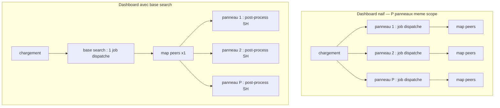

# Chapitre 07 — Restitution UI (impact temporel, borné)

> **Enjeu temporel** — La couche dashboard ne consomme pas du temps *dans* une
> recherche : elle en **multiplie le nombre**. Chaque panneau est un job
> dispatché, chaque auto-refresh redispatche, chaque input piloté par token
> relance une recherche. Un dashboard mal bâti transforme un clic en dizaines de
> jobs concurrents contre le même dataset, et une plateforme saine en une file de
> recherche saturée aux heures ouvrées. Le symptôme ne se lit pas d'abord au Job
> Inspector d'un panneau isolé mais dans le **nombre de jobs par chargement**
> (`_audit action=search` filtré par app, onglet réseau du navigateur) et dans la
> charge du scheduler attribuable au refresh. Après ce chapitre, vous saurez
> compter les dispatches d'un dashboard, les faire chuter par une base search
> partagée, des bornes de time range et une cadence conservatrice — sans déborder
> sur la **construction** UI, traitée ailleurs.

## Rappel mécanique

Dans la couche restitution, l'unité de coût n'est pas la commande SPL mais le
**job**. À l'ouverture d'un dashboard, chaque panneau qui porte sa propre
recherche dispatche un job indépendant : un dashboard à P panneaux de même scope
émet P recherches distribuées vers les peers, P fois le même map. Une **base
search** casse cette multiplication : elle exécute la portion commune une seule
fois, et chaque panneau la **post-process** — un chaînage `|` évalué sur le
search head, **sans nouveau dispatch vers les peers** (voir
[Use base searches](https://docs.splunk.com/Documentation/Splunk/9.4/Viz/Savedsearches)).
Une lecture indexeur pour P panneaux au lieu de P.

Trois autres mécanismes relancent des jobs : l'**auto-refresh** redispatche les
panneaux à l'intervalle fixé ; un **input** piloté par token (dropdown,
multiselect) exécute sa propre recherche de peuplement à chaque changement de
valeur ; un **drilldown** ouvre une recherche qui hérite time range et tokens de
la source sauf borne explicite. En 9.x deux runtimes coexistent — **Dashboards
Studio** (JSON) et **Classic SimpleXML** — avec des modèles de token et de
drilldown distincts (voir
[Dashboards Studio overview](https://docs.splunk.com/Documentation/Splunk/9.4/DashStudio/Overview)).
La **construction** de ces objets (syntaxe base search, `$token$`, drilldown) est
pleinement traitée power-user (renvoi D3) ; ce chapitre n'en retient que
l'**impact temporel**.

## Décomposition du temps de cette phase

Le « temps » d'un dashboard est la somme des jobs qu'il dispatche, pas la durée
d'un seul. Deux topologies de chargement, deux coûts :



Les instruments qui exposent ce coût, du plus global au plus fin :

- **Nombre de jobs dispatchés par chargement** — l'instrument cardinal de ce
  chapitre. Deux lectures : l'**onglet réseau du navigateur** (une requête POST
  `/services/search/jobs` par job dispatché à l'ouverture) et `_audit
  action=search` filtré par `app` sur la fenêtre du chargement, qui compte les
  jobs et expose `total_run_time`, `scan_count`, `workload_pool` par recherche.
- **Job Inspector par panneau** — pour un panneau donné, on y relit les marqueurs
  du chapitre 00 : `scanCount`/`eventCount` (le time range du panneau est-il
  borné ?), `command.search.rawdata` vs `command.search.index` (le panneau lit-il
  du raw là où un `tstats` suffirait ?), `dispatch.stream.remote.<peer_guid>`.
- **Charge scheduler/dispatch attribuable au refresh** — `metrics.log
  group=search_concurrency` (slots occupés) et `group=searchscheduler` corrélés à
  la cadence : une charge indexeur qui persiste alors que personne ne regarde
  l'écran trahit un auto-refresh laissé ouvert.
- **Temps des jobs d'input** — l'`elapsedTime`/`total_run_time` de la recherche
  qui peuple un dropdown ; un input adossé à un `stats values()` sur temps ouvert
  y apparaît comme une base search complète cachée derrière un widget.

Règle de lecture cardinale : avant d'optimiser un panneau, **comptez les jobs du
chargement**. Un dashboard qui dispatche 30 jobs pour 30 vues du même scope se
corrige par une base search, pas en accélérant chaque panneau isolément.

## Leviers d'action

- **Levier — base search partagée + post-process** pour tout dashboard dont deux
  panneaux ou plus partagent le scope (`index`/`sourcetype`/time range). Promouvoir
  le préfixe commun en base search, réécrire chaque panneau en post-process après
  le `|`.
  - **Effet temporel attendu** — en 9.x, une base search fait passer le coût
    indexeur de P lectures à **une seule** : le job de base dispatche une fois vers
    les peers, les post-process se calculent sur le search head sans redispatcher
    (voir [Use base searches](https://docs.splunk.com/Documentation/Splunk/9.4/Viz/Savedsearches)).
  - **Comment le mesurer** — nombre de jobs dispatchés au chargement, avant/après :
    `_audit action=search` filtré par `app` (ou l'onglet réseau) montre P jobs qui
    tombent à 1 base + post-process.
  - **Frontière** — *autoportant* pour la décision temporelle (mutualiser le
    scope) ; *renvoi D3* pour la **construction** de la base search et des chaînages.

- **Levier — cadence de rafraîchissement conservatrice** : refresh manuel par
  défaut ; si l'auto-refresh est nécessaire, pousser l'intervalle à plusieurs
  minutes ; jamais 30 s sur un dashboard laissé ouvert par plusieurs personnes.
  - **Effet temporel attendu** — chaque refresh redispatche les jobs de panneau.
    Un dashboard à P panneaux en auto-refresh 30 s, ouvert sur N postes, génère de
    l'ordre de `2·P·N` dispatches par minute contre le même dataset, y compris
    quand personne ne regarde — un coût scheduler sans valeur.
  - **Comment le mesurer** — charge attribuable au dashboard : `metrics.log
    group=search_concurrency` (pic de slots) et le compte `_audit action=search`
    des recherches du dashboard dans le temps, corrélés à la cadence.
  - **Frontière** — *autoportant*.

- **Levier — bornes de time range par défaut + drilldown borné** : fixer un time
  range par défaut serré (jamais *All time*, snapper `@h`/`@d`) et borner tout
  drilldown par une fenêtre explicite (`earliest`/`latest` transmis).
  - **Effet temporel attendu** — le time range par défaut conditionne le
    `scanCount` de **chaque** panneau (buckets éligibles au map, chapitre 04) ; un
    drilldown non borné ouvre au clic une recherche sur *All time*, payant un map
    complet là où l'utilisateur croyait payer une fenêtre (voir
    [How to optimize searches](https://docs.splunk.com/Documentation/Splunk/9.4/Search/Optimizesearches)).
  - **Comment le mesurer** — `scanCount` par panneau (Job Inspector du job de
    panneau) ; après un drilldown, vérifier `earliest`/`latest` dans le Job
    Inspector du job résultant.
  - **Frontière** — *autoportant* pour la décision de borner ; *renvoi D3* pour la
    syntaxe des tokens de drilldown.

- **Levier — adosser les scorecards single-value à `tstats`/un DM accéléré** :
  peupler les tuiles à valeur unique via `tstats` contre un champ indexé ou un data
  model accéléré, jamais un `stats` sur raw.
  - **Effet temporel attendu** — `tstats` lit les tsidx au lieu de décompresser
    `journal.gz` : `command.search.rawdata` tombe à ~0 et une rangée de quatre
    tuiles coûte de l'ordre de quatre lookups indexés au lieu de quatre lectures
    raw complètes — assez rapide pour laisser un refresh manuel.
  - **Comment le mesurer** — *Execution costs* du job de tuile : `command.search.rawdata`
    ~0, `command.search.index` domine ; comparer une variante `stats` vs `tstats`.
  - **Frontière** — *renvoi D3* ch06 pour la mécanique `tstats`/accélération et le
    dimensionnement de la couverture.

- **Levier — borner les inputs** : alimenter un dropdown par un `lookup` (ex.
  `assets.csv`) ou un `tstats` récent contre un champ indexé, pas un `stats
  values()` sur temps ouvert.
  - **Effet temporel attendu** — l'input dispatche son propre job à
    l'affichage et à chaque changement de valeur ; un `stats values()` non borné est
    une base search complète cachée derrière un widget, quand un `inputlookup` rend
    en dizaines de millisecondes et ne gonfle pas à des milliers de valeurs pendant
    un incident.
  - **Comment le mesurer** — temps du job d'input : `total_run_time` de la
    recherche de peuplement dans `_audit action=search`, ou `elapsedTime` de son Job
    Inspector.
  - **Frontière** — *autoportant*.

- **Levier — éviter le mix Studio/Classic et les dashboards à 30 panneaux de même
  scope** : choisir un runtime par dashboard ; plafonner le nombre de panneaux et
  consolider ceux de même scope derrière une base search ; scinder par scope plutôt
  qu'empiler.
  - **Effet temporel attendu** — 30 panneaux de même scope, c'est 30 dispatches
    concurrents au chargement — une rafale qui sature la concurrence de recherche ;
    mélanger Studio et Classic duplique les définitions et interdit le partage de
    base search (les deux runtimes ne partagent ni contrat de token ni base search).
  - **Comment le mesurer** — nombre de jobs concurrents par chargement (onglet
    réseau ; pic `metrics.log group=search_concurrency`) ; compte `_audit` par
    chargement.
  - **Frontière** — *autoportant* pour la décision de scinder/plafonner ; *renvoi
    D3* pour le choix et les patterns Studio vs Classic.

## Anti-patterns coûteux

- **Trente panneaux re-requêtant le même scope.** Chaque panneau paie une lecture
  des mêmes events. Marqueur : pic de la file de recherche indexeur au seul
  chargement de la page, `_audit action=search` qui compte P jobs quasi
  simultanés. Correction : base search + post-process ; si les scopes diffèrent
  vraiment, scinder en plusieurs dashboards.
- **Auto-refresh 30 s laissé par défaut.** Un dashboard inactif consomme le même
  budget scheduler qu'un dashboard piloté, sans produire de valeur. Marqueur :
  charge indexeur qui ne corrèle avec aucune présence devant l'écran, slots
  occupés en continu dans `group=search_concurrency`. Correction : refresh manuel
  par défaut, exceptions documentées pour les vues de supervision live.
- **Drilldown ouvrant une recherche sans borne temporelle.** Un clic curieux paie
  une recherche ; un drilldown mal configuré en paie beaucoup en silence.
  Marqueur : `scanCount` énorme et `earliest`/`latest` absents dans le Job
  Inspector du job de drilldown. Correction : transmettre les bornes de la source.
- **Input adossé à un `stats values()` sur temps ouvert.** Le dropdown met des
  secondes à se peupler et enfle à des milliers d'entrées. Marqueur :
  `total_run_time` élevé du job d'input dans `_audit`. Correction : `lookup` ou
  `tstats` sur fenêtre courte contre un champ indexé.
- **Tables à 50 colonnes « au cas où ».** Chaque colonne est une extraction
  search-time que le search head matérialise. Marqueur : `command.search.kv`
  élevé sur le job du panneau, rendu qui traîne. Correction : n'afficher que les
  colonnes qui portent la décision, le reste derrière un drilldown de ligne.

## Exemples travaillés

### Compter les jobs d'un dashboard lent, puis les faire chuter

Un dashboard `payments_dashboards` à six panneaux « rame » à l'ouverture. Avant
de toucher un seul panneau, on compte les dispatches sur la fenêtre du
chargement :

```spl
index=_audit action=search info=granted app=payments_dashboards
    earliest=-5m@m latest=now
| stats count AS dispatched_jobs by user
```

Ce qu'on lit : `dispatched_jobs` vaut 6 par chargement et par utilisateur — six
lectures indexeur du même scope. Les six panneaux partagent le préfixe
`index=main sourcetype=access_combined earliest=-24h@h latest=now`. On le promeut
en base search et on réécrit chaque panneau en post-process (`| stats count by
status`, `| timechart count by host`, …). Nouveau comptage : `dispatched_jobs`
tombe à 1. Au Job Inspector du job de base, `dispatch.stream.remote.<peer_guid>`
n'apparaît plus qu'une fois ; les panneaux n'y figurent plus car ils se calculent
en post-process sur le search head.

### Une rangée de scorecards raw vs `tstats`

Une rangée de quatre tuiles single-value (events 24 h, sources uniques, taux
d'erreur, delta 7 j) est écrite naïvement avec `stats` sur raw :

```spl
index=security earliest=-24h@h latest=now
| stats count
```

Ce qu'on lit au Job Inspector de la tuile : `command.search.rawdata` domine (chaque
event décompressé depuis `journal.gz`), `scanCount` très supérieur à `resultCount`.
Réécrite en `tstats` contre le champ indexé :

```spl
| tstats count where index=security earliest=-24h@h latest=now
```

Ce qu'on lit après : `command.search.rawdata` ~0, `command.search.index` domine ;
la tuile rend quasi instantanément. Quatre tuiles coûtent alors quatre lookups
indexés au lieu de quatre lectures raw. La mécanique `tstats`/accélération est au
chapitre 06.

### Un drilldown non borné, corrigé par deux tokens

Un panneau d'un dashboard scopé 24 h porte un drilldown qui ouvre
`index=main sourcetype=access_combined status=<valeur cliquée>` sans borne. Au clic,
la recherche part sur le dernier time range de l'utilisateur — souvent *All time*.

Ce qu'on lit au Job Inspector du job de drilldown : `earliest`/`latest` absents ou
très larges, `scanCount` sans commune mesure avec le panneau source. La correction
n'est pas une réécriture mais la transmission des bornes de la source (les tokens
`earliest`/`latest` du dashboard) au drilldown ; on revérifie une fois au Job
Inspector après déploiement que le job résultant est bien borné. La **syntaxe** de
ces tokens est traitée power-user (renvoi ci-dessous).

## Renvois conditionnels (D3)

- **Construction des dashboards : base searches, post-process, tokens, drilldown,
  Studio vs Classic** —
  [`../splunk-user-handbook/05-dashboards-and-visualizations.md`](../splunk-user-handbook/05-dashboards-and-visualizations.md).
  Les patterns UI (comment écrire une base search et ses post-process, la syntaxe
  `$token$`, la construction d'un drilldown, le choix Studio/Classic) y sont
  **pleinement traités** ; le levier retenu ici est : une base search partagée fait
  passer N dispatches à un seul, mesurable au **nombre de jobs par chargement**
  (`_audit action=search` par app, onglet réseau).
- **`tstats`, data model acceleration, coût/bénéfice temporel de l'accélération** —
  [`06-acceleration-comme-levier.md`](06-acceleration-comme-levier.md).
  La mécanique et le dimensionnement de l'accélération y sont traités ; le levier
  retenu ici est : adosser une scorecard single-value à `tstats`/un DM accéléré
  supprime la décompression rawdata, visible par `command.search.rawdata` ~0 dans
  les *Execution costs* du job de tuile.
- **Vocabulaire des marqueurs (Job Inspector, `_audit`, `metrics.log`)** —
  [`00-modele-temporel-et-mesure.md`](00-modele-temporel-et-mesure.md).
  `scanCount`, `command.search.rawdata`, `dispatch.stream.remote`, `_audit
  action=search`, `metrics.log group=search_concurrency` y sont définis une fois ;
  ce chapitre les réutilise sans les redéfinir.

## Sources

- [Splunk Dashboards and Visualizations 9.4 — Use base searches and post-process searches](https://docs.splunk.com/Documentation/Splunk/9.4/Viz/Savedsearches)
- [Splunk Dashboards and Visualizations 9.4 — Dashboards Studio overview](https://docs.splunk.com/Documentation/Splunk/9.4/DashStudio/Overview)
- [Splunk Dashboards and Visualizations 9.4 — About tokens (Studio)](https://docs.splunk.com/Documentation/Splunk/9.4/DashStudio/AboutTokens)
- [Splunk Dashboards and Visualizations 9.4 — Classic SimpleXML](https://docs.splunk.com/Documentation/Splunk/9.4/Viz/AboutdashboardsandSimpleXML)
- [Splunk Search Manual 9.4 — Use the Job Inspector](https://docs.splunk.com/Documentation/Splunk/9.4/Search/ViewsearchjobpropertieswiththeJobInspector)
- [Splunk Search Manual 9.4 — About jobs and job management](https://docs.splunk.com/Documentation/Splunk/9.4/Search/Aboutjobsandjobmanagement)
- [Splunk Search Manual 9.4 — How to optimize searches](https://docs.splunk.com/Documentation/Splunk/9.4/Search/Optimizesearches)
- [Splunk Troubleshooting Manual 9.4 — About metrics.log](https://docs.splunk.com/Documentation/Splunk/9.4/Troubleshooting/Aboutmetricslog)
- [Splunk Splexicon — canonical definitions (base search, post-process search, token, drilldown)](https://docs.splunk.com/Splexicon)
