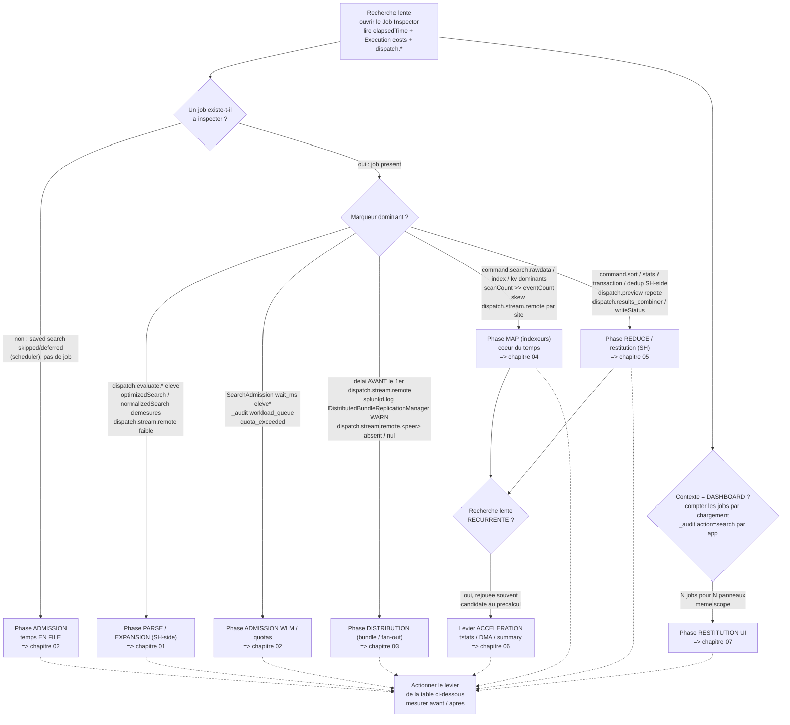

# Chapitre 99 — Cheatsheet : décomposer un temps

> **Enjeu** — Page de référence autoportante et imprimable. Face à une recherche
> lente, ouvrez son **Job Inspector** (**Job → Inspect Job**), repérez le marqueur
> dominant — le plus gros poste des *Execution costs*, le `dispatch.*` le plus
> lourd, ou l'instrument hors Job Inspector quand le temps est *en file* — puis
> suivez l'arbre ci-dessous jusqu'à la phase, le chapitre et le levier. La table
> consolidée agrège les leviers des chapitres 00-07 : chaque ligne se lit d'un
> symptôme observable à sa correction. Le vocabulaire des marqueurs est défini au
> [chapitre 00](00-modele-temporel-et-mesure.md) et n'est pas redéfini ici.

## Arbre de décision — « où est passé le temps ? »

Partez du marqueur **dominant**. La règle d'or (chapitre 00) : ne jamais conclure
sur le wallclock total (`elapsedTime`) sans l'avoir décomposé en postes.

> \* `SearchAdmission wait_ms` est un marqueur **observé** dans `index=_internal`
> en 9.x, sans page de documentation Splunk dédiée : confirmez sa présence sur
> votre instance avant d'en faire une référence normative (chapitre 02).

**Deux pièges de lecture avant d'entrer dans la table** :

- Une saved search *skipped* n'a **pas de job** : son temps n'est pas dans le Job
  Inspector mais dans `index=_internal sourcetype=scheduler`. Ne cherchez pas un
  `elapsedTime` qui n'existe pas (chapitre 02).
- Un délai **avant** le premier `dispatch.stream.remote` est côté bundle/fan-out
  (chapitre 03) ; un délai **dans** les `dispatch.stream.remote` est côté map
  (chapitre 04). Le même écran, deux phases.

## Table consolidée — symptôme → levier

Chaque ligne agrège un levier d'un chapitre 00-07. Colonnes : **Symptôme
observable** (champ Job Inspector / log) | **Phase** | **Chapitre** | **Levier
principal** | **Instrument de vérification**.

| Symptôme observable (Job Inspector / log) | Phase | Ch. | Levier principal | Instrument de vérification |
| --- | --- | --- | --- | --- |
| `scanCount` >> `eventCount` sur toute recherche ; time picker sur *All time* | Transverse | 00 | Borner le time range (intervalle explicite / `earliest`/`latest`) | `scanCount` ; `search.log` `IndexScopedSearch` |
| `command.search.typer`/`kv`/`tags` élevés en usage courant | Transverse | 00 | Choisir le mode `fast` plutôt que `verbose` | *Execution costs* comparés `fast` vs `verbose` |
| `elapsedTime` long sans poste identifié | Transverse | 00 | Lire le Job Inspector (poste dominant + `dispatch.*`) avant d'agir | plus gros poste *Execution costs* / `dispatch.*` rapporté à `elapsedTime` |
| `optimizedSearch` sans prédicat d'index ; `scanCount` >> `eventCount` | Parse SH-side | 01 | Pousser les prédicats (`index`/`sourcetype`/`host`) dans la base search | `optimizedSearch` ; `scanCount` vs `eventCount` |
| `normalizedSearch`/`optimizedSearch` démesurés ; `command.search.tags` élevé | Parse SH-side | 01 | Maîtriser l'expansion : cibler `index`/`sourcetype` en plus du `tag=`/`eventtype=` | taille `normalizedSearch` ; `search.log` `UnifiedSearch - Expanded search` |
| poids SH-side (`command.stats`/`sort`) élevé, `dispatch.stream.remote` faible | Parse SH-side | 01 | Ne pas casser la streaming-ness (transforming le plus tard possible) | part `dispatch.stream.remote` vs postes SH-side |
| `command.search.lookups`/`calcfields`/`fieldalias` significatifs | Parse SH-side | 01 | Auditer et désactiver les KO automatiques (`LOOKUP-*`/`EVAL-*`) inutiles (admin) | `command.search.lookups`/`calcfields`/`fieldalias` |
| aucun job à inspecter ; `status=skipped`/`deferred` ; crons alignés `*/5` | Admission | 02 | Étaler les crons (`schedule_window`, `allow_skew`) | `sourcetype=scheduler status=skipped OR deferred` ; `metrics.log group=searchscheduler` |
| ratio `skipped/total` élevé, slots saturés | Admission | 02 | Régler la concurrence (`max_searches_perc`, `base_max_searches`) — admin | `metrics.log group=search_concurrency` ; ratio `skipped/total` |
| `wait_ms` élevé\* ; `_audit action=workload_queue` aux pics | Admission | 02 | Router la recherche vers le bon pool WLM / admission rule `queue` | `SearchAdmission wait_ms` (p50/p99) ; `_audit workload_pool`/`workload_queue` |
| `dispatch_time` très postérieur au `scheduled_time` pour un rapport critique | Admission | 02 | Prioriser (`schedule_priority = higher`) | `sourcetype=scheduler` : `dispatch_time` vs `scheduled_time` |
| `quota_exceeded` dans `_audit` (refus 503, pas une lenteur) | Admission | 02 | Ajuster `srchJobsQuota` du rôle (admin) | `_audit action=search` occurrences `quota_exceeded` |
| délai avant tout `dispatch.stream.remote` ; bundle volumineux | Distribution | 03 | Limiter la taille du bundle (`maxBundleSize`) / sortir les gros lookups (`replicationBlacklist`, KV Store) | taille sous `var/run/searchpeers/` ; `splunkd.log` `DistributedBundleReplicationManager` |
| cycles de réplication longs sur beaucoup de peers | Distribution | 03 | Choisir le mode de réplication (`cascading` au-delà de ~15-20 peers, `mounted`) | durée de cycle `splunkd.log DistributedBundleReplicationManager` |
| `WARN DistributedBundleReplicationManager … took too long` sur un peer | Distribution | 03 | Régler sciemment les timeouts (`connectionTimeout`/`sendRcvTimeout`) | occurrences `WARN … took too long` + peer nommé |
| latence fixe indépendante du time range ; `dispatch.stream.remote.<peer>` absent/nul | Distribution | 03 | Tenir le `serverList` propre (retirer un peer mort / déléguer au CM) | `| rest /services/search/distributed/peers` (statut) ; `dispatch.stream.remote` manquant |
| `command.search.rawdata` dominant ; `scanCount` >> `eventCount` | Map | 04 | Resserrer le time range / réduire la matérialisation rawdata (`fields` tôt) | `scanCount`, `eventCount` ; `command.search.rawdata` |
| `command.search.index` élevé ; wildcard de tête `*foo` ou `NOT`/`!=` primaire | Map | 04 | Maximiser la sélectivité des termes indexés (terme rare positif en tête) | `command.search.index` ; `search.log` `LispyEvaluator` |
| `command.search.rawdata` dominant sur agrégat de champs indexés | Map | 04 | Basculer sur `tstats` (reste dans le tsidx) | chute de `command.search.rawdata` entre variantes `stats`/`tstats` |
| skew `dispatch.stream.remote.<peer>` systématique par site | Map | 04 | Garantir la search affinity (`site_search_factor` ≥ 1 par site) — admin CM | skew `dispatch.stream.remote` par site ; `remote_searches.log` |
| `command.search.kv`/`calcfields` dominants sur sourcetype chaud | Map | 04 | Alléger l'extraction search-time / promouvoir en index-time — admin | `command.search.kv`/`calcfields` avant/après |
| ralentissement du map corrélé à un fixup/rebalance en cours | Map | 04 | Rebalancer en `-searchable true`, hors fenêtre critique — admin CM | `| rest /services/cluster/manager/buckets` et `.../peers` |
| `command.sort` dominant ; `resultCount` massif | Reduce | 05 | Borner tôt (`| head N`, `maxResultRows`) / pousser en `prestats` | `command.sort`, `resultCount` ; bascule `command.stats`→`command.prestats` |
| `command.transaction`/`dedup` dominants | Reduce | 05 | Éviter les commandes centralisées (`transaction`→`stats earliest()/latest() by`) | `command.transaction`/`dedup` avant/après |
| `dispatch.preview` avec beaucoup d'invocations sur recherche lourde | Reduce | 05 | Espacer/désactiver la preview (`preview=false`) ou batch mode | `dispatch.preview` (invocations + durée) |
| dispatch dir volumineux ; `dispatch.writeStatus` qui traîne | Reduce | 05 | Régler le TTL du job artifact (`dispatch.ttl`) | volume sous `var/run/splunk/dispatch/` ; `dispatch.writeStatus` |
| recherche lente **récurrente** couverte par un DM ; `command.search.rawdata` dominant | Accélération | 06 | Router vers `tstats summariesonly=t` sur DM accéléré | *Execution costs* `stats` vs `tstats` ; `| datamodel <dm> summarize` |
| comptes qui chutent à un décalage fixe de `now()` | Accélération | 06 | Dimensionner `acceleration.max_time` sur la fenêtre réelle (admin) | `| datamodel <dm> summarize` (plage couverte) |
| agrégat récurrent lourd conservé longtemps ; rescan du raw | Accélération | 06 | Summary indexing (`summary_app01`) alimenté par une scheduled | taille `summary_app01` ; `sourcetype=scheduler run_time` ; `command.search.rawdata` ~0 |
| N jobs dispatchés pour N panneaux de même scope | Restitution UI | 07 | Base search partagée + post-process | `_audit action=search` par `app` ; onglet réseau navigateur |
| charge indexeur persistante sans présence devant l'écran | Restitution UI | 07 | Cadence de rafraîchissement conservatrice (refresh manuel par défaut) | `metrics.log group=search_concurrency` corrélé à la cadence |
| `scanCount` énorme, `earliest`/`latest` absents sur un job de drilldown | Restitution UI | 07 | Bornes de time range par défaut + drilldown borné | `scanCount` par panneau ; `earliest`/`latest` du Job Inspector du drilldown |
| `total_run_time` élevé d'un job d'input (`stats values()` sur temps ouvert) | Restitution UI | 07 | Borner les inputs (`lookup`/`tstats` récent) | `total_run_time` du job d'input dans `_audit` |

## Rappel mécanique

Rien de spécifique à cette page — voir le [chapitre 00](00-modele-temporel-et-mesure.md)
pour le modèle temporel et la carte des instruments, puis le chapitre pointé par
la ligne de la table.

## Exemples travaillés

Rien de spécifique — chaque chapitre pointé porte ses exemples travaillés
(avant/après avec lecture du Job Inspector) : voir les sections *Exemples
travaillés* des chapitres [01](01-soumission-et-parsing-spl.md),
[02](02-admission-et-ordonnancement.md), [03](03-distribution.md),
[04](04-map-sur-indexeurs.md), [05](05-reduce-et-restitution.md),
[06](06-acceleration-comme-levier.md) et [07](07-restitution-ui.md).

## Anti-patterns coûteux

Rien de spécifique — voir les sections *Anti-patterns coûteux* des chapitres
pointés, en particulier le piège transverse du [chapitre 00](00-modele-temporel-et-mesure.md)
(conclure sur `elapsedTime` sans décomposer) et la confusion *skipped* vs *lente*
du [chapitre 02](02-admission-et-ordonnancement.md).

## Sources

Agrégation des sources des chapitres 00-07 ; la référence normative des marqueurs
est le Search Manual (Job Inspector) en tête.

- [Splunk Search Manual 9.4 — Use the Job Inspector](https://docs.splunk.com/Documentation/Splunk/9.4/Search/ViewsearchjobpropertieswiththeJobInspector)
- [Splunk Search Manual 9.4 — About jobs and job management](https://docs.splunk.com/Documentation/Splunk/9.4/Search/Aboutjobsandjobmanagement)
- [Splunk Search Manual 9.4 — How to optimize searches](https://docs.splunk.com/Documentation/Splunk/9.4/Search/Optimizesearches)
- [Splunk Search Manual 9.4 — Built-in optimization](https://docs.splunk.com/Documentation/Splunk/9.4/Search/Builtinoptimization)
- [Splunk Search Manual 9.4 — Dispatch directory and search artifacts](https://docs.splunk.com/Documentation/Splunk/9.4/Search/Dispatchdirectoryandsearchartifacts)
- [Splunk Search Reference 9.4 — tstats](https://docs.splunk.com/Documentation/Splunk/9.4/SearchReference/Tstats)
- [Splunk Search Reference 9.4 — stats](https://docs.splunk.com/Documentation/Splunk/9.4/SearchReference/Stats)
- [Splunk Search Reference 9.4 — transaction](https://docs.splunk.com/Documentation/Splunk/9.4/SearchReference/Transaction)
- [Splunk Distributed Search Manual 9.4 — Knowledge bundle replication](https://docs.splunk.com/Documentation/Splunk/9.4/DistSearch/Knowledgebundlereplication)
- [Splunk Distributed Search Manual 9.4 — Limit the knowledge bundle size](https://docs.splunk.com/Documentation/Splunk/9.4/DistSearch/Limittheknowledgebundlesize)
- [Splunk Managing Indexers and Clusters of Indexers 9.4 — Multisite search affinity](https://docs.splunk.com/Documentation/Splunk/9.4/Indexer/Multisitesearchaffinity)
- [Splunk Capacity Planning Manual 9.4 — How search works](https://docs.splunk.com/Documentation/Splunk/9.4/Capacity/Howsearchworks)
- [Splunk Knowledge Manager Manual 9.4 — Accelerate data models](https://docs.splunk.com/Documentation/Splunk/9.4/Knowledge/Acceleratedatamodels)
- [Splunk Knowledge Manager Manual 9.4 — About summary indexing](https://docs.splunk.com/Documentation/Splunk/9.4/Knowledge/Aboutsummaryindexing)
- [Splunk Admin Manual 9.4 — limits.conf](https://docs.splunk.com/Documentation/Splunk/9.4/Admin/Limitsconf)
- [Splunk Admin Manual 9.4 — savedsearches.conf](https://docs.splunk.com/Documentation/Splunk/9.4/Admin/Savedsearchesconf)
- [Splunk Admin Manual 9.4 — distsearch.conf](https://docs.splunk.com/Documentation/Splunk/9.4/Admin/Distsearchconf)
- [Splunk Troubleshooting Manual 9.4 — About metrics.log](https://docs.splunk.com/Documentation/Splunk/9.4/Troubleshooting/Aboutmetricslog)
- [Splunk Dashboards and Visualizations 9.4 — Use base searches and post-process searches](https://docs.splunk.com/Documentation/Splunk/9.4/Viz/Savedsearches)
- [Splunk Workload Management 9.4 — Overview](https://help.splunk.com/en/splunk-enterprise/administer/manage-workloads/9.4/workload-management-overview)
