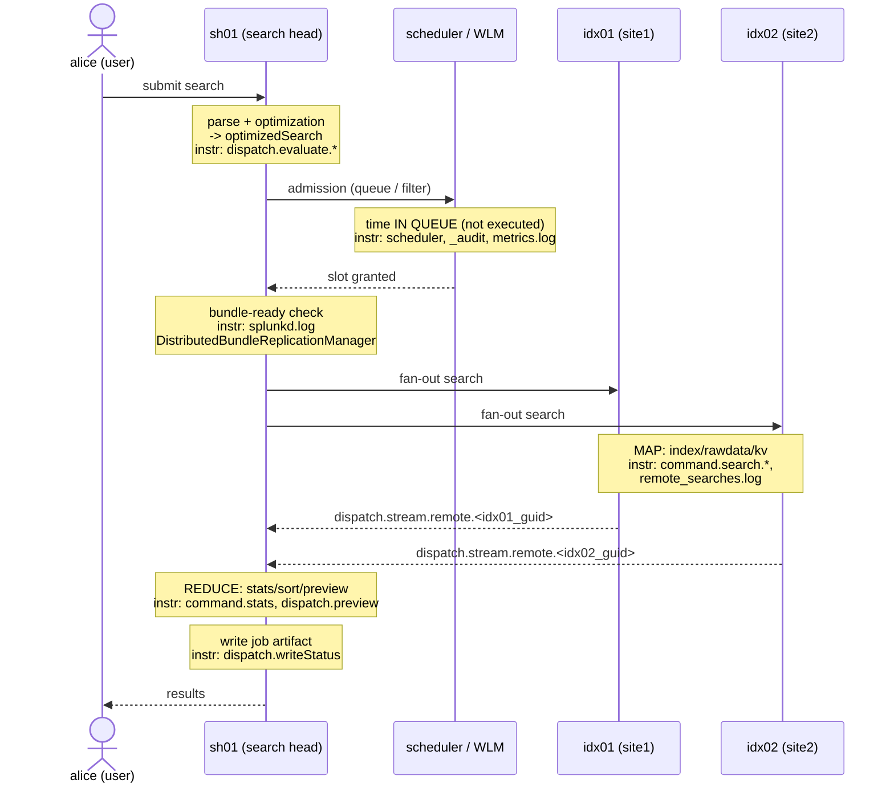

# Chapter 00 — Time model and measurement instruments

> 🇫🇷 **Version française disponible** : [`../00-modele-temporel-et-mesure.md`](../00-modele-temporel-et-mesure.md)

> **Time stake** — This chapter reduces no time; it teaches you to
> *read* it. A distributed search spends its time in a sequence of
> phases (parse and optimization on the search head, admission, bundle
> verification, fan-out, **map** on the peers, **reduce** on the search head,
> writing the job artifact); each one exposes its duration in a precise
> instrument — an item of the Job Inspector *Execution costs*, a job property,
> a log line. Until you have decomposed the total wallclock
> (`elapsedTime`) into these items, any optimization is a gamble. After this
> chapter, you can open a Job Inspector, name the dominant phase, and
> point to the chapter 01-07 that carries the lever. This is the pivot chapter: the
> following ones reuse its vocabulary of markers without redefining it.

## Mechanical recap

An ad hoc or scheduled search on a distributed 9.x platform goes through,
in the order the time is spent in them: (1) **parse + optimization** of the SPL
on the search head (`sh01`), which produces the `optimizedSearch` chain and splits
the pipeline into a distributable portion (streaming, pushed to the peers) and a
centralized portion (transforming, kept on the SH); (2) **admission** by the scheduler and
Workload Management (time *in queue*, not executed); (3) **bundle-ready
verification** then parallel REST **fan-out** to the search peers; (4)
**map** on each peer (`idx01`, `idx02`, `idx03`): bucket selection,
tsidx lookup, rawdata decompression, search-time extraction; (5) **reduce** on
the SH: non-distributable commands, preview; (6) **writing the job artifact**
into the dispatch dir and rendering.

The distributed sequence itself (bundle verification → fan-out → map → reduce)
is described step by step, from the bundle-diagnostic angle, in
[`../../splunk-shc-knowledge-bundle/EN/04-distributed-search-sequence.md`](../../splunk-shc-knowledge-bundle/EN/04-distributed-search-sequence.md);
here we re-read it as a **time decomposition** and attach each
step to its instrument. The useful time fact: each phase runs on a
distinct component (SH vs scheduler vs peers) and is read in a distinct
instrument; confusing the components means looking for the time in the wrong place
(see [About distributed search](https://docs.splunk.com/Documentation/Splunk/9.4/DistSearch/Aboutdistributedsearch)).

## Time decomposition of this phase

The time pipeline, each step annotated with its dominant instrument:



The single entry point is the Job Inspector (**Job → Inspect Job** in the UI,
see [Use the Job Inspector](https://docs.splunk.com/Documentation/Splunk/9.4/Search/ViewsearchjobpropertieswiththeJobInspector)).
It exposes two areas and one summary property.

**Job Inspector — *Execution costs*** (cumulative duration + number of invocations per
internal command). The *peer-side* items (map phase):

| Marker | What it times | What it reveals |
| --- | --- | --- |
| `command.search.index` | lookup in the tsidx (*lispy* resolution → postings) | selectivity of indexed terms; buckets opened |
| `command.search.rawdata` | reading + decompressing the `journal.gz` | materialization of raw events (often the dominant item) |
| `command.search.kv` | search-time field extraction | cost of `EXTRACT-*`/`KV_MODE` on the peer |
| `command.search.calcfields` | calculated fields (`EVAL-*`) | automatic KOs attached to the sourcetype |
| `command.search.fieldalias` | field aliases | same |
| `command.search.lookups` | automatic lookups (`LOOKUP-*`) | same |
| `command.search.typer` | eventtyping | cost of `verbose`/`smart` mode |
| `command.search.tags` | tag resolution | expansion of a `tag=` covering N sourcetypes |
| `command.search.filter` | applying post-extraction filters | late filtering |
| `command.prestats` | distributable pre-aggregation (`prestats`) | share of the `stats` pushed to the peers |

The *search-head-side* items (reduce phase): `command.stats`, `command.sort`,
`command.transaction`, `command.dedup` — non-distributable commands consuming
the streams from the peers.

**Job Inspector — `dispatch.*`** (orchestration time, as displayed in the
Job Inspector 9.4):

| Marker | What it times |
| --- | --- |
| `dispatch.evaluate.*` | parse + optimization of the chain (SH-side phase before fan-out) |
| `dispatch.createdSearchResultInfrastructure` | initialization of the result structures |
| `dispatch.stream.remote.<peer_guid>` | **time per peer** — the gap between peers reveals inter-peer / inter-site skew |
| `dispatch.stream.local` | local streaming (data present on the SH) |
| `dispatch.fetch` | retrieval of partial results |
| `dispatch.preview` | generation of periodic previews |
| `dispatch.results_combiner` | merging of the peer streams |
| `dispatch.writeStatus` | writing the status / the job artifact |

**Job Inspector — *Search job properties*** (see
[About jobs and job management](https://docs.splunk.com/Documentation/Splunk/9.4/Search/Aboutjobsandjobmanagement)):

| Property | Meaning |
| --- | --- |
| `scanCount` | events read from disk (see [About jobs and job management](https://docs.splunk.com/Documentation/Splunk/9.4/Search/Aboutjobsandjobmanagement)) |
| `eventCount` | events retained after filtering |
| `resultCount` | final rows produced |
| `elapsedTime` | total job wallclock |
| `optimizedSearch` / `normalizedSearch` | chain after expansion (macros/tags/eventtypes) then optimization |
| `remoteSearches` | number of distributed searches issued to the peers |

**Cardinal reading rule**: `scanCount` >> `eventCount` signals
**late filtering** — you open events (and often buckets) only to throw
them away afterward; the fix is to push the predicate up (ch01, ch04). A
`dispatch.stream.remote.<peer_guid>` much higher for the peers of one site
than for those of another reveals a **distribution or affinity imbalance**
(ch04).

**Complementary logs** — each with its own scope:

- **`search.log`** (in `$SPLUNK_HOME/var/run/splunk/dispatch/<sid>/`, one
  file per search): the expansion (`UnifiedSearch - Expanded search`), the
  bucket scoping (`IndexScopedSearch`) and the *lispy* evaluation
  (`LispyEvaluator` — the expression that drives tsidx and bloom filters), then the
  dispatch phases.
- **`metrics.log`** (see [About metrics.log](https://docs.splunk.com/Documentation/Splunk/9.4/Troubleshooting/Aboutmetricslog)):
  `group=searchscheduler` (skip/defer of scheduled searches), `group=search_concurrency`
  (slots occupied), `group=pipeline` (ingest side), `group=per_index_thruput`.
- **`remote_searches.log`** (on *each peer*): the distributed search chain
  received and its local timing — this is the instrument that distinguishes a
  slow peer from a distribution skew.
- **`_audit`**: `action=search` with `total_run_time`, `scan_count`,
  `event_count`, `workload_pool` — the historical and per-pool view.
  **`_introspection`**: resource usage per search (`search_telemetry`,
  `resource_usage`).
- **`splunkd.log`**: component `DistributedBundleReplicationManager` — duration and
  failure of the bundle replication cycles (used in ch03).

On `_time` vs `_indextime` and the index-time / search-time split (which field
is already materialized, hence free at map, vs recomputed on every search),
see [`../../../concepts/splunk-cycle-de-vie-evenement.md`](../../../concepts/splunk-cycle-de-vie-evenement.md).

## Action levers

This chapter carries the **cross-cutting** and **methodological** levers; the levers
per phase live in the dedicated chapters.

- **Lever — bound the time range.** Set an explicit interval (time picker
  or `earliest`/`latest`), never *All time* by reflex.
  - **Expected time effect** — the time range conditions the number of buckets
    eligible for map (bucket time bounds); fewer buckets → fewer
    events read → shorter `command.search.index` and `command.search.rawdata`.
    This is the highest-impact lever, cross-cutting across all phases
    (see [How to optimize searches](https://docs.splunk.com/Documentation/Splunk/9.4/Search/Optimizesearches)).
  - **How to measure it** — `scanCount` (Search job properties) before/after;
    buckets scanned in `search.log` (`IndexScopedSearch` line).
  - **Boundary** — *self-contained*.

- **Lever — choose the search mode** (`fast` / `smart` / `verbose`).
  Reserve `verbose` for debugging; `fast` when auto fields and eventtyping
  are not needed.
  - **Expected time effect** — `verbose` forces the computation of all fields,
    eventtyping and tagging; in 9.x, this weighs on `command.search.typer`,
    `command.search.kv` and `command.search.tags`. `fast` avoids them (see
    [Change the search mode](https://docs.splunk.com/Documentation/Splunk/9.4/Search/Changethesearchmode)).
  - **How to measure it** — *Execution costs* compared `fast` vs `verbose`:
    `command.search.typer` and `command.search.kv` drop in `fast`.
  - **Boundary** — *self-contained*; power-user detail in
    [`../../splunk-user-handbook/00-foundations.md`](../../splunk-user-handbook/00-foundations.md).

- **Lever — read the Job Inspector before optimizing** (method). Open
  **Job → Inspect Job**, identify the *Execution costs* item with the greatest
  cumulative duration and the dominant `dispatch.*` *before* any rewrite.
  - **Expected time effect** — directs the effort toward the phase that concentrates the
    time; optimizing a minority phase does not reduce `elapsedTime`.
  - **How to measure it** — the largest *Execution costs* item + the
    dominant `dispatch.*`, relative to `elapsedTime`, point to the chapter:
    huge `dispatch.evaluate`/`optimizedSearch` → ch01; time in queue → ch02;
    `DistributedBundleReplicationManager` → ch03; `command.search.rawdata`/
    `index`/`kv` → ch04; `command.sort`/`stats`/`dispatch.preview` → ch05.
  - **Boundary** — *self-contained* (method).

- **Lever — cross-check the Job Inspector and `remote_searches.log`** when the time is
  on the map side. Compare `dispatch.stream.remote.<peer_guid>` between peers, then read
  `remote_searches.log` on the suspect peers.
  - **Expected time effect** — separates two distinct causes: a **slow peer**
    (a single high `dispatch.stream.remote`) from a **distribution/affinity skew**
    (a whole site high); each cause has its lever in ch04.
  - **How to measure it** — skew of the `dispatch.stream.remote` per peer and per
    site (`site1`/`site2`); local timing of the chain in `remote_searches.log`.
  - **Boundary** — *self-contained* for the diagnosis; fix in ch04
    (*D3 cross-reference*).

## Costly anti-patterns

- **Concluding on the total wallclock (`elapsedTime`) without decomposing.** You
  then optimize blindly, often a minority phase → no gain. The
  marker that reveals it: the absence of any reading of the *Execution costs*.
  Fix: decompose via the Job Inspector before acting.
- **Blaming "the network" or "the bundle" without having measured the
  distribution.** The time is most often in map or reduce, not in
  transport. Marker: compare `dispatch.stream.remote.<peer_guid>` (map) to
  `splunkd.log DistributedBundleReplicationManager` (bundle). Fix:
  measure the verification/fan-out/map/reduce split (echo of the pitfall in
  [`../../splunk-shc-knowledge-bundle/EN/04-distributed-search-sequence.md`](../../splunk-shc-knowledge-bundle/EN/04-distributed-search-sequence.md)).
- **Leaving the time picker on *All time* by reflex.** All buckets
  become eligible for map. Marker: `scanCount` very high relative to
  `eventCount`. Fix: bound the time range.
- **Working in `verbose` everywhere.** The eventtyping and the extraction of all
  fields are paid for pointlessly. Marker: high `command.search.typer` and
  `command.search.kv`. Fix: switch to `fast`.
- **Confusing `scanCount` and `eventCount`.** Believing a filter effective while
  `scanCount` >> `eventCount` betrays late filtering. Marker: the gap
  between the two properties. Fix: push the predicate up into the base
  search (ch01) or improve the selectivity of the indexed terms (ch04).

## Worked examples

### A time dominated by rawdata reading

Search on `index=main sourcetype=access_combined` over 7 days, slow.

```spl
index=main sourcetype=access_combined earliest=-7d@d latest=now
| stats count by status
```

What you read in the Job Inspector: in the *Execution costs*,
`command.search.rawdata` dominates (each event is decompressed from
`journal.gz`), `command.search.index` is modest, and `scanCount` is much
higher than `eventCount`. The time is in the **map phase**: open chapter 04
(term selectivity, `tstats`, early projection).

### An oversized expanded chain

Search starting with a `tag=` covering many sourcetypes.

```spl
tag=authentication earliest=-24h@h latest=now
| stats count by user
```

What you read in the Job Inspector: `optimizedSearch`/`normalizedSearch` are
gigantic (the tag rewrote itself into an OR of dozens of clauses), and
`dispatch.evaluate.*` is high while `dispatch.stream.remote` stays modest.
The time is **SH-side before fan-out**: open chapter 01 (mastering
the expansion, targeting `index`/`sourcetype` in addition to the tag).

### An inter-site skew

What you read in the Job Inspector: `dispatch.stream.remote.<idx02_guid>` (site2)
is several times higher than `dispatch.stream.remote.<idx01_guid>` (site1). Reading
`remote_searches.log` on the peers:

```text
2026-07-26 10:15:02.451 remote_search sid=00000000-0000-0000-0000-000000000001 host=idx02 elapsed_ms=8420
```

A single site responds slowly systematically: suspect a defect of
**multisite search affinity** (the SH reads cross-site for lack of a local
searchable copy). Open chapter 04 (`site_search_factor`, searchable copies).

## Conditional cross-references (D3)

- **Distributed sequence verification → fan-out → map → reduce** —
  [`../../splunk-shc-knowledge-bundle/EN/04-distributed-search-sequence.md`](../../splunk-shc-knowledge-bundle/EN/04-distributed-search-sequence.md).
  The sequence is described there step by step from the bundle-diagnostic angle; here we
  re-read it as a *time* decomposition and attach each step to its
  instrument.
- **Index-time vs search-time, `_time` vs `_indextime`** —
  [`../../../concepts/splunk-cycle-de-vie-evenement.md`](../../../concepts/splunk-cycle-de-vie-evenement.md).
  The event life cycle is treated there in full; the fact retained here: a
  field materialized at index-time is free at map, a search-time field is
  recomputed on every search (`command.search.kv`/`calcfields`).
- **`fast`/`smart`/`verbose` modes on the power-user side** —
  [`../../splunk-user-handbook/00-foundations.md`](../../splunk-user-handbook/00-foundations.md).
  The behavior of the modes is taught there for everyday usage; the fact retained
  here: `verbose` pays `command.search.typer`/`kv`/`tags`, `fast` does not pay
  them.

## Sources

- [Splunk Search Manual 9.4 — Use the Job Inspector](https://docs.splunk.com/Documentation/Splunk/9.4/Search/ViewsearchjobpropertieswiththeJobInspector)
- [Splunk Search Manual 9.4 — About jobs and job management](https://docs.splunk.com/Documentation/Splunk/9.4/Search/Aboutjobsandjobmanagement)
- [Splunk Search Manual 9.4 — Change the search mode](https://docs.splunk.com/Documentation/Splunk/9.4/Search/Changethesearchmode)
- [Splunk Search Manual 9.4 — How to optimize searches](https://docs.splunk.com/Documentation/Splunk/9.4/Search/Optimizesearches)
- [Splunk Distributed Search Manual 9.4 — About distributed search](https://docs.splunk.com/Documentation/Splunk/9.4/DistSearch/Aboutdistributedsearch)
- [Splunk Troubleshooting Manual 9.4 — About metrics.log](https://docs.splunk.com/Documentation/Splunk/9.4/Troubleshooting/Aboutmetricslog)
- [Splunk Troubleshooting Manual 9.4 — What Splunk software logs about itself](https://docs.splunk.com/Documentation/Splunk/9.4/Troubleshooting/WhatSplunklogsaboutitself)
- [Splunk Search Manual 9.4 — Dispatch directory and search artifacts](https://docs.splunk.com/Documentation/Splunk/9.4/Search/Dispatchdirectoryandsearchartifacts)
- [Splunk Capacity Planning Manual 9.4 — How search works (map / reduce)](https://docs.splunk.com/Documentation/Splunk/9.4/Capacity/Howsearchworks)
