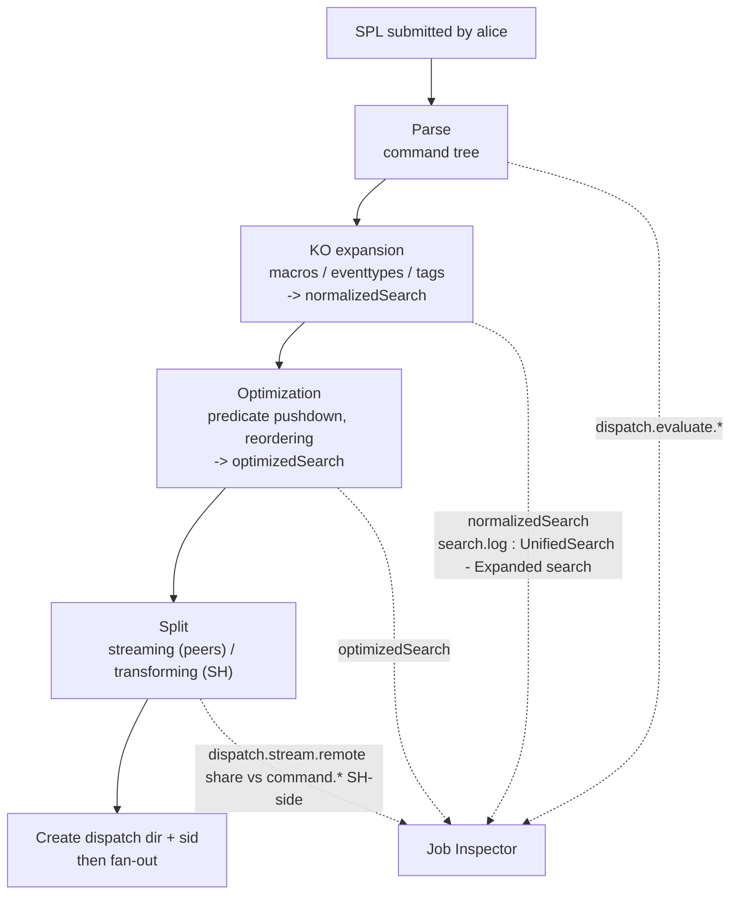

# Chapter 01 — SPL submission and parsing (SH-side time before dispatch)

> 🇫🇷 **Version française disponible** : [`../01-soumission-et-parsing-spl.md`](../01-soumission-et-parsing-spl.md)

> **Time stake** — Before a single peer reads a bucket, the search head
> (`sh01`) has already spent time: it parses the SPL, expands the macros,
> tags and eventtypes, resolves the knowledge objects, optimizes the chain and splits
> the pipeline into a distributable portion and a centralized portion. This phase often stays
> modest, but it explodes when a `tag=` or an `eventtype=` covers dozens of
> sourcetypes: the expanded chain swells and `dispatch.evaluate.*`
> becomes the dominant item while `dispatch.stream.remote` stays low. The
> symptom reads at a glance: an oversized `optimizedSearch`/`normalizedSearch`.
> After this chapter, you can read `optimizedSearch`, spot in it a costly
> expansion or a predicate left downstream, tell this SH-side cost from a
> map cost, and fix on your own what belongs to the SPL.

## Mechanical recap

This phase runs **on the search head**, before any fan-out. It chains
four steps. (1) **Parse**: the SPL chain is validated and turned into a command
tree. (2) **Expansion** of the knowledge objects: a macro is substituted by
its definition; an `eventtype=` and a `tag=` rewrite themselves into boolean clauses
— a tag covering N sourcetypes produces an `OR` of N clauses, which mechanically
swells the base search. The result is the `normalizedSearch` chain. (3)
**Optimization** by the built-in optimizer (see
[Built-in optimization](https://docs.splunk.com/Documentation/Splunk/9.4/Search/Builtinoptimization)):
predicate pushdown (pushing filters to the peers), reordering,
elimination of redundant work; the result is `optimizedSearch`. You inspect
its effect by disabling the optimizer with `| noop search_optimization=false`
(see [noop](https://docs.splunk.com/Documentation/Splunk/9.4/SearchReference/Noop)).
(4) **Split** streaming / transforming: the streaming (distributable) portion
is pushed to the peers, the transforming portion (`stats`, `sort`, `dedup`…) stays
centralized on the SH (see
[Types of commands](https://docs.splunk.com/Documentation/Splunk/9.4/SearchReference/Typesofcommands)).
The SH then creates the dispatch dir (`$SPLUNK_HOME/var/run/splunk/dispatch/<sid>/`)
and assigns the `sid`.

The `.conf` files at play are chiefly the ones that **define the knowledge objects**
expanded on every search: `macros.conf`, `eventtypes.conf`, `tags.conf`,
`props.conf` (`LOOKUP-*`, `EVAL-*`, field aliases). The reference log is
`search.log` in the dispatch dir, whose line `UnifiedSearch - Expanded search`
gives the chain after expansion. The vocabulary of markers is laid down in
[chapter 00](00-modele-temporel-et-mesure.md) and reused as is here.

## Time decomposition of this phase

The SH-side time before dispatch splits across the four steps above.
Each has its marker: the parse + optimization set reads in
`dispatch.evaluate.*` (Job Inspector); the expansion reads in the size of
`normalizedSearch`/`optimizedSearch` (*Search job properties*) and in the
`UnifiedSearch - Expanded search` line of `search.log`; the cost of resolving the
automatic KOs will appear downstream, on the peers, in `command.search.tags`,
`command.search.lookups`, `command.search.calcfields` and
`command.search.fieldalias`.



The key reading of this phase is **`optimizedSearch`**: the chain shows
which predicates have been pushed up to the head of the base search (a good sign) and what
size the expansion produced. A short, well-scoped `optimizedSearch` announces
little distributed volume; a gigantic `optimizedSearch`, born from a broad tag or
eventtype, announces a base search that is costly to distribute.

## Action levers

- **Lever — push the predicates into the base search.** Place `index`,
  `sourcetype`, `host`, `source` and every indexed field first, before the first
  `eval`/`rex`/`where`.
  - **Expected time effect** — in 9.x, the built-in optimizer pushes eligible
    filters to the peers (predicate pushdown), which reduces the volume
    materialized and distributed downstream (see
    [Built-in optimization](https://docs.splunk.com/Documentation/Splunk/9.4/Search/Builtinoptimization)).
    A predicate left after a non-streaming command is not pushed up: the
    broad scan is already paid.
  - **How to measure it** — read `optimizedSearch`: do the predicates indeed sit
    in the base search? Compare `scanCount` and `eventCount` — a
    `scanCount` >> `eventCount` betrays late filtering.
  - **Boundary** — *self-contained*; the discipline of command order is
    taught in [`../../splunk-user-handbook/01-spl-search-anatomy.md`](../../splunk-user-handbook/01-spl-search-anatomy.md).

- **Lever — master the expansion of tags and eventtypes.** Add an
  `index`/`sourcetype` targeting on top of the `tag=`/`eventtype=`, rather than relying
  on the tag alone.
  - **Expected time effect** — a `tag=` or an `eventtype=` that matches
    dozens of sourcetypes rewrites into a giant `OR`; the
    `normalizedSearch` chain swells, `dispatch.evaluate.*` rises and the base search
    becomes costly to distribute (see
    [About event types](https://docs.splunk.com/Documentation/Splunk/9.4/Knowledge/Abouteventtypes)
    and [About tags and aliases](https://docs.splunk.com/Documentation/Splunk/9.4/Knowledge/Abouttagsandaliases)).
  - **How to measure it** — size of `normalizedSearch`/`optimizedSearch`,
    `command.search.tags` in the *Execution costs*,
    `UnifiedSearch - Expanded search` line of `search.log`.
  - **Boundary** — *self-contained*.

- **Lever — do not break the streaming-ness prematurely.** Place the first
  transforming command (`stats`, `dedup`, `sort`) as late as possible in the
  pipeline.
  - **Expected time effect** — as long as the chain stays streaming, it is
    pushed to the peers and run in parallel; from the first transforming command,
    everything that follows is centralized on the SH. Delaying the cut maximizes the
    distributed work (see
    [Types of commands](https://docs.splunk.com/Documentation/Splunk/9.4/SearchReference/Typesofcommands)).
  - **How to measure it** — proportion of `dispatch.stream.remote` against the
    SH-side items (`command.stats`, `command.sort`) in the *Execution costs*.
  - **Boundary** — *self-contained*; the prestats/reduce balance is developed in
    [chapter 05](05-reduce-et-restitution.md).

- **Lever — switch to `tstats` when only indexed fields are required.**
  The decision is made at parse: if the query bears only on indexed
  fields (default fields, indexed fields, fields of an accelerated data model),
  rewrite it as `| tstats`.
  - **Expected time effect** — `tstats` reads the tsidx without materializing the
    rawdata; the `command.search.rawdata` item drops nearly to zero (see
    [tstats](https://docs.splunk.com/Documentation/Splunk/9.4/SearchReference/Tstats)).
  - **How to measure it** — *Execution costs* of a `tstats` variant vs `stats`:
    disappearance of `command.search.rawdata`.
  - **Boundary** — *D3 cross-reference*: the full mechanics (`tstats`, indexed fields,
    acceleration) are treated in [chapter 06](06-acceleration-comme-levier.md);
    the lever retained here is the **decision at parse** not to touch the rawdata.

- **Lever — reduce the cost of resolving the automatic knowledge objects.**
  Audit the `LOOKUP-*` (automatic lookups), `EVAL-*` (calculated fields) and
  field aliases attached to the queried sourcetype, and remove those that do not serve
  the search.
  - **Expected time effect** — these KOs run **on every search** on the
    sourcetype; on a hot sourcetype, they weigh on `command.search.lookups`,
    `command.search.calcfields` and `command.search.fieldalias` (see
    [About calculated fields](https://docs.splunk.com/Documentation/Splunk/9.4/Knowledge/Aboutcalculatedfields)).
    A field you do not need, but computed automatically, is pure cost.
  - **How to measure it** — `command.search.lookups`, `command.search.calcfields`,
    `command.search.fieldalias` in the *Execution costs*.
  - **Boundary** — *admin-only*: these KOs live in the `props.conf`/`transforms.conf`
    of an app, often on a layer the power-user does not control. What
    to ask: "audit the automatic `LOOKUP-*`/`EVAL-*` on sourcetype
    `<X>` and disable those not required by the current searches".

- **Lever — choose the `fast` mode.** When the auto-extracted fields and
  the eventtyping are not needed, select the `fast` mode rather than
  `smart` or `verbose`.
  - **Expected time effect** — in 9.x, `verbose` forces the computation of all
    fields, tagging and eventtyping; `fast` avoids them, saving
    `command.search.typer`, `command.search.kv` and `command.search.tags`.
  - **How to measure it** — *Execution costs* compared `fast` vs `verbose`:
    `command.search.typer` and `command.search.kv` drop in `fast`.
  - **Boundary** — *self-contained*; the behavior of the three modes is recalled in
    [chapter 00](00-modele-temporel-et-mesure.md).

## Costly anti-patterns

- **`index=*` or a free term at the head of the search.** No selectivity: the base
  search scopes neither index nor sourcetype, all buckets become eligible.
  Marker: `optimizedSearch` with no index predicate, `scanCount` much higher than
  `eventCount`. Fix: scope `index`/`sourcetype` explicitly.
- **Filtering with `| where`/`| search` after a transforming command.** The
  unfiltered scan has already been paid on the peers; the late filter no longer eliminates anything
  upstream. Marker: the predicate does not appear in the base search of
  `optimizedSearch`. Fix: push the filter up before the first transforming command.
- **`tag=`/`eventtype=` alone on a tag covering many sourcetypes.**
  The expansion produces a massive `OR`, costly to parse and to distribute. Marker:
  gigantic `normalizedSearch`/`optimizedSearch`, high `command.search.tags`.
  Fix: add an `index`/`sourcetype` targeting.
- **`rex` in the base search instead of an indexed predicate.** A regex
  extraction does not benefit from the tsidx: it forces materialization before
  filtering. Marker: filtering carried by `command.search.kv`/`filter` rather than
  by `command.search.index`. Fix: filter first on an indexed field,
  apply `rex` only on the residue.
- **Recursive or costly macro expanded on every execution.** A macro that
  deploys a long subsearch or a bulky `OR` pays its expansion on
  every call. Marker: high `dispatch.evaluate.*`, `normalizedSearch` swollen
  by the substitution. Fix: simplify the macro or substitute a direct predicate.
- **Unmastered automatic lookups on a hot sourcetype.** Every
  search pays the resolution, even when the field is not used. Marker:
  significant `command.search.lookups`. Fix: admin audit of the `LOOKUP-*`.

## Worked examples

### A tag that swells the expanded chain

A search starts with a `tag=` covering many sourcetypes, with no other
scope.

```spl
tag=authentication earliest=-24h@h latest=now
| stats count by user
```

What you read in the Job Inspector: `normalizedSearch` and `optimizedSearch` are
oversized (the tag rewrote itself into an `OR` of dozens of clauses),
`dispatch.evaluate.*` is high while `dispatch.stream.remote` stays modest,
and `command.search.tags` weighs in the *Execution costs*. The fix adds an
index/sourcetype targeting to reduce the expansion:

```spl
index=security sourcetype=linux_secure tag=authentication earliest=-24h@h latest=now
| stats count by user
```

After the rewrite, `optimizedSearch` is shorter, `dispatch.evaluate.*` drops
and the distributed base search is narrower.

### A predicate left downstream of the transforming command

```spl
index=main sourcetype=access_combined earliest=-24h@h latest=now
| stats count by status, host
| search host=web01
```

What you read in the Job Inspector: `scanCount` is much higher than `eventCount`, and
`optimizedSearch` shows that `host=web01` was **not** pushed up into the base
search — it applies after the `stats`, once the whole scan is paid. By pushing
the filter up before the transforming command:

```spl
index=main sourcetype=access_combined host=web01 earliest=-24h@h latest=now
| stats count by status
```

`optimizedSearch` now carries `host=web01` in the base search (predicate
pushdown), `scanCount` moves closer to `eventCount`, and the distributed volume drops.

### A projection doable in `tstats`

A search that only aggregates on indexed fields pays for the rawdata for nothing.

```spl
index=network sourcetype=cisco:asa earliest=-24h@h latest=now
| stats count by sourcetype
```

What you read in the Job Inspector: `command.search.rawdata` dominates while only
an aggregation on an indexed field is requested. The `tstats` variant avoids the
materialization:

```spl
| tstats count where index=network sourcetype=cisco:asa earliest=-24h@h latest=now by sourcetype
```

In the *Execution costs* of the variant, `command.search.rawdata` nearly
disappears. The mechanics and the limits of `tstats` are treated in chapter 06.

## Conditional cross-references (D3)

- **Anatomy of a good search (scoping → filtering → transforming →
  presenting)** — [`../../splunk-user-handbook/01-spl-search-anatomy.md`](../../splunk-user-handbook/01-spl-search-anatomy.md).
  The discipline of command order is taught there for everyday usage; the
  lever retained here is: **every predicate pushed up into the base search reduces the
  distributed volume, verifiable in `optimizedSearch`**.
- **`tstats`, indexed fields and acceleration** —
  [`06-acceleration-comme-levier.md`](06-acceleration-comme-levier.md). The
  mechanics of the three acceleration strategies are developed there from the
  cost/benefit angle; the lever retained here is: **deciding at parse to switch to
  `tstats` when only indexed fields are required avoids the rawdata
  materialization (`command.search.rawdata` ~0)**.
- **Index-time vs search-time, `_time` vs `_indextime`** —
  [`../../../concepts/splunk-cycle-de-vie-evenement.md`](../../../concepts/splunk-cycle-de-vie-evenement.md).
  The event life cycle is treated there in full; the fact retained here: **a
  field materialized at index-time is not recomputed at search, whereas a
  search-time field pays `command.search.kv`/`calcfields` on every execution** —
  which drives the audit of the automatic KOs.

## Sources

- [Splunk Search Manual 9.4 — Built-in optimization](https://docs.splunk.com/Documentation/Splunk/9.4/Search/Builtinoptimization)
- [Splunk Search Manual 9.4 — How to optimize searches](https://docs.splunk.com/Documentation/Splunk/9.4/Search/Optimizesearches)
- [Splunk Search Manual 9.4 — Quick tips for optimization](https://docs.splunk.com/Documentation/Splunk/9.4/Search/Quicktipsforoptimization)
- [Splunk Search Reference 9.4 — Types of commands](https://docs.splunk.com/Documentation/Splunk/9.4/SearchReference/Typesofcommands)
- [Splunk Search Reference 9.4 — noop](https://docs.splunk.com/Documentation/Splunk/9.4/SearchReference/Noop)
- [Splunk Search Reference 9.4 — tstats](https://docs.splunk.com/Documentation/Splunk/9.4/SearchReference/Tstats)
- [Splunk Search Reference 9.4 — search](https://docs.splunk.com/Documentation/Splunk/9.4/SearchReference/Search)
- [Splunk Search Reference 9.4 — where](https://docs.splunk.com/Documentation/Splunk/9.4/SearchReference/Where)
- [Splunk Knowledge Manager Manual 9.4 — About event types](https://docs.splunk.com/Documentation/Splunk/9.4/Knowledge/Abouteventtypes)
- [Splunk Knowledge Manager Manual 9.4 — About tags and aliases](https://docs.splunk.com/Documentation/Splunk/9.4/Knowledge/Abouttagsandaliases)
- [Splunk Knowledge Manager Manual 9.4 — About calculated fields](https://docs.splunk.com/Documentation/Splunk/9.4/Knowledge/Aboutcalculatedfields)
- [Splunk Knowledge Manager Manual 9.4 — Define search macros](https://docs.splunk.com/Documentation/Splunk/9.4/Knowledge/Definesearchmacros)
