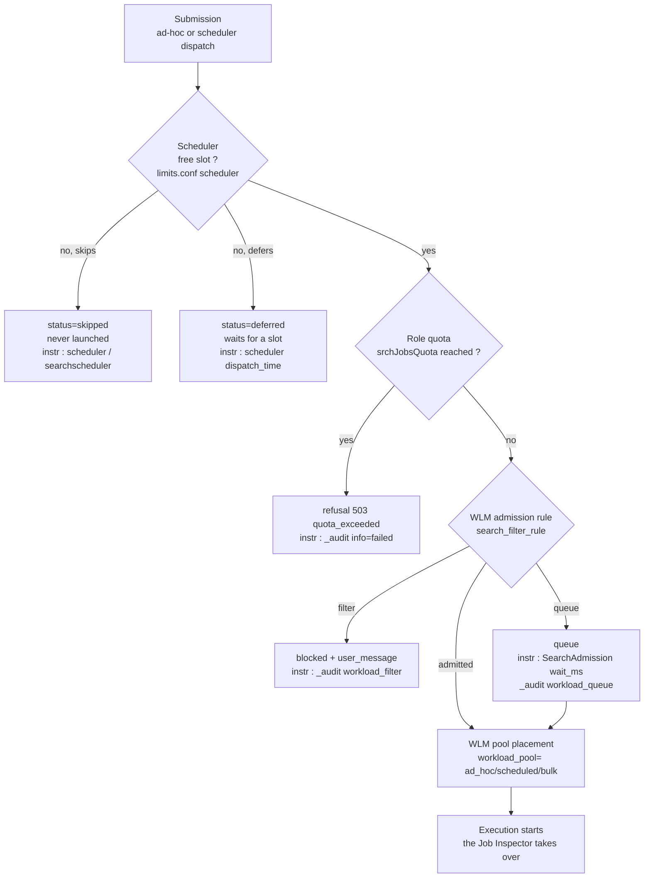

# Chapter 02 — Admission and scheduling (wait time before execution)

> 🇫🇷 **Version française disponible** : [`../02-admission-et-ordonnancement.md`](../02-admission-et-ordonnancement.md)

> **Time stake** — Between the moment a search is submitted and the
> moment it *actually* starts executing, time can elapse
> without a single line of `journal.gz` being read: the scheduler defers or
> skips a saved search for lack of a slot, a Workload Management (WLM)
> admission rule queues it, a role quota rejects it outright. That time does **not**
> read in the Job Inspector — it is invisible for a *skipped* search,
> which has no job. It lives in the `scheduler`, `metrics.log
> group=searchscheduler`, the `SearchAdmission` component and `_audit`. After this
> chapter, you know how to tell a *skipped* saved search from a *slow*
> one, and which setting — cron spreading, concurrency, WLM pool, quota —
> to attack, distinguishing what you do on your own from what is admin-only.

## Mechanical recap

Admission runs on the **search head** (`sh01`), ahead of any fan-out.
Two regulators follow one another, governed by distinct `.conf` files.

The **search scheduler** decides *when* a saved search runs. It has
a bounded number of concurrent search slots (`limits.conf
[scheduler]`: `max_searches_perc`, `base_max_searches`, `max_hist_searches`).
When demand exceeds the slots, it *defers* (`deferred`), *skips*
(`skipped`) or lets *continue* (`continued`) an occurrence — a skip
means the search **never ran**, not that it was slow.

The **Workload Management** decides *whether* and *with what share* an admitted
search runs: the **admission rules** (`search_filter_rule`: `filter`
blocks, `queue` queues) are evaluated before the start, then a
**workload rule** places the search into a pool (`ad_hoc`, `scheduled`,
`bulk`, `accel`, `admin`). Further upstream, RBAC applies the **role
quotas** (`srchJobsQuota`, `srchDiskQuota`): an overrun is a **503 refusal
`quota_exceeded`**, not a wait time. The design of the pools and the WLM
rules is treated in full in the governance handbook (see
*Conditional cross-references*); here we retain only their **time effect** on
a given search.

## Time decomposition of this phase

The "before execution" time splits across a chain where each link has its
instrument, and where two outcomes are not times but refusals.



The cardinal point of attention: **the Job Inspector does not measure the time in
queue.** A job's `elapsedTime` starts when execution begins, after
admission; a *skipped* search does not even have a job to inspect. The
instruments of this phase are therefore elsewhere.

- **`index=_internal sourcetype=scheduler`**: one line per occurrence of a saved
  search, with `status` (`success` / `skipped` / `deferred` / `continued`),
  `scheduled_time` (planned cron time), `dispatch_time` (actual launch
  time), `run_time`, `window_time`. The gap `dispatch_time − scheduled_time`
  **is** the scheduling wait time.
- **`metrics.log group=searchscheduler`**: aggregates per cycle — number of
  searches `dispatched`, `skipped`, `deferred`, and the saturation of the slots
  (see [About metrics.log](https://docs.splunk.com/Documentation/Splunk/9.4/Troubleshooting/Aboutmetricslog)).
- **`SearchAdmission` component** (`index=_internal sourcetype=splunkd
  component=SearchAdmission`): `wait_ms`, the WLM admission latency (p50/p99).
  *Marker observed in `_internal` in 9.x, with no dedicated Splunk documentation
  page: confirm its presence on your instance before making it a normative
  reference (the handbook's citation posture).*
- **`_audit action=search`**: `workload_pool` (effective pool), and the actions
  `workload_queue` / `workload_filter`; a `quota_exceeded` appears there as a
  failure, never as a duration.

## Action levers

- **Lever — spread the crons of the scheduled searches.** Detach the
  schedules from the reflex alignment (`*/5 * * * *`) and let the scheduler
  breathe via `schedule_window` (tolerance window) and `allow_skew` in
  `savedsearches.conf` (`etc/shcluster/apps/<app>/local/` layer pushed by the
  deployer, or `etc/apps/<app>/local/`).
  ```ini
  [rpt_failed_logins]
  cron_schedule = 7,17,27,37,47,57 * * * *
  schedule_window = 5
  allow_skew = 10m
  ```
  - **Expected time effect** — the occurrences spread out instead of
    colliding at the same minute; the scheduler queue drains, the `skipped` and
    `deferred` recede. In 9.x, `schedule_window` lets the scheduler
    delay a non-urgent search to smooth the concurrency (see
    [Configure the priority of scheduled reports](https://docs.splunk.com/Documentation/Splunk/9.4/Report/Configurethepriorityofscheduledreports)).
  - **How to measure it** — `index=_internal sourcetype=scheduler
    status=skipped OR status=deferred` before/after; the gap `dispatch_time −
    scheduled_time` per saved search; `metrics.log group=searchscheduler`.
  - **Boundary** — *self-contained* for your own saved searches.

- **Lever — tune the search concurrency.** Raise the number of concurrent
  search slots via `limits.conf [scheduler]`:
  `max_searches_perc` (share of the total slots reserved for the scheduler),
  `base_max_searches`, and `auto_summary_perc` (share dedicated to accelerations).
  `system/local/` layer or SHC app — out of your reach as a user.
  ```ini
  [scheduler]
  max_searches_perc = 50
  base_max_searches = 6
  ```
  - **Expected time effect** — more simultaneous slots → fewer deferred
    searches, shorter scheduling wait time. Trade-off: beyond
    the real CPU capacity, you do not reduce the wait, you create thrash that
    lengthens *all* searches (see [limits.conf](https://docs.splunk.com/Documentation/Splunk/9.4/Admin/Limitsconf)).
  - **How to measure it** — `skipped/total` ratio in `metrics.log
    group=searchscheduler`; `metrics.log group=search_concurrency` (slots
    occupied vs ceiling).
  - **Boundary** — *admin-only* (`system/local` layer or SHC app). Ask:
    "raise `max_searches_perc`/`base_max_searches` on the SHC, justification:
    N `skipped`/day".

- **Lever — place the search in the right WLM pool.** Route an interactive
  search to `ad_hoc`, a scheduled one to `scheduled`, a long one to
  `bulk`, so that it receives a guaranteed CPU share and does not suffer the
  pressure of the other families at admission.
  - **Expected time effect** — a legitimate search under pressure is admitted
    and served faster when its pool guarantees it a share, instead of sharing
    a single saturated pool. It is the *admission* latency that drops, not the
    execution duration.
  - **How to measure it** — `SearchAdmission wait_ms` (p50/p99) per pool;
    `_audit action=search workload_pool=*` to check the effective placement.
  - **Boundary** — *D3 cross-reference*: the design of the pools is treated in
    [`../../gouvernance-utilisateurs-splunk/EN/06-wlm-search-head-guide.md`](../../gouvernance-utilisateurs-splunk/EN/06-wlm-search-head-guide.md).
    Lever retained here: routing the search to the pool that guarantees its CPU share
    reduces its admission latency, visible in `SearchAdmission wait_ms`.

- **Lever — prefilter with an admission rule.** Set a `search_filter_rule
  action=queue` that queues (instead of refusing) the ad-hoc searches when
  the platform saturates, to **bound the wait of the admitted searches** by
  pushing back the abusive ones.
  ```ini
  [search_filter_rule:queue_on_adhoc_saturation]
  predicate = adhoc_search_percentage>85 AND NOT role=admin_*
  action = queue
  ```
  - **Expected time effect** — under saturation, the priority searches
    keep a bounded admission latency; the excess searches wait
    in the queue rather than contending for resources and lengthening everyone.
  - **How to measure it** — `_audit action=workload_queue` (volume and time
    ranges of queuing); `SearchAdmission wait_ms` on the searches
    admitted during peaks.
  - **Boundary** — *D3 cross-reference*: the admission rules are designed in
    [`../../gouvernance-utilisateurs-splunk/EN/06-wlm-search-head-guide.md`](../../gouvernance-utilisateurs-splunk/EN/06-wlm-search-head-guide.md).
    Lever retained here: a `queue` rule on ad-hoc saturation bounds the wait of the
    legitimate searches, measurable in `_audit action=workload_queue`.

- **Lever — prioritize the critical saved searches.** Raise the scheduling
  priority of a critical report via `schedule_priority` in
  `savedsearches.conf`, so that it goes ahead in the scheduler queue when
  slots are scarce.
  ```ini
  [acc_daily_summary]
  schedule_priority = higher
  ```
  - **Expected time effect** — at equal contention, the priority occurrence is
    dispatched before the others and gets `deferred`/`skipped` less often;
    the gap `dispatch_time − scheduled_time` tightens for it, at the cost of the
    normal-priority searches (see [Configure the priority of scheduled reports](https://docs.splunk.com/Documentation/Splunk/9.4/Report/Configurethepriorityofscheduledreports)).
  - **How to measure it** — `index=_internal sourcetype=scheduler`:
    `dispatch_time` vs `scheduled_time` and `skipped` rate for the targeted saved
    search, before/after.
  - **Boundary** — *self-contained* for `higher` on your own saved searches;
    the `highest` priority requires a dedicated capability → *admin-only* for that
    tier.

- **Lever — adjust the role quotas.** Raise `srchJobsQuota` (number of
  concurrent jobs per role) in the role configuration when legitimate searches
  are **refused** with a 503 under load, rather than executed.
  - **Expected time effect** — removes the 503 `quota_exceeded` refusals that
    force the user to relaunch: the search runs instead of being
    rejected. This is not a latency reduction but the removal of a failure
    (see [About users and roles](https://docs.splunk.com/Documentation/Splunk/9.4/Admin/Aboutusersandroles)).
  - **How to measure it** — `quota_exceeded` occurrences in `_audit
    action=search` (per `user`/`role`), before/after.
  - **Boundary** — *admin-only* (role config, capabilities). Ask:
    "raise `srchJobsQuota` for role `analyst`, justification: N 503 refusals/day".

## Costly anti-patterns

- **Aligning all the scheduled searches on the same minute** (`*/5`, `0 * * * *`). The
  scheduler receives a burst of simultaneous occurrences, saturates its slots and skips
  the surplus. Marker: synchronous spikes of `status=skipped` in
  `sourcetype=scheduler`, saturation in `metrics.log group=searchscheduler`.
  Fix: spread the crons + `schedule_window`.
- **Letting unmastered real-time searches proliferate.** Real-time
  searches bypass part of the scheduler limits and occupy slots
  continuously, starving the historical searches. Marker: `search_mode=realtime`
  frequent in `_audit`, `search_concurrency` slots durably full.
  Fix: frame the real-time (capability, WLM admission rule).
- **Setting a role quota too low.** Under load, the role's legitimate
  searches are refused with a 503 instead of running. Marker: `quota_exceeded` in
  `_audit`. Fix: raise `srchJobsQuota` (admin) or distribute the load.
- **Pushing the concurrency too high "to go faster".** Beyond the CPU
  capacity of the SH, adding slots does not reduce the wait — the CPU thrash
  lengthens *every* search. Marker: high `search_concurrency` *and* execution
  durations that rise across the board. Fix: set the slots on the
  capacity baseline, not above.
- **Confusing a *skipped* search with a *slow* one.** Looking for a
  long execution time in the Job Inspector for a saved search that in fact
  never ran leads to optimizing the wrong thing. Marker: `status=skipped`
  in `sourcetype=scheduler` while no job exists. Fix: read
  the `scheduler` first, not the Job Inspector.

## Worked examples

### A saved search "that produced nothing"

The `rpt_failed_logins` report scheduled every five minutes no longer fills
its dashboard. Frequent reflex: open the Job Inspector — but there is no
job to inspect.

```spl
index=_internal sourcetype=scheduler savedsearch_name="rpt_failed_logins"
    earliest=-24h
| stats count by status
```

What you read in the `scheduler`: a majority of `status=skipped` and
`status=deferred`, and for the `success` occurrences a `dispatch_time` far
later than the `scheduled_time`. The search is not *slow*, it is
*skipped*: the scheduler lacks slots at `*/5`. Self-contained fix:
spread the cron and set `schedule_window`; if the `skipped` persist, ask
for a raise of `max_searches_perc` (admin-only).

### An admission wait time under saturation

At peak hours, ad-hoc searches of the `analyst` role "drag" before
starting.

```spl
index=_internal sourcetype=splunkd component=SearchAdmission earliest=-4h
| stats p50(wait_ms) as p50 p99(wait_ms) as p99 by host
```

What you read in `SearchAdmission` / `_audit`: a `p99(wait_ms)` of several
seconds during peaks, correlated with `action=workload_queue` events in
`_audit`. The time is not in execution (flat Job Inspector) but in the
**admission queue**. Lever: route these searches to a correctly sized
`ad_hoc` pool and set a `queue` admission rule on saturation —
design treated on the governance side.

### A quota refusal taken for a slowdown

A user of the `analyst` role reports a search that "does not respond".

```spl
index=_audit action=search user=alice earliest=-2h
| search info=failed OR reason="*quota*"
| table _time user info reason
```

What you read in `_audit`: `quota_exceeded` lines — the search was
**refused** (503), not executed slowly. The role's `srchJobsQuota` is reached
under load. There is no `elapsedTime` to optimize: the fix is to
raise the role quota (admin-only) or to reduce the number of concurrent jobs
launched by the user.

## Conditional cross-references (D3)

- **Design of the WLM pools and rules (search head)** —
  [`../../gouvernance-utilisateurs-splunk/EN/06-wlm-search-head-guide.md`](../../gouvernance-utilisateurs-splunk/EN/06-wlm-search-head-guide.md).
  The design of the pools, the categories, the admission rules and the workload
  rules (placement, `queue`, `filter`), with its implementation phases and its
  9.4 pitfalls, is treated there in full. Lever retained here: routing a search
  to the pool that guarantees its CPU share, and setting a `queue` admission rule on
  saturation, reduces its admission latency — visible in `SearchAdmission
  wait_ms` and `_audit action=workload_queue`.
- **WLM on the indexers side and distributed mode** —
  [`../../gouvernance-utilisateurs-splunk/EN/07-wlm-indexers-guide.md`](../../gouvernance-utilisateurs-splunk/EN/07-wlm-indexers-guide.md).
  The search peer process consumes indexer resources not bounded by the SH
  pool; regulation on the peers side is designed there in its own right. Fact retained here:
  bounding admission on the SH side does not bound the consumption on the indexer side of the same
  search.

## Sources

- [Splunk Reporting Manual 9.4 — Configure the priority of scheduled reports](https://docs.splunk.com/Documentation/Splunk/9.4/Report/Configurethepriorityofscheduledreports)
- [Splunk Reporting Manual 9.4 — Schedule reports](https://docs.splunk.com/Documentation/Splunk/9.4/Report/Schedulereports)
- [Splunk Admin Manual 9.4 — limits.conf](https://docs.splunk.com/Documentation/Splunk/9.4/Admin/Limitsconf)
- [Splunk Admin Manual 9.4 — savedsearches.conf](https://docs.splunk.com/Documentation/Splunk/9.4/Admin/Savedsearchesconf)
- [Splunk Admin Manual 9.4 — About users and roles](https://docs.splunk.com/Documentation/Splunk/9.4/Admin/Aboutusersandroles)
- [Splunk Troubleshooting Manual 9.4 — About metrics.log](https://docs.splunk.com/Documentation/Splunk/9.4/Troubleshooting/Aboutmetricslog)
- [Splunk Workload Management 9.4 — Overview](https://help.splunk.com/en/splunk-enterprise/administer/manage-workloads/9.4/workload-management-overview)
- [Splunk Workload Management 9.4 — Configure admission rules to prefilter searches](https://help.splunk.com/en/splunk-enterprise/administer/manage-workloads/9.4/configure-workload-management/configure-admission-rules-to-prefilter-searches)
