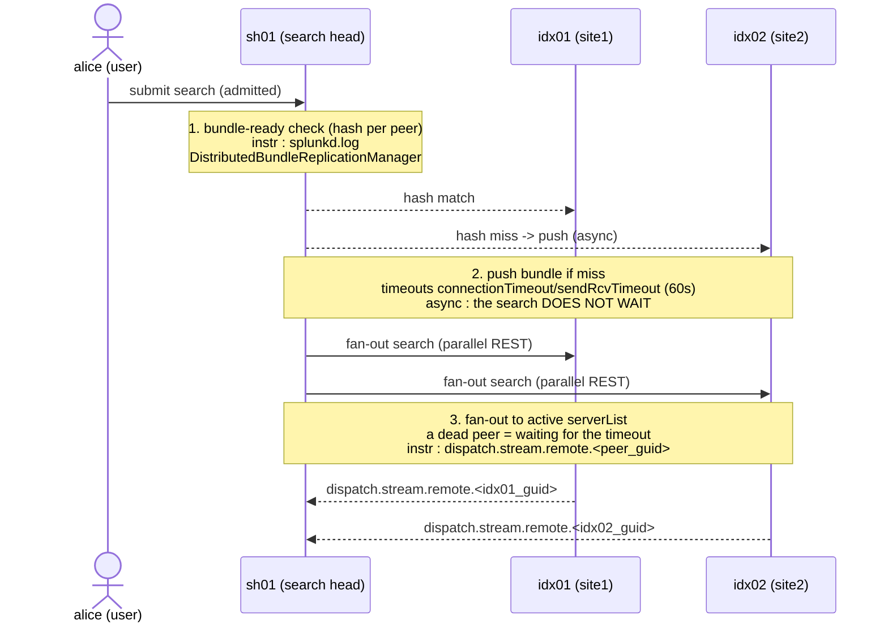

# Chapter 03 — Distribution: bundle readiness, fan-out, context

> 🇫🇷 **Version française disponible** : [`../03-distribution.md`](../03-distribution.md)

> **Time stake** — Between the admission of a search (chapter 02) and the
> start of the map on the peers (chapter 04) sits a short but
> treacherous phase: the search head checks that each peer holds the right knowledge
> bundle, then pushes the search in parallel to all active peers. On
> a healthy LAN this phase weighs a few hundred milliseconds; it explodes
> when a bundle is obese, when a replication timeout runs on a sick
> peer, or when a dead peer stays declared and makes the fan-out timeout wait
> at each search. The symptom reads in `splunkd.log`
> (`DistributedBundleReplicationManager`) and in the `dispatch.stream.remote.<peer_guid>`
> that are absent or at zero in the Job Inspector. After this chapter, you can distinguish a
> pre-map time due to the bundle from a time due to the fan-out, and act on the
> time lever that fits — without re-reading the underlying mechanics of the bundle, treated
> elsewhere.

## Mechanical recap

At submission, the search head (`sh01`) does not immediately push the SPL to the
peers. It first compares, peer by peer, the hash of the current bundle on the SH side to
the one held by the peer. Three outcomes: **match** (the peer is ready, it
continues); **miss with push** (the SH propagates the bundle — classic, cascading or
mounted shared storage — within the limit of the timeouts `connectionTimeout` /
`sendRcvTimeout`, default 60 s each); **miss/timeout** without a completed
propagation. Key point for the time: in 9.x the replication is **asynchronous**
— *"A search will not be prevented from running just because knowledge
replication has not finished"* (see
[Classic knowledge bundle replication](https://docs.splunk.com/Documentation/Splunk/9.4/DistSearch/Classicknowledgebundlereplication)).
A search therefore does not wait for the end of a push: the peer serves with its
**previous bundle**. Once the verification is done for all the peers, the SH
issues a parallel REST **fan-out** to each active peer of the `serverList`
(resolved via the cluster manager `cm01` when `[clustering]` is configured).

The constitution of the bundle (content, hash, full/delta decision) and the three
replication modes are **treated in full** in the knowledge bundle
handbook (cross-references at the end of the chapter); this chapter retains only its
**time levers**. The governing `.conf` is `distsearch.conf`
(`[replicationSettings]`, `[replicationBlacklist]`, `[distributedSearch]`),
set in the `$SPLUNK_HOME/etc/system/local/` layer or, in SHC, in
`etc/shcluster/apps/<app>/local/` distributed by the deployer `dep01`.

## Time decomposition of this phase

The time of the distribution phase splits into three sub-steps, each
with its instrument:



- **Bundle-ready verification** — exchange of metadata (the hash, not the
  content): fast on a healthy LAN. Its cost rises when a replication cycle
  is triggered upstream and logged `WARN` in `splunkd.log`, component
  `DistributedBundleReplicationManager` (duration and failure of the cycle).
- **Bundle push** (on miss) — proportional to the **size** of the bundle and to the
  quality of the link. Asynchronous: it does not directly lengthen `elapsedTime` of the
  current search, but a cycle that drags on every KO modification
  saturates the link and rebounds on all searches. Size visible in
  `$SPLUNK_HOME/var/run/searchpeers/<sh_guid>-<epoch>-<hash>.bundle`.
- **Fan-out** — parallel REST call, small by nature. The time pitfall is
  not its size but the **wait for an unreachable peer**: a declared but
  dead peer makes the timeout wait at every search. The Job Inspector betrays it
  by a `dispatch.stream.remote.<peer_guid>` **absent or null** for that peer,
  while `| rest /services/search/distributed/peers` shows it in a degraded state.

The cardinal reading rule of this phase: if the time is **before** the
first `dispatch.stream.remote`, look on the bundle/fan-out side (`splunkd.log`,
peer state); if it is **within** the `dispatch.stream.remote`, the time is in
map — you are at chapter 04, not here.

## Action levers

- **Lever — limit the knowledge bundle size** (`distsearch.conf`,
  `[replicationSettings] maxBundleSize`, in MB, `etc/system/local/` layer or SHC
  app).
  - **Expected time effect** — in 9.x, a smaller bundle serializes, hashes
    and pushes faster; the replication cycle shortens and the link
    stays free for the other cycles. Splunk recommends **reducing** rather
    than raising the limit (see
    [Limit the knowledge bundle size](https://docs.splunk.com/Documentation/Splunk/9.4/DistSearch/Limittheknowledgebundlesize)).
  - **How to measure it** — size of the file under
    `var/run/searchpeers/` before/after; cycle duration in `splunkd.log`
    component `DistributedBundleReplicationManager`.
  - **Boundary** — *self-contained* for the `maxBundleSize` setting; *D3 cross-reference*
    for the full/delta mechanics.

- **Lever — move the large lookups out of the bundle** (`[replicationBlacklist]` in
  `distsearch.conf`; or migration of the lookup to KV Store / local lookup on
  the peers).
  - **Expected time effect** — a bulky embedded CSV lookup is replicated
    to every peer, on every cycle; excluding it attacks the most frequent cause
    of an obese bundle and shortens the pre-fan-out verification by as much (see
    [Limit the knowledge bundle size](https://docs.splunk.com/Documentation/Splunk/9.4/DistSearch/Limittheknowledgebundlesize)).
  - **How to measure it** — inventory of the replicated lookups vs size of the
    bundle; cycle duration in `splunkd.log`.
  - **Boundary** — *admin-only* (app packaging, KV Store) → ask
    "externalize the `assets.csv` lookup out of the knowledge bundle (blacklist
    or KV Store)".

- **Lever — choose the replication mode suited to the topology**: `classic`
  by default; `cascading` beyond about 15-20 peers (the SH no longer pushes
  to all); `mounted` on shared storage for a larger fleet.
  - **Expected time effect** — in 9.x, cascading brings the push cost from
    O(SH × peers) to O(SH + peers), relieving the link at scale; mounted
    removes the network push at the price of an NFS dependency (see
    [Cascading knowledge bundle replication](https://docs.splunk.com/Documentation/Splunk/9.4/DistSearch/Cascadingknowledgebundlereplication)).
  - **How to measure it** — propagation duration per cycle in `splunkd.log`
    (`DistributedBundleReplicationManager`) before/after switching.
  - **Boundary** — *D3 cross-reference*: the choice and the tuning of the three modes are
    treated in full in the knowledge bundle handbook; the lever retained here
    is *choosing the mode for the propagation time*, not designing the
    topology.

- **Lever — knowingly tune the timeouts** (`connectionTimeout`,
  `sendRcvTimeout` in `[replicationSettings]`, default 60 s).
  - **Expected time effect** — time vs consistency trade-off: a timeout too
    long makes the cycle wait on a sick peer; too short makes a stale bundle be
    served more often (silently inconsistent results). The
    replication staying asynchronous, these timeouts bound the **cycle**, not the
    search itself (see
    [distsearch.conf](https://docs.splunk.com/Documentation/Splunk/9.4/Admin/Distsearchconf)).
  - **How to measure it** — occurrences of
    `WARN DistributedBundleReplicationManager … took too long` in `splunkd.log`
    and the named peer.
  - **Boundary** — *self-contained* (`.conf` setting); diagnose the
    network/peer cause **before** masking it with a longer timeout.

- **Lever — keep the `serverList` / the peer inventory clean**: remove an
  out-of-service peer from the list (or let the CM `cm01` resolve it
  dynamically via `[clustering]` rather than a hardcoded `servers=`).
  - **Expected time effect** — a dead peer left declared makes the
    fan-out timeout wait at **every** search: it is a fixed, silent and
    recurring overhead, independent of the data volume (see
    [Configure distributed search](https://docs.splunk.com/Documentation/Splunk/9.4/DistSearch/Configuredistributedsearch)).
  - **How to measure it** — `| rest /services/search/distributed/peers` (status
    `Up`/`Down`/`Quarantined`); `dispatch.stream.remote.<peer_guid>` absent or
    null for the offending peer in the Job Inspector.
  - **Boundary** — *self-contained* for reading the state and cleaning a
    hardcoded `servers=`; *admin-only* if the peer must be decommissioned on the
    cluster (CM) side.

## Costly anti-patterns

- **Embedding a large CSV lookup in the bundle.** It is replicated to each
  peer on every cycle, swelling verification and push. Marker: high size
  under `var/run/searchpeers/`, long cycles in `splunkd.log`. Fix:
  `[replicationBlacklist]` or KV Store.
- **Leaving an out-of-service peer in the `serverList`.** Each fan-out waits its
  timeout. Marker: `dispatch.stream.remote.<peer_guid>` missing/null,
  `status=Down` in `| rest /services/search/distributed/peers`. Fix:
  clean the list or delegate the resolution to the CM.
- **Reissuing the search in a loop during an ongoing push.** The replication
  being asynchronous, reissuing speeds up nothing and multiplies the concurrent cycles
  on the link. Marker: burst of `DistributedBundleReplicationManager` lines.
  Fix: let the cycle finish; the peer already serves with its previous
  bundle.
- **Raising `maxBundleSize` instead of reducing the bundle.** The bigger bundle
  clogs on the link, the propagation lengthens. Marker: cycle that
  lengthens after the raise. Fix: reduce first (blacklist,
  externalization); raise only as a last resort, symmetrically on the peer
  side.
- **Concluding "bundle" while the time is in map.** Blaming the
  distribution without having looked at the `dispatch.stream.remote`. Marker:
  clean `splunkd.log` bundle but high `dispatch.stream.remote.<peer_guid>`.
  Fix: measure the verification/fan-out split **vs** map (distinction
  treated step by step in the knowledge bundle handbook).

## Worked examples

### A pre-map time due to an obese bundle

A platform sees all its distributed searches start with a delay
before the first result. Diagnostic SPL of the replication cycle:

```spl
index=_internal sourcetype=splunkd component=DistributedBundleReplicationManager
    earliest=-1h@m latest=now
| stats latest(_time) as last_seen count by host, log_level
| sort - last_seen
```

What you read in the Job Inspector and in the logs: `elapsedTime` includes a delay
**before** any `dispatch.stream.remote`; `splunkd.log` shows long
`DistributedBundleReplicationManager` cycles, and the file under
`var/run/searchpeers/<sh_guid>-<epoch>-<hash>.bundle` is bulky. The time is
**on the bundle side**, not map: apply the size lever (blacklist of the large lookup,
or `maxBundleSize` revised downward after reduction).

### A dead peer that taxes each fan-out

On a multisite `site1`/`site2`, a search systematically starts with
a fixed latency independent of the time range. You query the state of the peers:

```spl
| rest /services/search/distributed/peers
| table title, peerType, status, disabled
```

What you read: a peer (e.g. `idx03`) appears in `status=Down`;
in the Job Inspector, `dispatch.stream.remote.<idx03_guid>` is **absent** while
`dispatch.stream.remote.<idx01_guid>` and `<idx02_guid>` are normal. The time is
neither in bundle nor in map: it is the **wait for the fan-out timeout** to a dead
peer. Lever: remove `idx03` from the `serverList` (or let `cm01` resolve
the list), do not touch the replication timeouts, which are not at fault here.

### Distinguish bundle and fan-out in one reading

```text
2026-07-26 10:15:02.451 +0000 WARN  DistributedBundleReplicationManager - bundle replication to 1 peer(s) took too long
```

What you read: a `WARN` line with a named peer designates a **failed push
cycle** (size/timeouts/mode lever); conversely, a clean `splunkd.log`
but an absent `dispatch.stream.remote.<peer_guid>` designates an **unreachable peer
at fan-out** (`serverList` hygiene lever). Two instruments, two levers, one
single phase.

## Conditional cross-references (D3)

- **Full sequence verification → fan-out → map → reduce** —
  [`../../splunk-shc-knowledge-bundle/EN/04-distributed-search-sequence.md`](../../splunk-shc-knowledge-bundle/EN/04-distributed-search-sequence.md).
  The sequence is described there step by step from the "where does the bundle block" angle; the
  lever retained here is: measure the verification/fan-out split **before**
  blaming the bundle, and read `dispatch.stream.remote` to arbitrate
  bundle vs map.
- **Bundle constitution: content, hash, full/delta, `replicationBlacklist`** —
  [`../../splunk-shc-knowledge-bundle/EN/02-knowledge-bundle-constitution.md`](../../splunk-shc-knowledge-bundle/EN/02-knowledge-bundle-constitution.md).
  The constitution and the filtering are treated there in full; the lever retained here
  is: reducing the bundle size (blacklist, externalization of the lookups)
  shortens the pre-fan-out verification, measurable in `splunkd.log`
  `DistributedBundleReplicationManager`.
- **Replication modes classic / cascading / mounted** —
  [`../../splunk-shc-knowledge-bundle/EN/03-replication-to-peers.md`](../../splunk-shc-knowledge-bundle/EN/03-replication-to-peers.md).
  The choice, the tuning and the trade-offs of the three modes are treated there in full
  ; the lever retained here is: choosing the mode *for the propagation
  time* (cascading beyond ~15-20 peers, mounted at larger
  scale), measured by the cycle duration in `splunkd.log`.

## Sources

- [Splunk Distributed Search Manual 9.4 — About distributed search](https://docs.splunk.com/Documentation/Splunk/9.4/DistSearch/Aboutdistributedsearch)
- [Splunk Distributed Search Manual 9.4 — Knowledge bundle replication](https://docs.splunk.com/Documentation/Splunk/9.4/DistSearch/Knowledgebundlereplication)
- [Splunk Distributed Search Manual 9.4 — Limit the knowledge bundle size](https://docs.splunk.com/Documentation/Splunk/9.4/DistSearch/Limittheknowledgebundlesize)
- [Splunk Distributed Search Manual 9.4 — Classic knowledge bundle replication](https://docs.splunk.com/Documentation/Splunk/9.4/DistSearch/Classicknowledgebundlereplication)
- [Splunk Distributed Search Manual 9.4 — Cascading knowledge bundle replication](https://docs.splunk.com/Documentation/Splunk/9.4/DistSearch/Cascadingknowledgebundlereplication)
- [Splunk Distributed Search Manual 9.4 — Mounted knowledge bundle replication](https://docs.splunk.com/Documentation/Splunk/9.4/DistSearch/Mountedknowledgebundlereplication)
- [Splunk Distributed Search Manual 9.4 — Troubleshoot knowledge bundle replication](https://docs.splunk.com/Documentation/Splunk/9.4/DistSearch/Troubleshootknowledgebundlereplication)
- [Splunk Distributed Search Manual 9.4 — Configure distributed search](https://docs.splunk.com/Documentation/Splunk/9.4/DistSearch/Configuredistributedsearch)
- [Splunk Admin Manual 9.4 — distsearch.conf](https://docs.splunk.com/Documentation/Splunk/9.4/Admin/Distsearchconf)
- [Splunk Search Manual 9.4 — Use the Job Inspector](https://docs.splunk.com/Documentation/Splunk/9.4/Search/ViewsearchjobpropertieswiththeJobInspector)
- [Splunk Splexicon — Knowledge bundle](https://docs.splunk.com/Splexicon:Knowledgebundle)
